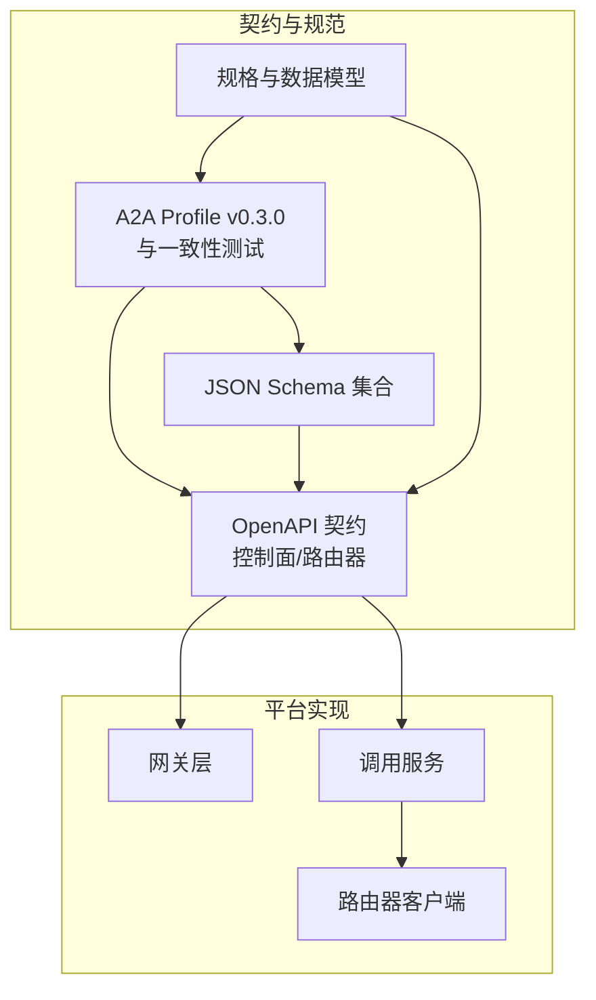
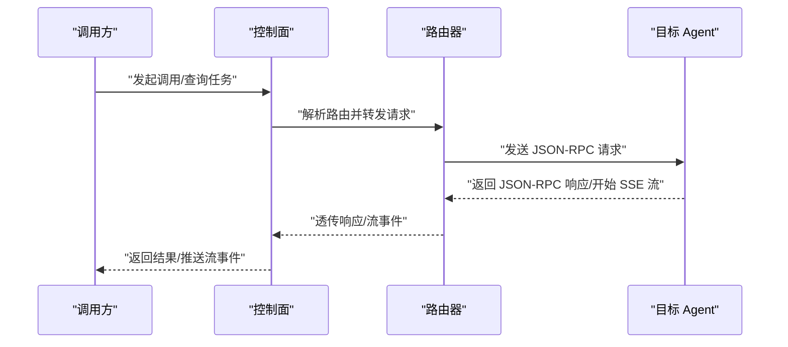
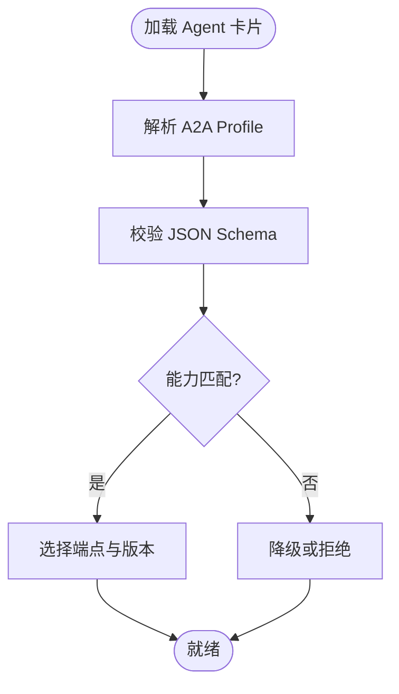
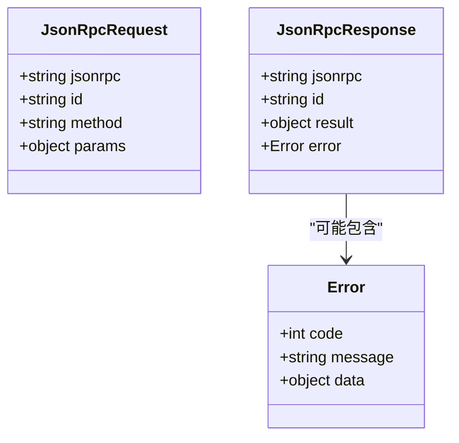
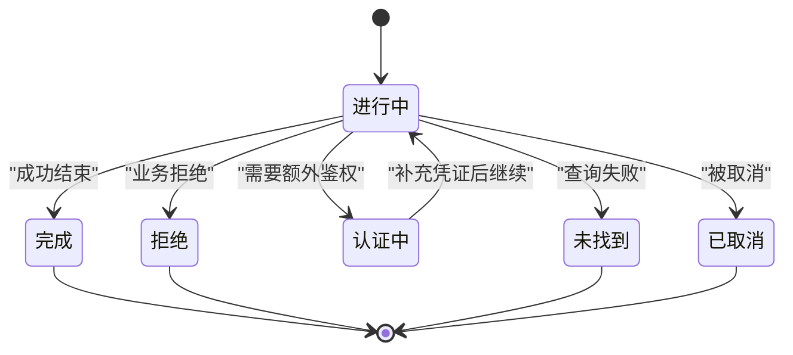
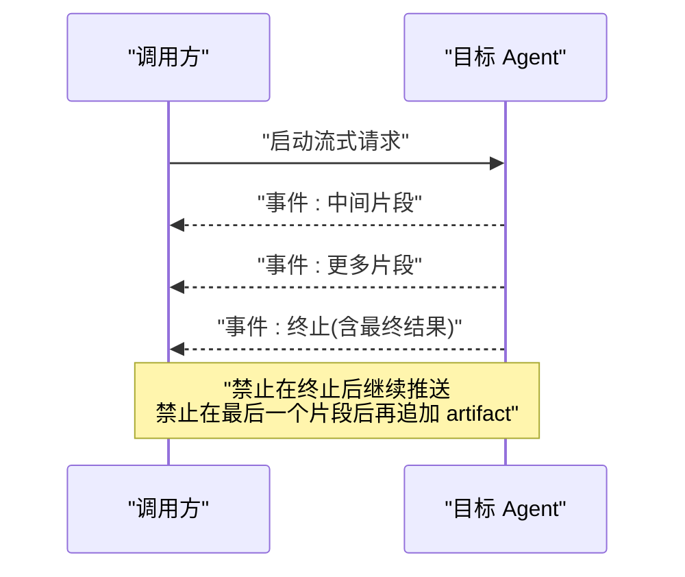
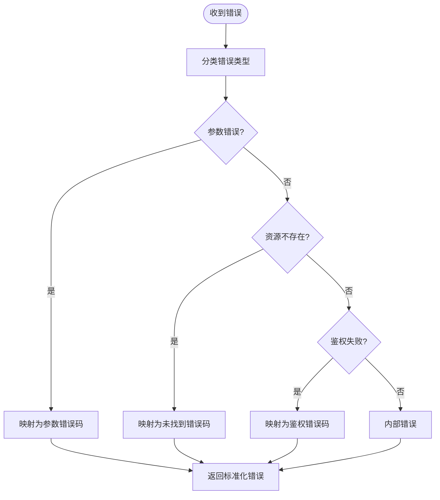
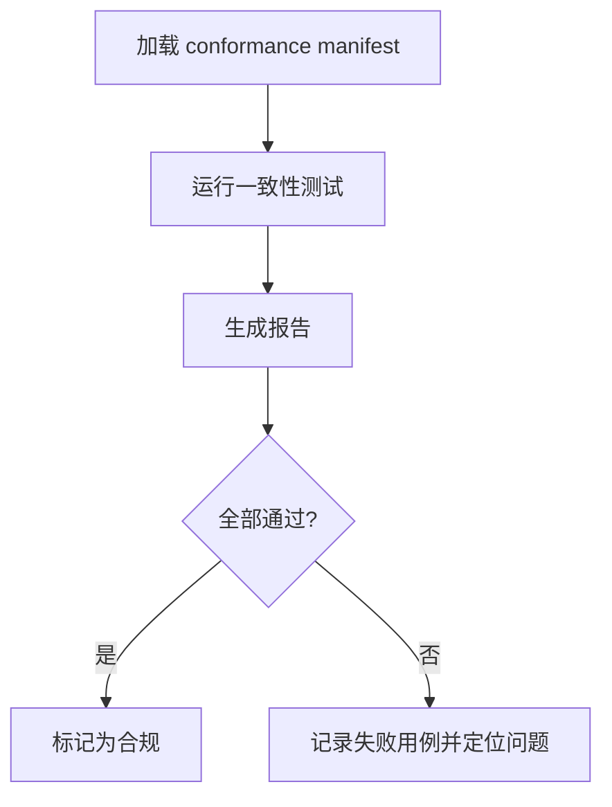
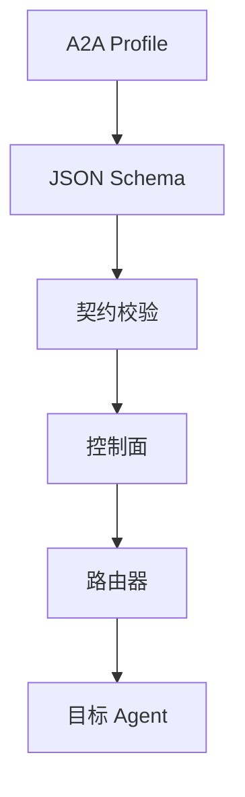

# A2A 协议

<cite>
**本文引用的文件**   
- [contracts/a2a-profile/v0.3.0.json](file://contracts/a2a-profile/v0.3.0.json)
- [contracts/a2a-profile/v0.3.0/conformance/manifest.json](file://contracts/a2a-profile/v0.3.0/conformance/manifest.json)
- [contracts/a2a-profile/v0.3.0/conformance/message-send-request.json](file://contracts/a2a-profile/v0.3.0/conformance/message-send-request.json)
- [contracts/a2a-profile/v0.3.0/conformance/message-stream-request.json](file://contracts/a2a-profile/v0.3.0/conformance/message-stream-request.json)
- [contracts/a2a-profile/v0.3.0/conformance/tasks-get-request.json](file://contracts/a2a-profile/v0.3.0/conformance/tasks-get-request.json)
- [contracts/a2a-profile/v0.3.0/conformance/tasks-cancel-request.json](file://contracts/a2a-profile/v0.3.0/conformance/tasks-cancel-request.json)
- [contracts/a2a-profile/v0.3.0/conformance/message-stream-valid.sse](file://contracts/a2a-profile/v0.3.0/conformance/message-stream-valid.sse)
- [contracts/a2a-profile/v0.3.0/conformance/message-stream-artifact-after-last-chunk.sse](file://contracts/a2a-profile/v0.3.0/conformance/message-stream-artifact-after-last-chunk.sse)
- [contracts/a2a-profile/v0.3.0/conformance/message-stream-context-mismatch.sse](file://contracts/a2a-profile/v0.3.0/conformance/message-stream-context-mismatch.sse)
- [contracts/a2a-profile/v0.3.0/conformance/message-stream-eof-without-terminal.sse](file://contracts/a2a-profile/v0.3.0/conformance/message-stream-eof-without-terminal.sse)
- [contracts/a2a-profile/v0.3.0/conformance/message-stream-event-after-terminal.sse](file://contracts/a2a-profile/v0.3.0/conformance/message-stream-event-after-terminal.sse)
- [contracts/a2a-profile/v0.3.0/conformance/message-send-message-response.json](file://contracts/a2a-profile/v0.3.0/conformance/message-send-message-response.json)
- [contracts/a2a-profile/v0.3.0/conformance/message-send-task-response.json](file://contracts/a2a-profile/v0.3.0/conformance/message-send-task-response.json)
- [contracts/a2a-profile/v0.3.0/conformance/tasks-get-response.json](file://contracts/a2a-profile/v0.3.0/conformance/tasks-get-response.json)
- [contracts/a2a-profile/v0.3.0/conformance/tasks-cancel-response.json](file://contracts/a2a-profile/v0.3.0/conformance/tasks-cancel-response.json)
- [contracts/a2a-profile/v0.3.0/conformance/invalid-jsonrpc-version-response.json](file://contracts/a2a-profile/v0.3.0/conformance/invalid-jsonrpc-version-response.json)
- [contracts/a2a-profile/v0.3.0/conformance/invalid-result-and-error-response.json](file://contracts/a2a-profile/v0.3.0/conformance/invalid-result-and-error-response.json)
- [contracts/a2a-profile/v0.3.0/conformance/invalid-missing-result-and-error-response.json](file://contracts/a2a-profile/v0.3.0/conformance/invalid-missing-result-and-error-response.json)
- [contracts/a2a-profile/v0.3.0/conformance/invalid-array-response-id-response.json](file://contracts/a2a-profile/v0.3.0/conformance/invalid-array-response-id-response.json)
- [contracts/a2a-profile/v0.3.0/conformance/invalid-boolean-response-id-response.json](file://contracts/a2a-profile/v0.3.0/conformance/invalid-boolean-response-id-response.json)
- [contracts/a2a-profile/v0.3.0/conformance/invalid-object-response-id-response.json](file://contracts/a2a-profile/v0.3.0/conformance/invalid-object-response-id-response.json)
- [contracts/a2a-profile/v0.3.0/conformance/message-send-empty-id-response.json](file://contracts/a2a-profile/v0.3.0/conformance/message-send-empty-id-response.json)
- [contracts/a2a-profile/v0.3.0/conformance/message-send-invalid-kind-response.json](file://contracts/a2a-profile/v0.3.0/conformance/message-send-invalid-kind-response.json)
- [contracts/a2a-profile/v0.3.0/conformance/message-send-no-parts-response.json](file://contracts/a2a-profile/v0.3.0/conformance/message-send-no-parts-response.json)
- [contracts/a2a-profile/v0.3.0/conformance/message-send-user-role-response.json](file://contracts/a2a-profile/v0.3.0/conformance/message-send-user-role-response.json)
- [contracts/a2a-profile/v0.3.0/conformance/tasks-get-not-found-response.json](file://contracts/a2a-profile/v0.3.0/conformance/tasks-get-not-found-response.json)
- [contracts/a2a-profile/v0.3.0/conformance/tasks-get-rejected-response.json](file://contracts/a2a-profile/v0.3.0/conformance/tasks-get-rejected-response.json)
- [contracts/a2a-profile/v0.3.0/conformance/tasks-get-auth-required-response.json](file://contracts/a2a-profile/v0.3.0/conformance/tasks-get-auth-required-response.json)
- [contracts/a2a-profile/v0.3.0/conformance/tasks-get-zero-task-response.json](file://contracts/a2a-profile/v0.3.0/conformance/tasks-get-zero-task-response.json)
- [contracts/a2a-profile/v0.3.0/conformance/tasks-cancel-not-found-response.json](file://contracts/a2a-profile/v0.3.0/conformance/tasks-cancel-not-found-response.json)
- [contracts/a2a-profile/v0.3.0/conformance/tasks-cancel-not-cancelable-response.json](file://contracts/a2a-profile/v0.3.0/conformance/tasks-cancel-not-cancelable-response.json)
- [contracts/a2a-profile/v0.3.0/conformance/context-headers.json](file://contracts/a2a-profile/v0.3.0/conformance/context-headers.json)
- [contracts/a2a-profile/v0.2/schema/a2a-profile.v0.2.schema.json](file://contracts/schemas/a2a-profile.v0.2.schema.json)
- [contracts/a2a-profile/v0.3.0/schema/a2a-profile.v0.3.0.schema.json](file://contracts/schemas/a2a-profile.v0.3.0.schema.json)
- [contracts/common.v1.schema.json](file://contracts/schemas/common.v1.schema.json)
- [contracts/platform-error.v4.schema.json](file://contracts/schemas/platform-error.v4.schema.json)
- [contracts/openapi/router-agent.v1.yaml](file://contracts/openapi/router-agent.v1.yaml)
- [contracts/openapi/control-plane-invocation.v4.yaml](file://contracts/openapi/control-plane-invocation.v4.yaml)
- [contracts/openapi/control-plane.v2.yaml](file://contracts/openapi/control-plane.v2.yaml)
- [contracts/openapi/control-plane.v3.yaml](file://contracts/openapi/control-plane.v3.yaml)
- [contracts/openapi/control-plane.v1.yaml](file://contracts/openapi/control-plane.v1.yaml)
- [contracts/openapi/router-internal.v1.yaml](file://contracts/openapi/router-internal.v1.yaml)
- [contracts/openapi/router-internal.v2.yaml](file://contracts/openapi/router-internal.v2.yaml)
- [contracts/openapi/router-internal.v3.yaml](file://contracts/openapi/router-internal.v3.yaml)
- [contracts/a2a_profile_conformance_test.go](file://contracts/a2a_profile_conformance_test.go)
- [contracts/a2a_profile_v02.go](file://contracts/a2a_profile_v02.go)
- [contracts/contracts.go](file://contracts/contracts.go)
- [contracts/validate.go](file://contracts/validate.go)
- [specs/001-complete-invocation-contracts/spec.md](file://specs/001-complete-invocation-contracts/spec.md)
- [specs/001-complete-invocation-contracts/data-model.md](file://specs/001-complete-invocation-contracts/data-model.md)
- [specs/001-complete-invocation-contracts/quickstart.md](file://specs/001-complete-invocation-contracts/quickstart.md)
- [specs/001-complete-invocation-contracts/contracts/a2a-conformance.md](file://specs/001-complete-invocation-contracts/contracts/a2a-conformance.md)
- [specs/001-complete-invocation-contracts/contracts/result-delivery.md](file://specs/001-complete-invocation-contracts/contracts/result-delivery.md)
- [specs/001-complete-invocation-contracts/plan.md](file://specs/001-complete-invocation-contracts/plan.md)
- [specs/001-complete-invocation-contracts/research.md](file://specs/001-complete-invocation-contracts/research.md)
- [specs/001-complete-invocation-contracts/tasks.md](file://specs/001-complete-invocation-contracts/tasks.md)
- [specs/011-invocation-runtime-contracts/spec.md](file://specs/011-invocation-runtime-contracts/spec.md)
- [specs/011-invocation-runtime-contracts/contracts/runtime-contract.md](file://specs/011-invocation-runtime-contracts/contracts/runtime-contract.md)
- [specs/011-invocation-runtime-contracts/data-model.md](file://specs/011-invocation-runtime-contracts/data-model.md)
- [specs/011-invocation-runtime-contracts/plan.md](file://specs/011-invocation-runtime-contracts/plan.md)
- [specs/011-invocation-runtime-contracts/quickstart.md](file://specs/011-invocation-runtime-contracts/quickstart.md)
- [specs/011-invocation-runtime-contracts/research.md](file://specs/011-invocation-runtime-contracts/research.md)
- [specs/011-invocation-runtime-contracts/tasks.md](file://specs/011-invocation-runtime-contracts/tasks.md)
- [specs/019-agent-sdk-nested-invocation/spec.md](file://specs/019-agent-sdk-nested-invocation/spec.md)
- [specs/019-agent-sdk-nested-invocation/data-model.md](file://specs/019-agent-sdk-nested-invocation/data-model.md)
- [specs/019-agent-sdk-nested-invocation/plan.md](file://specs/019-agent-sdk-nested-invocation/plan.md)
- [specs/019-agent-sdk-nested-invocation/quickstart.md](file://specs/019-agent-sdk-nested-invocation/quickstart.md)
- [specs/019-agent-sdk-nested-invocation/research.md](file://specs/019-agent-sdk-nested-invocation/research.md)
- [specs/019-agent-sdk-nested-invocation/tasks.md](file://specs/019-agent-sdk-nested-invocation/tasks.md)
- [apps/control-plane/internal/gateway/errors.go](file://apps/control-plane/internal/gateway/errors.go)
- [apps/control-plane/internal/gateway/invocation_handler.go](file://apps/control-plane/internal/gateway/invocation_handler.go)
- [apps/control-plane/internal/invocation/service.go](file://apps/control-plane/internal/invocation/service.go)
- [apps/control-plane/internal/invocation/router_client.go](file://apps/control-plane/internal/invocation/router_client.go)
</cite>

## 目录
1. [简介](#简介)
2. [项目结构](#项目结构)
3. [核心组件](#核心组件)
4. [架构总览](#架构总览)
5. [详细组件分析](#详细组件分析)
6. [依赖关系分析](#依赖关系分析)
7. [性能考虑](#性能考虑)
8. [故障排查指南](#故障排查指南)
9. [结论](#结论)
10. [附录](#附录)

## 简介
本文件为 NeKiro 平台的 Agent-to-Agent（A2A）通信协议提供完整技术文档。内容覆盖：
- 连接建立与发现、消息格式、事件类型与生命周期管理
- JSON-RPC 消息结构、任务管理、流式传输与错误处理
- 协议一致性测试用例、合规性验证与调试工具使用指南
- Agent 开发者集成示例与最佳实践
- 协议版本演进、兼容性矩阵与迁移路径

A2A 协议基于 JSON-RPC，面向 Agent 间调用与结果投递，支持同步请求/响应与 SSE 流式结果。平台通过控制面与路由器进行编排与路由，Agent 以卡片描述能力并通过 Profile 暴露端点。

## 项目结构
仓库中与 A2A 协议相关的契约、规范与实现主要分布在以下位置：
- contracts/a2a-profile：A2A Profile 定义与 v0.3.0 一致性测试套件
- contracts/schemas：JSON Schema 定义（Profile、Common、Platform Error 等）
- contracts/openapi：控制面与路由器 OpenAPI 契约
- specs：需求规格与数据模型说明（包括 A2A 一致性、结果投递、运行时契约等）
- apps/control-plane：网关与调用服务实现（用于理解端到端流程与错误映射）

图表来源
- [contracts/a2a-profile/v0.3.0.json](file://contracts/a2a-profile/v0.3.0.json)
- [contracts/schemas/a2a-profile.v0.3.0.schema.json](file://contracts/schemas/a2a-profile.v0.3.0.schema.json)
- [contracts/openapi/router-agent.v1.yaml](file://contracts/openapi/router-agent.v1.yaml)
- [contracts/openapi/control-plane-invocation.v4.yaml](file://contracts/openapi/control-plane-invocation.v4.yaml)
- [specs/001-complete-invocation-contracts/spec.md](file://specs/001-complete-invocation-contracts/spec.md)

章节来源
- [contracts/a2a-profile/v0.3.0.json](file://contracts/a2a-profile/v0.3.0.json)
- [contracts/a2a-profile/v0.3.0/conformance/manifest.json](file://contracts/a2a-profile/v0.3.0/conformance/manifest.json)
- [contracts/schemas/a2a-profile.v0.3.0.schema.json](file://contracts/schemas/a2a-profile.v0.3.0.schema.json)
- [contracts/openapi/router-agent.v1.yaml](file://contracts/openapi/router-agent.v1.yaml)
- [specs/001-complete-invocation-contracts/spec.md](file://specs/001-complete-invocation-contracts/spec.md)

## 核心组件
- A2A Profile：描述 Agent 的端点、能力与支持的协议版本，供发现与路由使用。
- JSON-RPC 消息：统一的请求/响应/通知结构，包含 id、method、params、result/error 等字段。
- 任务管理：创建、查询、取消任务；状态机涵盖进行中、完成、拒绝、认证中、未找到等。
- 流式传输：SSE 推送中间片段与最终结果，要求上下文一致、终止事件明确。
- 错误处理：遵循平台错误模型，区分参数校验、资源不存在、权限不足、内部错误等。
- 一致性测试：针对消息结构、事件顺序、边界条件的自动化用例集。

章节来源
- [contracts/a2a-profile/v0.3.0/conformance/manifest.json](file://contracts/a2a-profile/v0.3.0/conformance/manifest.json)
- [contracts/a2a-profile/v0.3.0/conformance/message-send-request.json](file://contracts/a2a-profile/v0.3.0/conformance/message-send-request.json)
- [contracts/a2a-profile/v0.3.0/conformance/message-stream-request.json](file://contracts/a2a-profile/v0.3.0/conformance/message-stream-request.json)
- [contracts/a2a-profile/v0.3.0/conformance/tasks-get-request.json](file://contracts/a2a-profile/v0.3.0/conformance/tasks-get-request.json)
- [contracts/a2a-profile/v0.3.0/conformance/tasks-cancel-request.json](file://contracts/a2a-profile/v0.3.0/conformance/tasks-cancel-request.json)

## 架构总览
A2A 协议在平台中的端到端交互如下：
- 调用方通过控制面发起调用或查询任务
- 控制面根据 Agent 卡片与路由策略选择目标 Agent
- 路由器将请求转发至目标 Agent 的 A2A 端点
- Agent 返回 JSON-RPC 响应或通过 SSE 推送流式结果
- 控制面聚合并回传给调用方

图表来源
- [contracts/openapi/control-plane-invocation.v4.yaml](file://contracts/openapi/control-plane-invocation.v4.yaml)
- [contracts/openapi/router-agent.v1.yaml](file://contracts/openapi/router-agent.v1.yaml)
- [contracts/a2a-profile/v0.3.0/conformance/message-send-request.json](file://contracts/a2a-profile/v0.3.0/conformance/message-send-request.json)
- [contracts/a2a-profile/v0.3.0/conformance/message-stream-valid.sse](file://contracts/a2a-profile/v0.3.0/conformance/message-stream-valid.sse)

## 详细组件分析

### A2A Profile 与发现
- Profile 描述 Agent 的端点、能力、支持的协议版本与鉴权方式
- 控制面与路由器依据 Profile 进行能力匹配与路由决策
- 版本化：v0.2 与 v0.3.0 并存，Schema 与语义规则随版本演进

图表来源
- [contracts/a2a-profile/v0.3.0.json](file://contracts/a2a-profile/v0.3.0.json)
- [contracts/schemas/a2a-profile.v0.3.0.schema.json](file://contracts/schemas/a2a-profile.v0.3.0.schema.json)
- [contracts/schemas/a2a-profile.v0.2.schema.json](file://contracts/schemas/a2a-profile.v0.2.schema.json)

章节来源
- [contracts/a2a-profile/v0.3.0.json](file://contracts/a2a-profile/v0.3.0.json)
- [contracts/a2a-profile/v0.3.0/conformance/manifest.json](file://contracts/a2a-profile/v0.3.0/conformance/manifest.json)
- [contracts/schemas/a2a-profile.v0.3.0.schema.json](file://contracts/schemas/a2a-profile.v0.3.0.schema.json)
- [contracts/schemas/a2a-profile.v0.2.schema.json](file://contracts/schemas/a2a-profile.v0.2.schema.json)

### JSON-RPC 消息结构
- 请求/响应必须包含 jsonrpc 版本、id、method、params（可选）、result 或 error（二选一）
- 常见方法：message/send、tasks/get、tasks/cancel
- 响应约束：result 与 error 互斥；id 必须为非空字符串；jsonrpc 版本需符合约定

图表来源
- [contracts/a2a-profile/v0.3.0/conformance/message-send-request.json](file://contracts/a2a-profile/v0.3.0/conformance/message-send-request.json)
- [contracts/a2a-profile/v0.3.0/conformance/message-send-message-response.json](file://contracts/a2a-profile/v0.3.0/conformance/message-send-message-response.json)
- [contracts/a2a-profile/v0.3.0/conformance/invalid-jsonrpc-version-response.json](file://contracts/a2a-profile/v0.3.0/conformance/invalid-jsonrpc-version-response.json)
- [contracts/a2a-profile/v0.3.0/conformance/invalid-result-and-error-response.json](file://contracts/a2a-profile/v0.3.0/conformance/invalid-result-and-error-response.json)
- [contracts/a2a-profile/v0.3.0/conformance/invalid-missing-result-and-error-response.json](file://contracts/a2a-profile/v0.3.0/conformance/invalid-missing-result-and-error-response.json)
- [contracts/a2a-profile/v0.3.0/conformance/invalid-array-response-id-response.json](file://contracts/a2a-profile/v0.3.0/conformance/invalid-array-response-id-response.json)
- [contracts/a2a-profile/v0.3.0/conformance/invalid-boolean-response-id-response.json](file://contracts/a2a-profile/v0.3.0/conformance/invalid-boolean-response-id-response.json)
- [contracts/a2a-profile/v0.3.0/conformance/invalid-object-response-id-response.json](file://contracts/a2a-profile/v0.3.0/conformance/invalid-object-response-id-response.json)
- [contracts/a2a-profile/v0.3.0/conformance/message-send-empty-id-response.json](file://contracts/a2a-profile/v0.3.0/conformance/message-send-empty-id-response.json)
- [contracts/a2a-profile/v0.3.0/conformance/message-send-invalid-kind-response.json](file://contracts/a2a-profile/v0.3.0/conformance/message-send-invalid-kind-response.json)
- [contracts/a2a-profile/v0.3.0/conformance/message-send-no-parts-response.json](file://contracts/a2a-profile/v0.3.0/conformance/message-send-no-parts-response.json)
- [contracts/a2a-profile/v0.3.0/conformance/message-send-user-role-response.json](file://contracts/a2a-profile/v0.3.0/conformance/message-send-user-role-response.json)

章节来源
- [contracts/a2a-profile/v0.3.0/conformance/message-send-request.json](file://contracts/a2a-profile/v0.3.0/conformance/message-send-request.json)
- [contracts/a2a-profile/v0.3.0/conformance/message-send-message-response.json](file://contracts/a2a-profile/v0.3.0/conformance/message-send-message-response.json)
- [contracts/a2a-profile/v0.3.0/conformance/invalid-jsonrpc-version-response.json](file://contracts/a2a-profile/v0.3.0/conformance/invalid-jsonrpc-version-response.json)
- [contracts/a2a-profile/v0.3.0/conformance/invalid-result-and-error-response.json](file://contracts/a2a-profile/v0.3.0/conformance/invalid-result-and-error-response.json)
- [contracts/a2a-profile/v0.3.0/conformance/invalid-missing-result-and-error-response.json](file://contracts/a2a-profile/v0.3.0/conformance/invalid-missing-result-and-error-response.json)
- [contracts/a2a-profile/v0.3.0/conformance/invalid-array-response-id-response.json](file://contracts/a2a-profile/v0.3.0/conformance/invalid-array-response-id-response.json)
- [contracts/a2a-profile/v0.3.0/conformance/invalid-boolean-response-id-response.json](file://contracts/a2a-profile/v0.3.0/conformance/invalid-boolean-response-id-response.json)
- [contracts/a2a-profile/v0.3.0/conformance/invalid-object-response-id-response.json](file://contracts/a2a-profile/v0.3.0/conformance/invalid-object-response-id-response.json)
- [contracts/a2a-profile/v0.3.0/conformance/message-send-empty-id-response.json](file://contracts/a2a-profile/v0.3.0/conformance/message-send-empty-id-response.json)
- [contracts/a2a-profile/v0.3.0/conformance/message-send-invalid-kind-response.json](file://contracts/a2a-profile/v0.3.0/conformance/message-send-invalid-kind-response.json)
- [contracts/a2a-profile/v0.3.0/conformance/message-send-no-parts-response.json](file://contracts/a2a-profile/v0.3.0/conformance/message-send-no-parts-response.json)
- [contracts/a2a-profile/v0.3.0/conformance/message-send-user-role-response.json](file://contracts/a2a-profile/v0.3.0/conformance/message-send-user-role-response.json)

### 任务管理
- 任务创建：通过 message/send 触发，返回任务引用
- 任务查询：tasks/get 获取任务状态与结果摘要
- 任务取消：tasks/cancel 尝试中止可取消的任务
- 状态与错误：未找到、拒绝、需要认证、零任务等场景均有对应响应

图表来源
- [contracts/a2a-profile/v0.3.0/conformance/tasks-get-request.json](file://contracts/a2a-profile/v0.3.0/conformance/tasks-get-request.json)
- [contracts/a2a-profile/v0.3.0/conformance/tasks-get-response.json](file://contracts/a2a-profile/v0.3.0/conformance/tasks-get-response.json)
- [contracts/a2a-profile/v0.3.0/conformance/tasks-get-not-found-response.json](file://contracts/a2a-profile/v0.3.0/conformance/tasks-get-not-found-response.json)
- [contracts/a2a-profile/v0.3.0/conformance/tasks-get-rejected-response.json](file://contracts/a2a-profile/v0.3.0/conformance/tasks-get-rejected-response.json)
- [contracts/a2a-profile/v0.3.0/conformance/tasks-get-auth-required-response.json](file://contracts/a2a-profile/v0.3.0/conformance/tasks-get-auth-required-response.json)
- [contracts/a2a-profile/v0.3.0/conformance/tasks-get-zero-task-response.json](file://contracts/a2a-profile/v0.3.0/conformance/tasks-get-zero-task-response.json)
- [contracts/a2a-profile/v0.3.0/conformance/tasks-cancel-request.json](file://contracts/a2a-profile/v0.3.0/conformance/tasks-cancel-request.json)
- [contracts/a2a-profile/v0.3.0/conformance/tasks-cancel-response.json](file://contracts/a2a-profile/v0.3.0/conformance/tasks-cancel-response.json)
- [contracts/a2a-profile/v0.3.0/conformance/tasks-cancel-not-found-response.json](file://contracts/a2a-profile/v0.3.0/conformance/tasks-cancel-not-found-response.json)
- [contracts/a2a-profile/v0.3.0/conformance/tasks-cancel-not-cancelable-response.json](file://contracts/a2a-profile/v0.3.0/conformance/tasks-cancel-not-cancelable-response.json)

章节来源
- [contracts/a2a-profile/v0.3.0/conformance/tasks-get-request.json](file://contracts/a2a-profile/v0.3.0/conformance/tasks-get-request.json)
- [contracts/a2a-profile/v0.3.0/conformance/tasks-get-response.json](file://contracts/a2a-profile/v0.3.0/conformance/tasks-get-response.json)
- [contracts/a2a-profile/v0.3.0/conformance/tasks-get-not-found-response.json](file://contracts/a2a-profile/v0.3.0/conformance/tasks-get-not-found-response.json)
- [contracts/a2a-profile/v0.3.0/conformance/tasks-get-rejected-response.json](file://contracts/a2a-profile/v0.3.0/conformance/tasks-get-rejected-response.json)
- [contracts/a2a-profile/v0.3.0/conformance/tasks-get-auth-required-response.json](file://contracts/a2a-profile/v0.3.0/conformance/tasks-get-auth-required-response.json)
- [contracts/a2a-profile/v0.3.0/conformance/tasks-get-zero-task-response.json](file://contracts/a2a-profile/v0.3.0/conformance/tasks-get-zero-task-response.json)
- [contracts/a2a-profile/v0.3.0/conformance/tasks-cancel-request.json](file://contracts/a2a-profile/v0.3.0/conformance/tasks-cancel-request.json)
- [contracts/a2a-profile/v0.3.0/conformance/tasks-cancel-response.json](file://contracts/a2a-profile/v0.3.0/conformance/tasks-cancel-response.json)
- [contracts/a2a-profile/v0.3.0/conformance/tasks-cancel-not-found-response.json](file://contracts/a2a-profile/v0.3.0/conformance/tasks-cancel-not-found-response.json)
- [contracts/a2a-profile/v0.3.0/conformance/tasks-cancel-not-cancelable-response.json](file://contracts/a2a-profile/v0.3.0/conformance/tasks-cancel-not-cancelable-response.json)

### 流式传输（SSE）
- 使用 SSE 推送中间片段与最终结果
- 要求上下文一致（如 trace_id、root_task_id、invocation_id 等）
- 终止事件必须明确；禁止在终止后继续推送；禁止在最后一个片段后再追加 artifact
- 若发生上下文不匹配或 EOF 无终止事件，视为违规

图表来源
- [contracts/a2a-profile/v0.3.0/conformance/message-stream-request.json](file://contracts/a2a-profile/v0.3.0/conformance/message-stream-request.json)
- [contracts/a2a-profile/v0.3.0/conformance/message-stream-valid.sse](file://contracts/a2a-profile/v0.3.0/conformance/message-stream-valid.sse)
- [contracts/a2a-profile/v0.3.0/conformance/message-stream-artifact-after-last-chunk.sse](file://contracts/a2a-profile/v0.3.0/conformance/message-stream-artifact-after-last-chunk.sse)
- [contracts/a2a-profile/v0.3.0/conformance/message-stream-context-mismatch.sse](file://contracts/a2a-profile/v0.3.0/conformance/message-stream-context-mismatch.sse)
- [contracts/a2a-profile/v0.3.0/conformance/message-stream-eof-without-terminal.sse](file://contracts/a2a-profile/v0.3.0/conformance/message-stream-eof-without-terminal.sse)
- [contracts/a2a-profile/v0.3.0/conformance/message-stream-event-after-terminal.sse](file://contracts/a2a-profile/v0.3.0/conformance/message-stream-event-after-terminal.sse)

章节来源
- [contracts/a2a-profile/v0.3.0/conformance/message-stream-request.json](file://contracts/a2a-profile/v0.3.0/conformance/message-stream-request.json)
- [contracts/a2a-profile/v0.3.0/conformance/message-stream-valid.sse](file://contracts/a2a-profile/v0.3.0/conformance/message-stream-valid.sse)
- [contracts/a2a-profile/v0.3.0/conformance/message-stream-artifact-after-last-chunk.sse](file://contracts/a2a-profile/v0.3.0/conformance/message-stream-artifact-after-last-chunk.sse)
- [contracts/a2a-profile/v0.3.0/conformance/message-stream-context-mismatch.sse](file://contracts/a2a-profile/v0.3.0/conformance/message-stream-context-mismatch.sse)
- [contracts/a2a-profile/v0.3.0/conformance/message-stream-eof-without-terminal.sse](file://contracts/a2a-profile/v0.3.0/conformance/message-stream-eof-without-terminal.sse)
- [contracts/a2a-profile/v0.3.0/conformance/message-stream-event-after-terminal.sse](file://contracts/a2a-profile/v0.3.0/conformance/message-stream-event-after-terminal.sse)

### 错误处理
- 遵循平台错误模型，包含 code、message、data 字段
- 区分参数校验错误、资源不存在、权限不足、内部错误等
- 控制面与网关层对错误进行规范化与透传

图表来源
- [contracts/platform-error.v4.schema.json](file://contracts/schemas/platform-error.v4.schema.json)
- [contracts/a2a-profile/v0.3.0/conformance/invalid-result-and-error-response.json](file://contracts/a2a-profile/v0.3.0/conformance/invalid-result-and-error-response.json)
- [contracts/a2a-profile/v0.3.0/conformance/invalid-missing-result-and-error-response.json](file://contracts/a2a-profile/v0.3.0/conformance/invalid-missing-result-and-error-response.json)
- [apps/control-plane/internal/gateway/errors.go](file://apps/control-plane/internal/gateway/errors.go)

章节来源
- [contracts/platform-error.v4.schema.json](file://contracts/schemas/platform-error.v4.schema.json)
- [contracts/a2a-profile/v0.3.0/conformance/invalid-result-and-error-response.json](file://contracts/a2a-profile/v0.3.0/conformance/invalid-result-and-error-response.json)
- [contracts/a2a-profile/v0.3.0/conformance/invalid-missing-result-and-error-response.json](file://contracts/a2a-profile/v0.3.0/conformance/invalid-missing-result-and-error-response.json)
- [apps/control-plane/internal/gateway/errors.go](file://apps/control-plane/internal/gateway/errors.go)

### 一致性测试与合规性验证
- 提供 v0.3.0 一致性清单与用例，覆盖消息结构、事件顺序、边界条件
- 可通过测试套件执行验证，确保 Agent 实现符合协议规范

图表来源
- [contracts/a2a-profile/v0.3.0/conformance/manifest.json](file://contracts/a2a-profile/v0.3.0/conformance/manifest.json)
- [contracts/a2a_profile_conformance_test.go](file://contracts/a2a_profile_conformance_test.go)

章节来源
- [contracts/a2a-profile/v0.3.0/conformance/manifest.json](file://contracts/a2a-profile/v0.3.0/conformance/manifest.json)
- [contracts/a2a_profile_conformance_test.go](file://contracts/a2a_profile_conformance_test.go)

### 调试工具使用指南
- 使用 OpenAPI 契约作为接口参考，结合控制台日志与追踪 ID 定位问题
- 检查 SSE 事件是否携带一致的上下文标识（trace_id、root_task_id、invocation_id）
- 对比一致性测试用例，逐步缩小差异范围

章节来源
- [contracts/openapi/router-agent.v1.yaml](file://contracts/openapi/router-agent.v1.yaml)
- [contracts/openapi/control-plane-invocation.v4.yaml](file://contracts/openapi/control-plane-invocation.v4.yaml)
- [contracts/a2a-profile/v0.3.0/conformance/context-headers.json](file://contracts/a2a-profile/v0.3.0/conformance/context-headers.json)

## 依赖关系分析
- A2A Profile 与 JSON Schema 强耦合，版本化演进需保持向后兼容
- 控制面与路由器通过 OpenAPI 契约协作，统一错误与追踪上下文
- 调用服务负责编排与路由，路由器负责将请求转发到目标 Agent

图表来源
- [contracts/a2a-profile/v0.3.0.json](file://contracts/a2a-profile/v0.3.0.json)
- [contracts/schemas/a2a-profile.v0.3.0.schema.json](file://contracts/schemas/a2a-profile.v0.3.0.schema.json)
- [contracts/openapi/control-plane-invocation.v4.yaml](file://contracts/openapi/control-plane-invocation.v4.yaml)
- [contracts/openapi/router-agent.v1.yaml](file://contracts/openapi/router-agent.v1.yaml)

章节来源
- [contracts/a2a-profile/v0.3.0.json](file://contracts/a2a-profile/v0.3.0.json)
- [contracts/schemas/a2a-profile.v0.3.0.schema.json](file://contracts/schemas/a2a-profile.v0.3.0.schema.json)
- [contracts/openapi/control-plane-invocation.v4.yaml](file://contracts/openapi/control-plane-invocation.v4.yaml)
- [contracts/openapi/router-agent.v1.yaml](file://contracts/openapi/router-agent.v1.yaml)

## 性能考虑
- 合理设置超时与重试策略，避免长尾请求阻塞
- 流式传输优先于批量拉取，降低延迟与内存占用
- 利用上下文追踪减少重复计算与无效重试
- 对高频方法进行缓存与去重，注意缓存失效与一致性

## 故障排查指南
- 确认 JSON-RPC 响应满足 result 与 error 互斥、id 非空、jsonrpc 版本正确
- 检查 SSE 事件顺序与终止事件，确保上下文一致
- 对照一致性测试用例，逐项验证消息结构与事件行为
- 查看控制面与网关错误映射，定位具体错误码与原因

章节来源
- [contracts/a2a-profile/v0.3.0/conformance/invalid-jsonrpc-version-response.json](file://contracts/a2a-profile/v0.3.0/conformance/invalid-jsonrpc-version-response.json)
- [contracts/a2a-profile/v0.3.0/conformance/invalid-result-and-error-response.json](file://contracts/a2a-profile/v0.3.0/conformance/invalid-result-and-error-response.json)
- [contracts/a2a-profile/v0.3.0/conformance/message-stream-context-mismatch.sse](file://contracts/a2a-profile/v0.3.0/conformance/message-stream-context-mismatch.sse)
- [apps/control-plane/internal/gateway/errors.go](file://apps/control-plane/internal/gateway/errors.go)

## 结论
A2A 协议以 JSON-RPC 为核心，结合 Profile 发现与 OpenAPI 契约，形成稳定可靠的 Agent 间通信机制。通过严格的一致性测试与错误模型，平台能够保障跨 Agent 调用的正确性与可观测性。建议开发者在集成时遵循版本化与兼容性原则，充分利用流式传输与上下文追踪提升性能与可维护性。

## 附录

### 协议版本演进与兼容性矩阵
- v0.2：早期 Profile 定义，部分字段与语义与 v0.3.0 存在差异
- v0.3.0：完善的消息结构、任务管理与 SSE 流式传输规范，配套一致性测试套件
- 兼容性：控制面与路由器按版本协商，Agent 应声明支持的最小/最大版本范围

章节来源
- [contracts/a2a-profile/v0.3.0.json](file://contracts/a2a-profile/v0.3.0.json)
- [contracts/a2a-profile/v0.2/schema/a2a-profile.v0.2.schema.json](file://contracts/schemas/a2a-profile.v0.2.schema.json)
- [contracts/a2a_profile_v02.go](file://contracts/a2a_profile_v02.go)

### 迁移路径
- 从 v0.2 迁移至 v0.3.0：
  - 更新 Profile 描述与端点配置
  - 调整 JSON-RPC 方法与参数结构
  - 启用 SSE 流式传输并保证上下文一致
  - 运行一致性测试套件，修复失败用例

章节来源
- [contracts/a2a-profile/v0.3.0/conformance/manifest.json](file://contracts/a2a-profile/v0.3.0/conformance/manifest.json)
- [contracts/a2a_profile_conformance_test.go](file://contracts/a2a_profile_conformance_test.go)

### 集成示例与最佳实践
- 使用 Profile 声明能力与端点，确保版本兼容
- 实现 JSON-RPC 方法时严格校验输入与输出结构
- 采用 SSE 推送中间结果，并在终止事件中携带最终结果
- 使用统一的错误模型，便于上层聚合与展示
- 借助一致性测试与 OpenAPI 契约进行回归验证

章节来源
- [contracts/a2a-profile/v0.3.0/conformance/message-send-request.json](file://contracts/a2a-profile/v0.3.0/conformance/message-send-request.json)
- [contracts/a2a-profile/v0.3.0/conformance/message-stream-valid.sse](file://contracts/a2a-profile/v0.3.0/conformance/message-stream-valid.sse)
- [contracts/platform-error.v4.schema.json](file://contracts/schemas/platform-error.v4.schema.json)
- [contracts/openapi/router-agent.v1.yaml](file://contracts/openapi/router-agent.v1.yaml)