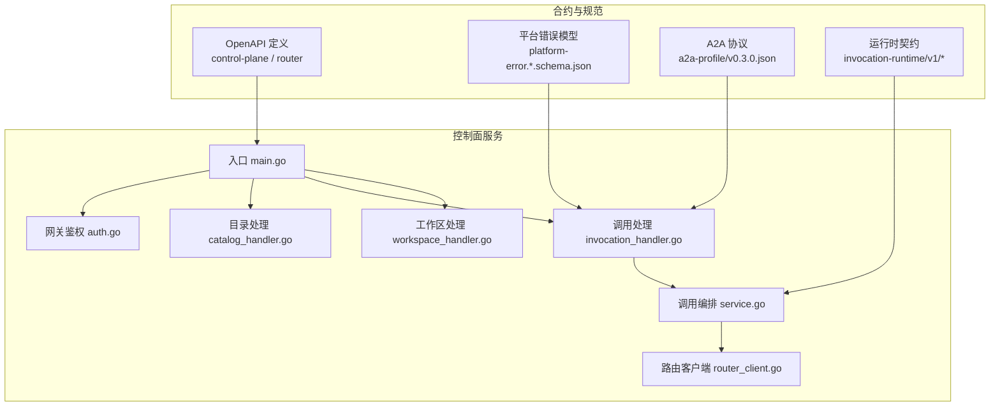
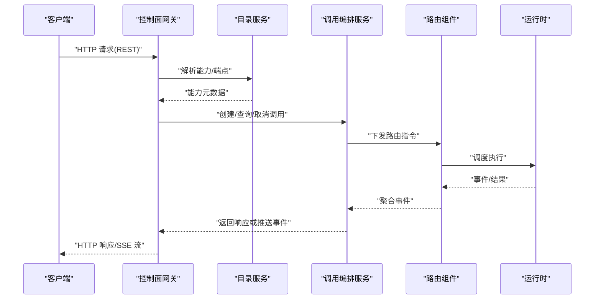
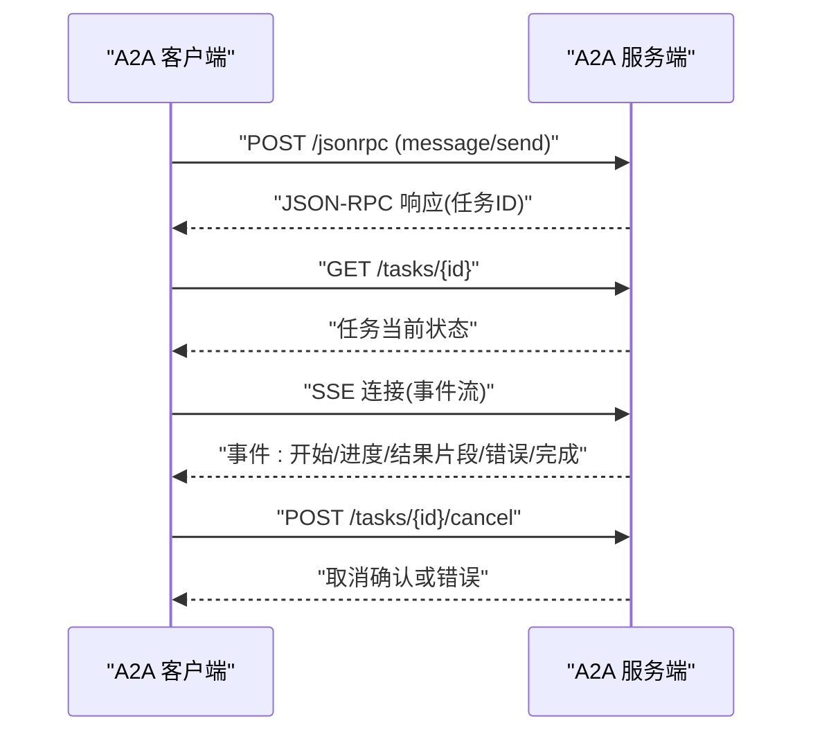
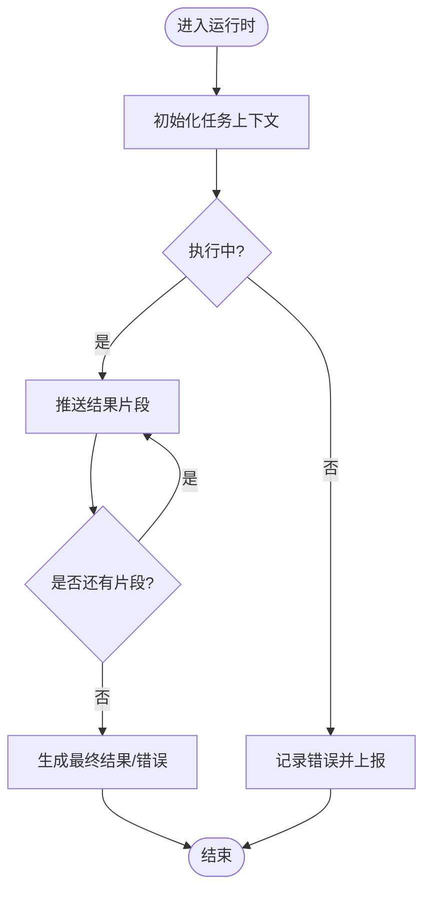
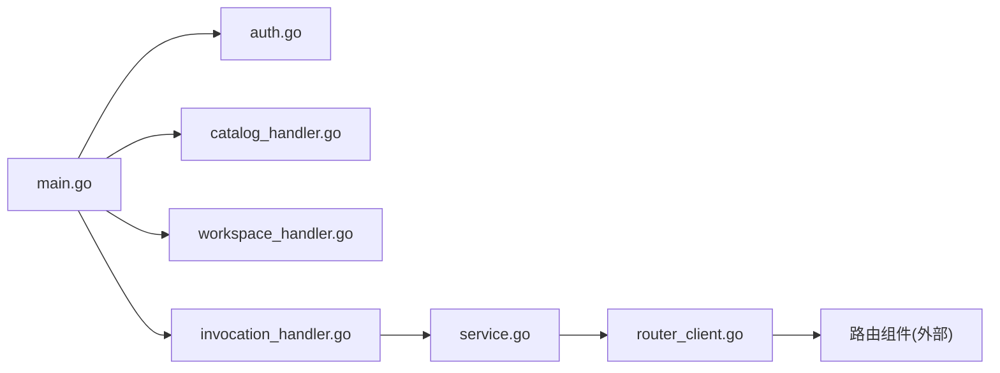

# API 参考

<cite>
**本文引用的文件**   
- [README.md](file://README.md)
- [contracts/openapi/control-plane.v1.yaml](file://contracts/openapi/control-plane.v1.yaml)
- [contracts/openapi/control-plane.v2.yaml](file://contracts/openapi/control-plane.v2.yaml)
- [contracts/openapi/control-plane.v3.yaml](file://contracts/openapi/control-plane.v3.yaml)
- [contracts/openapi/control-plane-invocation.v4.yaml](file://contracts/openapi/control-plane-invocation.v4.yaml)
- [contracts/openapi/router-agent.v1.yaml](file://contracts/openapi/router-agent.v1.yaml)
- [contracts/openapi/router-internal.v1.yaml](file://contracts/openapi/router-internal.v1.yaml)
- [contracts/openapi/router-internal.v2.yaml](file://contracts/openapi/router-internal.v2.yaml)
- [contracts/openapi/router-internal.v3.yaml](file://contracts/openapi/router-internal.v3.yaml)
- [contracts/schemas/platform-error.v1.schema.json](file://contracts/schemas/platform-error.v1.schema.json)
- [contracts/schemas/platform-error.v2.schema.json](file://contracts/schemas/platform-error.v2.schema.json)
- [contracts/schemas/platform-error.v3.schema.json](file://contracts/schemas/platform-error.v3.schema.json)
- [contracts/schemas/platform-error.v4.schema.json](file://contracts/schemas/platform-error.v4.schema.json)
- [contracts/a2a-profile/v0.3.0.json](file://contracts/a2a-profile/v0.3.0.json)
- [contracts/a2a-profile/v0.3.0/conformance/message-send-request.json](file://contracts/a2a-profile/v0.3.0/conformance/message-send-request.json)
- [contracts/a2a-profile/v0.3.0/conformance/tasks-get-request.json](file://contracts/a2a-profile/v0.3.0/conformance/tasks-get-request.json)
- [contracts/a2a-profile/v0.3.0/conformance/tasks-cancel-request.json](file://contracts/a2a-profile/v0.3.0/conformance/tasks-cancel-request.json)
- [contracts/a2a-profile/v0.3.0/conformance/message-stream-request.json](file://contracts/a2a-profile/v0.3.0/conformance/message-stream-request.json)
- [contracts/a2a-profile/v0.3.0/conformance/message-stream-valid.sse](file://contracts/a2a-profile/v0.3.0/conformance/message-stream-valid.sse)
- [contracts/invocation-runtime\v1\conformance/errors.json](file://contracts/invocation-runtime\v1\conformance/errors.json)
- [contracts/invocation-runtime\v1\conformance/lifecycle.json](file://contracts/invocation-runtime\v1\conformance/lifecycle.json)
- [contracts/invocation-runtime\v1\conformance/result-stream.json](file://contracts/invocation-runtime\v1\conformance/result-stream.json)
- [apps/control-plane/cmd/control-plane/main.go](file://apps/control-plane/cmd/control-plane/main.go)
- [apps/control-plane/internal/gateway/auth.go](file://apps/control-plane/internal/gateway/auth.go)
- [apps/control-plane/internal/gateway/catalog_handler.go](file://apps/control-plane/internal/gateway/catalog_handler.go)
- [apps/control-plane/internal/gateway/invocation_handler.go](file://apps/control-plane/internal/gateway/invocation_handler.go)
- [apps/control-plane/internal/gateway/workspace_handler.go](file://apps/control-plane/internal/gateway/workspace_handler.go)
- [apps/control-plane/internal/invocation/service.go](file://apps/control-plane/internal/invocation/service.go)
- [apps/control-plane/internal/invocation/router_client.go](file://apps/control-plane/internal/invocation/router_client.go)
</cite>

## 目录
1. [简介](#简介)
2. [项目结构](#项目结构)
3. [核心组件](#核心组件)
4. [架构总览](#架构总览)
5. [详细组件分析](#详细组件分析)
6. [依赖分析](#依赖分析)
7. [性能考虑](#性能考虑)
8. [故障排查指南](#故障排查指南)
9. [结论](#结论)
10. [附录](#附录)

## 简介
本 API 参考文档面向 NeKiro 平台的开发者与集成方，覆盖以下接口与协议：
- RESTful API（控制面）：工作区、目录、调用等资源的 HTTP 接口规范、认证方式、错误模型与版本策略。
- A2A 协议：Agent-to-Agent 的 JSON-RPC 消息格式、任务生命周期、流式事件与实时交互模式。
- 运行时契约：调用结果投递、错误与生命周期事件的语义规则与兼容性说明。

文档同时提供常见用例、客户端实现建议、性能优化技巧、调试与监控方法，以及弃用功能迁移与向后兼容指引。

## 项目结构
NeKiro 仓库采用多合约驱动开发，API 定义集中在 contracts 目录，控制面服务位于 apps/control-plane，路由与内部接口通过 OpenAPI 描述。

图表来源
- [apps/control-plane/cmd/control-plane/main.go](file://apps/control-plane/cmd/control-plane/main.go)
- [apps/control-plane/internal/gateway/auth.go](file://apps/control-plane/internal/gateway/auth.go)
- [apps/control-plane/internal/gateway/catalog_handler.go](file://apps/control-plane/internal/gateway/catalog_handler.go)
- [apps/control-plane/internal/gateway/invocation_handler.go](file://apps/control-plane/internal/gateway/invocation_handler.go)
- [apps/control-plane/internal/gateway/workspace_handler.go](file://apps/control-plane/internal/gateway/workspace_handler.go)
- [apps/control-plane/internal/invocation/service.go](file://apps/control-plane/internal/invocation/service.go)
- [apps/control-plane/internal/invocation/router_client.go](file://apps/control-plane/internal/invocation/router_client.go)
- [contracts/openapi/control-plane.v1.yaml](file://contracts/openapi/control-plane.v1.yaml)
- [contracts/openapi/control-plane.v2.yaml](file://contracts/openapi/control-plane.v2.yaml)
- [contracts/openapi/control-plane.v3.yaml](file://contracts/openapi/control-plane.v3.yaml)
- [contracts/openapi/control-plane-invocation.v4.yaml](file://contracts/openapi/control-plane-invocation.v4.yaml)
- [contracts/openapi/router-agent.v1.yaml](file://contracts/openapi/router-agent.v1.yaml)
- [contracts/openapi/router-internal.v1.yaml](file://contracts/openapi/router-internal.v1.yaml)
- [contracts/openapi/router-internal.v2.yaml](file://contracts/openapi/router-internal.v2.yaml)
- [contracts/openapi/router-internal.v3.yaml](file://contracts/openapi/router-internal.v3.yaml)
- [contracts/schemas/platform-error.v1.schema.json](file://contracts/schemas/platform-error.v1.schema.json)
- [contracts/schemas/platform-error.v2.schema.json](file://contracts/schemas/platform-error.v2.schema.json)
- [contracts/schemas/platform-error.v3.schema.json](file://contracts/schemas/platform-error.v3.schema.json)
- [contracts/schemas/platform-error.v4.schema.json](file://contracts/schemas/platform-error.v4.schema.json)
- [contracts/a2a-profile/v0.3.0.json](file://contracts/a2a-profile/v0.3.0.json)
- [contracts/invocation-runtime\v1\conformance/errors.json](file://contracts/invocation-runtime\v1\conformance/errors.json)
- [contracts/invocation-runtime\v1\conformance/lifecycle.json](file://contracts/invocation-runtime\v1\conformance/lifecycle.json)
- [contracts/invocation-runtime\v1\conformance/result-stream.json](file://contracts/invocation-runtime\v1\conformance/result-stream.json)

章节来源
- [README.md](file://README.md)

## 核心组件
- 控制面网关层：负责鉴权、路由到具体业务处理器，统一错误与追踪上下文。
- 目录服务：管理 Agent 能力注册、发现与查询。
- 工作区服务：管理工作区资源与权限策略。
- 调用编排服务：将外部调用请求转换为内部路由指令，协调下游路由与运行时。
- 路由客户端：与路由组件通信，完成实际的任务分发与状态同步。

章节来源
- [apps/control-plane/internal/gateway/auth.go](file://apps/control-plane/internal/gateway/auth.go)
- [apps/control-plane/internal/gateway/catalog_handler.go](file://apps/control-plane/internal/gateway/catalog_handler.go)
- [apps/control-plane/internal/gateway/workspace_handler.go](file://apps/control-plane/internal/gateway/workspace_handler.go)
- [apps/control-plane/internal/gateway/invocation_handler.go](file://apps/control-plane/internal/gateway/invocation_handler.go)
- [apps/control-plane/internal/invocation/service.go](file://apps/control-plane/internal/invocation/service.go)
- [apps/control-plane/internal/invocation/router_client.go](file://apps/control-plane/internal/invocation/router_client.go)

## 架构总览
控制面对外暴露 RESTful API，内部通过 JSON-RPC 与 A2A 协议与 Agent 及运行时交互；调用编排服务作为中枢，协调目录发现、路由选择与结果投递。

图表来源
- [apps/control-plane/internal/gateway/invocation_handler.go](file://apps/control-plane/internal/gateway/invocation_handler.go)
- [apps/control-plane/internal/invocation/service.go](file://apps/control-plane/internal/invocation/service.go)
- [apps/control-plane/internal/invocation/router_client.go](file://apps/control-plane/internal/invocation/router_client.go)
- [contracts/openapi/control-plane.v1.yaml](file://contracts/openapi/control-plane.v1.yaml)
- [contracts/openapi/control-plane.v2.yaml](file://contracts/openapi/control-plane.v2.yaml)
- [contracts/openapi/control-plane.v3.yaml](file://contracts/openapi/control-plane.v3.yaml)
- [contracts/openapi/control-plane-invocation.v4.yaml](file://contracts/openapi/control-plane-invocation.v4.yaml)

## 详细组件分析

### RESTful API（控制面）
- 版本与路径
  - 控制面 v1/v2/v3：用于工作区、目录等基础资源管理。
  - 调用面 v4：专注于调用生命周期与结果投递。
- 认证
  - 网关层鉴权中间件统一校验令牌/凭据，失败时返回标准错误模型。
- 错误模型
  - 使用 platform-error.*.schema.json 定义的通用错误结构，包含错误码、消息与可选详情。
- 典型端点族
  - 工作区：创建、读取、更新、删除工作区资源。
  - 目录：注册/查询 Agent 能力、端点、权限范围。
  - 调用：发起调用、获取任务状态、取消任务、订阅结果流。
- 速率限制与安全
  - 建议在网关层实施基于 IP/用户/租户的速率限制与配额。
  - 强制 HTTPS、最小权限原则、敏感头白名单与审计日志。

章节来源
- [contracts/openapi/control-plane.v1.yaml](file://contracts/openapi/control-plane.v1.yaml)
- [contracts/openapi/control-plane.v2.yaml](file://contracts/openapi/control-plane.v2.yaml)
- [contracts/openapi/control-plane.v3.yaml](file://contracts/openapi/control-plane.v3.yaml)
- [contracts/openapi/control-plane-invocation.v4.yaml](file://contracts/openapi/control-plane-invocation.v4.yaml)
- [contracts/schemas/platform-error.v1.schema.json](file://contracts/schemas/platform-error.v1.schema.json)
- [contracts/schemas/platform-error.v2.schema.json](file://contracts/schemas/platform-error.v2.schema.json)
- [contracts/schemas/platform-error.v3.schema.json](file://contracts/schemas/platform-error.v3.schema.json)
- [contracts/schemas/platform-error.v4.schema.json](file://contracts/schemas/platform-error.v4.schema.json)
- [apps/control-plane/internal/gateway/auth.go](file://apps/control-plane/internal/gateway/auth.go)
- [apps/control-plane/internal/gateway/workspace_handler.go](file://apps/control-plane/internal/gateway/workspace_handler.go)
- [apps/control-plane/internal/gateway/catalog_handler.go](file://apps/control-plane/internal/gateway/catalog_handler.go)
- [apps/control-plane/internal/gateway/invocation_handler.go](file://apps/control-plane/internal/gateway/invocation_handler.go)

### A2A 协议（JSON-RPC）
- 连接与端点
  - 基于 HTTP 的 JSON-RPC 端点，支持请求/响应与 SSE 流式事件。
- 消息格式
  - 遵循 a2a-profile v0.3.0 定义的消息结构、字段约束与扩展机制。
- 任务操作
  - 发送消息、获取任务、取消任务、流式事件订阅。
- 事件类型
  - 任务状态变更、增量结果片段、错误事件、终止事件等。
- 实时交互模式
  - 客户端建立 SSE 连接后，服务端按事件序列推送，直至任务终态。

图表来源
- [contracts/a2a-profile/v0.3.0.json](file://contracts/a2a-profile/v0.3.0.json)
- [contracts/a2a-profile/v0.3.0/conformance/message-send-request.json](file://contracts/a2a-profile/v0.3.0/conformance/message-send-request.json)
- [contracts/a2a-profile/v0.3.0/conformance/tasks-get-request.json](file://contracts/a2a-profile/v0.3.0/conformance/tasks-get-request.json)
- [contracts/a2a-profile/v0.3.0/conformance/tasks-cancel-request.json](file://contracts/a2a-profile/v0.3.0/conformance/tasks-cancel-request.json)
- [contracts/a2a-profile/v0.3.0/conformance/message-stream-request.json](file://contracts/a2a-profile/v0.3.0/conformance/message-stream-request.json)
- [contracts/a2a-profile/v0.3.0/conformance/message-stream-valid.sse](file://contracts/a2a-profile/v0.3.0/conformance/message-stream-valid.sse)

章节来源
- [contracts/a2a-profile/v0.3.0.json](file://contracts/a2a-profile/v0.3.0.json)
- [contracts/a2a-profile/v0.3.0/conformance/message-send-request.json](file://contracts/a2a-profile/v0.3.0/conformance/message-send-request.json)
- [contracts/a2a-profile/v0.3.0/conformance/tasks-get-request.json](file://contracts/a2a-profile/v0.3.0/conformance/tasks-get-request.json)
- [contracts/a2a-profile/v0.3.0/conformance/tasks-cancel-request.json](file://contracts/a2a-profile/v0.3.0/conformance/tasks-cancel-request.json)
- [contracts/a2a-profile/v0.3.0/conformance/message-stream-request.json](file://contracts/a2a-profile/v0.3.0/conformance/message-stream-request.json)
- [contracts/a2a-profile/v0.3.0/conformance/message-stream-valid.sse](file://contracts/a2a-profile/v0.3.0/conformance/message-stream-valid.sse)

### 运行时契约（结果投递与事件）
- 错误与生命周期
  - 定义任务生命周期阶段、错误分类与重试策略。
- 结果流
  - 支持分片结果流式返回，客户端需维护关联 ID 与顺序。
- 语义规则
  - 明确事件匹配、去重、幂等与一致性要求。

图表来源
- [contracts/invocation-runtime\v1\conformance/errors.json](file://contracts/invocation-runtime\v1\conformance/errors.json)
- [contracts/invocation-runtime\v1\conformance/lifecycle.json](file://contracts/invocation-runtime\v1\conformance/lifecycle.json)
- [contracts/invocation-runtime\v1\conformance/result-stream.json](file://contracts/invocation-runtime\v1\conformance/result-stream.json)

章节来源
- [contracts/invocation-runtime\v1\conformance/errors.json](file://contracts/invocation-runtime\v1\conformance/errors.json)
- [contracts/invocation-runtime\v1\conformance/lifecycle.json](file://contracts/invocation-runtime\v1\conformance/lifecycle.json)
- [contracts/invocation-runtime\v1\conformance/result-stream.json](file://contracts/invocation-runtime\v1\conformance/result-stream.json)

## 依赖分析
- 控制面入口加载各网关处理器，依赖鉴权中间件与错误模型。
- 调用编排服务依赖目录服务进行能力解析，并通过路由客户端与路由组件通信。
- 运行时契约为结果投递与事件语义提供一致性保障。

图表来源
- [apps/control-plane/cmd/control-plane/main.go](file://apps/control-plane/cmd/control-plane/main.go)
- [apps/control-plane/internal/gateway/auth.go](file://apps/control-plane/internal/gateway/auth.go)
- [apps/control-plane/internal/gateway/catalog_handler.go](file://apps/control-plane/internal/gateway/catalog_handler.go)
- [apps/control-plane/internal/gateway/workspace_handler.go](file://apps/control-plane/internal/gateway/workspace_handler.go)
- [apps/control-plane/internal/gateway/invocation_handler.go](file://apps/control-plane/internal/gateway/invocation_handler.go)
- [apps/control-plane/internal/invocation/service.go](file://apps/control-plane/internal/invocation/service.go)
- [apps/control-plane/internal/invocation/router_client.go](file://apps/control-plane/internal/invocation/router_client.go)

章节来源
- [apps/control-plane/cmd/control-plane/main.go](file://apps/control-plane/cmd/control-plane/main.go)
- [apps/control-plane/internal/gateway/auth.go](file://apps/control-plane/internal/gateway/auth.go)
- [apps/control-plane/internal/gateway/catalog_handler.go](file://apps/control-plane/internal/gateway/catalog_handler.go)
- [apps/control-plane/internal/gateway/workspace_handler.go](file://apps/control-plane/internal/gateway/workspace_handler.go)
- [apps/control-plane/internal/gateway/invocation_handler.go](file://apps/control-plane/internal/gateway/invocation_handler.go)
- [apps/control-plane/internal/invocation/service.go](file://apps/control-plane/internal/invocation/service.go)
- [apps/control-plane/internal/invocation/router_client.go](file://apps/control-plane/internal/invocation/router_client.go)

## 性能考虑
- 连接复用与超时
  - 对上游路由与运行时保持连接池，合理设置读写超时与重试退避。
- 流式处理
  - 优先使用 SSE/流式结果减少大对象序列化开销，客户端按需消费。
- 缓存与幂等
  - 对目录查询与能力解析引入短期缓存；确保调用幂等键与去重策略。
- 限流与背压
  - 在网关层实施细粒度限流；对热点任务进行队列化与背压控制。
- 可观测性
  - 全链路追踪、指标采集与结构化日志，便于定位瓶颈。

[本节为通用指导，不直接分析具体文件]

## 故障排查指南
- 鉴权失败
  - 检查令牌有效性、签名与过期时间；确认网关鉴权配置与白名单。
- 任务未找到/不可取消
  - 核对任务 ID、状态机与可取消标记；查看路由组件与运行时的状态一致性。
- 流式事件异常
  - 验证 SSE 连接存活、事件顺序与关联 ID；检查终端事件是否缺失。
- 错误模型对照
  - 使用 platform-error.*.schema.json 校验响应体结构，定位错误码与消息含义。

章节来源
- [apps/control-plane/internal/gateway/auth.go](file://apps/control-plane/internal/gateway/auth.go)
- [apps/control-plane/internal/gateway/invocation_handler.go](file://apps/control-plane/internal/gateway/invocation_handler.go)
- [contracts/schemas/platform-error.v1.schema.json](file://contracts/schemas/platform-error.v1.schema.json)
- [contracts/schemas/platform-error.v2.schema.json](file://contracts/schemas/platform-error.v2.schema.json)
- [contracts/schemas/platform-error.v3.schema.json](file://contracts/schemas/platform-error.v3.schema.json)
- [contracts/schemas/platform-error.v4.schema.json](file://contracts/schemas/platform-error.v4.schema.json)

## 结论
NeKiro 平台以合约驱动为核心，RESTful API 与 A2A 协议共同支撑跨 Agent 的可靠协作。通过统一的错误模型、清晰的版本策略与完善的运行时契约，平台提供了可扩展、可观测且高性能的集成体验。建议客户端严格遵循合约与最佳实践，结合限流、缓存与可观测性手段提升稳定性与效率。

[本节为总结性内容，不直接分析具体文件]

## 附录

### 版本与兼容性
- 控制面 API 提供 v1/v2/v3 多版本，调用面提供 v4 版本，建议客户端显式声明目标版本。
- 平台错误模型演进至 v4，新增字段与更丰富的错误分类，推荐逐步迁移。
- A2A 协议采用 v0.3.0，兼容旧版消息结构的必要字段，但建议使用最新 schema 校验。

章节来源
- [contracts/openapi/control-plane.v1.yaml](file://contracts/openapi/control-plane.v1.yaml)
- [contracts/openapi/control-plane.v2.yaml](file://contracts/openapi/control-plane.v2.yaml)
- [contracts/openapi/control-plane.v3.yaml](file://contracts/openapi/control-plane.v3.yaml)
- [contracts/openapi/control-plane-invocation.v4.yaml](file://contracts/openapi/control-plane-invocation.v4.yaml)
- [contracts/schemas/platform-error.v1.schema.json](file://contracts/schemas/platform-error.v1.schema.json)
- [contracts/schemas/platform-error.v2.schema.json](file://contracts/schemas/platform-error.v2.schema.json)
- [contracts/schemas/platform-error.v3.schema.json](file://contracts/schemas/platform-error.v3.schema.json)
- [contracts/schemas/platform-error.v4.schema.json](file://contracts/schemas/platform-error.v4.schema.json)
- [contracts/a2a-profile/v0.3.0.json](file://contracts/a2a-profile/v0.3.0.json)

### 常见用例与客户端实现要点
- 快速上手
  - 使用目录 API 发现可用能力，构造 A2A 消息并发起调用。
- 流式结果
  - 建立 SSE 连接，按事件顺序消费，直到收到终止事件。
- 错误处理
  - 根据 platform-error 模型解析错误码与消息，实现重试与降级策略。
- 安全与合规
  - 启用 HTTPS、最小权限令牌、敏感信息脱敏与审计日志。

章节来源
- [apps/control-plane/internal/gateway/catalog_handler.go](file://apps/control-plane/internal/gateway/catalog_handler.go)
- [apps/control-plane/internal/gateway/invocation_handler.go](file://apps/control-plane/internal/gateway/invocation_handler.go)
- [contracts/schemas/platform-error.v4.schema.json](file://contracts/schemas/platform-error.v4.schema.json)
- [contracts/a2a-profile/v0.3.0/conformance/message-stream-valid.sse](file://contracts/a2a-profile/v0.3.0/conformance/message-stream-valid.sse)