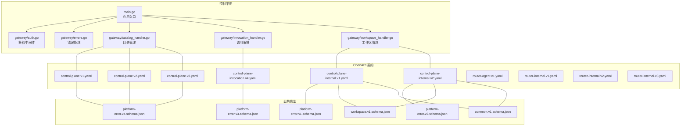
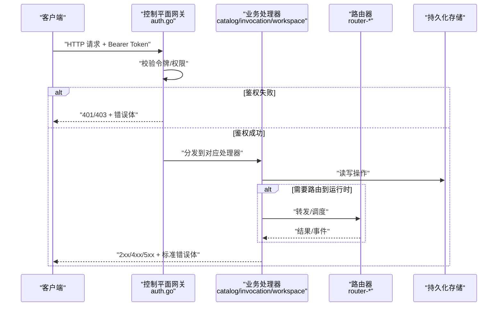
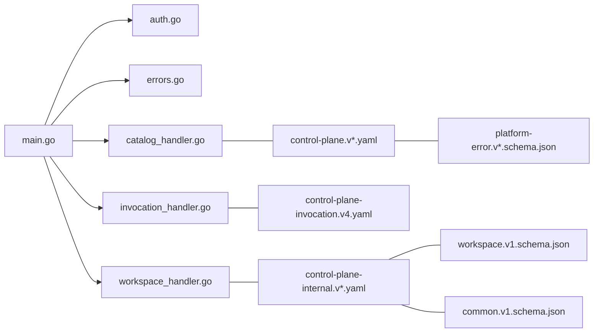

# REST API

<cite>
**本文引用的文件**   
- [control-plane.v1.yaml](file://contracts/openapi/control-plane.v1.yaml)
- [control-plane.v2.yaml](file://contracts/openapi/control-plane.v2.yaml)
- [control-plane.v3.yaml](file://contracts/openapi/control-plane.v3.yaml)
- [control-plane-invocation.v4.yaml](file://contracts/openapi/control-plane-invocation.v4.yaml)
- [control-plane-internal.v1.yaml](file://contracts/openapi/control-plane-internal.v1.yaml)
- [control-plane-internal.v2.yaml](file://contracts/openapi/control-plane-internal.v2.yaml)
- [router-agent.v1.yaml](file://contracts/openapi/router-agent.v1.yaml)
- [router-internal.v1.yaml](file://contracts/openapi/router-internal.v1.yaml)
- [router-internal.v2.yaml](file://contracts/openapi/router-internal.v2.yaml)
- [router-internal.v3.yaml](file://contracts/openapi/router-internal.v3.yaml)
- [platform-error.v1.schema.json](file://contracts/schemas/platform-error.v1.schema.json)
- [platform-error.v2.schema.json](file://contracts/schemas/platform-error.v2.schema.json)
- [platform-error.v3.schema.json](file://contracts/schemas/platform-error.v3.schema.json)
- [platform-error.v4.schema.json](file://contracts/schemas/platform-error.v4.schema.json)
- [workspace.v1.schema.json](file://contracts/schemas/workspace.v1.schema.json)
- [common.v1.schema.json](file://contracts/schemas/common.v1.schema.json)
- [compatibility.md](file://docs/contracts/compatibility.md)
- [main.go](file://apps/control-plane/cmd/control-plane/main.go)
- [auth.go](file://apps/control-plane/internal/gateway/auth.go)
- [errors.go](file://apps/control-plane/internal/gateway/errors.go)
- [catalog_handler.go](file://apps/control-plane/internal/gateway/catalog_handler.go)
- [invocation_handler.go](file://apps/control-plane/internal/gateway/invocation_handler.go)
- [workspace_handler.go](file://apps/control-plane/internal/gateway/workspace_handler.go)
</cite>

## 目录
1. [简介](#简介)
2. [项目结构](#项目结构)
3. [核心组件](#核心组件)
4. [架构总览](#架构总览)
5. [详细组件分析](#详细组件分析)
6. [依赖分析](#依赖分析)
7. [性能考虑](#性能考虑)
8. [故障排查指南](#故障排查指南)
9. [结论](#结论)
10. [附录](#附录)

## 简介
本文件为 NeKiro 平台的 REST API 文档，覆盖控制平面对外 API、控制平面内部服务 API、以及路由器（Router）的代理与内部 API。文档基于 OpenAPI 契约与实现代码进行整理，包含：
- 所有 HTTP 端点（GET、POST、PUT、DELETE）
- URL 模式、请求参数、响应格式与状态码
- 认证机制（Bearer Token）、请求头配置
- 错误处理策略与通用错误模型
- 速率限制建议与最佳实践
- 版本兼容性与迁移指南
- 客户端实现建议与性能优化

## 项目结构
NeKiro 平台通过 OpenAPI 契约定义多组 API，并在控制平面与路由器中实现。关键位置如下：
- 控制平面对外 API：contracts/openapi/control-plane.v*.yaml
- 控制平面内部 API：contracts/openapi/control-plane-internal.v*.yaml
- 路由器对外（Agent）API：contracts/openapi/router-agent.v1.yaml
- 路由器内部 API：contracts/openapi/router-internal.v*.yaml
- 通用错误与工作区数据模型：contracts/schemas/*.schema.json
- 控制平面入口与网关处理器：apps/control-plane/cmd/control-plane/main.go、apps/control-plane/internal/gateway/*

图表来源
- [main.go:1-200](file://apps/control-plane/cmd/control-plane/main.go#L1-L200)
- [auth.go:1-200](file://apps/control-plane/internal/gateway/auth.go#L1-L200)
- [errors.go:1-200](file://apps/control-plane/internal/gateway/errors.go#L1-L200)
- [catalog_handler.go:1-200](file://apps/control-plane/internal/gateway/catalog_handler.go#L1-L200)
- [invocation_handler.go:1-200](file://apps/control-plane/internal/gateway/invocation_handler.go#L1-L200)
- [workspace_handler.go:1-200](file://apps/control-plane/internal/gateway/workspace_handler.go#L1-L200)
- [control-plane.v1.yaml](file://contracts/openapi/control-plane.v1.yaml)
- [control-plane.v2.yaml](file://contracts/openapi/control-plane.v2.yaml)
- [control-plane.v3.yaml](file://contracts/openapi/control-plane.v3.yaml)
- [control-plane-invocation.v4.yaml](file://contracts/openapi/control-plane-invocation.v4.yaml)
- [control-plane-internal.v1.yaml](file://contracts/openapi/control-plane-internal.v1.yaml)
- [control-plane-internal.v2.yaml](file://contracts/openapi/control-plane-internal.v2.yaml)
- [router-agent.v1.yaml](file://contracts/openapi/router-agent.v1.yaml)
- [router-internal.v1.yaml](file://contracts/openapi/router-internal.v1.yaml)
- [router-internal.v2.yaml](file://contracts/openapi/router-internal.v2.yaml)
- [router-internal.v3.yaml](file://contracts/openapi/router-internal.v3.yaml)
- [platform-error.v1.schema.json](file://contracts/schemas/platform-error.v1.schema.json)
- [platform-error.v2.schema.json](file://contracts/schemas/platform-error.v2.schema.json)
- [platform-error.v3.schema.json](file://contracts/schemas/platform-error.v3.schema.json)
- [platform-error.v4.schema.json](file://contracts/schemas/platform-error.v4.schema.json)
- [workspace.v1.schema.json](file://contracts/schemas/workspace.v1.schema.json)
- [common.v1.schema.json](file://contracts/schemas/common.v1.schema.json)

章节来源
- [main.go:1-200](file://apps/control-plane/cmd/control-plane/main.go#L1-L200)
- [control-plane.v1.yaml](file://contracts/openapi/control-plane.v1.yaml)
- [control-plane.v2.yaml](file://contracts/openapi/control-plane.v2.yaml)
- [control-plane.v3.yaml](file://contracts/openapi/control-plane.v3.yaml)
- [control-plane-invocation.v4.yaml](file://contracts/openapi/control-plane-invocation.v4.yaml)
- [control-plane-internal.v1.yaml](file://contracts/openapi/control-plane-internal.v1.yaml)
- [control-plane-internal.v2.yaml](file://contracts/openapi/control-plane-internal.v2.yaml)
- [router-agent.v1.yaml](file://contracts/openapi/router-agent.v1.yaml)
- [router-internal.v1.yaml](file://contracts/openapi/router-internal.v1.yaml)
- [router-internal.v2.yaml](file://contracts/openapi/router-internal.v2.yaml)
- [router-internal.v3.yaml](file://contracts/openapi/router-internal.v3.yaml)

## 核心组件
- 控制平面对外 API（Control Plane Public）
  - 提供目录（Catalog）、工作区（Workspace）等管理能力
  - 版本演进：v1、v2、v3
- 控制平面内部 API（Control Plane Internal）
  - 面向平台内部服务（如安装器、编排器）的管理接口
  - 版本演进：v1、v2
- 路由器 Agent API（Router Agent）
  - 面向外部 Agent 的接入与发现能力
- 路由器内部 API（Router Internal）
  - 面向平台内部的路由与调度能力
  - 版本演进：v1、v2、v3
- 通用错误模型与工作区模型
  - platform-error v1..v4
  - workspace v1
  - common v1

章节来源
- [control-plane.v1.yaml](file://contracts/openapi/control-plane.v1.yaml)
- [control-plane.v2.yaml](file://contracts/openapi/control-plane.v2.yaml)
- [control-plane.v3.yaml](file://contracts/openapi/control-plane.v3.yaml)
- [control-plane-internal.v1.yaml](file://contracts/openapi/control-plane-internal.v1.yaml)
- [control-plane-internal.v2.yaml](file://contracts/openapi/control-plane-internal.v2.yaml)
- [router-agent.v1.yaml](file://contracts/openapi/router-agent.v1.yaml)
- [router-internal.v1.yaml](file://contracts/openapi/router-internal.v1.yaml)
- [router-internal.v2.yaml](file://contracts/openapi/router-internal.v2.yaml)
- [router-internal.v3.yaml](file://contracts/openapi/router-internal.v3.yaml)
- [platform-error.v1.schema.json](file://contracts/schemas/platform-error.v1.schema.json)
- [platform-error.v2.schema.json](file://contracts/schemas/platform-error.v2.schema.json)
- [platform-error.v3.schema.json](file://contracts/schemas/platform-error.v3.schema.json)
- [platform-error.v4.schema.json](file://contracts/schemas/platform-error.v4.schema.json)
- [workspace.v1.schema.json](file://contracts/schemas/workspace.v1.schema.json)
- [common.v1.schema.json](file://contracts/schemas/common.v1.schema.json)

## 架构总览
下图展示了从客户端到控制平面与路由器的整体交互路径，包括认证、路由与错误返回流程。

图表来源
- [auth.go:1-200](file://apps/control-plane/internal/gateway/auth.go#L1-L200)
- [catalog_handler.go:1-200](file://apps/control-plane/internal/gateway/catalog_handler.go#L1-L200)
- [invocation_handler.go:1-200](file://apps/control-plane/internal/gateway/invocation_handler.go#L1-L200)
- [workspace_handler.go:1-200](file://apps/control-plane/internal/gateway/workspace_handler.go#L1-L200)
- [router-agent.v1.yaml](file://contracts/openapi/router-agent.v1.yaml)
- [router-internal.v1.yaml](file://contracts/openapi/router-internal.v1.yaml)

## 详细组件分析

### 控制平面对外 API（Public）
- 版本
  - v1、v2、v3
- 主要资源域
  - 目录（Catalog）：模型注册、发布、查询
  - 工作区（Workspace）：创建、读取、更新、删除
  - 调用（Invocation）：触发执行、查询状态、获取结果流
- 认证与鉴权
  - 使用 Bearer Token 进行身份验证
  - 鉴权失败返回 401/403
- 典型状态码
  - 200 OK、201 Created、204 No Content
  - 400 Bad Request、401 Unauthorized、403 Forbidden、404 Not Found、409 Conflict、422 Unprocessable Entity、429 Too Many Requests、500 Internal Server Error、503 Service Unavailable
- 请求头
  - Authorization: Bearer <token>
  - Content-Type: application/json
  - Accept: application/json
- 分页与游标
  - 支持 cursor-based 分页（参考游标实现）
- 示例（路径引用）
  - 成功场景：创建目录项、列出工作区、触发调用
  - 错误场景：无效参数、未授权、资源不存在、冲突

章节来源
- [control-plane.v1.yaml](file://contracts/openapi/control-plane.v1.yaml)
- [control-plane.v2.yaml](file://contracts/openapi/control-plane.v2.yaml)
- [control-plane.v3.yaml](file://contracts/openapi/control-plane.v3.yaml)
- [catalog_handler.go:1-200](file://apps/control-plane/internal/gateway/catalog_handler.go#L1-L200)
- [workspace_handler.go:1-200](file://apps/control-plane/internal/gateway/workspace_handler.go#L1-L200)
- [invocation_handler.go:1-200](file://apps/control-plane/internal/gateway/invocation_handler.go#L1-L200)
- [cursor.go](file://apps/control-plane/internal/catalog/cursor.go)
- [cursor.go](file://apps/control-plane/internal/workspace/cursor.go)

### 控制平面内部 API（Internal）
- 版本
  - v1、v2
- 目标用户
  - 平台内部服务（安装器、编排器、监控等）
- 主要能力
  - 工作区生命周期管理、安装检查、元数据同步
- 安全边界
  - 仅内网访问；仍建议使用 Bearer Token 或 mTLS
- 典型状态码
  - 同对外 API，但更强调幂等与一致性
- 示例（路径引用）
  - 成功场景：检查工作区健康、更新安装状态
  - 错误场景：依赖不可用、状态不一致

章节来源
- [control-plane-internal.v1.yaml](file://contracts/openapi/control-plane-internal.v1.yaml)
- [control-plane-internal.v2.yaml](file://contracts/openapi/control-plane-internal.v2.yaml)
- [workspace_handler.go:1-200](file://apps/control-plane/internal/gateway/workspace_handler.go#L1-L200)

### 路由器 Agent API（Router Agent）
- 版本
  - v1
- 目标用户
  - 外部 Agent 接入、能力发现、任务投递
- 主要能力
  - Agent 注册、能力清单、任务提交与回调
- 安全边界
  - 建议强认证（Token/mTLS），并启用 IP 白名单
- 典型状态码
  - 200/201/204/4xx/5xx
- 示例（路径引用）
  - 成功场景：注册 Agent、提交任务
  - 错误场景：重复注册、任务拒绝

章节来源
- [router-agent.v1.yaml](file://contracts/openapi/router-agent.v1.yaml)

### 路由器内部 API（Router Internal）
- 版本
  - v1、v2、v3
- 目标用户
  - 平台内部调度器、编排器
- 主要能力
  - 路由表维护、实例健康检查、流量切换
- 安全边界
  - 严格内网访问，推荐 mTLS
- 典型状态码
  - 200/201/204/4xx/5xx
- 示例（路径引用）
  - 成功场景：更新路由规则、健康上报
  - 错误场景：规则冲突、实例不健康

章节来源
- [router-internal.v1.yaml](file://contracts/openapi/router-internal.v1.yaml)
- [router-internal.v2.yaml](file://contracts/openapi/router-internal.v2.yaml)
- [router-internal.v3.yaml](file://contracts/openapi/router-internal.v3.yaml)

### 认证与鉴权（Bearer Token）
- 认证方式
  - 在请求头携带 Authorization: Bearer <token>
- 鉴权流程
  - 网关层校验令牌有效性及权限范围
  - 失败时返回 401/403
- 令牌颁发
  - 由身份提供方签发，平台侧校验签名与过期时间
- 最佳实践
  - 短生命周期令牌 + 刷新令牌
  - 最小权限原则
  - 记录审计日志

章节来源
- [auth.go:1-200](file://apps/control-plane/internal/gateway/auth.go#L1-L200)

### 错误处理与通用错误模型
- 统一错误体
  - 遵循 platform-error v1..v4 规范
  - 字段通常包含：code、message、details、requestId 等
- 常见状态码
  - 400 参数错误、401 未认证、403 无权限、404 资源不存在、409 冲突、422 语义错误、429 限流、500/503 服务端错误
- 错误传播
  - 网关层标准化错误响应，附带 traceId/requestId
- 示例（路径引用）
  - 成功：空体或轻量成功体
  - 错误：标准错误体

章节来源
- [errors.go:1-200](file://apps/control-plane/internal/gateway/errors.go#L1-L200)
- [platform-error.v1.schema.json](file://contracts/schemas/platform-error.v1.schema.json)
- [platform-error.v2.schema.json](file://contracts/schemas/platform-error.v2.schema.json)
- [platform-error.v3.schema.json](file://contracts/schemas/platform-error.v3.schema.json)
- [platform-error.v4.schema.json](file://contracts/schemas/platform-error.v4.schema.json)

### 工作区数据模型
- 模型定义
  - workspace v1 定义工作区实体、属性与约束
- 使用范围
  - 控制平面对外与内部 API 均使用该模型
- 兼容性
  - 新增字段需向后兼容，禁止破坏性变更

章节来源
- [workspace.v1.schema.json](file://contracts/schemas/workspace.v1.schema.json)
- [control-plane.v1.yaml](file://contracts/openapi/control-plane.v1.yaml)
- [control-plane-internal.v1.yaml](file://contracts/openapi/control-plane-internal.v1.yaml)

### 通用类型与约定
- 通用类型
  - common v1 定义跨 API 复用的基础类型（如 ID、时间戳、枚举）
- 命名与序列化
  - JSON 字段采用小驼峰
  - 时间采用 RFC3339
- 分页
  - 游标分页：nextCursor、hasMore

章节来源
- [common.v1.schema.json](file://contracts/schemas/common.v1.schema.json)
- [cursor.go](file://apps/control-plane/internal/catalog/cursor.go)
- [cursor.go](file://apps/control-plane/internal/workspace/cursor.go)

## 依赖分析
- 控制器与处理器
  - main.go 负责启动与路由装配
  - gateway 下各 handler 分别承载不同资源域逻辑
- 契约与实现
  - OpenAPI 契约驱动实现，确保行为一致
- 错误与模型
  - errors.go 统一错误输出
  - schemas 定义跨模块共享数据结构

图表来源
- [main.go:1-200](file://apps/control-plane/cmd/control-plane/main.go#L1-L200)
- [auth.go:1-200](file://apps/control-plane/internal/gateway/auth.go#L1-L200)
- [errors.go:1-200](file://apps/control-plane/internal/gateway/errors.go#L1-L200)
- [catalog_handler.go:1-200](file://apps/control-plane/internal/gateway/catalog_handler.go#L1-L200)
- [invocation_handler.go:1-200](file://apps/control-plane/internal/gateway/invocation_handler.go#L1-L200)
- [workspace_handler.go:1-200](file://apps/control-plane/internal/gateway/workspace_handler.go#L1-L200)
- [control-plane.v1.yaml](file://contracts/openapi/control-plane.v1.yaml)
- [control-plane.v2.yaml](file://contracts/openapi/control-plane.v2.yaml)
- [control-plane.v3.yaml](file://contracts/openapi/control-plane.v3.yaml)
- [control-plane-invocation.v4.yaml](file://contracts/openapi/control-plane-invocation.v4.yaml)
- [control-plane-internal.v1.yaml](file://contracts/openapi/control-plane-internal.v1.yaml)
- [control-plane-internal.v2.yaml](file://contracts/openapi/control-plane-internal.v2.yaml)
- [workspace.v1.schema.json](file://contracts/schemas/workspace.v1.schema.json)
- [common.v1.schema.json](file://contracts/schemas/common.v1.schema.json)
- [platform-error.v1.schema.json](file://contracts/schemas/platform-error.v1.schema.json)
- [platform-error.v2.schema.json](file://contracts/schemas/platform-error.v2.schema.json)
- [platform-error.v3.schema.json](file://contracts/schemas/platform-error.v3.schema.json)
- [platform-error.v4.schema.json](file://contracts/schemas/platform-error.v4.schema.json)

章节来源
- [main.go:1-200](file://apps/control-plane/cmd/control-plane/main.go#L1-L200)
- [catalog_handler.go:1-200](file://apps/control-plane/internal/gateway/catalog_handler.go#L1-L200)
- [invocation_handler.go:1-200](file://apps/control-plane/internal/gateway/invocation_handler.go#L1-L200)
- [workspace_handler.go:1-200](file://apps/control-plane/internal/gateway/workspace_handler.go#L1-L200)

## 性能考虑
- 连接与并发
  - 合理设置连接池大小与超时
  - 使用长连接与 Keep-Alive
- 缓存
  - 对只读列表类接口引入缓存（注意失效策略）
- 分页
  - 优先使用游标分页，避免深度偏移
- 压缩
  - 开启 gzip/br 压缩大响应体
- 限流
  - 按租户/用户维度限流，防止雪崩
- 异步与流式
  - 耗时任务采用异步+轮询或 SSE/WebSocket 推送

[本节为通用指导，无需源码引用]

## 故障排查指南
- 常见问题
  - 401/403：检查令牌是否有效、权限范围是否正确
  - 400/422：检查请求体结构与必填字段
  - 404：确认资源 ID 与路径正确
  - 409：检查是否存在并发写入冲突
  - 429：降低请求频率或申请更高配额
  - 5xx：查看服务端日志与链路追踪
- 诊断信息
  - 请求/响应携带 requestId/traceId
  - 错误体遵循 platform-error 规范
- 定位步骤
  - 根据 requestId 检索日志
  - 核对 OpenAPI 契约与实际请求差异
  - 检查下游依赖（数据库、路由器）健康状态

章节来源
- [errors.go:1-200](file://apps/control-plane/internal/gateway/errors.go#L1-L200)
- [platform-error.v1.schema.json](file://contracts/schemas/platform-error.v1.schema.json)
- [platform-error.v2.schema.json](file://contracts/schemas/platform-error.v2.schema.json)
- [platform-error.v3.schema.json](file://contracts/schemas/platform-error.v3.schema.json)
- [platform-error.v4.schema.json](file://contracts/schemas/platform-error.v4.schema.json)

## 结论
NeKiro 平台通过清晰的 OpenAPI 契约与模块化实现，提供了稳定的控制平面与路由器 API。统一的错误模型、严格的鉴权与完善的版本管理，保障了系统的可维护性与可扩展性。建议客户端遵循本文的最佳实践，结合速率限制与重试退避策略，以获得稳定高效的集成体验。

[本节为总结，无需源码引用]

## 附录

### 版本兼容性与迁移指南
- 兼容性原则
  - 新增字段应向后兼容，禁止删除或重命名已有字段
  - 新增可选字段默认值需明确
- 版本策略
  - 对外 API 以版本号区分（v1/v2/v3）
  - 内部 API 独立版本（v1/v2）
- 迁移建议
  - 逐步升级至最新版本
  - 保留旧版本至少一个迭代周期
  - 使用契约测试保障兼容性

章节来源
- [compatibility.md](file://docs/contracts/compatibility.md)
- [control-plane.v1.yaml](file://contracts/openapi/control-plane.v1.yaml)
- [control-plane.v2.yaml](file://contracts/openapi/control-plane.v2.yaml)
- [control-plane.v3.yaml](file://contracts/openapi/control-plane.v3.yaml)
- [control-plane-internal.v1.yaml](file://contracts/openapi/control-plane-internal.v1.yaml)
- [control-plane-internal.v2.yaml](file://contracts/openapi/control-plane-internal.v2.yaml)

### 客户端实现最佳实践
- 认证
  - 始终携带 Authorization: Bearer <token>
  - 自动刷新令牌，避免过期导致中断
- 重试与退避
  - 对 429/5xx 实施指数退避与抖动
  - 幂等请求可重试，非幂等需谨慎
- 超时与熔断
  - 设置合理的连接/读写超时
  - 对不稳定依赖启用熔断与降级
- 观测性
  - 透传 requestId/traceId
  - 采集关键指标（延迟、错误率、吞吐）

[本节为通用指导，无需源码引用]