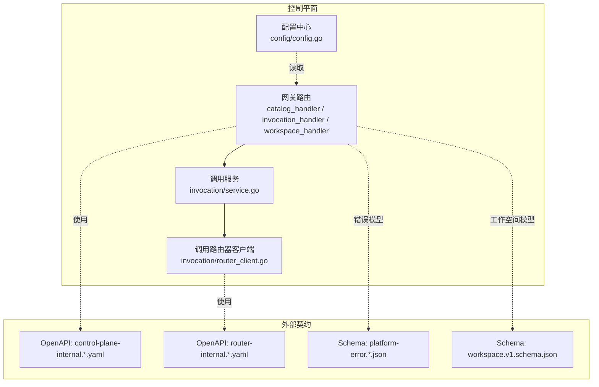
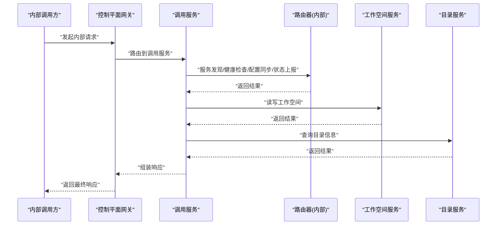
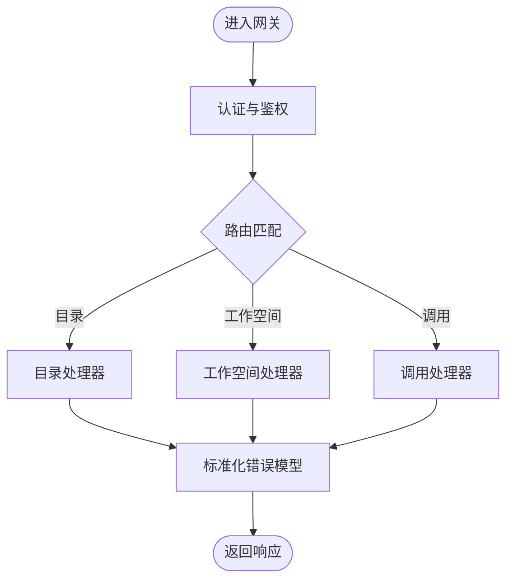
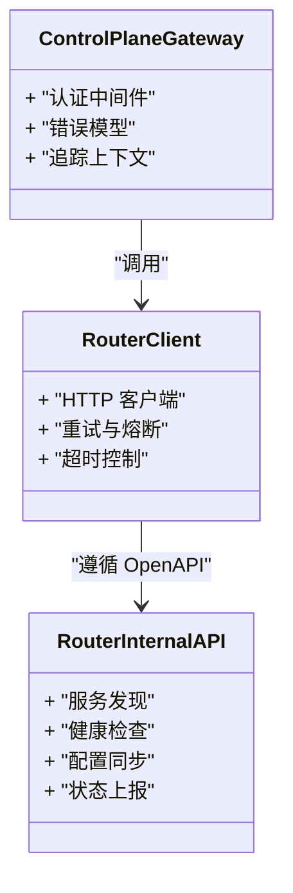
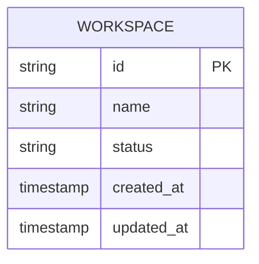
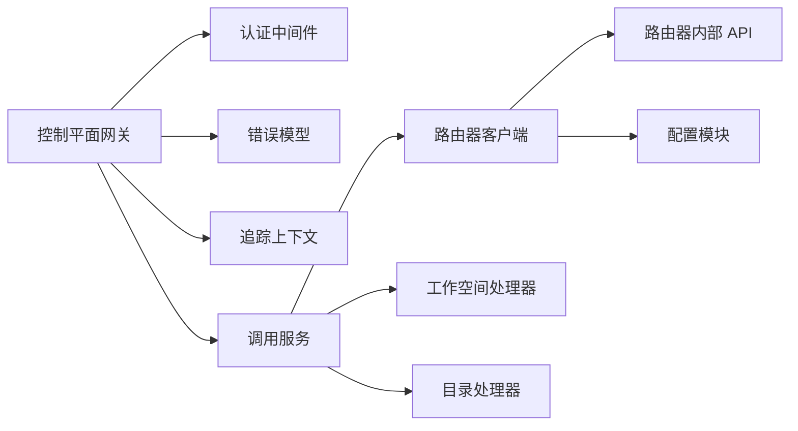

# 内部服务 API

<cite>
**本文引用的文件**   
- [control-plane-internal.v1.yaml](file://contracts/openapi/control-plane-internal.v1.yaml)
- [control-plane-internal.v2.yaml](file://contracts/openapi/control-plane-internal.v2.yaml)
- [router-internal.v1.yaml](file://contracts/openapi/router-internal.v1.yaml)
- [router-internal.v2.yaml](file://contracts/openapi/router-internal.v2.yaml)
- [router-internal.v3.yaml](file://contracts/openapi/router-internal.v3.yaml)
- [platform-error.v1.schema.json](file://contracts/schemas/platform-error.v1.schema.json)
- [platform-error.v2.schema.json](file://contracts/schemas/platform-error.v2.schema.json)
- [platform-error.v3.schema.json](file://contracts/schemas/platform-error.v3.schema.json)
- [platform-error.v4.schema.json](file://contracts/schemas/platform-error.v4.schema.json)
- [workspace.v1.schema.json](file://contracts/schemas/workspace.v1.schema.json)
- [contracts.go](file://contracts/contracts.go)
- [active_contracts_integration_test.go](file://contracts/active_contracts_integration_test.go)
- [catalog_handler.go](file://apps/control-plane/internal/gateway/catalog_handler.go)
- [invocation_handler.go](file://apps/control-plane/internal/gateway/invocation_handler.go)
- [workspace_handler.go](file://apps/control-plane/internal/gateway/workspace_handler.go)
- [auth.go](file://apps/control-plane/internal/gateway/auth.go)
- [errors.go](file://apps/control-plane/internal/gateway/errors.go)
- [trace.go](file://apps/control-plane/internal/gateway/trace.go)
- [router_client.go](file://apps/control-plane/internal/invocation/router_client.go)
- [service.go](file://apps/control-plane/internal/invocation/service.go)
- [config.go](file://apps/control-plane/internal/config/config.go)
</cite>

## 目录
1. [简介](#简介)
2. [项目结构](#项目结构)
3. [核心组件](#核心组件)
4. [架构总览](#架构总览)
5. [详细组件分析](#详细组件分析)
6. [依赖分析](#依赖分析)
7. [性能考虑](#性能考虑)
8. [故障排查指南](#故障排查指南)
9. [结论](#结论)
10. [附录](#附录)

## 简介
本文件为 NeKiro 控制平面与目录服务、工作空间服务、调用路由器之间的内部 REST API 规范。内容覆盖：
- 控制平面内部接口（v1/v2）与工作空间、目录、调用路由的交互
- 路由器内部接口（v1/v2/v3）与服务发现、健康检查、配置同步、状态上报等协议
- 服务间认证机制、数据格式规范、错误传播策略与超时处理
- 最佳实践、故障恢复机制与监控指标建议
- 版本管理与向后兼容性保证

## 项目结构
NeKiro 将内部 API 契约以 OpenAPI YAML 与 JSON Schema 形式集中管理，并在控制平面网关层实现具体路由与处理器。关键位置如下：
- contracts/openapi：内部 API 的 OpenAPI 定义（控制平面内部、路由器内部）
- contracts/schemas：平台通用错误模型与工作空间数据模型等
- apps/control-plane/internal/gateway：控制平面网关路由与处理器（目录、工作空间、调用）
- apps/control-plane/internal/invocation：调用路由客户端与服务编排
- apps/control-plane/internal/config：配置加载与校验

图表来源
- [catalog_handler.go](file://apps/control-plane/internal/gateway/catalog_handler.go)
- [invocation_handler.go](file://apps/control-plane/internal/gateway/invocation_handler.go)
- [workspace_handler.go](file://apps/control-plane/internal/gateway/workspace_handler.go)
- [router_client.go](file://apps/control-plane/internal/invocation/router_client.go)
- [service.go](file://apps/control-plane/internal/invocation/service.go)
- [config.go](file://apps/control-plane/internal/config/config.go)
- [control-plane-internal.v1.yaml](file://contracts/openapi/control-plane-internal.v1.yaml)
- [control-plane-internal.v2.yaml](file://contracts/openapi/control-plane-internal.v2.yaml)
- [router-internal.v1.yaml](file://contracts/openapi/router-internal.v1.yaml)
- [router-internal.v2.yaml](file://contracts/openapi/router-internal.v2.yaml)
- [router-internal.v3.yaml](file://contracts/openapi/router-internal.v3.yaml)
- [platform-error.v1.schema.json](file://contracts/schemas/platform-error.v1.schema.json)
- [platform-error.v2.schema.json](file://contracts/schemas/platform-error.v2.schema.json)
- [platform-error.v3.schema.json](file://contracts/schemas/platform-error.v3.schema.json)
- [platform-error.v4.schema.json](file://contracts/schemas/platform-error.v4.schema.json)
- [workspace.v1.schema.json](file://contracts/schemas/workspace.v1.schema.json)

章节来源
- [contracts.go](file://contracts/contracts.go)
- [active_contracts_integration_test.go](file://contracts/active_contracts_integration_test.go)

## 核心组件
- 控制平面网关
  - 目录处理器：提供目录资源查询、注册、更新等能力
  - 调用处理器：负责编排跨服务的调用流程，协调路由器与工作空间
  - 工作空间处理器：管理工作空间生命周期与元数据
- 调用服务与路由器客户端
  - 调用服务：封装业务编排逻辑
  - 路由器客户端：面向路由器内部接口的 HTTP 客户端，负责服务发现、健康检查、配置同步、状态上报
- 配置模块
  - 统一加载与校验运行时配置，支撑网关与客户端行为

章节来源
- [catalog_handler.go](file://apps/control-plane/internal/gateway/catalog_handler.go)
- [invocation_handler.go](file://apps/control-plane/internal/gateway/invocation_handler.go)
- [workspace_handler.go](file://apps/control-plane/internal/gateway/workspace_handler.go)
- [service.go](file://apps/control-plane/internal/invocation/service.go)
- [router_client.go](file://apps/control-plane/internal/invocation/router_client.go)
- [config.go](file://apps/control-plane/internal/config/config.go)

## 架构总览
控制平面作为内部 API 的统一入口，通过网关暴露目录、工作空间与调用相关能力；调用服务在需要时通过路由器客户端访问路由器内部接口，完成服务发现与健康检查、配置拉取与同步、以及运行态状态上报。

图表来源
- [invocation_handler.go](file://apps/control-plane/internal/gateway/invocation_handler.go)
- [service.go](file://apps/control-plane/internal/invocation/service.go)
- [router_client.go](file://apps/control-plane/internal/invocation/router_client.go)
- [workspace_handler.go](file://apps/control-plane/internal/gateway/workspace_handler.go)
- [catalog_handler.go](file://apps/control-plane/internal/gateway/catalog_handler.go)

## 详细组件分析

### 控制平面内部 API（v1/v2）
- 范围
  - 目录资源操作
  - 工作空间资源操作
  - 调用编排入口
- 版本策略
  - 通过 OpenAPI 文件区分 v1 与 v2，新增字段采用可兼容扩展方式，删除或破坏性变更需升级主版本
- 错误模型
  - 使用平台错误模型（多版本 schema），确保跨服务一致的错误语义与结构化错误体
- 认证与鉴权
  - 网关层提供认证中间件，用于服务间身份校验与权限控制
- 追踪与可观测性
  - 网关层注入追踪上下文，贯穿下游调用链

图表来源
- [control-plane-internal.v1.yaml](file://contracts/openapi/control-plane-internal.v1.yaml)
- [control-plane-internal.v2.yaml](file://contracts/openapi/control-plane-internal.v2.yaml)
- [platform-error.v1.schema.json](file://contracts/schemas/platform-error.v1.schema.json)
- [platform-error.v2.schema.json](file://contracts/schemas/platform-error.v2.schema.json)
- [platform-error.v3.schema.json](file://contracts/schemas/platform-error.v3.schema.json)
- [platform-error.v4.schema.json](file://contracts/schemas/platform-error.v4.schema.json)
- [auth.go](file://apps/control-plane/internal/gateway/auth.go)
- [errors.go](file://apps/control-plane/internal/gateway/errors.go)
- [trace.go](file://apps/control-plane/internal/gateway/trace.go)
- [catalog_handler.go](file://apps/control-plane/internal/gateway/catalog_handler.go)
- [workspace_handler.go](file://apps/control-plane/internal/gateway/workspace_handler.go)
- [invocation_handler.go](file://apps/control-plane/internal/gateway/invocation_handler.go)

章节来源
- [control-plane-internal.v1.yaml](file://contracts/openapi/control-plane-internal.v1.yaml)
- [control-plane-internal.v2.yaml](file://contracts/openapi/control-plane-internal.v2.yaml)
- [platform-error.v1.schema.json](file://contracts/schemas/platform-error.v1.schema.json)
- [platform-error.v2.schema.json](file://contracts/schemas/platform-error.v2.schema.json)
- [platform-error.v3.schema.json](file://contracts/schemas/platform-error.v3.schema.json)
- [platform-error.v4.schema.json](file://contracts/schemas/platform-error.v4.schema.json)
- [auth.go](file://apps/control-plane/internal/gateway/auth.go)
- [errors.go](file://apps/control-plane/internal/gateway/errors.go)
- [trace.go](file://apps/control-plane/internal/gateway/trace.go)
- [catalog_handler.go](file://apps/control-plane/internal/gateway/catalog_handler.go)
- [workspace_handler.go](file://apps/control-plane/internal/gateway/workspace_handler.go)
- [invocation_handler.go](file://apps/control-plane/internal/gateway/invocation_handler.go)

### 路由器内部 API（v1/v2/v3）
- 范围
  - 服务发现：根据能力/标签/拓扑选择目标实例
  - 健康检查：周期性探测与快速失败
  - 配置同步：从控制平面拉取最新配置并热更新
  - 状态上报：向控制平面汇报运行态指标与状态
- 版本演进
  - v1 为基础能力，v2 增强字段与稳定性，v3 进一步优化语义与兼容性
- 错误与重试
  - 遵循平台错误模型，结合指数退避与熔断策略

图表来源
- [router-internal.v1.yaml](file://contracts/openapi/router-internal.v1.yaml)
- [router-internal.v2.yaml](file://contracts/openapi/router-internal.v2.yaml)
- [router-internal.v3.yaml](file://contracts/openapi/router-internal.v3.yaml)
- [router_client.go](file://apps/control-plane/internal/invocation/router_client.go)
- [auth.go](file://apps/control-plane/internal/gateway/auth.go)
- [errors.go](file://apps/control-plane/internal/gateway/errors.go)
- [trace.go](file://apps/control-plane/internal/gateway/trace.go)

章节来源
- [router-internal.v1.yaml](file://contracts/openapi/router-internal.v1.yaml)
- [router-internal.v2.yaml](file://contracts/openapi/router-internal.v2.yaml)
- [router-internal.v3.yaml](file://contracts/openapi/router-internal.v3.yaml)
- [router_client.go](file://apps/control-plane/internal/invocation/router_client.go)
- [auth.go](file://apps/control-plane/internal/gateway/auth.go)
- [errors.go](file://apps/control-plane/internal/gateway/errors.go)
- [trace.go](file://apps/control-plane/internal/gateway/trace.go)

### 工作空间数据模型
- 工作空间实体由独立 schema 定义，控制平面在工作空间处理器中遵循该模型进行读写与校验
- 建议在跨服务传递时使用最小必要字段集，避免耦合

图表来源
- [workspace.v1.schema.json](file://contracts/schemas/workspace.v1.schema.json)
- [workspace_handler.go](file://apps/control-plane/internal/gateway/workspace_handler.go)

章节来源
- [workspace.v1.schema.json](file://contracts/schemas/workspace.v1.schema.json)
- [workspace_handler.go](file://apps/control-plane/internal/gateway/workspace_handler.go)

## 依赖分析
- 控制平面网关依赖：
  - 认证中间件：统一服务间身份校验
  - 错误模型：标准化错误响应
  - 追踪上下文：贯穿链路的可观测性
- 调用服务依赖：
  - 路由器客户端：面向路由器内部接口的 HTTP 客户端
  - 工作空间处理器：工作空间资源的读写
  - 目录处理器：目录信息的查询
- 路由器客户端依赖：
  - 路由器内部 OpenAPI：服务发现、健康检查、配置同步、状态上报
  - 配置模块：超时、重试、熔断等参数

图表来源
- [auth.go](file://apps/control-plane/internal/gateway/auth.go)
- [errors.go](file://apps/control-plane/internal/gateway/errors.go)
- [trace.go](file://apps/control-plane/internal/gateway/trace.go)
- [invocation_handler.go](file://apps/control-plane/internal/gateway/invocation_handler.go)
- [service.go](file://apps/control-plane/internal/invocation/service.go)
- [router_client.go](file://apps/control-plane/internal/invocation/router_client.go)
- [workspace_handler.go](file://apps/control-plane/internal/gateway/workspace_handler.go)
- [catalog_handler.go](file://apps/control-plane/internal/gateway/catalog_handler.go)
- [router-internal.v1.yaml](file://contracts/openapi/router-internal.v1.yaml)
- [router-internal.v2.yaml](file://contracts/openapi/router-internal.v2.yaml)
- [router-internal.v3.yaml](file://contracts/openapi/router-internal.v3.yaml)
- [config.go](file://apps/control-plane/internal/config/config.go)

章节来源
- [auth.go](file://apps/control-plane/internal/gateway/auth.go)
- [errors.go](file://apps/control-plane/internal/gateway/errors.go)
- [trace.go](file://apps/control-plane/internal/gateway/trace.go)
- [invocation_handler.go](file://apps/control-plane/internal/gateway/invocation_handler.go)
- [service.go](file://apps/control-plane/internal/invocation/service.go)
- [router_client.go](file://apps/control-plane/internal/invocation/router_client.go)
- [workspace_handler.go](file://apps/control-plane/internal/gateway/workspace_handler.go)
- [catalog_handler.go](file://apps/control-plane/internal/gateway/catalog_handler.go)
- [router-internal.v1.yaml](file://contracts/openapi/router-internal.v1.yaml)
- [router-internal.v2.yaml](file://contracts/openapi/router-internal.v2.yaml)
- [router-internal.v3.yaml](file://contracts/openapi/router-internal.v3.yaml)
- [config.go](file://apps/control-plane/internal/config/config.go)

## 性能考虑
- 连接复用与池化：对路由器客户端启用连接池，减少握手开销
- 超时与限流：按端点设置合理的读/写超时与并发限制，避免雪崩
- 重试与退避：对幂等请求采用指数退避与抖动，非幂等请求谨慎重试
- 熔断与降级：对不稳定依赖启用熔断，快速失败并提供降级路径
- 缓存与去重：对热点目录与工作空间元数据进行本地缓存，降低远端压力
- 批量与分页：对列表类接口采用分页与增量拉取，减少单次负载

[本节为通用指导，不直接分析具体文件]

## 故障排查指南
- 认证失败
  - 检查网关认证中间件的凭据与权限配置
  - 确认服务间证书/令牌有效且未过期
- 路由不可达
  - 查看路由器健康检查与状态上报是否成功
  - 核对服务发现结果与实例可达性
- 配置不同步
  - 验证配置拉取与热更新流程
  - 检查配置版本与生效时间戳
- 错误传播
  - 使用平台错误模型解析错误码与消息
  - 结合追踪上下文定位失败节点与阶段
- 日志与指标
  - 采集网关与客户端的关键指标（延迟、错误率、重试次数、熔断状态）
  - 输出结构化日志，包含 trace_id、span_id、endpoint、status_code

章节来源
- [auth.go](file://apps/control-plane/internal/gateway/auth.go)
- [errors.go](file://apps/control-plane/internal/gateway/errors.go)
- [trace.go](file://apps/control-plane/internal/gateway/trace.go)
- [router_client.go](file://apps/control-plane/internal/invocation/router_client.go)
- [config.go](file://apps/control-plane/internal/config/config.go)

## 结论
NeKiro 的内部 API 以 OpenAPI 与 JSON Schema 为中心进行契约化管理，控制平面网关提供统一的认证、错误模型与追踪能力，调用服务通过路由器客户端完成服务发现、健康检查、配置同步与状态上报。通过严格的版本管理与兼容性策略，系统可在演进过程中保持向后兼容与稳定交付。

[本节为总结性内容，不直接分析具体文件]

## 附录

### 版本管理与兼容性保证
- 版本标识
  - 控制平面内部 API：v1、v2
  - 路由器内部 API：v1、v2、v3
- 兼容性原则
  - 新增字段：向后兼容，旧客户端忽略未知字段
  - 删除字段：仅在新主版本中移除，保留过渡期兼容层
  - 语义变更：通过新主版本发布，并提供迁移指南
- 契约测试
  - 通过集成测试确保活跃契约与实际实现一致

章节来源
- [control-plane-internal.v1.yaml](file://contracts/openapi/control-plane-internal.v1.yaml)
- [control-plane-internal.v2.yaml](file://contracts/openapi/control-plane-internal.v2.yaml)
- [router-internal.v1.yaml](file://contracts/openapi/router-internal.v1.yaml)
- [router-internal.v2.yaml](file://contracts/openapi/router-internal.v2.yaml)
- [router-internal.v3.yaml](file://contracts/openapi/router-internal.v3.yaml)
- [contracts.go](file://contracts/contracts.go)
- [active_contracts_integration_test.go](file://contracts/active_contracts_integration_test.go)

### 数据格式规范
- 请求/响应
  - 统一使用 JSON 序列化
  - 时间戳采用 ISO 8601 格式
  - 枚举值使用小写下划线命名
- 错误模型
  - 使用平台错误模型（多版本 schema），包含错误码、消息、详情等字段
- 工作空间模型
  - 遵循 workspace.v1.schema.json 定义的字段与约束

章节来源
- [platform-error.v1.schema.json](file://contracts/schemas/platform-error.v1.schema.json)
- [platform-error.v2.schema.json](file://contracts/schemas/platform-error.v2.schema.json)
- [platform-error.v3.schema.json](file://contracts/schemas/platform-error.v3.schema.json)
- [platform-error.v4.schema.json](file://contracts/schemas/platform-error.v4.schema.json)
- [workspace.v1.schema.json](file://contracts/schemas/workspace.v1.schema.json)

### 服务间认证机制
- 认证中间件
  - 网关层统一校验服务身份与权限
- 传输安全
  - 建议使用 mTLS 或受控内网环境下的强认证方案
- 令牌与会话
  - 短生命周期令牌配合刷新机制，最小权限原则

章节来源
- [auth.go](file://apps/control-plane/internal/gateway/auth.go)

### 错误传播策略
- 标准化错误
  - 所有内部接口返回平台错误模型
- 错误分类
  - 客户端错误（4xx）、服务端错误（5xx）、业务错误（自定义码）
- 重试边界
  - 仅对幂等请求与瞬时错误进行重试

章节来源
- [errors.go](file://apps/control-plane/internal/gateway/errors.go)
- [platform-error.v1.schema.json](file://contracts/schemas/platform-error.v1.schema.json)
- [platform-error.v2.schema.json](file://contracts/schemas/platform-error.v2.schema.json)
- [platform-error.v3.schema.json](file://contracts/schemas/platform-error.v3.schema.json)
- [platform-error.v4.schema.json](file://contracts/schemas/platform-error.v4.schema.json)

### 超时与重试最佳实践
- 超时
  - 读超时、写超时、连接超时分别配置
  - 长耗时任务采用异步与回调机制
- 重试
  - 指数退避与随机抖动
  - 最大重试次数与熔断阈值
- 降级
  - 对非关键路径提供默认值或缓存结果

章节来源
- [router_client.go](file://apps/control-plane/internal/invocation/router_client.go)
- [config.go](file://apps/control-plane/internal/config/config.go)

### 监控指标建议
- 网关层
  - 请求量、延迟分布、错误率、认证失败数
- 调用服务
  - 下游调用成功率、重试次数、熔断触发次数
- 路由器客户端
  - 健康检查通过率、配置同步延迟、状态上报成功率
- 可观测性
  - 全链路追踪（trace_id/span_id）
  - 结构化日志与指标导出

章节来源
- [trace.go](file://apps/control-plane/internal/gateway/trace.go)
- [router_client.go](file://apps/control-plane/internal/invocation/router_client.go)