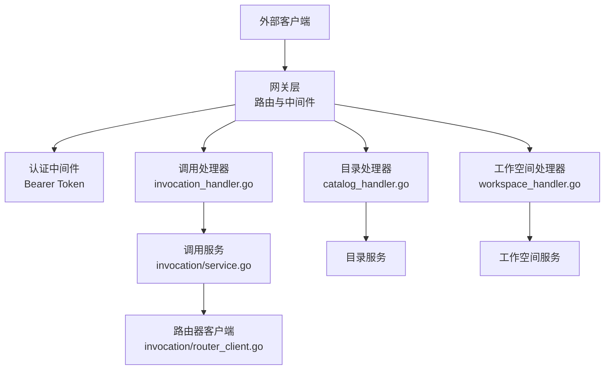
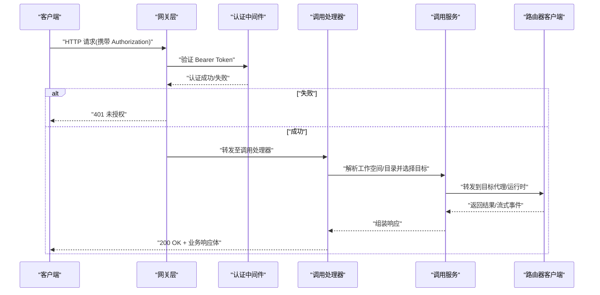
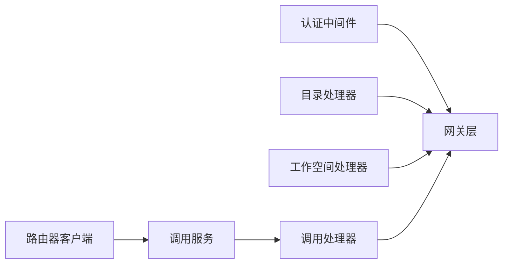

# 控制平面 API

<cite>
**本文引用的文件**   
- [apps/control-plane/cmd/control-plane/main.go](file://apps/control-plane/cmd/control-plane/main.go)
- [apps/control-plane/internal/gateway/auth.go](file://apps/control-plane/internal/gateway/auth.go)
- [apps/control-plane/internal/gateway/catalog_handler.go](file://apps/control-plane/internal/gateway/catalog_handler.go)
- [apps/control-plane/internal/gateway/invocation_handler.go](file://apps/control-plane/internal/gateway/invocation_handler.go)
- [apps/control-plane/internal/gateway/workspace_handler.go](file://apps/control-plane/internal/gateway/workspace_handler.go)
- [apps/control-plane/internal/gateway/errors.go](file://apps/control-plane/internal/gateway/errors.go)
- [apps/control-plane/internal/invocation/service.go](file://apps/control-plane/internal/invocation/service.go)
- [apps/control-plane/internal/invocation/router_client.go](file://apps/control-plane/internal/invocation/router_client.go)
- [contracts/openapi/control-plane.v1.yaml](file://contracts/openapi/control-plane.v1.yaml)
- [contracts/openapi/control-plane.v2.yaml](file://contracts/openapi/control-plane.v2.yaml)
- [contracts/openapi/control-plane.v3.yaml](file://contracts/openapi/control-plane.v3.yaml)
- [contracts/openapi/control-plane-invocation.v4.yaml](file://contracts/openapi/control-plane-invocation.v4.yaml)
- [contracts/schemas/platform-error.v1.schema.json](file://contracts/schemas/platform-error.v1.schema.json)
- [contracts/schemas/platform-error.v2.schema.json](file://contracts/schemas/platform-error.v2.schema.json)
- [contracts/schemas/platform-error.v3.schema.json](file://contracts/schemas/platform-error.v3.schema.json)
- [contracts/schemas/platform-error.v4.schema.json](file://contracts/schemas/platform-error.v4.schema.json)
- [contracts/schemas/workspace.v1.schema.json](file://contracts/schemas/workspace.v1.schema.json)
- [contracts/workspace_api_contracts_test.go](file://contracts/workspace_api_contracts_test.go)
- [contracts/result_api_contracts_test.go](file://contracts/result_api_contracts_test.go)
- [contracts/catalog_api_contracts_test.go](file://contracts/catalog_api_contracts_test.go)
</cite>

## 目录
1. [简介](#简介)
2. [项目结构](#项目结构)
3. [核心组件](#核心组件)
4. [架构总览](#架构总览)
5. [详细组件分析](#详细组件分析)
6. [依赖关系分析](#依赖关系分析)
7. [性能考虑](#性能考虑)
8. [故障排查指南](#故障排查指南)
9. [结论](#结论)
10. [附录](#附录)

## 简介
本文件为 NeKiro 控制平面的对外 REST API 文档，覆盖以下能力：
- 代理管理：注册、发现、状态查询
- 工作空间管理：创建、配置、权限设置
- 调用路由：请求分发、负载均衡
- 认证与鉴权：Bearer Token
- 错误处理策略与统一错误模型
- 版本兼容性与迁移指南
- 客户端最佳实践与性能优化建议

说明：
- 本文档以 OpenAPI 契约（contracts/openapi/*.yaml）和网关处理器实现（internal/gateway/*_handler.go）为依据，结合内部服务（invocation service、catalog、workspace）进行端到端描述。
- 为避免泄露具体实现细节，本文不直接粘贴代码片段，而是通过“章节来源”指向对应源码位置。

## 项目结构
控制平面对外 HTTP 接口由网关层暴露，主要涉及：
- 入口与路由装配：main.go
- 认证中间件：auth.go
- 业务处理器：
  - catalog_handler.go：代理/目录相关
  - workspace_handler.go：工作空间相关
  - invocation_handler.go：调用路由相关
- 内部服务：
  - invocation/service.go：调用编排
  - invocation/router_client.go：与路由器交互
- OpenAPI 契约与 Schema：contracts/openapi/* 与 contracts/schemas/*

图表来源
- [apps/control-plane/cmd/control-plane/main.go](file://apps/control-plane/cmd/control-plane/main.go)
- [apps/control-plane/internal/gateway/auth.go](file://apps/control-plane/internal/gateway/auth.go)
- [apps/control-plane/internal/gateway/catalog_handler.go](file://apps/control-plane/internal/gateway/catalog_handler.go)
- [apps/control-plane/internal/gateway/workspace_handler.go](file://apps/control-plane/internal/gateway/workspace_handler.go)
- [apps/control-plane/internal/gateway/invocation_handler.go](file://apps/control-plane/internal/gateway/invocation_handler.go)
- [apps/control-plane/internal/invocation/service.go](file://apps/control-plane/internal/invocation/service.go)
- [apps/control-plane/internal/invocation/router_client.go](file://apps/control-plane/internal/invocation/router_client.go)

章节来源
- [apps/control-plane/cmd/control-plane/main.go](file://apps/control-plane/cmd/control-plane/main.go)
- [apps/control-plane/internal/gateway/auth.go](file://apps/control-plane/internal/gateway/auth.go)
- [apps/control-plane/internal/gateway/catalog_handler.go](file://apps/control-plane/internal/gateway/catalog_handler.go)
- [apps/control-plane/internal/gateway/workspace_handler.go](file://apps/control-plane/internal/gateway/workspace_handler.go)
- [apps/control-plane/internal/gateway/invocation_handler.go](file://apps/control-plane/internal/gateway/invocation_handler.go)
- [apps/control-plane/internal/invocation/service.go](file://apps/control-plane/internal/invocation/service.go)
- [apps/control-plane/internal/invocation/router_client.go](file://apps/control-plane/internal/invocation/router_client.go)

## 核心组件
- 认证中间件：校验 Bearer Token，失败返回 401；成功则注入上下文供后续处理器使用。
- 目录处理器：提供代理注册、发现、健康/状态查询等能力。
- 工作空间处理器：创建工作空间、更新配置、设置权限策略。
- 调用处理器：接收调用请求，基于工作空间与目录信息选择目标代理并转发，支持负载均衡策略。
- 调用服务：封装调用编排逻辑，协调目录与工作空间数据，决定路由目标。
- 路由器客户端：与下游路由器或运行时通信，执行实际转发与结果回传。

章节来源
- [apps/control-plane/internal/gateway/auth.go](file://apps/control-plane/internal/gateway/auth.go)
- [apps/control-plane/internal/gateway/catalog_handler.go](file://apps/control-plane/internal/gateway/catalog_handler.go)
- [apps/control-plane/internal/gateway/workspace_handler.go](file://apps/control-plane/internal/gateway/workspace_handler.go)
- [apps/control-plane/internal/gateway/invocation_handler.go](file://apps/control-plane/internal/gateway/invocation_handler.go)
- [apps/control-plane/internal/invocation/service.go](file://apps/control-plane/internal/invocation/service.go)
- [apps/control-plane/internal/invocation/router_client.go](file://apps/control-plane/internal/invocation/router_client.go)

## 架构总览
控制平面作为统一入口，将外部请求按领域路由到相应处理器，并在需要时组合目录与工作空间信息完成决策与转发。

图表来源
- [apps/control-plane/internal/gateway/auth.go](file://apps/control-plane/internal/gateway/auth.go)
- [apps/control-plane/internal/gateway/invocation_handler.go](file://apps/control-plane/internal/gateway/invocation_handler.go)
- [apps/control-plane/internal/invocation/service.go](file://apps/control-plane/internal/invocation/service.go)
- [apps/control-plane/internal/invocation/router_client.go](file://apps/control-plane/internal/invocation/router_client.go)

## 详细组件分析

### 认证与通用请求头
- 认证方式：Authorization: Bearer <token>
- 失败响应：401 Unauthorized，错误体遵循平台错误 Schema
- 成功：继续进入业务处理器

章节来源
- [apps/control-plane/internal/gateway/auth.go](file://apps/control-plane/internal/gateway/auth.go)
- [contracts/schemas/platform-error.v1.schema.json](file://contracts/schemas/platform-error.v1.schema.json)
- [contracts/schemas/platform-error.v2.schema.json](file://contracts/schemas/platform-error.v2.schema.json)
- [contracts/schemas/platform-error.v3.schema.json](file://contracts/schemas/platform-error.v3.schema.json)
- [contracts/schemas/platform-error.v4.schema.json](file://contracts/schemas/platform-error.v4.schema.json)

### 目录（代理）管理 API
- 典型端点
  - POST /v1/catalog/proxies/register：注册代理
  - GET /v1/catalog/proxies/{id}：查询代理详情
  - GET /v1/catalog/proxies：列出代理（支持分页/过滤）
  - DELETE /v1/catalog/proxies/{id}：注销代理
  - GET /v1/catalog/proxies/{id}/health：健康检查
- 请求参数
  - 路径参数：id
  - 查询参数：page, page_size, filter（如 status、tags）
  - 请求体：代理元数据、能力声明、连接信息等
- 响应格式
  - 成功：201/200/204，返回代理实体或空体
  - 失败：4xx/5xx，错误体遵循 platform-error Schema
- 状态码
  - 201 Created：注册成功
  - 200 OK：查询成功
  - 204 No Content：删除成功
  - 400 Bad Request：参数校验失败
  - 401 Unauthorized：认证失败
  - 404 Not Found：代理不存在
  - 409 Conflict：重复注册
  - 500 Internal Server Error：服务端异常

章节来源
- [apps/control-plane/internal/gateway/catalog_handler.go](file://apps/control-plane/internal/gateway/catalog_handler.go)
- [contracts/openapi/control-plane.v1.yaml](file://contracts/openapi/control-plane.v1.yaml)
- [contracts/openapi/control-plane.v2.yaml](file://contracts/openapi/control-plane.v2.yaml)
- [contracts/openapi/control-plane.v3.yaml](file://contracts/openapi/control-plane.v3.yaml)
- [contracts/catalog_api_contracts_test.go](file://contracts/catalog_api_contracts_test.go)
- [contracts/schemas/platform-error.v1.schema.json](file://contracts/schemas/platform-error.v1.schema.json)

### 工作空间管理 API
- 典型端点
  - POST /v1/workspaces：创建工作空间
  - GET /v1/workspaces/{id}：获取工作空间详情
  - PUT /v1/workspaces/{id}：更新工作空间配置
  - DELETE /v1/workspaces/{id}：删除工作空间
  - POST /v1/workspaces/{id}/permissions：设置权限策略
  - GET /v1/workspaces/{id}/permissions：读取权限策略
- 请求参数
  - 路径参数：id
  - 请求体：工作空间名称、描述、默认策略、关联的代理白名单/黑名单等
- 响应格式
  - 成功：201/200/204，返回工作空间实体或空体
  - 失败：4xx/5xx，错误体遵循 platform-error Schema
- 状态码
  - 201 Created：创建成功
  - 200 OK：查询/更新成功
  - 204 No Content：删除/权限设置成功
  - 400 Bad Request：参数校验失败
  - 401 Unauthorized：认证失败
  - 403 Forbidden：无权限操作
  - 404 Not Found：工作空间不存在
  - 409 Conflict：资源冲突（如重名）
  - 500 Internal Server Error：服务端异常

章节来源
- [apps/control-plane/internal/gateway/workspace_handler.go](file://apps/control-plane/internal/gateway/workspace_handler.go)
- [contracts/openapi/control-plane.v1.yaml](file://contracts/openapi/control-plane.v1.yaml)
- [contracts/openapi/control-plane.v2.yaml](file://contracts/openapi/control-plane.v2.yaml)
- [contracts/openapi/control-plane.v3.yaml](file://contracts/openapi/control-plane.v3.yaml)
- [contracts/schemas/workspace.v1.schema.json](file://contracts/schemas/workspace.v1.schema.json)
- [contracts/workspace_api_contracts_test.go](file://contracts/workspace_api_contracts_test.go)
- [contracts/schemas/platform-error.v1.schema.json](file://contracts/schemas/platform-error.v1.schema.json)

### 调用路由 API
- 典型端点
  - POST /v1/invocations：发起一次调用
  - GET /v1/invocations/{id}：查询调用状态/结果
  - DELETE /v1/invocations/{id}：取消调用（若可取消）
- 请求参数
  - 路径参数：id
  - 请求体：目标能力标识、输入参数、工作空间上下文、超时、重试策略等
- 响应格式
  - 同步：200 OK，返回结果对象
  - 异步/流式：根据契约定义的事件/流式协议返回
  - 失败：4xx/5xx，错误体遵循 platform-error Schema
- 状态码
  - 200 OK：成功
  - 202 Accepted：已接受（异步场景）
  - 204 No Content：取消成功
  - 400 Bad Request：参数校验失败
  - 401 Unauthorized：认证失败
  - 403 Forbidden：无权限
  - 404 Not Found：调用不存在
  - 409 Conflict：并发冲突
  - 429 Too Many Requests：触发速率限制
  - 500 Internal Server Error：服务端异常
  - 503 Service Unavailable：下游不可用

章节来源
- [apps/control-plane/internal/gateway/invocation_handler.go](file://apps/control-plane/internal/gateway/invocation_handler.go)
- [apps/control-plane/internal/invocation/service.go](file://apps/control-plane/internal/invocation/service.go)
- [apps/control-plane/internal/invocation/router_client.go](file://apps/control-plane/internal/invocation/router_client.go)
- [contracts/openapi/control-plane-invocation.v4.yaml](file://contracts/openapi/control-plane-invocation.v4.yaml)
- [contracts/result_api_contracts_test.go](file://contracts/result_api_contracts_test.go)
- [contracts/schemas/platform-error.v1.schema.json](file://contracts/schemas/platform-error.v1.schema.json)

### 错误处理与统一错误模型
- 所有错误响应遵循 platform-error Schema（v1/v2/v3/v4），包含错误码、消息、追踪 ID 等字段
- 常见错误码示例：
  - UNAUTHORIZED：认证失败
  - FORBIDDEN：鉴权失败
  - NOT_FOUND：资源不存在
  - CONFLICT：资源冲突
  - INVALID_REQUEST：请求参数无效
  - RATE_LIMITED：触发限流
  - INTERNAL_ERROR：内部错误
- 建议在客户端侧对错误码进行分类处理，记录追踪 ID 用于排障

章节来源
- [apps/control-plane/internal/gateway/errors.go](file://apps/control-plane/internal/gateway/errors.go)
- [contracts/schemas/platform-error.v1.schema.json](file://contracts/schemas/platform-error.v1.schema.json)
- [contracts/schemas/platform-error.v2.schema.json](file://contracts/schemas/platform-error.v2.schema.json)
- [contracts/schemas/platform-error.v3.schema.json](file://contracts/schemas/platform-error.v3.schema.json)
- [contracts/schemas/platform-error.v4.schema.json](file://contracts/schemas/platform-error.v4.schema.json)

### 版本兼容性与迁移指南
- 当前公开版本：v1、v2、v3（目录与工作空间）、v4（调用）
- 兼容性原则：
  - 新增字段向后兼容，客户端忽略未知字段
  - 删除字段需保留一段时间并提供弃用提示
  - 行为变更通过新版本号发布
- 迁移建议：
  - 优先使用最新稳定版契约
  - 在升级前运行契约测试套件
  - 逐步替换旧版路径与字段，观察错误日志

章节来源
- [contracts/openapi/control-plane.v1.yaml](file://contracts/openapi/control-plane.v1.yaml)
- [contracts/openapi/control-plane.v2.yaml](file://contracts/openapi/control-plane.v2.yaml)
- [contracts/openapi/control-plane.v3.yaml](file://contracts/openapi/control-plane.v3.yaml)
- [contracts/openapi/control-plane-invocation.v4.yaml](file://contracts/openapi/control-plane-invocation.v4.yaml)

### 客户端最佳实践与性能优化
- 连接复用：启用 HTTP Keep-Alive，合理设置连接池大小
- 超时与重试：
  - 设置合理的请求超时与重试退避策略
  - 幂等请求可安全重试，非幂等需谨慎
- 缓存：
  - 对只读目录/工作空间信息做短期缓存，降低频繁查询
- 批处理：
  - 批量注册/更新尽量合并以减少往返
- 监控与可观测性：
  - 记录请求耗时、错误率、下游延迟
  - 上报关键指标以便容量规划

[本节为通用指导，无需源码引用]

## 依赖关系分析
- 网关层依赖认证中间件与各业务处理器
- 调用处理器依赖调用服务，调用服务依赖目录与工作空间数据源，并通过路由器客户端与下游通信
- 错误模型在各层统一使用

图表来源
- [apps/control-plane/internal/gateway/auth.go](file://apps/control-plane/internal/gateway/auth.go)
- [apps/control-plane/internal/gateway/catalog_handler.go](file://apps/control-plane/internal/gateway/catalog_handler.go)
- [apps/control-plane/internal/gateway/workspace_handler.go](file://apps/control-plane/internal/gateway/workspace_handler.go)
- [apps/control-plane/internal/gateway/invocation_handler.go](file://apps/control-plane/internal/gateway/invocation_handler.go)
- [apps/control-plane/internal/invocation/service.go](file://apps/control-plane/internal/invocation/service.go)
- [apps/control-plane/internal/invocation/router_client.go](file://apps/control-plane/internal/invocation/router_client.go)

章节来源
- [apps/control-plane/internal/gateway/auth.go](file://apps/control-plane/internal/gateway/auth.go)
- [apps/control-plane/internal/gateway/catalog_handler.go](file://apps/control-plane/internal/gateway/catalog_handler.go)
- [apps/control-plane/internal/gateway/workspace_handler.go](file://apps/control-plane/internal/gateway/workspace_handler.go)
- [apps/control-plane/internal/gateway/invocation_handler.go](file://apps/control-plane/internal/gateway/invocation_handler.go)
- [apps/control-plane/internal/invocation/service.go](file://apps/control-plane/internal/invocation/service.go)
- [apps/control-plane/internal/invocation/router_client.go](file://apps/control-plane/internal/invocation/router_client.go)

## 性能考虑
- 路由选择：
  - 基于工作空间策略与目录权重进行负载均衡
  - 避免热点代理，采用轮询/最少连接等策略
- 缓存与预取：
  - 目录与工作空间元数据短缓存，减少数据库压力
- 背压与限流：
  - 针对高 QPS 端点实施令牌桶/滑动窗口限流
- 连接与线程池：
  - 合理配置 I/O 线程与连接池，避免阻塞
- 序列化与传输：
  - 使用高效序列化格式，压缩大响应体

[本节为通用指导，无需源码引用]

## 故障排查指南
- 常见问题定位步骤：
  - 确认 Authorization 头是否正确
  - 检查请求体是否符合对应 Schema
  - 查看错误响应中的 error_code 与 message
  - 使用追踪 ID 在日志中检索完整链路
- 常见错误及处理：
  - 401：检查 Token 是否过期或权限不足
  - 403：检查工作空间权限策略是否允许该操作
  - 404：确认资源 ID 是否存在
  - 409：解决命名冲突或并发写入问题
  - 429：降低请求频率或申请更高配额
  - 500/503：查看服务端日志与下游健康状态

章节来源
- [apps/control-plane/internal/gateway/errors.go](file://apps/control-plane/internal/gateway/errors.go)
- [contracts/schemas/platform-error.v1.schema.json](file://contracts/schemas/platform-error.v1.schema.json)
- [contracts/schemas/platform-error.v2.schema.json](file://contracts/schemas/platform-error.v2.schema.json)
- [contracts/schemas/platform-error.v3.schema.json](file://contracts/schemas/platform-error.v3.schema.json)
- [contracts/schemas/platform-error.v4.schema.json](file://contracts/schemas/platform-error.v4.schema.json)

## 结论
本文档系统化梳理了 NeKiro 控制平面的对外 REST API，涵盖代理管理、工作空间管理与调用路由三大域，明确了认证、错误模型、版本兼容与性能优化要点。建议客户端严格遵循契约与最佳实践，结合监控与限流策略保障稳定性与可扩展性。

[本节为总结，无需源码引用]

## 附录

### 请求/响应示例（路径与字段说明）
- 认证
  - 请求头：Authorization: Bearer <token>
  - 成功：200/201/204
  - 失败：401
- 目录管理
  - POST /v1/catalog/proxies/register
    - 请求体：代理元数据、能力、连接信息
    - 响应：201 Created + 代理实体
  - GET /v1/catalog/proxies/{id}
    - 响应：200 OK + 代理实体
  - DELETE /v1/catalog/proxies/{id}
    - 响应：204 No Content
- 工作空间管理
  - POST /v1/workspaces
    - 请求体：名称、描述、默认策略
    - 响应：201 Created + 工作空间实体
  - PUT /v1/workspaces/{id}
    - 请求体：待更新字段
    - 响应：200 OK + 工作空间实体
  - POST /v1/workspaces/{id}/permissions
    - 请求体：权限策略
    - 响应：204 No Content
- 调用路由
  - POST /v1/invocations
    - 请求体：目标能力、输入参数、工作空间上下文
    - 响应：200 OK 或 202 Accepted（异步）
  - GET /v1/invocations/{id}
    - 响应：200 OK + 调用结果/状态
  - DELETE /v1/invocations/{id}
    - 响应：204 No Content

[本节为契约层面的说明，具体字段请参考对应 OpenAPI 与 Schema 文件]

章节来源
- [contracts/openapi/control-plane.v1.yaml](file://contracts/openapi/control-plane.v1.yaml)
- [contracts/openapi/control-plane.v2.yaml](file://contracts/openapi/control-plane.v2.yaml)
- [contracts/openapi/control-plane.v3.yaml](file://contracts/openapi/control-plane.v3.yaml)
- [contracts/openapi/control-plane-invocation.v4.yaml](file://contracts/openapi/control-plane-invocation.v4.yaml)
- [contracts/schemas/platform-error.v1.schema.json](file://contracts/schemas/platform-error.v1.schema.json)
- [contracts/schemas/workspace.v1.schema.json](file://contracts/schemas/workspace.v1.schema.json)