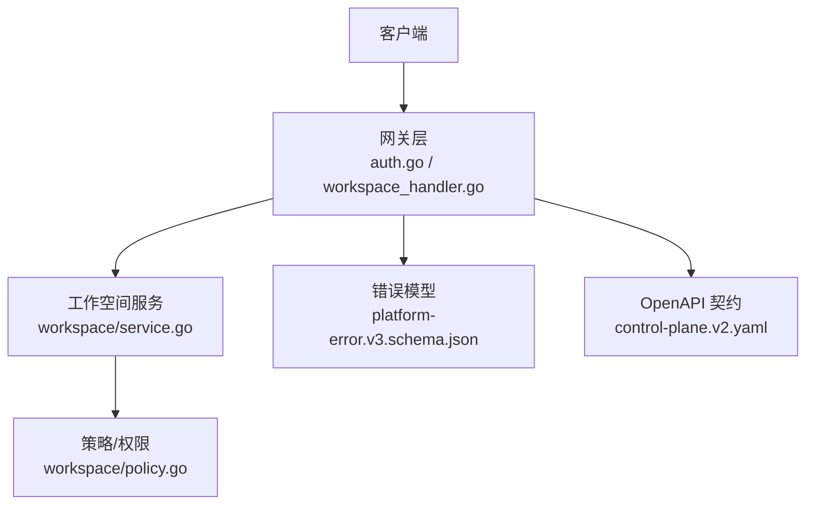
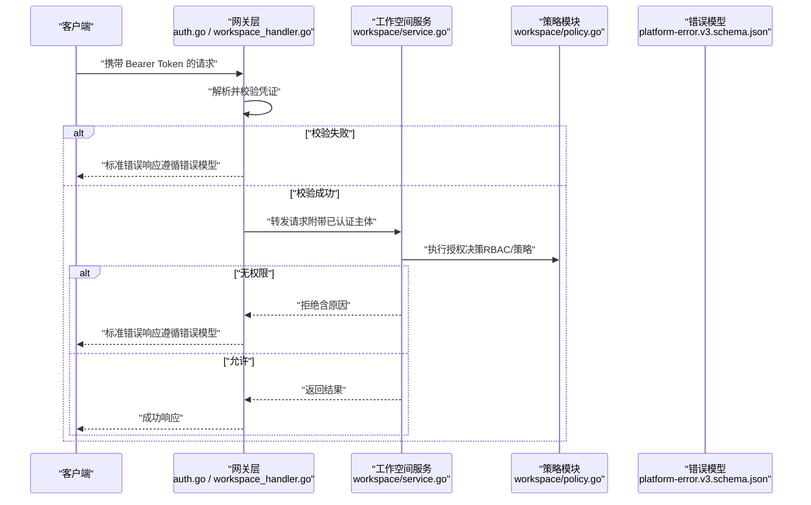
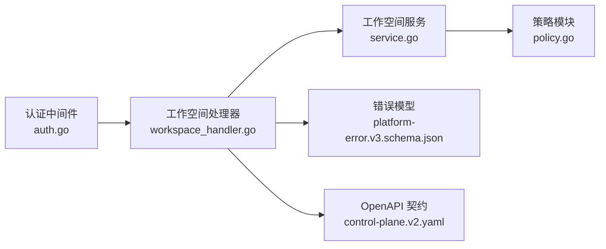

# 认证与授权

<cite>
**本文引用的文件**   
- [apps/control-plane/cmd/control-plane/main.go](file://apps/control-plane/cmd/control-plane/main.go)
- [apps/control-plane/internal/gateway/auth.go](file://apps/control-plane/internal/gateway/auth.go)
- [apps/control-plane/internal/gateway/workspace_handler.go](file://apps/control-plane/internal/gateway/workspace_handler.go)
- [apps/control-plane/internal/workspace/service.go](file://apps/control-plane/internal/workspace/service.go)
- [apps/control-plane/internal/workspace/policy.go](file://apps/control-plane/internal/workspace/policy.go)
- [contracts/openapi/control-plane.v2.yaml](file://contracts/openapi/control-plane.v2.yaml)
- [contracts/schemas/platform-error.v3.schema.json](file://contracts/schemas/platform-error.v3.schema.json)
</cite>

## 目录
1. [简介](#简介)
2. [项目结构](#项目结构)
3. [核心组件](#核心组件)
4. [架构总览](#架构总览)
5. [详细组件分析](#详细组件分析)
6. [依赖分析](#依赖分析)
7. [性能考虑](#性能考虑)
8. [故障排查指南](#故障排查指南)
9. [结论](#结论)
10. [附录](#附录)

## 简介
本文件为 NeKiro 平台的“认证与授权”专题文档，聚焦以下能力：
- Bearer Token 认证机制与中间件使用
- JWT 令牌生成与验证流程（概念性说明）
- 多租户工作空间访问控制策略、权限模型与资源隔离
- API Key 管理（概念性说明）
- OAuth2 集成（概念性说明）
- RBAC 权限控制与审计日志记录（概念性说明）
- 自定义认证提供者的实现指南与安全最佳实践
- 权限策略配置方法、动态授权决策与权限继承规则

说明：
- 本节为总体概述，不直接分析具体代码文件。

## 项目结构
NeKiro 的控制面服务位于 apps/control-plane，认证与授权相关的关键位置如下：
- 入口与路由装配：cmd/control-plane/main.go
- 网关层鉴权与请求处理：internal/gateway/auth.go、workspace_handler.go
- 工作空间领域逻辑与策略：internal/workspace/service.go、internal/workspace/policy.go
- OpenAPI 契约与错误模型：contracts/openapi/control-plane.v2.yaml、contracts/schemas/platform-error.v3.schema.json

图表来源
- [apps/control-plane/cmd/control-plane/main.go](file://apps/control-plane/cmd/control-plane/main.go)
- [apps/control-plane/internal/gateway/auth.go](file://apps/control-plane/internal/gateway/auth.go)
- [apps/control-plane/internal/gateway/workspace_handler.go](file://apps/control-plane/internal/gateway/workspace_handler.go)
- [apps/control-plane/internal/workspace/service.go](file://apps/control-plane/internal/workspace/service.go)
- [apps/control-plane/internal/workspace/policy.go](file://apps/control-plane/internal/workspace/policy.go)
- [contracts/openapi/control-plane.v2.yaml](file://contracts/openapi/control-plane.v2.yaml)
- [contracts/schemas/platform-error.v3.schema.json](file://contracts/schemas/platform-error.v3.schema.json)

章节来源
- [apps/control-plane/cmd/control-plane/main.go](file://apps/control-plane/cmd/control-plane/main.go)
- [apps/control-plane/internal/gateway/auth.go](file://apps/control-plane/internal/gateway/auth.go)
- [apps/control-plane/internal/gateway/workspace_handler.go](file://apps/control-plane/internal/gateway/workspace_handler.go)
- [apps/control-plane/internal/workspace/service.go](file://apps/control-plane/internal/workspace/service.go)
- [apps/control-plane/internal/workspace/policy.go](file://apps/control-plane/internal/workspace/policy.go)
- [contracts/openapi/control-plane.v2.yaml](file://contracts/openapi/control-plane.v2.yaml)
- [contracts/schemas/platform-error.v3.schema.json](file://contracts/schemas/platform-error.v3.schema.json)

## 核心组件
- 认证中间件（Gateway 层）
  - 负责解析并校验请求中的身份凭证（如 Bearer Token），将已认证主体注入上下文，供后续处理器使用。
  - 典型职责：提取 Authorization 头、校验签名/有效期、失败时返回标准错误响应。
- 工作空间处理器（Workspace Handler）
  - 基于工作空间标识进行资源级访问控制，结合策略模块执行授权决策。
- 工作空间服务（Workspace Service）
  - 承载工作空间相关的业务逻辑，调用策略模块完成权限判定与数据隔离。
- 策略模块（Policy）
  - 定义与评估访问策略，支持基于角色/属性/资源的动态决策。
- 错误模型与 OpenAPI 契约
  - 统一错误响应结构与接口契约，确保跨系统一致性。

章节来源
- [apps/control-plane/internal/gateway/auth.go](file://apps/control-plane/internal/gateway/auth.go)
- [apps/control-plane/internal/gateway/workspace_handler.go](file://apps/control-plane/internal/gateway/workspace_handler.go)
- [apps/control-plane/internal/workspace/service.go](file://apps/control-plane/internal/workspace/service.go)
- [apps/control-plane/internal/workspace/policy.go](file://apps/control-plane/internal/workspace/policy.go)
- [contracts/openapi/control-plane.v2.yaml](file://contracts/openapi/control-plane.v2.yaml)
- [contracts/schemas/platform-error.v3.schema.json](file://contracts/schemas/platform-error.v3.schema.json)

## 架构总览
下图展示了从客户端到工作空间服务的端到端认证与授权路径，以及错误响应与契约约束。

图表来源
- [apps/control-plane/internal/gateway/auth.go](file://apps/control-plane/internal/gateway/auth.go)
- [apps/control-plane/internal/gateway/workspace_handler.go](file://apps/control-plane/internal/gateway/workspace_handler.go)
- [apps/control-plane/internal/workspace/service.go](file://apps/control-plane/internal/workspace/service.go)
- [apps/control-plane/internal/workspace/policy.go](file://apps/control-plane/internal/workspace/policy.go)
- [contracts/schemas/platform-error.v3.schema.json](file://contracts/schemas/platform-error.v3.schema.json)

## 详细组件分析

### 认证中间件（Bearer Token）
- 功能要点
  - 从请求头中提取 Bearer Token
  - 校验令牌格式、签名与有效期
  - 将认证主体信息写入请求上下文
  - 失败时返回符合错误模型的响应
- 使用示例（概念）
  - 在路由注册处挂载认证中间件，使受保护路由自动校验 Bearer Token
  - 未携带或无效 Token 的请求将被拦截并返回标准错误
- 安全建议
  - 强制 HTTPS
  - 最小化令牌的载荷范围
  - 设置合理的过期时间并支持刷新机制（概念性）

章节来源
- [apps/control-plane/internal/gateway/auth.go](file://apps/control-plane/internal/gateway/auth.go)
- [contracts/schemas/platform-error.v3.schema.json](file://contracts/schemas/platform-error.v3.schema.json)

### 工作空间处理器（Workspace Handler）
- 功能要点
  - 解析工作空间标识（如路径参数或查询参数）
  - 将工作空间上下文传递给服务层
  - 根据策略模块的决策决定放行或拒绝
- 与认证的关系
  - 先由认证中间件完成身份确认，再由处理器进行资源级授权

章节来源
- [apps/control-plane/internal/gateway/workspace_handler.go](file://apps/control-plane/internal/gateway/workspace_handler.go)

### 工作空间服务（Workspace Service）
- 功能要点
  - 执行业务操作前调用策略模块进行授权检查
  - 保证工作空间维度的数据隔离（例如仅访问当前工作空间内的资源）
- 与策略模块的协作
  - 通过策略接口获取授权结果；若拒绝则向上游返回错误

章节来源
- [apps/control-plane/internal/workspace/service.go](file://apps/control-plane/internal/workspace/service.go)

### 策略模块（Policy）
- 功能要点
  - 实现 RBAC 与基于属性的访问控制（ABAC）组合
  - 支持动态授权决策（依据请求上下文、资源属性、环境条件等）
  - 可配置的策略规则与继承关系（例如组织→团队→个人）
- 扩展点
  - 新增策略类型、策略源（本地/远程）、缓存与审计钩子

章节来源
- [apps/control-plane/internal/workspace/policy.go](file://apps/control-plane/internal/workspace/policy.go)

### 错误模型与 OpenAPI 契约
- 错误模型
  - 统一的错误响应结构，便于客户端一致化处理
- OpenAPI 契约
  - 明确认证要求（如 Bearer Token）、状态码与错误语义

章节来源
- [contracts/openapi/control-plane.v2.yaml](file://contracts/openapi/control-plane.v2.yaml)
- [contracts/schemas/platform-error.v3.schema.json](file://contracts/schemas/platform-error.v3.schema.json)

## 依赖分析
- 组件耦合
  - 网关层依赖认证中间件与工作空间处理器
  - 工作空间服务依赖策略模块进行授权决策
  - 错误模型与 OpenAPI 契约贯穿各层，保障一致性
- 外部依赖
  - 密钥管理与签名校验（概念性）
  - 策略存储与缓存（概念性）
  - 审计日志输出（概念性）

图表来源
- [apps/control-plane/internal/gateway/auth.go](file://apps/control-plane/internal/gateway/auth.go)
- [apps/control-plane/internal/gateway/workspace_handler.go](file://apps/control-plane/internal/gateway/workspace_handler.go)
- [apps/control-plane/internal/workspace/service.go](file://apps/control-plane/internal/workspace/service.go)
- [apps/control-plane/internal/workspace/policy.go](file://apps/control-plane/internal/workspace/policy.go)
- [contracts/openapi/control-plane.v2.yaml](file://contracts/openapi/control-plane.v2.yaml)
- [contracts/schemas/platform-error.v3.schema.json](file://contracts/schemas/platform-error.v3.schema.json)

章节来源
- [apps/control-plane/internal/gateway/auth.go](file://apps/control-plane/internal/gateway/auth.go)
- [apps/control-plane/internal/gateway/workspace_handler.go](file://apps/control-plane/internal/gateway/workspace_handler.go)
- [apps/control-plane/internal/workspace/service.go](file://apps/control-plane/internal/workspace/service.go)
- [apps/control-plane/internal/workspace/policy.go](file://apps/control-plane/internal/workspace/policy.go)
- [contracts/openapi/control-plane.v2.yaml](file://contracts/openapi/control-plane.v2.yaml)
- [contracts/schemas/platform-error.v3.schema.json](file://contracts/schemas/platform-error.v3.schema.json)

## 性能考虑
- 认证开销
  - 对每次请求进行签名校验可能带来额外延迟，建议引入令牌白名单/缓存（概念性）
- 策略评估
  - 高频策略评估应缓存结果，避免重复计算（概念性）
- 错误响应
  - 快速失败，减少不必要的下游调用

[本节为通用指导，不直接分析具体文件]

## 故障排查指南
- 常见错误
  - 缺少或无效的 Bearer Token：检查请求头与证书/密钥配置
  - 工作空间越权访问：检查工作空间上下文传递与策略规则
  - 策略评估失败：检查策略配置与上下文属性是否完整
- 定位步骤
  - 查看网关层日志（认证失败/拒绝）
  - 检查策略模块的决策输入与输出
  - 对照 OpenAPI 契约与错误模型，确认响应结构正确

章节来源
- [apps/control-plane/internal/gateway/auth.go](file://apps/control-plane/internal/gateway/auth.go)
- [apps/control-plane/internal/workspace/policy.go](file://apps/control-plane/internal/workspace/policy.go)
- [contracts/schemas/platform-error.v3.schema.json](file://contracts/schemas/platform-error.v3.schema.json)

## 结论
NeKiro 平台在网关层实现了基于 Bearer Token 的认证，并通过工作空间服务与策略模块完成资源级授权与数据隔离。统一的错误模型与 OpenAPI 契约保障了跨系统的一致性。建议在部署中完善密钥管理、策略缓存与审计日志，以满足生产环境的安全与可观测性需求。

[本节为总结，不直接分析具体文件]

## 附录

### Bearer Token 认证机制
- 流程
  - 客户端在 Authorization 头携带 Bearer Token
  - 认证中间件校验令牌后放行
  - 失败时返回标准错误
- 参考
  - 认证中间件实现：[apps/control-plane/internal/gateway/auth.go](file://apps/control-plane/internal/gateway/auth.go)
  - 错误模型：[contracts/schemas/platform-error.v3.schema.json](file://contracts/schemas/platform-error.v3.schema.json)

章节来源
- [apps/control-plane/internal/gateway/auth.go](file://apps/control-plane/internal/gateway/auth.go)
- [contracts/schemas/platform-error.v3.schema.json](file://contracts/schemas/platform-error.v3.schema.json)

### JWT 令牌生成与验证（概念性）
- 生成
  - 服务端签发包含必要声明的 JWT，设置过期时间
- 验证
  - 网关层校验签名、有效期与声明
- 刷新
  - 提供刷新接口以延长会话（概念性）

[本节为概念性说明，不直接分析具体文件]

### 多租户工作空间访问控制与资源隔离
- 访问控制
  - 基于工作空间标识进行资源级限制
- 资源隔离
  - 服务层按工作空间过滤数据，防止跨租户访问
- 参考
  - 工作空间处理器与服务：[apps/control-plane/internal/gateway/workspace_handler.go](file://apps/control-plane/internal/gateway/workspace_handler.go)、[apps/control-plane/internal/workspace/service.go](file://apps/control-plane/internal/workspace/service.go)

章节来源
- [apps/control-plane/internal/gateway/workspace_handler.go](file://apps/control-plane/internal/gateway/workspace_handler.go)
- [apps/control-plane/internal/workspace/service.go](file://apps/control-plane/internal/workspace/service.go)

### API Key 管理（概念性）
- 用途
  - 机器对机器场景下的轻量认证
- 生命周期
  - 创建、轮换、禁用、删除
- 安全建议
  - 最小权限、定期轮换、严格存储与传输加密

[本节为概念性说明，不直接分析具体文件]

### OAuth2 集成（概念性）
- 角色
  - 作为授权服务器或资源服务器接入
- 流程
  - 授权码/客户端凭据等模式
- 参考
  - 网关层可扩展为 OAuth2 资源服务器（概念性）

[本节为概念性说明，不直接分析具体文件]

### RBAC 权限控制与审计日志（概念性）
- RBAC
  - 角色-权限映射，支持继承与组合
- 审计
  - 记录关键认证与授权事件，便于追踪与合规

[本节为概念性说明，不直接分析具体文件]

### 自定义认证提供者实现指南（概念性）
- 步骤
  - 定义认证接口（解析、校验、主体构建）
  - 在网关层注册自定义提供者
  - 适配错误模型与日志规范
- 注意
  - 保持幂等与低延迟，避免泄露敏感信息

[本节为概念性说明，不直接分析具体文件]

### 权限策略配置、动态授权与继承规则（概念性）
- 配置
  - 支持 YAML/JSON 或数据库驱动的策略定义
- 动态决策
  - 基于请求上下文、资源属性与环境条件实时评估
- 继承
  - 组织→团队→个人的层级继承，合并策略冲突

[本节为概念性说明，不直接分析具体文件]

### 安全最佳实践
- 强制 HTTPS、最小化令牌载荷、合理过期与刷新
- 策略评估缓存与限流
- 严格的密钥管理与轮换
- 完善的审计与告警

[本节为通用指导，不直接分析具体文件]