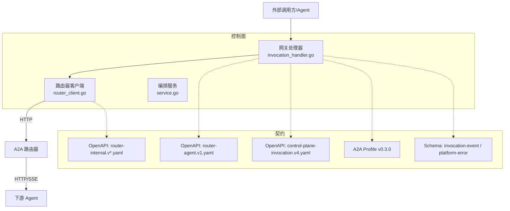
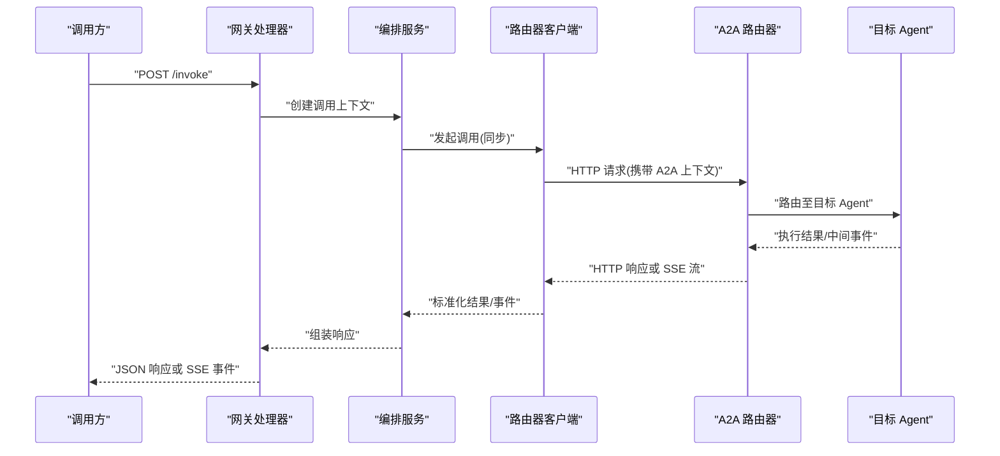
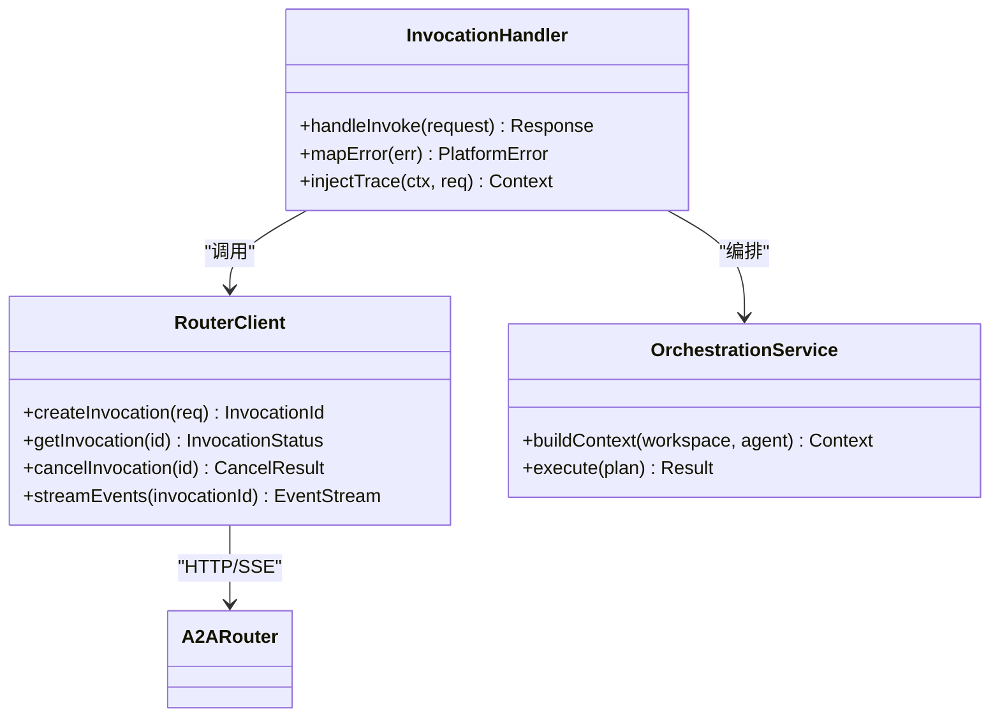
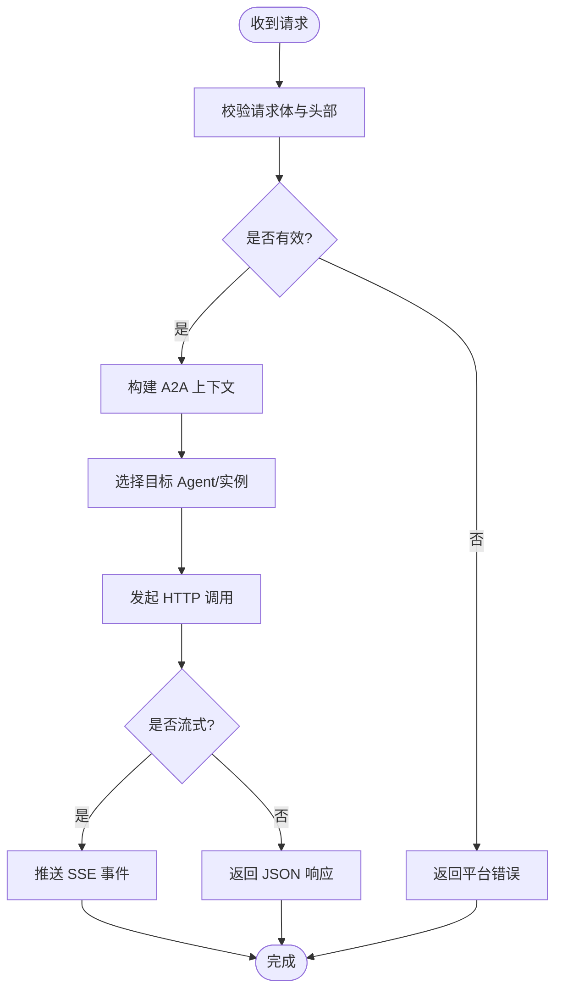
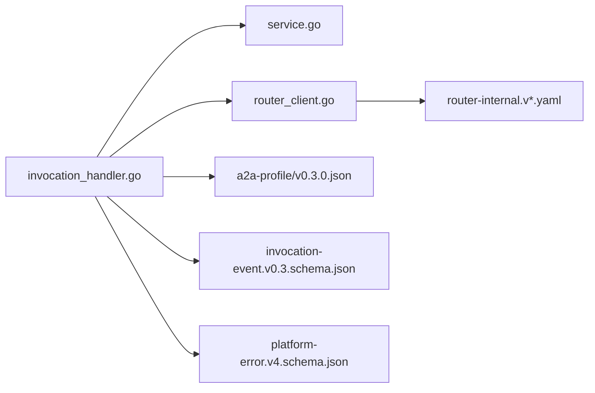

# 路由器 API

<cite>
**本文引用的文件**
- [router-agent.v1.yaml](file://contracts/openapi/router-agent.v1.yaml)
- [router-internal.v1.yaml](file://contracts/openapi/router-internal.v1.yaml)
- [router-internal.v2.yaml](file://contracts/openapi/router-internal.v2.yaml)
- [router-internal.v3.yaml](file://contracts/openapi/router-internal.v3.yaml)
- [control-plane-invocation.v4.yaml](file://contracts/openapi/control-plane-invocation.v4.yaml)
- [a2a-profile/v0.3.0.json](file://contracts/a2a-profile/v0.3.0.json)
- [invocation-runtime/v1/conformance/errors.json](file://contracts/invocation-runtime/v1/conformance/errors.json)
- [invocation-runtime/v1/conformance/lifecycle.json](file://contracts/invocation-runtime/v1/conformance/lifecycle.json)
- [invocation-runtime/v1/conformance/result-stream.json](file://contracts/invocation-runtime/v1/conformance/result-stream.json)
- [invocation-event.v0.3.schema.json](file://contracts/schemas/invocation-event.v0.3.schema.json)
- [platform-error.v4.schema.json](file://contracts/schemas/platform-error.v4.schema.json)
- [invocation_handler.go](file://apps/control-plane/internal/gateway/invocation_handler.go)
- [router_client.go](file://apps/control-plane/internal/invocation/router_client.go)
- [service.go](file://apps/control-plane/internal/invocation/service.go)
</cite>

## 目录
1. [简介](#简介)
2. [项目结构](#项目结构)
3. [核心组件](#核心组件)
4. [架构总览](#架构总览)
5. [详细组件分析](#详细组件分析)
6. [依赖分析](#依赖分析)
7. [性能考虑](#性能考虑)
8. [故障排查指南](#故障排查指南)
9. [结论](#结论)
10. [附录](#附录)

## 简介
本文件为 NeKiro A2A 路由器的 REST API 文档，聚焦于 Agent 间通信的 HTTP 端点与协议实现。内容覆盖：
- 消息路由、任务分发、状态同步与结果返回
- A2A 协议的 HTTP 实现要点、消息格式规范、会话管理、错误处理
- 路由策略配置、负载均衡算法、故障转移机制与性能监控
- Agent 集成示例（同步调用与异步回调）
- 扩展点、自定义路由规则与调试工具使用方法

## 项目结构
本项目将“控制面”和“契约定义”分离：
- 控制面服务负责编排、发现与转发，包含网关处理器与内部客户端
- 契约目录提供 OpenAPI 与 JSON Schema，用于描述路由器对外与对内接口、A2A 能力与事件模型

图表来源
- [router-agent.v1.yaml](file://contracts/openapi/router-agent.v1.yaml)
- [router-internal.v1.yaml](file://contracts/openapi/router-internal.v1.yaml)
- [router-internal.v2.yaml](file://contracts/openapi/router-internal.v2.yaml)
- [router-internal.v3.yaml](file://contracts/openapi/router-internal.v3.yaml)
- [control-plane-invocation.v4.yaml](file://contracts/openapi/control-plane-invocation.v4.yaml)
- [a2a-profile/v0.3.0.json](file://contracts/a2a-profile/v0.3.0.json)
- [invocation-event.v0.3.schema.json](file://contracts/schemas/invocation-event.v0.3.schema.json)
- [platform-error.v4.schema.json](file://contracts/schemas/platform-error.v4.schema.json)
- [invocation_handler.go](file://apps/control-plane/internal/gateway/invocation_handler.go)
- [router_client.go](file://apps/control-plane/internal/invocation/router_client.go)
- [service.go](file://apps/control-plane/internal/invocation/service.go)

章节来源
- [router-agent.v1.yaml](file://contracts/openapi/router-agent.v1.yaml)
- [router-internal.v1.yaml](file://contracts/openapi/router-internal.v1.yaml)
- [router-internal.v2.yaml](file://contracts/openapi/router-internal.v2.yaml)
- [router-internal.v3.yaml](file://contracts/openapi/router-internal.v3.yaml)
- [control-plane-invocation.v4.yaml](file://contracts/openapi/control-plane-invocation.v4.yaml)
- [a2a-profile/v0.3.0.json](file://contracts/a2a-profile/v0.3.0.json)
- [invocation-event.v0.3.schema.json](file://contracts/schemas/invocation-event.v0.3.schema.json)
- [platform-error.v4.schema.json](file://contracts/schemas/platform-error.v4.schema.json)
- [invocation_handler.go](file://apps/control-plane/internal/gateway/invocation_handler.go)
- [router_client.go](file://apps/control-plane/internal/invocation/router_client.go)
- [service.go](file://apps/control-plane/internal/invocation/service.go)

## 核心组件
- 网关处理器：接收上层控制面请求，校验参数、构造上下文、选择并调用路由器客户端，统一错误码与追踪信息注入。
- 路由器客户端：封装对 A2A 路由器的 HTTP 调用，包括同步请求、SSE 流式响应、重试与熔断等策略。
- 编排服务：聚合业务逻辑，协调工作空间、目录与服务发现，驱动调用生命周期。

章节来源
- [invocation_handler.go](file://apps/control-plane/internal/gateway/invocation_handler.go)
- [router_client.go](file://apps/control-plane/internal/invocation/router_client.go)
- [service.go](file://apps/control-plane/internal/invocation/service.go)

## 架构总览
下图展示从控制面到 A2A 路由器的端到端流程，涵盖同步与 SSE 流式两种路径。

图表来源
- [invocation_handler.go](file://apps/control-plane/internal/gateway/invocation_handler.go)
- [router_client.go](file://apps/control-plane/internal/invocation/router_client.go)
- [service.go](file://apps/control-plane/internal/invocation/service.go)
- [router-agent.v1.yaml](file://contracts/openapi/router-agent.v1.yaml)
- [router-internal.v1.yaml](file://contracts/openapi/router-internal.v1.yaml)

## 详细组件分析

### 路由器对外 API（Agent 侧）
- 协议基础
  - 传输：HTTP/1.1 或 HTTP/2
  - 内容类型：application/json；流式使用 text/event-stream
  - 认证：按部署策略通过网关鉴权或 mTLS
- 关键端点
  - 发送消息：POST /v1/messages/send
    - 用途：向指定 Agent 发送消息，支持同步返回或开启流式
    - 请求体：遵循 A2A 消息模型（含 id、contextId、parts、role 等字段）
    - 响应：成功时返回任务对象或消息结果；失败时返回平台错误
  - 查询任务：GET /v1/tasks/{taskId}
    - 用途：获取任务当前状态与部分结果
    - 响应：任务对象或平台错误
  - 取消任务：POST /v1/tasks/{taskId}/cancel
    - 用途：尝试取消可取消的任务
    - 响应：取消结果或平台错误
- 流式响应
  - 当请求头启用流式模式时，服务端以 SSE 推送事件，包含增量结果与状态变更
  - 客户端需维护 contextId 与 correlationId 以关联事件

章节来源
- [router-agent.v1.yaml](file://contracts/openapi/router-agent.v1.yaml)
- [a2a-profile/v0.3.0.json](file://contracts/a2a-profile/v0.3.0.json)

### 路由器内部 API（控制面侧）
- 目的：控制面通过内部 API 与路由器交互，屏蔽底层路由细节
- 典型端点
  - 内部调用：POST /internal/v{N}/invocations
    - 作用：创建一次跨 Agent 的调用，返回 invocationId
  - 内部查询：GET /internal/v{N}/invocations/{invocationId}
    - 作用：查询调用状态、阶段与摘要
  - 内部取消：POST /internal/v{N}/invocations/{invocationId}/cancel
- 版本演进
  - 内部 API 存在 v1/v2/v3 多版本，兼容策略由网关层决定

章节来源
- [router-internal.v1.yaml](file://contracts/openapi/router-internal.v1.yaml)
- [router-internal.v2.yaml](file://contracts/openapi/router-internal.v2.yaml)
- [router-internal.v3.yaml](file://contracts/openapi/router-internal.v3.yaml)

### 控制面编排与路由客户端
- 网关处理器
  - 职责：解析请求、校验参数、注入追踪 ID、选择路由策略、调用路由器客户端
  - 错误处理：将下游错误映射为统一平台错误格式
- 路由器客户端
  - 职责：构建 A2A 上下文、发起 HTTP 请求、处理 SSE 流、重试与超时控制
  - 负载均衡：基于路由策略选择目标实例或分区
  - 故障转移：在目标不可用时回退到备用实例或降级策略
- 编排服务
  - 职责：组合工作空间、目录与权限检查，驱动调用生命周期

图表来源
- [invocation_handler.go](file://apps/control-plane/internal/gateway/invocation_handler.go)
- [router_client.go](file://apps/control-plane/internal/invocation/router_client.go)
- [service.go](file://apps/control-plane/internal/invocation/service.go)

章节来源
- [invocation_handler.go](file://apps/control-plane/internal/gateway/invocation_handler.go)
- [router_client.go](file://apps/control-plane/internal/invocation/router_client.go)
- [service.go](file://apps/control-plane/internal/invocation/service.go)

### A2A 协议 HTTP 实现要点
- 消息模型
  - 消息包含标识、上下文、部件集合与角色信息
  - 任务对象包含状态、阶段、时间戳与结果引用
- 事件模型
  - 事件遵循 invocation-event schema，包含 traceId、rootTaskId、correlationId 等
- 错误模型
  - 平台错误遵循 platform-error schema，包含 code、message、details 等

图表来源
- [invocation-event.v0.3.schema.json](file://contracts/schemas/invocation-event.v0.3.schema.json)
- [platform-error.v4.schema.json](file://contracts/schemas/platform-error.v4.schema.json)
- [router-agent.v1.yaml](file://contracts/openapi/router-agent.v1.yaml)

章节来源
- [invocation-event.v0.3.schema.json](file://contracts/schemas/invocation-event.v0.3.schema.json)
- [platform-error.v4.schema.json](file://contracts/schemas/platform-error.v4.schema.json)
- [router-agent.v1.yaml](file://contracts/openapi/router-agent.v1.yaml)

### 路由策略与负载均衡
- 路由策略
  - 基于工作空间、标签、权重与亲和性选择目标实例
  - 支持灰度发布与蓝绿切换
- 负载均衡算法
  - 轮询、最少连接、一致性哈希（按 contextId/correlationId）
- 故障转移
  - 健康检查、快速失败、指数退避重试、熔断器
- 监控指标
  - QPS、延迟分位、错误率、重试次数、熔断触发次数

[本节为通用指导，不直接分析具体文件]

### 错误处理与兼容性
- 错误分类
  - 客户端错误（4xx）、服务端错误（5xx）、业务错误（如任务不存在、不可取消）
- 兼容性
  - 内部 API 多版本共存，网关根据协商选择版本
  - A2A Profile 与 Schema 版本化，确保向后兼容

章节来源
- [router-internal.v1.yaml](file://contracts/openapi/router-internal.v1.yaml)
- [router-internal.v2.yaml](file://contracts/openapi/router-internal.v2.yaml)
- [router-internal.v3.yaml](file://contracts/openapi/router-internal.v3.yaml)
- [platform-error.v4.schema.json](file://contracts/schemas/platform-error.v4.schema.json)

## 依赖分析
- 控制面依赖
  - 网关处理器依赖编排服务与路由器客户端
  - 路由器客户端依赖 OpenAPI 契约与 A2A Profile
- 契约依赖
  - 事件与错误模型被多处复用，保证一致性与可验证性

图表来源
- [invocation_handler.go](file://apps/control-plane/internal/gateway/invocation_handler.go)
- [router_client.go](file://apps/control-plane/internal/invocation/router_client.go)
- [service.go](file://apps/control-plane/internal/invocation/service.go)
- [router-internal.v1.yaml](file://contracts/openapi/router-internal.v1.yaml)
- [router-internal.v2.yaml](file://contracts/openapi/router-internal.v2.yaml)
- [router-internal.v3.yaml](file://contracts/openapi/router-internal.v3.yaml)
- [a2a-profile/v0.3.0.json](file://contracts/a2a-profile/v0.3.0.json)
- [invocation-event.v0.3.schema.json](file://contracts/schemas/invocation-event.v0.3.schema.json)
- [platform-error.v4.schema.json](file://contracts/schemas/platform-error.v4.schema.json)

章节来源
- [invocation_handler.go](file://apps/control-plane/internal/gateway/invocation_handler.go)
- [router_client.go](file://apps/control-plane/internal/invocation/router_client.go)
- [service.go](file://apps/control-plane/internal/invocation/service.go)
- [router-internal.v1.yaml](file://contracts/openapi/router-internal.v1.yaml)
- [router-internal.v2.yaml](file://contracts/openapi/router-internal.v2.yaml)
- [router-internal.v3.yaml](file://contracts/openapi/router-internal.v3.yaml)
- [a2a-profile/v0.3.0.json](file://contracts/a2a-profile/v0.3.0.json)
- [invocation-event.v0.3.schema.json](file://contracts/schemas/invocation-event.v0.3.schema.json)
- [platform-error.v4.schema.json](file://contracts/schemas/platform-error.v4.schema.json)

## 性能考虑
- 连接池与超时：合理设置连接池大小、读写超时与空闲回收
- 背压与限流：在高并发场景下限制并发与速率，避免雪崩
- 缓存与幂等：对只读查询进行缓存，对写操作引入幂等键
- 观测性：采集链路追踪、指标与日志，定位瓶颈与异常

[本节为通用指导，不直接分析具体文件]

## 故障排查指南
- 常见问题
  - 任务未找到：检查 taskId 是否正确、任务是否已过期或被清理
  - 不可取消：确认任务状态是否允许取消
  - 流式中断：检查网络稳定性与 SSE 心跳
- 诊断步骤
  - 查看平台错误码与详情
  - 核对 traceId、rootTaskId、correlationId 的传递链
  - 对比 A2A Profile 与 Schema 的版本差异

章节来源
- [errors.json](file://contracts/invocation-runtime/v1/conformance/errors.json)
- [lifecycle.json](file://contracts/invocation-runtime/v1/conformance/lifecycle.json)
- [result-stream.json](file://contracts/invocation-runtime/v1/conformance/result-stream.json)
- [platform-error.v4.schema.json](file://contracts/schemas/platform-error.v4.schema.json)

## 结论
本文档系统化梳理了 NeKiro A2A 路由器的 REST API 与协议实现，明确了消息路由、任务分发、状态同步与结果返回的关键路径，并提供路由策略、负载均衡、故障转移与监控的实践建议。结合控制面组件与契约定义，读者可据此完成 Agent 集成与运维排障。

[本节为总结性内容，不直接分析具体文件]

## 附录

### Agent 集成示例（同步调用）
- 步骤
  - 准备 A2A 上下文与消息体
  - 调用 POST /v1/messages/send
  - 解析返回的任务对象或结果
- 参考契约
  - 端点与消息模型见路由器对外 API 契约
  - 错误模型见平台错误 Schema

章节来源
- [router-agent.v1.yaml](file://contracts/openapi/router-agent.v1.yaml)
- [platform-error.v4.schema.json](file://contracts/schemas/platform-error.v4.schema.json)

### Agent 集成示例（异步回调）
- 步骤
  - 调用时开启流式模式
  - 订阅 SSE 事件，维护 correlationId
  - 处理增量结果与终态事件
- 参考契约
  - 流式事件结构与语义见结果流契约

章节来源
- [result-stream.json](file://contracts/invocation-runtime/v1/conformance/result-stream.json)
- [router-agent.v1.yaml](file://contracts/openapi/router-agent.v1.yaml)

### 扩展点与自定义路由规则
- 扩展点
  - 路由策略插件：基于标签、权重与亲和性的选择器
  - 拦截器：在调用前后注入审计、埋点与限流
- 自定义规则
  - 通过配置中心下发策略，支持热更新
  - 结合工作空间与目录元数据进行精细化路由

[本节为通用指导，不直接分析具体文件]

### 调试工具使用方法
- 启用追踪：在请求头中携带 traceId，并在服务端输出链路日志
- 回放与断点：利用录制与回放工具复现问题
- 指标看板：观察 QPS、延迟、错误率与重试/熔断指标

[本节为通用指导，不直接分析具体文件]