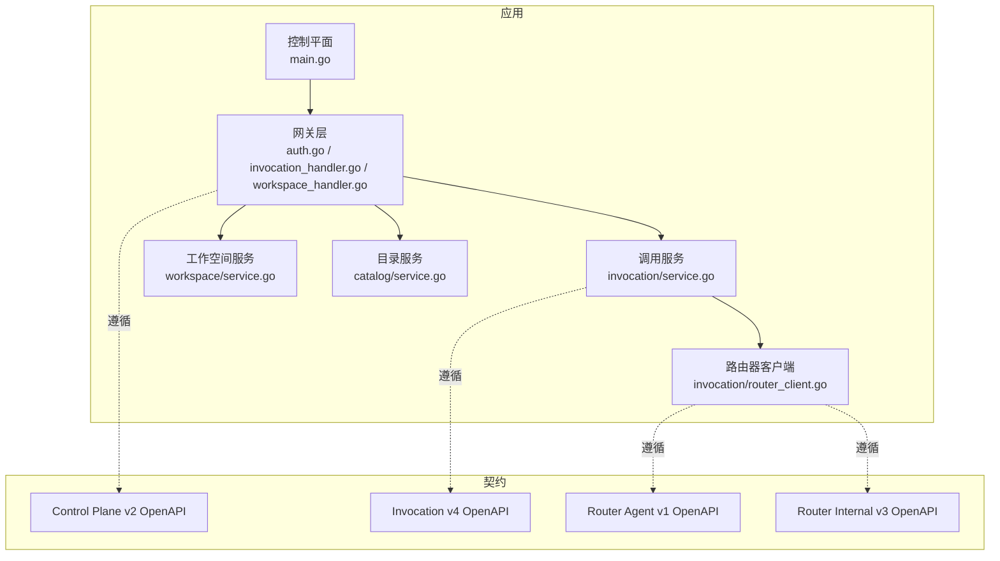
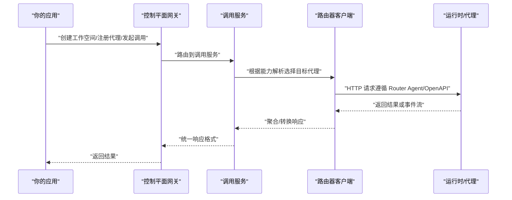
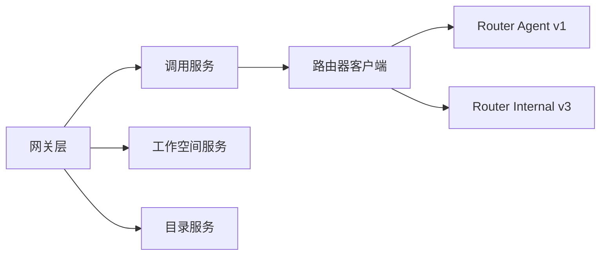

# Go SDK

<cite>
**本文引用的文件**   
- [README.md](file://README.md)
- [go.mod](file://go.mod)
- [control-plane/main.go](file://apps/control-plane/cmd/control-plane/main.go)
- [gateway/auth.go](file://apps/control-plane/internal/gateway/auth.go)
- [gateway/invocation_handler.go](file://apps/control-plane/internal/gateway/invocation_handler.go)
- [gateway/workspace_handler.go](file://apps/control-plane/internal/gateway/workspace_handler.go)
- [invocation/service.go](file://apps/control-plane/internal/invocation/service.go)
- [invocation/router_client.go](file://apps/control-plane/internal/invocation/router_client.go)
- [workspace/service.go](file://apps/control-plane/internal/workspace/service.go)
- [catalog/service.go](file://apps/control-plane/internal/catalog/service.go)
- [openapi/control-plane.v2.yaml](file://contracts/openapi/control-plane.v2.yaml)
- [openapi/control-plane-invocation.v4.yaml](file://contracts/openapi/control-plane-invocation.v4.yaml)
- [openapi/router-agent.v1.yaml](file://contracts/openapi/router-agent.v1.yaml)
- [openapi/router-internal.v3.yaml](file://contracts/openapi/router-internal.v3.yaml)
</cite>

## 目录
1. [简介](#简介)
2. [项目结构](#项目结构)
3. [核心组件](#核心组件)
4. [架构总览](#架构总览)
5. [详细组件分析](#详细组件分析)
6. [依赖分析](#依赖分析)
7. [性能考虑](#性能考虑)
8. [故障排查指南](#故障排查指南)
9. [结论](#结论)
10. [附录](#附录)

## 简介
本文件为 NeKiro 平台的 Go SDK 文档，面向使用 Go 语言接入 NeKiro 控制面与路由面的开发者。文档覆盖安装与依赖、初始化流程、客户端类与配置（认证、连接池）、错误处理机制，并提供代理注册、工作空间管理、调用路由等常见操作的示例路径与最佳实践。同时包含异步操作、超时配置、重试机制与性能优化建议，以及常见问题解决方案。

## 项目结构
仓库采用多模块组织方式，Go 服务位于 apps 目录，API 契约位于 contracts/openapi，SDK 相关代码目前为空目录 sdks/agent-sdk。控制平面入口位于 apps/control-plane/cmd/control-plane/main.go，网关层负责 HTTP 接口实现，内部服务包括 invocation、workspace、catalog 等。

图表来源
- [control-plane/main.go:1-200](file://apps/control-plane/cmd/control-plane/main.go#L1-L200)
- [gateway/auth.go:1-200](file://apps/control-plane/internal/gateway/auth.go#L1-L200)
- [gateway/invocation_handler.go:1-200](file://apps/control-plane/internal/gateway/invocation_handler.go#L1-L200)
- [gateway/workspace_handler.go:1-200](file://apps/control-plane/internal/gateway/workspace_handler.go#L1-L200)
- [invocation/service.go:1-200](file://apps/control-plane/internal/invocation/service.go#L1-L200)
- [invocation/router_client.go:1-200](file://apps/control-plane/internal/invocation/router_client.go#L1-L200)
- [openapi/control-plane.v2.yaml:1-200](file://contracts/openapi/control-plane.v2.yaml#L1-L200)
- [openapi/control-plane-invocation.v4.yaml:1-200](file://contracts/openapi/control-plane-invocation.v4.yaml#L1-L200)
- [openapi/router-agent.v1.yaml:1-200](file://contracts/openapi/router-agent.v1.yaml#L1-L200)
- [openapi/router-internal.v3.yaml:1-200](file://contracts/openapi/router-internal.v3.yaml#L1-L200)

章节来源
- [README.md:1-200](file://README.md#L1-L200)
- [go.mod:1-200](file://go.mod#L1-L200)
- [control-plane/main.go:1-200](file://apps/control-plane/cmd/control-plane/main.go#L1-L200)

## 核心组件
- 控制平面入口：负责启动 HTTP 服务、挂载路由、加载配置与中间件。
- 网关层：提供对外 API，包括认证、工作空间管理、调用路由等。
- 调用服务：编排调用生命周期、与路由器客户端交互、处理结果流。
- 路由器客户端：封装对路由器的 HTTP 调用，遵循 Router Agent 与 Router Internal 契约。
- 工作空间服务：管理工作空间创建、读取、策略与持久化。
- 目录服务：管理代理卡片、能力解析与发现。

章节来源
- [control-plane/main.go:1-200](file://apps/control-plane/cmd/control-plane/main.go#L1-L200)
- [gateway/auth.go:1-200](file://apps/control-plane/internal/gateway/auth.go#L1-L200)
- [gateway/invocation_handler.go:1-200](file://apps/control-plane/internal/gateway/invocation_handler.go#L1-L200)
- [gateway/workspace_handler.go:1-200](file://apps/control-plane/internal/gateway/workspace_handler.go#L1-L200)
- [invocation/service.go:1-200](file://apps/control-plane/internal/invocation/service.go#L1-L200)
- [invocation/router_client.go:1-200](file://apps/control-plane/internal/invocation/router_client.go#L1-L200)
- [workspace/service.go:1-200](file://apps/control-plane/internal/workspace/service.go#L1-L200)
- [catalog/service.go:1-200](file://apps/control-plane/internal/catalog/service.go#L1-L200)

## 架构总览
NeKiro Go SDK 通过控制平面暴露的 RESTful API 进行集成，遵循 OpenAPI 契约。典型调用链路如下：

图表来源
- [openapi/control-plane.v2.yaml:1-200](file://contracts/openapi/control-plane.v2.yaml#L1-L200)
- [openapi/control-plane-invocation.v4.yaml:1-200](file://contracts/openapi/control-plane-invocation.v4.yaml#L1-L200)
- [openapi/router-agent.v1.yaml:1-200](file://contracts/openapi/router-agent.v1.yaml#L1-L200)
- [openapi/router-internal.v3.yaml:1-200](file://contracts/openapi/router-internal.v3.yaml#L1-L200)
- [gateway/invocation_handler.go:1-200](file://apps/control-plane/internal/gateway/invocation_handler.go#L1-L200)
- [invocation/service.go:1-200](file://apps/control-plane/internal/invocation/service.go#L1-L200)
- [invocation/router_client.go:1-200](file://apps/control-plane/internal/invocation/router_client.go#L1-L200)

## 详细组件分析

### 客户端类与初始化
- 客户端职责
  - 封装与控制平面的 HTTP 通信，提供工作空间管理、代理注册、调用路由等方法。
  - 支持认证头注入、超时与重试配置、连接池参数设置。
- 初始化步骤
  - 配置基础 URL、超时时间、重试策略、TLS 与代理设置。
  - 可选：配置鉴权令牌或签名中间件。
  - 构建客户端实例并复用（线程安全）。
- 关键配置项
  - BaseURL：控制平面地址。
  - Timeout：请求级超时。
  - Retry：最大重试次数与退避策略。
  - Pool：最大空闲连接、每主机最大连接数、连接存活时间。
  - Auth：Bearer Token 或自定义 Header。
- 错误处理
  - 区分网络错误、超时、业务错误码与协议不匹配错误。
  - 提供结构化错误类型与上下文信息（如 traceId、invocationId）。

章节来源
- [gateway/auth.go:1-200](file://apps/control-plane/internal/gateway/auth.go#L1-L200)
- [openapi/control-plane.v2.yaml:1-200](file://contracts/openapi/control-plane.v2.yaml#L1-L200)

### 认证配置
- 认证方式
  - 基于 Bearer Token 的请求头注入。
  - 网关层校验令牌有效性并附加用户上下文。
- 配置要点
  - 在客户端初始化时设置 Authorization 头。
  - 支持动态刷新令牌与失败重试。
- 注意事项
  - 避免将敏感凭据硬编码；建议使用环境变量或密钥管理服务。
  - 确保令牌作用域与资源访问策略一致。

章节来源
- [gateway/auth.go:1-200](file://apps/control-plane/internal/gateway/auth.go#L1-L200)
- [openapi/control-plane.v2.yaml:1-200](file://contracts/openapi/control-plane.v2.yaml#L1-L200)

### 连接池设置
- 连接池参数
  - MaxIdleConns：最大空闲连接数。
  - MaxIdleConnsPerHost：每主机最大空闲连接数。
  - IdleConnTimeout：空闲连接回收时间。
  - DialTimeout/TLSHandshakeTimeout：建立连接与 TLS 握手超时。
- 适用场景
  - 高并发短连接：提高 MaxIdleConnsPerHost。
  - 长连接稳定：合理设置 IdleConnTimeout 降低抖动。
- 监控指标
  - 活跃连接数、等待队列长度、连接复用率。

章节来源
- [openapi/control-plane.v2.yaml:1-200](file://contracts/openapi/control-plane.v2.yaml#L1-L200)

### 错误处理机制
- 错误分类
  - 网络错误：DNS 解析失败、连接拒绝、TLS 错误。
  - 超时错误：请求超时、读写超时。
  - 业务错误：平台错误码、权限不足、资源不存在。
- 处理策略
  - 可重试错误：网络抖动、限流（429）、临时性服务端错误（5xx）。
  - 不可重试错误：参数校验失败、权限错误、资源冲突。
- 诊断信息
  - 记录 traceId、invocationId、请求 ID 以便追踪。

章节来源
- [gateway/invocation_handler.go:1-200](file://apps/control-plane/internal/gateway/invocation_handler.go#L1-L200)
- [openapi/control-plane-invocation.v4.yaml:1-200](file://contracts/openapi/control-plane-invocation.v4.yaml#L1-L200)

### 代理注册与工作空间管理
- 代理注册
  - 提交代理卡片（Agent Card），定义能力、端点、权限。
  - 支持版本管理与灰度发布。
- 工作空间管理
  - 创建工作空间、查询状态、更新策略。
  - 绑定代理与能力映射。
- 注意事项
  - 幂等性：重复注册应返回已存在资源。
  - 一致性：工作空间与代理绑定的事务性。

章节来源
- [gateway/workspace_handler.go:1-200](file://apps/control-plane/internal/gateway/workspace_handler.go#L1-L200)
- [workspace/service.go:1-200](file://apps/control-plane/internal/workspace/service.go#L1-L200)
- [catalog/service.go:1-200](file://apps/control-plane/internal/catalog/service.go#L1-L200)
- [openapi/control-plane.v2.yaml:1-200](file://contracts/openapi/control-plane.v2.yaml#L1-L200)

### 调用路由与执行
- 路由流程
  - 根据能力解析选择目标代理。
  - 构造调用请求，携带上下文与追踪信息。
  - 处理同步返回与事件流。
- 异步与流式
  - 支持 SSE 或长轮询的事件推送。
  - 客户端需维护会话与会话恢复。
- 重试与超时
  - 针对幂等操作启用指数退避重试。
  - 设置合理的请求与流式超时。

章节来源
- [gateway/invocation_handler.go:1-200](file://apps/control-plane/internal/gateway/invocation_handler.go#L1-L200)
- [invocation/service.go:1-200](file://apps/control-plane/internal/invocation/service.go#L1-L200)
- [invocation/router_client.go:1-200](file://apps/control-plane/internal/invocation/router_client.go#L1-L200)
- [openapi/control-plane-invocation.v4.yaml:1-200](file://contracts/openapi/control-plane-invocation.v4.yaml#L1-L200)
- [openapi/router-agent.v1.yaml:1-200](file://contracts/openapi/router-agent.v1.yaml#L1-L200)
- [openapi/router-internal.v3.yaml:1-200](file://contracts/openapi/router-internal.v3.yaml#L1-L200)

### API 方法参考
- 工作空间
  - 创建/读取/更新/删除工作空间
  - 参数：名称、描述、策略、标签
  - 返回：工作空间实体、错误码
- 代理注册
  - 提交/查询/更新代理卡片
  - 参数：卡片 JSON、版本、权限
  - 返回：注册结果、冲突提示
- 调用路由
  - 发起调用、查询调用状态、取消调用
  - 参数：能力标识、输入数据、上下文
  - 返回：结果对象、事件流、错误详情

章节来源
- [openapi/control-plane.v2.yaml:1-200](file://contracts/openapi/control-plane.v2.yaml#L1-L200)
- [openapi/control-plane-invocation.v4.yaml:1-200](file://contracts/openapi/control-plane-invocation.v4.yaml#L1-L200)

### 代码示例路径
- 基本初始化与认证
  - 参考：[gateway/auth.go:1-200](file://apps/control-plane/internal/gateway/auth.go#L1-L200)
- 工作空间管理
  - 参考：[gateway/workspace_handler.go:1-200](file://apps/control-plane/internal/gateway/workspace_handler.go#L1-L200)
- 代理注册
  - 参考：[catalog/service.go:1-200](file://apps/control-plane/internal/catalog/service.go#L1-L200)
- 调用路由
  - 参考：[gateway/invocation_handler.go:1-200](file://apps/control-plane/internal/gateway/invocation_handler.go#L1-L200)、[invocation/service.go:1-200](file://apps/control-plane/internal/invocation/service.go#L1-L200)、[invocation/router_client.go:1-200](file://apps/control-plane/internal/invocation/router_client.go#L1-L200)

## 依赖分析
- 外部依赖
  - HTTP 客户端库（标准库 net/http 或第三方）
  - JSON 编解码库
  - 日志与追踪库
- 内部依赖
  - 网关层依赖调用服务与工作空间服务
  - 调用服务依赖路由器客户端
  - 路由器客户端遵循 Router Agent 与 Router Internal 契约

图表来源
- [gateway/invocation_handler.go:1-200](file://apps/control-plane/internal/gateway/invocation_handler.go#L1-L200)
- [invocation/service.go:1-200](file://apps/control-plane/internal/invocation/service.go#L1-L200)
- [invocation/router_client.go:1-200](file://apps/control-plane/internal/invocation/router_client.go#L1-L200)
- [openapi/router-agent.v1.yaml:1-200](file://contracts/openapi/router-agent.v1.yaml#L1-L200)
- [openapi/router-internal.v3.yaml:1-200](file://contracts/openapi/router-internal.v3.yaml#L1-L200)

章节来源
- [go.mod:1-200](file://go.mod#L1-L200)
- [control-plane/main.go:1-200](file://apps/control-plane/cmd/control-plane/main.go#L1-L200)

## 性能考虑
- 连接复用
  - 启用 Keep-Alive，合理设置 MaxIdleConnsPerHost。
- 超时与重试
  - 为短耗时操作设置较小超时，长耗时操作使用流式传输。
  - 仅对幂等操作启用重试，避免副作用放大。
- 批处理与缓存
  - 批量注册与查询减少往返开销。
  - 缓存热点能力解析结果。
- 背压与限流
  - 客户端侧限制并发度，服务端侧配合限流策略。
- 监控与观测
  - 采集延迟分位、错误率、连接池利用率。

## 故障排查指南
- 认证失败
  - 检查令牌有效期与作用域。
  - 确认网关是否成功注入用户上下文。
- 调用超时
  - 调整请求超时与重试策略。
  - 检查下游代理健康与容量。
- 路由异常
  - 核对能力标识与代理卡片版本。
  - 查看路由日志与追踪 ID。
- 工作空间不一致
  - 验证写入顺序与幂等键。
  - 检查迁移与回滚策略。

章节来源
- [gateway/auth.go:1-200](file://apps/control-plane/internal/gateway/auth.go#L1-L200)
- [gateway/invocation_handler.go:1-200](file://apps/control-plane/internal/gateway/invocation_handler.go#L1-L200)
- [workspace/service.go:1-200](file://apps/control-plane/internal/workspace/service.go#L1-L200)

## 结论
NeKiro Go SDK 以控制平面为核心，通过清晰的 OpenAPI 契约与模块化服务设计，提供稳定的代理注册、工作空间管理与调用路由能力。建议在客户端侧做好认证、连接池、超时与重试的配置，结合监控与日志定位问题，以获得更好的稳定性与性能表现。

## 附录
- 快速开始
  - 安装依赖：参考 go.mod 中的模块声明与版本约束。
  - 初始化客户端：设置 BaseURL、超时、重试与认证头。
  - 调用示例：参考各 Handler 与服务实现路径。
- 最佳实践
  - 使用单例客户端并在 goroutine 间共享。
  - 为关键路径添加追踪 ID 与结构化日志。
  - 对非幂等操作禁用自动重试。
- 常见问题
  - 证书与代理：配置 TLS 与 HTTP 代理以适配企业网络。
  - 大响应体：使用流式接收与分块处理。
  - 版本兼容：关注 OpenAPI 版本升级与弃用字段。