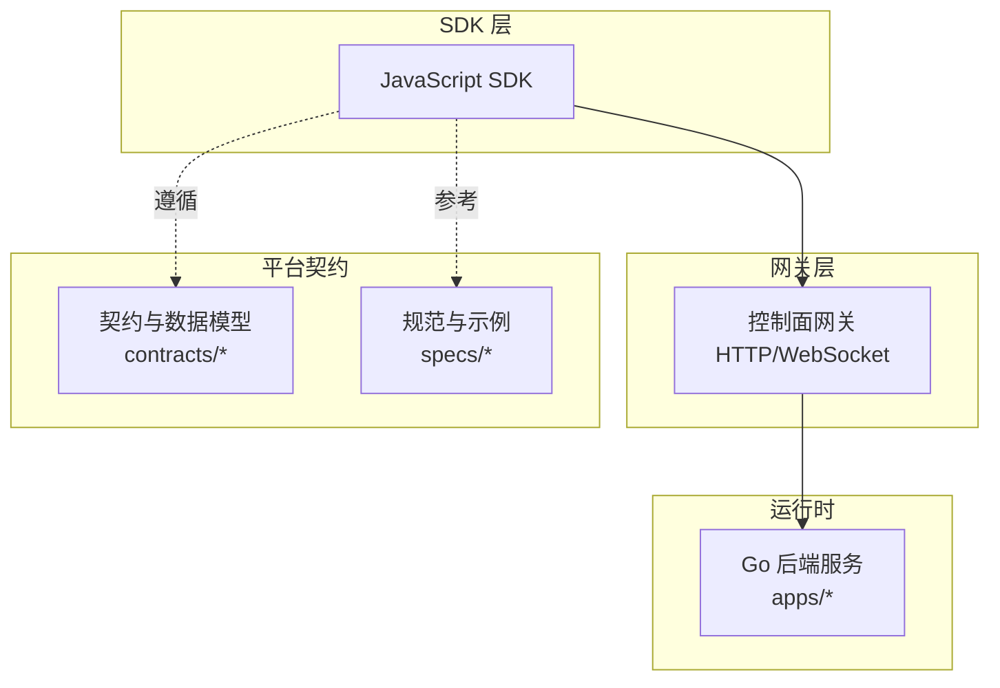
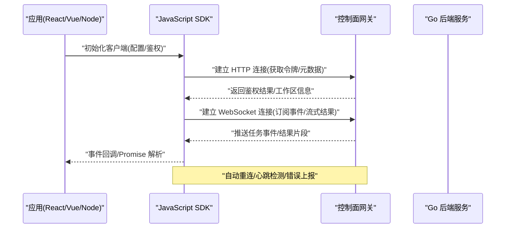
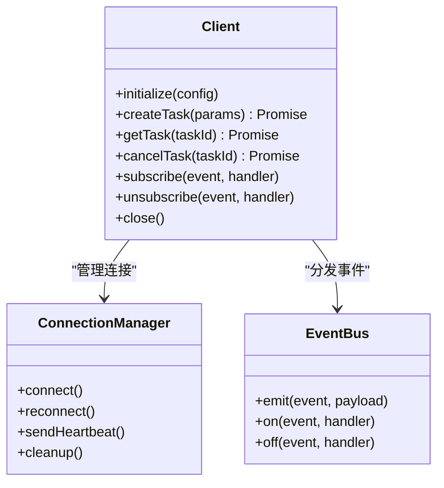
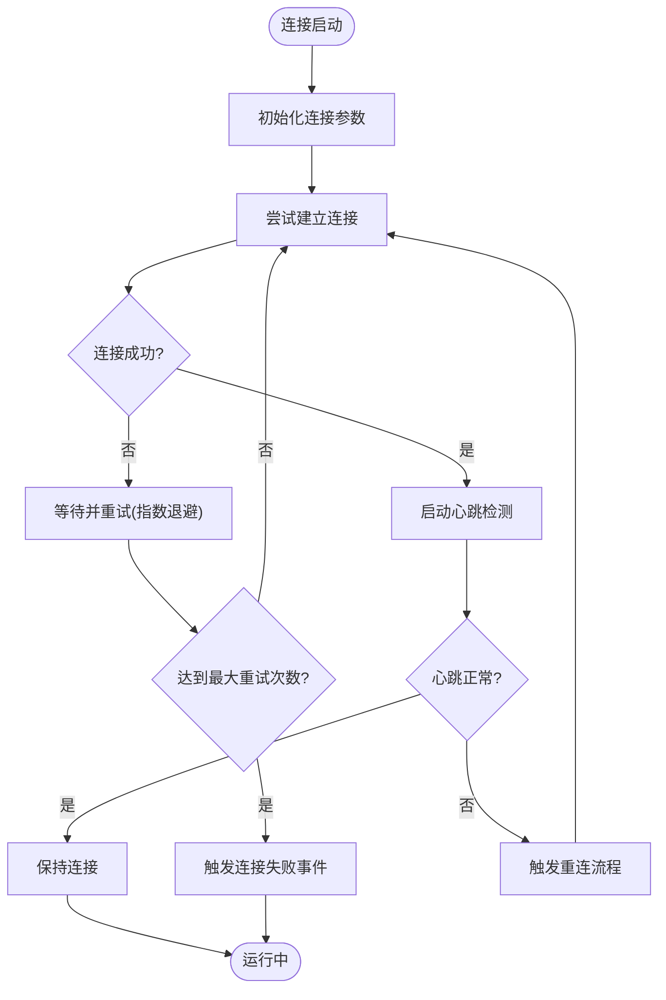
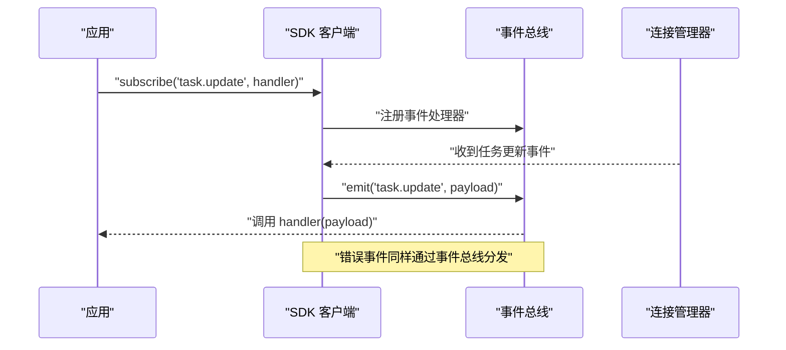
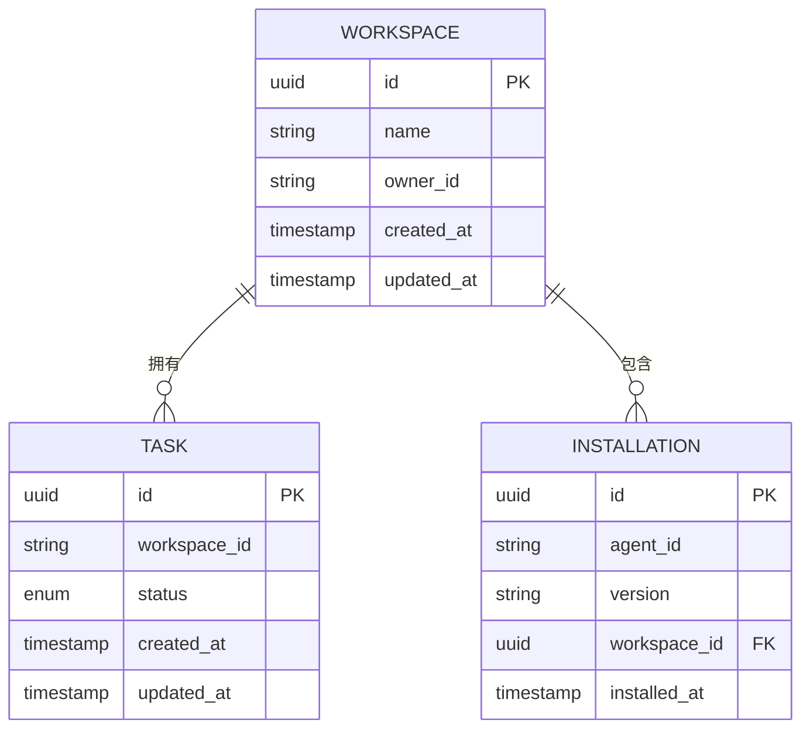
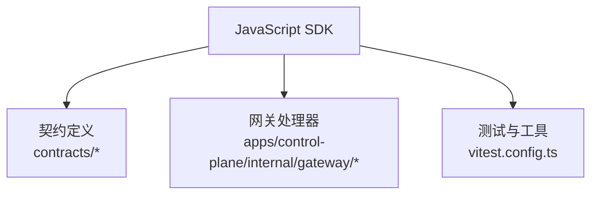

# JavaScript SDK

<cite>
**本文引用的文件**   
- [README.md](file://README.md)
- [package.json](file://package.json)
- [pnpm-workspace.yaml](file://pnpm-workspace.yaml)
- [tsconfig.base.json](file://tsconfig.base.json)
- [vitest.config.ts](file://vitest.config.ts)
- [go.mod](file://go.mod)
- [contracts/contracts.go](file://contracts/contracts.go)
- [contracts/runtime_contracts.go](file://contracts/runtime_contracts.go)
- [contracts/result_contracts.go](file://contracts/result_contracts.go)
- [contracts/workspace_api_contracts_test.go](file://contracts/workspace_api_contracts_test.go)
- [contracts/a2a_profile_v02.go](file://contracts/a2a_profile_v02.go)
- [contracts/installation_contracts.go](file://contracts/installation_contracts.go)
- [contracts/validate.go](file://contracts/validate.go)
- [apps/control-plane/internal/gateway/errors.go](file://apps/control-plane/internal/gateway/errors.go)
- [apps/control-plane/internal/gateway/auth.go](file://apps/control-plane/internal/gateway/auth.go)
- [apps/control-plane/internal/gateway/catalog_handler.go](file://apps/control-plane/internal/gateway/catalog_handler.go)
- [apps/control-plane/internal/gateway/invocation_handler.go](file://apps/control-plane/internal/gateway/invocation_handler.go)
- [apps/control-plane/internal/gateway/workspace_handler.go](file://apps/control-plane/internal/gateway/workspace_handler.go)
- [specs/019-agent-sdk-nested-invocation/spec.md](file://specs/019-agent-sdk-nested-invocation/spec.md)
- [specs/019-agent-sdk-nested-invocation/data-model.md](file://specs/019-agent-sdk-nested-invocation/data-model.md)
- [specs/019-agent-sdk-nested-invocation/quickstart.md](file://specs/019-agent-sdk-nested-invocation/quickstart.md)
</cite>

## 目录
1. [简介](#简介)
2. [项目结构](#项目结构)
3. [核心组件](#核心组件)
4. [架构总览](#架构总览)
5. [详细组件分析](#详细组件分析)
6. [依赖分析](#依赖分析)
7. [性能考虑](#性能考虑)
8. [故障排查指南](#故障排查指南)
9. [结论](#结论)
10. [附录](#附录)

## 简介
本文件为 NeKiro 平台的 JavaScript SDK 提供完整的技术文档，涵盖安装与导入、ES6 模块使用、浏览器兼容性配置、客户端类设计、Promise/Async-Await 支持、事件处理与错误捕获机制、WebSocket 连接管理（自动重连、心跳检测、内存泄漏防护），以及与 React、Vue、Express 等主流框架的集成实践。文档同时给出 Node.js 与浏览器环境的差异说明，并基于仓库中的契约与实现线索，对 API 参数校验、回调函数与错误对象结构进行规范化描述。

## 项目结构
仓库采用多语言多包组织方式：Go 后端服务位于 apps 与 contracts 目录；规范与契约定义在 specs 与 contracts 目录；前端与工具链配置位于根级 package.json、pnpm-workspace.yaml、tsconfig.base.json、vitest.config.ts 等文件。JavaScript SDK 的设计需遵循平台契约与网关接口约定，并在浏览器与 Node.js 环境中保持一致的 API 体验。

图表来源
- [contracts/contracts.go:1-200](file://contracts/contracts.go#L1-L200)
- [specs/019-agent-sdk-nested-invocation/spec.md:1-200](file://specs/019-agent-sdk-nested-invocation/spec.md#L1-L200)

章节来源
- [README.md:1-200](file://README.md#L1-L200)
- [package.json:1-200](file://package.json#L1-L200)
- [pnpm-workspace.yaml:1-200](file://pnpm-workspace.yaml#L1-L200)
- [tsconfig.base.json:1-200](file://tsconfig.base.json#L1-L200)
- [vitest.config.ts:1-200](file://vitest.config.ts#L1-L200)

## 核心组件
本节概述 JavaScript SDK 的核心能力与组件边界，确保与平台契约一致并提供跨环境一致的 API。

- 客户端类
  - 负责初始化连接、鉴权、调用编排、事件订阅与生命周期管理。
  - 暴露 Promise/Async-Await 风格的 API，同时保留回调风格以兼容旧代码。
- 连接管理器
  - 封装 WebSocket 连接、自动重连、心跳检测、断线恢复与资源清理。
- 事件总线
  - 提供统一的事件发布/订阅接口，用于任务状态变更、流式结果推送、错误通知等。
- 错误处理
  - 标准化错误对象结构，包含错误码、消息、上下文信息，便于上层统一处理。
- 配置与适配
  - 提供浏览器与 Node.js 环境差异的适配层（如网络请求、WebSocket、定时器）。

章节来源
- [contracts/runtime_contracts.go:1-200](file://contracts/runtime_contracts.go#L1-L200)
- [contracts/result_contracts.go:1-200](file://contracts/result_contracts.go#L1-L200)
- [specs/019-agent-sdk-nested-invocation/data-model.md:1-200](file://specs/019-agent-sdk-nested-invocation/data-model.md#L1-L200)

## 架构总览
下图展示 JavaScript SDK 与平台网关及后端的交互关系，以及关键的数据流向。

图表来源
- [apps/control-plane/internal/gateway/auth.go:1-200](file://apps/control-plane/internal/gateway/auth.go#L1-L200)
- [apps/control-plane/internal/gateway/invocation_handler.go:1-200](file://apps/control-plane/internal/gateway/invocation_handler.go#L1-L200)
- [apps/control-plane/internal/gateway/workspace_handler.go:1-200](file://apps/control-plane/internal/gateway/workspace_handler.go#L1-L200)

## 详细组件分析

### 客户端类与 API 设计
- 初始化与配置
  - 支持传入基础 URL、工作区标识、鉴权凭据、重试策略、超时设置等。
  - 在浏览器环境下需处理跨域与安全策略；在 Node.js 环境下可配置代理与证书。
- 调用方法
  - 提供异步方法用于创建/查询/取消任务，返回 Promise，支持 Async/Await。
  - 参数校验遵循平台契约，非法输入将抛出结构化错误对象。
- 事件订阅
  - 通过事件总线订阅任务状态、流式结果、系统告警等事件。
  - 事件对象包含关联 ID、时间戳、负载数据，便于追踪与调试。
- 生命周期
  - 显式关闭释放资源，避免内存泄漏；在页面卸载或进程退出时自动清理。

图表来源
- [specs/019-agent-sdk-nested-invocation/spec.md:1-200](file://specs/019-agent-sdk-nested-invocation/spec.md#L1-L200)
- [contracts/runtime_contracts.go:1-200](file://contracts/runtime_contracts.go#L1-L200)

章节来源
- [specs/019-agent-sdk-nested-invocation/quickstart.md:1-200](file://specs/019-agent-sdk-nested-invocation/quickstart.md#L1-L200)
- [contracts/workspace_api_contracts_test.go:1-200](file://contracts/workspace_api_contracts_test.go#L1-L200)

### 连接管理与重连策略
- 自动重连
  - 指数退避策略，最大重试次数与间隔可配置。
  - 重连失败时触发错误事件，供上层记录与告警。
- 心跳检测
  - 周期性发送心跳，服务端无响应则判定连接失效并触发重连。
- 内存泄漏防护
  - 断开连接时清理定时器、事件监听器与缓冲区。
  - 提供 close 方法强制释放资源。

图表来源
- [apps/control-plane/internal/gateway/errors.go:1-200](file://apps/control-plane/internal/gateway/errors.go#L1-L200)
- [apps/control-plane/internal/gateway/invocation_handler.go:1-200](file://apps/control-plane/internal/gateway/invocation_handler.go#L1-L200)

章节来源
- [apps/control-plane/internal/gateway/errors.go:1-200](file://apps/control-plane/internal/gateway/errors.go#L1-L200)
- [apps/control-plane/internal/gateway/invocation_handler.go:1-200](file://apps/control-plane/internal/gateway/invocation_handler.go#L1-L200)

### 事件处理与错误捕获
- 事件类型
  - 任务事件：创建、更新、完成、取消。
  - 流式事件：结果片段、进度、中间产物。
  - 系统事件：连接状态、鉴权刷新、配额限制。
- 错误对象结构
  - 包含错误码、消息、上下文（如任务 ID、工作区 ID）、建议操作。
  - 区分网络错误、业务错误、认证错误与超时错误。
- 回调与 Promise
  - 所有异步方法返回 Promise，同时支持回调风格以兼容旧版本。
  - 错误优先原则：Promise reject 或回调第一个参数为错误对象。

图表来源
- [contracts/runtime_contracts.go:1-200](file://contracts/runtime_contracts.go#L1-L200)
- [contracts/result_contracts.go:1-200](file://contracts/result_contracts.go#L1-L200)

章节来源
- [contracts/runtime_contracts.go:1-200](file://contracts/runtime_contracts.go#L1-L200)
- [contracts/result_contracts.go:1-200](file://contracts/result_contracts.go#L1-L200)

### 参数验证与 API 契约
- 参数校验
  - 必填字段检查、类型校验、范围约束、格式验证（如 UUID、URL）。
  - 不符合契约的请求将被拒绝并返回结构化错误。
- 数据模型
  - 任务、工作区、安装项等实体结构与字段语义由契约定义。
  - SDK 内部序列化/反序列化遵循 JSON Schema 与 OpenAPI 规范。
- 兼容性
  - 向后兼容策略：新增字段可选，废弃字段保留一段时间。
  - 版本协商：客户端与服务端通过版本号选择行为分支。

图表来源
- [contracts/a2a_profile_v02.go:1-200](file://contracts/a2a_profile_v02.go#L1-L200)
- [contracts/installation_contracts.go:1-200](file://contracts/installation_contracts.go#L1-L200)
- [contracts/validate.go:1-200](file://contracts/validate.go#L1-L200)

章节来源
- [contracts/validate.go:1-200](file://contracts/validate.go#L1-L200)
- [contracts/a2a_profile_v02.go:1-200](file://contracts/a2a_profile_v02.go#L1-L200)
- [contracts/installation_contracts.go:1-200](file://contracts/installation_contracts.go#L1-L200)

### 浏览器与 Node.js 环境差异
- 浏览器环境
  - 使用 fetch 或 XMLHttpRequest 发起 HTTP 请求；WebSocket 使用原生 WebSocket。
  - 注意跨域、Cookie、CORS 与安全策略；避免阻塞主线程。
- Node.js 环境
  - 可使用 node-fetch 或 http 模块；WebSocket 使用 ws 库。
  - 支持代理、自定义 TLS 证书、环境变量注入。
- 统一抽象
  - SDK 提供适配器层屏蔽差异，对外暴露一致 API。

章节来源
- [tsconfig.base.json:1-200](file://tsconfig.base.json#L1-L200)
- [vitest.config.ts:1-200](file://vitest.config.ts#L1-L200)

### 与主流框架集成指南
- React
  - 使用 useEffect 初始化客户端，useRef 保存实例，避免重复创建。
  - 在组件卸载时调用 close 释放资源。
- Vue
  - 在 setup 中初始化客户端，onUnmounted 中清理。
  - 使用 reactive/ref 管理事件状态。
- Express
  - 在服务启动时初始化客户端，进程退出时优雅关闭。
  - 使用中间件注入客户端实例到请求上下文。

章节来源
- [specs/019-agent-sdk-nested-invocation/quickstart.md:1-200](file://specs/019-agent-sdk-nested-invocation/quickstart.md#L1-L200)

## 依赖分析
JavaScript SDK 依赖平台契约与网关接口，确保与后端服务的一致性。主要依赖包括：
- 契约定义：contracts 目录下的数据模型与校验逻辑。
- 网关接口：auth、catalog、invocation、workspace 等处理器的 REST/WS 协议。
- 测试与工具：vitest 用于单元测试，tsconfig 用于类型与构建配置。

图表来源
- [contracts/contracts.go:1-200](file://contracts/contracts.go#L1-L200)
- [apps/control-plane/internal/gateway/auth.go:1-200](file://apps/control-plane/internal/gateway/auth.go#L1-L200)
- [apps/control-plane/internal/gateway/catalog_handler.go:1-200](file://apps/control-plane/internal/gateway/catalog_handler.go#L1-L200)
- [apps/control-plane/internal/gateway/invocation_handler.go:1-200](file://apps/control-plane/internal/gateway/invocation_handler.go#L1-L200)
- [apps/control-plane/internal/gateway/workspace_handler.go:1-200](file://apps/control-plane/internal/gateway/workspace_handler.go#L1-L200)
- [vitest.config.ts:1-200](file://vitest.config.ts#L1-L200)

章节来源
- [go.mod:1-200](file://go.mod#L1-L200)
- [contracts/contracts.go:1-200](file://contracts/contracts.go#L1-L200)

## 性能考虑
- 连接复用
  - 单例客户端避免频繁握手开销。
- 批量与节流
  - 事件合并与节流减少高频事件对 UI 的影响。
- 缓存策略
  - 本地缓存只读元数据，降低重复请求。
- 资源清理
  - 及时释放定时器与监听器，防止内存泄漏。

[本节为通用指导，无需特定文件引用]

## 故障排查指南
- 常见问题
  - 连接失败：检查网络、代理、证书与 CORS 配置。
  - 鉴权失败：确认令牌有效性与权限范围。
  - 事件丢失：检查事件订阅时机与顺序。
- 日志与诊断
  - 启用调试模式输出详细日志。
  - 记录错误对象与上下文信息以便定位问题。
- 错误分类
  - 网络错误：超时、DNS 解析失败、TLS 握手失败。
  - 业务错误：参数无效、资源不存在、权限不足。
  - 系统错误：服务不可用、配额超限、内部异常。

章节来源
- [apps/control-plane/internal/gateway/errors.go:1-200](file://apps/control-plane/internal/gateway/errors.go#L1-L200)
- [apps/control-plane/internal/gateway/auth.go:1-200](file://apps/control-plane/internal/gateway/auth.go#L1-L200)

## 结论
JavaScript SDK 围绕平台契约与网关接口设计，提供跨环境一致的 API 体验，支持 Promise/Async-Await、事件驱动与健壮的连接管理。通过严格的参数校验与结构化错误对象，确保开发者的易用性与可维护性。结合与主流框架的集成指南，开发者可快速在 React、Vue、Express 等环境中落地使用。

[本节为总结性内容，无需特定文件引用]

## 附录
- 安装与导入
  - npm/yarn 安装：在项目中引入 SDK 包。
  - ES6 模块导入：使用 import 语法按需引入。
  - 浏览器兼容性：配置 polyfill 与构建工具以支持目标浏览器。
- 示例路径
  - Node.js 示例：参见 quickstart 与测试用例。
  - 浏览器示例：参见 README 与集成指南。

章节来源
- [README.md:1-200](file://README.md#L1-L200)
- [specs/019-agent-sdk-nested-invocation/quickstart.md:1-200](file://specs/019-agent-sdk-nested-invocation/quickstart.md#L1-L200)