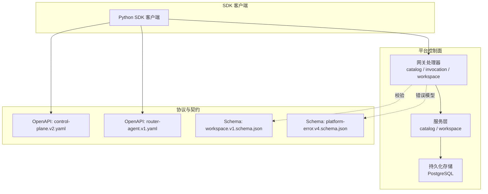
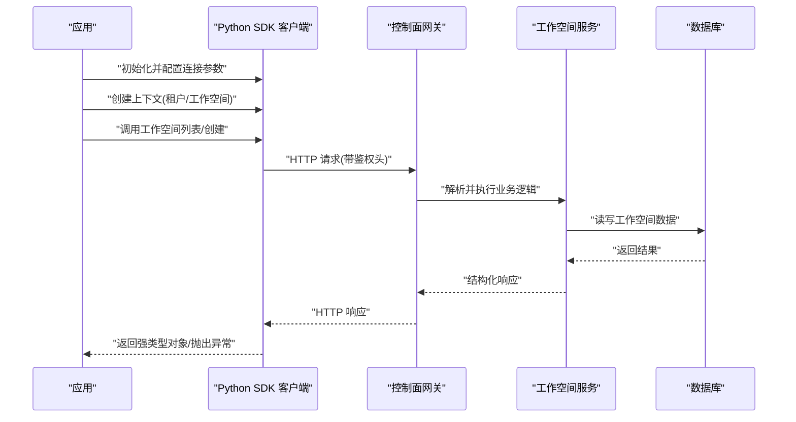
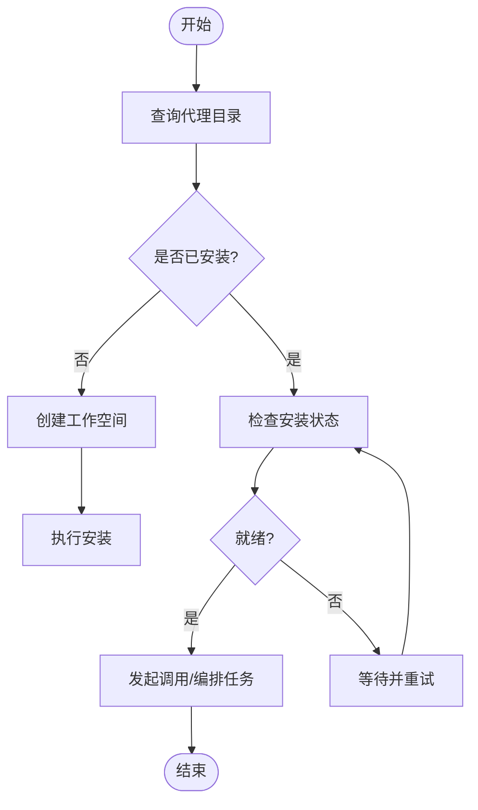
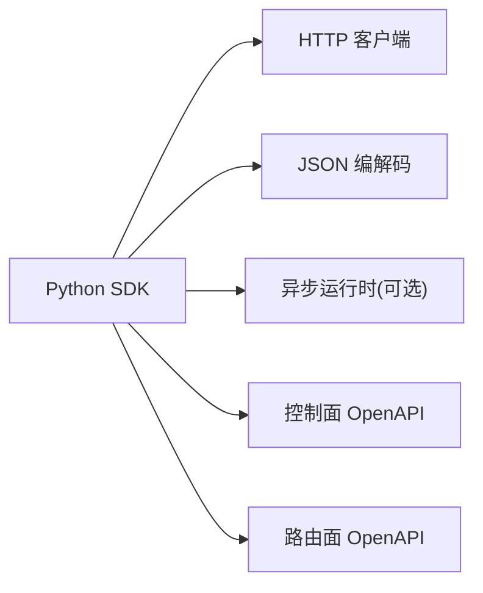

# Python SDK

<cite>
**本文引用的文件**   
- [README.md](file://README.md)
- [go.mod](file://go.mod)
- [compose.yaml](file://deploy/compose.yaml)
- [control-plane.v2.yaml](file://contracts/openapi/control-plane.v2.yaml)
- [router-agent.v1.yaml](file://contracts/openapi/router-agent.v1.yaml)
- [workspace.v1.schema.json](file://contracts/schemas/workspace.v1.schema.json)
- [platform-error.v4.schema.json](file://contracts/schemas/platform-error.v4.schema.json)
- [catalog_handler.go](file://apps/control-plane/internal/gateway/catalog_handler.go)
- [invocation_handler.go](file://apps/control-plane/internal/gateway/invocation_handler.go)
- [workspace_handler.go](file://apps/control-plane/internal/gateway/workspace_handler.go)
- [service.go](file://apps/control-plane/internal/catalog/service.go)
- [store.go](file://apps/control-plane/internal/catalog/store.go)
- [workspace_service.go](file://apps/control-plane/internal/workspace/service.go)
- [workspace_store.go](file://apps/control-plane/internal/workspace/postgres/store.go)
</cite>

## 目录
1. [简介](#简介)
2. [项目结构](#项目结构)
3. [核心组件](#核心组件)
4. [架构总览](#架构总览)
5. [详细组件分析](#详细组件分析)
6. [依赖分析](#依赖分析)
7. [性能考虑](#性能考虑)
8. [故障排查指南](#故障排查指南)
9. [结论](#结论)
10. [附录](#附录)

## 简介
本文件为 NeKiro 平台的 Python SDK 提供权威文档。NeKiro 平台通过控制面与路由面暴露能力，Python SDK 将面向这些 OpenAPI 契约进行封装，提供同步与异步客户端、连接池与重试策略、上下文管理、错误处理以及常见工作流（代理发现、工作空间管理等）的便捷调用方式。

由于当前仓库未包含 Python SDK 源码，本文档基于平台公开契约与后端实现进行设计说明，确保 SDK 的行为与平台 API 保持一致。

## 项目结构
从仓库视角看，Python SDK 需要对接的控制面与路由面接口定义位于 contracts/openapi 目录；数据模型与错误模型位于 contracts/schemas；控制面网关处理器位于 apps/control-plane/internal/gateway；服务与存储层位于对应 internal 子目录。部署配置位于 deploy/compose.yaml。

图表来源
- [control-plane.v2.yaml](file://contracts/openapi/control-plane.v2.yaml)
- [router-agent.v1.yaml](file://contracts/openapi/router-agent.v1.yaml)
- [workspace.v1.schema.json](file://contracts/schemas/workspace.v1.schema.json)
- [platform-error.v4.schema.json](file://contracts/schemas/platform-error.v4.schema.json)
- [catalog_handler.go](file://apps/control-plane/internal/gateway/catalog_handler.go)
- [invocation_handler.go](file://apps/control-plane/internal/gateway/invocation_handler.go)
- [workspace_handler.go](file://apps/control-plane/internal/gateway/workspace_handler.go)
- [service.go](file://apps/control-plane/internal/catalog/service.go)
- [store.go](file://apps/control-plane/internal/catalog/store.go)
- [workspace_store.go](file://apps/control-plane/internal/workspace/postgres/store.go)

章节来源
- [README.md](file://README.md)
- [go.mod](file://go.mod)
- [compose.yaml](file://deploy/compose.yaml)

## 核心组件
- 客户端类
  - 同步客户端：用于阻塞式调用控制面与路由面 API。
  - 异步客户端：基于事件循环的非阻塞调用，适合高并发场景。
- 连接与传输
  - HTTP 客户端封装，支持连接池、超时、重试、代理等。
- 认证与鉴权
  - 根据平台网关鉴权要求注入请求头或令牌。
- 上下文管理
  - 提供上下文对象，携带租户、工作空间、追踪 ID 等元信息。
- 错误处理
  - 统一异常类型映射到平台错误模型，便于上层业务处理。
- 常用工作流
  - 代理发现、安装检查、工作空间管理、任务编排与结果流式读取。

章节来源
- [control-plane.v2.yaml](file://contracts/openapi/control-plane.v2.yaml)
- [router-agent.v1.yaml](file://contracts/openapi/router-agent.v1.yaml)
- [platform-error.v4.schema.json](file://contracts/schemas/platform-error.v4.schema.json)

## 架构总览
Python SDK 作为外部客户端，通过 HTTP/JSON 访问控制面与路由面。控制面负责目录注册、安装生命周期与工作空间管理；路由面负责代理间调用与结果投递。

图表来源
- [workspace_handler.go](file://apps/control-plane/internal/gateway/workspace_handler.go)
- [workspace_service.go](file://apps/control-plane/internal/workspace/service.go)
- [workspace_store.go](file://apps/control-plane/internal/workspace/postgres/store.go)
- [control-plane.v2.yaml](file://contracts/openapi/control-plane.v2.yaml)

## 详细组件分析

### 安装与环境准备
- pip 安装
  - 使用包管理器安装 SDK 包。
- 虚拟环境
  - 建议在独立环境中运行，避免依赖冲突。
- 基本导入流程
  - 导入客户端与配置模块，初始化连接参数后创建客户端实例。

章节来源
- [README.md](file://README.md)

### 客户端类与基础用法
- 同步客户端
  - 适用于简单脚本与顺序执行场景。
- 异步客户端
  - 适用于高并发与长时任务，结合事件循环与协程。
- 通用配置项
  - 基础地址、超时、重试次数、最大连接数、空闲连接保持时间、代理设置等。

章节来源
- [control-plane.v2.yaml](file://contracts/openapi/control-plane.v2.yaml)
- [router-agent.v1.yaml](file://contracts/openapi/router-agent.v1.yaml)

### 上下文管理与身份
- 上下文对象
  - 携带租户标识、工作空间标识、追踪 ID、自定义头等信息。
- 身份与鉴权
  - 在请求中注入必要的认证头，遵循网关鉴权策略。

章节来源
- [catalog_handler.go](file://apps/control-plane/internal/gateway/catalog_handler.go)
- [invocation_handler.go](file://apps/control-plane/internal/gateway/invocation_handler.go)
- [workspace_handler.go](file://apps/control-plane/internal/gateway/workspace_handler.go)

### 错误处理机制
- 统一异常类型
  - 将平台错误模型映射为 SDK 异常，包含错误码、消息与附加信息。
- 重试策略
  - 对可重试错误（如网络抖动、限流）自动重试，支持指数退避与最大重试次数。
- 幂等性建议
  - 对读操作天然幂等；写操作需保证业务幂等键。

章节来源
- [platform-error.v4.schema.json](file://contracts/schemas/platform-error.v4.schema.json)

### 代理发现与工作空间管理
- 代理发现
  - 查询目录以获取可用代理卡片与能力描述。
- 工作空间管理
  - 创建工作空间、列出工作空间、查询安装状态、执行安装生命周期操作。

图表来源
- [catalog_handler.go](file://apps/control-plane/internal/gateway/catalog_handler.go)
- [workspace_handler.go](file://apps/control-plane/internal/gateway/workspace_handler.go)
- [workspace_service.go](file://apps/control-plane/internal/workspace/service.go)
- [workspace_store.go](file://apps/control-plane/internal/workspace/postgres/store.go)
- [workspace.v1.schema.json](file://contracts/schemas/workspace.v1.schema.json)

### API 方法参考（按功能域）
- 目录与代理
  - 列举代理、查询代理详情、能力清单。
- 工作空间
  - 创建工作空间、列出工作空间、删除工作空间、查询安装状态。
- 安装与生命周期
  - 触发安装、升级、卸载、回滚等操作。
- 调用与编排
  - 发起调用、查询调用状态、订阅结果流。

注意：具体参数名、返回值结构与异常码以 OpenAPI 契约与 Schema 为准。

章节来源
- [control-plane.v2.yaml](file://contracts/openapi/control-plane.v2.yaml)
- [router-agent.v1.yaml](file://contracts/openapi/router-agent.v1.yaml)
- [workspace.v1.schema.json](file://contracts/schemas/workspace.v1.schema.json)
- [platform-error.v4.schema.json](file://contracts/schemas/platform-error.v4.schema.json)

### 与框架集成示例
- FastAPI
  - 在请求生命周期内复用 SDK 客户端实例，利用异步客户端提升吞吐。
- Django
  - 在中间件或应用启动阶段初始化客户端，使用线程安全配置与连接池。

章节来源
- [control-plane.v2.yaml](file://contracts/openapi/control-plane.v2.yaml)

## 依赖分析
- 外部依赖
  - HTTP 客户端库、JSON 编解码、可选的异步运行时。
- 内部耦合
  - SDK 仅依赖平台契约，不直接依赖 Go 实现细节。
- 潜在循环依赖
  - SDK 无循环依赖风险，因其为纯客户端。

图表来源
- [control-plane.v2.yaml](file://contracts/openapi/control-plane.v2.yaml)
- [router-agent.v1.yaml](file://contracts/openapi/router-agent.v1.yaml)

章节来源
- [go.mod](file://go.mod)

## 性能考虑
- 连接池
  - 合理设置最大连接数与空闲连接保持时间，减少握手开销。
- 超时设置
  - 区分连接超时、请求超时与读取超时，避免资源长期占用。
- 重试策略
  - 针对瞬态错误启用指数退避与抖动，限制最大重试次数。
- 并发模型
  - 异步客户端配合事件循环提高吞吐；同步客户端适合低并发场景。
- 缓存与去重
  - 对只读查询结果做短期缓存；为写操作引入幂等键。

[本节为通用指导，无需代码来源]

## 故障排查指南
- 常见问题
  - 鉴权失败：检查网关鉴权头是否正确注入。
  - 连接超时：调整超时参数与网络代理配置。
  - 限流与重试：确认重试策略与退避参数。
- 日志与追踪
  - 开启请求级追踪 ID，便于跨链路定位问题。
- 错误定位
  - 依据平台错误模型中的错误码与消息快速定位根因。

章节来源
- [platform-error.v4.schema.json](file://contracts/schemas/platform-error.v4.schema.json)

## 结论
Python SDK 围绕平台 OpenAPI 契约构建，提供一致的同步与异步体验，并通过连接池、超时与重试策略保障稳定性与性能。结合上下文管理与统一错误处理，可在 FastAPI、Django 等框架中高效集成。

[本节为总结，无需代码来源]

## 附录
- 本地开发与服务编排
  - 使用 compose 文件启动控制面与依赖服务，便于联调。
- 版本兼容
  - 关注 OpenAPI 版本演进与向后兼容性说明。

章节来源
- [compose.yaml](file://deploy/compose.yaml)
- [README.md](file://README.md)