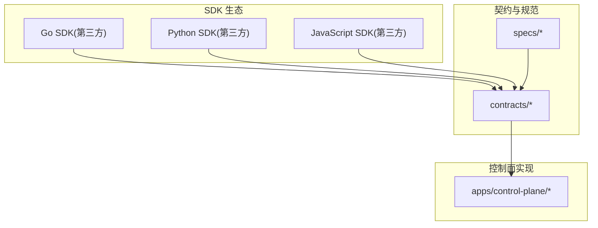
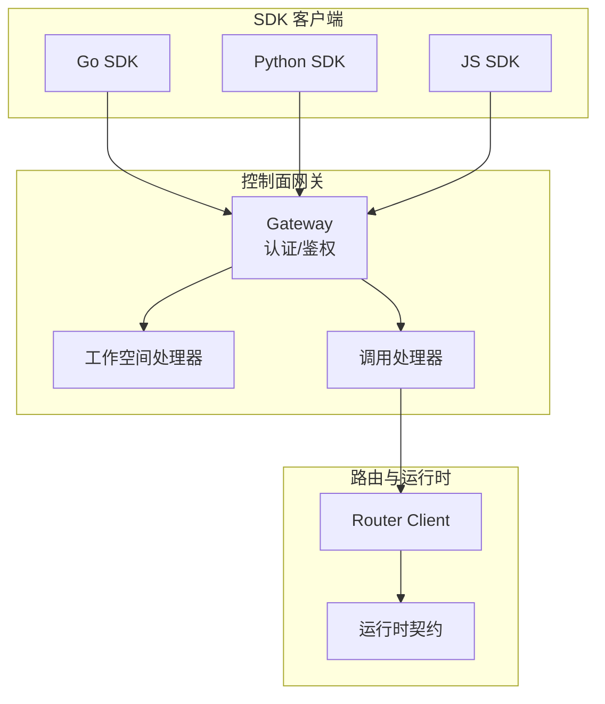
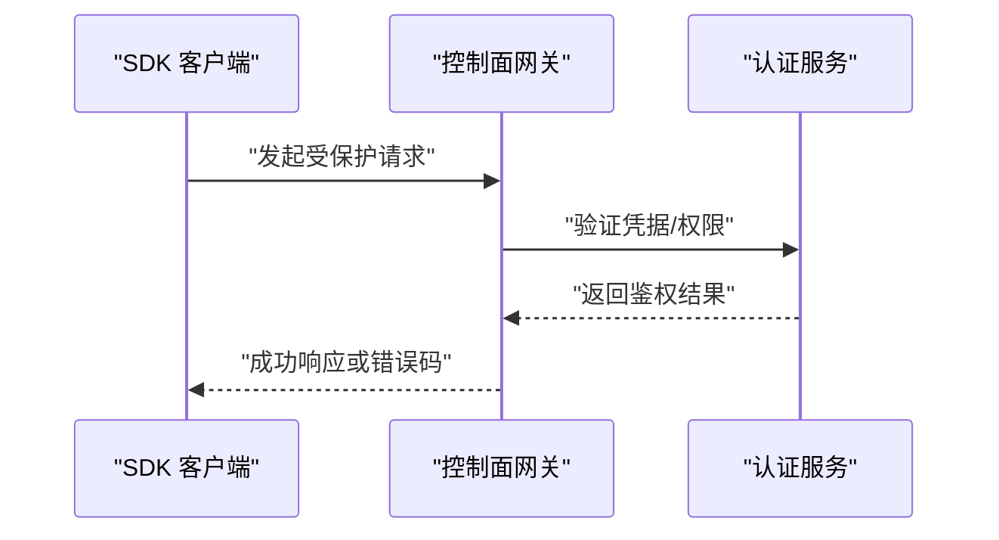
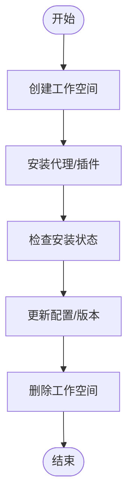
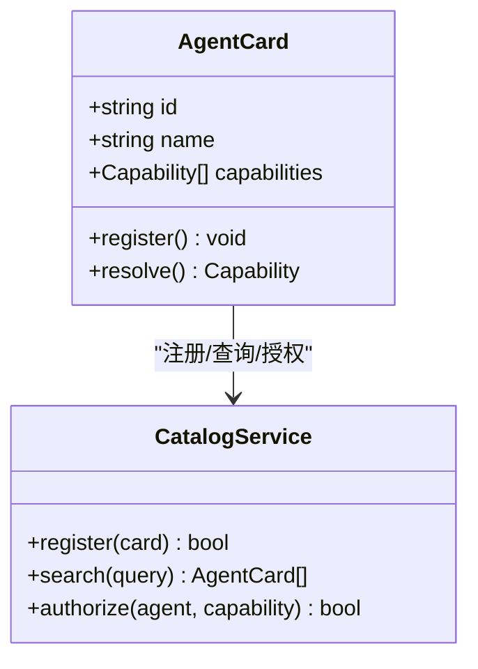
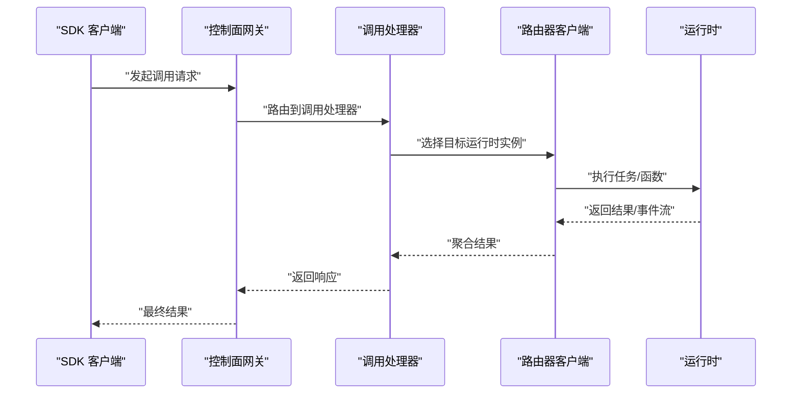
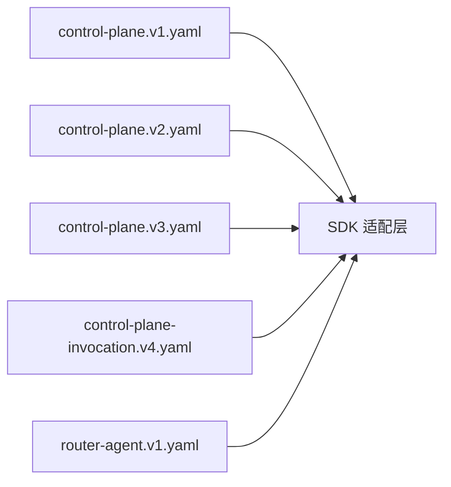

# SDK 参考

<cite>
**本文引用的文件**   
- [README.md](file://README.md)
- [go.mod](file://go.mod)
- [package.json](file://package.json)
- [pnpm-workspace.yaml](file://pnpm-workspace.yaml)
- [tsconfig.base.json](file://tsconfig.base.json)
- [contracts/contracts.go](file://contracts/contracts.go)
- [contracts/runtime_contracts.go](file://contracts/runtime_contracts.go)
- [contracts/result_contracts.go](file://contracts/result_contracts.go)
- [contracts/workspace_api_contracts_test.go](file://contracts/workspace_api_contracts_test.go)
- [contracts/catalog_api_contracts_test.go](file://contracts/catalog_api_contracts_test.go)
- [contracts/a2a_profile_v02.go](file://contracts/a2a_profile_v02.go)
- [contracts/installation_contracts.go](file://contracts/installation_contracts.go)
- [apps/control-plane/internal/gateway/auth.go](file://apps/control-plane/internal/gateway/auth.go)
- [apps/control-plane/internal/gateway/errors.go](file://apps/control-plane/internal/gateway/errors.go)
- [apps/control-plane/internal/gateway/invocation_handler.go](file://apps/control-plane/internal/gateway/invocation_handler.go)
- [apps/control-plane/internal/gateway/workspace_handler.go](file://apps/control-plane/internal/gateway/workspace_handler.go)
- [apps/control-plane/internal/invocation/router_client.go](file://apps/control-plane/internal/invocation/router_client.go)
- [contracts/openapi/control-plane.v1.yaml](file://contracts/openapi/control-plane.v1.yaml)
- [contracts/openapi/control-plane.v2.yaml](file://contracts/openapi/control-plane.v2.yaml)
- [contracts/openapi/control-plane.v3.yaml](file://contracts/openapi/control-plane.v3.yaml)
- [contracts/openapi/control-plane-invocation.v4.yaml](file://contracts/openapi/control-plane-invocation.v4.yaml)
- [contracts/openapi/router-agent.v1.yaml](file://contracts/openapi/router-agent.v1.yaml)
- [specs/001-complete-invocation-contracts/spec.md](file://specs/001-complete-invocation-contracts/spec.md)
- [specs/002-catalog-registry-discovery/spec.md](file://specs/002-catalog-registry-discovery/spec.md)
- [specs/003-workspace-installation-contracts/spec.md](file://specs/003-workspace-installation-contracts/spec.md)
- [specs/004-workspace-create-read/spec.md](file://specs/004-workspace-create-read/spec.md)
- [specs/005-install-agent-pin/spec.md](file://specs/005-install-agent-pin/spec.md)
- [specs/006-resolve-authorize-capability/spec.md](file://specs/006-resolve-authorize-capability/spec.md)
- [specs/007-installation-inspection/spec.md](file://specs/007-installation-inspection/spec.md)
- [specs/008-installation-lifecycle/spec.md](file://specs/008-installation-lifecycle/spec.md)
- [specs/010-invocation-routing-ledger/spec.md](file://specs/010-invocation-routing-ledger/spec.md)
- [specs/011-invocation-runtime-contracts/spec.md](file://specs/011-invocation-runtime-contracts/spec.md)
- [specs/019-agent-sdk-nested-invocation/spec.md](file://specs/019-agent-sdk-nested-invocation/spec.md)
</cite>

## 目录
1. [简介](#简介)
2. [项目结构](#项目结构)
3. [核心组件](#核心组件)
4. [架构总览](#架构总览)
5. [详细组件分析](#详细组件分析)
6. [依赖分析](#依赖分析)
7. [性能考虑](#性能考虑)
8. [故障排查指南](#故障排查指南)
9. [结论](#结论)
10. [附录](#附录)

## 简介
本参考文档面向 NeKiro 平台的 SDK 开发者，目标是帮助你在 Go、Python 与 JavaScript 生态中快速集成平台能力。当前仓库未包含官方 SDK 源码，但提供了完整的 OpenAPI 契约、运行时契约与规范说明，可作为第三方 SDK 设计与实现的权威依据。本文档将基于这些契约与规范，给出：
- 安装与配置要点（以语言包管理器为准）
- 核心类与方法的设计建议（基于 API 契约）
- 认证、错误处理、异步与连接池的最佳实践
- 版本兼容性与升级路径
- 常见使用场景示例（代理注册、工作空间管理、调用路由等）

## 项目结构
仓库采用多模块组织方式，SDK 相关能力由 contracts 与 specs 提供契约与语义约束，control-plane 实现控制面服务，router 与 a2a 协议在合约层定义。SDK 应优先遵循以下目录中的契约与规范：
- contracts：OpenAPI、JSON Schema、运行时契约与测试用例
- specs：分阶段需求、数据模型、接口契约与验收标准
- apps/control-plane：控制面实现，暴露网关与内部服务
- sdks/agent-sdk：预留的 Agent SDK 目录（当前为空）

图表来源
- [contracts/contracts.go:1-200](file://contracts/contracts.go#L1-L200)
- [specs/001-complete-invocation-contracts/spec.md:1-200](file://specs/001-complete-invocation-contracts/spec.md#L1-L200)

章节来源
- [README.md:1-200](file://README.md#L1-L200)
- [go.mod:1-200](file://go.mod#L1-L200)
- [package.json:1-200](file://package.json#L1-L200)
- [pnpm-workspace.yaml:1-200](file://pnpm-workspace.yaml#L1-L200)
- [tsconfig.base.json:1-200](file://tsconfig.base.json#L1-L200)

## 核心组件
本节从 SDK 视角抽象出关键能力域，并映射到仓库中的契约与规范，便于在不同语言中实现一致的客户端体验。

- 认证与鉴权
  - 控制面网关认证流程与错误类型定义
  - 建议：统一封装 Token 获取、刷新与重试策略
- 工作空间管理
  - 工作空间的创建、读取、安装与生命周期操作
  - 建议：幂等性、分页与游标、并发安全
- 代理注册与发现
  - 代理卡（Agent Card）、能力解析与授权
  - 建议：缓存代理元数据、失败降级
- 调用路由与编排
  - 调用请求路由、结果投递、流式结果
  - 建议：超时、重试、退避、追踪 ID 透传
- 运行时契约
  - 事件、媒体、嵌套调用、结果流等运行时行为
  - 建议：按契约校验消息结构与语义

章节来源
- [apps/control-plane/internal/gateway/auth.go:1-200](file://apps/control-plane/internal/gateway/auth.go#L1-L200)
- [apps/control-plane/internal/gateway/errors.go:1-200](file://apps/control-plane/internal/gateway/errors.go#L1-L200)
- [apps/control-plane/internal/gateway/workspace_handler.go:1-200](file://apps/control-plane/internal/gateway/workspace_handler.go#L1-L200)
- [apps/control-plane/internal/gateway/invocation_handler.go:1-200](file://apps/control-plane/internal/gateway/invocation_handler.go#L1-L200)
- [contracts/workspace_api_contracts_test.go:1-200](file://contracts/workspace_api_contracts_test.go#L1-L200)
- [contracts/catalog_api_contracts_test.go:1-200](file://contracts/catalog_api_contracts_test.go#L1-L200)
- [contracts/runtime_contracts.go:1-200](file://contracts/runtime_contracts.go#L1-L200)
- [contracts/result_contracts.go:1-200](file://contracts/result_contracts.go#L1-L200)
- [specs/003-workspace-installation-contracts/spec.md:1-200](file://specs/003-workspace-installation-contracts/spec.md#L1-L200)
- [specs/004-workspace-create-read/spec.md:1-200](file://specs/004-workspace-create-read/spec.md#L1-L200)
- [specs/005-install-agent-pin/spec.md:1-200](file://specs/005-install-agent-pin/spec.md#L1-L200)
- [specs/006-resolve-authorize-capability/spec.md:1-200](file://specs/006-resolve-authorize-capability/spec.md#L1-L200)
- [specs/010-invocation-routing-ledger/spec.md:1-200](file://specs/010-invocation-routing-ledger/spec.md#L1-L200)
- [specs/011-invocation-runtime-contracts/spec.md:1-200](file://specs/011-invocation-runtime-contracts/spec.md#L1-L200)

## 架构总览
下图展示 SDK 与控制面、路由器及运行时的交互关系。SDK 通过 HTTP/JSON 或 SSE 等协议访问控制面网关，完成认证、工作空间管理、代理注册与调用路由等操作；运行时契约定义了事件与结果流的语义。

图表来源
- [apps/control-plane/internal/gateway/auth.go:1-200](file://apps/control-plane/internal/gateway/auth.go#L1-L200)
- [apps/control-plane/internal/gateway/workspace_handler.go:1-200](file://apps/control-plane/internal/gateway/workspace_handler.go#L1-L200)
- [apps/control-plane/internal/gateway/invocation_handler.go:1-200](file://apps/control-plane/internal/gateway/invocation_handler.go#L1-L200)
- [apps/control-plane/internal/invocation/router_client.go:1-200](file://apps/control-plane/internal/invocation/router_client.go#L1-L200)
- [contracts/runtime_contracts.go:1-200](file://contracts/runtime_contracts.go#L1-L200)

## 详细组件分析

### 认证与鉴权
- 目标：为 SDK 提供统一的认证入口，支持 Token 获取、刷新、重试与错误分类。
- 关键点：
  - 控制面网关的认证逻辑与错误类型定义
  - 建议在 SDK 中封装认证中间件，自动注入 Authorization 头
  - 对 401/403 进行差异化处理与重试策略

图表来源
- [apps/control-plane/internal/gateway/auth.go:1-200](file://apps/control-plane/internal/gateway/auth.go#L1-L200)
- [apps/control-plane/internal/gateway/errors.go:1-200](file://apps/control-plane/internal/gateway/errors.go#L1-L200)

章节来源
- [apps/control-plane/internal/gateway/auth.go:1-200](file://apps/control-plane/internal/gateway/auth.go#L1-L200)
- [apps/control-plane/internal/gateway/errors.go:1-200](file://apps/control-plane/internal/gateway/errors.go#L1-L200)

### 工作空间管理
- 目标：提供工作空间的创建、读取、安装与生命周期管理能力。
- 关键点：
  - 工作空间 API 契约与测试用例
  - 建议：支持分页与游标、幂等写入、事务一致性
  - 结合安装与检查点规范，确保可观测与回滚

图表来源
- [apps/control-plane/internal/gateway/workspace_handler.go:1-200](file://apps/control-plane/internal/gateway/workspace_handler.go#L1-L200)
- [contracts/workspace_api_contracts_test.go:1-200](file://contracts/workspace_api_contracts_test.go#L1-L200)
- [specs/003-workspace-installation-contracts/spec.md:1-200](file://specs/003-workspace-installation-contracts/spec.md#L1-L200)
- [specs/004-workspace-create-read/spec.md:1-200](file://specs/004-workspace-create-read/spec.md#L1-L200)
- [specs/007-installation-inspection/spec.md:1-200](file://specs/007-installation-inspection/spec.md#L1-L200)
- [specs/008-installation-lifecycle/spec.md:1-200](file://specs/008-installation-lifecycle/spec.md#L1-L200)

章节来源
- [apps/control-plane/internal/gateway/workspace_handler.go:1-200](file://apps/control-plane/internal/gateway/workspace_handler.go#L1-L200)
- [contracts/workspace_api_contracts_test.go:1-200](file://contracts/workspace_api_contracts_test.go#L1-L200)
- [specs/003-workspace-installation-contracts/spec.md:1-200](file://specs/003-workspace-installation-contracts/spec.md#L1-L200)
- [specs/004-workspace-create-read/spec.md:1-200](file://specs/004-workspace-create-read/spec.md#L1-L200)
- [specs/007-installation-inspection/spec.md:1-200](file://specs/007-installation-inspection/spec.md#L1-L200)
- [specs/008-installation-lifecycle/spec.md:1-200](file://specs/008-installation-lifecycle/spec.md#L1-L200)

### 代理注册与发现
- 目标：支持代理卡（Agent Card）注册、能力解析与授权。
- 关键点：
  - 代理卡语义规则与兼容性测试
  - 建议：本地缓存代理元数据，定期刷新；失败时降级到只读模式

图表来源
- [contracts/catalog_api_contracts_test.go:1-200](file://contracts/catalog_api_contracts_test.go#L1-L200)
- [specs/002-catalog-registry-discovery/spec.md:1-200](file://specs/002-catalog-registry-discovery/spec.md#L1-L200)
- [specs/005-install-agent-pin/spec.md:1-200](file://specs/005-install-agent-pin/spec.md#L1-L200)
- [specs/006-resolve-authorize-capability/spec.md:1-200](file://specs/006-resolve-authorize-capability/spec.md#L1-L200)

章节来源
- [contracts/catalog_api_contracts_test.go:1-200](file://contracts/catalog_api_contracts_test.go#L1-L200)
- [specs/002-catalog-registry-discovery/spec.md:1-200](file://specs/002-catalog-registry-discovery/spec.md#L1-L200)
- [specs/005-install-agent-pin/spec.md:1-200](file://specs/005-install-agent-pin/spec.md#L1-L200)
- [specs/006-resolve-authorize-capability/spec.md:1-200](file://specs/006-resolve-authorize-capability/spec.md#L1-L200)

### 调用路由与编排
- 目标：实现调用请求的路由、结果投递与流式结果。
- 关键点：
  - 调用处理器与路由器客户端
  - 建议：支持超时、重试、指数退避、追踪 ID 透传
  - 结果投递需符合运行时契约与结果流规范

图表来源
- [apps/control-plane/internal/gateway/invocation_handler.go:1-200](file://apps/control-plane/internal/gateway/invocation_handler.go#L1-L200)
- [apps/control-plane/internal/invocation/router_client.go:1-200](file://apps/control-plane/internal/invocation/router_client.go#L1-L200)
- [contracts/runtime_contracts.go:1-200](file://contracts/runtime_contracts.go#L1-L200)
- [contracts/result_contracts.go:1-200](file://contracts/result_contracts.go#L1-L200)
- [specs/010-invocation-routing-ledger/spec.md:1-200](file://specs/010-invocation-routing-ledger/spec.md#L1-L200)
- [specs/011-invocation-runtime-contracts/spec.md:1-200](file://specs/011-invocation-runtime-contracts/spec.md#L1-L200)

章节来源
- [apps/control-plane/internal/gateway/invocation_handler.go:1-200](file://apps/control-plane/internal/gateway/invocation_handler.go#L1-L200)
- [apps/control-plane/internal/invocation/router_client.go:1-200](file://apps/control-plane/internal/invocation/router_client.go#L1-L200)
- [contracts/runtime_contracts.go:1-200](file://contracts/runtime_contracts.go#L1-L200)
- [contracts/result_contracts.go:1-200](file://contracts/result_contracts.go#L1-L200)
- [specs/010-invocation-routing-ledger/spec.md:1-200](file://specs/010-invocation-routing-ledger/spec.md#L1-L200)
- [specs/011-invocation-runtime-contracts/spec.md:1-200](file://specs/011-invocation-runtime-contracts/spec.md#L1-L200)

### A2A 与 Agent Card 兼容性
- 目标：确保 SDK 与 A2A 协议与 Agent Card 语义保持一致。
- 关键点：
  - A2A Profile 与 Agent Card 的语义规则与兼容性测试
  - 建议：在 SDK 中内置校验器，避免发送不合规消息

章节来源
- [contracts/a2a_profile_v02.go:1-200](file://contracts/a2a_profile_v02.go#L1-L200)
- [specs/001-complete-invocation-contracts/spec.md:1-200](file://specs/001-complete-invocation-contracts/spec.md#L1-L200)

## 依赖分析
SDK 的依赖主要来源于 OpenAPI 契约与运行时契约。不同版本的 control-plane API 可能引入字段变更或新增端点，SDK 应具备版本探测与适配能力。

图表来源
- [contracts/openapi/control-plane.v1.yaml:1-200](file://contracts/openapi/control-plane.v1.yaml#L1-L200)
- [contracts/openapi/control-plane.v2.yaml:1-200](file://contracts/openapi/control-plane.v2.yaml#L1-L200)
- [contracts/openapi/control-plane.v3.yaml:1-200](file://contracts/openapi/control-plane.v3.yaml#L1-L200)
- [contracts/openapi/control-plane-invocation.v4.yaml:1-200](file://contracts/openapi/control-plane-invocation.v4.yaml#L1-L200)
- [contracts/openapi/router-agent.v1.yaml:1-200](file://contracts/openapi/router-agent.v1.yaml#L1-L200)

章节来源
- [contracts/openapi/control-plane.v1.yaml:1-200](file://contracts/openapi/control-plane.v1.yaml#L1-L200)
- [contracts/openapi/control-plane.v2.yaml:1-200](file://contracts/openapi/control-plane.v2.yaml#L1-L200)
- [contracts/openapi/control-plane.v3.yaml:1-200](file://contracts/openapi/control-plane.v3.yaml#L1-L200)
- [contracts/openapi/control-plane-invocation.v4.yaml:1-200](file://contracts/openapi/control-plane-invocation.v4.yaml#L1-L200)
- [contracts/openapi/router-agent.v1.yaml:1-200](file://contracts/openapi/router-agent.v1.yaml#L1-L200)

## 性能考虑
- 连接池与复用
  - 建议：HTTP 客户端启用连接复用与最大空闲连接数限制
  - 针对长连接（SSE）建立独立连接池，避免阻塞短请求
- 超时与重试
  - 建议：设置合理的请求超时与重试上限，使用指数退避与抖动
- 批处理与批量操作
  - 建议：对写操作（如批量注册代理）提供批处理接口，减少往返次数
- 缓存与去重
  - 建议：对只读元数据（代理卡、能力列表）进行本地缓存与失效策略
- 背压与限流
  - 建议：对高吞吐场景实现令牌桶或滑动窗口限流

[本节为通用指导，无需代码引用]

## 故障排查指南
- 认证失败
  - 现象：401/403 错误
  - 排查：检查 Token 有效性、权限范围、网关配置
- 工作空间操作异常
  - 现象：创建/安装/删除失败
  - 排查：确认幂等键、资源状态、数据库迁移是否就绪
- 调用路由失败
  - 现象：超时、无响应、结果不一致
  - 排查：检查路由选择策略、运行时健康状态、结果投递链路
- 运行时契约不匹配
  - 现象：事件/结果流解析失败
  - 排查：对比运行时契约与 SDK 校验器版本

章节来源
- [apps/control-plane/internal/gateway/errors.go:1-200](file://apps/control-plane/internal/gateway/errors.go#L1-L200)
- [contracts/runtime_contracts.go:1-200](file://contracts/runtime_contracts.go#L1-L200)
- [contracts/result_contracts.go:1-200](file://contracts/result_contracts.go#L1-L200)

## 结论
NeKiro 平台通过完善的契约与规范为第三方 SDK 提供了清晰的集成边界。建议 SDK 实现围绕认证、工作空间管理、代理注册与调用路由四大能力域展开，严格遵循 OpenAPI 与运行时契约，并在版本演进中保持兼容性与可观测性。

[本节为总结，无需代码引用]

## 附录

### 安装与配置（按语言）
- Go SDK
  - 使用 go mod 添加依赖（第三方库）
  - 配置基础 URL、超时、重试策略与连接池参数
- Python SDK
  - 使用 pip/poetry 安装依赖（第三方库）
  - 配置会话、连接池与日志级别
- JavaScript SDK
  - 使用 pnpm/npm/yarn 安装依赖（第三方库）
  - 配置 Node.js 环境、TLS 与代理

章节来源
- [go.mod:1-200](file://go.mod#L1-L200)
- [package.json:1-200](file://package.json#L1-L200)
- [pnpm-workspace.yaml:1-200](file://pnpm-workspace.yaml#L1-L200)
- [tsconfig.base.json:1-200](file://tsconfig.base.json#L1-L200)

### 版本兼容性与升级指南
- 版本探测
  - 建议：SDK 启动时探测控制面 API 版本，动态适配端点与字段
- 向后兼容
  - 建议：对新增字段采用可选处理，对废弃字段保留兼容层
- 升级步骤
  - 建议：灰度发布、特性开关、回滚预案

章节来源
- [contracts/contracts.go:1-200](file://contracts/contracts.go#L1-L200)
- [specs/001-complete-invocation-contracts/spec.md:1-200](file://specs/001-complete-invocation-contracts/spec.md#L1-L200)

### 常见使用场景示例（路径指引）
- 代理注册
  - 参考：[specs/002-catalog-registry-discovery/spec.md](file://specs/002-catalog-registry-discovery/spec.md)
  - 参考：[specs/005-install-agent-pin/spec.md](file://specs/005-install-agent-pin/spec.md)
- 工作空间管理
  - 参考：[specs/003-workspace-installation-contracts/spec.md](file://specs/003-workspace-installation-contracts/spec.md)
  - 参考：[specs/004-workspace-create-read/spec.md](file://specs/004-workspace-create-read/spec.md)
  - 参考：[specs/007-installation-inspection/spec.md](file://specs/007-installation-inspection/spec.md)
  - 参考：[specs/008-installation-lifecycle/spec.md](file://specs/008-installation-lifecycle/spec.md)
- 调用路由
  - 参考：[specs/010-invocation-routing-ledger/spec.md](file://specs/010-invocation-routing-ledger/spec.md)
  - 参考：[specs/011-invocation-runtime-contracts/spec.md](file://specs/011-invocation-runtime-contracts/spec.md)
- 嵌套调用（Agent SDK）
  - 参考：[specs/019-agent-sdk-nested-invocation/spec.md](file://specs/019-agent-sdk-nested-invocation/spec.md)