# SDK 通用概念

<cite>
**本文引用的文件**   
- [README.md](file://README.md)
- [go.mod](file://go.mod)
- [contracts/contracts.go](file://contracts/contracts.go)
- [contracts/runtime_contracts.go](file://contracts/runtime_contracts.go)
- [contracts/result_contracts.go](file://contracts/result_contracts.go)
- [contracts/workspace_api_contracts_test.go](file://contracts/workspace_api_contracts_test.go)
- [contracts/catalog_api_contracts_test.go](file://contracts/catalog_api_contracts_test.go)
- [contracts/a2a_profile_v02.go](file://contracts/a2a_profile_v02.go)
- [contracts/installation_contracts.go](file://contracts/installation_contracts.go)
- [contracts/validate.go](file://contracts/validate.go)
- [apps/control-plane/internal/gateway/errors.go](file://apps/control-plane/internal/gateway/errors.go)
- [apps/control-plane/internal/gateway/auth.go](file://apps/control-plane/internal/gateway/auth.go)
- [apps/control-plane/internal/config/config.go](file://apps/control-plane/internal/config/config.go)
- [contracts/openapi/control-plane.v1.yaml](file://contracts/openapi/control-plane.v1.yaml)
- [contracts/openapi/control-plane.v2.yaml](file://contracts/openapi/control-plane.v2.yaml)
- [contracts/openapi/control-plane.v3.yaml](file://contracts/openapi/control-plane.v3.yaml)
- [contracts/schemas/platform-error.v1.schema.json](file://contracts/schemas/platform-error.v1.schema.json)
- [contracts/schemas/platform-error.v2.schema.json](file://contracts/schemas/platform-error.v2.schema.json)
- [contracts/schemas/platform-error.v3.schema.json](file://contracts/schemas/platform-error.v3.schema.json)
- [contracts/schemas/platform-error.v4.schema.json](file://contracts/schemas/platform-error.v4.schema.json)
- [contracts/schemas/common.v1.schema.json](file://contracts/schemas/common.v1.schema.json)
- [specs/001-complete-invocation-contracts/spec.md](file://specs/001-complete-invocation-contracts/spec.md)
- [specs/001-complete-invocation-contracts/data-model.md](file://specs/001-complete-invocation-contracts/data-model.md)
- [specs/001-complete-invocation-contracts/quickstart.md](file://specs/001-complete-invocation-contracts/quickstart.md)
- [specs/002-catalog-registry-discovery/spec.md](file://specs/002-catalog-registry-discovery/spec.md)
- [specs/003-workspace-installation-contracts/spec.md](file://specs/003-workspace-installation-contracts/spec.md)
- [specs/004-workspace-create-read/spec.md](file://specs/004-workspace-create-read/spec.md)
- [specs/005-install-agent-pin/spec.md](file://specs/005-install-agent-pin/spec.md)
- [specs/006-resolve-authorize-capability/spec.md](file://specs/006-resolve-authorize-capability/spec.md)
- [specs/007-installation-inspection/spec.md](file://specs/007-installation-inspection/spec.md)
- [specs/008-installation-lifecycle/spec.md](file://specs/008-installation-lifecycle/spec.md)
- [specs/010-invocation-routing-ledger/spec.md](file://specs/010-invocation-routing-ledger/spec.md)
- [specs/011-invocation-runtime-contracts/spec.md](file://specs/011-invocation-runtime-contracts/spec.md)
- [specs/019-agent-sdk-nested-invocation/spec.md](file://specs/019-agent-sdk-nested-invocation/spec.md)
</cite>

## 目录
1. [简介](#简介)
2. [项目结构](#项目结构)
3. [核心组件](#核心组件)
4. [架构总览](#架构总览)
5. [详细组件分析](#详细组件分析)
6. [依赖分析](#依赖分析)
7. [性能考虑](#性能考虑)
8. [故障排查指南](#故障排查指南)
9. [结论](#结论)
10. [附录](#附录)

## 简介
本文件为 NeKiro 平台 SDK 的“通用概念”文档，面向所有语言实现的 SDK。目标是统一以下跨语言、跨版本的核心约定：
- 认证机制与连接配置
- 错误码定义与错误模型
- 版本兼容性与升级策略
- 统一的请求/响应格式、数据模型映射与序列化规则
- 跨语言数据类型对应关系、枚举值与常量
- 通用最佳实践（连接池、重试、日志、监控）
- SDK 升级指南、迁移注意事项与向后兼容性说明

## 项目结构
NeKiro 仓库采用多模块组织方式，SDK 通用概念主要来源于契约层（contracts）、控制面实现（control-plane）以及规范文档（specs）。下图给出与 SDK 通用概念直接相关的顶层结构视图。

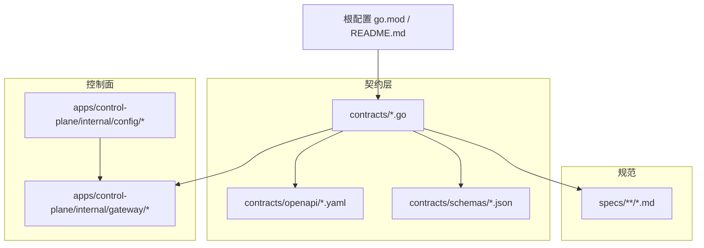

图表来源
- [contracts/contracts.go:1-200](file://contracts/contracts.go#L1-L200)
- [contracts/openapi/control-plane.v1.yaml:1-200](file://contracts/openapi/control-plane.v1.yaml#L1-L200)
- [contracts/schemas/platform-error.v1.schema.json:1-200](file://contracts/schemas/platform-error.v1.schema.json#L1-L200)
- [apps/control-plane/internal/gateway/errors.go:1-200](file://apps/control-plane/internal/gateway/errors.go#L1-L200)
- [apps/control-plane/internal/config/config.go:1-200](file://apps/control-plane/internal/config/config.go#L1-L200)
- [specs/001-complete-invocation-contracts/spec.md:1-200](file://specs/001-complete-invocation-contracts/spec.md#L1-L200)

章节来源
- [README.md:1-200](file://README.md#L1-L200)
- [go.mod:1-200](file://go.mod#L1-L200)
- [contracts/contracts.go:1-200](file://contracts/contracts.go#L1-L200)

## 核心组件
本节聚焦 SDK 通用概念所依赖的关键契约与实现要点，涵盖认证、连接、错误、版本与序列化等。

- 认证机制
  - 网关侧提供鉴权入口与错误处理，SDK 需按协议头或令牌传递凭据。
  - 参考路径：[认证实现](file://apps/control-plane/internal/gateway/auth.go)、[错误处理](file://apps/control-plane/internal/gateway/errors.go)。

- 连接配置
  - 控制面配置项由配置模块管理，SDK 应暴露等效的配置对象（如端点、超时、TLS、代理等）。
  - 参考路径：[配置模块](file://apps/control-plane/internal/config/config.go)。

- 错误模型与错误码
  - 平台错误模型在多个 schema 版本中演进，SDK 需支持解析并映射到本地错误类型。
  - 参考路径：[platform-error v1-v4](file://contracts/schemas/platform-error.v1.schema.json)、[platform-error v2](file://contracts/schemas/platform-error.v2.schema.json)、[platform-error v3](file://contracts/schemas/platform-error.v3.schema.json)、[platform-error v4](file://contracts/schemas/platform-error.v4.schema.json)。

- 版本兼容性与 API 版本
  - OpenAPI 定义了 control-plane 的多版本接口，SDK 需遵循语义化版本与兼容性策略。
  - 参考路径：[control-plane v1/v2/v3](file://contracts/openapi/control-plane.v1.yaml)、[control-plane v2](file://contracts/openapi/control-plane.v2.yaml)、[control-plane v3](file://contracts/openapi/control-plane.v3.yaml)。

- 统一请求/响应格式与序列化
  - 通用字段与公共模型通过 schemas 约束；JSON Schema 作为跨语言一致性的基础。
  - 参考路径：[common.v1](file://contracts/schemas/common.v1.schema.json)、[验证器](file://contracts/validate.go)。

- 运行时与结果投递
  - 运行时契约与结果投递规范决定流式与非流式结果的传输与状态机。
  - 参考路径：[运行时契约](file://contracts/runtime_contracts.go)、[结果契约](file://contracts/result_contracts.go)、[运行时规范](file://specs/011-invocation-runtime-contracts/spec.md)。

章节来源
- [apps/control-plane/internal/gateway/auth.go:1-200](file://apps/control-plane/internal/gateway/auth.go#L1-L200)
- [apps/control-plane/internal/gateway/errors.go:1-200](file://apps/control-plane/internal/gateway/errors.go#L1-L200)
- [apps/control-plane/internal/config/config.go:1-200](file://apps/control-plane/internal/config/config.go#L1-L200)
- [contracts/schemas/platform-error.v1.schema.json:1-200](file://contracts/schemas/platform-error.v1.schema.json#L1-L200)
- [contracts/schemas/platform-error.v2.schema.json:1-200](file://contracts/schemas/platform-error.v2.schema.json#L1-L200)
- [contracts/schemas/platform-error.v3.schema.json:1-200](file://contracts/schemas/platform-error.v3.schema.json#L1-L200)
- [contracts/schemas/platform-error.v4.schema.json:1-200](file://contracts/schemas/platform-error.v4.schema.json#L1-L200)
- [contracts/openapi/control-plane.v1.yaml:1-200](file://contracts/openapi/control-plane.v1.yaml#L1-L200)
- [contracts/openapi/control-plane.v2.yaml:1-200](file://contracts/openapi/control-plane.v2.yaml#L1-L200)
- [contracts/openapi/control-plane.v3.yaml:1-200](file://contracts/openapi/control-plane.v3.yaml#L1-L200)
- [contracts/schemas/common.v1.schema.json:1-200](file://contracts/schemas/common.v1.schema.json#L1-L200)
- [contracts/validate.go:1-200](file://contracts/validate.go#L1-L200)
- [contracts/runtime_contracts.go:1-200](file://contracts/runtime_contracts.go#L1-L200)
- [contracts/result_contracts.go:1-200](file://contracts/result_contracts.go#L1-L200)
- [specs/011-invocation-runtime-contracts/spec.md:1-200](file://specs/011-invocation-runtime-contracts/spec.md#L1-L200)

## 架构总览
下图展示 SDK 与控制面之间的交互边界与关键契约位置，便于理解认证、路由、工作区、安装与调用等通用流程。

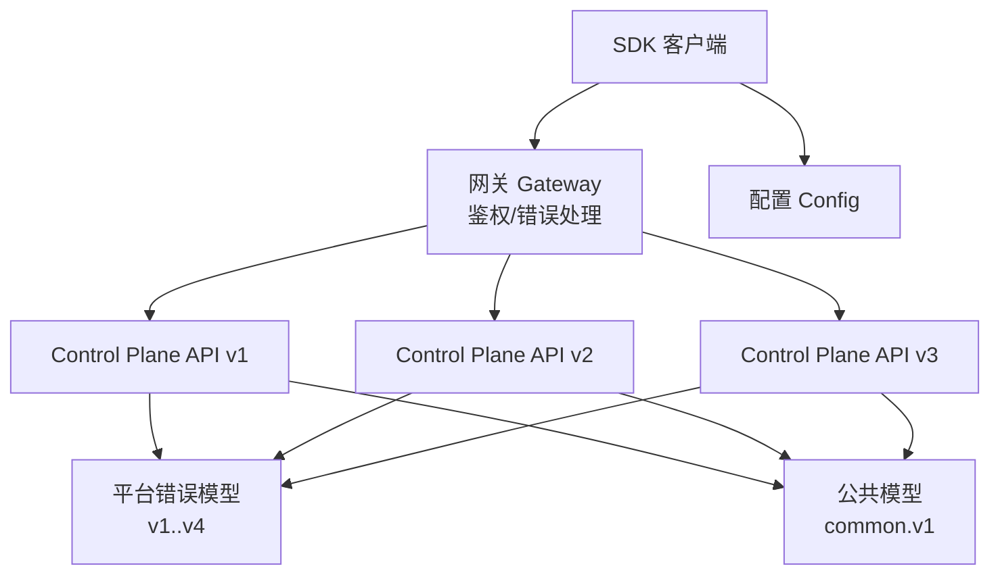

图表来源
- [apps/control-plane/internal/gateway/auth.go:1-200](file://apps/control-plane/internal/gateway/auth.go#L1-L200)
- [apps/control-plane/internal/gateway/errors.go:1-200](file://apps/control-plane/internal/gateway/errors.go#L1-L200)
- [contracts/openapi/control-plane.v1.yaml:1-200](file://contracts/openapi/control-plane.v1.yaml#L1-L200)
- [contracts/openapi/control-plane.v2.yaml:1-200](file://contracts/openapi/control-plane.v2.yaml#L1-L200)
- [contracts/openapi/control-plane.v3.yaml:1-200](file://contracts/openapi/control-plane.v3.yaml#L1-L200)
- [contracts/schemas/platform-error.v1.schema.json:1-200](file://contracts/schemas/platform-error.v1.schema.json#L1-L200)
- [contracts/schemas/common.v1.schema.json:1-200](file://contracts/schemas/common.v1.schema.json#L1-L200)

## 详细组件分析

### 认证与授权
- 目标：确保 SDK 以受信任身份访问控制面，并在失败时返回标准化错误。
- 关键点：
  - 凭据传递：建议通过标准 HTTP 头携带令牌或会话标识，具体头名与范围以 OpenAPI 与网关实现为准。
  - 鉴权失败：网关返回平台错误模型，SDK 应将其映射为本地异常并包含可诊断信息。
  - 安全建议：避免在日志中输出敏感凭据；使用 TLS；最小权限原则。

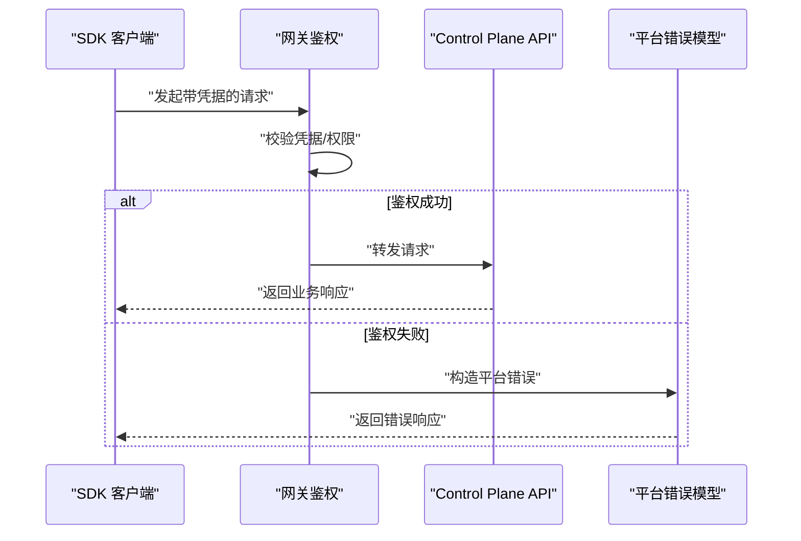

图表来源
- [apps/control-plane/internal/gateway/auth.go:1-200](file://apps/control-plane/internal/gateway/auth.go#L1-L200)
- [apps/control-plane/internal/gateway/errors.go:1-200](file://apps/control-plane/internal/gateway/errors.go#L1-L200)
- [contracts/openapi/control-plane.v1.yaml:1-200](file://contracts/openapi/control-plane.v1.yaml#L1-L200)
- [contracts/schemas/platform-error.v1.schema.json:1-200](file://contracts/schemas/platform-error.v1.schema.json#L1-L200)

章节来源
- [apps/control-plane/internal/gateway/auth.go:1-200](file://apps/control-plane/internal/gateway/auth.go#L1-L200)
- [apps/control-plane/internal/gateway/errors.go:1-200](file://apps/control-plane/internal/gateway/errors.go#L1-L200)

### 连接配置与生命周期
- 目标：为 SDK 提供一致的连接参数、超时、重试与资源释放策略。
- 关键点：
  - 配置项：端点地址、默认工作区、超时、最大并发、TLS 选项、代理等。
  - 连接复用：内部维护连接池，避免频繁握手开销。
  - 优雅关闭：显式释放连接与上下文，防止资源泄漏。

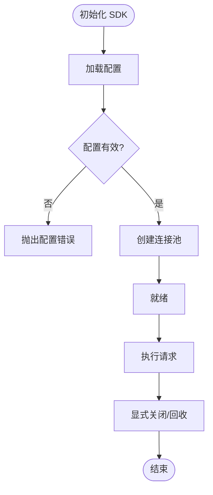

图表来源
- [apps/control-plane/internal/config/config.go:1-200](file://apps/control-plane/internal/config/config.go#L1-L200)

章节来源
- [apps/control-plane/internal/config/config.go:1-200](file://apps/control-plane/internal/config/config.go#L1-L200)

### 错误模型与错误码
- 目标：统一错误表示，便于跨语言解析与用户友好提示。
- 关键点：
  - 平台错误模型在多版本中演进，SDK 应按版本兼容解析。
  - 常见分类：网络错误、认证失败、未找到、冲突、服务端错误等。
  - 诊断信息：包含请求 ID、时间戳、错误码与消息。

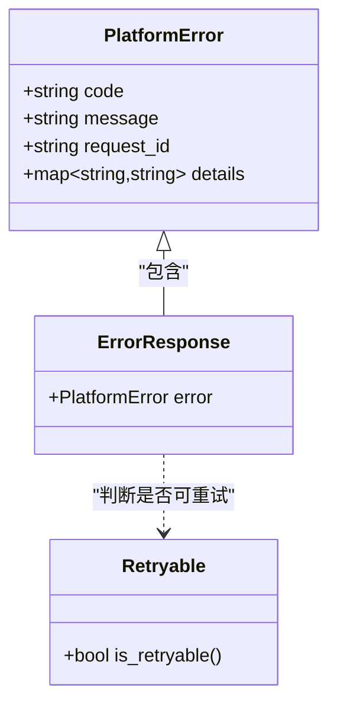

图表来源
- [contracts/schemas/platform-error.v1.schema.json:1-200](file://contracts/schemas/platform-error.v1.schema.json#L1-L200)
- [contracts/schemas/platform-error.v2.schema.json:1-200](file://contracts/schemas/platform-error.v2.schema.json#L1-L200)
- [contracts/schemas/platform-error.v3.schema.json:1-200](file://contracts/schemas/platform-error.v3.schema.json#L1-L200)
- [contracts/schemas/platform-error.v4.schema.json:1-200](file://contracts/schemas/platform-error.v4.schema.json#L1-L200)

章节来源
- [contracts/schemas/platform-error.v1.schema.json:1-200](file://contracts/schemas/platform-error.v1.schema.json#L1-L200)
- [contracts/schemas/platform-error.v2.schema.json:1-200](file://contracts/schemas/platform-error.v2.schema.json#L1-L200)
- [contracts/schemas/platform-error.v3.schema.json:1-200](file://contracts/schemas/platform-error.v3.schema.json#L1-L200)
- [contracts/schemas/platform-error.v4.schema.json:1-200](file://contracts/schemas/platform-error.v4.schema.json#L1-L200)

### 版本兼容性与升级策略
- 目标：保证 SDK 在不同 API 版本间的平滑过渡与稳定行为。
- 关键点：
  - 语义化版本：主版本变更可能引入破坏性更新；次版本新增能力；补丁版本修复问题。
  - 向后兼容：新字段可选、旧字段保留、弃用字段渐进移除。
  - 选择策略：SDK 默认使用最新稳定版，同时允许显式指定版本。

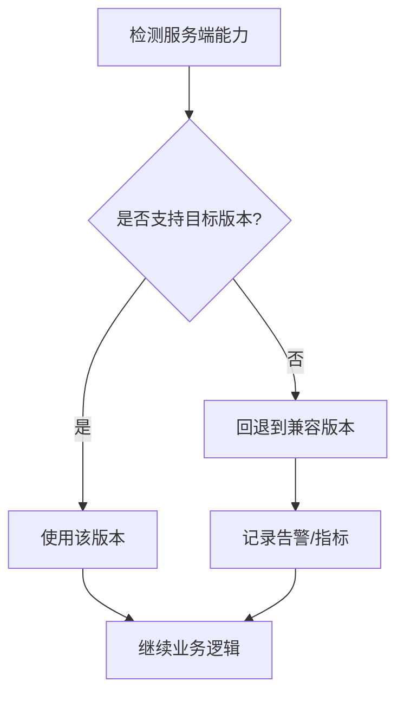

图表来源
- [contracts/openapi/control-plane.v1.yaml:1-200](file://contracts/openapi/control-plane.v1.yaml#L1-L200)
- [contracts/openapi/control-plane.v2.yaml:1-200](file://contracts/openapi/control-plane.v2.yaml#L1-L200)
- [contracts/openapi/control-plane.v3.yaml:1-200](file://contracts/openapi/control-plane.v3.yaml#L1-L200)

章节来源
- [contracts/openapi/control-plane.v1.yaml:1-200](file://contracts/openapi/control-plane.v1.yaml#L1-L200)
- [contracts/openapi/control-plane.v2.yaml:1-200](file://contracts/openapi/control-plane.v2.yaml#L1-L200)
- [contracts/openapi/control-plane.v3.yaml:1-200](file://contracts/openapi/control-plane.v3.yaml#L1-L200)

### 统一请求/响应格式与序列化
- 目标：确保跨语言一致的数据结构与序列化行为。
- 关键点：
  - JSON Schema 作为权威数据模型描述，SDK 生成或校验时应基于 schema。
  - 公共字段（如 id、时间戳、trace_id）在所有实体中保持一致。
  - 日期/时间使用 ISO 8601；数值类型明确精度；布尔值严格 true/false。

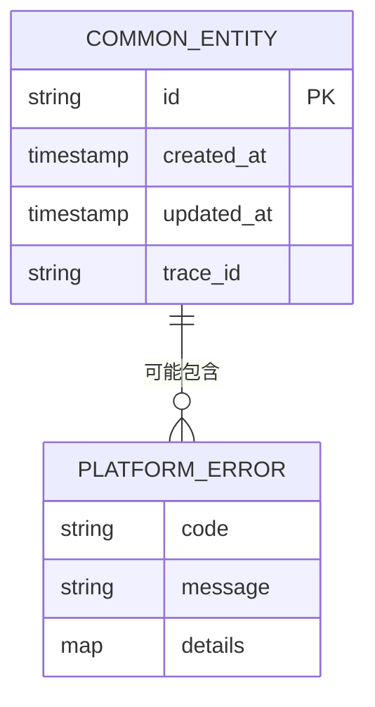

图表来源
- [contracts/schemas/common.v1.schema.json:1-200](file://contracts/schemas/common.v1.schema.json#L1-L200)
- [contracts/schemas/platform-error.v1.schema.json:1-200](file://contracts/schemas/platform-error.v1.schema.json#L1-L200)

章节来源
- [contracts/schemas/common.v1.schema.json:1-200](file://contracts/schemas/common.v1.schema.json#L1-L200)
- [contracts/validate.go:1-200](file://contracts/validate.go#L1-L200)

### 运行时与结果投递
- 目标：定义任务调用的生命周期、事件与结果流的传输方式。
- 关键点：
  - 非流式：一次性返回最终结果。
  - 流式：分片事件逐步推进，最后以终端事件结束。
  - 关联键：invocation_id、root_task_id、trace_id 贯穿全链路。

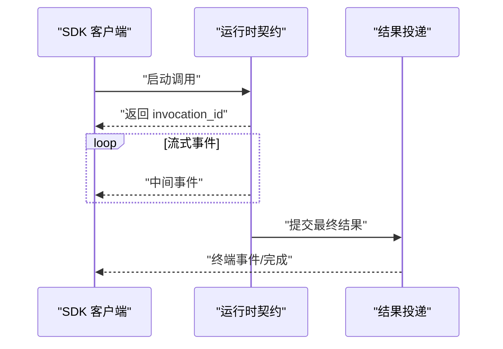

图表来源
- [contracts/runtime_contracts.go:1-200](file://contracts/runtime_contracts.go#L1-L200)
- [contracts/result_contracts.go:1-200](file://contracts/result_contracts.go#L1-L200)
- [specs/011-invocation-runtime-contracts/spec.md:1-200](file://specs/011-invocation-runtime-contracts/spec.md#L1-L200)

章节来源
- [contracts/runtime_contracts.go:1-200](file://contracts/runtime_contracts.go#L1-L200)
- [contracts/result_contracts.go:1-200](file://contracts/result_contracts.go#L1-L200)
- [specs/011-invocation-runtime-contracts/spec.md:1-200](file://specs/011-invocation-runtime-contracts/spec.md#L1-L200)

### 工作区与安装相关通用概念
- 目标：为工作区与安装生命周期提供统一的 SDK 抽象。
- 关键点：
  - 工作区：隔离环境、策略与元数据。
  - 安装：安装清单、版本锁定、生命周期操作。
  - 能力解析：根据卡片与策略解析可用能力。

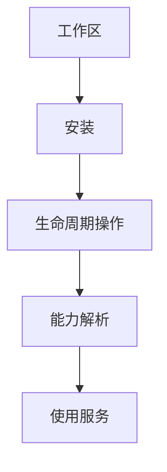

图表来源
- [contracts/workspace_api_contracts_test.go:1-200](file://contracts/workspace_api_contracts_test.go#L1-L200)
- [contracts/installation_contracts.go:1-200](file://contracts/installation_contracts.go#L1-L200)
- [specs/003-workspace-installation-contracts/spec.md:1-200](file://specs/003-workspace-installation-contracts/spec.md#L1-L200)
- [specs/004-workspace-create-read/spec.md:1-200](file://specs/004-workspace-create-read/spec.md#L1-L200)
- [specs/005-install-agent-pin/spec.md:1-200](file://specs/005-install-agent-pin/spec.md#L1-L200)
- [specs/006-resolve-authorize-capability/spec.md:1-200](file://specs/006-resolve-authorize-capability/spec.md#L1-L200)
- [specs/007-installation-inspection/spec.md:1-200](file://specs/007-installation-inspection/spec.md#L1-L200)
- [specs/008-installation-lifecycle/spec.md:1-200](file://specs/008-installation-lifecycle/spec.md#L1-L200)

章节来源
- [contracts/workspace_api_contracts_test.go:1-200](file://contracts/workspace_api_contracts_test.go#L1-L200)
- [contracts/installation_contracts.go:1-200](file://contracts/installation_contracts.go#L1-L200)
- [specs/003-workspace-installation-contracts/spec.md:1-200](file://specs/003-workspace-installation-contracts/spec.md#L1-L200)
- [specs/004-workspace-create-read/spec.md:1-200](file://specs/004-workspace-create-read/spec.md#L1-L200)
- [specs/005-install-agent-pin/spec.md:1-200](file://specs/005-install-agent-pin/spec.md#L1-L200)
- [specs/006-resolve-authorize-capability/spec.md:1-200](file://specs/006-resolve-authorize-capability/spec.md#L1-L200)
- [specs/007-installation-inspection/spec.md:1-200](file://specs/007-installation-inspection/spec.md#L1-L200)
- [specs/008-installation-lifecycle/spec.md:1-200](file://specs/008-installation-lifecycle/spec.md#L1-L200)

### 目录与发现
- 目标：提供服务注册、发现与能力清单的统一抽象。
- 关键点：
  - 目录条目：名称、版本、能力、端点等。
  - 查询与过滤：按标签、版本、能力筛选。
  - 缓存与一致性：本地缓存与服务端一致性策略。

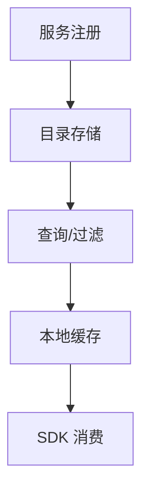

图表来源
- [contracts/catalog_api_contracts_test.go:1-200](file://contracts/catalog_api_contracts_test.go#L1-L200)
- [specs/002-catalog-registry-discovery/spec.md:1-200](file://specs/002-catalog-registry-discovery/spec.md#L1-L200)

章节来源
- [contracts/catalog_api_contracts_test.go:1-200](file://contracts/catalog_api_contracts_test.go#L1-L200)
- [specs/002-catalog-registry-discovery/spec.md:1-200](file://specs/002-catalog-registry-discovery/spec.md#L1-L200)

### 调用编排与嵌套调用
- 目标：定义跨服务/跨 Agent 的调用链路与嵌套调用语义。
- 关键点：
  - 调用链：根任务、子任务、追踪 ID。
  - 幂等与去重：基于请求 ID 或业务键。
  - 嵌套调用：父调用上下文透传与结果聚合。

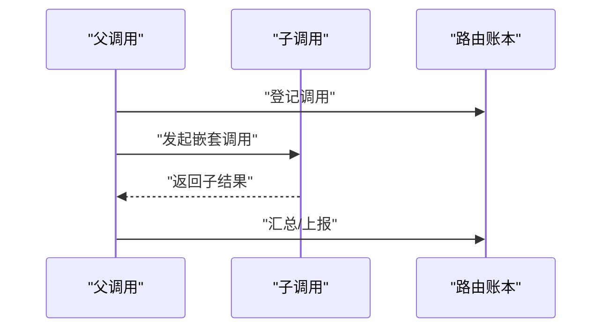

图表来源
- [specs/010-invocation-routing-ledger/spec.md:1-200](file://specs/010-invocation-routing-ledger/spec.md#L1-L200)
- [specs/019-agent-sdk-nested-invocation/spec.md:1-200](file://specs/019-agent-sdk-nested-invocation/spec.md#L1-L200)

章节来源
- [specs/010-invocation-routing-ledger/spec.md:1-200](file://specs/010-invocation-routing-ledger/spec.md#L1-L200)
- [specs/019-agent-sdk-nested-invocation/spec.md:1-200](file://specs/019-agent-sdk-nested-invocation/spec.md#L1-L200)

## 依赖分析
SDK 通用概念对契约层与规范的依赖如下：

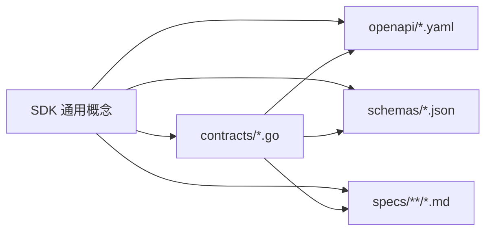

图表来源
- [contracts/contracts.go:1-200](file://contracts/contracts.go#L1-L200)
- [contracts/openapi/control-plane.v1.yaml:1-200](file://contracts/openapi/control-plane.v1.yaml#L1-L200)
- [contracts/schemas/platform-error.v1.schema.json:1-200](file://contracts/schemas/platform-error.v1.schema.json#L1-L200)
- [specs/001-complete-invocation-contracts/spec.md:1-200](file://specs/001-complete-invocation-contracts/spec.md#L1-L200)

章节来源
- [contracts/contracts.go:1-200](file://contracts/contracts.go#L1-L200)
- [go.mod:1-200](file://go.mod#L1-L200)

## 性能考虑
- 连接池管理
  - 合理设置最大连接数与空闲超时，避免连接风暴与资源泄漏。
  - 针对高并发场景启用连接复用与批量发送。
- 重试策略
  - 仅对幂等且可重试的错误进行指数退避重试；限制最大重试次数与总耗时。
  - 结合请求 ID 实现去抖与幂等保障。
- 日志与监控
  - 结构化日志，包含 trace_id、invocation_id、耗时与状态码。
  - 暴露关键指标：QPS、延迟分布、错误率、重试率、连接池利用率。
- 序列化优化
  - 使用高效的 JSON 编解码器；避免不必要的深拷贝与大对象复制。
  - 对大响应启用分页与增量拉取。

## 故障排查指南
- 常见问题定位
  - 认证失败：检查凭据有效期与作用域；确认网关鉴权头是否正确。
  - 版本不兼容：核对 SDK 与服务器 API 版本；必要时降级或升级。
  - 超时与重试：调整超时阈值与重试策略；关注服务端限流。
- 诊断信息收集
  - 收集请求 ID、时间戳、错误码与堆栈；开启调试日志级别。
  - 使用追踪系统串联端到端链路。
- 快速恢复
  - 临时降级到只读或备用端点；启用熔断与短路保护。

章节来源
- [apps/control-plane/internal/gateway/errors.go:1-200](file://apps/control-plane/internal/gateway/errors.go#L1-L200)
- [contracts/schemas/platform-error.v1.schema.json:1-200](file://contracts/schemas/platform-error.v1.schema.json#L1-L200)

## 结论
本文档总结了 NeKiro 平台 SDK 的通用概念与最佳实践，覆盖认证、连接、错误、版本、序列化、运行时与结果投递、工作区与安装、目录发现、调用编排等主题。通过遵循统一的契约与规范，各语言 SDK 可实现一致的行为与体验，并为后续扩展与升级提供坚实基础。

## 附录

### 跨语言数据类型对应关系（示例）
- 字符串：string
- 整数：int32/int64
- 浮点数：float/double
- 布尔：boolean
- 时间：ISO 8601 字符串
- 对象：JSON 对象
- 数组：JSON 数组
- 枚举：字符串或整型（以 schema 为准）

章节来源
- [contracts/schemas/common.v1.schema.json:1-200](file://contracts/schemas/common.v1.schema.json#L1-L200)

### 常用常量与命名约定
- 请求头：统一前缀与大小写规范
- 字段命名：snake_case 或 camelCase（以 OpenAPI 为准）
- 错误码：短横线分隔的小写字母数字组合

章节来源
- [contracts/openapi/control-plane.v1.yaml:1-200](file://contracts/openapi/control-plane.v1.yaml#L1-L200)

### SDK 升级与迁移指南
- 升级步骤
  - 阅读版本差异与弃用说明
  - 更新依赖与配置
  - 运行兼容性测试与回归测试
- 迁移注意事项
  - 注意破坏性变更与字段重命名
  - 调整重试与超时策略
  - 更新日志与监控采集
- 向后兼容性
  - 优先保持可选字段兼容
  - 提供适配器或转换器以平滑过渡

章节来源
- [contracts/openapi/control-plane.v1.yaml:1-200](file://contracts/openapi/control-plane.v1.yaml#L1-L200)
- [contracts/openapi/control-plane.v2.yaml:1-200](file://contracts/openapi/control-plane.v2.yaml#L1-L200)
- [contracts/openapi/control-plane.v3.yaml:1-200](file://contracts/openapi/control-plane.v3.yaml#L1-L200)

### 快速开始与参考
- 快速入门：参考规范中的 quickstart 与 spec 文档
- 数据模型：参考 data-model 与 schema 定义
- 运行时：参考运行时契约与结果投递规范

章节来源
- [specs/001-complete-invocation-contracts/quickstart.md:1-200](file://specs/001-complete-invocation-contracts/quickstart.md#L1-L200)
- [specs/001-complete-invocation-contracts/data-model.md:1-200](file://specs/001-complete-invocation-contracts/data-model.md#L1-L200)
- [specs/001-complete-invocation-contracts/spec.md:1-200](file://specs/001-complete-invocation-contracts/spec.md#L1-L200)