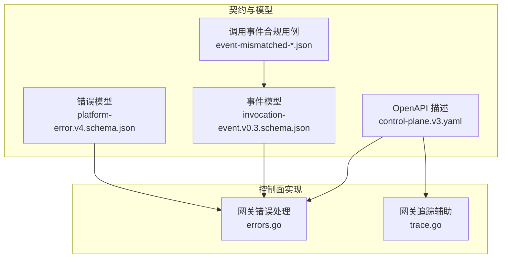
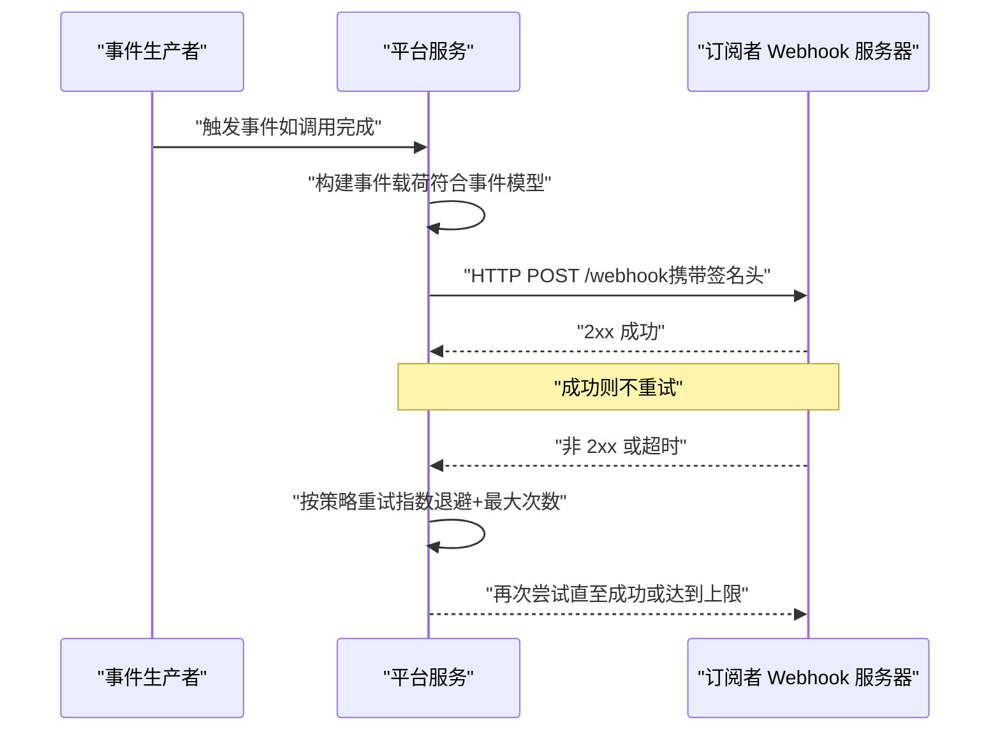
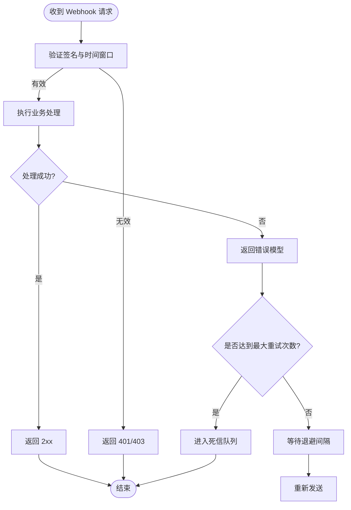
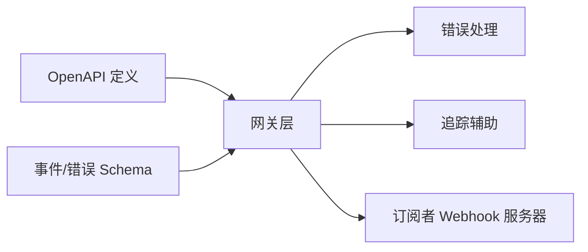

# Webhook 接口

<cite>
**本文引用的文件**   
- [README.md](file://README.md)
- [contracts/invocation/v1/conformance/event-matching-correlation.json](file://contracts/invocation/v1/conformance/event-matching-correlation.json)
- [contracts/invocation/v1/conformance/event-mismatched-invocation-id.json](file://contracts/invocation/v1/conformance/event-mismatched-invocation-id.json)
- [contracts/invocation/v1/conformance/event-mismatched-root-task-id.json](file://contracts/invocation/v1/conformance/event-mismatched-root-task-id.json)
- [contracts/invocation/v1/conformance/event-mismatched-trace-id.json](file://contracts/invocation/v1/conformance/event-mismatched-trace-id.json)
- [contracts/schemas/invocation-event.v0.3.schema.json](file://contracts/schemas/invocation-event.v0.3.schema.json)
- [contracts/schemas/platform-error.v4.schema.json](file://contracts/schemas/platform-error.v4.schema.json)
- [contracts/openapi/control-plane.v3.yaml](file://contracts/openapi/control-plane.v3.yaml)
- [apps/control-plane/internal/gateway/errors.go](file://apps/control-plane/internal/gateway/errors.go)
- [apps/control-plane/internal/gateway/trace.go](file://apps/control-plane/internal/gateway/trace.go)
</cite>

## 目录
1. [简介](#简介)
2. [项目结构](#项目结构)
3. [核心组件](#核心组件)
4. [架构总览](#架构总览)
5. [详细组件分析](#详细组件分析)
6. [依赖分析](#依赖分析)
7. [性能考虑](#性能考虑)
8. [故障排查指南](#故障排查指南)
9. [结论](#结论)
10. [附录](#附录)

## 简介
本文件为 NeKiro 平台的 Webhook 事件通知接口提供权威文档，覆盖以下主题：
- 可订阅的事件类型与语义（代理状态变更、工作空间事件、调用完成通知等）
- Webhook 请求格式、签名验证、重试机制与错误处理
- 事件数据模型定义、字段说明与示例载荷
- Webhook 服务器实现指南（安全验证、幂等性、故障恢复）
- 事件过滤、去重与监控最佳实践

说明：
- 仓库中未包含 Webhook 服务端的具体实现代码。本文基于契约与规范文件进行设计与实现指导，确保与平台现有 API 和事件模型保持一致。
- 若后续在控制面或网关层新增 Webhook 推送逻辑，应遵循本文约定并在 OpenAPI 与 Schema 中同步更新。

## 项目结构
与 Webhook 相关的关键位置：
- contracts/openapi：控制面对外 API 的 OpenAPI 描述，Webhook 注册与管理端点通常在此定义
- contracts/schemas：事件与错误的数据模型 JSON Schema，用于校验 Webhook 载荷
- contracts/invocation/v1/conformance：调用生命周期事件的合规用例，体现事件关键字段与匹配规则
- apps/control-plane/internal/gateway：网关层的错误与追踪辅助，便于在 Webhook 发送链路中集成日志与追踪

图表来源
- [contracts/openapi/control-plane.v3.yaml](file://contracts/openapi/control-plane.v3.yaml)
- [contracts/schemas/invocation-event.v0.3.schema.json](file://contracts/schemas/invocation-event.v0.3.schema.json)
- [contracts/schemas/platform-error.v4.schema.json](file://contracts/schemas/platform-error.v4.schema.json)
- [apps/control-plane/internal/gateway/errors.go](file://apps/control-plane/internal/gateway/errors.go)
- [apps/control-plane/internal/gateway/trace.go](file://apps/control-plane/internal/gateway/trace.go)

章节来源
- [README.md](file://README.md)
- [contracts/openapi/control-plane.v3.yaml](file://contracts/openapi/control-plane.v3.yaml)
- [contracts/schemas/invocation-event.v0.3.schema.json](file://contracts/schemas/invocation-event.v0.3.schema.json)
- [contracts/schemas/platform-error.v4.schema.json](file://contracts/schemas/platform-error.v4.schema.json)
- [apps/control-plane/internal/gateway/errors.go](file://apps/control-plane/internal/gateway/errors.go)
- [apps/control-plane/internal/gateway/trace.go](file://apps/control-plane/internal/gateway/trace.go)

## 核心组件
- 事件模型（Schema）：使用 JSON Schema 严格定义事件载荷结构，包括事件标识、关联 ID、时间戳、主体对象与扩展字段等
- 错误模型（Schema）：统一错误响应结构，便于客户端识别与重试策略
- 合规用例：通过一组 JSON 用例约束事件关键字段的匹配规则（如 invocation_id、root_task_id、trace_id），保障下游消费一致性
- 网关辅助：错误与追踪模块可用于 Webhook 发送链路的诊断与排障

章节来源
- [contracts/schemas/invocation-event.v0.3.schema.json](file://contracts/schemas/invocation-event.v0.3.schema.json)
- [contracts/schemas/platform-error.v4.schema.json](file://contracts/schemas/platform-error.v4.schema.json)
- [contracts/invocation/v1/conformance/event-matching-correlation.json](file://contracts/invocation/v1/conformance/event-matching-correlation.json)
- [contracts/invocation/v1/conformance/event-mismatched-invocation-id.json](file://contracts/invocation/v1/conformance/event-mismatched-invocation-id.json)
- [contracts/invocation/v1/conformance/event-mismatched-root-task-id.json](file://contracts/invocation/v1/conformance/event-mismatched-root-task-id.json)
- [contracts/invocation/v1/conformance/event-mismatched-trace-id.json](file://contracts/invocation/v1/conformance/event-mismatched-trace-id.json)
- [apps/control-plane/internal/gateway/errors.go](file://apps/control-plane/internal/gateway/errors.go)
- [apps/control-plane/internal/gateway/trace.go](file://apps/control-plane/internal/gateway/trace.go)

## 架构总览
Webhook 推送的整体流程（概念性）：
- 事件产生：平台内部在关键业务节点生成事件（例如调用生命周期事件）
- 事件序列化：按事件模型 Schema 构造 JSON 载荷，并附加必要元信息（如事件 ID、时间戳、签名）
- 投递与重试：向订阅者注册的回调地址发起 HTTP 请求；根据响应码与错误模型执行退避重试
- 幂等与去重：消费者侧依据事件唯一标识进行幂等处理，避免重复处理
- 观测与排障：结合网关追踪与错误模型记录链路信息与失败原因

[此图为概念性流程图，无需图表来源]

## 详细组件分析

### 事件类型与语义
- 调用生命周期事件
  - 典型场景：任务创建、进行中、完成、失败、取消等
  - 关键字段：invocation_id、root_task_id、trace_id、status、timestamp 等
  - 参考合规用例以理解字段匹配与约束
- 代理状态变更事件
  - 典型场景：代理上线、下线、健康状态变化
  - 关键字段：agent_id、state、reason、updated_at 等
- 工作空间事件
  - 典型场景：工作空间创建、删除、配置变更
  - 关键字段：workspace_id、action、metadata 等

说明：
- 具体字段与枚举值以对应 JSON Schema 为准
- 合规用例展示了不同事件之间的关联关系与匹配规则

章节来源
- [contracts/schemas/invocation-event.v0.3.schema.json](file://contracts/schemas/invocation-event.v0.3.schema.json)
- [contracts/invocation/v1/conformance/event-matching-correlation.json](file://contracts/invocation/v1/conformance/event-matching-correlation.json)
- [contracts/invocation/v1/conformance/event-mismatched-invocation-id.json](file://contracts/invocation/v1/conformance/event-mismatched-invocation-id.json)
- [contracts/invocation/v1/conformance/event-mismatched-root-task-id.json](file://contracts/invocation/v1/conformance/event-mismatched-root-task-id.json)
- [contracts/invocation/v1/conformance/event-mismatched-trace-id.json](file://contracts/invocation/v1/conformance/event-mismatched-trace-id.json)

### Webhook 请求格式
- 传输协议：HTTPS（推荐）
- 方法：POST
- Content-Type：application/json
- 必需头部：
  - X-NeKiro-Signature：HMAC 签名摘要（详见“签名验证”）
  - X-NeKiro-Event-ID：事件唯一标识（用于幂等与去重）
  - X-NeKiro-Timestamp：事件发生时间戳（ISO 8601）
  - X-NeKiro-Event-Type：事件类型标识
- 可选头部：
  - X-NeKiro-Retry-Count：当前重试次数
  - X-NeKiro-Trace-ID：分布式追踪 ID（便于跨系统定位）
- 载荷：JSON 对象，遵循事件模型 Schema

注意：
- 所有时间字段采用 ISO 8601 格式
- 事件 ID 全局唯一且不可变

章节来源
- [contracts/schemas/invocation-event.v0.3.schema.json](file://contracts/schemas/invocation-event.v0.3.schema.json)
- [contracts/openapi/control-plane.v3.yaml](file://contracts/openapi/control-plane.v3.yaml)

### 签名验证
- 算法：HMAC-SHA256
- 输入：
  - 明文：X-NeKiro-Timestamp + "\n" + 请求体原始字节
  - 密钥：订阅时由平台下发的 Secret
- 计算：对明文执行 HMAC-SHA256，输出十六进制小写字符串
- 比对：将计算结果与 X-NeKiro-Signature 逐字符比较（防时序攻击）
- 时间窗口：拒绝超过允许时间窗口的请求（建议 5 分钟）

安全建议：
- 使用恒定时间比较函数
- 仅接受 HTTPS
- 定期轮换 Secret 并支持多版本兼容

章节来源
- [contracts/openapi/control-plane.v3.yaml](file://contracts/openapi/control-plane.v3.yaml)

### 重试机制与错误处理
- 成功判定：返回 2xx 即视为成功
- 失败判定：非 2xx 或网络超时视为失败
- 重试策略：
  - 指数退避：初始间隔 1s，最大间隔 60s，抖动范围 ±20%
  - 最大重试次数：建议 5 次
  - 死信队列：达到上限后进入死信队列，供人工干预
- 错误模型：
  - 使用平台错误模型统一描述错误原因与分类
  - 建议在日志中记录 Trace-ID 与事件 ID，便于追踪

章节来源
- [contracts/schemas/platform-error.v4.schema.json](file://contracts/schemas/platform-error.v4.schema.json)
- [apps/control-plane/internal/gateway/errors.go](file://apps/control-plane/internal/gateway/errors.go)

### 幂等性与去重
- 幂等键：使用 X-NeKiro-Event-ID 作为幂等键
- 存储策略：
  - 内存缓存：短期（如 5 分钟）去重
  - 持久化存储：长期（如 7 天）去重，防止跨进程重启丢失
- 处理顺序：先查已处理标记，再执行业务逻辑，最后写入已处理记录
- 并发控制：同一事件 ID 的请求串行化处理

章节来源
- [contracts/schemas/invocation-event.v0.3.schema.json](file://contracts/schemas/invocation-event.v0.3.schema.json)

### 监控与观测
- 指标：
  - 接收总量、成功量、失败量、重试次数分布、平均延迟、P99 延迟
  - 签名验证失败率、时间窗口过期率
- 日志：
  - 记录事件 ID、类型、Trace-ID、签名验证结果、处理耗时、错误码
- 告警：
  - 失败率阈值、重试次数异常、死信队列积压

章节来源
- [apps/control-plane/internal/gateway/trace.go](file://apps/control-plane/internal/gateway/trace.go)

## 依赖分析
- 契约依赖：
  - OpenAPI 定义驱动 Webhook 管理端点与鉴权策略
  - JSON Schema 驱动载荷校验与兼容性治理
- 运行时依赖：
  - 网关错误与追踪模块用于统一错误表达与链路追踪
- 外部依赖：
  - 订阅者的 Webhook 服务器需具备高可用与可扩展能力

图表来源
- [contracts/openapi/control-plane.v3.yaml](file://contracts/openapi/control-plane.v3.yaml)
- [contracts/schemas/invocation-event.v0.3.schema.json](file://contracts/schemas/invocation-event.v0.3.schema.json)
- [contracts/schemas/platform-error.v4.schema.json](file://contracts/schemas/platform-error.v4.schema.json)
- [apps/control-plane/internal/gateway/errors.go](file://apps/control-plane/internal/gateway/errors.go)
- [apps/control-plane/internal/gateway/trace.go](file://apps/control-plane/internal/gateway/trace.go)

章节来源
- [contracts/openapi/control-plane.v3.yaml](file://contracts/openapi/control-plane.v3.yaml)
- [contracts/schemas/invocation-event.v0.3.schema.json](file://contracts/schemas/invocation-event.v0.3.schema.json)
- [contracts/schemas/platform-error.v4.schema.json](file://contracts/schemas/platform-error.v4.schema.json)
- [apps/control-plane/internal/gateway/errors.go](file://apps/control-plane/internal/gateway/errors.go)
- [apps/control-plane/internal/gateway/trace.go](file://apps/control-plane/internal/gateway/trace.go)

## 性能考虑
- 批量与异步：
  - 事件生产侧采用异步队列缓冲，削峰填谷
  - 消费侧并行处理不同事件类型，但同一事件 ID 串行
- 连接池与超时：
  - 合理设置连接池大小、读写超时与重试间隔
- 压缩与分片：
  - 大负载启用 gzip 压缩
  - 超大事件拆分为多个子事件，保证单条不超过限制
- 存储优化：
  - 去重表按事件 ID 分区，定期清理过期记录

[本节为通用指导，无需章节来源]

## 故障排查指南
- 常见问题：
  - 签名验证失败：检查 Secret、时间窗口、请求体是否被篡改
  - 超时或连接失败：检查网络连通性、目标服务可用性
  - 重复处理：确认幂等键是否正确、去重存储是否持久化
- 定位手段：
  - 使用 Trace-ID 串联全链路日志
  - 核对事件 ID 与类型，对照合规用例验证字段完整性
  - 查看错误模型中的错误码与消息，快速定位根因

章节来源
- [apps/control-plane/internal/gateway/errors.go](file://apps/control-plane/internal/gateway/errors.go)
- [apps/control-plane/internal/gateway/trace.go](file://apps/control-plane/internal/gateway/trace.go)

## 结论
本文基于平台契约与模型，给出了 Webhook 事件通知接口的完整设计要点与实现指南。通过严格的签名验证、幂等去重、合理的重试策略与完善的观测体系，可确保事件可靠、安全地送达订阅者。建议在平台侧持续完善 OpenAPI 与 Schema，并在订阅者侧建立健壮的消费能力与监控告警。

[本节为总结性内容，无需章节来源]

## 附录

### 事件数据模型与字段说明
- 事件基础字段：
  - event_id：事件唯一标识
  - event_type：事件类型
  - timestamp：事件时间戳（ISO 8601）
  - trace_id：分布式追踪 ID
- 调用相关字段（示例）：
  - invocation_id：调用实例 ID
  - root_task_id：根任务 ID
  - status：调用状态（如 created、running、completed、failed、cancelled）
  - result：结果摘要或引用
- 扩展字段：
  - metadata：自定义键值对，用于附加上下文

说明：
- 具体字段名、类型与约束以 JSON Schema 为准
- 合规用例展示了字段间的匹配与一致性要求

章节来源
- [contracts/schemas/invocation-event.v0.3.schema.json](file://contracts/schemas/invocation-event.v0.3.schema.json)
- [contracts/invocation/v1/conformance/event-matching-correlation.json](file://contracts/invocation/v1/conformance/event-matching-correlation.json)
- [contracts/invocation/v1/conformance/event-mismatched-invocation-id.json](file://contracts/invocation/v1/conformance/event-mismatched-invocation-id.json)
- [contracts/invocation/v1/conformance/event-mismatched-root-task-id.json](file://contracts/invocation/v1/conformance/event-mismatched-root-task-id.json)
- [contracts/invocation/v1/conformance/event-mismatched-trace-id.json](file://contracts/invocation/v1/conformance/event-mismatched-trace-id.json)

### 示例载荷（示意）
- 成功事件载荷（示意）：
  - 包含 event_id、event_type、timestamp、trace_id、invocation_id、root_task_id、status 等字段
- 错误事件载荷（示意）：
  - 包含错误码、错误消息、相关上下文与追踪 ID

说明：
- 实际字段结构与取值范围以 Schema 与合规用例为准

章节来源
- [contracts/schemas/invocation-event.v0.3.schema.json](file://contracts/schemas/invocation-event.v0.3.schema.json)
- [contracts/schemas/platform-error.v4.schema.json](file://contracts/schemas/platform-error.v4.schema.json)

### Webhook 服务器实现清单
- 安全验证
  - 校验签名与时间窗口
  - 仅接受 HTTPS
- 幂等与去重
  - 基于事件 ID 的去重存储
  - 串行化处理同一事件 ID
- 错误处理与重试
  - 返回 2xx 表示成功
  - 记录错误模型与 Trace-ID
- 监控与告警
  - 采集关键指标与日志
  - 设置阈值告警
- 运维与回滚
  - 支持灰度发布与快速回滚
  - 定期演练故障恢复

[本节为通用指导，无需章节来源]