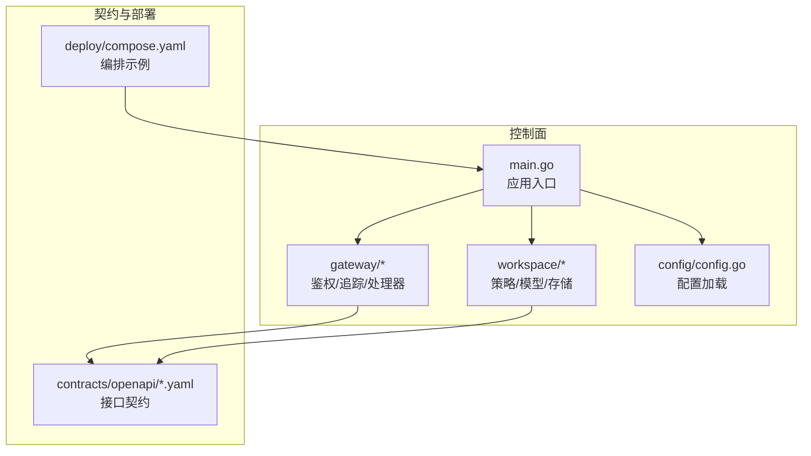
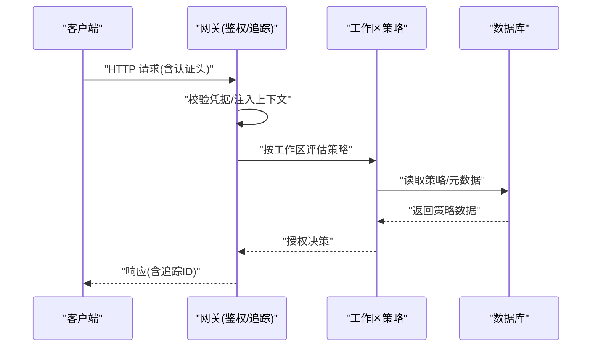
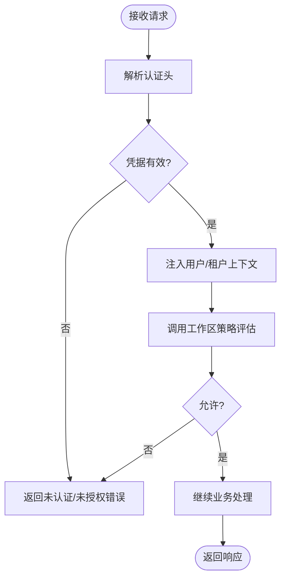
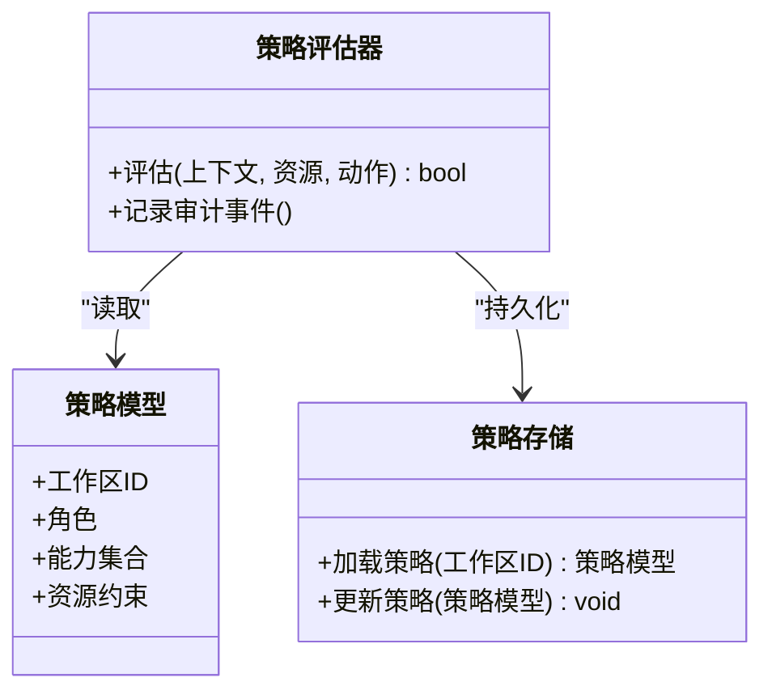
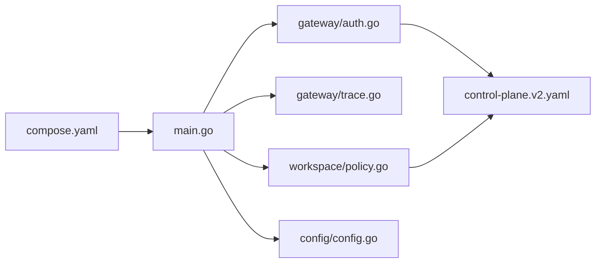

# 安全合规

<cite>
**本文引用的文件**   
- [apps/control-plane/cmd/control-plane/main.go](file://apps/control-plane/cmd/control-plane/main.go)
- [apps/control-plane/internal/gateway/auth.go](file://apps/control-plane/internal/gateway/auth.go)
- [apps/control-plane/internal/gateway/trace.go](file://apps/control-plane/internal/gateway/trace.go)
- [apps/control-plane/internal/config/config.go](file://apps/control-plane/internal/config/config.go)
- [apps/control-plane/internal/workspace/policy.go](file://apps/control-plane/internal/workspace/policy.go)
- [contracts/openapi/control-plane.v2.yaml](file://contracts/openapi/control-plane.v2.yaml)
- [contracts/openapi/router-internal.v3.yaml](file://contracts/openapi/router-internal.v3.yaml)
- [deploy/compose.yaml](file://deploy/compose.yaml)
</cite>

## 目录
1. [简介](#简介)
2. [项目结构](#项目结构)
3. [核心组件](#核心组件)
4. [架构总览](#架构总览)
5. [详细组件分析](#详细组件分析)
6. [依赖分析](#依赖分析)
7. [性能考虑](#性能考虑)
8. [故障排查指南](#故障排查指南)
9. [结论](#结论)
10. [附录](#附录)

## 简介
本文件为 NeKiro 平台的安全与合规文档，聚焦认证授权、访问控制与权限管理、数据安全（传输与存储）、网络安全配置、审计日志与合规报告、威胁分析与防护、最佳实践与安全审计，以及多租户环境下的安全隔离。内容基于仓库中控制面网关、工作区策略、OpenAPI 契约与部署编排等实现进行梳理，旨在为安全团队提供可落地的实施与维护指南。

## 项目结构
NeKiro 的控制面服务位于 apps/control-plane，其入口程序负责启动 HTTP 服务并挂载网关中间件；网关层承担鉴权、追踪与路由职责；工作区模块包含策略与持久化；contracts 定义对外与内部接口契约；deploy 提供容器编排示例。

图表来源
- [apps/control-plane/cmd/control-plane/main.go](file://apps/control-plane/cmd/control-plane/main.go)
- [apps/control-plane/internal/gateway/auth.go](file://apps/control-plane/internal/gateway/auth.go)
- [apps/control-plane/internal/workspace/policy.go](file://apps/control-plane/internal/workspace/policy.go)
- [apps/control-plane/internal/config/config.go](file://apps/control-plane/internal/config/config.go)
- [contracts/openapi/control-plane.v2.yaml](file://contracts/openapi/control-plane.v2.yaml)
- [deploy/compose.yaml](file://deploy/compose.yaml)

章节来源
- [apps/control-plane/cmd/control-plane/main.go](file://apps/control-plane/cmd/control-plane/main.go)
- [apps/control-plane/internal/gateway/auth.go](file://apps/control-plane/internal/gateway/auth.go)
- [apps/control-plane/internal/workspace/policy.go](file://apps/control-plane/internal/workspace/policy.go)
- [apps/control-plane/internal/config/config.go](file://apps/control-plane/internal/config/config.go)
- [contracts/openapi/control-plane.v2.yaml](file://contracts/openapi/control-plane.v2.yaml)
- [deploy/compose.yaml](file://deploy/compose.yaml)

## 核心组件
- 认证与授权网关：在请求进入业务处理前完成身份校验与上下文注入，确保后续处理具备可信主体信息。
- 工作区策略：围绕工作区维度实施资源访问控制，结合策略模型决定允许或拒绝操作。
- 配置中心：集中加载运行时安全相关参数（如 TLS、超时、限流、日志级别等）。
- 接口契约：通过 OpenAPI 明确认证头、错误码与数据格式，保障跨服务一致性与可验证性。
- 部署编排：以 compose 示例展示网络暴露、端口映射与环境变量注入方式，便于安全基线落地。

章节来源
- [apps/control-plane/internal/gateway/auth.go](file://apps/control-plane/internal/gateway/auth.go)
- [apps/control-plane/internal/workspace/policy.go](file://apps/control-plane/internal/workspace/policy.go)
- [apps/control-plane/internal/config/config.go](file://apps/control-plane/internal/config/config.go)
- [contracts/openapi/control-plane.v2.yaml](file://contracts/openapi/control-plane.v2.yaml)
- [deploy/compose.yaml](file://deploy/compose.yaml)

## 架构总览
下图展示了从客户端到控制面的关键安全路径：客户端携带凭据发起请求，网关进行鉴权与追踪，随后调用工作区策略与后端存储，返回结果时附带审计与追踪信息。

图表来源
- [apps/control-plane/internal/gateway/auth.go](file://apps/control-plane/internal/gateway/auth.go)
- [apps/control-plane/internal/workspace/policy.go](file://apps/control-plane/internal/workspace/policy.go)
- [contracts/openapi/control-plane.v2.yaml](file://contracts/openapi/control-plane.v2.yaml)

## 详细组件分析

### 认证与授权机制
- 认证流程
  - 客户端在请求头中携带认证凭据（例如令牌或会话标识），由网关统一解析与校验。
  - 校验通过后，将用户/租户上下文注入到请求上下文中，供后续处理器使用。
- 授权流程
  - 网关根据目标资源与工作区上下文，调用工作区策略模块进行访问控制决策。
  - 策略模块依据策略模型与持久化数据判定允许或拒绝，并在必要时记录审计事件。
- 错误与边界
  - 对缺失凭据、无效凭据、越权访问等情况返回标准错误码，避免泄露敏感细节。
  - 对并发与超时场景进行保护，防止重放与资源耗尽。

图表来源
- [apps/control-plane/internal/gateway/auth.go](file://apps/control-plane/internal/gateway/auth.go)
- [apps/control-plane/internal/workspace/policy.go](file://apps/control-plane/internal/workspace/policy.go)

章节来源
- [apps/control-plane/internal/gateway/auth.go](file://apps/control-plane/internal/gateway/auth.go)
- [apps/control-plane/internal/workspace/policy.go](file://apps/control-plane/internal/workspace/policy.go)

### 访问控制与权限管理
- 策略模型
  - 以工作区为边界，定义角色/能力与资源的映射关系，支持细粒度授权。
- 策略评估
  - 在每次请求时基于当前上下文（用户、租户、资源、动作）进行动态评估。
- 策略持久化
  - 策略与元数据持久化至数据库，变更需遵循版本与迁移规范，保证一致性。
- 最小权限原则
  - 默认拒绝，按需授予；定期审查与回收冗余权限。

图表来源
- [apps/control-plane/internal/workspace/policy.go](file://apps/control-plane/internal/workspace/policy.go)

章节来源
- [apps/control-plane/internal/workspace/policy.go](file://apps/control-plane/internal/workspace/policy.go)

### 数据安全策略（传输与存储）
- 传输安全
  - 建议强制 HTTPS/TLS，禁用弱加密套件，启用 HSTS 与证书固定（视部署环境而定）。
  - 网关应校验上游与下游连接的安全性，避免明文回源。
- 存储安全
  - 敏感字段（如密钥、令牌）应加密存储，采用强算法与独立密钥管理。
  - 数据库访问使用最小权限账号，开启审计日志与慢查询监控。
- 输入输出校验
  - 对所有外部输入进行严格校验与白名单过滤，防止注入与越界。
  - 输出脱敏，避免泄露敏感信息。

章节来源
- [apps/control-plane/internal/config/config.go](file://apps/control-plane/internal/config/config.go)
- [contracts/openapi/control-plane.v2.yaml](file://contracts/openapi/control-plane.v2.yaml)

### 网络安全配置与入侵检测
- 网络边界
  - 仅暴露必要端口，限制来源 IP 段，使用反向代理与 WAF 前置。
- 防火墙规则
  - 入站仅放行受控流量，出站限制到必要域名/IP，阻断扫描与探测。
- 入侵检测
  - 在网关层集成速率限制、异常模式识别与告警，联动 SIEM/SOAR。
- 容器与编排
  - 使用只读根文件系统、非 root 运行、最小镜像、健康检查与重启策略。

章节来源
- [deploy/compose.yaml](file://deploy/compose.yaml)
- [contracts/openapi/router-internal.v3.yaml](file://contracts/openapi/router-internal.v3.yaml)

### 审计日志与合规报告
- 审计范围
  - 认证失败、授权拒绝、策略变更、敏感数据访问、系统配置修改等。
- 日志要求
  - 结构化、不可篡改、保留周期满足合规要求，包含时间戳、主体、资源、动作、结果与追踪 ID。
- 合规报告
  - 定期生成访问与变更报表，支持导出与第三方审计工具对接。
- 追踪与关联
  - 全链路追踪 ID 贯穿请求生命周期，便于问题定位与取证。

章节来源
- [apps/control-plane/internal/gateway/trace.go](file://apps/control-plane/internal/gateway/trace.go)
- [contracts/openapi/control-plane.v2.yaml](file://contracts/openapi/control-plane.v2.yaml)

### 多租户安全隔离
- 租户与工作区
  - 以工作区作为隔离单元，所有资源访问均绑定工作区上下文。
- 数据隔离
  - 数据库层面按工作区分库/分表或行级权限控制，禁止跨区访问。
- 策略隔离
  - 策略与元数据按工作区隔离，避免横向越权。
- 审计与追踪
  - 审计日志必须包含租户与工作区标识，支持按租户检索与导出。

章节来源
- [apps/control-plane/internal/workspace/policy.go](file://apps/control-plane/internal/workspace/policy.go)
- [contracts/openapi/control-plane.v2.yaml](file://contracts/openapi/control-plane.v2.yaml)

### 安全威胁分析与防护措施
- 常见威胁
  - 凭证泄露、越权访问、注入攻击、重放与暴力破解、供应链风险、配置漂移。
- 防护措施
  - 强化认证（多因素、短期令牌、刷新轮换）、最小权限、输入校验、速率限制、签名与防重放、依赖漏洞扫描与镜像加固、配置基线与变更管控。
- 持续监测
  - 建立指标与告警阈值，覆盖认证失败率、授权拒绝率、异常延迟与错误分布。

[本节为通用安全指导，不直接分析具体文件]

### 安全配置最佳实践
- 启用并强制 TLS，禁用旧版协议与弱套件。
- 设置合理的超时、重试与熔断策略。
- 使用环境变量与密钥管理服务注入敏感配置，避免硬编码。
- 开启详细但脱敏的日志，集中收集与分析。
- 定期进行渗透测试与依赖漏洞扫描。

章节来源
- [apps/control-plane/internal/config/config.go](file://apps/control-plane/internal/config/config.go)
- [deploy/compose.yaml](file://deploy/compose.yaml)

### 安全审计指南
- 审计清单
  - 认证与授权、策略与权限变更、敏感数据访问、系统配置与部署变更。
- 采集与留存
  - 统一日志格式、时间同步、完整性校验与归档策略。
- 分析与响应
  - 建立告警规则、工单流转与处置闭环，定期复盘与演练。

章节来源
- [apps/control-plane/internal/gateway/trace.go](file://apps/control-plane/internal/gateway/trace.go)
- [contracts/openapi/control-plane.v2.yaml](file://contracts/openapi/control-plane.v2.yaml)

## 依赖分析
控制面入口依赖网关鉴权与追踪、工作区策略与配置模块；对外接口契约由 OpenAPI 定义；部署编排通过 compose 注入环境变量与网络拓扑。

图表来源
- [apps/control-plane/cmd/control-plane/main.go](file://apps/control-plane/cmd/control-plane/main.go)
- [apps/control-plane/internal/gateway/auth.go](file://apps/control-plane/internal/gateway/auth.go)
- [apps/control-plane/internal/gateway/trace.go](file://apps/control-plane/internal/gateway/trace.go)
- [apps/control-plane/internal/workspace/policy.go](file://apps/control-plane/internal/workspace/policy.go)
- [apps/control-plane/internal/config/config.go](file://apps/control-plane/internal/config/config.go)
- [contracts/openapi/control-plane.v2.yaml](file://contracts/openapi/control-plane.v2.yaml)
- [deploy/compose.yaml](file://deploy/compose.yaml)

章节来源
- [apps/control-plane/cmd/control-plane/main.go](file://apps/control-plane/cmd/control-plane/main.go)
- [apps/control-plane/internal/gateway/auth.go](file://apps/control-plane/internal/gateway/auth.go)
- [apps/control-plane/internal/gateway/trace.go](file://apps/control-plane/internal/gateway/trace.go)
- [apps/control-plane/internal/workspace/policy.go](file://apps/control-plane/internal/workspace/policy.go)
- [apps/control-plane/internal/config/config.go](file://apps/control-plane/internal/config/config.go)
- [contracts/openapi/control-plane.v2.yaml](file://contracts/openapi/control-plane.v2.yaml)
- [deploy/compose.yaml](file://deploy/compose.yaml)

## 性能考虑
- 鉴权与策略评估应尽量缓存热点数据，减少数据库往返。
- 合理设置超时与并发上限，避免雪崩效应。
- 审计日志异步写入，避免阻塞主流程。
- 对高频接口启用速率限制与降级策略。

[本节为通用性能指导，不直接分析具体文件]

## 故障排查指南
- 认证失败
  - 检查请求头是否携带正确凭据，确认网关校验逻辑与上游认证服务连通性。
- 授权拒绝
  - 核对工作区上下文与策略配置，确认资源与动作是否在授权范围内。
- 追踪与日志
  - 使用追踪 ID 串联日志，定位失败点与耗时瓶颈。
- 配置问题
  - 对照配置项与环境变量，确认 TLS、超时、日志级别等是否正确注入。

章节来源
- [apps/control-plane/internal/gateway/auth.go](file://apps/control-plane/internal/gateway/auth.go)
- [apps/control-plane/internal/gateway/trace.go](file://apps/control-plane/internal/gateway/trace.go)
- [apps/control-plane/internal/config/config.go](file://apps/control-plane/internal/config/config.go)

## 结论
NeKiro 控制面通过网关鉴权、工作区策略与 OpenAPI 契约构建了较为完整的安全基础。建议在现有基础上进一步强化传输与存储加密、完善审计与合规报告、细化多租户隔离与入侵检测，并通过持续安全测试与基线核查确保安全能力随版本演进稳步提升。

[本节为总结性内容，不直接分析具体文件]

## 附录
- 术语
  - 工作区：多租户隔离的最小单位，承载资源与策略。
  - 策略：描述“谁在什么条件下可以对哪些资源执行何种操作”的规则集合。
  - 追踪 ID：贯穿请求生命周期的唯一标识，用于审计与排障。
- 参考
  - 接口契约：见 contracts/openapi 目录。
  - 部署示例：见 deploy/compose.yaml。

[本节为补充说明，不直接分析具体文件]