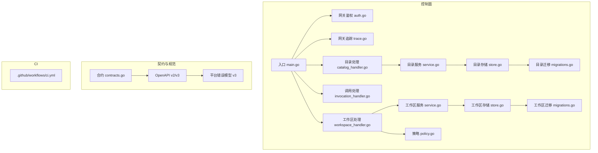
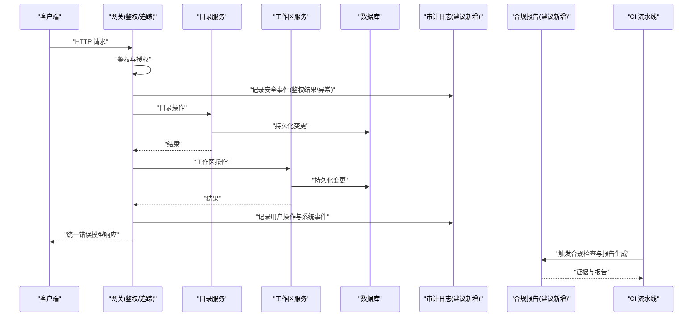
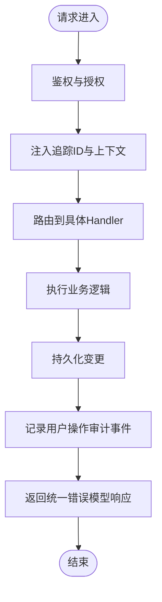
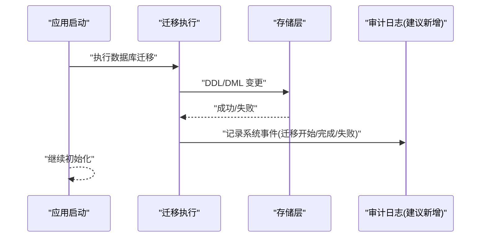
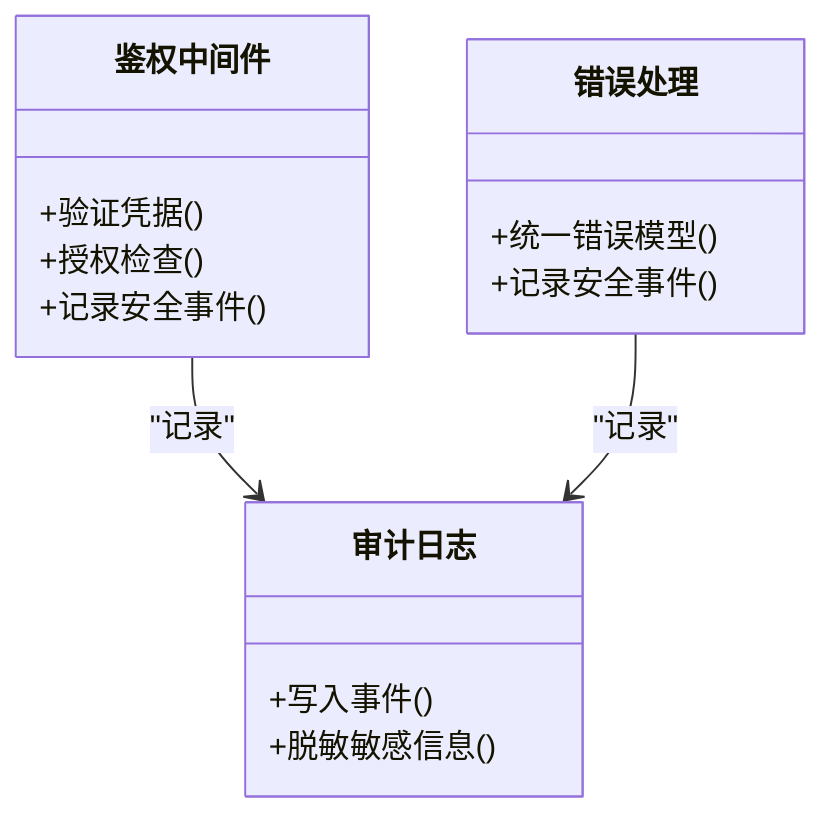
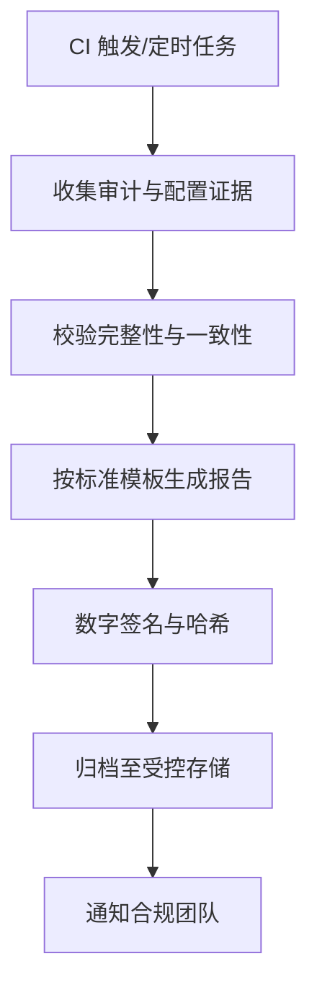
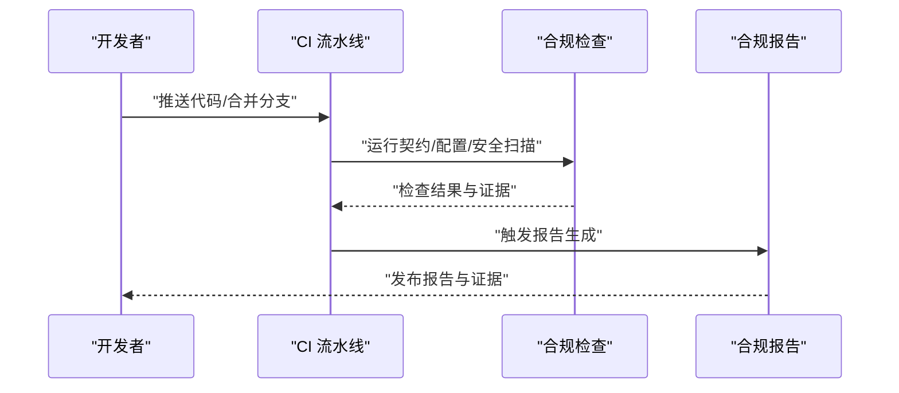
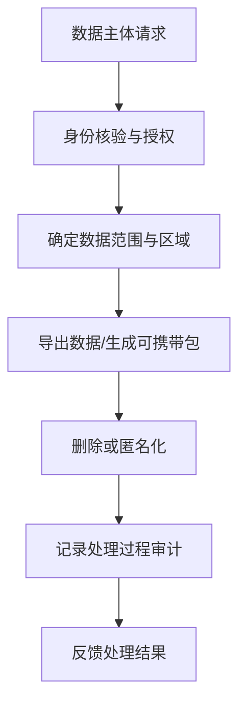
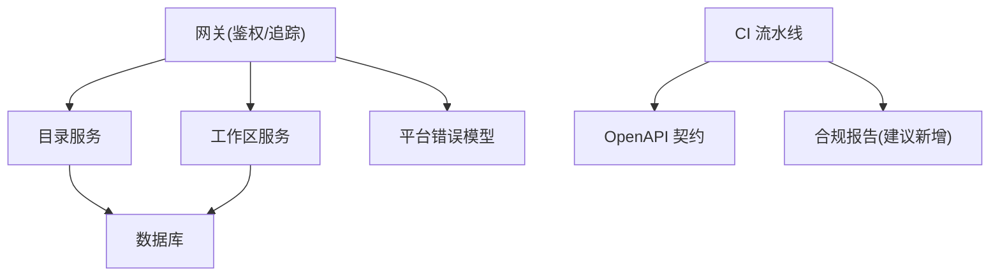

# 审计与合规

<cite>
**本文引用的文件**   
- [README.md](file://README.md)
- [main.go](file://apps/control-plane/cmd/control-plane/main.go)
- [config.go](file://apps/control-plane/internal/config/config.go)
- [auth.go](file://apps/control-plane/internal/gateway/auth.go)
- [trace.go](file://apps/control-plane/internal/gateway/trace.go)
- [catalog_handler.go](file://apps/control-plane/internal/gateway/catalog_handler.go)
- [invocation_handler.go](file://apps/control-plane/internal/gateway/invocation_handler.go)
- [workspace_handler.go](file://apps/control-plane/internal/gateway/workspace_handler.go)
- [service.go](file://apps/control-plane/internal/catalog/service.go)
- [store.go](file://apps/control-plane/internal/catalog/store.go)
- [migrations.go](file://apps/control-plane/internal/catalog/postgres/migrations.go)
- [service.go](file://apps/control-plane/internal/workspace/service.go)
- [store.go](file://apps/control-plane/internal/workspace/store.go)
- [migrations.go](file://apps/control-plane/internal/workspace/postgres/migrations.go)
- [policy.go](file://apps/control-plane/internal/workspace/policy.go)
- [contracts.go](file://contracts/contracts.go)
- [control-plane.v2.yaml](file://contracts/openapi/control-plane.v2.yaml)
- [control-plane.v3.yaml](file://contracts/openapi/control-plane.v3.yaml)
- [platform-error.v3.yaml](file://contracts/schemas/platform-error.v3.yaml)
- [ci.yml](file://.github/workflows/ci.yml)
</cite>

## 目录
1. [简介](#简介)
2. [项目结构](#项目结构)
3. [核心组件](#核心组件)
4. [架构总览](#架构总览)
5. [详细组件分析](#详细组件分析)
6. [依赖分析](#依赖分析)
7. [性能考虑](#性能考虑)
8. [故障排查指南](#故障排查指南)
9. [结论](#结论)
10. [附录](#附录)

## 简介
本文件为 NeKiro 平台的审计与合规管理文档，聚焦以下目标：
- 完整审计日志体系：用户操作审计、系统事件审计、安全事件审计
- 合规报告自动生成机制：支持 GDPR、SOC2、ISO27001 等标准
- 数据保留策略与日志归档管理
- 合规性检查自动化流程与持续合规监控
- 隐私数据处理合规要求与数据主体权利响应机制
- 第三方安全评估与渗透测试流程
- 合规基线配置与审计报告模板
- 跨地域数据合规性与数据主权问题解决方案

说明：当前仓库未包含专门的“审计日志”或“合规报告生成”模块实现。本文基于现有网关鉴权、追踪、OpenAPI 契约、错误模型、CI 流水线以及数据库迁移等能力，给出可落地的审计与合规方案设计与落地路径，并标注对应源码位置以便后续扩展实现。

## 项目结构
NeKiro 控制面采用 Go 后端，核心入口位于 control-plane 应用，提供网关层（认证、路由、编排）、目录服务与工作区管理等子系统；对外 API 通过 OpenAPI 契约定义，错误模型统一在 schemas 中维护；CI 流水线用于构建与测试。

图示来源
- [main.go:1-200](file://apps/control-plane/cmd/control-plane/main.go#L1-200)
- [auth.go:1-200](file://apps/control-plane/internal/gateway/auth.go#L1-200)
- [trace.go:1-200](file://apps/control-plane/internal/gateway/trace.go#L1-200)
- [catalog_handler.go:1-200](file://apps/control-plane/internal/gateway/catalog_handler.go#L1-200)
- [invocation_handler.go:1-200](file://apps/control-plane/internal/gateway/invocation_handler.go#L1-200)
- [workspace_handler.go:1-200](file://apps/control-plane/internal/gateway/workspace_handler.go#L1-200)
- [service.go](file://apps/control-plane/internal/catalog/service.go)
- [store.go](file://apps/control-plane/internal/catalog/store.go)
- [migrations.go](file://apps/control-plane/internal/catalog/postgres/migrations.go)
- [service.go](file://apps/control-plane/internal/workspace/service.go)
- [store.go](file://apps/control-plane/internal/workspace/store.go)
- [migrations.go](file://apps/control-plane/internal/workspace/postgres/migrations.go)
- [policy.go](file://apps/control-plane/internal/workspace/policy.go)
- [contracts.go](file://contracts/contracts.go)
- [control-plane.v2.yaml](file://contracts/openapi/control-plane.v2.yaml)
- [control-plane.v3.yaml](file://contracts/openapi/control-plane.v3.yaml)
- [platform-error.v3.yaml](file://contracts/schemas/platform-error.v3.yaml)
- [ci.yml](file://.github/workflows/ci.yml)

章节来源
- [README.md](file://README.md)
- [main.go:1-200](file://apps/control-plane/cmd/control-plane/main.go#L1-200)
- [contracts.go:1-200](file://contracts/contracts.go#L1-200)
- [ci.yml:1-200](file://.github/workflows/ci.yml#L1-200)

## 核心组件
- 网关鉴权与访问控制：负责身份验证、权限校验与安全上下文注入，是安全事件审计的关键采集点。
- 网关追踪：为请求链路提供追踪标识与上下文传播，便于关联审计日志与分布式追踪。
- 目录与工作区服务：承载业务变更与状态流转，是用户操作审计与系统事件审计的数据源。
- 错误模型与契约：统一的错误返回结构与 API 契约，有助于标准化审计字段与合规证据收集。
- CI 流水线：作为合规检查自动化流程的触发器与证据产出环节。

章节来源
- [auth.go:1-200](file://apps/control-plane/internal/gateway/auth.go#L1-200)
- [trace.go:1-200](file://apps/control-plane/internal/gateway/trace.go#L1-200)
- [catalog_handler.go:1-200](file://apps/control-plane/internal/gateway/catalog_handler.go#L1-200)
- [invocation_handler.go:1-200](file://apps/control-plane/internal/gateway/invocation_handler.go#L1-200)
- [workspace_handler.go:1-200](file://apps/control-plane/internal/gateway/workspace_handler.go#L1-200)
- [platform-error.v3.yaml](file://contracts/schemas/platform-error.v3.yaml)
- [control-plane.v2.yaml](file://contracts/openapi/control-plane.v2.yaml)
- [control-plane.v3.yaml](file://contracts/openapi/control-plane.v3.yaml)
- [ci.yml:1-200](file://.github/workflows/ci.yml#L1-200)

## 架构总览
下图展示审计与合规相关的关键交互：网关层进行鉴权与追踪，业务服务记录变更，错误模型统一输出，CI 触发合规检查与报告生成。

图示来源
- [auth.go:1-200](file://apps/control-plane/internal/gateway/auth.go#L1-200)
- [trace.go:1-200](file://apps/control-plane/internal/gateway/trace.go#L1-200)
- [catalog_handler.go:1-200](file://apps/control-plane/internal/gateway/catalog_handler.go#L1-200)
- [invocation_handler.go:1-200](file://apps/control-plane/internal/gateway/invocation_handler.go#L1-200)
- [workspace_handler.go:1-200](file://apps/control-plane/internal/gateway/workspace_handler.go#L1-200)
- [platform-error.v3.yaml](file://contracts/schemas/platform-error.v3.yaml)
- [ci.yml:1-200](file://.github/workflows/ci.yml#L1-200)

## 详细组件分析

### 用户操作审计
- 采集范围：目录创建/更新/删除、工作区生命周期操作、安装与版本绑定等。
- 采集点：各 Handler 进入与退出处，结合鉴权上下文与追踪 ID，形成不可篡改的操作记录。
- 关键字段：操作者标识、时间戳、资源标识、动作类型、结果、IP/UA、追踪 ID、工作区/租户上下文。
- 落地建议：在网关层统一拦截并写入审计日志表或外部日志系统；业务层在关键事务提交后追加二次确认事件。

图示来源
- [catalog_handler.go:1-200](file://apps/control-plane/internal/gateway/catalog_handler.go#L1-200)
- [workspace_handler.go:1-200](file://apps/control-plane/internal/gateway/workspace_handler.go#L1-200)
- [invocation_handler.go:1-200](file://apps/control-plane/internal/gateway/invocation_handler.go#L1-200)
- [trace.go:1-200](file://apps/control-plane/internal/gateway/trace.go#L1-200)
- [platform-error.v3.yaml](file://contracts/schemas/platform-error.v3.yaml)

章节来源
- [catalog_handler.go:1-200](file://apps/control-plane/internal/gateway/catalog_handler.go#L1-200)
- [workspace_handler.go:1-200](file://apps/control-plane/internal/gateway/workspace_handler.go#L1-200)
- [invocation_handler.go:1-200](file://apps/control-plane/internal/gateway/invocation_handler.go#L1-200)
- [trace.go:1-200](file://apps/control-plane/internal/gateway/trace.go#L1-200)
- [platform-error.v3.yaml](file://contracts/schemas/platform-error.v3.yaml)

### 系统事件审计
- 采集范围：服务启停、配置变更、迁移执行、健康检查失败、重试与熔断等。
- 采集点：服务初始化、迁移脚本执行前后、错误恢复路径。
- 关键字段：事件类型、级别、组件、消息、堆栈摘要、影响范围、时间戳。
- 落地建议：在迁移与初始化阶段记录系统事件；对错误路径使用统一错误模型并附带必要上下文。

图示来源
- [migrations.go](file://apps/control-plane/internal/catalog/postgres/migrations.go)
- [migrations.go](file://apps/control-plane/internal/workspace/postgres/migrations.go)
- [store.go](file://apps/control-plane/internal/catalog/store.go)
- [store.go](file://apps/control-plane/internal/workspace/store.go)

章节来源
- [migrations.go](file://apps/control-plane/internal/catalog/postgres/migrations.go)
- [migrations.go](file://apps/control-plane/internal/workspace/postgres/migrations.go)
- [store.go](file://apps/control-plane/internal/catalog/store.go)
- [store.go](file://apps/control-plane/internal/workspace/store.go)

### 安全事件审计
- 采集范围：鉴权失败、越权尝试、异常登录、令牌失效、速率限制、输入校验失败等。
- 采集点：鉴权中间件、错误处理路径、限流与黑名单。
- 关键字段：风险等级、攻击向量、来源 IP/UA、受影响资源、处置动作、追踪 ID。
- 落地建议：在鉴权与错误处理处集中记录安全事件，并与 SIEM/SOAR 集成。

图示来源
- [auth.go:1-200](file://apps/control-plane/internal/gateway/auth.go#L1-200)
- [platform-error.v3.yaml](file://contracts/schemas/platform-error.v3.yaml)

章节来源
- [auth.go:1-200](file://apps/control-plane/internal/gateway/auth.go#L1-200)
- [platform-error.v3.yaml](file://contracts/schemas/platform-error.v3.yaml)

### 合规报告自动生成机制
- 数据来源：审计日志、系统事件、错误统计、配置快照、迁移记录、CI 产物。
- 报告内容：GDPR（数据处理活动、DPIA 证据、数据主体请求处理）、SOC2（访问控制、变更管理、事件响应）、ISO27001（风险评估、内审、纠正措施）。
- 自动化流程：CI 定时任务拉取审计与配置证据，聚合生成报告，签名与归档。
- 落地建议：新增“合规报告”服务，读取审计与配置数据，按标准模板渲染 PDF/JSON 报告，并上传至受控存储。

[此图为概念流程，不直接映射具体源码文件]

### 数据保留策略与日志归档管理
- 策略原则：最小化保留、分级分类、到期自动清理、可检索与可导出。
- 分类与保留期：
  - 用户操作审计：默认 12 个月，可按法规延长
  - 安全事件审计：默认 24 个月，高危事件永久归档
  - 系统事件审计：默认 6 个月
- 归档与脱敏：按租户/工作区分片归档；对个人信息进行脱敏或匿名化；保留元数据与索引以支持查询。
- 落地建议：在审计写入层增加保留策略标签与 TTL；引入归档服务将冷数据迁移至低成本存储。

[本节为通用策略说明，无需源码引用]

### 合规性检查自动化流程与持续合规监控
- 检查项：OpenAPI 契约一致性、错误模型版本兼容、鉴权开关、加密配置、迁移幂等性、密钥轮换。
- 自动化：CI 中集成契约校验、静态扫描、依赖漏洞扫描、配置合规检查。
- 监控：指标与告警覆盖鉴权失败率、错误率、延迟、迁移失败、证书过期等。
- 落地建议：在 CI 中新增“合规检查”步骤，输出结构化证据供报告服务消费。

图示来源
- [ci.yml:1-200](file://.github/workflows/ci.yml#L1-200)
- [contracts.go:1-200](file://contracts/contracts.go#L1-200)
- [control-plane.v2.yaml](file://contracts/openapi/control-plane.v2.yaml)
- [control-plane.v3.yaml](file://contracts/openapi/control-plane.v3.yaml)
- [platform-error.v3.yaml](file://contracts/schemas/platform-error.v3.yaml)

章节来源
- [ci.yml:1-200](file://.github/workflows/ci.yml#L1-200)
- [contracts.go:1-200](file://contracts/contracts.go#L1-200)
- [control-plane.v2.yaml](file://contracts/openapi/control-plane.v2.yaml)
- [control-plane.v3.yaml](file://contracts/openapi/control-plane.v3.yaml)
- [platform-error.v3.yaml](file://contracts/schemas/platform-error.v3.yaml)

### 隐私数据处理合规与数据主体权利响应
- 合规要点：目的限定、数据最小化、透明告知、同意撤回、访问/更正/删除/可携带、跨境传输控制。
- 技术支撑：审计日志记录数据处理活动；工作区隔离与策略控制；数据导出与删除接口；密钥与访问控制。
- 响应机制：建立工单流程，自动化导出与删除；审计留痕与复核。
- 落地建议：在工作区服务中增加数据主体权利 API，并在审计中记录请求与处理结果。

[此图为概念流程，不直接映射具体源码文件]

### 第三方安全评估与渗透测试流程
- 流程：计划与范围界定、环境准备、工具与用例、执行与记录、修复与复测、报告归档。
- 证据：测试计划、用例清单、发现与修复记录、复测结果、管理层审批。
- 落地建议：在 CI 中集成安全扫描与依赖审计；将渗透测试报告纳入合规报告附件。

[本节为通用流程说明，无需源码引用]

### 合规基线配置与审计报告模板
- 基线配置：强制 TLS、最小权限、默认拒绝、审计开启、错误模型启用、迁移幂等、密钥轮换周期。
- 报告模板：封面、范围、方法、证据清单、发现项、整改计划、管理层声明、附录（原始证据）。
- 落地建议：在报告服务中内置模板引擎，按标准填充字段并生成多格式报告。

[本节为通用模板说明，无需源码引用]

### 跨地域数据合规与数据主权
- 策略：按区域部署与数据驻留、本地化处理与最小跨境传输、区域级密钥与证书、访问白名单。
- 技术：工作区/租户级路由与隔离、区域化存储与备份、跨区域复制的加密与审计。
- 落地建议：在网关与服务层增加区域上下文，审计记录数据所在区域与传输路径。

[本节为通用策略说明，无需源码引用]

## 依赖分析
- 组件耦合：网关层依赖鉴权与追踪；业务服务依赖存储与迁移；错误模型贯穿全链路。
- 外部依赖：数据库（PostgreSQL）、对象存储（归档）、SIEM/SOAR（安全事件）、CI 平台（自动化）。
- 潜在循环：避免在审计与报告服务中反向依赖业务逻辑，保持单向数据流。

图示来源
- [auth.go:1-200](file://apps/control-plane/internal/gateway/auth.go#L1-200)
- [trace.go:1-200](file://apps/control-plane/internal/gateway/trace.go#L1-200)
- [catalog_handler.go:1-200](file://apps/control-plane/internal/gateway/catalog_handler.go#L1-200)
- [workspace_handler.go:1-200](file://apps/control-plane/internal/gateway/workspace_handler.go#L1-200)
- [platform-error.v3.yaml](file://contracts/schemas/platform-error.v3.yaml)
- [control-plane.v2.yaml](file://contracts/openapi/control-plane.v2.yaml)
- [control-plane.v3.yaml](file://contracts/openapi/control-plane.v3.yaml)
- [ci.yml:1-200](file://.github/workflows/ci.yml#L1-200)

章节来源
- [auth.go:1-200](file://apps/control-plane/internal/gateway/auth.go#L1-200)
- [trace.go:1-200](file://apps/control-plane/internal/gateway/trace.go#L1-200)
- [catalog_handler.go:1-200](file://apps/control-plane/internal/gateway/catalog_handler.go#L1-200)
- [workspace_handler.go:1-200](file://apps/control-plane/internal/gateway/workspace_handler.go#L1-200)
- [platform-error.v3.yaml](file://contracts/schemas/platform-error.v3.yaml)
- [control-plane.v2.yaml](file://contracts/openapi/control-plane.v2.yaml)
- [control-plane.v3.yaml](file://contracts/openapi/control-plane.v3.yaml)
- [ci.yml:1-200](file://.github/workflows/ci.yml#L1-200)

## 性能考虑
- 审计写入异步化：使用队列或批处理降低主链路延迟。
- 采样与分级：高吞吐场景下对非关键事件采样；安全事件全量记录。
- 冷热分层：热数据在线查询，冷数据归档至低成本存储。
- 索引与分区：按时间、租户、资源维度分区与索引，提升查询效率。
- 压缩与去重：对重复事件去重，对大文本压缩以减少存储压力。

[本节为通用性能建议，无需源码引用]

## 故障排查指南
- 常见问题：
  - 鉴权失败导致审计缺失：检查鉴权中间件与错误处理是否记录安全事件。
  - 审计丢失或不一致：检查异步写入队列与重试策略。
  - 报告不完整：检查证据收集与校验步骤。
- 定位手段：
  - 使用追踪 ID 串联请求与审计事件。
  - 核对错误模型字段是否包含必要上下文。
  - 查看迁移与初始化日志，确认系统事件记录。
- 恢复建议：
  - 补齐缺失审计事件的重放机制。
  - 修复错误模型版本不一致导致的解析失败。
  - 调整保留策略与归档路径以避免数据丢失。

章节来源
- [auth.go:1-200](file://apps/control-plane/internal/gateway/auth.go#L1-200)
- [trace.go:1-200](file://apps/control-plane/internal/gateway/trace.go#L1-200)
- [platform-error.v3.yaml](file://contracts/schemas/platform-error.v3.yaml)
- [migrations.go](file://apps/control-plane/internal/catalog/postgres/migrations.go)
- [migrations.go](file://apps/control-plane/internal/workspace/postgres/migrations.go)

## 结论
当前仓库提供了良好的鉴权、追踪、契约与错误模型基础，具备构建完整审计与合规体系的潜力。建议在网关层统一采集审计事件，在服务层补充系统事件记录，并通过 CI 与报告服务实现自动化合规检查与报告生成。同时完善数据保留策略、跨地域合规与数据主权控制，确保满足 GDPR、SOC2、ISO27001 等标准要求。

## 附录
- 术语：
  - 审计日志：记录用户操作、系统事件与安全事件的不可变记录。
  - 合规报告：按标准生成的证据与结论文档。
  - 数据主体权利：访问、更正、删除、可携带等权利。
- 参考：
  - OpenAPI 契约与错误模型用于标准化接口与响应。
  - CI 流水线用于自动化检查与证据产出。