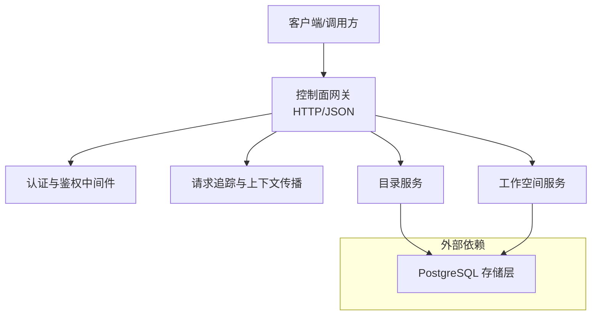
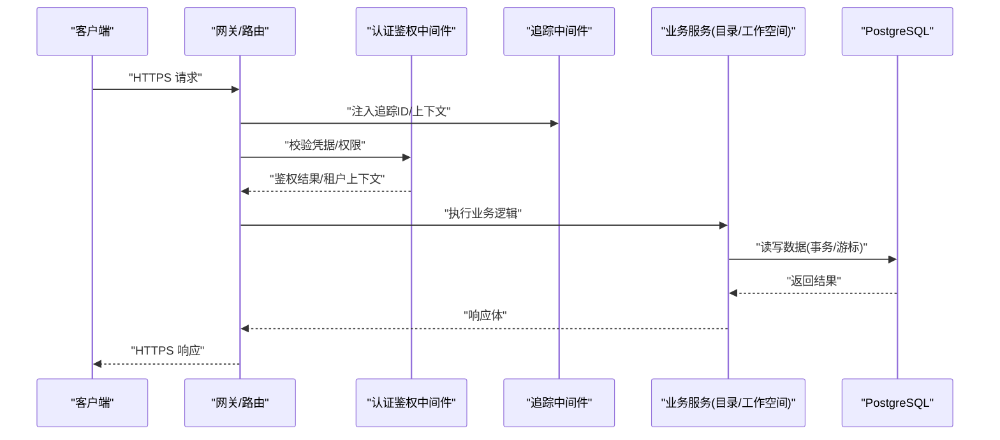
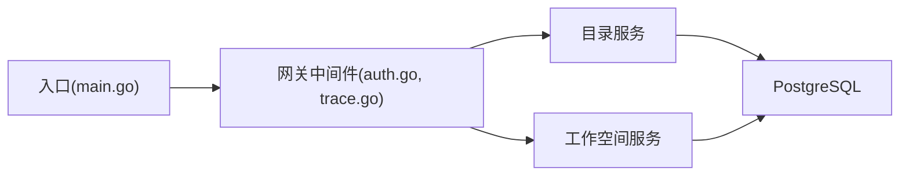

# 数据安全

<cite>
**本文引用的文件**   
- [README.md](file://README.md)
- [main.go](file://apps/control-plane/cmd/control-plane/main.go)
- [config.go](file://apps/control-plane/internal/config/config.go)
- [auth.go](file://apps/control-plane/internal/gateway/auth.go)
- [trace.go](file://apps/control-plane/internal/gateway/trace.go)
- [store.go](file://apps/control-plane/internal/catalog/postgres/store.go)
- [migrations.go](file://apps/control-plane/internal/catalog/postgres/migrations.go)
- [store.go](file://apps/control-plane/internal/workspace/postgres/store.go)
- [migrations.go](file://apps/control-plane/internal/workspace/postgres/migrations.go)
- [compose.yaml](file://deploy/compose.yaml)
- [control-plane.v2.yaml](file://contracts/openapi/control-plane.v2.yaml)
- [platform-error.v3.yaml](file://contracts/schemas/platform-error.v3.schema.json)
</cite>

## 目录
1. [简介](#简介)
2. [项目结构](#项目结构)
3. [核心组件](#核心组件)
4. [架构总览](#架构总览)
5. [详细组件分析](#详细组件分析)
6. [依赖分析](#依赖分析)
7. [性能考虑](#性能考虑)
8. [故障排查指南](#故障排查指南)
9. [结论](#结论)
10. [附录](#附录)

## 简介
本文件为 NeKiro 平台的数据安全文档，聚焦于以下方面：
- 数据传输加密（TLS/SSL）配置与证书管理
- 数据库加密存储方案（敏感字段加密、数据脱敏、备份加密）
- 数据完整性校验与防篡改措施
- 访问审计日志与敏感操作追踪
- 数据生命周期安全管理（创建、存储、使用、销毁）
- 数据泄露防护与应急响应流程
- 管理员安全检查清单与合规性评估指南
- 多租户数据隔离与跨域访问安全

说明：本文基于仓库现有实现进行梳理，并对缺失的安全能力给出可落地的改进建议。对于未在代码中直接体现的配置项，以“建议”形式呈现，便于后续落地。

## 项目结构
NeKiro 控制面采用 Go 后端服务，通过 OpenAPI 定义对外接口，使用 PostgreSQL 作为持久化存储，并通过迁移脚本维护数据库版本。部署侧提供 Compose 编排示例。

图示来源
- [main.go:1-200](file://apps/control-plane/cmd/control-plane/main.go#L1-200)
- [auth.go:1-200](file://apps/control-plane/internal/gateway/auth.go#L1-200)
- [trace.go:1-200](file://apps/control-plane/internal/gateway/trace.go#L1-200)
- [store.go:1-200](file://apps/control-plane/internal/catalog/postgres/store.go#L1-200)
- [store.go:1-200](file://apps/control-plane/internal/workspace/postgres/store.go#L1-200)

章节来源
- [README.md:1-200](file://README.md#L1-L200)
- [main.go:1-200](file://apps/control-plane/cmd/control-plane/main.go#L1-L200)
- [compose.yaml:1-200](file://deploy/compose.yaml#L1-L200)

## 核心组件
- 控制面入口与路由：负责启动 HTTP 服务、注册路由、加载配置、初始化中间件与业务服务。
- 网关中间件：
  - 认证与鉴权：校验请求凭据、权限范围、租户上下文注入。
  - 追踪与审计：生成并传播追踪 ID，记录关键请求元信息。
- 业务服务：
  - 目录服务：管理与查询 Agent 目录、能力描述等。
  - 工作空间服务：管理工作空间资源、策略与安装状态。
- 数据访问层：
  - 基于 Postgres 的 Store 实现，封装 SQL 执行、事务与游标分页。
  - 迁移工具：按版本号顺序应用 DDL/DML 变更。

章节来源
- [main.go:1-200](file://apps/control-plane/cmd/control-plane/main.go#L1-L200)
- [auth.go:1-200](file://apps/control-plane/internal/gateway/auth.go#L1-L200)
- [trace.go:1-200](file://apps/control-plane/internal/gateway/trace.go#L1-L200)
- [store.go:1-200](file://apps/control-plane/internal/catalog/postgres/store.go#L1-L200)
- [migrations.go:1-200](file://apps/control-plane/internal/catalog/postgres/migrations.go#L1-L200)
- [store.go:1-200](file://apps/control-plane/internal/workspace/postgres/store.go#L1-L200)
- [migrations.go:1-200](file://apps/control-plane/internal/workspace/postgres/migrations.go#L1-L200)

## 架构总览
下图展示从客户端到数据库的关键路径与安全控制点：

图示来源
- [main.go:1-200](file://apps/control-plane/cmd/control-plane/main.go#L1-L200)
- [auth.go:1-200](file://apps/control-plane/internal/gateway/auth.go#L1-L200)
- [trace.go:1-200](file://apps/control-plane/internal/gateway/trace.go#L1-L200)
- [store.go:1-200](file://apps/control-plane/internal/catalog/postgres/store.go#L1-L200)
- [store.go:1-200](file://apps/control-plane/internal/workspace/postgres/store.go#L1-L200)

## 详细组件分析

### 传输加密（TLS/SSL）与证书管理
- 现状
  - 控制面入口在启动时加载配置并监听端口；当前仓库未显式启用 TLS 配置项。
  - 部署编排示例提供容器化运行方式，通常由反向代理或网关统一终止 TLS。
- 建议
  - 在服务启动参数或配置文件中增加 TLS 证书与私钥路径、最小协议版本、密码套件白名单等选项。
  - 强制 HTTPS，禁用旧版协议与弱密码套件。
  - 证书轮换：支持热更新或优雅重启，避免停机。
  - 证书链校验：服务端校验客户端证书（可选 mTLS），用于内部服务间强信任。
  - 密钥管理：将证书与密钥交由 KMS/HSM 托管，避免硬编码与明文落盘。

章节来源
- [main.go:1-200](file://apps/control-plane/cmd/control-plane/main.go#L1-L200)
- [compose.yaml:1-200](file://deploy/compose.yaml#L1-L200)

### 数据库加密存储方案
- 现状
  - 数据持久化使用 PostgreSQL，Store 层封装了连接、事务与游标分页。
  - 迁移脚本维护表结构与初始数据。
  - 未发现应用层对敏感字段进行加密或脱敏的实现。
- 建议
  - 字段级加密：对敏感字段（如令牌、密钥、个人身份信息）采用应用层加密（AEAD），密钥由 KMS 管理，密文入库。
  - 透明数据加密（TDE）：在数据库层面开启磁盘加密，保护静态数据。
  - 数据脱敏：在只读查询或导出场景下，对敏感字段进行掩码或哈希处理。
  - 备份加密：对物理/逻辑备份进行加密与签名，限制备份访问权限，定期演练恢复。
  - 密钥轮换：支持主密钥轮换与重加密流水线，降低历史数据风险。

章节来源
- [store.go:1-200](file://apps/control-plane/internal/catalog/postgres/store.go#L1-L200)
- [migrations.go:1-200](file://apps/control-plane/internal/catalog/postgres/migrations.go#L1-L200)
- [store.go:1-200](file://apps/control-plane/internal/workspace/postgres/store.go#L1-L200)
- [migrations.go:1-200](file://apps/control-plane/internal/workspace/postgres/migrations.go#L1-L200)

### 数据完整性校验与防篡改
- 现状
  - 未发现针对数据行级完整性校验（如数字签名、Merkle 树）的实现。
  - 数据库事务保证 ACID，但无法抵御数据库管理员越权修改。
- 建议
  - 关键元数据（如策略、安装清单）引入不可变字段或追加式日志（append-only）。
  - 对重要对象计算并存储摘要（SHA-256），读取时校验一致性。
  - 审计日志独立存储（WORM 存储或对象存储不可变桶），防止篡改。
  - 数据库侧启用 WAL 归档与校验，结合离线快照签名验证。

章节来源
- [store.go:1-200](file://apps/control-plane/internal/catalog/postgres/store.go#L1-L200)
- [store.go:1-200](file://apps/control-plane/internal/workspace/postgres/store.go#L1-L200)

### 访问审计日志与敏感操作追踪
- 现状
  - 网关包含追踪中间件，用于注入和传播追踪 ID，有助于链路观测。
  - 未发现统一的审计日志模块（如结构化审计事件写入集中式日志系统）。
- 建议
  - 在认证鉴权中间件中输出结构化审计事件（用户、租户、动作、资源、结果、IP、UA、追踪ID）。
  - 对敏感操作（增删改、策略变更、导出）单独标记并告警。
  - 审计日志高可用与防篡改，保留周期符合合规要求。
  - 将追踪 ID 透传到下游服务与数据库会话标签，便于关联分析。

章节来源
- [auth.go:1-200](file://apps/control-plane/internal/gateway/auth.go#L1-L200)
- [trace.go:1-200](file://apps/control-plane/internal/gateway/trace.go#L1-L200)

### 数据生命周期安全管理
- 创建
  - 输入校验与模式校验（OpenAPI Schema），拒绝非法数据。
  - 敏感字段入站即加密或脱敏。
- 存储
  - 最小权限原则访问数据库账号，分库/分表/行级隔离。
  - 静态数据加密与备份加密。
- 使用
  - 内存中避免明文留存敏感数据，必要时使用安全内存区。
  - 日志脱敏，禁止记录敏感内容。
- 共享与传输
  - 全链路 HTTPS，必要时启用 mTLS。
  - 跨域访问需严格白名单与 CORS 策略。
- 销毁
  - 软删除+硬删除双阶段，确保索引与缓存同步清理。
  - 备份与归档中的敏感数据随生命周期策略清理。

章节来源
- [control-plane.v2.yaml:1-200](file://contracts/openapi/control-plane.v2.yaml#L1-L200)
- [platform-error.v3.yaml:1-200](file://contracts/schemas/platform-error.v3.schema.json#L1-L200)

### 数据泄露防护与应急响应
- 预防
  - 最小暴露面：仅开放必要端口与接口。
  - 输入校验、速率限制、异常熔断。
  - 敏感数据不出网，内网服务间走受控通道。
- 检测
  - 审计日志与 SIEM 联动，设置告警规则（批量导出、异常时间访问、失败率突增）。
- 响应
  - 事件分级与处置流程（发现、遏制、根因分析、修复、复盘）。
  - 一键封禁可疑凭据、吊销证书、切换密钥。
  - 通知相关方与监管（视合规要求）。

[本节为通用指导，不直接分析具体文件]

### 多租户数据隔离与跨域访问安全
- 现状
  - 鉴权中间件存在，但未明确展示租户隔离策略的具体实现细节。
- 建议
  - 数据隔离：按租户划分 schema 或添加 tenant_id 列并配合 RLS（行级安全）。
  - 访问控制：RBAC/ABAC 模型，细粒度到资源与操作。
  - 跨域：严格的 CORS 白名单，禁止通配符；内部服务间使用服务网格或零信任网络。
  - 限流与配额：按租户维度限制 QPS、并发与存储用量。

章节来源
- [auth.go:1-200](file://apps/control-plane/internal/gateway/auth.go#L1-L200)

## 依赖分析
- 组件耦合
  - 网关中间件与业务服务解耦，通过标准 HTTP 接口交互。
  - Store 层抽象数据库访问，便于替换或扩展。
- 外部依赖
  - PostgreSQL：需要启用安全配置（最小权限、连接池、TLS、WAL 归档）。
  - 部署编排：Compose 示例可作为基线，生产环境建议使用 Kubernetes + Ingress 终止 TLS。

图示来源
- [main.go:1-200](file://apps/control-plane/cmd/control-plane/main.go#L1-L200)
- [auth.go:1-200](file://apps/control-plane/internal/gateway/auth.go#L1-L200)
- [trace.go:1-200](file://apps/control-plane/internal/gateway/trace.go#L1-L200)
- [store.go:1-200](file://apps/control-plane/internal/catalog/postgres/store.go#L1-L200)
- [store.go:1-200](file://apps/control-plane/internal/workspace/postgres/store.go#L1-L200)

章节来源
- [main.go:1-200](file://apps/control-plane/cmd/control-plane/main.go#L1-L200)
- [compose.yaml:1-200](file://deploy/compose.yaml#L1-L200)

## 性能考虑
- 连接池与超时：合理设置数据库连接池大小、读写超时与重试策略。
- 查询优化：为高频查询建立合适索引，避免 N+1 问题。
- 缓存策略：对只读热点数据引入缓存，注意缓存一致性与失效策略。
- 序列化开销：避免在响应中包含大体积敏感数据，按需裁剪字段。
- 日志与追踪：异步写入审计日志，避免阻塞主流程。

[本节为通用指导，不直接分析具体文件]

## 故障排查指南
- 常见问题
  - TLS 握手失败：检查证书链、域名匹配、协议版本与密码套件。
  - 数据库连接失败：核对连接串、账号权限、防火墙与 VPC 策略。
  - 鉴权失败：确认凭据格式、过期时间与权限范围。
  - 审计缺失：检查中间件是否生效、日志收集链路是否正常。
- 定位方法
  - 通过追踪 ID 串联请求链路，定位失败节点。
  - 查看错误码与错误消息（参考平台错误模式），快速分类问题。
  - 对比迁移版本与数据库实际结构，排除 DDL 不一致。

章节来源
- [platform-error.v3.yaml:1-200](file://contracts/schemas/platform-error.v3.schema.json#L1-L200)
- [migrations.go:1-200](file://apps/control-plane/internal/catalog/postgres/migrations.go#L1-L200)
- [migrations.go:1-200](file://apps/control-plane/internal/workspace/postgres/migrations.go#L1-L200)

## 结论
当前仓库已具备基础的服务架构与数据访问抽象，但在数据传输加密、数据库静态加密、审计日志、完整性校验与多租户隔离等方面仍需完善。建议优先落地 TLS 强制与证书管理、审计日志与追踪增强、敏感字段加密与脱敏、以及备份加密与恢复演练，逐步构建端到端的数据安全体系。

[本节为总结性内容，不直接分析具体文件]

## 附录

### 管理员数据安全检核清单
- 传输安全
  - 强制 HTTPS，禁用旧协议与弱密码套件
  - 证书有效且自动续期，私钥受控
  - 内部服务间启用 mTLS（可选）
- 存储安全
  - 启用 TDE 或应用层字段加密
  - 备份加密与签名，定期恢复演练
  - 数据库账号最小权限，分离读写账号
- 访问控制
  - RBAC/ABAC 策略生效，租户隔离到位
  - CORS 白名单严格配置
  - 接口限流与配额
- 审计与追踪
  - 审计日志完整、不可篡改、集中收集
  - 追踪 ID 贯穿全链路
- 完整性与防篡改
  - 关键对象摘要校验或不可变日志
  - WAL 归档与校验
- 生命周期
  - 创建即加密、使用脱敏、销毁彻底
  - 缓存与临时文件清理策略

[本节为通用指导，不直接分析具体文件]

### 合规性评估指南（要点）
- 数据分类分级：识别敏感数据并制定保护策略
- 最小化采集与留存：仅采集必要数据，设定保留周期
- 访问审批与复核：高风险操作双人复核与事后审计
- 第三方与供应链：供应商安全评估与合同约束
- 事件上报与演练：定期演练与监管报告机制

[本节为通用指导，不直接分析具体文件]