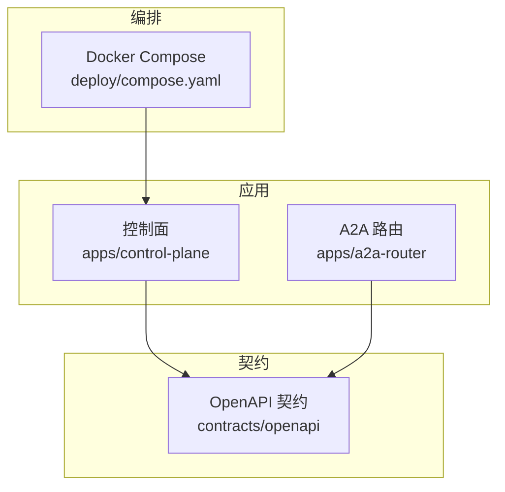
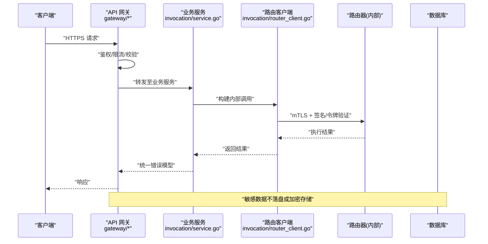
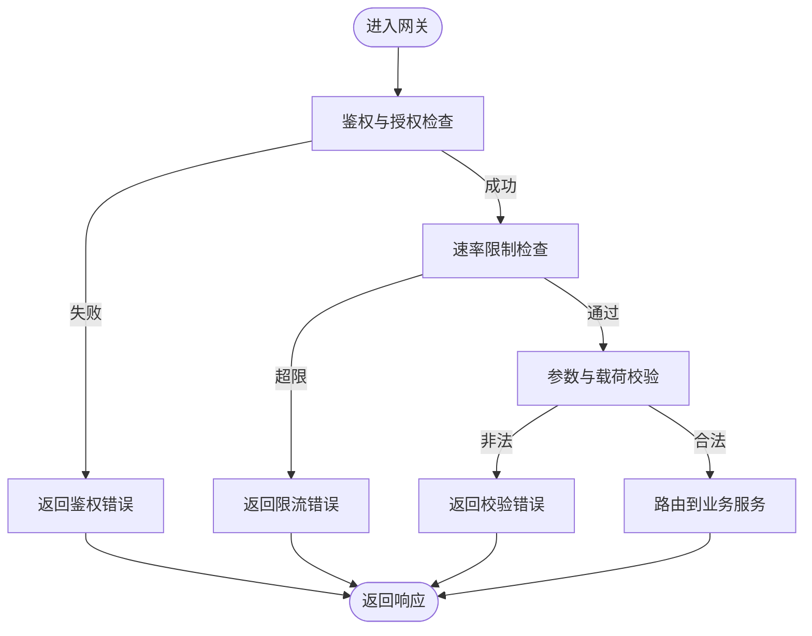
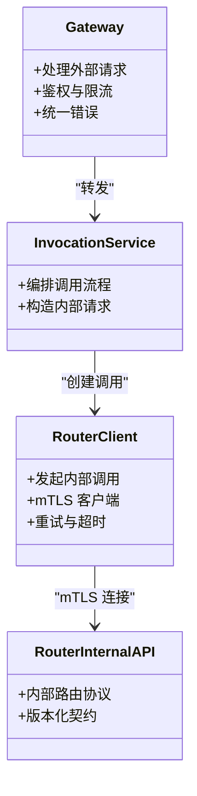
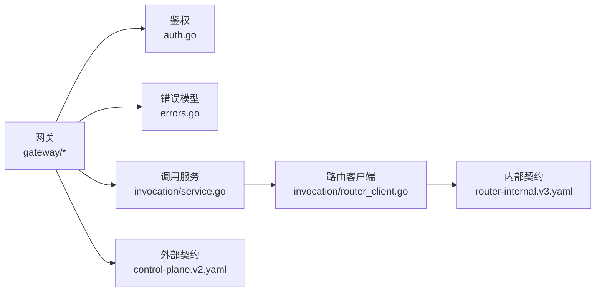

# 网络安全

<cite>
**本文引用的文件**   
- [README.md](file://README.md)
- [compose.yaml](file://deploy/compose.yaml)
- [main.go](file://apps/control-plane/cmd/control-plane/main.go)
- [auth.go](file://apps/control-plane/internal/gateway/auth.go)
- [errors.go](file://apps/control-plane/internal/gateway/errors.go)
- [control-plane.v2.yaml](file://contracts/openapi/control-plane.v2.yaml)
- [router-internal.v3.yaml](file://contracts/openapi/router-internal.v3.yaml)
- [config.go](file://apps/control-plane/internal/config/config.go)
- [service.go](file://apps/control-plane/internal/invocation/service.go)
- [router_client.go](file://apps/control-plane/internal/invocation/router_client.go)
</cite>

## 目录
1. [简介](#简介)
2. [项目结构](#项目结构)
3. [核心组件](#核心组件)
4. [架构总览](#架构总览)
5. [详细组件分析](#详细组件分析)
6. [依赖分析](#依赖分析)
7. [性能考虑](#性能考虑)
8. [故障排查指南](#故障排查指南)
9. [结论](#结论)
10. [附录](#附录)

## 简介
本文件为 NeKiro 平台的网络安全配置文档，聚焦网络层安全与微服务通信安全。内容涵盖：
- 防火墙规则、端口管理与网络分区策略
- API 网关的安全防护（请求频率限制、IP 白名单、恶意请求检测）
- 微服务间双向 TLS 认证与安全通道建立
- 容器网络隔离与 Kubernetes 网络安全策略
- DDoS、SQL 注入、XSS 攻击防护最佳实践
- 网络安全监控与入侵检测部署建议
- 安全事件响应流程与威胁情报集成

说明：本文基于仓库中现有代码与契约定义进行梳理，并结合通用云原生安全实践给出可操作建议。对于未在代码中直接实现的安全能力，将以“建议”形式呈现，便于后续落地。

## 项目结构
NeKiro 采用多应用与契约驱动的结构。控制面位于 apps/control-plane，包含网关、编排、工作区与目录等模块；API 契约集中于 contracts/openapi；本地编排使用 deploy/compose.yaml。

图表来源
- [compose.yaml](file://deploy/compose.yaml)
- [control-plane.v2.yaml](file://contracts/openapi/control-plane.v2.yaml)
- [router-internal.v3.yaml](file://contracts/openapi/router-internal.v3.yaml)

章节来源
- [README.md](file://README.md)
- [compose.yaml](file://deploy/compose.yaml)

## 核心组件
- 控制面入口与主进程：负责启动 HTTP 服务、加载配置、注册路由与中间件。
- API 网关：对外暴露 REST 接口，承载鉴权、错误处理、追踪等横切逻辑。
- 调用路由客户端：在控制面内部与路由器交互，用于任务分发与结果回传。
- OpenAPI 契约：定义外部与内部接口的版本化规范，约束输入输出与错误模型。

章节来源
- [main.go](file://apps/control-plane/cmd/control-plane/main.go)
- [auth.go](file://apps/control-plane/internal/gateway/auth.go)
- [errors.go](file://apps/control-plane/internal/gateway/errors.go)
- [control-plane.v2.yaml](file://contracts/openapi/control-plane.v2.yaml)
- [router-internal.v3.yaml](file://contracts/openapi/router-internal.v3.yaml)
- [service.go](file://apps/control-plane/internal/invocation/service.go)
- [router_client.go](file://apps/control-plane/internal/invocation/router_client.go)

## 架构总览
下图展示从客户端到控制面与内部路由的端到端路径，以及关键安全边界点。

图表来源
- [auth.go](file://apps/control-plane/internal/gateway/auth.go)
- [errors.go](file://apps/control-plane/internal/gateway/errors.go)
- [service.go](file://apps/control-plane/internal/invocation/service.go)
- [router_client.go](file://apps/control-plane/internal/invocation/router_client.go)
- [control-plane.v2.yaml](file://contracts/openapi/control-plane.v2.yaml)
- [router-internal.v3.yaml](file://contracts/openapi/router-internal.v3.yaml)

## 详细组件分析

### API 网关安全（鉴权、限流、错误处理）
- 鉴权与授权
  - 网关层对入站请求进行身份校验与权限判定，拒绝未认证或越权访问。
  - 建议结合 IP 白名单与租户上下文进行细粒度访问控制。
- 请求速率限制
  - 建议在网关层按客户端标识（如 API Key、租户 ID、源 IP）实施速率限制，防止滥用与资源耗尽。
- 恶意请求检测
  - 建议引入 WAF/IPS 能力，对异常模式（如 SQLi、XSS、路径遍历、异常 UA/Referer）进行拦截与告警。
- 统一错误模型
  - 通过统一错误类型与状态码，避免泄露内部细节，降低信息泄露风险。

图表来源
- [auth.go](file://apps/control-plane/internal/gateway/auth.go)
- [errors.go](file://apps/control-plane/internal/gateway/errors.go)

章节来源
- [auth.go](file://apps/control-plane/internal/gateway/auth.go)
- [errors.go](file://apps/control-plane/internal/gateway/errors.go)

### 微服务间通信安全（双向 TLS 与内部路由）
- 双向 TLS（mTLS）
  - 控制面与路由器之间的内部通信应启用 mTLS，确保传输机密性与双向身份认证。
  - 证书轮换与最小权限原则需纳入运维流程。
- 内部 API 契约
  - 内部接口遵循独立版本化的 OpenAPI 契约，明确字段、错误与方向性约束，减少误用风险。
- 调用链路与凭证传递
  - 建议在内部调用中携带短期令牌或签名，配合服务端校验，避免硬编码密钥。

图表来源
- [service.go](file://apps/control-plane/internal/invocation/service.go)
- [router_client.go](file://apps/control-plane/internal/invocation/router_client.go)
- [router-internal.v3.yaml](file://contracts/openapi/router-internal.v3.yaml)

章节来源
- [service.go](file://apps/control-plane/internal/invocation/service.go)
- [router_client.go](file://apps/control-plane/internal/invocation/router_client.go)
- [router-internal.v3.yaml](file://contracts/openapi/router-internal.v3.yaml)

### 配置与环境安全
- 配置加载
  - 控制面在启动时加载配置，建议将敏感项（证书、密钥、连接串）置于受保护的配置源（如 KMS/Secrets Manager）。
- 运行时开关
  - 建议提供安全相关开关（如强制 HTTPS、严格 CSP、调试日志级别），并通过环境区分生产与非生产行为。

章节来源
- [config.go](file://apps/control-plane/internal/config/config.go)
- [main.go](file://apps/control-plane/cmd/control-plane/main.go)

### 容器与编排网络隔离
- Docker Compose 网络
  - 使用默认桥接网络并仅暴露必要端口，避免将内部服务端口映射到宿主机。
- Kubernetes 网络安全策略
  - 建议使用 NetworkPolicy 限制 Pod 间通信，仅允许网关到后端、后端到数据库的最小连通图。
  - 对外暴露通过 Ingress/Gateway API，并在边缘启用 TLS 终止与 WAF。

章节来源
- [compose.yaml](file://deploy/compose.yaml)

## 依赖分析
- 外部依赖
  - OpenAPI 契约定义了控制面与路由器的接口边界，影响安全策略的落地位置（网关 vs 内部服务）。
- 内部耦合
  - 网关依赖鉴权与错误处理模块；调用服务依赖路由客户端；路由客户端依赖内部 API 契约。
- 潜在风险
  - 若内部契约未强制签名或 mTLS，存在横向移动风险。
  - 若错误模型泄露堆栈或内部地址，可能被用于探测。

图表来源
- [auth.go](file://apps/control-plane/internal/gateway/auth.go)
- [errors.go](file://apps/control-plane/internal/gateway/errors.go)
- [service.go](file://apps/control-plane/internal/invocation/service.go)
- [router_client.go](file://apps/control-plane/internal/invocation/router_client.go)
- [control-plane.v2.yaml](file://contracts/openapi/control-plane.v2.yaml)
- [router-internal.v3.yaml](file://contracts/openapi/router-internal.v3.yaml)

章节来源
- [control-plane.v2.yaml](file://contracts/openapi/control-plane.v2.yaml)
- [router-internal.v3.yaml](file://contracts/openapi/router-internal.v3.yaml)

## 性能考虑
- 网关层限流与缓存
  - 对热点接口启用读缓存与幂等键，减轻后端压力。
- 连接复用与超时
  - 内部调用使用连接池与合理超时，避免级联雪崩。
- 日志与遥测
  - 生产环境关闭详细请求体日志，仅保留必要元数据，降低 I/O 开销。

[本节为通用指导，不直接分析具体文件]

## 故障排查指南
- 常见错误分类
  - 鉴权失败：检查令牌有效性、签名与权限范围。
  - 限流触发：确认配额阈值与客户端标识是否一致。
  - 校验失败：核对 OpenAPI 契约中的必填字段与格式。
- 定位步骤
  - 查看网关错误响应与关联 TraceID。
  - 回溯调用链路，确认内部 mTLS 握手与证书有效期。
  - 对比契约版本，确认接口变更导致的兼容性问题。

章节来源
- [errors.go](file://apps/control-plane/internal/gateway/errors.go)
- [control-plane.v2.yaml](file://contracts/openapi/control-plane.v2.yaml)
- [router-internal.v3.yaml](file://contracts/openapi/router-internal.v3.yaml)

## 结论
NeKiro 平台在网络与微服务通信层面具备清晰的边界与契约约束。建议在生产环境中补齐以下能力：
- 强制 mTLS 与证书自动化管理
- 网关层速率限制、WAF 与 IP 白名单
- Kubernetes NetworkPolicy 与最小暴露面
- 统一的监控、审计与告警体系
- 完善的事件响应与威胁情报联动流程

[本节为总结性内容，不直接分析具体文件]

## 附录

### 防火墙规则与端口管理建议
- 入站
  - 仅开放网关对外端口（如 443），其余端口禁止从公网访问。
- 出站
  - 仅允许必要的上游访问（如包源、镜像仓库、KMS）。
- 内网
  - 控制面与数据库之间走私有网段，禁用公网可达。

[本节为通用指导，不直接分析具体文件]

### API 网关安全防护清单
- 请求频率限制：按客户端/租户/IP 维度设置阈值与突发容量。
- IP 白名单：对管理面与内部接口启用白名单。
- 恶意请求检测：启用 WAF 规则集，拦截常见攻击向量。
- 输入校验：严格遵循 OpenAPI 契约，拒绝未知字段。
- 响应脱敏：统一错误模型，避免泄露内部细节。

[本节为通用指导，不直接分析具体文件]

### 微服务间双向 TLS 与内部路由
- 证书管理：集中签发、定期轮换、吊销列表同步。
- 客户端校验：服务端校验客户端证书 CN/SAN 与权限标签。
- 内部令牌：短生命周期令牌+签名，配合服务端校验。
- 契约治理：内部接口版本化与兼容性测试。

章节来源
- [router_client.go](file://apps/control-plane/internal/invocation/router_client.go)
- [router-internal.v3.yaml](file://contracts/openapi/router-internal.v3.yaml)

### 容器网络隔离与 Kubernetes 策略
- NetworkPolicy
  - 默认拒绝所有流量，按需放行。
  - 仅允许网关到后端、后端到数据库的单向通信。
- Ingress/Gateway
  - 强制 HTTPS，启用 HSTS、CSP、CSRF 保护。
- 命名空间隔离
  - 不同租户/环境使用独立命名空间与 RBAC。

[本节为通用指导，不直接分析具体文件]

### DDoS、SQL 注入、XSS 防护最佳实践
- DDoS
  - 边缘限速、连接数限制、SYN Cookie、CDN 清洗。
- SQL 注入
  - 使用参数化查询、ORM 白名单、最小权限数据库账户。
- XSS
  - 输出编码、CSP、HttpOnly Cookie、严格 Content-Type。

[本节为通用指导，不直接分析具体文件]

### 网络安全监控与入侵检测
- 指标与日志
  - 收集网关 QPS、延迟、错误率、限流命中、TLS 握手失败。
- 审计与溯源
  - 记录鉴权决策、关键操作与异常事件，关联 TraceID。
- IDS/WAF
  - 部署于边缘与集群入口，联动告警与自动阻断。

[本节为通用指导，不直接分析具体文件]

### 安全事件响应与威胁情报集成
- 事件分级与 SLA
  - 根据影响面与扩散速度划分等级，制定响应时限。
- 处置流程
  - 发现→研判→遏制→根除→恢复→复盘。
- 威胁情报
  - 接入 IOC 列表，自动更新黑名单与规则集。

[本节为通用指导，不直接分析具体文件]