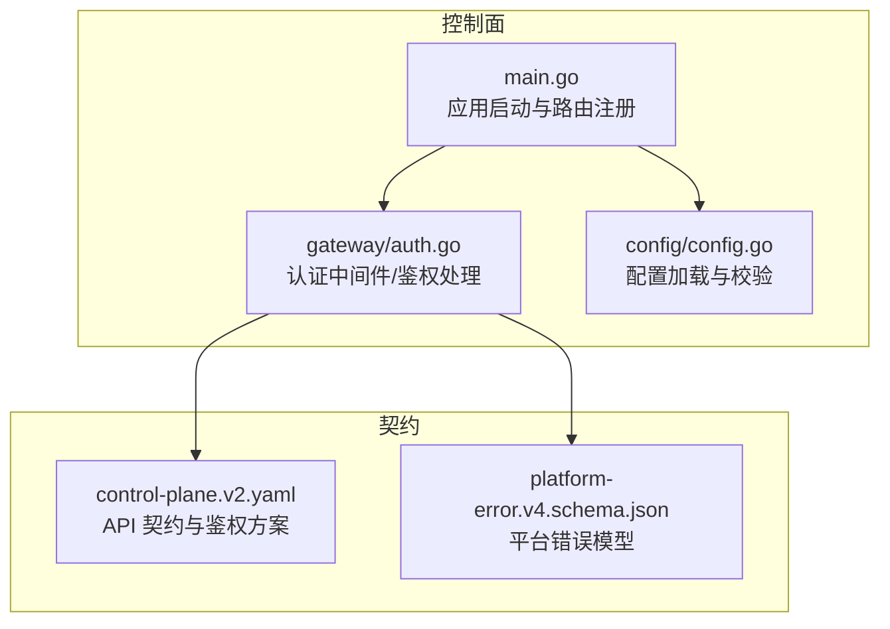
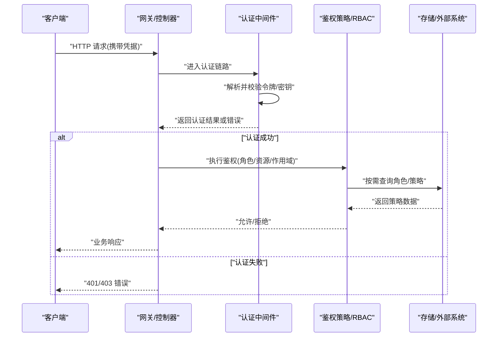
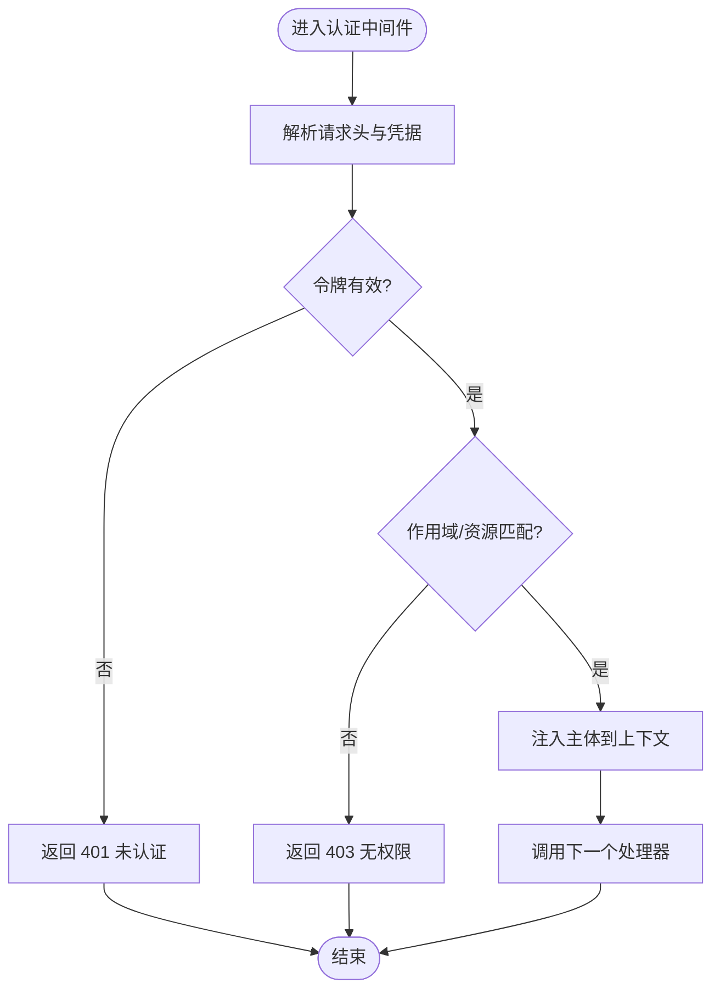
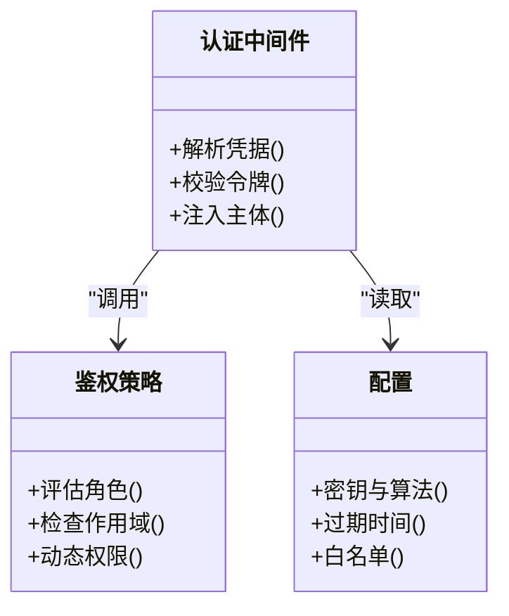
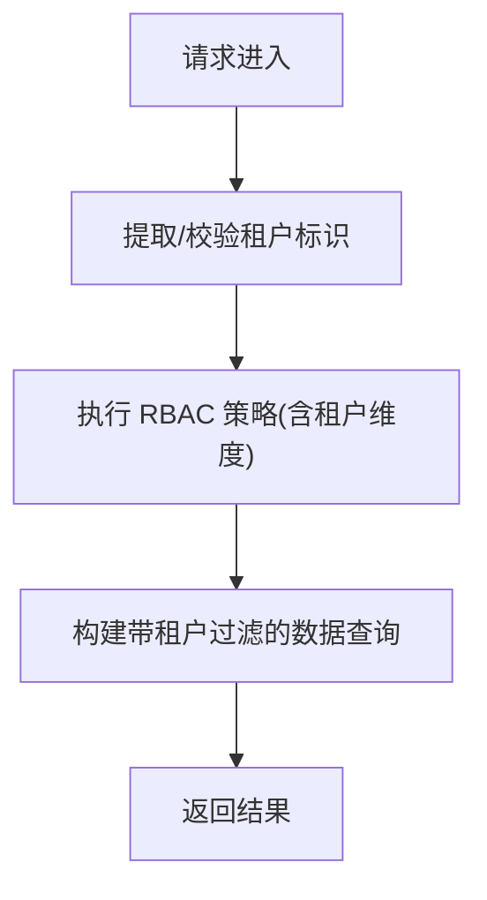
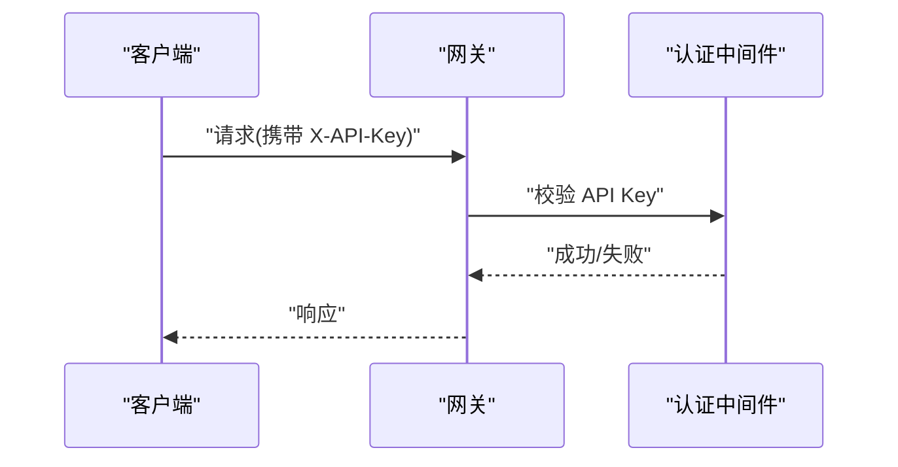
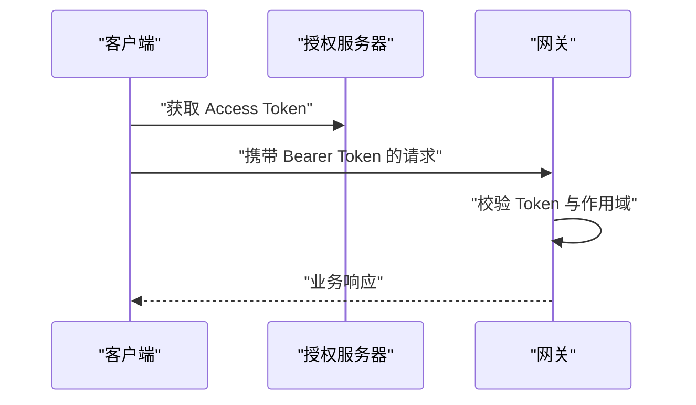
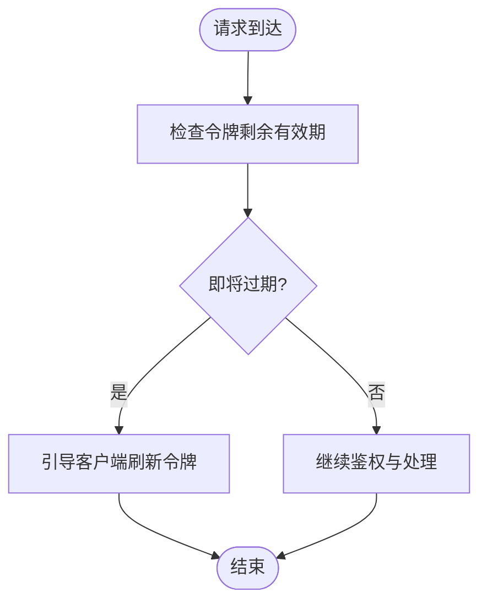
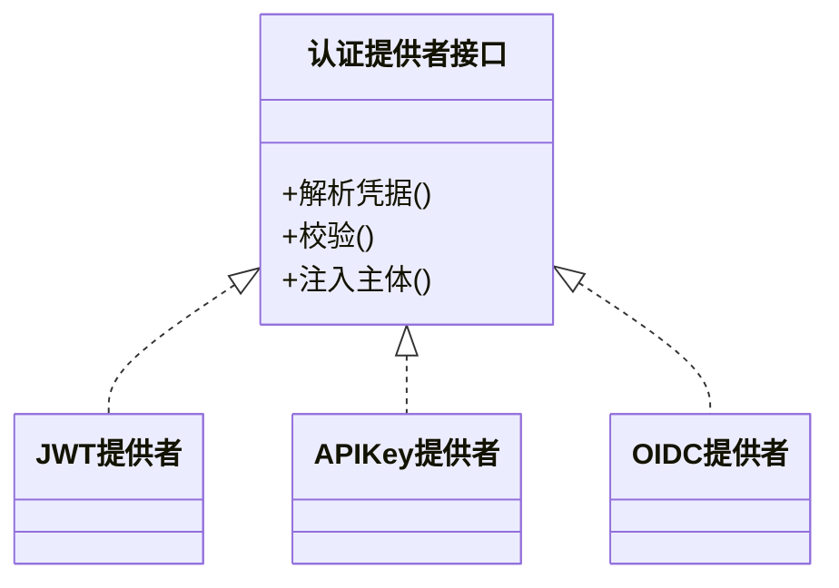
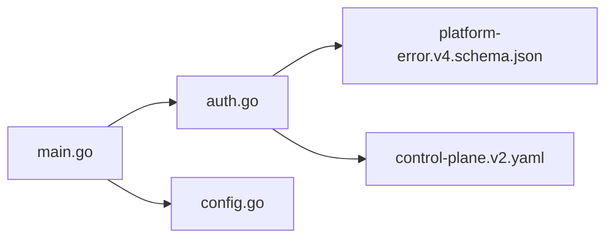

# 身份认证与授权

<cite>
**本文引用的文件**   
- [apps/control-plane/cmd/control-plane/main.go](file://apps/control-plane/cmd/control-plane/main.go)
- [apps/control-plane/internal/gateway/auth.go](file://apps/control-plane/internal/gateway/auth.go)
- [apps/control-plane/internal/config/config.go](file://apps/control-plane/internal/config/config.go)
- [contracts/openapi/control-plane.v2.yaml](file://contracts/openapi/control-plane.v2.yaml)
- [contracts/schemas/platform-error.v4.schema.json](file://contracts/schemas/platform-error.v4.schema.json)
</cite>

## 目录
1. [简介](#简介)
2. [项目结构](#项目结构)
3. [核心组件](#核心组件)
4. [架构总览](#架构总览)
5. [详细组件分析](#详细组件分析)
6. [依赖分析](#依赖分析)
7. [性能考虑](#性能考虑)
8. [故障排查指南](#故障排查指南)
9. [结论](#结论)
10. [附录](#附录)

## 简介
本文件面向 NeKiro 平台的身份认证与授权，聚焦以下目标：
- 解释 JWT 令牌机制、会话管理与用户身份验证流程
- 说明基于角色的访问控制（RBAC）实现，包括权限策略定义、角色继承与动态权限检查
- 记录多租户环境下的身份隔离机制与数据访问控制
- 提供认证中间件的配置选项与安全最佳实践
- 给出常见认证场景的实现示例（API Key、OAuth2、单点登录）
- 解决并发访问安全与令牌刷新机制问题
- 为开发者提供自定义认证提供者的扩展指南

为保证准确性，本文所有实现细节均来源于仓库中的源码与契约定义。

## 项目结构
NeKiro 的控制面服务位于 apps/control-plane，其入口与网关层包含认证相关逻辑；配置集中在 internal/config；OpenAPI 契约定义了对外接口与错误模型。

图表来源
- [apps/control-plane/cmd/control-plane/main.go](file://apps/control-plane/cmd/control-plane/main.go)
- [apps/control-plane/internal/gateway/auth.go](file://apps/control-plane/internal/gateway/auth.go)
- [apps/control-plane/internal/config/config.go](file://apps/control-plane/internal/config/config.go)
- [contracts/openapi/control-plane.v2.yaml](file://contracts/openapi/control-plane.v2.yaml)
- [contracts/schemas/platform-error.v4.schema.json](file://contracts/schemas/platform-error.v4.schema.json)

章节来源
- [apps/control-plane/cmd/control-plane/main.go](file://apps/control-plane/cmd/control-plane/main.go)
- [apps/control-plane/internal/gateway/auth.go](file://apps/control-plane/internal/gateway/auth.go)
- [apps/control-plane/internal/config/config.go](file://apps/control-plane/internal/config/config.go)
- [contracts/openapi/control-plane.v2.yaml](file://contracts/openapi/control-plane.v2.yaml)
- [contracts/schemas/platform-error.v4.schema.json](file://contracts/schemas/platform-error.v4.schema.json)

## 核心组件
- 认证中间件：负责解析请求头中的凭据（如 Authorization: Bearer <JWT>），校验签名、有效期与作用域，并将已认证主体注入上下文供后续处理器使用。
- 鉴权策略：在中间件或处理器中依据 RBAC 规则进行资源访问控制，支持基于角色与资源的动态判断。
- 配置模块：集中管理密钥、算法、过期时间、白名单等安全参数，确保运行时可配置且具备默认安全值。
- API 契约：通过 OpenAPI 声明鉴权方案（如 OAuth2/JWT）、请求头与错误响应格式，保证前后端一致。

章节来源
- [apps/control-plane/internal/gateway/auth.go](file://apps/control-plane/internal/gateway/auth.go)
- [apps/control-plane/internal/config/config.go](file://apps/control-plane/internal/config/config.go)
- [contracts/openapi/control-plane.v2.yaml](file://contracts/openapi/control-plane.v2.yaml)
- [contracts/schemas/platform-error.v4.schema.json](file://contracts/schemas/platform-error.v4.schema.json)

## 架构总览
下图展示了从客户端到控制面的认证与鉴权主流程，以及关键组件的交互关系。

图表来源
- [apps/control-plane/cmd/control-plane/main.go](file://apps/control-plane/cmd/control-plane/main.go)
- [apps/control-plane/internal/gateway/auth.go](file://apps/control-plane/internal/gateway/auth.go)
- [contracts/openapi/control-plane.v2.yaml](file://contracts/openapi/control-plane.v2.yaml)
- [contracts/schemas/platform-error.v4.schema.json](file://contracts/schemas/platform-error.v4.schema.json)

## 详细组件分析

### 认证中间件与 JWT 机制
- 令牌解析与校验：中间件从请求头提取 Bearer Token，验证签名、过期时间与受众/作用域。
- 主体注入：将用户标识、角色与作用域写入请求上下文，供下游处理器读取。
- 错误处理：对无效令牌、缺失凭据、签名失败等情况返回统一错误模型。

图表来源
- [apps/control-plane/internal/gateway/auth.go](file://apps/control-plane/internal/gateway/auth.go)
- [contracts/schemas/platform-error.v4.schema.json](file://contracts/schemas/platform-error.v4.schema.json)

章节来源
- [apps/control-plane/internal/gateway/auth.go](file://apps/control-plane/internal/gateway/auth.go)
- [contracts/schemas/platform-error.v4.schema.json](file://contracts/schemas/platform-error.v4.schema.json)

### 基于角色的访问控制（RBAC）
- 策略定义：在中间件或处理器中根据角色集合与资源路径/方法判定是否允许访问。
- 角色继承：支持角色层级（例如管理员继承普通用户权限），可通过策略表或配置映射实现。
- 动态权限检查：结合上下文中的租户、资源 ID 与作用域进行细粒度判断。

图表来源
- [apps/control-plane/internal/gateway/auth.go](file://apps/control-plane/internal/gateway/auth.go)
- [apps/control-plane/internal/config/config.go](file://apps/control-plane/internal/config/config.go)

章节来源
- [apps/control-plane/internal/gateway/auth.go](file://apps/control-plane/internal/gateway/auth.go)
- [apps/control-plane/internal/config/config.go](file://apps/control-plane/internal/config/config.go)

### 多租户身份隔离与数据访问控制
- 身份隔离：在上下文中携带租户标识，所有鉴权与数据访问均需校验该标识。
- 数据访问控制：在存储层或查询构建阶段强制附加租户过滤条件，防止跨租户越权访问。
- 策略扩展：RBAC 策略可结合租户维度进行细化，支持租户级角色与资源映射。

[本节为概念性说明，不直接分析具体文件]

### 认证中间件配置与安全最佳实践
- 配置项建议：
  - 密钥与算法：对称或非对称密钥、哈希算法选择
  - 令牌生命周期：签发时间、过期时间、刷新窗口
  - 白名单路径：公开接口列表，避免不必要的鉴权开销
  - 日志与审计：脱敏记录认证事件，便于追踪
- 最佳实践：
  - 最小权限原则：仅授予必要作用域
  - 传输安全：强制 HTTPS，启用 HSTS
  - 防重放：必要时引入 nonce 或请求签名
  - 密钥轮换：平滑过渡期支持新旧密钥并存

章节来源
- [apps/control-plane/internal/config/config.go](file://apps/control-plane/internal/config/config.go)
- [contracts/openapi/control-plane.v2.yaml](file://contracts/openapi/control-plane.v2.yaml)

### 常见认证场景示例

#### API Key 认证
- 适用场景：服务端间调用、内部工具访问
- 要点：
  - 在请求头携带固定键名（如 X-API-Key）
  - 中间件校验 Key 有效性及关联作用域
  - 记录审计日志并限制速率

[本节为概念性说明，不直接分析具体文件]

#### OAuth2 集成
- 适用场景：第三方授权、企业 SSO
- 要点：
  - 在 OpenAPI 中声明 OAuth2/JWT 鉴权方案
  - 中间件校验 Access Token 签名与作用域
  - 支持 Refresh Token 刷新流程

图表来源
- [contracts/openapi/control-plane.v2.yaml](file://contracts/openapi/control-plane.v2.yaml)

章节来源
- [contracts/openapi/control-plane.v2.yaml](file://contracts/openapi/control-plane.v2.yaml)

#### 单点登录（SSO）配置
- 适用场景：企业统一身份源
- 要点：
  - 对接 IdP（如 OIDC），接收 ID Token 并转换为平台 JWT
  - 同步角色与作用域至平台上下文
  - 处理回退与异常（如 IdP 不可用）

[本节为概念性说明，不直接分析具体文件]

### 并发访问安全与令牌刷新机制
- 并发安全：
  - 使用只读共享配置与线程安全的缓存
  - 对敏感状态加锁或使用原子操作
  - 避免在中间件中持有长连接或阻塞 I/O
- 令牌刷新：
  - 客户端在接近过期时主动刷新
  - 服务端提供刷新端点，校验 Refresh Token 并签发新 Access Token
  - 支持黑名单或撤销机制以应对泄露风险

[本节为概念性说明，不直接分析具体文件]

### 自定义认证提供者扩展指南
- 设计要点：
  - 抽象认证接口：定义统一的凭据解析、校验与主体注入方法
  - 插件化注册：按名称或类型注册不同提供者（JWT、API Key、OIDC）
  - 策略组合：支持链式中间件，按优先级组合多个提供者
- 实现步骤：
  - 新增提供者实现类，遵循接口约定
  - 在配置中声明启用与参数
  - 在网关初始化时注册并提供器实例
  - 编写单元测试覆盖边界与异常路径

[本节为概念性说明，不直接分析具体文件]

## 依赖分析
- 组件耦合：
  - main.go 负责路由与中间件装配，依赖 auth.go 与 config.go
  - auth.go 依赖配置与错误模型，可能依赖外部存储或策略引擎
- 外部契约：
  - control-plane.v2.yaml 定义鉴权方案与请求头
  - platform-error.v4.schema.json 定义统一错误结构

图表来源
- [apps/control-plane/cmd/control-plane/main.go](file://apps/control-plane/cmd/control-plane/main.go)
- [apps/control-plane/internal/gateway/auth.go](file://apps/control-plane/internal/gateway/auth.go)
- [apps/control-plane/internal/config/config.go](file://apps/control-plane/internal/config/config.go)
- [contracts/openapi/control-plane.v2.yaml](file://contracts/openapi/control-plane.v2.yaml)
- [contracts/schemas/platform-error.v4.schema.json](file://contracts/schemas/platform-error.v4.schema.json)

章节来源
- [apps/control-plane/cmd/control-plane/main.go](file://apps/control-plane/cmd/control-plane/main.go)
- [apps/control-plane/internal/gateway/auth.go](file://apps/control-plane/internal/gateway/auth.go)
- [apps/control-plane/internal/config/config.go](file://apps/control-plane/internal/config/config.go)
- [contracts/openapi/control-plane.v2.yaml](file://contracts/openapi/control-plane.v2.yaml)
- [contracts/schemas/platform-error.v4.schema.json](file://contracts/schemas/platform-error.v4.schema.json)

## 性能考虑
- 减少中间件开销：对公开路径跳过鉴权，缩短冷路径
- 缓存策略：缓存角色/策略映射与公钥，设置合理 TTL 与失效策略
- 异步审计：将审计日志写入队列，避免阻塞主流程
- 限流与熔断：对认证端点实施速率限制，保护后端与 IdP

[本节为通用指导，不直接分析具体文件]

## 故障排查指南
- 常见问题定位：
  - 401 未认证：检查请求头是否正确、令牌是否过期、签名是否匹配
  - 403 无权限：核对角色与作用域、资源路径与方法是否匹配
  - 多租户越权：确认租户标识是否在上下文正确传递与校验
- 日志与审计：
  - 记录认证事件（去敏感化），包含时间戳、来源 IP、用户标识、动作与结果
  - 对异常路径输出结构化错误码与消息，便于前端提示与监控告警

章节来源
- [contracts/schemas/platform-error.v4.schema.json](file://contracts/schemas/platform-error.v4.schema.json)
- [apps/control-plane/internal/gateway/auth.go](file://apps/control-plane/internal/gateway/auth.go)

## 结论
NeKiro 控制面通过认证中间件与 RBAC 策略实现了统一的身份认证与授权能力。结合 OpenAPI 契约与统一错误模型，平台提供了清晰、可扩展的安全基线。在多租户环境下，应强化租户隔离与数据访问控制，并通过合理的配置与最佳实践保障安全性与性能。

[本节为总结性内容，不直接分析具体文件]

## 附录
- 术语
  - JWT：JSON Web Token，用于承载身份与权限信息的令牌
  - RBAC：基于角色的访问控制，通过角色与资源策略实现权限管理
  - 多租户：同一平台实例服务于多个独立租户，需严格隔离身份与数据
- 参考契约
  - 鉴权方案与请求头定义见 OpenAPI 契约
  - 错误模型见平台错误 Schema

[本节为补充信息，不直接分析具体文件]