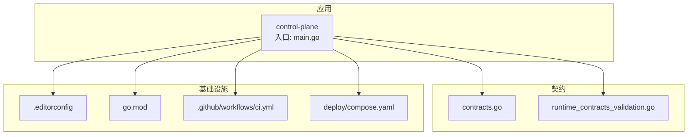
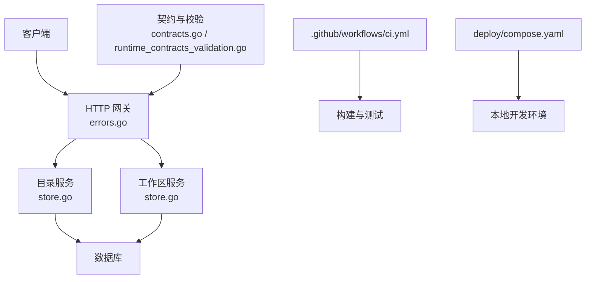
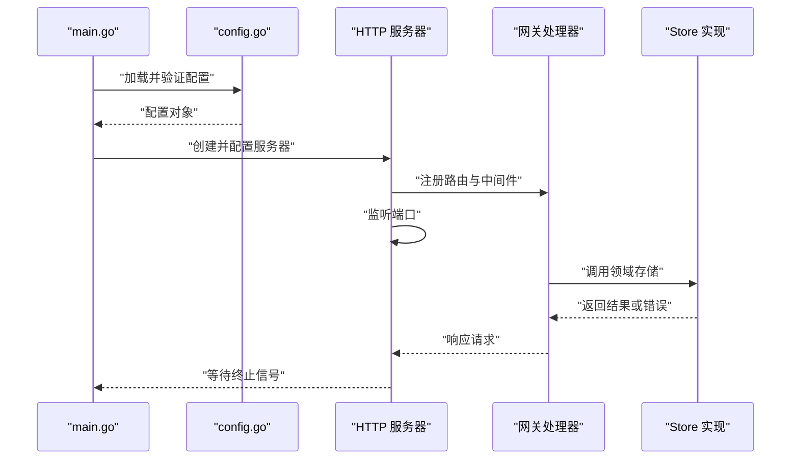
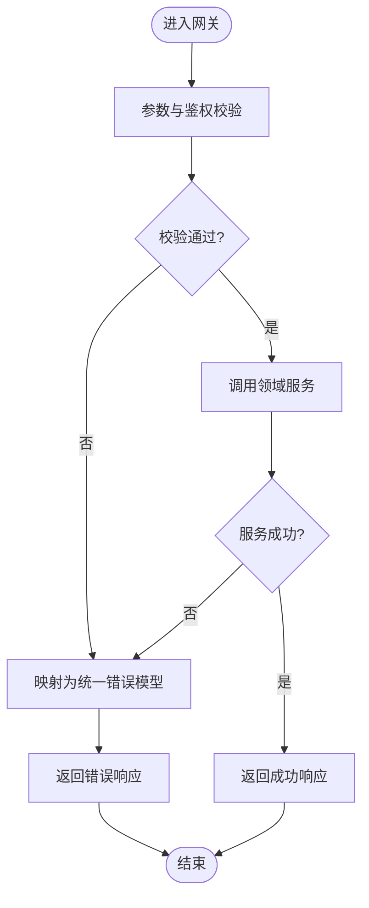
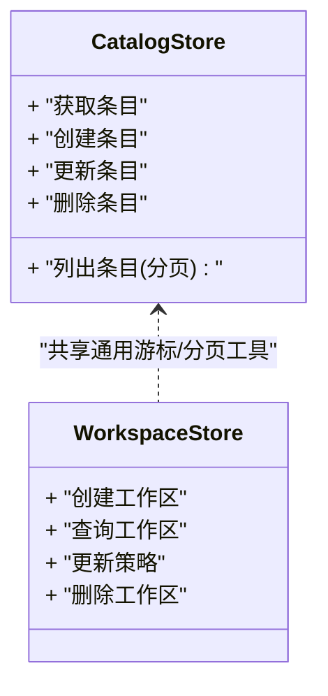
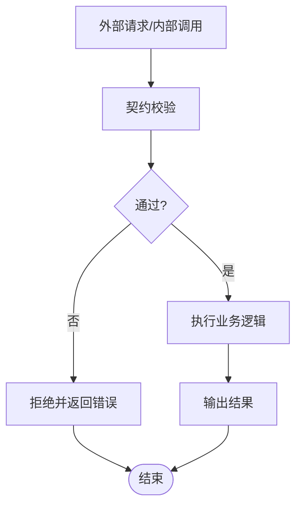
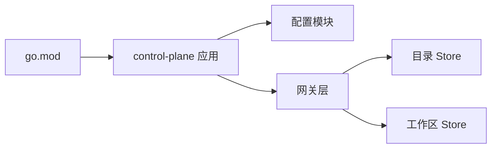

# 代码规范

<cite>
**本文引用的文件**   
- [README.md](file://README.md)
- [.editorconfig](file://.editorconfig)
- [go.mod](file://go.mod)
- [apps/control-plane/cmd/control-plane/main.go](file://apps/control-plane/cmd/control-plane/main.go)
- [apps/control-plane/internal/config/config.go](file://apps/control-plane/internal/config/config.go)
- [apps/control-plane/internal/gateway/errors.go](file://apps/control-plane/internal/gateway/errors.go)
- [apps/control-plane/internal/catalog/store.go](file://apps/control-plane/internal/catalog/store.go)
- [apps/control-plane/internal/workspace/store.go](file://apps/control-plane/internal/workspace/store.go)
- [contracts/contracts.go](file://contracts/contracts.go)
- [contracts/runtime_contracts_validation.go](file://contracts/runtime_contracts_validation.go)
- [deploy/compose.yaml](file://deploy/compose.yaml)
- [.github/workflows/ci.yml](file://.github/workflows/ci.yml)
</cite>

## 目录
1. [简介](#简介)
2. [项目结构](#项目结构)
3. [核心组件](#核心组件)
4. [架构总览](#架构总览)
5. [详细组件分析](#详细组件分析)
6. [依赖分析](#依赖分析)
7. [性能考虑](#性能考虑)
8. [故障排查指南](#故障排查指南)
9. [结论](#结论)
10. [附录](#附录)

## 简介
本规范面向 NeKiro 平台的 Go 语言工程，目标是统一命名约定、文件组织、函数设计模式与错误处理策略，明确注释标准、格式化规则、导入顺序与包依赖管理，并提供 Git 提交信息与分支管理策略。通过可执行的配置与示例路径，确保团队代码的一致性与可维护性。

## 项目结构
仓库采用多应用与契约分离的组织方式：
- apps：应用实现（控制面等）
- contracts：契约定义与校验逻辑
- deploy：部署编排
- .github/workflows：CI 流水线
- 根级配置文件：编辑器与 Go 模块

图表来源
- [apps/control-plane/cmd/control-plane/main.go](file://apps/control-plane/cmd/control-plane/main.go)
- [contracts/contracts.go](file://contracts/contracts.go)
- [contracts/runtime_contracts_validation.go](file://contracts/runtime_contracts_validation.go)
- [.editorconfig](file://.editorconfig)
- [go.mod](file://go.mod)
- [.github/workflows/ci.yml](file://.github/workflows/ci.yml)
- [deploy/compose.yaml](file://deploy/compose.yaml)

章节来源
- [README.md](file://README.md)
- [go.mod](file://go.mod)
- [.editorconfig](file://.editorconfig)

## 核心组件
- 应用入口与控制面启动流程：位于 apps/control-plane/cmd/control-plane/main.go
- 配置加载与校验：位于 apps/control-plane/internal/config/config.go
- 网关错误模型与处理：位于 apps/control-plane/internal/gateway/errors.go
- 数据访问层（示例）：catalog 与 workspace 的 store 实现
- 契约与校验：contracts 包下的契约定义与运行时校验

章节来源
- [apps/control-plane/cmd/control-plane/main.go](file://apps/control-plane/cmd/control-plane/main.go)
- [apps/control-plane/internal/config/config.go](file://apps/control-plane/internal/config/config.go)
- [apps/control-plane/internal/gateway/errors.go](file://apps/control-plane/internal/gateway/errors.go)
- [apps/control-plane/internal/catalog/store.go](file://apps/control-plane/internal/catalog/store.go)
- [apps/control-plane/internal/workspace/store.go](file://apps/control-plane/internal/workspace/store.go)
- [contracts/contracts.go](file://contracts/contracts.go)
- [contracts/runtime_contracts_validation.go](file://contracts/runtime_contracts_validation.go)

## 架构总览
控制面服务通过 HTTP 网关暴露能力，内部调用领域服务与存储实现；契约包提供对外 API 语义与校验，CI 负责构建与测试，Compose 用于本地编排。

图表来源
- [apps/control-plane/internal/gateway/errors.go](file://apps/control-plane/internal/gateway/errors.go)
- [apps/control-plane/internal/catalog/store.go](file://apps/control-plane/internal/catalog/store.go)
- [apps/control-plane/internal/workspace/store.go](file://apps/control-plane/internal/workspace/store.go)
- [contracts/contracts.go](file://contracts/contracts.go)
- [contracts/runtime_contracts_validation.go](file://contracts/runtime_contracts_validation.go)
- [.github/workflows/ci.yml](file://.github/workflows/ci.yml)
- [deploy/compose.yaml](file://deploy/compose.yaml)

## 详细组件分析

### 入口与启动流程
- 入口职责：解析配置、初始化日志/追踪、启动 HTTP 服务器、优雅关闭
- 关键流程：读取配置 -> 初始化依赖 -> 注册路由 -> 监听端口 -> 等待信号退出

图表来源
- [apps/control-plane/cmd/control-plane/main.go](file://apps/control-plane/cmd/control-plane/main.go)
- [apps/control-plane/internal/config/config.go](file://apps/control-plane/internal/config/config.go)
- [apps/control-plane/internal/gateway/errors.go](file://apps/control-plane/internal/gateway/errors.go)
- [apps/control-plane/internal/catalog/store.go](file://apps/control-plane/internal/catalog/store.go)
- [apps/control-plane/internal/workspace/store.go](file://apps/control-plane/internal/workspace/store.go)

章节来源
- [apps/control-plane/cmd/control-plane/main.go](file://apps/control-plane/cmd/control-plane/main.go)
- [apps/control-plane/internal/config/config.go](file://apps/control-plane/internal/config/config.go)

### 配置加载与校验
- 建议模式：集中式配置结构体 + 环境变量映射 + 必填字段校验
- 错误处理：对缺失/非法配置返回结构化错误，便于上层统一处理
- 可观测性：在启动前输出关键配置摘要（脱敏）

章节来源
- [apps/control-plane/internal/config/config.go](file://apps/control-plane/internal/config/config.go)

### 网关错误模型与处理
- 错误分层：业务错误、参数错误、系统错误
- 统一响应：将错误转换为一致的 JSON 结构与 HTTP 状态码
- 可观测性：记录错误上下文（请求 ID、用户、资源标识）

图表来源
- [apps/control-plane/internal/gateway/errors.go](file://apps/control-plane/internal/gateway/errors.go)

章节来源
- [apps/control-plane/internal/gateway/errors.go](file://apps/control-plane/internal/gateway/errors.go)

### 数据访问层（Store）
- 接口抽象：按领域划分 Store 接口，隐藏持久化细节
- 事务与一致性：跨表操作使用事务包裹，失败回滚
- 游标分页：cursor 实现稳定分页，避免深翻页性能问题

图表来源
- [apps/control-plane/internal/catalog/store.go](file://apps/control-plane/internal/catalog/store.go)
- [apps/control-plane/internal/workspace/store.go](file://apps/control-plane/internal/workspace/store.go)

章节来源
- [apps/control-plane/internal/catalog/store.go](file://apps/control-plane/internal/catalog/store.go)
- [apps/control-plane/internal/workspace/store.go](file://apps/control-plane/internal/workspace/store.go)

### 契约与校验
- 契约定义：集中描述 API 语义、数据结构与约束
- 运行时校验：在服务边界处进行输入/输出校验，保证一致性
- 版本兼容：通过版本号与迁移策略保障向后兼容

图表来源
- [contracts/contracts.go](file://contracts/contracts.go)
- [contracts/runtime_contracts_validation.go](file://contracts/runtime_contracts_validation.go)

章节来源
- [contracts/contracts.go](file://contracts/contracts.go)
- [contracts/runtime_contracts_validation.go](file://contracts/runtime_contracts_validation.go)

## 依赖分析
- 模块管理：使用 go.mod 声明依赖与版本，锁定 go.sum
- 应用内依赖：入口 -> 配置 -> 网关 -> 领域服务 -> Store
- 外部依赖：数据库驱动、HTTP 框架、序列化库、可观测性 SDK

图表来源
- [go.mod](file://go.mod)
- [apps/control-plane/cmd/control-plane/main.go](file://apps/control-plane/cmd/control-plane/main.go)
- [apps/control-plane/internal/config/config.go](file://apps/control-plane/internal/config/config.go)
- [apps/control-plane/internal/gateway/errors.go](file://apps/control-plane/internal/gateway/errors.go)
- [apps/control-plane/internal/catalog/store.go](file://apps/control-plane/internal/catalog/store.go)
- [apps/control-plane/internal/workspace/store.go](file://apps/control-plane/internal/workspace/store.go)

章节来源
- [go.mod](file://go.mod)

## 性能考虑
- 连接池：合理设置数据库连接池大小与超时
- 并发控制：限制并发度，避免雪崩
- 缓存策略：热点数据加缓存，注意失效与一致性
- 分页与索引：深分页使用游标，配合合适索引
- 序列化：选择高效编解码器，减少 GC 压力
- 可观测性：采样日志与指标，避免过度采集

## 故障排查指南
- 统一错误模型：快速定位错误类型与来源
- 结构化日志：包含请求 ID、用户、资源标识、耗时
- 健康检查：提供就绪/存活探针
- 压测与回归：结合 CI 执行基准与回归测试
- 本地复现：使用 compose 一键拉起依赖

章节来源
- [apps/control-plane/internal/gateway/errors.go](file://apps/control-plane/internal/gateway/errors.go)
- [.github/workflows/ci.yml](file://.github/workflows/ci.yml)
- [deploy/compose.yaml](file://deploy/compose.yaml)

## 结论
通过统一的命名、结构、错误处理与注释规范，配合可执行的编辑器与 CI 配置，NeKiro 平台可在保持高一致性的同时提升可维护性与交付效率。

## 附录

### Go 语言编码规范

- 命名约定
  - 包名：全小写、简短、无下划线
  - 文件名：小写、下划线分隔，体现领域
  - 变量/函数：驼峰，首字母大写导出，小写私有
  - 常量：大写下划线分隔
  - 接口：以 er 结尾（如 Reader），单方法接口简洁明了
  - 错误：以 err 结尾，自定义错误类型以 Error 结尾

- 文件组织结构
  - cmd/<app>/main.go 作为入口
  - internal/<domain>/ 存放领域实现
  - internal/<domain>/<db>/ 存放特定存储实现
  - 每个包只暴露必要接口，隐藏实现细节

- 函数设计模式
  - 单一职责：一个函数只做一件事
  - 显式错误：返回 error，不 panic
  - 上下文传递：使用 context.Context 控制取消与超时
  - 依赖注入：通过构造函数或选项模式传入依赖

- 错误处理策略
  - 分层错误：区分业务错误、参数错误、系统错误
  - 包装错误：保留堆栈与上下文信息
  - 统一响应：网关层将错误映射为统一 JSON 结构
  - 重试与退避：对瞬态错误实施指数退避

- 注释标准
  - 包文档：首行说明包的用途与边界
  - 函数注释：首行概括功能，后续补充参数、返回值、错误与副作用
  - 复杂逻辑：解释“为什么”，而非“是什么”
  - 变更影响：重要改动需附带原因与替代方案

- 代码格式化与导入顺序
  - 使用 gofmt/goimports 自动格式化
  - 导入分组：标准库 -> 第三方库 -> 项目内部包
  - 禁止未使用的导入与变量

- 包依赖管理
  - 使用 go mod tidy 清理依赖
  - 固定版本到 go.sum，避免漂移
  - 定期升级依赖并运行测试

- 具体示例路径（仅展示正确风格参考位置）
  - 入口与启动流程：[apps/control-plane/cmd/control-plane/main.go](file://apps/control-plane/cmd/control-plane/main.go)
  - 配置加载与校验：[apps/control-plane/internal/config/config.go](file://apps/control-plane/internal/config/config.go)
  - 网关错误模型：[apps/control-plane/internal/gateway/errors.go](file://apps/control-plane/internal/gateway/errors.go)
  - 数据访问层（目录）：[apps/control-plane/internal/catalog/store.go](file://apps/control-plane/internal/catalog/store.go)
  - 数据访问层（工作区）：[apps/control-plane/internal/workspace/store.go](file://apps/control-plane/internal/workspace/store.go)
  - 契约与校验：[contracts/contracts.go](file://contracts/contracts.go)、[contracts/runtime_contracts_validation.go](file://contracts/runtime_contracts_validation.go)

### 编辑器与格式化配置
- 使用 .editorconfig 统一缩进、换行、编码
- 推荐 IDE 插件：Go 扩展、gopls、goimports

章节来源
- [.editorconfig](file://.editorconfig)

### Git 提交信息规范
- 格式：<type>(<scope>): <subject>
- type：feat、fix、docs、style、refactor、test、chore、ci、perf
- subject：简明扼要，动词开头，不超过 72 字符
- body：可选，说明动机与影响
- footer：关联 Issue/PR 编号

示例模板
- feat(gateway): 新增工作区列表分页支持
- fix(catalog): 修复游标分页越界问题
- docs(contracts): 更新 v0.3.0 契约说明

### 分支管理策略
- main：受保护分支，仅接受合并请求
- develop：集成分支，日常开发合并目标
- feature/*：功能分支，从 develop 切出，完成后合并回 develop
- hotfix/*：热修复分支，从 main 切出，完成后合并回 main 与 develop
- release/*：发布分支，用于预发布与回归

### CI/CD 与本地开发
- CI：构建、测试、静态检查、覆盖率报告
- 本地：compose 拉起依赖，脚本一键启动

章节来源
- [.github/workflows/ci.yml](file://.github/workflows/ci.yml)
- [deploy/compose.yaml](file://deploy/compose.yaml)