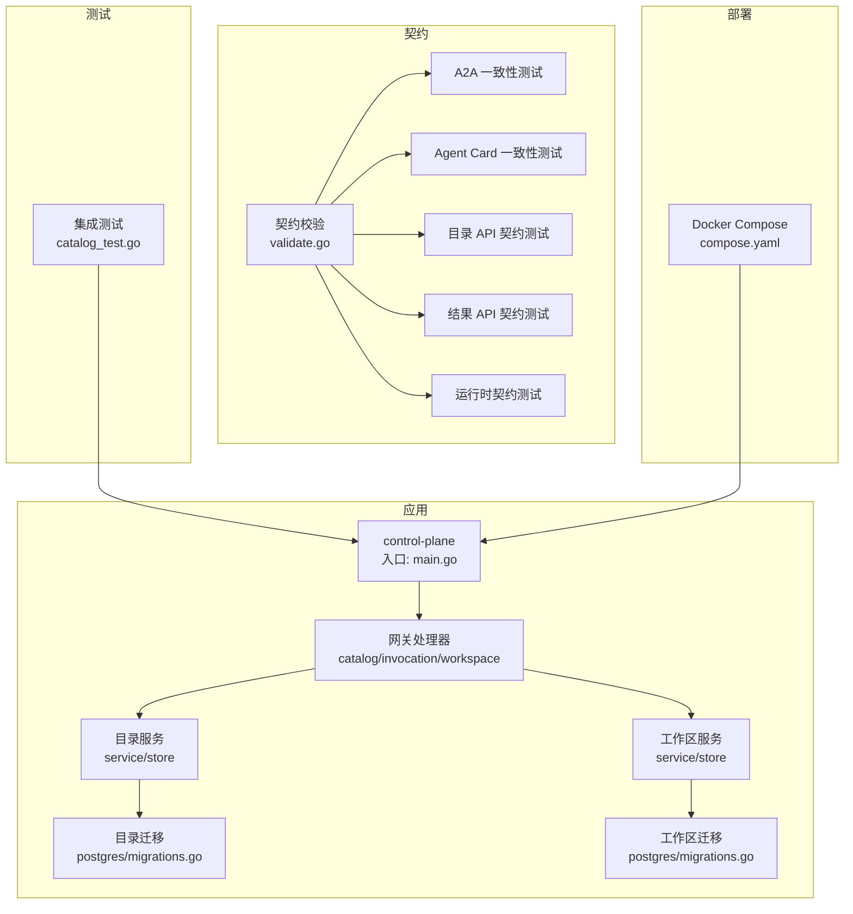
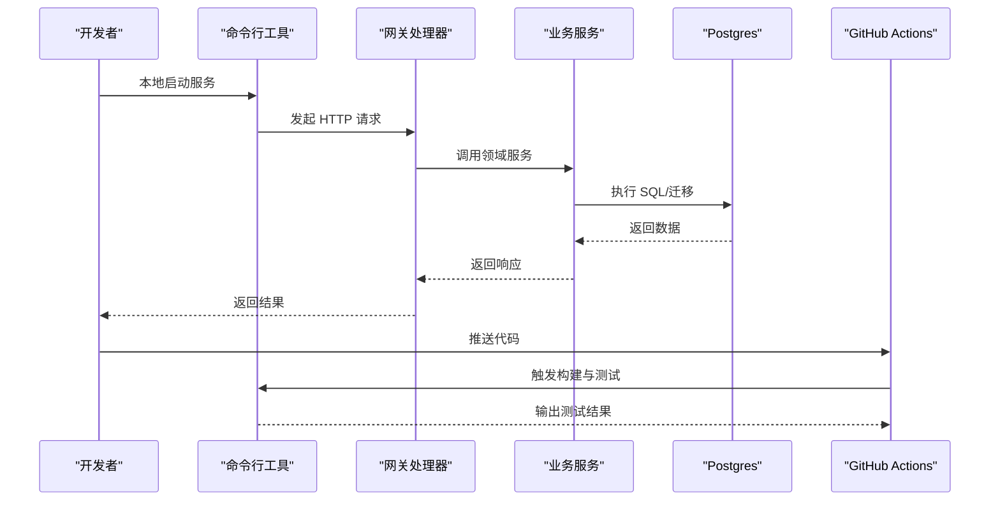
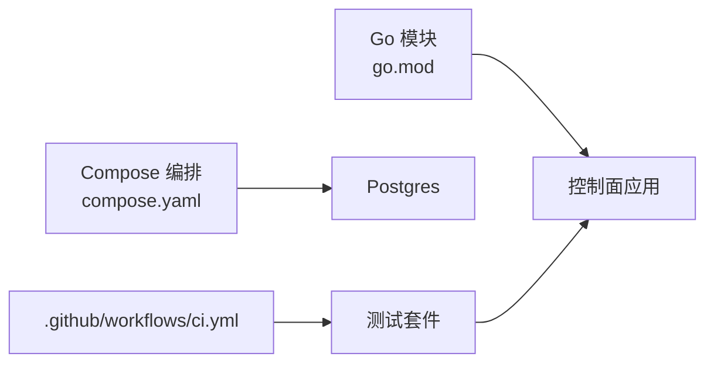

# 开发指南

<cite>
**本文引用的文件**   
- [README.md](file://README.md)
- [go.mod](file://go.mod)
- [.github/workflows/ci.yml](file://.github/workflows/ci.yml)
- [deploy/compose.yaml](file://deploy/compose.yaml)
- [apps/control-plane/cmd/control-plane/main.go](file://apps/control-plane/cmd/control-plane/main.go)
- [apps/control-plane/internal/config/config.go](file://apps/control-plane/internal/config/config.go)
- [apps/control-plane/internal/gateway/catalog_handler.go](file://apps/control-plane/internal/gateway/catalog_handler.go)
- [apps/control-plane/internal/gateway/invocation_handler.go](file://apps/control-plane/internal/gateway/invocation_handler.go)
- [apps/control-plane/internal/gateway/workspace_handler.go](file://apps/control-plane/internal/gateway/workspace_handler.go)
- [apps/control-plane/internal/catalog/service.go](file://apps/control-plane/internal/catalog/service.go)
- [apps/control-plane/internal/catalog/store.go](file://apps/control-plane/internal/catalog/store.go)
- [apps/control-plane/internal/catalog/postgres/migrations.go](file://apps/control-plane/internal/catalog/postgres/migrations.go)
- [apps/control-plane/internal/workspace/service.go](file://apps/control-plane/internal/workspace/service.go)
- [apps/control-plane/internal/workspace/store.go](file://apps/control-plane/internal/workspace/store.go)
- [apps/control-plane/internal/workspace/postgres/migrations.go](file://apps/control-plane/internal/workspace/postgres/migrations.go)
- [contracts/validate.go](file://contracts/validate.go)
- [contracts/a2a_profile_conformance_test.go](file://contracts/a2a_profile_conformance_test.go)
- [contracts/agent_card_conformance_test.go](file://contracts/agent_card_conformance_test.go)
- [contracts/catalog_api_contracts_test.go](file://contracts/catalog_api_contracts_test.go)
- [contracts/result_api_contracts_test.go](file://contracts/result_api_contracts_test.go)
- [contracts/runtime_contracts_test.go](file://contracts/runtime_contracts_test.go)
- [tests/integration/catalog/catalog_test.go](file://tests/integration/catalog/catalog_test.go)
- [docs/runbooks/local-development.md](file://docs/runbooks/local-development.md)
</cite>

## 目录
1. [简介](#简介)
2. [项目结构](#项目结构)
3. [核心组件](#核心组件)
4. [架构总览](#架构总览)
5. [详细组件分析](#详细组件分析)
6. [依赖分析](#依赖分析)
7. [性能考虑](#性能考虑)
8. [故障排查指南](#故障排查指南)
9. [结论](#结论)
10. [附录](#附录)

## 简介
本指南面向 NeKiro 平台的开发者，提供从环境搭建、依赖安装、本地运行到代码规范、测试策略、贡献流程、构建发布与调试排障的完整路径。平台采用 Go 后端为主，配合 OpenAPI/JSON Schema 契约与多版本协议演进，通过 Docker Compose 快速启动本地依赖服务（如数据库），并以 GitHub Actions 驱动持续集成。

## 项目结构
仓库采用“应用 + 契约 + 测试 + 部署”的分层组织方式：
- apps：可执行应用入口与内部实现（控制面）
- contracts：协议契约定义与一致性校验
- tests：集成测试与用例数据
- deploy：容器编排脚本
- docs：设计决策、运行手册与路线图
- .github/workflows：CI 流水线

图表来源
- [apps/control-plane/cmd/control-plane/main.go](file://apps/control-plane/cmd/control-plane/main.go)
- [apps/control-plane/internal/gateway/catalog_handler.go](file://apps/control-plane/internal/gateway/catalog_handler.go)
- [apps/control-plane/internal/gateway/invocation_handler.go](file://apps/control-plane/internal/gateway/invocation_handler.go)
- [apps/control-plane/internal/gateway/workspace_handler.go](file://apps/control-plane/internal/gateway/workspace_handler.go)
- [apps/control-plane/internal/catalog/service.go](file://apps/control-plane/internal/catalog/service.go)
- [apps/control-plane/internal/catalog/store.go](file://apps/control-plane/internal/catalog/store.go)
- [apps/control-plane/internal/catalog/postgres/migrations.go](file://apps/control-plane/internal/catalog/postgres/migrations.go)
- [apps/control-plane/internal/workspace/service.go](file://apps/control-plane/internal/workspace/service.go)
- [apps/control-plane/internal/workspace/store.go](file://apps/control-plane/internal/workspace/store.go)
- [apps/control-plane/internal/workspace/postgres/migrations.go](file://apps/control-plane/internal/workspace/postgres/migrations.go)
- [contracts/validate.go](file://contracts/validate.go)
- [contracts/a2a_profile_conformance_test.go](file://contracts/a2a_profile_conformance_test.go)
- [contracts/agent_card_conformance_test.go](file://contracts/agent_card_conformance_test.go)
- [contracts/catalog_api_contracts_test.go](file://contracts/catalog_api_contracts_test.go)
- [contracts/result_api_contracts_test.go](file://contracts/result_api_contracts_test.go)
- [contracts/runtime_contracts_test.go](file://contracts/runtime_contracts_test.go)
- [tests/integration/catalog/catalog_test.go](file://tests/integration/catalog/catalog_test.go)
- [deploy/compose.yaml](file://deploy/compose.yaml)

章节来源
- [README.md](file://README.md)
- [go.mod](file://go.mod)
- [deploy/compose.yaml](file://deploy/compose.yaml)

## 核心组件
- 控制面入口与配置加载
  - 入口程序负责初始化配置、日志、路由与生命周期管理。
  - 配置模块集中读取环境变量与配置文件，提供强类型配置对象。
- 网关层（HTTP 路由与鉴权）
  - 按领域划分处理器：目录、调用、工作区。
  - 统一错误处理、追踪与鉴权中间件。
- 业务服务层
  - 目录服务与工作区服务分别封装领域逻辑与存储访问。
- 持久化与迁移
  - 基于 Postgres 的迁移脚本与存储实现。
- 契约与一致性
  - 使用 JSON Schema/OpenAPI 进行请求/响应校验与兼容性测试。

章节来源
- [apps/control-plane/cmd/control-plane/main.go](file://apps/control-plane/cmd/control-plane/main.go)
- [apps/control-plane/internal/config/config.go](file://apps/control-plane/internal/config/config.go)
- [apps/control-plane/internal/gateway/catalog_handler.go](file://apps/control-plane/internal/gateway/catalog_handler.go)
- [apps/control-plane/internal/gateway/invocation_handler.go](file://apps/control-plane/internal/gateway/invocation_handler.go)
- [apps/control-plane/internal/gateway/workspace_handler.go](file://apps/control-plane/internal/gateway/workspace_handler.go)
- [apps/control-plane/internal/catalog/service.go](file://apps/control-plane/internal/catalog/service.go)
- [apps/control-plane/internal/catalog/store.go](file://apps/control-plane/internal/catalog/store.go)
- [apps/control-plane/internal/workspace/service.go](file://apps/control-plane/internal/workspace/service.go)
- [apps/control-plane/internal/workspace/store.go](file://apps/control-plane/internal/workspace/store.go)
- [apps/control-plane/internal/catalog/postgres/migrations.go](file://apps/control-plane/internal/catalog/postgres/migrations.go)
- [apps/control-plane/internal/workspace/postgres/migrations.go](file://apps/control-plane/internal/workspace/postgres/migrations.go)

## 架构总览
NeKiro 控制面以 HTTP 网关为入口，将请求分发至各业务服务，服务再访问数据库完成读写。契约层贯穿开发与测试阶段，确保接口稳定与兼容。

图表来源
- [apps/control-plane/cmd/control-plane/main.go](file://apps/control-plane/cmd/control-plane/main.go)
- [apps/control-plane/internal/gateway/catalog_handler.go](file://apps/control-plane/internal/gateway/catalog_handler.go)
- [apps/control-plane/internal/catalog/service.go](file://apps/control-plane/internal/catalog/service.go)
- [apps/control-plane/internal/catalog/store.go](file://apps/control-plane/internal/catalog/store.go)
- [apps/control-plane/internal/catalog/postgres/migrations.go](file://apps/control-plane/internal/catalog/postgres/migrations.go)
- [.github/workflows/ci.yml](file://.github/workflows/ci.yml)

## 详细组件分析

### 控制面入口与配置
- 职责
  - 解析配置、初始化日志与路由、注册处理器、启动监听。
- 关键要点
  - 配置项来源于环境变量或配置文件，建议在生产环境通过密钥管理服务注入。
  - 健康检查与优雅关闭需覆盖在入口中。

章节来源
- [apps/control-plane/cmd/control-plane/main.go](file://apps/control-plane/cmd/control-plane/main.go)
- [apps/control-plane/internal/config/config.go](file://apps/control-plane/internal/config/config.go)

### 网关层（目录/调用/工作区）
- 职责
  - 解析请求、鉴权、限流、追踪、错误归一化、转发至服务层。
- 关键要点
  - 每个领域处理器独立，便于扩展与维护。
  - 鉴权与追踪应作为通用中间件复用。

章节来源
- [apps/control-plane/internal/gateway/catalog_handler.go](file://apps/control-plane/internal/gateway/catalog_handler.go)
- [apps/control-plane/internal/gateway/invocation_handler.go](file://apps/control-plane/internal/gateway/invocation_handler.go)
- [apps/control-plane/internal/gateway/workspace_handler.go](file://apps/control-plane/internal/gateway/workspace_handler.go)

### 目录服务与存储
- 职责
  - 目录实体的增删改查、游标分页、事务边界与幂等性。
- 关键要点
  - 存储层抽象出接口，便于替换实现与单元测试 Mock。
  - 迁移脚本与版本号管理需与部署流程对齐。

章节来源
- [apps/control-plane/internal/catalog/service.go](file://apps/control-plane/internal/catalog/service.go)
- [apps/control-plane/internal/catalog/store.go](file://apps/control-plane/internal/catalog/store.go)
- [apps/control-plane/internal/catalog/postgres/migrations.go](file://apps/control-plane/internal/catalog/postgres/migrations.go)

### 工作区服务与存储
- 职责
  - 工作区生命周期、权限策略、安装与巡检。
- 关键要点
  - 与目录服务类似，遵循相同的服务/存储分层模式。
  - 迁移脚本需保证幂等与回滚能力。

章节来源
- [apps/control-plane/internal/workspace/service.go](file://apps/control-plane/internal/workspace/service.go)
- [apps/control-plane/internal/workspace/store.go](file://apps/control-plane/internal/workspace/store.go)
- [apps/control-plane/internal/workspace/postgres/migrations.go](file://apps/control-plane/internal/workspace/postgres/migrations.go)

### 契约校验与一致性测试
- 职责
  - 基于 JSON Schema/OpenAPI 对请求/响应进行校验；维护多版本契约与兼容性矩阵。
- 关键要点
  - 新增字段需同时更新 schema 与测试用例。
  - 兼容性测试应在 CI 中强制通过。

章节来源
- [contracts/validate.go](file://contracts/validate.go)
- [contracts/a2a_profile_conformance_test.go](file://contracts/a2a_profile_conformance_test.go)
- [contracts/agent_card_conformance_test.go](file://contracts/agent_card_conformance_test.go)
- [contracts/catalog_api_contracts_test.go](file://contracts/catalog_api_contracts_test.go)
- [contracts/result_api_contracts_test.go](file://contracts/result_api_contracts_test.go)
- [contracts/runtime_contracts_test.go](file://contracts/runtime_contracts_test.go)

### 集成测试（目录）
- 职责
  - 端到端验证目录相关 API 的行为与数据一致性。
- 关键要点
  - 使用独立的测试数据库实例，避免污染主库。
  - 测试前自动执行迁移，测试后清理数据。

章节来源
- [tests/integration/catalog/catalog_test.go](file://tests/integration/catalog/catalog_test.go)

## 依赖分析
- 语言与包管理
  - Go 模块与依赖锁定由 go.mod/go.sum 管理。
- 外部依赖
  - 数据库：Postgres（通过迁移脚本与连接参数配置）。
  - 容器编排：Docker Compose 用于本地一键拉起依赖服务。
- 持续集成
  - GitHub Actions 流水线负责构建、测试与静态检查。

图表来源
- [go.mod](file://go.mod)
- [deploy/compose.yaml](file://deploy/compose.yaml)
- [.github/workflows/ci.yml](file://.github/workflows/ci.yml)

章节来源
- [go.mod](file://go.mod)
- [deploy/compose.yaml](file://deploy/compose.yaml)
- [.github/workflows/ci.yml](file://.github/workflows/ci.yml)

## 性能考虑
- 连接池与超时
  - 合理设置数据库连接池大小、查询超时与重试退避策略。
- 索引与分页
  - 针对高频查询建立合适索引；使用游标分页替代偏移分页。
- 序列化与传输
  - 减少不必要的字段；必要时启用压缩与缓存。
- 并发与锁
  - 避免热点行锁竞争；对写操作进行批量化与去重。
- 观测性
  - 增加指标、日志与链路追踪，定位瓶颈。

[本节为通用指导，不直接分析具体文件]

## 故障排查指南
- 本地无法连接数据库
  - 检查 compose 是否成功启动、端口映射与环境变量是否正确。
- 迁移失败
  - 确认迁移脚本幂等性与版本号顺序；查看迁移日志定位具体语句。
- 契约测试失败
  - 对照最新 schema 与 conformance 用例，修复请求/响应结构。
- 网关鉴权失败
  - 核对令牌格式、签名算法与白名单配置。
- 常见调试技巧
  - 开启详细日志与追踪 ID；使用断点与单测逐步定位。
  - 利用最小复现用例与隔离测试数据库。

章节来源
- [deploy/compose.yaml](file://deploy/compose.yaml)
- [apps/control-plane/internal/catalog/postgres/migrations.go](file://apps/control-plane/internal/catalog/postgres/migrations.go)
- [apps/control-plane/internal/workspace/postgres/migrations.go](file://apps/control-plane/internal/workspace/postgres/migrations.go)
- [contracts/validate.go](file://contracts/validate.go)

## 结论
本指南梳理了 NeKiro 控制面的结构与开发流程，涵盖环境搭建、代码规范、测试策略、贡献与发布、以及常见问题排查。建议新加入的开发者优先阅读本地开发手册与契约说明，结合示例单测与集成测试快速上手。

[本节为总结性内容，不直接分析具体文件]

## 附录

### 开发环境搭建与本地运行
- 前置要求
  - Go 工具链、Docker 与 Docker Compose。
- 依赖安装
  - 拉取仓库后，使用 Go 模块下载依赖。
- 本地运行
  - 使用 Compose 启动数据库等依赖服务。
  - 配置必要的环境变量（数据库地址、端口、鉴权信息等）。
  - 编译并运行控制面入口程序。
- 参考文档
  - 本地开发运行手册位于 docs/runbooks/local-development.md。

章节来源
- [docs/runbooks/local-development.md](file://docs/runbooks/local-development.md)
- [deploy/compose.yaml](file://deploy/compose.yaml)
- [apps/control-plane/cmd/control-plane/main.go](file://apps/control-plane/cmd/control-plane/main.go)

### Go 语言规范与命名约定
- 包与文件
  - 包名短小且语义清晰；文件名与主要类型保持一致。
- 命名
  - 导出标识符首字母大写；非导出标识符首字母小写；缩写保持全大写或全小写一致。
- 错误处理
  - 显式处理错误，避免忽略；自定义错误类型携带上下文信息。
- 注释
  - 对外暴露的函数/类型必须提供 godoc 风格注释；复杂逻辑补充行内注释。
- 格式化与静态检查
  - 使用 gofmt/goimports；提交前运行静态检查与 vet。

[本节为通用规范，不直接分析具体文件]

### 代码结构与注释标准
- 分层
  - 网关层仅做请求解析与转发；服务层承载业务逻辑；存储层专注数据访问。
- 错误与日志
  - 统一错误码与消息；结构化日志包含请求 ID、用户与资源标识。
- 配置
  - 所有外部依赖地址、开关与凭据通过配置中心或环境变量注入。

章节来源
- [apps/control-plane/internal/config/config.go](file://apps/control-plane/internal/config/config.go)
- [apps/control-plane/internal/gateway/catalog_handler.go](file://apps/control-plane/internal/gateway/catalog_handler.go)
- [apps/control-plane/internal/catalog/service.go](file://apps/control-plane/internal/catalog/service.go)
- [apps/control-plane/internal/catalog/store.go](file://apps/control-plane/internal/catalog/store.go)

### 测试策略
- 单元测试
  - 对服务层与存储层进行隔离测试；使用内存或 Mock 实现外部依赖。
- 集成测试
  - 使用真实数据库与迁移脚本，验证端到端流程。
- 契约测试
  - 基于 JSON Schema/OpenAPI 的 conformance 用例，确保接口兼容。
- 性能测试
  - 对热点接口进行基准测试与压测，关注延迟与吞吐。

章节来源
- [contracts/a2a_profile_conformance_test.go](file://contracts/a2a_profile_conformance_test.go)
- [contracts/agent_card_conformance_test.go](file://contracts/agent_card_conformance_test.go)
- [contracts/catalog_api_contracts_test.go](file://contracts/catalog_api_contracts_test.go)
- [contracts/result_api_contracts_test.go](file://contracts/result_api_contracts_test.go)
- [contracts/runtime_contracts_test.go](file://contracts/runtime_contracts_test.go)
- [tests/integration/catalog/catalog_test.go](file://tests/integration/catalog/catalog_test.go)

### 代码贡献流程与提交规范
- 分支模型
  - 功能分支从主干切出，完成后提交合并请求。
- 提交信息
  - 使用清晰的标题与描述，关联任务编号；变更影响范围明确。
- 代码审查
  - 至少一名 reviewer；关注正确性、可读性与可维护性。
- 自动化检查
  - 通过 CI 的构建、测试与静态检查后方可合并。

章节来源
- [.github/workflows/ci.yml](file://.github/workflows/ci.yml)

### 构建与发布流程
- 构建
  - 使用 Go 构建产物；生成二进制镜像。
- 镜像与编排
  - 通过 Dockerfile 与 Compose 打包应用与依赖。
- 发布
  - 打标签并推送镜像；更新编排清单与配置；灰度发布与回滚预案。

章节来源
- [deploy/compose.yaml](file://deploy/compose.yaml)
- [.github/workflows/ci.yml](file://.github/workflows/ci.yml)

### 新开发者入门路径
- 阅读 README 与本地开发手册，了解整体目标与运行方式。
- 克隆仓库，安装依赖，使用 Compose 启动本地环境。
- 运行单测与契约测试，确保环境可用。
- 选择一个小型需求，按照贡献流程提交 PR 并通过审查。

章节来源
- [README.md](file://README.md)
- [docs/runbooks/local-development.md](file://docs/runbooks/local-development.md)