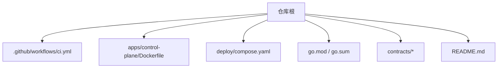
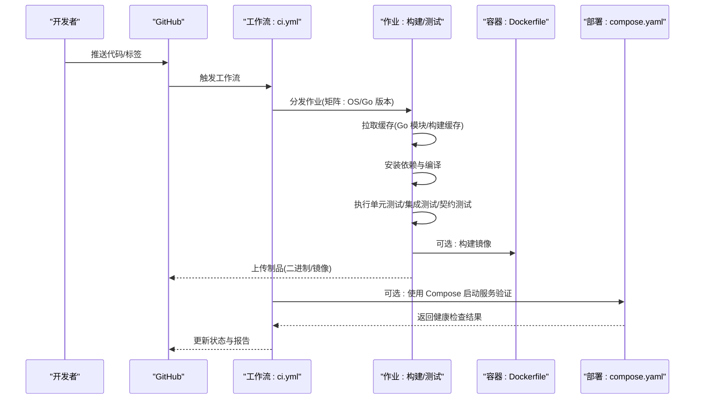
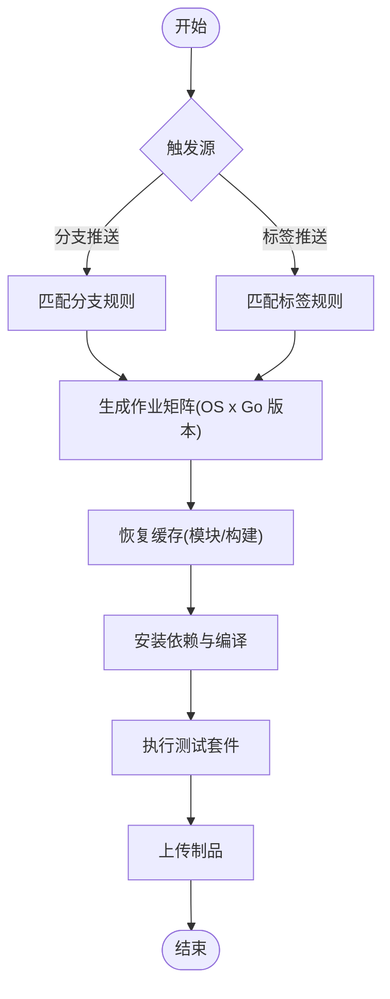
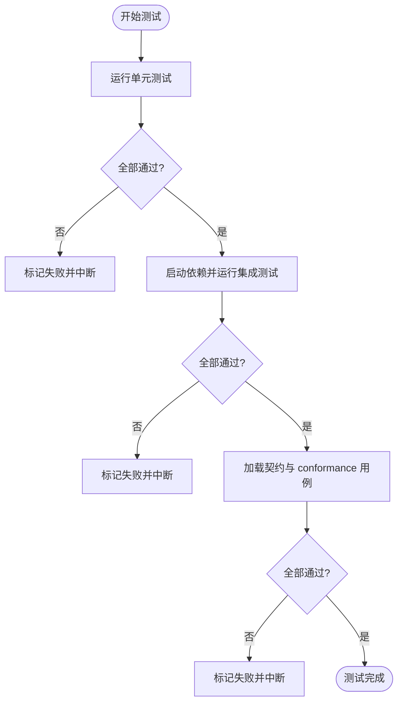
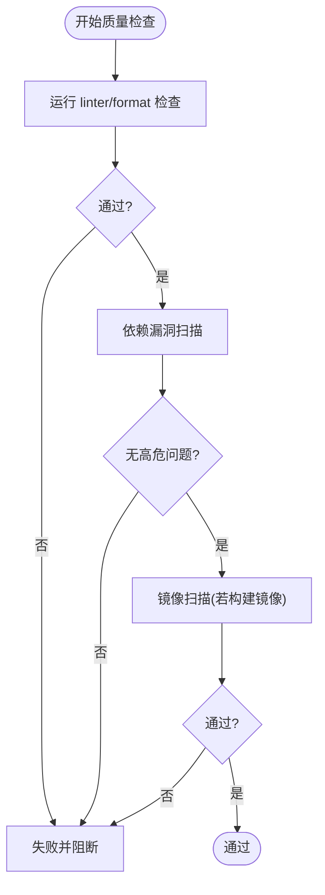
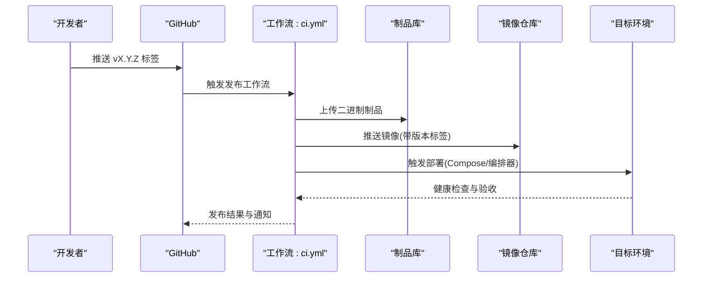
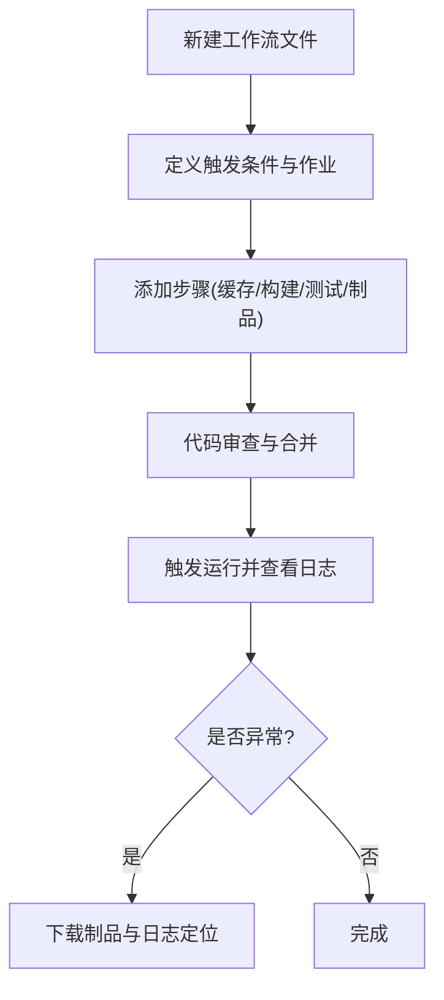
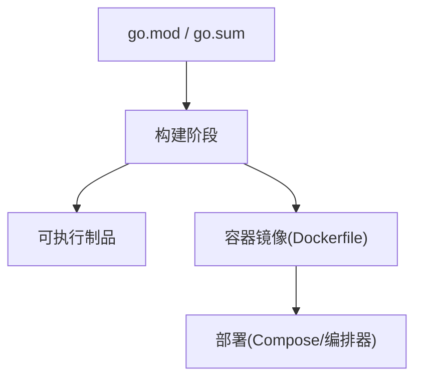

# CI/CD 流水线

<cite>
**本文引用的文件**
- [ci.yml](file://.github/workflows/ci.yml)
- [Dockerfile](file://apps/control-plane/Dockerfile)
- [compose.yaml](file://deploy/compose.yaml)
- [go.mod](file://go.mod)
- [README.md](file://README.md)
</cite>

## 目录
1. [简介](#简介)
2. [项目结构](#项目结构)
3. [核心组件](#核心组件)
4. [架构总览](#架构总览)
5. [详细组件分析](#详细组件分析)
6. [依赖分析](#依赖分析)
7. [性能考虑](#性能考虑)
8. [故障排查指南](#故障排查指南)
9. [结论](#结论)
10. [附录](#附录)

## 简介
本文件为 NeKiro 平台的 CI/CD 流水线文档，聚焦于 GitHub Actions 工作流配置与编排、自动化测试策略（单元、集成、契约）、代码质量与安全扫描、制品归档与发布流程，以及自定义工作流的开发与排障方法。目标是帮助开发者快速理解现有流水线并安全扩展。

## 项目结构
仓库采用多应用与多合约组织方式：
- .github/workflows：GitHub Actions 工作流定义
- apps/control-plane：控制面服务源码与 Dockerfile
- contracts：A2A/Agent Card/OpenAPI 等契约与一致性测试数据
- deploy：本地与演示环境编排（Compose）
- go.mod/go.sum：Go 模块与依赖锁定
- README.md：项目说明与入口指引

**图表来源**
- [ci.yml](file://.github/workflows/ci.yml)
- [Dockerfile](file://apps/control-plane/Dockerfile)
- [compose.yaml](file://deploy/compose.yaml)
- [go.mod](file://go.mod)
- [README.md](file://README.md)

**章节来源**
- [ci.yml](file://.github/workflows/ci.yml)
- [Dockerfile](file://apps/control-plane/Dockerfile)
- [compose.yaml](file://deploy/compose.yaml)
- [go.mod](file://go.mod)
- [README.md](file://README.md)

## 核心组件
- 工作流触发条件：基于分支与标签的推送事件触发构建与测试任务
- 作业矩阵：按 Go 版本与操作系统组合并行执行
- 缓存策略：对 Go 模块下载与构建产物进行缓存，加速后续运行
- 测试套件：单元测试、集成测试与契约测试分层执行
- 制品输出：将可执行二进制或镜像作为工件上传，便于后续部署
- 部署编排：通过 Compose 在本地或临时环境中启动服务以验证端到端流程

**章节来源**
- [ci.yml](file://.github/workflows/ci.yml)
- [Dockerfile](file://apps/control-plane/Dockerfile)
- [compose.yaml](file://deploy/compose.yaml)

## 架构总览
下图展示了从代码提交到制品产出的关键步骤与交互关系。

**图表来源**
- [ci.yml](file://.github/workflows/ci.yml)
- [Dockerfile](file://apps/control-plane/Dockerfile)
- [compose.yaml](file://deploy/compose.yaml)

## 详细组件分析

### 工作流触发与作业编排
- 触发条件
  - 分支推送：当向受保护分支（如 main/master）推送时触发
  - 标签推送：当推送符合语义化版本的标签时触发
- 作业矩阵
  - 操作系统：Linux、Windows、macOS
  - Go 版本：指定多个稳定版本，确保跨平台兼容性
- 缓存
  - 模块缓存：基于 go.sum 键命中，避免重复下载
  - 构建缓存：基于目标与平台键命中，提升增量构建速度
- 环境变量与密钥
  - 通过 secrets 注入敏感信息（如镜像仓库凭据）
  - 通过 env 注入通用变量（如 GOFLAGS、CGO_ENABLED）

**图表来源**
- [ci.yml](file://.github/workflows/ci.yml)

**章节来源**
- [ci.yml](file://.github/workflows/ci.yml)

### 自动化测试流程
- 单元测试
  - 针对 Go 包内函数与方法的白盒测试，覆盖核心逻辑
  - 建议开启竞态检测与短超时，保证快速反馈
- 集成测试
  - 针对数据库迁移、存储层与外部依赖的协作场景
  - 使用临时数据库或服务容器，测试后清理资源
- 契约测试
  - 基于 contracts 目录下的 OpenAPI、JSON Schema 与 conformance 用例
  - 校验服务端响应与请求结构是否符合约定，保障向后兼容

**图表来源**
- [ci.yml](file://.github/workflows/ci.yml)

**章节来源**
- [ci.yml](file://.github/workflows/ci.yml)

### 代码质量检查与安全扫描
- 静态分析与格式化
  - 使用 Go 官方工具链进行格式检查与基础静态分析
  - 建议在 PR 阶段强制通过，防止风格漂移
- 安全扫描
  - 依赖漏洞扫描：基于 go.sum 与第三方库清单进行风险识别
  - 容器镜像扫描：在构建镜像后进行镜像层漏洞检测
- 许可证合规
  - 扫描依赖许可证类型，阻断高风险许可证进入制品

**图表来源**
- [ci.yml](file://.github/workflows/ci.yml)
- [Dockerfile](file://apps/control-plane/Dockerfile)

**章节来源**
- [ci.yml](file://.github/workflows/ci.yml)
- [Dockerfile](file://apps/control-plane/Dockerfile)

### 发布流程：版本管理、制品归档与部署
- 版本号管理
  - 基于 Git 标签驱动发布，标签需遵循语义化版本规范
  - 工作流根据标签生成制品名称与镜像标签
- 制品归档
  - 将编译产物（二进制、压缩包）上传至 GitHub Artifacts
  - 可选：推送镜像至容器镜像仓库（私有或公共）
- 部署策略
  - 开发/预发：使用 Compose 启动服务进行冒烟测试
  - 生产：通过受控通道发布镜像与配置，配合灰度与回滚策略

**图表来源**
- [ci.yml](file://.github/workflows/ci.yml)
- [Dockerfile](file://apps/control-plane/Dockerfile)
- [compose.yaml](file://deploy/compose.yaml)

**章节来源**
- [ci.yml](file://.github/workflows/ci.yml)
- [Dockerfile](file://apps/control-plane/Dockerfile)
- [compose.yaml](file://deploy/compose.yaml)

### 自定义工作流开发指导
- 新增工作流
  - 在 .github/workflows 下创建新 YAML 文件，定义 name、on、jobs
  - 复用已有缓存与测试步骤，保持行为一致
- 最佳实践
  - 使用矩阵减少重复配置
  - 明确缓存键，避免污染
  - 为长耗时任务设置超时与重试
- 调试技巧
  - 启用详细日志输出
  - 使用 actions/upload-artifact 保存中间产物以便离线分析
  - 在本地使用 act 模拟运行（可选）

**图表来源**
- [ci.yml](file://.github/workflows/ci.yml)

**章节来源**
- [ci.yml](file://.github/workflows/ci.yml)

## 依赖分析
- 运行时依赖
  - Go 标准库与第三方模块由 go.mod 声明，go.sum 锁定版本
- 构建期依赖
  - GitHub Actions 提供的 Ubuntu/Windows/macOS 运行环境与 Go 工具链
- 外部服务依赖
  - 集成测试可能依赖数据库或消息队列，建议使用容器化或内存实现
- 镜像依赖
  - Dockerfile 基于官方基础镜像，按需安装系统依赖与运行时

**图表来源**
- [go.mod](file://go.mod)
- [Dockerfile](file://apps/control-plane/Dockerfile)
- [compose.yaml](file://deploy/compose.yaml)

**章节来源**
- [go.mod](file://go.mod)
- [Dockerfile](file://apps/control-plane/Dockerfile)
- [compose.yaml](file://deploy/compose.yaml)

## 性能考虑
- 缓存命中率
  - 合理拆分缓存键，区分不同平台与 Go 版本
  - 定期清理过期缓存，避免体积膨胀
- 并行化
  - 使用矩阵并行执行不同平台与 Go 版本
  - 将独立测试分组并行，缩短整体时长
- 增量构建
  - 利用 Go 构建缓存与只读文件系统，减少重复编译
- 资源限制
  - 为大型测试分配更大实例或增加超时时间
  - 避免在 CI 中运行重型 GUI 或桌面相关任务

[本节为通用指导，不直接分析具体文件]

## 故障排查指南
- 常见问题
  - 缓存未命中：检查缓存键是否与平台/Go 版本匹配
  - 网络超时：配置代理或使用国内镜像源
  - 权限不足：确认 secrets 与仓库权限配置正确
  - 镜像构建失败：检查 Dockerfile 基础镜像可达性与依赖安装命令
- 定位方法
  - 查看工作流运行日志，关注失败步骤上下文
  - 下载制品与日志，复现问题
  - 在本地使用相同 Go 版本与环境复测
- 恢复策略
  - 回滚到上一个成功构建的制品或镜像
  - 修复后重新触发工作流，必要时手动清理缓存

**章节来源**
- [ci.yml](file://.github/workflows/ci.yml)
- [Dockerfile](file://apps/control-plane/Dockerfile)
- [compose.yaml](file://deploy/compose.yaml)

## 结论
NeKiro 的 CI/CD 流水线围绕“快速反馈、可靠构建、严格契约、可控发布”展开。通过矩阵化作业、缓存优化、分层测试与制品归档，既保证了日常开发的效率，也为正式发布提供了安全保障。建议持续完善安全扫描与镜像治理，并在发布环节引入灰度与回滚机制，进一步提升稳定性与可观测性。

[本节为总结性内容，不直接分析具体文件]

## 附录
- 术语
  - 制品：构建产物（二进制、压缩包、镜像等）
  - 契约测试：基于接口约定的自动化测试，确保前后端或上下游兼容
  - 语义化版本：主版本.次版本.修订号，用于驱动发布流程
- 参考
  - 项目说明与使用说明参见 README

**章节来源**
- [README.md](file://README.md)