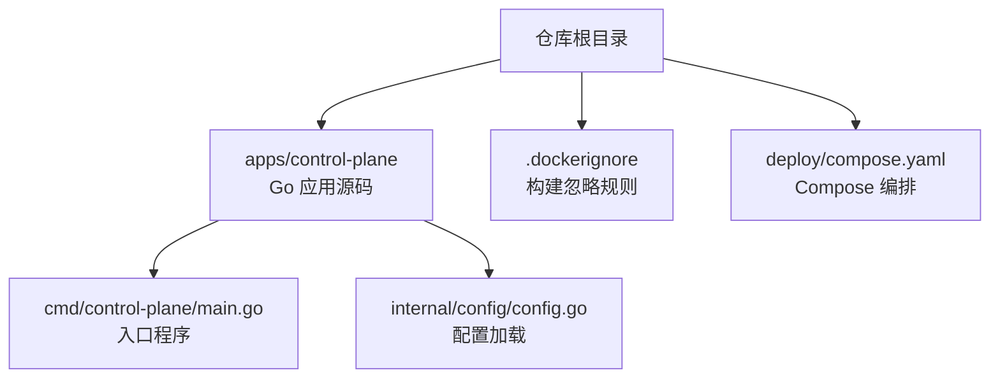
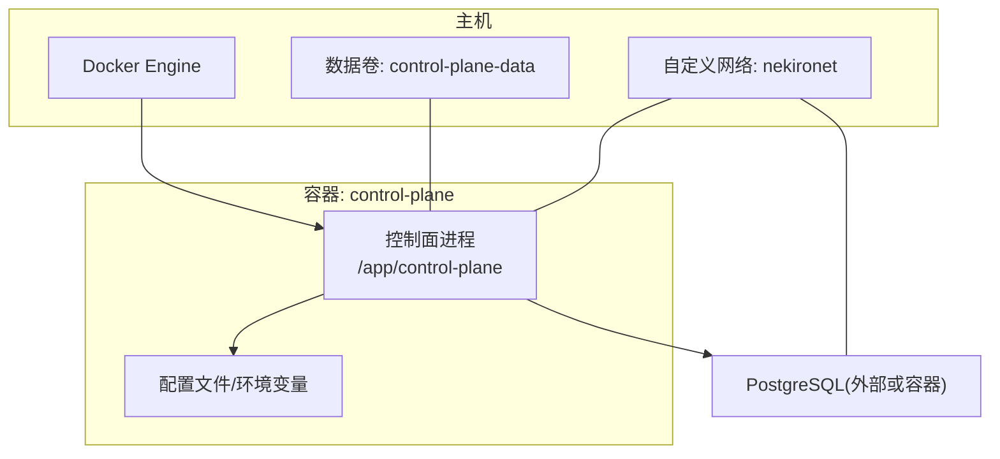
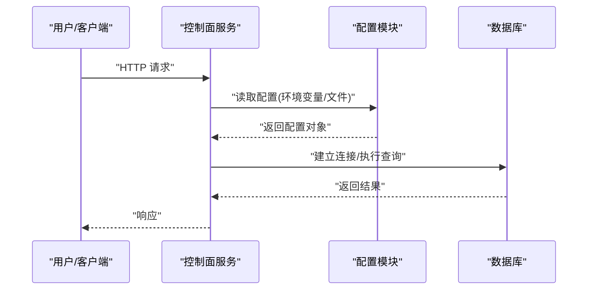
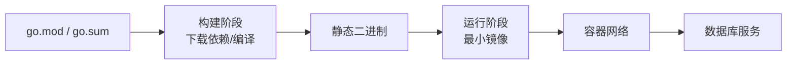

# Docker 容器化

<cite>
**本文引用的文件**   
- [Dockerfile](file://apps/control-plane/Dockerfile)
- [.dockerignore](file://.dockerignore)
- [compose.yaml](file://deploy/compose.yaml)
- [main.go](file://apps/control-plane/cmd/control-plane/main.go)
- [config.go](file://apps/control-plane/internal/config/config.go)
</cite>

## 目录
1. [简介](#简介)
2. [项目结构](#项目结构)
3. [核心组件](#核心组件)
4. [架构总览](#架构总览)
5. [详细组件分析](#详细组件分析)
6. [依赖分析](#依赖分析)
7. [性能考虑](#性能考虑)
8. [故障排查指南](#故障排查指南)
9. [结论](#结论)
10. [附录](#附录)

## 简介
本文件面向 NeKiro 平台的容器化实践，聚焦以下目标：
- 多阶段构建流程与镜像优化策略
- .dockerignore 的作用与最佳配置
- Docker Compose 编排（服务、网络、数据卷、环境变量）
- 镜像安全扫描与安全基线建议
- 容器调试与日志收集方法

## 项目结构
NeKiro 平台采用 Go 后端，控制面应用位于 apps/control-plane。容器化相关的关键文件包括：
- 控制面应用的 Dockerfile
- 根级 .dockerignore
- deploy/compose.yaml 用于本地/开发环境编排

图表来源
- [Dockerfile](file://apps/control-plane/Dockerfile)
- [.dockerignore](file://.dockerignore)
- [compose.yaml](file://deploy/compose.yaml)
- [main.go](file://apps/control-plane/cmd/control-plane/main.go)
- [config.go](file://apps/control-plane/internal/config/config.go)

章节来源
- [Dockerfile](file://apps/control-plane/Dockerfile)
- [.dockerignore](file://.dockerignore)
- [compose.yaml](file://deploy/compose.yaml)
- [main.go](file://apps/control-plane/cmd/control-plane/main.go)
- [config.go](file://apps/control-plane/internal/config/config.go)

## 核心组件
本节从容器化视角梳理关键构件及其职责：
- 控制面应用二进制：由 Go 编译产物构成，作为运行时唯一进程
- 构建阶段：负责下载依赖、静态编译、裁剪体积
- 运行阶段：仅包含最小运行时所需内容，提升安全性与启动速度
- 编排层：通过 Compose 定义服务、网络、数据卷与环境变量

章节来源
- [Dockerfile](file://apps/control-plane/Dockerfile)
- [compose.yaml](file://deploy/compose.yaml)
- [main.go](file://apps/control-plane/cmd/control-plane/main.go)
- [config.go](file://apps/control-plane/internal/config/config.go)

## 架构总览
下图展示控制面应用在容器中的运行关系：Compose 启动服务，服务以只读文件系统运行，外部依赖通过容器网络访问。

图表来源
- [compose.yaml](file://deploy/compose.yaml)
- [main.go](file://apps/control-plane/cmd/control-plane/main.go)
- [config.go](file://apps/control-plane/internal/config/config.go)

## 详细组件分析

### 多阶段 Dockerfile 构建过程
- 基础镜像选择
  - 构建阶段：使用包含完整工具链的 Go 官方镜像，便于安装依赖与编译
  - 运行阶段：使用精简型基础镜像（如 distroless 或 Alpine），减少攻击面与镜像体积
- 依赖安装与缓存
  - 先复制 go.mod/go.sum，预拉取依赖并缓存 Go Module 缓存层，加速后续构建
- 代码编译
  - 启用 CGO 关闭、链接优化、版本注入等参数，生成静态可执行文件
- 镜像优化策略
  - 多阶段拷贝：仅将最终二进制复制到运行镜像
  - 非 root 用户运行，限制权限
  - 设置健康检查与合适的 CMD/ENTRYPOINT
  - 清理构建中间产物，避免污染运行镜像

章节来源
- [Dockerfile](file://apps/control-plane/Dockerfile)

### .dockerignore 配置与作用
- 作用
  - 排除无关文件（测试、文档、IDE 配置、Git 元数据等），减小上下文体积，加快构建
  - 防止敏感信息进入镜像
- 常见条目
  - 忽略 .git、*.md、vendor、*_test.go、*.log、*.tmp、node_modules 等
  - 保留必要的构建文件（go.mod、go.sum、Dockerfile、.dockerignore）

章节来源
- [.dockerignore](file://.dockerignore)

### Docker Compose 编排配置
- 服务定义
  - 控制面服务：指定镜像、端口映射、资源限制、重启策略
- 网络设置
  - 创建自定义网络，使服务间通信稳定且隔离
- 数据卷挂载
  - 持久化目录映射到宿主机或命名卷，保障数据不随容器销毁丢失
- 环境变量配置
  - 通过环境变量注入数据库连接、日志级别、功能开关等
  - 支持在 compose 中直接声明或通过外部 env_file 引入

章节来源
- [compose.yaml](file://deploy/compose.yaml)

### 应用入口与配置加载
- 入口程序
  - 控制面主程序负责初始化路由、监听端口、加载配置、启动服务
- 配置加载
  - 优先读取环境变量，其次读取配置文件，提供默认值与校验

图表来源
- [main.go](file://apps/control-plane/cmd/control-plane/main.go)
- [config.go](file://apps/control-plane/internal/config/config.go)

章节来源
- [main.go](file://apps/control-plane/cmd/control-plane/main.go)
- [config.go](file://apps/control-plane/internal/config/config.go)

## 依赖分析
- 构建期依赖
  - Go 标准库与第三方模块，通过 go.mod/go.sum 管理
  - 构建缓存利用 Go Module 缓存层，提高增量构建效率
- 运行期依赖
  - 控制面二进制为静态链接，无额外系统依赖
  - 外部依赖主要为数据库（如 PostgreSQL），通过容器网络访问

图表来源
- [Dockerfile](file://apps/control-plane/Dockerfile)
- [compose.yaml](file://deploy/compose.yaml)

章节来源
- [Dockerfile](file://apps/control-plane/Dockerfile)
- [compose.yaml](file://deploy/compose.yaml)

## 性能考虑
- 构建性能
  - 分层缓存：先复制 go.mod/go.sum，再复制源码，充分利用缓存层
  - 并行编译：合理设置 GOMAXPROCS 或使用构建器并行选项
- 镜像体积
  - 使用多阶段构建与精简运行镜像
  - 清理包管理器缓存与临时文件
- 运行性能
  - 调整容器 CPU/内存限制，避免争用
  - 使用只读根文件系统，减少写入开销
  - 合理设置健康检查，缩短故障恢复时间

[本节为通用指导，无需特定文件引用]

## 故障排查指南
- 常见问题定位
  - 启动失败：检查环境变量与配置文件是否齐全；查看容器日志
  - 无法连接数据库：确认网络连通性、端口映射、凭据正确性
  - 权限问题：确保运行用户具备必要目录读写权限
- 日志收集
  - 使用 docker logs 收集标准输出
  - 将应用日志输出到标准输出，便于集中采集
  - 生产环境建议接入结构化日志与链路追踪
- 调试技巧
  - 在开发镜像中保留调试工具（如 strace、gdb），但生产镜像禁用
  - 使用 exec 进入容器进行交互式诊断
  - 开启更详细的日志级别进行问题复现

章节来源
- [compose.yaml](file://deploy/compose.yaml)
- [main.go](file://apps/control-plane/cmd/control-plane/main.go)
- [config.go](file://apps/control-plane/internal/config/config.go)

## 结论
通过多阶段构建、严格的 .dockerignore、合理的 Compose 编排以及完善的安全与运维策略，NeKiro 控制面可在保证安全性的前提下获得更小的镜像体积与更快的启动速度。建议在 CI/CD 流水线中集成镜像扫描与健康检查，持续改进镜像质量与运行稳定性。

[本节为总结性内容，无需特定文件引用]

## 附录

### 镜像安全扫描与最佳实践
- 扫描工具
  - Trivy、Grype、Clair 等，建议在 CI 中自动扫描并阻断高危漏洞
- 安全基线
  - 使用非 root 用户运行
  - 最小权限原则：仅暴露必要端口
  - 定期更新基础镜像与依赖
  - 对敏感信息进行密钥管理（避免硬编码）

[本节为通用指导，无需特定文件引用]

### 容器调试与日志收集清单
- 快速验证
  - docker ps/docker inspect 查看状态与配置
  - docker logs 查看标准输出
- 深入诊断
  - docker exec 进入容器
  - 抓取堆栈与 goroutine 信息（Go 应用）
  - 网络连通性测试（nslookup、curl、telnet）
- 日志方案
  - 统一输出 JSON 格式
  - 结合侧车或日志代理（如 Fluent Bit）转发至集中存储

[本节为通用指导，无需特定文件引用]