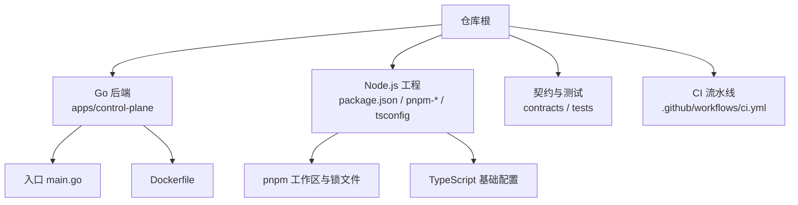
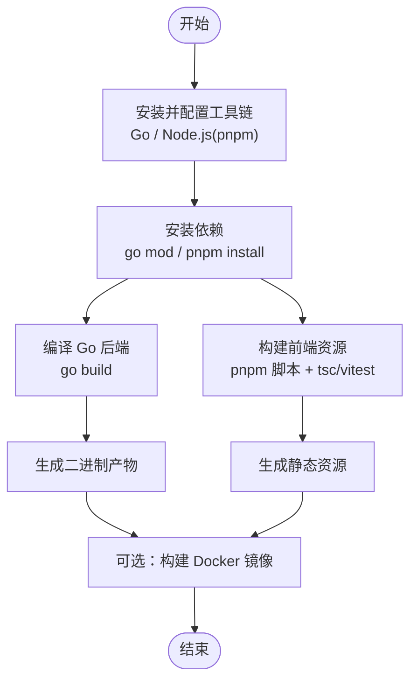
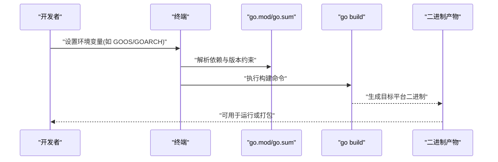
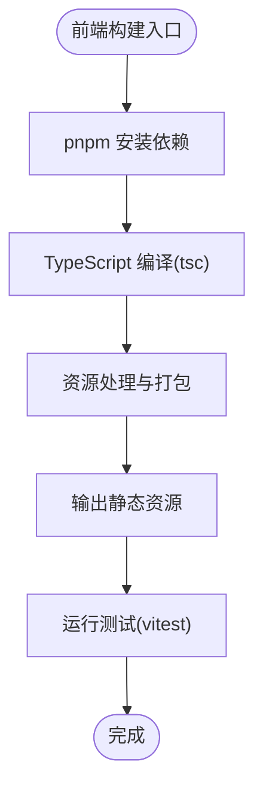
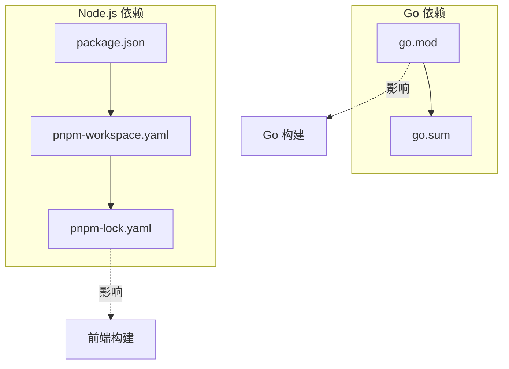

# 本地构建

<cite>
**本文引用的文件**   
- [README.md](file://README.md)
- [go.mod](file://go.mod)
- [go.sum](file://go.sum)
- [package.json](file://package.json)
- [pnpm-workspace.yaml](file://pnpm-workspace.yaml)
- [pnpm-lock.yaml](file://pnpm-lock.yaml)
- [tsconfig.base.json](file://tsconfig.base.json)
- [vitest.config.ts](file://vitest.config.ts)
- [.github/workflows/ci.yml](file://.github/workflows/ci.yml)
- [apps/control-plane/cmd/control-plane/main.go](file://apps/control-plane/cmd/control-plane/main.go)
- [apps/control-plane/Dockerfile](file://apps/control-plane/Dockerfile)
</cite>

## 目录
1. [简介](#简介)
2. [项目结构](#项目结构)
3. [核心组件](#核心组件)
4. [架构总览](#架构总览)
5. [详细组件分析](#详细组件分析)
6. [依赖分析](#依赖分析)
7. [性能考虑](#性能考虑)
8. [故障排查指南](#故障排查指南)
9. [结论](#结论)
10. [附录](#附录)

## 简介
本指南面向在本地环境构建 NeKiro 平台的开发者，覆盖 Go 后端与 Node.js/TypeScript 前端的完整构建流程。内容包含：
- Go 模块依赖管理、版本控制与交叉编译选项
- Node.js 工具链配置（pnpm、TypeScript、前端资源处理）
- 构建优化（代码压缩、资源合并、性能调优参数）
- 多平台构建命令与注意事项
- 常见构建问题的定位与解决

## 项目结构
仓库采用多语言多包组织方式：
- Go 后端位于 apps/control-plane，使用 go.mod/go.sum 进行依赖管理
- Node.js 工程根目录包含 package.json、pnpm 工作区与 TypeScript 基础配置
- 测试与契约定义分布在 contracts、tests 等目录
- CI 流水线定义在 .github/workflows/ci.yml

图表来源
- [apps/control-plane/cmd/control-plane/main.go:1-50](file://apps/control-plane/cmd/control-plane/main.go#L1-L50)
- [apps/control-plane/Dockerfile:1-50](file://apps/control-plane/Dockerfile#L1-L50)
- [package.json:1-50](file://package.json#L1-L50)
- [pnpm-workspace.yaml:1-50](file://pnpm-workspace.yaml#L1-L50)
- [tsconfig.base.json:1-50](file://tsconfig.base.json#L1-L50)
- [.github/workflows/ci.yml:1-50](file://.github/workflows/ci.yml#L1-L50)

章节来源
- [README.md:1-100](file://README.md#L1-L100)
- [go.mod:1-50](file://go.mod#L1-L50)
- [package.json:1-50](file://package.json#L1-L50)
- [pnpm-workspace.yaml:1-50](file://pnpm-workspace.yaml#L1-L50)
- [tsconfig.base.json:1-50](file://tsconfig.base.json#L1-L50)
- [.github/workflows/ci.yml:1-50](file://.github/workflows/ci.yml#L1-L50)

## 核心组件
- Go 后端
  - 模块与依赖：通过 go.mod 声明模块路径与依赖版本；go.sum 校验一致性
  - 入口程序：apps/control-plane/cmd/control-plane/main.go
  - 容器化：apps/control-plane/Dockerfile
- Node.js 前端与工具链
  - 包管理与工作区：package.json、pnpm-workspace.yaml、pnpm-lock.yaml
  - TypeScript 编译：tsconfig.base.json
  - 测试框架：vitest.config.ts

章节来源
- [go.mod:1-50](file://go.mod#L1-L50)
- [go.sum:1-50](file://go.sum#L1-L50)
- [apps/control-plane/cmd/control-plane/main.go:1-50](file://apps/control-plane/cmd/control-plane/main.go#L1-L50)
- [apps/control-plane/Dockerfile:1-50](file://apps/control-plane/Dockerfile#L1-L50)
- [package.json:1-50](file://package.json#L1-L50)
- [pnpm-workspace.yaml:1-50](file://pnpm-workspace.yaml#L1-L50)
- [pnpm-lock.yaml:1-50](file://pnpm-lock.yaml#L1-L50)
- [tsconfig.base.json:1-50](file://tsconfig.base.json#L1-L50)
- [vitest.config.ts:1-50](file://vitest.config.ts#L1-L50)

## 架构总览
下图展示本地构建的关键阶段与产物关系：从源码到可执行二进制与前端静态资源，再到容器镜像（可选）。

[此图为概念性流程图，不直接映射具体源码文件]

## 详细组件分析

### Go 后端构建
- 依赖管理
  - 使用 go.mod 管理模块与依赖版本，go.sum 用于校验
  - 建议在离线或受限网络环境下使用 GOPROXY 与私有代理
- 编译流程
  - 进入 Go 模块目录后执行标准构建命令
  - 可通过环境变量控制输出路径、链接器标志等
- 交叉编译
  - 使用 GOOS/GOARCH 组合为目标平台
  - 注意 CGO 依赖与系统库的可用性
- 容器化
  - Dockerfile 定义了镜像构建步骤，可作为本地验证与交付参考

图表来源
- [go.mod:1-50](file://go.mod#L1-L50)
- [go.sum:1-50](file://go.sum#L1-L50)
- [apps/control-plane/cmd/control-plane/main.go:1-50](file://apps/control-plane/cmd/control-plane/main.go#L1-L50)
- [apps/control-plane/Dockerfile:1-50](file://apps/control-plane/Dockerfile#L1-L50)

章节来源
- [go.mod:1-50](file://go.mod#L1-L50)
- [go.sum:1-50](file://go.sum#L1-L50)
- [apps/control-plane/cmd/control-plane/main.go:1-50](file://apps/control-plane/cmd/control-plane/main.go#L1-L50)
- [apps/control-plane/Dockerfile:1-50](file://apps/control-plane/Dockerfile#L1-L50)

### Node.js 工具链与前端构建
- 包管理器与工作区
  - 使用 pnpm 作为包管理器，pnpm-workspace.yaml 定义工作区范围
  - pnpm-lock.yaml 锁定依赖树，保证一致性与快速安装
- TypeScript 编译
  - tsconfig.base.json 提供基础编译选项，可按需扩展
- 测试与验证
  - vitest.config.ts 配置单元测试与集成测试行为
- 构建脚本
  - package.json 中通常定义构建、类型检查与测试脚本，按工作区规则执行

[此图为概念性流程图，不直接映射具体源码文件]

章节来源
- [package.json:1-50](file://package.json#L1-L50)
- [pnpm-workspace.yaml:1-50](file://pnpm-workspace.yaml#L1-L50)
- [pnpm-lock.yaml:1-50](file://pnpm-lock.yaml#L1-L50)
- [tsconfig.base.json:1-50](file://tsconfig.base.json#L1-L50)
- [vitest.config.ts:1-50](file://vitest.config.ts#L1-L50)

### 构建优化配置
- Go 后端优化
  - 启用最小化构建与链接期优化，减少二进制体积
  - 合理设置并发与缓存，提升增量构建速度
- 前端优化
  - 启用代码压缩与资源合并策略
  - 按需加载与缓存策略，降低首屏负载
- 通用建议
  - 使用并行任务与缓存层（依赖缓存、构建缓存）
  - 在 CI 中复用缓存以缩短流水线时间

[本节为通用指导，不直接分析具体文件]

### 多平台构建命令与注意事项
- Windows
  - 确保 Go 与 Node.js 已正确安装并加入 PATH
  - 使用 pnpm 时注意路径分隔符与权限
- macOS
  - 注意 Homebrew 安装的 Go/Node 版本与系统兼容
  - 如需 CGO，确认 Xcode CLI 工具可用
- Linux
  - 根据目标平台准备必要系统库
  - 在容器内构建可避免宿主环境差异

[本节为通用指导，不直接分析具体文件]

## 依赖分析
- Go 依赖
  - go.mod 声明模块与依赖版本；go.sum 校验一致性
  - 建议固定主版本与补丁版本，避免上游破坏性变更
- Node.js 依赖
  - pnpm 工作区与锁文件确保团队一致性与可重现构建
  - 建议定期更新依赖并审查安全公告

图表来源
- [go.mod:1-50](file://go.mod#L1-L50)
- [go.sum:1-50](file://go.sum#L1-L50)
- [package.json:1-50](file://package.json#L1-L50)
- [pnpm-workspace.yaml:1-50](file://pnpm-workspace.yaml#L1-L50)
- [pnpm-lock.yaml:1-50](file://pnpm-lock.yaml#L1-L50)

章节来源
- [go.mod:1-50](file://go.mod#L1-L50)
- [go.sum:1-50](file://go.sum#L1-L50)
- [package.json:1-50](file://package.json#L1-L50)
- [pnpm-workspace.yaml:1-50](file://pnpm-workspace.yaml#L1-L50)
- [pnpm-lock.yaml:1-50](file://pnpm-lock.yaml#L1-L50)

## 性能考虑
- 构建缓存
  - Go 构建缓存与 pnpm 缓存应被持久化，加速重复构建
- 并行化
  - 前后端构建可并行执行，缩短整体耗时
- 产物体积
  - 对 Go 二进制启用优化与裁剪无用符号
  - 对前端启用压缩、Tree-shaking 与资源合并
- 内存与 CPU
  - 在资源受限环境中限制并发度，避免 OOM

[本节为通用指导，不直接分析具体文件]

## 故障排查指南
- 依赖解析失败
  - 检查网络与代理设置，确认 go.mod/pnpm-lock 未被污染
  - 清理缓存后重试
- 版本冲突
  - 统一 Go 与 Node.js 版本，避免工具链不一致
  - 使用 nvm/gvm 等版本管理工具隔离环境
- 权限问题
  - 在类 Unix 系统上确保写入权限与虚拟文件系统挂载正确
- 跨平台构建失败
  - 确认目标平台所需系统库与工具链可用
  - 优先在容器内构建以减少环境差异
- 前端构建异常
  - 检查 TypeScript 配置与依赖版本兼容性
  - 使用 pnpm 的严格模式与锁文件校验

章节来源
- [.github/workflows/ci.yml:1-50](file://.github/workflows/ci.yml#L1-L50)
- [go.mod:1-50](file://go.mod#L1-L50)
- [pnpm-lock.yaml:1-50](file://pnpm-lock.yaml#L1-L50)
- [tsconfig.base.json:1-50](file://tsconfig.base.json#L1-L50)

## 结论
通过遵循本指南，你可以在本地高效地完成 NeKiro 平台的 Go 后端与 Node.js 前端构建。建议将常用命令与优化参数沉淀为脚本，并在 CI 中复用缓存与构建产物，以获得稳定且快速的开发体验。

[本节为总结性内容，不直接分析具体文件]

## 附录
- 参考入口与配置
  - Go 入口：apps/control-plane/cmd/control-plane/main.go
  - 容器化：apps/control-plane/Dockerfile
  - 前端配置：package.json、pnpm-workspace.yaml、tsconfig.base.json、vitest.config.ts
  - 依赖清单：go.mod、go.sum、pnpm-lock.yaml

章节来源
- [apps/control-plane/cmd/control-plane/main.go:1-50](file://apps/control-plane/cmd/control-plane/main.go#L1-L50)
- [apps/control-plane/Dockerfile:1-50](file://apps/control-plane/Dockerfile#L1-L50)
- [package.json:1-50](file://package.json#L1-L50)
- [pnpm-workspace.yaml:1-50](file://pnpm-workspace.yaml#L1-L50)
- [tsconfig.base.json:1-50](file://tsconfig.base.json#L1-L50)
- [vitest.config.ts:1-50](file://vitest.config.ts#L1-L50)
- [go.mod:1-50](file://go.mod#L1-L50)
- [go.sum:1-50](file://go.sum#L1-L50)
- [pnpm-lock.yaml:1-50](file://pnpm-lock.yaml#L1-L50)