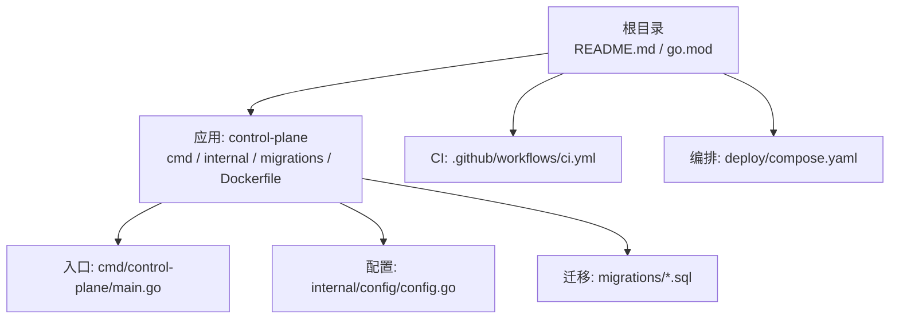
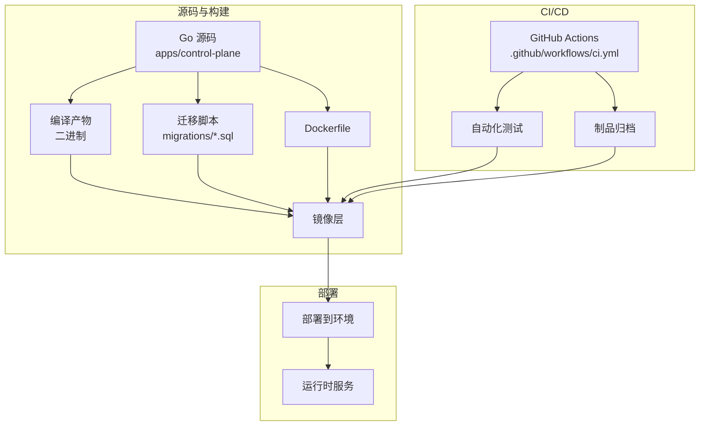
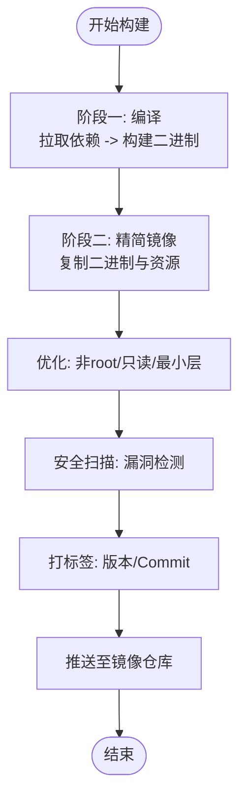
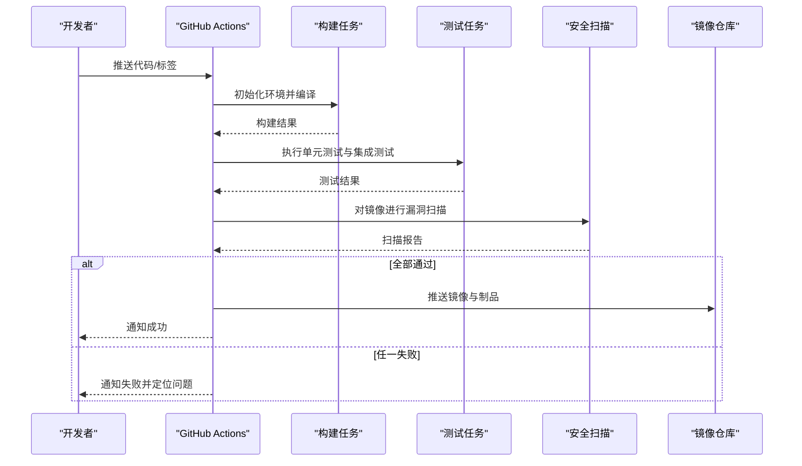
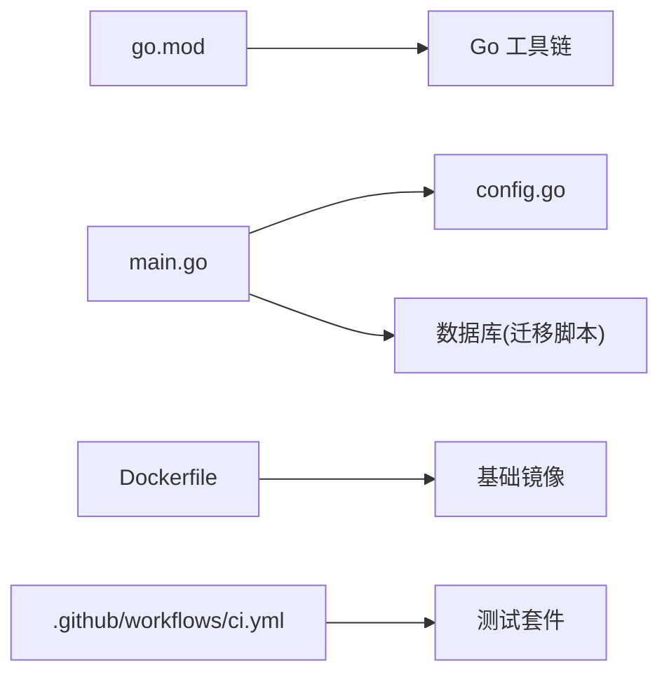

# 构建与部署

<cite>
**本文引用的文件**   
- [README.md](file://README.md)
- [go.mod](file://go.mod)
- [.github/workflows/ci.yml](file://.github/workflows/ci.yml)
- [apps/control-plane/Dockerfile](file://apps/control-plane/Dockerfile)
- [deploy/compose.yaml](file://deploy/compose.yaml)
- [apps/control-plane/cmd/control-plane/main.go](file://apps/control-plane/cmd/control-plane/main.go)
- [apps/control-plane/internal/config/config.go](file://apps/control-plane/internal/config/config.go)
- [apps/control-plane/migrations/001_catalog.sql](file://apps/control-plane/migrations/001_catalog.sql)
- [apps/control-plane/migrations/002_card_text.sql](file://apps/control-plane/migrations/002_card_text.sql)
- [apps/control-plane/migrations/003_workspace.sql](file://apps/control-plane/migrations/003_workspace.sql)
</cite>

## 目录
1. [简介](#简介)
2. [项目结构](#项目结构)
3. [核心组件](#核心组件)
4. [架构总览](#架构总览)
5. [详细组件分析](#详细组件分析)
6. [依赖分析](#依赖分析)
7. [性能考虑](#性能考虑)
8. [故障排查指南](#故障排查指南)
9. [结论](#结论)
10. [附录](#附录)

## 简介
本指南面向 NeKiro 平台的构建与部署，覆盖本地构建、Docker 镜像构建与优化、CI/CD 流水线配置、多环境部署策略、版本管理与回滚机制，以及常见问题排查。目标是帮助开发者在本地快速产出可运行产物，并在不同环境中稳定发布与回滚。

## 项目结构
NeKiro 采用 Go 后端为主的多包仓库结构，控制面服务位于 apps/control-plane，包含入口程序、内部模块、数据库迁移脚本与 Dockerfile；根目录提供 GitHub Actions CI 工作流与 Compose 编排文件，便于本地与集成测试环境快速拉起。

图表来源
- [README.md](file://README.md)
- [go.mod](file://go.mod)
- [.github/workflows/ci.yml](file://.github/workflows/ci.yml)
- [apps/control-plane/Dockerfile](file://apps/control-plane/Dockerfile)
- [deploy/compose.yaml](file://deploy/compose.yaml)
- [apps/control-plane/cmd/control-plane/main.go](file://apps/control-plane/cmd/control-plane/main.go)
- [apps/control-plane/internal/config/config.go](file://apps/control-plane/internal/config/config.go)
- [apps/control-plane/migrations/001_catalog.sql](file://apps/control-plane/migrations/001_catalog.sql)
- [apps/control-plane/migrations/002_card_text.sql](file://apps/control-plane/migrations/002_card_text.sql)
- [apps/control-plane/migrations/003_workspace.sql](file://apps/control-plane/migrations/003_workspace.sql)

章节来源
- [README.md](file://README.md)
- [go.mod](file://go.mod)
- [.github/workflows/ci.yml](file://.github/workflows/ci.yml)
- [apps/control-plane/Dockerfile](file://apps/control-plane/Dockerfile)
- [deploy/compose.yaml](file://deploy/compose.yaml)
- [apps/control-plane/cmd/control-plane/main.go](file://apps/control-plane/cmd/control-plane/main.go)
- [apps/control-plane/internal/config/config.go](file://apps/control-plane/internal/config/config.go)
- [apps/control-plane/migrations/001_catalog.sql](file://apps/control-plane/migrations/001_catalog.sql)
- [apps/control-plane/migrations/002_card_text.sql](file://apps/control-plane/migrations/002_card_text.sql)
- [apps/control-plane/migrations/003_workspace.sql](file://apps/control-plane/migrations/003_workspace.sql)

## 核心组件
- 控制面服务（control-plane）：Go 语言实现，提供平台核心能力，包含路由、目录、工作区等子域逻辑，并通过数据库持久化状态。
- 数据库迁移：以 SQL 脚本形式管理 schema 演进，按序号命名，确保有序执行。
- 容器化：通过 Dockerfile 定义镜像构建过程，支持生产级镜像优化与安全扫描。
- CI/CD：GitHub Actions 工作流负责自动化构建、测试与制品归档。
- 编排：Compose 文件用于本地或集成环境一键拉起服务与依赖。

章节来源
- [apps/control-plane/cmd/control-plane/main.go](file://apps/control-plane/cmd/control-plane/main.go)
- [apps/control-plane/internal/config/config.go](file://apps/control-plane/internal/config/config.go)
- [apps/control-plane/migrations/001_catalog.sql](file://apps/control-plane/migrations/001_catalog.sql)
- [apps/control-plane/migrations/002_card_text.sql](file://apps/control-plane/migrations/002_card_text.sql)
- [apps/control-plane/migrations/003_workspace.sql](file://apps/control-plane/migrations/003_workspace.sql)
- [apps/control-plane/Dockerfile](file://apps/control-plane/Dockerfile)
- [.github/workflows/ci.yml](file://.github/workflows/ci.yml)
- [deploy/compose.yaml](file://deploy/compose.yaml)

## 架构总览
下图展示了从代码到产物的关键路径：源码编译生成二进制，随后打包为镜像，CI 触发测试与制品归档，最终通过编排或云平台部署到目标环境。

图表来源
- [apps/control-plane/Dockerfile](file://apps/control-plane/Dockerfile)
- [.github/workflows/ci.yml](file://.github/workflows/ci.yml)
- [apps/control-plane/migrations/001_catalog.sql](file://apps/control-plane/migrations/001_catalog.sql)
- [apps/control-plane/migrations/002_card_text.sql](file://apps/control-plane/migrations/002_card_text.sql)
- [apps/control-plane/migrations/003_workspace.sql](file://apps/control-plane/migrations/003_workspace.sql)

## 详细组件分析

### 本地构建流程
- 前置条件
  - 安装 Go 工具链与依赖解析器，确保与 go.mod 中声明的 Go 版本兼容。
  - 安装 Docker（如需本地镜像构建）。
- 编译选项与优化
  - 使用 Go 标准构建命令进行编译，建议开启最小化依赖与静态链接以获得更稳定的运行环境。
  - 可通过环境变量注入版本号、构建时间等信息，便于追踪与审计。
- 产物生成
  - 编译输出为单一二进制文件，便于直接运行或在容器中嵌入。
  - 若需要调试信息，可在开发环境保留符号表；生产环境建议剥离以提升安全性与体积。
- 运行与验证
  - 启动服务后检查健康端点与日志输出，确认数据库连接与迁移是否成功。
  - 使用 Compose 快速拉起依赖（如数据库），完成端到端验证。

章节来源
- [go.mod](file://go.mod)
- [apps/control-plane/cmd/control-plane/main.go](file://apps/control-plane/cmd/control-plane/main.go)
- [apps/control-plane/internal/config/config.go](file://apps/control-plane/internal/config/config.go)
- [deploy/compose.yaml](file://deploy/compose.yaml)

### Docker 镜像构建与优化
- 多阶段构建
  - 第一阶段：基于 Go 官方镜像，拉取依赖并编译二进制，启用缓存加速重复构建。
  - 第二阶段：基于精简基础镜像（如 distroless 或 alpine），仅拷贝二进制与必要资源，减小镜像体积。
- 镜像优化
  - 使用只读文件系统与非 root 用户运行，提升安全性。
  - 合理设置镜像标签（如 git commit sha、语义化版本），便于追溯与回滚。
- 安全扫描
  - 在 CI 中集成镜像漏洞扫描步骤，阻断高危漏洞进入制品库。
  - 定期更新基础镜像，减少已知风险。

图表来源
- [apps/control-plane/Dockerfile](file://apps/control-plane/Dockerfile)

章节来源
- [apps/control-plane/Dockerfile](file://apps/control-plane/Dockerfile)

### CI/CD 流水线配置
- 触发条件
  - 推送分支或创建标签时触发，确保每次变更都经过自动化验证。
- 任务步骤
  - 检出代码、设置 Go 环境、缓存依赖、编译与测试。
  - 构建镜像并进行安全扫描，失败则中断流水线。
  - 将制品（二进制或镜像）归档，供后续部署使用。
- 发布流程
  - 针对特定分支或标签执行发布任务，生成带版本号的制品并推送到制品库。
  - 记录发布元数据（commit、镜像 digest、构建时间），便于审计与回滚。

图表来源
- [.github/workflows/ci.yml](file://.github/workflows/ci.yml)

章节来源
- [.github/workflows/ci.yml](file://.github/workflows/ci.yml)

### 多环境部署策略
- 环境划分
  - 开发环境：快速迭代，允许更多日志与调试开关。
  - 测试环境：接近生产配置，用于回归与验收。
  - 生产环境：严格限制权限与资源，强调稳定性与可观测性。
- 差异化配置
  - 通过环境变量注入数据库连接、日志级别、功能开关等。
  - 使用配置文件模板与环境专属变量，避免硬编码。
- 编排与滚动升级
  - 使用 Compose 或 Kubernetes 进行服务编排，支持滚动更新与灰度发布。
  - 结合健康检查与就绪探针，确保流量切换平滑。

章节来源
- [deploy/compose.yaml](file://deploy/compose.yaml)
- [apps/control-plane/internal/config/config.go](file://apps/control-plane/internal/config/config.go)

### 版本管理与回滚机制
- 版本标识
  - 使用语义化版本与 Git 提交哈希组合标记镜像，确保唯一性与可追溯。
- 发布策略
  - 主分支合并后自动构建并发布候选镜像，经测试通过后打标为正式版本。
- 回滚流程
  - 通过镜像标签快速回滚到上一稳定版本。
  - 数据库迁移需保持向后兼容，必要时提供反向迁移脚本。

章节来源
- [apps/control-plane/Dockerfile](file://apps/control-plane/Dockerfile)
- [apps/control-plane/migrations/001_catalog.sql](file://apps/control-plane/migrations/001_catalog.sql)
- [apps/control-plane/migrations/002_card_text.sql](file://apps/control-plane/migrations/002_card_text.sql)
- [apps/control-plane/migrations/003_workspace.sql](file://apps/control-plane/migrations/003_workspace.sql)

## 依赖分析
- 外部依赖
  - Go 标准库与第三方模块由 go.mod 管理，确保依赖版本锁定与可重现构建。
- 内部依赖
  - 控制面服务内部模块按领域划分，入口程序加载配置并启动各子系统。
- 运行时依赖
  - 数据库（PostgreSQL）作为持久化存储，迁移脚本驱动 schema 演进。

图表来源
- [go.mod](file://go.mod)
- [apps/control-plane/cmd/control-plane/main.go](file://apps/control-plane/cmd/control-plane/main.go)
- [apps/control-plane/internal/config/config.go](file://apps/control-plane/internal/config/config.go)
- [apps/control-plane/Dockerfile](file://apps/control-plane/Dockerfile)
- [.github/workflows/ci.yml](file://.github/workflows/ci.yml)
- [apps/control-plane/migrations/001_catalog.sql](file://apps/control-plane/migrations/001_catalog.sql)
- [apps/control-plane/migrations/002_card_text.sql](file://apps/control-plane/migrations/002_card_text.sql)
- [apps/control-plane/migrations/003_workspace.sql](file://apps/control-plane/migrations/003_workspace.sql)

章节来源
- [go.mod](file://go.mod)
- [apps/control-plane/cmd/control-plane/main.go](file://apps/control-plane/cmd/control-plane/main.go)
- [apps/control-plane/internal/config/config.go](file://apps/control-plane/internal/config/config.go)
- [apps/control-plane/Dockerfile](file://apps/control-plane/Dockerfile)
- [.github/workflows/ci.yml](file://.github/workflows/ci.yml)
- [apps/control-plane/migrations/001_catalog.sql](file://apps/control-plane/migrations/001_catalog.sql)
- [apps/control-plane/migrations/002_card_text.sql](file://apps/control-plane/migrations/002_card_text.sql)
- [apps/control-plane/migrations/003_workspace.sql](file://apps/control-plane/migrations/003_workspace.sql)

## 性能考虑
- 构建性能
  - 利用 Go 模块缓存与 Docker 层缓存，缩短重复构建时间。
  - 并行执行测试与构建任务，提高流水线吞吐。
- 运行性能
  - 调整并发参数与连接池大小，匹配目标环境的 CPU 与内存资源。
  - 启用压缩与缓存头，降低网络开销。
- 镜像体积
  - 选择最小基础镜像，移除不必要的工具与文件，减少攻击面与传输成本。

[本节为通用指导，不直接分析具体文件]

## 故障排查指南
- 构建失败
  - 检查 Go 版本与 go.mod 一致性，清理模块缓存后重试。
  - 查看 CI 日志中的错误堆栈，定位缺失依赖或编译错误。
- 镜像构建异常
  - 确认 Dockerfile 中基础镜像可达，网络代理配置正确。
  - 分阶段逐步构建，定位具体失败的阶段。
- 服务启动失败
  - 校验环境变量与配置文件，确保数据库连接字符串与认证信息正确。
  - 检查迁移脚本是否已执行，数据库 schema 是否与代码期望一致。
- 安全扫描告警
  - 根据扫描报告更新基础镜像或替换存在漏洞的依赖。
  - 在 CI 中设置阈值，阻止高危漏洞流入制品库。

章节来源
- [.github/workflows/ci.yml](file://.github/workflows/ci.yml)
- [apps/control-plane/Dockerfile](file://apps/control-plane/Dockerfile)
- [apps/control-plane/internal/config/config.go](file://apps/control-plane/internal/config/config.go)
- [apps/control-plane/migrations/001_catalog.sql](file://apps/control-plane/migrations/001_catalog.sql)
- [apps/control-plane/migrations/002_card_text.sql](file://apps/control-plane/migrations/002_card_text.sql)
- [apps/control-plane/migrations/003_workspace.sql](file://apps/control-plane/migrations/003_workspace.sql)

## 结论
通过标准化的本地构建、容器化与 CI/CD 流水线，NeKiro 平台能够在多环境中保持一致的交付质量。配合严格的镜像优化与安全扫描、完善的版本管理与回滚机制，可有效降低运维风险并提升交付效率。

[本节为总结性内容，不直接分析具体文件]

## 附录
- 常用命令参考
  - 本地构建与运行：使用 Go 工具链编译并启动服务，或通过 Compose 拉起依赖与服务。
  - 构建镜像：执行 Docker 构建命令，指定标签与构建上下文。
  - 运行测试：执行单元测试与集成测试，确保变更质量。
- 参考文件
  - 入口程序与配置：用于理解服务启动与配置加载流程。
  - 迁移脚本：了解数据库 schema 演进与兼容性要求。
  - CI 工作流与 Compose：掌握自动化与编排细节。

章节来源
- [apps/control-plane/cmd/control-plane/main.go](file://apps/control-plane/cmd/control-plane/main.go)
- [apps/control-plane/internal/config/config.go](file://apps/control-plane/internal/config/config.go)
- [apps/control-plane/migrations/001_catalog.sql](file://apps/control-plane/migrations/001_catalog.sql)
- [apps/control-plane/migrations/002_card_text.sql](file://apps/control-plane/migrations/002_card_text.sql)
- [apps/control-plane/migrations/003_workspace.sql](file://apps/control-plane/migrations/003_workspace.sql)
- [.github/workflows/ci.yml](file://.github/workflows/ci.yml)
- [deploy/compose.yaml](file://deploy/compose.yaml)