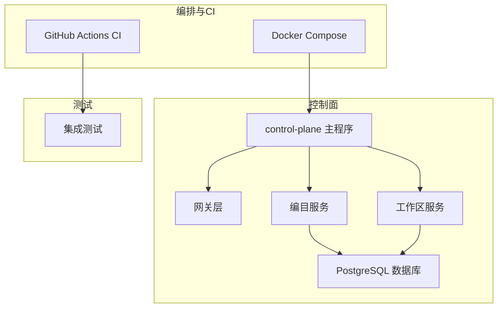
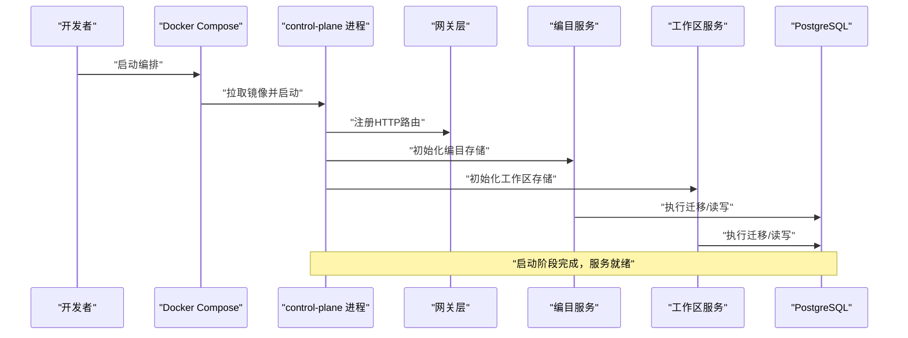
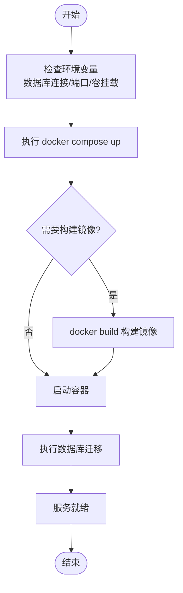
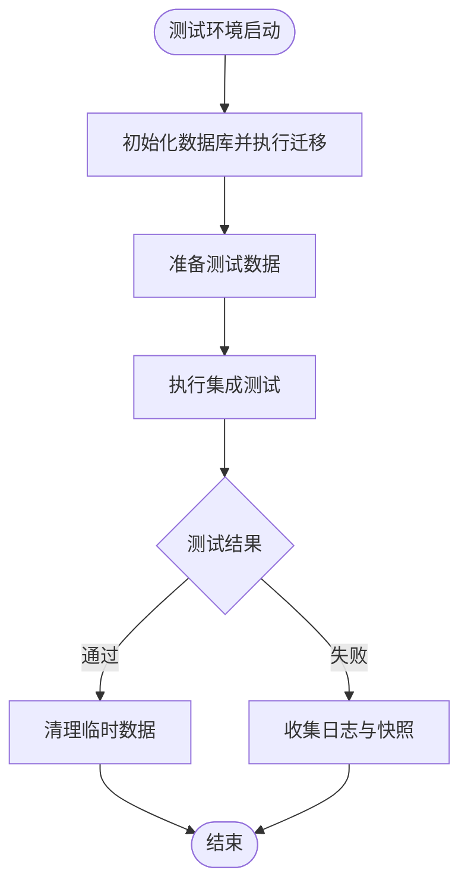
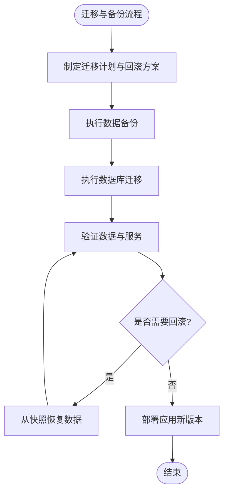
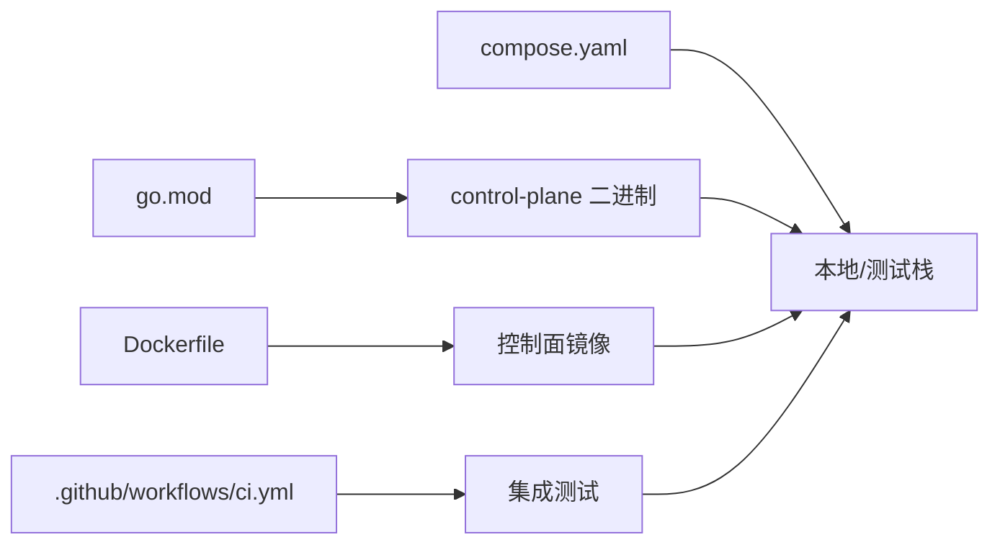

# 环境部署

<cite>
**本文引用的文件**   
- [README.md](file://README.md)
- [deploy/compose.yaml](file://deploy/compose.yaml)
- [apps/control-plane/cmd/control-plane/main.go](file://apps/control-plane/cmd/control-plane/main.go)
- [apps/control-plane/internal/config/config.go](file://apps/control-plane/internal/config/config.go)
- [apps/control-plane/Dockerfile](file://apps/control-plane/Dockerfile)
- [go.mod](file://go.mod)
- [.github/workflows/ci.yml](file://.github/workflows/ci.yml)
- [apps/control-plane/migrations/001_catalog.sql](file://apps/control-plane/migrations/001_catalog.sql)
- [apps/control-plane/migrations/002_card_text.sql](file://apps/control-plane/migrations/002_card_text.sql)
- [apps/control-plane/migrations/003_workspace.sql](file://apps/control-plane/migrations/003_workspace.sql)
- [apps/control-plane/internal/catalog/postgres/migrations.go](file://apps/control-plane/internal/catalog/postgres/migrations.go)
- [apps/control-plane/internal/workspace/postgres/migrations.go](file://apps/control-plane/internal/workspace/postgres/migrations.go)
- [tests/integration/catalog/catalog_test.go](file://tests/integration/catalog/catalog_test.go)
- [apps/control-plane/internal/gateway/errors.go](file://apps/control-plane/internal/gateway/errors.go)
</cite>

## 目录
1. [简介](#简介)
2. [项目结构](#项目结构)
3. [核心组件](#核心组件)
4. [架构总览](#架构总览)
5. [详细组件分析](#详细组件分析)
6. [依赖分析](#依赖分析)
7. [性能考虑](#性能考虑)
8. [故障排查指南](#故障排查指南)
9. [结论](#结论)
10. [附录](#附录)

## 简介
本指南面向 NeKiro 平台的多环境部署，覆盖开发、测试与生产三类环境的快速启动、配置管理、数据迁移、监控告警以及备份恢复策略。文档基于仓库中现有的可执行入口、Docker 编排、数据库迁移脚本与集成测试等素材进行整理，确保读者能够按步骤完成从本地到生产的端到端部署。

## 项目结构
NeKiro 采用多应用与契约分离的组织方式：
- 控制面服务位于 apps/control-plane，包含 HTTP 网关、编目与工作区等子模块，并提供 Dockerfile 用于容器化构建。
- 数据库迁移脚本集中在 migrations 目录，涵盖编目、卡片文本与工作区相关表结构。
- 集成测试位于 tests/integration，提供关键路径的端到端验证。
- 编排与运行通过 deploy/compose.yaml 定义，便于一键拉起开发环境。
- CI 流水线在 .github/workflows/ci.yml 中定义，驱动构建与测试。

图表来源
- [deploy/compose.yaml](file://deploy/compose.yaml)
- [apps/control-plane/cmd/control-plane/main.go](file://apps/control-plane/cmd/control-plane/main.go)
- [apps/control-plane/internal/catalog/postgres/migrations.go](file://apps/control-plane/internal/catalog/postgres/migrations.go)
- [apps/control-plane/internal/workspace/postgres/migrations.go](file://apps/control-plane/internal/workspace/postgres/migrations.go)

章节来源
- [README.md](file://README.md)
- [deploy/compose.yaml](file://deploy/compose.yaml)
- [apps/control-plane/cmd/control-plane/main.go](file://apps/control-plane/cmd/control-plane/main.go)
- [apps/control-plane/internal/catalog/postgres/migrations.go](file://apps/control-plane/internal/catalog/postgres/migrations.go)
- [apps/control-plane/internal/workspace/postgres/migrations.go](file://apps/control-plane/internal/workspace/postgres/migrations.go)

## 核心组件
- 控制面主程序：负责进程初始化、配置加载、HTTP 路由注册与生命周期管理。
- 配置系统：集中读取环境变量与配置文件，为各子系统提供运行时参数。
- 数据库迁移：在启动时或独立任务中执行 SQL 迁移，保证 schema 一致性。
- 编排与镜像：通过 Dockerfile 与 compose.yaml 实现本地与集群的一键部署。
- 集成测试：对编目等关键能力进行端到端校验，保障部署质量。

章节来源
- [apps/control-plane/cmd/control-plane/main.go](file://apps/control-plane/cmd/control-plane/main.go)
- [apps/control-plane/internal/config/config.go](file://apps/control-plane/internal/config/config.go)
- [apps/control-plane/internal/catalog/postgres/migrations.go](file://apps/control-plane/internal/catalog/postgres/migrations.go)
- [apps/control-plane/internal/workspace/postgres/migrations.go](file://apps/control-plane/internal/workspace/postgres/migrations.go)
- [apps/control-plane/Dockerfile](file://apps/control-plane/Dockerfile)
- [deploy/compose.yaml](file://deploy/compose.yaml)
- [tests/integration/catalog/catalog_test.go](file://tests/integration/catalog/catalog_test.go)

## 架构总览
下图展示了控制面服务在容器中的主要交互关系，包括网关、编目与工作区模块对数据库的访问，以及 Compose 编排与 CI 的协作。

图表来源
- [deploy/compose.yaml](file://deploy/compose.yaml)
- [apps/control-plane/cmd/control-plane/main.go](file://apps/control-plane/cmd/control-plane/main.go)
- [apps/control-plane/internal/catalog/postgres/migrations.go](file://apps/control-plane/internal/catalog/postgres/migrations.go)
- [apps/control-plane/internal/workspace/postgres/migrations.go](file://apps/control-plane/internal/workspace/postgres/migrations.go)

## 详细组件分析

### 开发环境快速启动（Docker Compose）
- 使用 Compose 一键拉起控制面与数据库，适合本地开发与联调。
- 建议将数据库凭据、端口映射与持久化卷通过环境变量或外部配置注入。
- 首次启动会自动执行数据库迁移，确保 schema 一致。

图表来源
- [deploy/compose.yaml](file://deploy/compose.yaml)
- [apps/control-plane/Dockerfile](file://apps/control-plane/Dockerfile)
- [apps/control-plane/internal/catalog/postgres/migrations.go](file://apps/control-plane/internal/catalog/postgres/migrations.go)
- [apps/control-plane/internal/workspace/postgres/migrations.go](file://apps/control-plane/internal/workspace/postgres/migrations.go)

章节来源
- [deploy/compose.yaml](file://deploy/compose.yaml)
- [apps/control-plane/Dockerfile](file://apps/control-plane/Dockerfile)
- [apps/control-plane/internal/catalog/postgres/migrations.go](file://apps/control-plane/internal/catalog/postgres/migrations.go)
- [apps/control-plane/internal/workspace/postgres/migrations.go](file://apps/control-plane/internal/workspace/postgres/migrations.go)

### 本地开发服务器配置
- 直接运行控制面二进制以启用热重载与调试，适合代码级问题定位。
- 通过环境变量注入数据库连接、日志级别、监听端口等关键参数。
- 建议在本地保留独立的数据库实例，避免污染共享环境。

章节来源
- [apps/control-plane/cmd/control-plane/main.go](file://apps/control-plane/cmd/control-plane/main.go)
- [apps/control-plane/internal/config/config.go](file://apps/control-plane/internal/config/config.go)

### 测试环境搭建与集成测试
- 数据库初始化：复用生产一致的迁移脚本，确保测试环境与真实环境结构一致。
- 测试数据准备：可通过导入 fixtures 或使用 API 创建最小数据集。
- 集成测试执行：运行 tests/integration 下的用例，验证编目等关键流程。

图表来源
- [apps/control-plane/migrations/001_catalog.sql](file://apps/control-plane/migrations/001_catalog.sql)
- [apps/control-plane/migrations/002_card_text.sql](file://apps/control-plane/migrations/002_card_text.sql)
- [apps/control-plane/migrations/003_workspace.sql](file://apps/control-plane/migrations/003_workspace.sql)
- [tests/integration/catalog/catalog_test.go](file://tests/integration/catalog/catalog_test.go)

章节来源
- [apps/control-plane/migrations/001_catalog.sql](file://apps/control-plane/migrations/001_catalog.sql)
- [apps/control-plane/migrations/002_card_text.sql](file://apps/control-plane/migrations/002_card_text.sql)
- [apps/control-plane/migrations/003_workspace.sql](file://apps/control-plane/migrations/003_workspace.sql)
- [tests/integration/catalog/catalog_test.go](file://tests/integration/catalog/catalog_test.go)

### 生产环境部署策略
- 高可用架构：多副本部署控制面，结合外部负载均衡器分发请求；数据库采用主备或托管服务提升可用性。
- 负载均衡配置：根据健康检查与权重策略分配流量，支持灰度发布与滚动升级。
- 监控告警：采集服务指标、错误率与延迟，设置阈值告警与自愈策略。
- 安全加固：最小权限原则、密钥外置、网络隔离与审计日志。

[本节为通用指导，不直接分析具体文件]

### 环境变量管理与配置中心集成
- 环境变量：统一通过环境变量注入数据库连接、端口、日志级别、功能开关等。
- 配置中心：建议引入外部配置中心（如 KMS/Secrets Manager），在启动时拉取并热更新敏感配置。
- 版本化配置：配合 CI/CD 将配置变更纳入版本控制，确保可追溯与回滚。

章节来源
- [apps/control-plane/internal/config/config.go](file://apps/control-plane/internal/config/config.go)

### 环境迁移与数据备份恢复
- 迁移流程：在部署前执行迁移脚本，确保目标环境 schema 与期望一致。
- 数据备份：定期全量与增量备份数据库，保留多份历史快照。
- 恢复演练：定期进行恢复演练，验证 RPO/RTO 目标达成。

图表来源
- [apps/control-plane/migrations/001_catalog.sql](file://apps/control-plane/migrations/001_catalog.sql)
- [apps/control-plane/migrations/002_card_text.sql](file://apps/control-plane/migrations/002_card_text.sql)
- [apps/control-plane/migrations/003_workspace.sql](file://apps/control-plane/migrations/003_workspace.sql)

章节来源
- [apps/control-plane/migrations/001_catalog.sql](file://apps/control-plane/migrations/001_catalog.sql)
- [apps/control-plane/migrations/002_card_text.sql](file://apps/control-plane/migrations/002_card_text.sql)
- [apps/control-plane/migrations/003_workspace.sql](file://apps/control-plane/migrations/003_workspace.sql)

## 依赖分析
- 语言与包管理：Go 工程，依赖声明位于 go.mod。
- 容器化：控制面提供 Dockerfile，便于构建镜像。
- 编排：compose.yaml 定义服务拓扑与启动顺序。
- CI：GitHub Actions 驱动构建与测试，保障交付质量。

图表来源
- [go.mod](file://go.mod)
- [apps/control-plane/Dockerfile](file://apps/control-plane/Dockerfile)
- [deploy/compose.yaml](file://deploy/compose.yaml)
- [.github/workflows/ci.yml](file://.github/workflows/ci.yml)

章节来源
- [go.mod](file://go.mod)
- [apps/control-plane/Dockerfile](file://apps/control-plane/Dockerfile)
- [deploy/compose.yaml](file://deploy/compose.yaml)
- [.github/workflows/ci.yml](file://.github/workflows/ci.yml)

## 性能考虑
- 资源配额：为控制面与数据库设置合理的 CPU/内存限制，避免争用。
- 连接池：调整数据库连接池大小与超时，匹配并发负载。
- 水平扩展：无状态服务多副本横向扩展，结合负载均衡提升吞吐。
- 缓存与异步：对热点读路径引入缓存，耗时操作异步化。
- 观测性：完善指标、日志与链路追踪，辅助容量规划与瓶颈定位。

[本节为通用指导，不直接分析具体文件]

## 故障排查指南
- 常见错误分类：配置错误、数据库不可达、迁移失败、端口冲突、镜像拉取失败。
- 诊断要点：
  - 检查环境变量与配置中心注入是否生效。
  - 确认数据库连通性与迁移状态。
  - 查看服务日志与错误码，定位网关层异常。
- 工具建议：使用容器日志、数据库慢查询日志与 APM 工具进行根因分析。

章节来源
- [apps/control-plane/internal/gateway/errors.go](file://apps/control-plane/internal/gateway/errors.go)

## 结论
通过 Compose 一键部署、统一的配置与环境变量管理、严格的迁移与测试流程，NeKiro 可在开发、测试与生产环境中保持一致的交付质量。生产侧应结合高可用架构、负载均衡与完善的监控告警体系，确保服务的稳定性与可观测性。

## 附录
- 参考命令与路径：
  - 编排文件：deploy/compose.yaml
  - 控制面入口：apps/control-plane/cmd/control-plane/main.go
  - 配置读取：apps/control-plane/internal/config/config.go
  - 迁移脚本：apps/control-plane/migrations/*.sql
  - 集成测试：tests/integration/catalog/catalog_test.go
  - CI 流水线：.github/workflows/ci.yml

[本节为补充信息，不直接分析具体文件]