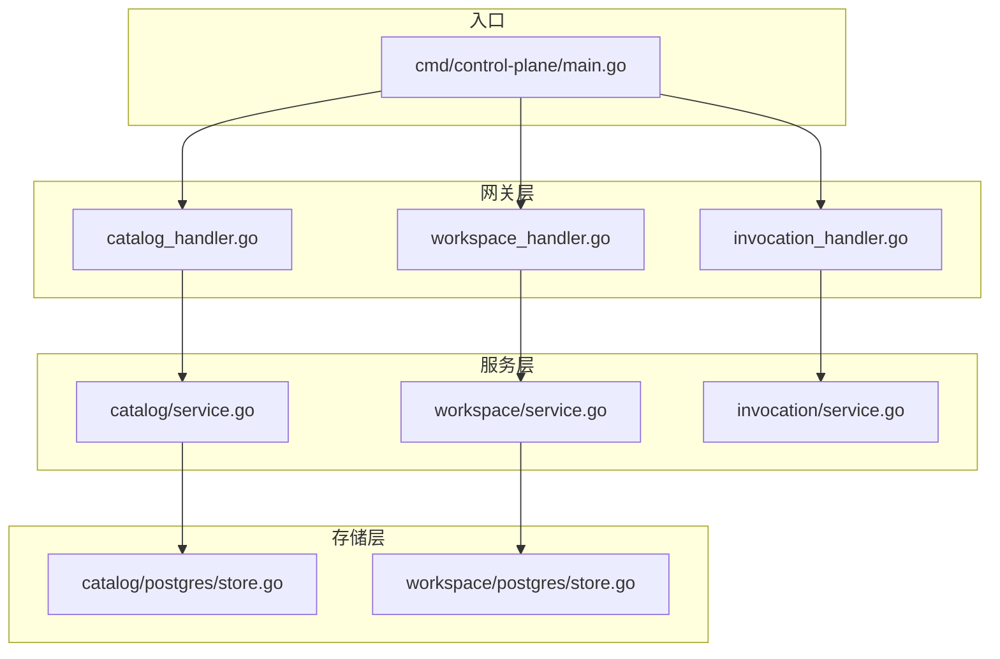
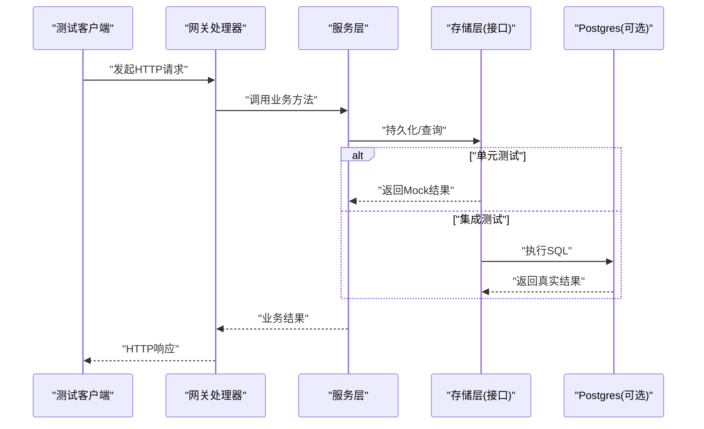
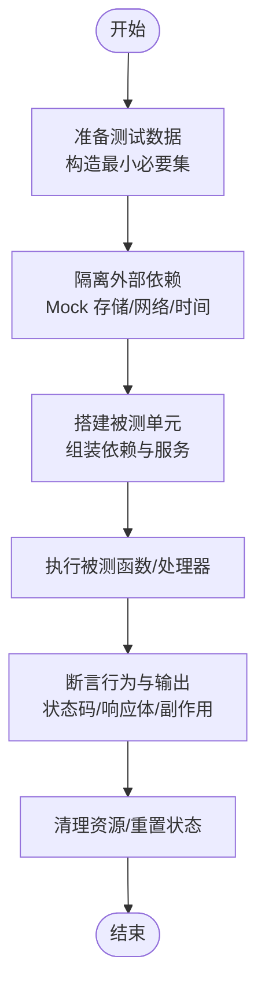
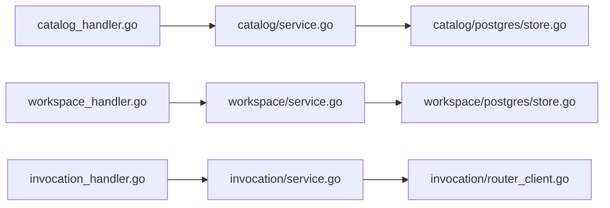

# 单元测试

<cite>
**本文引用的文件**   
- [apps/control-plane/cmd/control-plane/main.go](file://apps/control-plane/cmd/control-plane/main.go)
- [apps/control-plane/internal/catalog/service.go](file://apps/control-plane/internal/catalog/service.go)
- [apps/control-plane/internal/catalog/service_test.go](file://apps/control-plane/internal/catalog/service_test.go)
- [apps/control-plane/internal/catalog/postgres/store.go](file://apps/control-plane/internal/catalog/postgres/store.go)
- [apps/control-plane/internal/workspace/service.go](file://apps/control-plane/internal/workspace/service.go)
- [apps/control-plane/internal/workspace/service_test.go](file://apps/control-plane/internal/workspace/service_test.go)
- [apps/control-plane/internal/workspace/postgres/store.go](file://apps/control-plane/internal/workspace/postgres/store.go)
- [apps/control-plane/internal/gateway/catalog_handler.go](file://apps/control-plane/internal/gateway/catalog_handler.go)
- [apps/control-plane/internal/gateway/catalog_handler_test.go](file://apps/control-plane/internal/gateway/catalog_handler_test.go)
- [apps/control-plane/internal/gateway/invocation_handler.go](file://apps/control-plane/internal/gateway/invocation_handler.go)
- [apps/control-plane/internal/gateway/invocation_handler_test.go](file://apps/control-plane/internal/gateway/invocation_handler_test.go)
- [apps/control-plane/internal/gateway/workspace_handler.go](file://apps/control-plane/internal/gateway/workspace_handler.go)
- [apps/control-plane/internal/gateway/workspace_handler_test.go](file://apps/control-plane/internal/gateway/workspace_handler_test.go)
- [apps/control-plane/internal/invocation/router_client.go](file://apps/control-plane/internal/invocation/router_client.go)
- [apps/control-plane/internal/invocation/router_client_test.go](file://apps/control-plane/internal/invocation/router_client_test.go)
- [go.mod](file://go.mod)
</cite>

## 目录
1. [简介](#简介)
2. [项目结构](#项目结构)
3. [核心组件](#核心组件)
4. [架构总览](#架构总览)
5. [详细组件分析](#详细组件分析)
6. [依赖分析](#依赖分析)
7. [性能考虑](#性能考虑)
8. [故障排查指南](#故障排查指南)
9. [结论](#结论)
10. [附录](#附录) 

## 简介
本指南面向 NeKiro 控制面（Control Plane）的 Go 语言单元测试实践，聚焦以下目标：
- 统一测试命名与函数组织规范
- 为服务层、处理器和工具函数提供可复用的测试模板与断言策略
- 建立 Mock 数据准备的最佳实践（数据库模拟、外部依赖隔离、测试环境配置）
- 明确覆盖率要求、性能优化技巧与常见陷阱规避方法
- 以目录服务、工作空间服务和网关处理器为例，给出端到端测试实现指引

## 项目结构
NeKiro 控制面采用分层架构：网关层（HTTP 处理器）、服务层（业务编排）、存储层（Postgres）。测试按模块就近放置，便于维护与定位。

图表来源
- [apps/control-plane/cmd/control-plane/main.go](file://apps/control-plane/cmd/control-plane/main.go)
- [apps/control-plane/internal/gateway/catalog_handler.go](file://apps/control-plane/internal/gateway/catalog_handler.go)
- [apps/control-plane/internal/gateway/invocation_handler.go](file://apps/control-plane/internal/gateway/invocation_handler.go)
- [apps/control-plane/internal/gateway/workspace_handler.go](file://apps/control-plane/internal/gateway/workspace_handler.go)
- [apps/control-plane/internal/catalog/service.go](file://apps/control-plane/internal/catalog/service.go)
- [apps/control-plane/internal/workspace/service.go](file://apps/control-plane/internal/workspace/service.go)
- [apps/control-plane/internal/catalog/postgres/store.go](file://apps/control-plane/internal/catalog/postgres/store.go)
- [apps/control-plane/internal/workspace/postgres/store.go](file://apps/control-plane/internal/workspace/postgres/store.go)

章节来源
- [apps/control-plane/cmd/control-plane/main.go](file://apps/control-plane/cmd/control-plane/main.go)

## 核心组件
本节概述各层职责及对应测试要点：
- 网关层处理器：负责 HTTP 请求解析、鉴权上下文注入、调用服务层并返回响应。测试重点在于路由匹配、参数校验、错误映射与状态码。
- 服务层：封装业务逻辑，协调多个依赖（如存储、外部客户端）。测试重点在于分支覆盖、边界条件、并发安全与错误传播。
- 存储层：对接 Postgres。单元测试通常通过接口抽象进行 Mock；集成测试使用真实或容器化数据库。

章节来源
- [apps/control-plane/internal/gateway/catalog_handler.go](file://apps/control-plane/internal/gateway/catalog_handler.go)
- [apps/control-plane/internal/gateway/workspace_handler.go](file://apps/control-plane/internal/gateway/workspace_handler.go)
- [apps/control-plane/internal/gateway/invocation_handler.go](file://apps/control-plane/internal/gateway/invocation_handler.go)
- [apps/control-plane/internal/catalog/service.go](file://apps/control-plane/internal/catalog/service.go)
- [apps/control-plane/internal/workspace/service.go](file://apps/control-plane/internal/workspace/service.go)
- [apps/control-plane/internal/catalog/postgres/store.go](file://apps/control-plane/internal/catalog/postgres/store.go)
- [apps/control-plane/internal/workspace/postgres/store.go](file://apps/control-plane/internal/workspace/postgres/store.go)

## 架构总览
下图展示从 HTTP 请求到服务层再到存储层的典型调用链，以及测试中常用的替换点（Mock）。

图表来源
- [apps/control-plane/internal/gateway/catalog_handler.go](file://apps/control-plane/internal/gateway/catalog_handler.go)
- [apps/control-plane/internal/catalog/service.go](file://apps/control-plane/internal/catalog/service.go)
- [apps/control-plane/internal/catalog/postgres/store.go](file://apps/control-plane/internal/catalog/postgres/store.go)

## 详细组件分析

### 目录服务（Catalog Service）单元测试
- 测试目标
  - 验证创建、读取、更新、删除等核心路径
  - 校验输入参数合法性与错误分支
  - 验证对存储层接口的调用次数与入参
- 关键实践
  - 使用接口抽象对存储层进行 Mock，避免真实数据库
  - 构造最小必要数据集，减少耦合
  - 针对并发场景，验证竞态与幂等性
- 示例参考
  - 服务层测试用例：[apps/control-plane/internal/catalog/service_test.go](file://apps/control-plane/internal/catalog/service_test.go)
  - 存储层实现（用于理解接口契约）：[apps/control-plane/internal/catalog/postgres/store.go](file://apps/control-plane/internal/catalog/postgres/store.go)

章节来源
- [apps/control-plane/internal/catalog/service_test.go](file://apps/control-plane/internal/catalog/service_test.go)
- [apps/control-plane/internal/catalog/postgres/store.go](file://apps/control-plane/internal/catalog/postgres/store.go)

### 工作空间服务（Workspace Service）单元测试
- 测试目标
  - 工作空间生命周期（创建、查询、更新、删除）
  - 权限与策略相关分支
  - 与存储层的交互一致性
- 关键实践
  - 将复杂对象拆分为“基础用例 + 扩展字段”的组合，提升可读性
  - 对失败路径（如唯一约束冲突、外键缺失）进行显式断言
- 示例参考
  - 服务层测试用例：[apps/control-plane/internal/workspace/service_test.go](file://apps/control-plane/internal/workspace/service_test.go)
  - 存储层实现（用于理解接口契约）：[apps/control-plane/internal/workspace/postgres/store.go](file://apps/control-plane/internal/workspace/postgres/store.go)

章节来源
- [apps/control-plane/internal/workspace/service_test.go](file://apps/control-plane/internal/workspace/service_test.go)
- [apps/control-plane/internal/workspace/postgres/store.go](file://apps/control-plane/internal/workspace/postgres/store.go)

### 网关处理器（Gateway Handlers）单元测试
- 测试目标
  - 路由匹配、请求体/查询参数解析
  - 鉴权上下文注入与授权检查
  - 错误码映射与响应格式
- 关键实践
  - 使用 httptest 构建请求与响应记录器
  - 对服务层进行 Mock，确保仅测试网关逻辑
  - 覆盖成功、参数错误、未授权、内部错误等分支
- 示例参考
  - 目录处理器测试：[apps/control-plane/internal/gateway/catalog_handler_test.go](file://apps/control-plane/internal/gateway/catalog_handler_test.go)
  - 工作空间处理器测试：[apps/control-plane/internal/gateway/workspace_handler_test.go](file://apps/control-plane/internal/gateway/workspace_handler_test.go)
  - 调用处理器测试：[apps/control-plane/internal/gateway/invocation_handler_test.go](file://apps/control-plane/internal/gateway/invocation_handler_test.go)

章节来源
- [apps/control-plane/internal/gateway/catalog_handler_test.go](file://apps/control-plane/internal/gateway/catalog_handler_test.go)
- [apps/control-plane/internal/gateway/workspace_handler_test.go](file://apps/control-plane/internal/gateway/workspace_handler_test.go)
- [apps/control-plane/internal/gateway/invocation_handler_test.go](file://apps/control-plane/internal/gateway/invocation_handler_test.go)

### 路由器客户端（Router Client）单元测试
- 测试目标
  - 对外部路由服务的调用封装、重试与超时
  - 错误分类与透传
- 关键实践
  - 使用 httptest 或自定义接口 Mock 外部服务
  - 验证网络异常、超时、非预期响应的处理
- 示例参考
  - 客户端实现：[apps/control-plane/internal/invocation/router_client.go](file://apps/control-plane/internal/invocation/router_client.go)
  - 客户端测试：[apps/control-plane/internal/invocation/router_client_test.go](file://apps/control-plane/internal/invocation/router_client_test.go)

章节来源
- [apps/control-plane/internal/invocation/router_client.go](file://apps/control-plane/internal/invocation/router_client.go)
- [apps/control-plane/internal/invocation/router_client_test.go](file://apps/control-plane/internal/invocation/router_client_test.go)

### 概念总览：测试流程与最佳实践

[无需来源：该图为概念流程图]

## 依赖分析
- 模块内依赖
  - 网关处理器依赖服务层接口
  - 服务层依赖存储层接口与外部客户端
- 测试期依赖替换
  - 存储层接口在单元测试中被 Mock
  - 外部客户端通过 httptest 或接口替换
- 入口与配置
  - 应用入口负责装配依赖，测试可通过独立装配路径绕过生产配置

图表来源
- [apps/control-plane/internal/gateway/catalog_handler.go](file://apps/control-plane/internal/gateway/catalog_handler.go)
- [apps/control-plane/internal/gateway/workspace_handler.go](file://apps/control-plane/internal/gateway/workspace_handler.go)
- [apps/control-plane/internal/gateway/invocation_handler.go](file://apps/control-plane/internal/gateway/invocation_handler.go)
- [apps/control-plane/internal/catalog/service.go](file://apps/control-plane/internal/catalog/service.go)
- [apps/control-plane/internal/workspace/service.go](file://apps/control-plane/internal/workspace/service.go)
- [apps/control-plane/internal/catalog/postgres/store.go](file://apps/control-plane/internal/catalog/postgres/store.go)
- [apps/control-plane/internal/workspace/postgres/store.go](file://apps/control-plane/internal/workspace/postgres/store.go)
- [apps/control-plane/internal/invocation/router_client.go](file://apps/control-plane/internal/invocation/router_client.go)

章节来源
- [go.mod](file://go.mod)

## 性能考虑
- 测试数据最小化：只构造必要的字段与关联，降低序列化与比较开销
- 并行测试：使用子测试并行执行，缩短 CI 时间；注意共享资源的隔离
- 避免 I/O：单元测试尽量不访问磁盘与网络；必要时使用内存型替代
- 基准测试：对热点路径添加基准测试，关注分配与耗时变化
- 缓存与连接复用：在集成测试中复用连接，减少启动成本

[无需来源：本节提供通用指导]

## 故障排查指南
- 常见问题
  - 测试不稳定：检查随机数、时间源、并发竞争与全局状态
  - 断言过于严格：避免对无关字段进行强相等断言，优先断言关键语义
  - Mock 过度：确保 Mock 行为与实际接口契约一致，防止“假通过”
  - 资源泄漏：确保关闭连接、释放锁、清理临时文件
- 建议
  - 为每个测试设置清晰的名称与描述，便于定位失败原因
  - 使用表驱动测试组织多组用例，提高可维护性
  - 对错误路径单独编写用例，保证错误信息稳定

[无需来源：本节提供通用指导]

## 结论
通过统一的测试规范、严格的依赖隔离与合理的覆盖率目标，NeKiro 控制面可在保持快速迭代的同时维持高可靠性。建议持续完善接口抽象、补充边界用例，并在 CI 中固化覆盖率与性能基线。

[无需来源：本节为总结性内容]

## 附录

### 测试命名与结构约定
- 文件命名
  - 与源码同名的 _test.go 文件，置于同一包下
- 函数命名
  - TestXxx(t *testing.T)，子测试使用 t.Run("描述", func(t *testing.T){...})
- 断言方法
  - 使用标准库 testing 或第三方断言库，统一风格
- 表驱动测试
  - 将输入、期望输出、期望副作用组织为表项，循环执行

[无需来源：本节为通用规范说明]

### Mock 数据准备最佳实践
- 数据库模拟
  - 定义存储接口，在单元测试中使用内存实现或轻量 Mock
  - 集成测试使用容器化数据库或本地实例，配合迁移脚本初始化
- 外部依赖隔离
  - 使用 httptest.Server 模拟下游服务
  - 对时间、随机数、文件系统等进行可控替换
- 测试环境配置
  - 通过环境变量或配置文件区分测试与生产
  - 避免硬编码凭据，使用测试专用配置

[无需来源：本节为通用实践说明]

### 覆盖率与质量门禁
- 覆盖率目标
  - 行覆盖率 ≥ 80%，关键路径 ≥ 90%
- 门禁规则
  - 新增代码必须包含相应测试
  - 禁止跳过测试（t.Skip）进入主干
- 报告生成
  - 使用 go test -coverprofile 生成覆盖率报告，CI 中聚合与比对

[无需来源：本节为通用质量策略说明]

### 性能优化技巧
- 减少重复构造：提取公共 fixture 与工厂函数
- 避免不必要的序列化：直接操作结构体而非 JSON 字符串
- 合理设置超时与重试：在测试中缩短超时，加速反馈
- 使用内存数据库或内存映射：在集成测试中提升稳定性与速度

[无需来源：本节为通用优化建议]

### 常见陷阱与规避
- 隐式全局状态：避免使用全局变量，改用依赖注入
- 时序敏感：避免基于时间的断言，使用可控时钟
- 并发竞态：使用同步原语或通道确保顺序
- 过度断言：只断言关键行为，避免脆弱测试

[无需来源：本节为通用避坑指南]