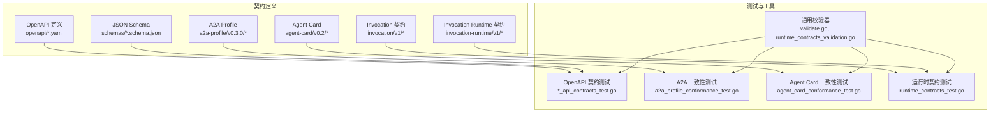
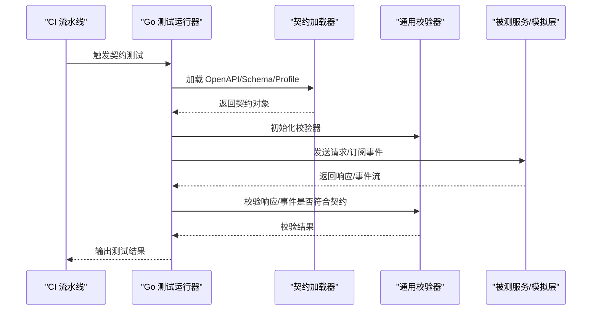
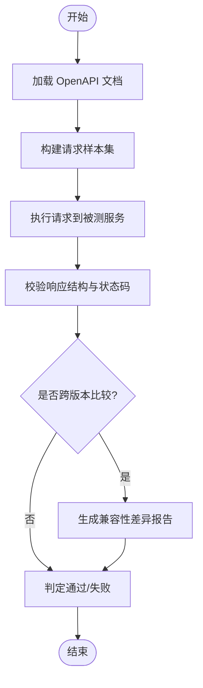
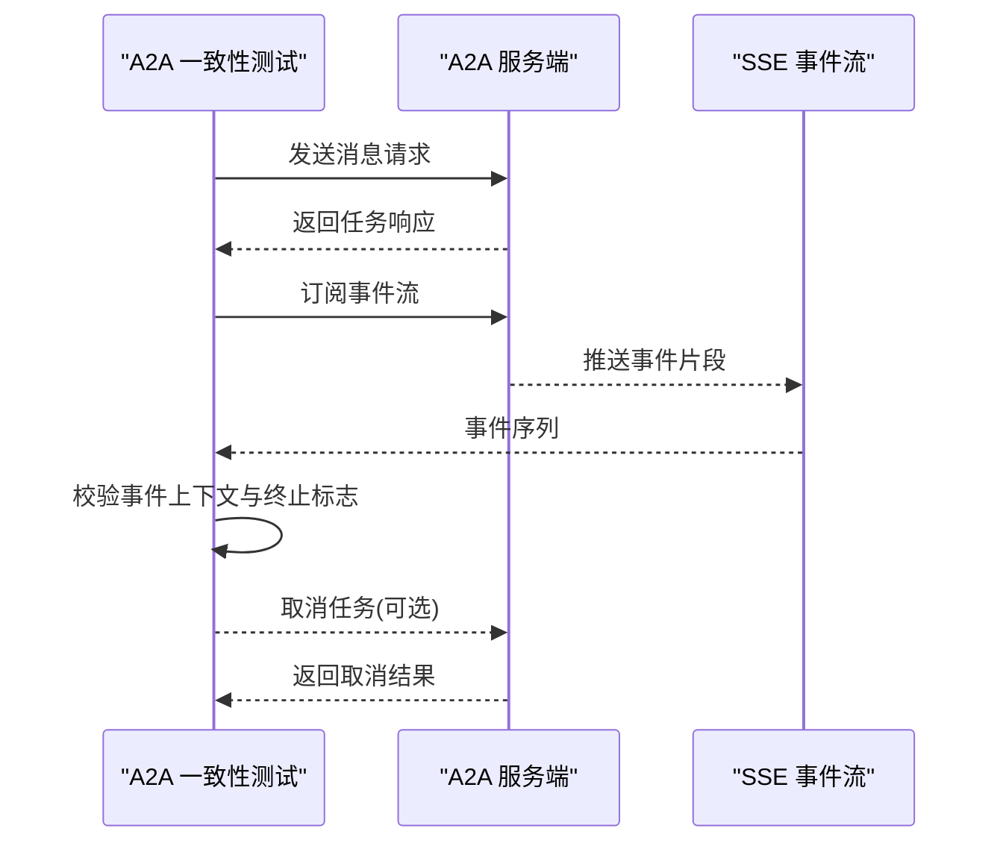
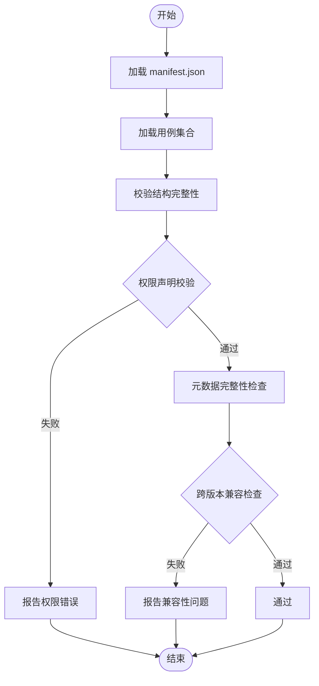
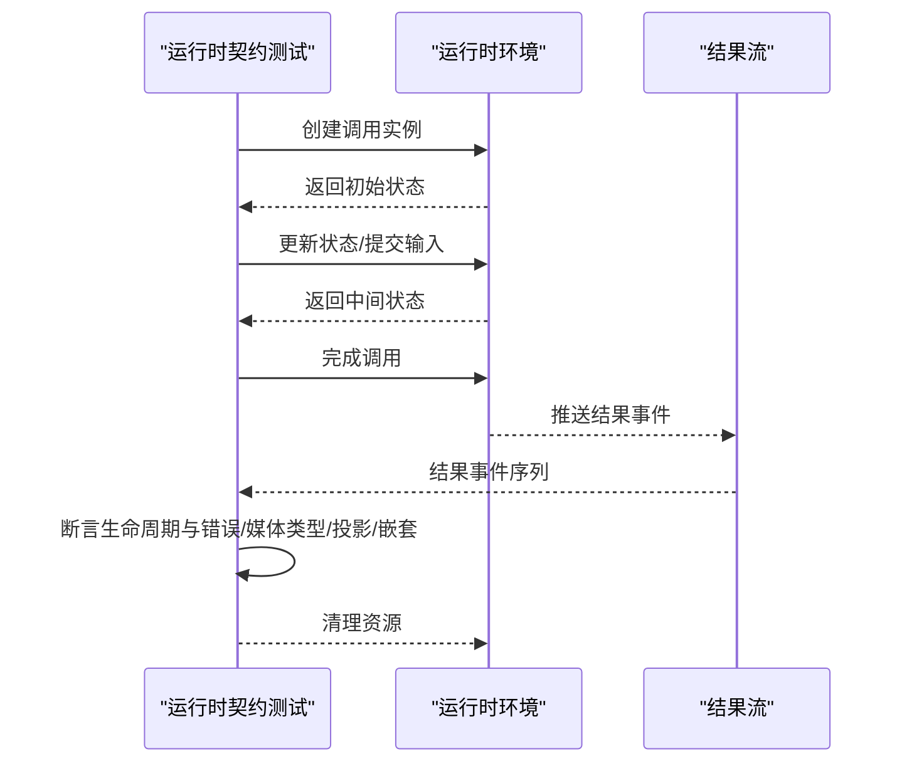
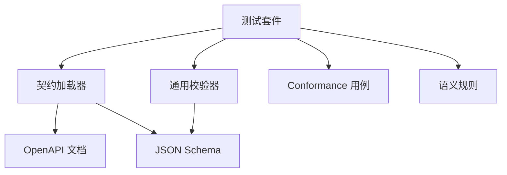

# 契约测试

<cite>
**本文引用的文件**   
- [contracts/contracts.go](file://contracts/contracts.go)
- [contracts/validate.go](file://contracts/validate.go)
- [contracts/a2a_profile_conformance_test.go](file://contracts/a2a_profile_conformance_test.go)
- [contracts/a2a_profile_v02.go](file://contracts/a2a_profile_v02.go)
- [contracts/agent_card_conformance_test.go](file://contracts/agent_card_conformance_test.go)
- [contracts/agent_card_semantics.go](file://contracts/agent_card_semantics.go)
- [contracts/catalog_api_contracts_test.go](file://contracts/catalog_api_contracts_test.go)
- [contracts/workspace_api_contracts_test.go](file://contracts/workspace_api_contracts_test.go)
- [contracts/result_api_contracts_test.go](file://contracts/result_api_contracts_test.go)
- [contracts/runtime_contracts.go](file://contracts/runtime_contracts.go)
- [contracts/runtime_contracts_validation.go](file://contracts/runtime_contracts_validation.go)
- [contracts/runtime_contracts_test.go](file://contracts/runtime_contracts_test.go)
- [contracts/installation_contracts.go](file://contracts/installation_contracts.go)
- [contracts/result_contracts.go](file://contracts/result_contracts.go)
- [contracts/result_contracts_test.go](file://contracts/result_contracts_test.go)
- [contracts/active_contracts_integration_test.go](file://contracts/active_contracts_integration_test.go)
- [contracts/openapi/control-plane.v1.yaml](file://contracts/openapi/control-plane.v1.yaml)
- [contracts/openapi/control-plane.v2.yaml](file://contracts/openapi/control-plane.v2.yaml)
- [contracts/openapi/control-plane.v3.yaml](file://contracts/openapi/control-plane.v3.yaml)
- [contracts/openapi/control-plane-invocation.v4.yaml](file://contracts/openapi/control-plane-invocation.v4.yaml)
- [contracts/openapi/router-agent.v1.yaml](file://contracts/openapi/router-agent.v1.yaml)
- [contracts/openapi/router-internal.v1.yaml](file://contracts/openapi/router-internal.v1.yaml)
- [contracts/openapi/router-internal.v2.yaml](file://contracts/openapi/router-internal.v2.yaml)
- [contracts/openapi/router-internal.v3.yaml](file://contracts/openapi/router-internal.v3.yaml)
- [contracts/schemas/agent-card.v0.2.schema.json](file://contracts/schemas/agent-card.v0.2.schema.json)
- [contracts/schemas/platform-error.v1.schema.json](file://contracts/schemas/platform-error.v1.schema.json)
- [contracts/schemas/platform-error.v2.schema.json](file://contracts/schemas/platform-error.v2.schema.json)
- [contracts/schemas/platform-error.v3.schema.json](file://contracts/schemas/platform-error.v3.schema.json)
- [contracts/schemas/platform-error.v4.schema.json](file://contracts/schemas/platform-error.v4.schema.json)
- [contracts/schemas/common.v1.schema.json](file://contracts/schemas/common.v1.schema.json)
- [contracts/schemas/invocation-event.v0.1.schema.json](file://contracts/schemas/invocation-event.v0.1.schema.json)
- [contracts/schemas/invocation-event.v0.2.schema.json](file://contracts/schemas/invocation-event.v0.2.schema.json)
- [contracts/schemas/invocation-event.v0.3.schema.json](file://contracts/schemas/invocation-event.v0.3.schema.json)
- [contracts/schemas/invocation-result-stream-event.v1.schema.json](file://contracts/schemas/invocation-result-stream-event.v1.schema.json)
- [contracts/schemas/invocation-result-stream-event.v2.schema.json](file://contracts/schemas/invocation-result-stream-event.v2.schema.json)
- [contracts/schemas/invocation-result.v1.schema.json](file://contracts/schemas/invocation-result.v1.schema.json)
- [contracts/schemas/a2a-profile.v0.2.schema.json](file://contracts/schemas/a2a-profile.v0.2.schema.json)
- [contracts/schemas/a2a-profile.v0.3.0.schema.json](file://contracts/schemas/a2a-profile.v0.3.0.schema.json)
- [contracts/schemas/installation.v1.schema.json](file://contracts/schemas/installation.v1.schema.json)
- [contracts/schemas/installation.v2.schema.json](file://contracts/schemas/installation.v2.schema.json)
- [contracts/schemas/workspace.v1.schema.json](file://contracts/schemas/workspace.v1.schema.json)
- [contracts/a2a-profile/v0.3.0/conformance/message-send-request.json](file://contracts/a2a-profile/v0.3.0/conformance/message-send-request.json)
- [contracts/a2a-profile/v0.3.0/conformance/message-send-task-response.json](file://contracts/a2a-profile/v0.3.0/conformance/message-send-task-response.json)
- [contracts/a2a-profile/v0.3.0/conformance/message-stream-request.json](file://contracts/a2a-profile/v0.3.0/conformance/message-stream-request.json)
- [contracts/a2a-profile/v0.3.0/conformance/message-stream-valid.sse](file://contracts/a2a-profile/v0.3.0/conformance/message-stream-valid.sse)
- [contracts/a2a-profile/v0.3.0/conformance/tasks-get-request.json](file://contracts/a2a-profile/v0.3.0/conformance/tasks-get-request.json)
- [contracts/a2a-profile/v0.3.0/conformance/tasks-get-response.json](file://contracts/a2a-profile/v0.3.0/conformance/tasks-get-response.json)
- [contracts/a2a-profile/v0.3.0/conformance/tasks-cancel-request.json](file://contracts/a2a-profile/v0.3.0/conformance/tasks-cancel-request.json)
- [contracts/a2a-profile/v0.3.0/conformance/tasks-cancel-response.json](file://contracts/a2a-profile/v0.3.0/conformance/tasks-cancel-response.json)
- [contracts/a2a-profile/v0.3.0/conformance/manifest.json](file://contracts/a2a-profile/v0.3.0/conformance/manifest.json)
- [contracts/invocation-runtime/v1/conformance/lifecycle.json](file://contracts/invocation-runtime/v1/conformance/lifecycle.json)
- [contracts/invocation-runtime/v1/conformance/errors.json](file://contracts/invocation-runtime/v1/conformance/errors.json)
- [contracts/invocation-runtime/v1/conformance/media.json](file://contracts/invocation-runtime/v1/conformance/media.json)
- [contracts/invocation-runtime/v1/conformance/projection.json](file://contracts/invocation-runtime/v1/conformance/projection.json)
- [contracts/invocation-runtime/v1/conformance/nested.json](file://contracts/invocation-runtime/v1/conformance/nested.json)
- [contracts/invocation-runtime/v1/conformance/result-stream.json](file://contracts/invocation-runtime/v1/conformance/result-stream.json)
- [contracts/invocation/v1/conformance/event-matching-correlation.json](file://contracts/invocation/v1/conformance/event-matching-correlation.json)
- [contracts/invocation/v1/conformance/stream-matching-correlation.json](file://contracts/invocation/v1/conformance/stream-matching-correlation.json)
- [contracts/agent-card/v0.2/conformance/valid-baseline.json](file://contracts/agent-card/v0.2/conformance/valid-baseline.json)
- [contracts/agent-card/v0.2/conformance/invalid-structural-missing-name.json](file://contracts/agent-card/v0.2/conformance/invalid-structural-missing-name.json)
- [contracts/agent-card/v0.2/conformance/invalid-duplicate-skill-id.json](file://contracts/agent-card/v0.2/conformance/invalid-duplicate-skill-id.json)
- [contracts/agent-card/v0.2/conformance/invalid-duplicate-permission-id.json](file://contracts/agent-card/v0.2/conformance/invalid-duplicate-permission-id.json)
- [contracts/agent-card/v0.2/conformance/invalid-endpoint-userinfo-empty.json](file://contracts/agent-card/v0.2/conformance/invalid-endpoint-userinfo-empty.json)
- [contracts/agent-card/v0.2/conformance/invalid-endpoint-userinfo-credentials.json](file://contracts/agent-card/v0.2/conformance/invalid-endpoint-userinfo-credentials.json)
- [contracts/agent-card/v0.2/conformance/invalid-cross-version-permission.json](file://contracts/agent-card/v0.2/conformance/invalid-cross版本权限.json)
- [contracts/agent-card/v0.2/conformance/invalid-mismatched-permission.json](file://contracts/agent-card/v0.2/conformance/invalid-mismatched-permission.json)
- [contracts/agent-card/v0.2/conformance/manifest.json](file://contracts/agent-card/v0.2/conformance/manifest.json)
- [contracts/agent-card/v0.2/semantic-rules.md](file://contracts/agent-card/v0.2/semantic-rules.md)
- [contracts/invocation/v1/semantic-rules.md](file://contracts/invocation/v1/semantic-rules.md)
- [contracts/invocation-runtime/v1/semantic-rules.md](file://contracts/invocation-runtime/v1/semantic-rules.md)
- [contracts/a2a-profile/v0.3.0/profile.v0.2.json](file://contracts/a2a-profile/v0.3.0/profile.v0.2.json)
- [contracts/a2a-profile/v0.3.0.json](file://contracts/a2a-profile/v0.3.0.json)
- [.github/workflows/ci.yml](file://.github/workflows/ci.yml)
</cite>

## 目录
1. [简介](#简介)
2. [项目结构](#项目结构)
3. [核心组件](#核心组件)
4. [架构总览](#架构总览)
5. [详细组件分析](#详细组件分析)
6. [依赖分析](#依赖分析)
7. [性能考虑](#性能考虑)
8. [故障排查指南](#故障排查指南)
9. [结论](#结论)
10. [附录](#附录)

## 简介
本文件面向 NeKiro 平台的“契约测试”体系，覆盖以下目标：
- OpenAPI 规范的自动化验证：端点一致性、请求响应格式与版本兼容性。
- A2A 协议的一致性测试：消息格式、事件流与协议合规性。
- Agent Card 规范验证：卡片结构校验、权限声明与元数据完整性。
- 运行时契约测试：生命周期管理、错误处理与媒体类型支持。
- 持续集成中的自动化执行策略，确保 API 变更不破坏现有客户端。
- 提供端到端的实现示例与流程说明，贯穿所有核心接口。

## 项目结构
契约测试相关代码集中在 contracts 目录，按规范域组织：
- openapi：各服务版本的 OpenAPI 定义（控制面、路由内部、代理等）。
- schemas：JSON Schema 定义，用于结构化数据校验。
- a2a-profile：A2A 协议 v0.3.0 的 profile 与 conformance 用例。
- agent-card：Agent Card v0.2 的语义规则与 conformance 用例。
- invocation / invocation-runtime：调用事件与运行时契约的语义规则与用例。
- Go 测试与工具：将上述规范与用例转化为可执行的契约测试。

图表来源
- [contracts/contracts.go:1-200](file://contracts/contracts.go#L1-L200)
- [contracts/validate.go:1-200](file://contracts/validate.go#L1-L200)
- [contracts/a2a_profile_conformance_test.go:1-200](file://contracts/a2a_profile_conformance_test.go#L1-L200)
- [contracts/agent_card_conformance_test.go:1-200](file://contracts/agent_card_conformance_test.go#L1-L200)
- [contracts/runtime_contracts_test.go:1-200](file://contracts/runtime_contracts_test.go#L1-L200)

章节来源
- [contracts/contracts.go:1-200](file://contracts/contracts.go#L1-L200)
- [contracts/validate.go:1-200](file://contracts/validate.go#L1-L200)

## 核心组件
- 契约加载与注册：集中管理 OpenAPI、Schema、Profile 与语义规则，提供统一入口供测试使用。
- 通用校验器：基于 JSON Schema 的结构化校验、字段约束与枚举值检查。
- 领域测试套件：
  - OpenAPI 契约测试：对控制面与路由内部 API 进行端点与响应体一致性验证。
  - A2A 一致性测试：基于 conformance 用例验证消息发送、任务查询、取消与 SSE 事件流。
  - Agent Card 一致性测试：校验卡片结构、权限声明与跨版本兼容。
  - 运行时契约测试：覆盖生命周期、错误、媒体类型、投影、嵌套与结果流。

章节来源
- [contracts/contracts.go:1-200](file://contracts/contracts.go#L1-L200)
- [contracts/validate.go:1-200](file://contracts/validate.go#L1-L200)
- [contracts/a2a_profile_conformance_test.go:1-200](file://contracts/a2a_profile_conformance_test.go#L1-L200)
- [contracts/agent_card_conformance_test.go:1-200](file://contracts/agent_card_conformance_test.go#L1-L200)
- [contracts/runtime_contracts_test.go:1-200](file://contracts/runtime_contracts_test.go#L1-L200)

## 架构总览
契约测试整体由“规范定义 + 测试驱动 + 校验器”构成。测试通过加载对应版本的 OpenAPI/Schema/Profile，结合 conformance 用例，驱动被测服务或模拟层，断言请求/响应/事件流的合规性。

图表来源
- [contracts/contracts.go:1-200](file://contracts/contracts.go#L1-L200)
- [contracts/validate.go:1-200](file://contracts/validate.go#L1-L200)
- [contracts/a2a_profile_conformance_test.go:1-200](file://contracts/a2a_profile_conformance_test.go#L1-L200)
- [contracts/runtime_contracts_test.go:1-200](file://contracts/runtime_contracts_test.go#L1-L200)

## 详细组件分析

### OpenAPI 契约测试
- 目标：确保控制面与路由内部 API 的端点、方法、路径参数、请求体与响应体严格符合 OpenAPI 定义；同时验证多版本之间的兼容性。
- 关键文件：
  - 控制面 OpenAPI：control-plane.v1.yaml、v2.yaml、v3.yaml
  - 控制面调用 OpenAPI：control-plane-invocation.v4.yaml
  - 路由内部 OpenAPI：router-internal.v1.yaml、v2.yaml、v3.yaml
  - 路由代理 OpenAPI：router-agent.v1.yaml
  - 测试套件：catalog_api_contracts_test.go、workspace_api_contracts_test.go、result_api_contracts_test.go
- 典型流程：
  - 加载指定版本的 OpenAPI 文档。
  - 构造合法与非法的请求样本（含边界条件）。
  - 调用被测服务或模拟层，收集响应。
  - 使用 JSON Schema 与 OpenAPI 模型断言响应结构与状态码。
  - 对比不同版本间的差异，报告破坏性变更。

图表来源
- [contracts/catalog_api_contracts_test.go:1-200](file://contracts/catalog_api_contracts_test.go#L1-L200)
- [contracts/workspace_api_contracts_test.go:1-200](file://contracts/workspace_api_contracts_test.go#L1-L200)
- [contracts/result_api_contracts_test.go:1-200](file://contracts/result_api_contracts_test.go#L1-L200)
- [contracts/openapi/control-plane.v1.yaml:1-200](file://contracts/openapi/control-plane.v1.yaml#L1-L200)
- [contracts/openapi/control-plane.v2.yaml:1-200](file://contracts/openapi/control-plane.v2.yaml#L1-L200)
- [contracts/openapi/control-plane.v3.yaml:1-200](file://contracts/openapi/control-plane.v3.yaml#L1-L200)
- [contracts/openapi/control-plane-invocation.v4.yaml:1-200](file://contracts/openapi/control-plane-invocation.v4.yaml#L1-L200)
- [contracts/openapi/router-internal.v1.yaml:1-200](file://contracts/openapi/router-internal.v1.yaml#L1-L200)
- [contracts/openapi/router-internal.v2.yaml:1-200](file://contracts/openapi/router-internal.v2.yaml#L1-L200)
- [contracts/openapi/router-internal.v3.yaml:1-200](file://contracts/openapi/router-internal.v3.yaml#L1-L200)
- [contracts/openapi/router-agent.v1.yaml:1-200](file://contracts/openapi/router-agent.v1.yaml#L1-L200)

章节来源
- [contracts/catalog_api_contracts_test.go:1-200](file://contracts/catalog_api_contracts_test.go#L1-L200)
- [contracts/workspace_api_contracts_test.go:1-200](file://contracts/workspace_api_contracts_test.go#L1-L200)
- [contracts/result_api_contracts_test.go:1-200](file://contracts/result_api_contracts_test.go#L1-L200)
- [contracts/openapi/control-plane.v1.yaml:1-200](file://contracts/openapi/control-plane.v1.yaml#L1-L200)
- [contracts/openapi/control-plane.v2.yaml:1-200](file://contracts/openapi/control-plane.v2.yaml#L1-L200)
- [contracts/openapi/control-plane.v3.yaml:1-200](file://contracts/openapi/control-plane.v3.yaml#L1-L200)
- [contracts/openapi/control-plane-invocation.v4.yaml:1-200](file://contracts/openapi/control-plane-invocation.v4.yaml#L1-L200)
- [contracts/openapi/router-internal.v1.yaml:1-200](file://contracts/openapi/router-internal.v1.yaml#L1-L200)
- [contracts/openapi/router-internal.v2.yaml:1-200](file://contracts/openapi/router-internal.v2.yaml#L1-L200)
- [contracts/openapi/router-internal.v3.yaml:1-200](file://contracts/openapi/router-internal.v3.yaml#L1-L200)
- [contracts/openapi/router-agent.v1.yaml:1-200](file://contracts/openapi/router-agent.v1.yaml#L1-L200)

### A2A 协议一致性测试
- 目标：验证 A2A 协议的消息发送、任务获取与取消、SSE 事件流等场景，确保服务端行为与 profile 一致。
- 关键文件：
  - Profile 与 Schema：a2a-profile/v0.3.0/profile.v0.2.json、a2a-profile/v0.3.0.json、schemas/a2a-profile.*.schema.json
  - Conformance 用例：message-send-*、tasks-get-*、tasks-cancel-*、message-stream-*、无效用例集合
  - 测试套件：a2a_profile_conformance_test.go、a2a_profile_v02.go
- 典型流程：
  - 加载 manifest.json 与具体用例。
  - 发送消息请求并断言任务响应结构。
  - 订阅事件流，校验事件顺序、上下文匹配与终止条件。
  - 针对无效用例断言错误响应与错误码。

图表来源
- [contracts/a2a_profile_conformance_test.go:1-200](file://contracts/a2a_profile_conformance_test.go#L1-L200)
- [contracts/a2a_profile_v02.go:1-200](file://contracts/a2a_profile_v02.go#L1-L200)
- [contracts/a2a-profile/v0.3.0/conformance/manifest.json:1-200](file://contracts/a2a-profile/v0.3.0/conformance/manifest.json#L1-L200)
- [contracts/a2a-profile/v0.3.0/conformance/message-send-request.json:1-200](file://contracts/a2a-profile/v0.3.0/conformance/message-send-request.json#L1-L200)
- [contracts/a2a-profile/v0.3.0/conformance/message-send-task-response.json:1-200](file://contracts/a2a-profile/v0.3.0/conformance/message-send-task-response.json#L1-L200)
- [contracts/a2a-profile/v0.3.0/conformance/message-stream-request.json:1-200](file://contracts/a2a-profile/v0.3.0/conformance/message-stream-request.json#L1-L200)
- [contracts/a2a-profile/v0.3.0/conformance/message-stream-valid.sse:1-200](file://contracts/a2a-profile/v0.3.0/conformance/message-stream-valid.sse#L1-L200)
- [contracts/a2a-profile/v0.3.0/conformance/tasks-get-request.json:1-200](file://contracts/a2a-profile/v0.3.0/conformance/tasks-get-request.json#L1-L200)
- [contracts/a2a-profile/v0.3.0/conformance/tasks-get-response.json:1-200](file://contracts/a2a-profile/v0.3.0/conformance/tasks-get-response.json#L1-L200)
- [contracts/a2a-profile/v0.3.0/conformance/tasks-cancel-request.json:1-200](file://contracts/a2a-profile/v0.3.0/conformance/tasks-cancel-request.json#L1-L200)
- [contracts/a2a-profile/v0.3.0/conformance/tasks-cancel-response.json:1-200](file://contracts/a2a-profile/v0.3.0/conformance/tasks-cancel-response.json#L1-L200)

章节来源
- [contracts/a2a_profile_conformance_test.go:1-200](file://contracts/a2a_profile_conformance_test.go#L1-L200)
- [contracts/a2a_profile_v02.go:1-200](file://contracts/a2a_profile_v02.go#L1-L200)
- [contracts/a2a-profile/v0.3.0/conformance/manifest.json:1-200](file://contracts/a2a-profile/v0.3.0/conformance/manifest.json#L1-L200)
- [contracts/a2a-profile/v0.3.0/conformance/message-send-request.json:1-200](file://contracts/a2a-profile/v0.3.0/conformance/message-send-request.json#L1-L200)
- [contracts/a2a-profile/v0.3.0/conformance/message-send-task-response.json:1-200](file://contracts/a2a-profile/v0.3.0/conformance/message-send-task-response.json#L1-L200)
- [contracts/a2a-profile/v0.3.0/conformance/message-stream-request.json:1-200](file://contracts/a2a-profile/v0.3.0/conformance/message-stream-request.json#L1-L200)
- [contracts/a2a-profile/v0.3.0/conformance/message-stream-valid.sse:1-200](file://contracts/a2a-profile/v0.3.0/conformance/message-stream-valid.sse#L1-L200)
- [contracts/a2a-profile/v0.3.0/conformance/tasks-get-request.json:1-200](file://contracts/a2a-profile/v0.3.0/conformance/tasks-get-request.json#L1-L200)
- [contracts/a2a-profile/v0.3.0/conformance/tasks-get-response.json:1-200](file://contracts/a2a-profile/v0.3.0/conformance/tasks-get-response.json#L1-L200)
- [contracts/a2a-profile/v0.3.0/conformance/tasks-cancel-request.json:1-200](file://contracts/a2a-profile/v0.3.0/conformance/tasks-cancel-request.json#L1-L200)
- [contracts/a2a-profile/v0.3.0/conformance/tasks-cancel-response.json:1-200](file://contracts/a2a-profile/v0.3.0/conformance/tasks-cancel-response.json#L1-L200)

### Agent Card 规范验证
- 目标：校验 Agent Card 的结构完整性、权限声明正确性与元数据一致性，包括跨版本兼容与共享权限场景。
- 关键文件：
  - 语义规则：agent-card/v0.2/semantic-rules.md
  - Conformance 用例：valid-baseline.json、invalid-structural-missing-name.json、invalid-duplicate-skill-id.json、invalid-duplicate-permission-id.json、invalid-endpoint-userinfo-empty.json、invalid-endpoint-userinfo-credentials.json、invalid-cross-version-permission.json、invalid-mismatched-permission.json、manifest.json
  - 测试套件：agent_card_conformance_test.go、agent_card_semantics.go
- 典型流程：
  - 加载 manifest.json 与用例集合。
  - 对有效用例断言结构完整与语义正确。
  - 对无效用例断言错误信息包含必要字段与提示。
  - 校验权限 ID 唯一性、技能 ID 唯一性与 endpoint.userinfo 必填项。

图表来源
- [contracts/agent_card_conformance_test.go:1-200](file://contracts/agent_card_conformance_test.go#L1-L200)
- [contracts/agent_card_semantics.go:1-200](file://contracts/agent_card_semantics.go#L1-L200)
- [contracts/agent-card/v0.2/conformance/manifest.json:1-200](file://contracts/agent-card/v0.2/conformance/manifest.json#L1-L200)
- [contracts/agent-card/v0.2/conformance/valid-baseline.json:1-200](file://contracts/agent-card/v0.2/conformance/valid-baseline.json#L1-L200)
- [contracts/agent-card/v0.2/conformance/invalid-structural-missing-name.json:1-200](file://contracts/agent-card/v0.2/conformance/invalid-structural-missing-name.json#L1-L200)
- [contracts/agent-card/v0.2/conformance/invalid-duplicate-skill-id.json:1-200](file://contracts/agent-card/v0.2/conformance/invalid-duplicate-skill-id.json#L1-L200)
- [contracts/agent-card/v0.2/conformance/invalid-duplicate-permission-id.json:1-200](file://contracts/agent-card/v0.2/conformance/invalid-duplicate-permission-id.json#L1-L200)
- [contracts/agent-card/v0.2/conformance/invalid-endpoint-userinfo-empty.json:1-200](file://contracts/agent-card/v0.2/conformance/invalid-endpoint-userinfo-empty.json#L1-L200)
- [contracts/agent-card/v0.2/conformance/invalid-endpoint-userinfo-credentials.json:1-200](file://contracts/agent-card/v0.2/conformance/invalid-endpoint-userinfo-credentials.json#L1-L200)
- [contracts/agent-card/v0.2/conformance/invalid-cross-version-permission.json:1-200](file://contracts/agent-card/v0.2/conformance/invalid-cross-version-permission.json#L1-L200)
- [contracts/agent-card/v0.2/conformance/invalid-mismatched-permission.json:1-200](file://contracts/agent-card/v0.2/conformance/invalid-mismatched-permission.json#L1-L200)

章节来源
- [contracts/agent_card_conformance_test.go:1-200](file://contracts/agent_card_conformance_test.go#L1-L200)
- [contracts/agent_card_semantics.go:1-200](file://contracts/agent_card_semantics.go#L1-L200)
- [contracts/agent-card/v0.2/conformance/manifest.json:1-200](file://contracts/agent-card/v0.2/conformance/manifest.json#L1-L200)
- [contracts/agent-card/v0.2/conformance/valid-baseline.json:1-200](file://contracts/agent-card/v0.2/conformance/valid-baseline.json#L1-L200)
- [contracts/agent-card/v0.2/conformance/invalid-structural-missing-name.json:1-200](file://contracts/agent-card/v0.2/conformance/invalid-structural-missing-name.json#L1-L200)
- [contracts/agent-card/v0.2/conformance/invalid-duplicate-skill-id.json:1-200](file://contracts/agent-card/v0.2/conformance/invalid-duplicate-skill-id.json#L1-L200)
- [contracts/agent-card/v0.2/conformance/invalid-duplicate-permission-id.json:1-200](file://contracts/agent-card/v0.2/conformance/invalid-duplicate-permission-id.json#L1-L200)
- [contracts/agent-card/v0.2/conformance/invalid-endpoint-userinfo-empty.json:1-200](file://contracts/agent-card/v0.2/conformance/invalid-endpoint-userinfo-empty.json#L1-L200)
- [contracts/agent-card/v0.2/conformance/invalid-endpoint-userinfo-credentials.json:1-200](file://contracts/agent-card/v0.2/conformance/invalid-endpoint-userinfo-credentials.json#L1-L200)
- [contracts/agent-card/v0.2/conformance/invalid-cross-version-permission.json:1-200](file://contracts/agent-card/v0.2/conformance/invalid-cross-version-permission.json#L1-L200)
- [contracts/agent-card/v0.2/conformance/invalid-mismatched-permission.json:1-200](file://contracts/agent-card/v0.2/conformance/invalid-mismatched-permission.json#L1-L200)

### 运行时契约测试
- 目标：验证调用生命周期、错误处理、媒体类型支持、投影、嵌套调用与结果流传输。
- 关键文件：
  - 语义规则：invocation-runtime/v1/semantic-rules.md
  - Conformance 用例：lifecycle.json、errors.json、media.json、projection.json、nested.json、result-stream.json
  - 测试套件：runtime_contracts_test.go、runtime_contracts_validation.go
- 典型流程：
  - 启动被测运行时环境。
  - 按用例发起调用，断言生命周期阶段转换。
  - 校验错误响应结构与错误码。
  - 验证媒体类型头与内容编码。
  - 检查投影字段与嵌套调用链路。
  - 订阅结果流，断言事件顺序与完整性。

图表来源
- [contracts/runtime_contracts_test.go:1-200](file://contracts/runtime_contracts_test.go#L1-L200)
- [contracts/runtime_contracts_validation.go:1-200](file://contracts/runtime_contracts_validation.go#L1-L200)
- [contracts/invocation-runtime/v1/conformance/lifecycle.json:1-200](file://contracts/invocation-runtime/v1/conformance/lifecycle.json#L1-L200)
- [contracts/invocation-runtime/v1/conformance/errors.json:1-200](file://contracts/invocation-runtime/v1/conformance/errors.json#L1-L200)
- [contracts/invocation-runtime/v1/conformance/media.json:1-200](file://contracts/invocation-runtime/v1/conformance/media.json#L1-L200)
- [contracts/invocation-runtime/v1/conformance/projection.json:1-200](file://contracts/invocation-runtime/v1/conformance/projection.json#L1-L200)
- [contracts/invocation-runtime/v1/conformance/nested.json:1-200](file://contracts/invocation-runtime/v1/conformance/nested.json#L1-L200)
- [contracts/invocation-runtime/v1/conformance/result-stream.json:1-200](file://contracts/invocation-runtime/v1/conformance/result-stream.json#L1-L200)

章节来源
- [contracts/runtime_contracts_test.go:1-200](file://contracts/runtime_contracts_test.go#L1-L200)
- [contracts/runtime_contracts_validation.go:1-200](file://contracts/runtime_contracts_validation.go#L1-L200)
- [contracts/invocation-runtime/v1/conformance/lifecycle.json:1-200](file://contracts/invocation-runtime/v1/conformance/lifecycle.json#L1-L200)
- [contracts/invocation-runtime/v1/conformance/errors.json:1-200](file://contracts/invocation-runtime/v1/conformance/errors.json#L1-L200)
- [contracts/invocation-runtime/v1/conformance/media.json:1-200](file://contracts/invocation-runtime/v1/conformance/media.json#L1-L200)
- [contracts/invocation-runtime/v1/conformance/projection.json:1-200](file://contracts/invocation-runtime/v1/conformance/projection.json#L1-L200)
- [contracts/invocation-runtime/v1/conformance/nested.json:1-200](file://contracts/invocation-runtime/v1/conformance/nested.json#L1-L200)
- [contracts/invocation-runtime/v1/conformance/result-stream.json:1-200](file://contracts/invocation-runtime/v1/conformance/result-stream.json#L1-L200)

### 安装与工作区契约
- 目标：验证工作区安装、生命周期与巡检相关的 API 契约。
- 关键文件：
  - installation_contracts.go
  - workspace_api_contracts_test.go
  - 相关 OpenAPI 与 Schema 定义

章节来源
- [contracts/installation_contracts.go:1-200](file://contracts/installation_contracts.go#L1-L200)
- [contracts/workspace_api_contracts_test.go:1-200](file://contracts/workspace_api_contracts_test.go#L1-L200)

### 结果交付契约
- 目标：验证结果 API 的端点与响应体一致性，以及结果流事件的语义。
- 关键文件：
  - result_contracts.go、result_contracts_test.go
  - result_api_contracts_test.go
  - invocation 与 invocation-runtime 的 schema 与用例

章节来源
- [contracts/result_contracts.go:1-200](file://contracts/result_contracts.go#L1-L200)
- [contracts/result_contracts_test.go:1-200](file://contracts/result_contracts_test.go#L1-L200)
- [contracts/result_api_contracts_test.go:1-200](file://contracts/result_api_contracts_test.go#L1-L200)

## 依赖分析
- 组件耦合：
  - 测试套件依赖契约加载器与通用校验器。
  - 校验器依赖 JSON Schema 与 OpenAPI 模型。
  - 领域测试套件分别依赖各自领域的 conformance 用例与语义规则。
- 外部依赖：
  - OpenAPI 解析库（用于加载 .yaml 文档）。
  - JSON Schema 验证库（用于结构化校验）。
  - HTTP/SSE 客户端（用于网络交互与事件流订阅）。

图表来源
- [contracts/contracts.go:1-200](file://contracts/contracts.go#L1-L200)
- [contracts/validate.go:1-200](file://contracts/validate.go#L1-L200)
- [contracts/a2a_profile_conformance_test.go:1-200](file://contracts/a2a_profile_conformance_test.go#L1-L200)
- [contracts/agent_card_conformance_test.go:1-200](file://contracts/agent_card_conformance_test.go#L1-L200)
- [contracts/runtime_contracts_test.go:1-200](file://contracts/runtime_contracts_test.go#L1-L200)

章节来源
- [contracts/contracts.go:1-200](file://contracts/contracts.go#L1-L200)
- [contracts/validate.go:1-200](file://contracts/validate.go#L1-L200)

## 性能考虑
- 并行执行：为每个契约域（OpenAPI、A2A、Agent Card、运行时）独立测试包，利用 Go 测试并行能力提升执行效率。
- 用例裁剪：在 CI 中根据变更范围选择性地执行相关契约测试，减少不必要开销。
- 资源复用：共享契约加载器与校验器实例，避免重复解析与编译开销。
- 超时与重试：对网络交互设置合理超时与重试策略，避免偶发网络抖动导致误报。

[本节为一般性指导，无需特定文件引用]

## 故障排查指南
- 常见错误定位：
  - 响应体结构不符：检查 JSON Schema 与 OpenAPI 模型定义，确认字段名、类型与必填项。
  - 事件流异常：核对 SSE 事件顺序、上下文匹配与终止标志，参考 conformance 用例。
  - 权限声明错误：校验权限 ID 唯一性与 endpoint.userinfo 必填项，参考 Agent Card 语义规则。
  - 运行时错误：对照 errors.json 与 semantic-rules.md，确认错误码与错误消息结构。
- 调试建议：
  - 启用详细日志，记录请求/响应与事件流。
  - 使用最小化用例复现问题，逐步缩小范围。
  - 对比不同版本 OpenAPI 的差异，识别破坏性变更。

章节来源
- [contracts/validate.go:1-200](file://contracts/validate.go#L1-L200)
- [contracts/a2a-profile/v0.3.0/conformance/manifest.json:1-200](file://contracts/a2a-profile/v0.3.0/conformance/manifest.json#L1-L200)
- [contracts/agent-card/v0.2/conformance/manifest.json:1-200](file://contracts/agent-card/v0.2/conformance/manifest.json#L1-L200)
- [contracts/invocation-runtime/v1/conformance/errors.json:1-200](file://contracts/invocation-runtime/v1/conformance/errors.json#L1-L200)

## 结论
NeKiro 平台的契约测试体系以“规范即代码”为核心，通过 OpenAPI、JSON Schema、Profile 与语义规则驱动自动化测试，覆盖 API 一致性、A2A 协议合规、Agent Card 结构与运行时契约。借助持续集成流水线，可在每次变更时快速发现破坏性修改，保障平台稳定性与向后兼容。

[本节为总结性内容，无需特定文件引用]

## 附录

### 持续集成自动化执行
- 触发方式：在 PR 合并或主分支推送时触发 GitHub Actions。
- 执行步骤：
  - 拉取代码与依赖。
  - 运行契约测试套件（OpenAPI、A2A、Agent Card、运行时）。
  - 收集测试报告与产物。
  - 失败时阻断合并并通知团队。
- 配置要点：
  - 缓存依赖与契约解析结果。
  - 并行执行测试包以提升速度。
  - 选择性执行：仅运行与变更相关的契约测试。

章节来源
- [.github/workflows/ci.yml:1-200](file://.github/workflows/ci.yml#L1-L200)

### 具体实现示例（路径指引）
- OpenAPI 契约测试示例：
  - [catalog_api_contracts_test.go](file://contracts/catalog_api_contracts_test.go)
  - [workspace_api_contracts_test.go](file://contracts/workspace_api_contracts_test.go)
  - [result_api_contracts_test.go](file://contracts/result_api_contracts_test.go)
- A2A 一致性测试示例：
  - [a2a_profile_conformance_test.go](file://contracts/a2a_profile_conformance_test.go)
  - [a2a_profile_v02.go](file://contracts/a2a_profile_v02.go)
- Agent Card 一致性测试示例：
  - [agent_card_conformance_test.go](file://contracts/agent_card_conformance_test.go)
  - [agent_card_semantics.go](file://contracts/agent_card_semantics.go)
- 运行时契约测试示例：
  - [runtime_contracts_test.go](file://contracts/runtime_contracts_test.go)
  - [runtime_contracts_validation.go](file://contracts/runtime_contracts_validation.go)
- 活跃契约集成测试示例：
  - [active_contracts_integration_test.go](file://contracts/active_contracts_integration_test.go)