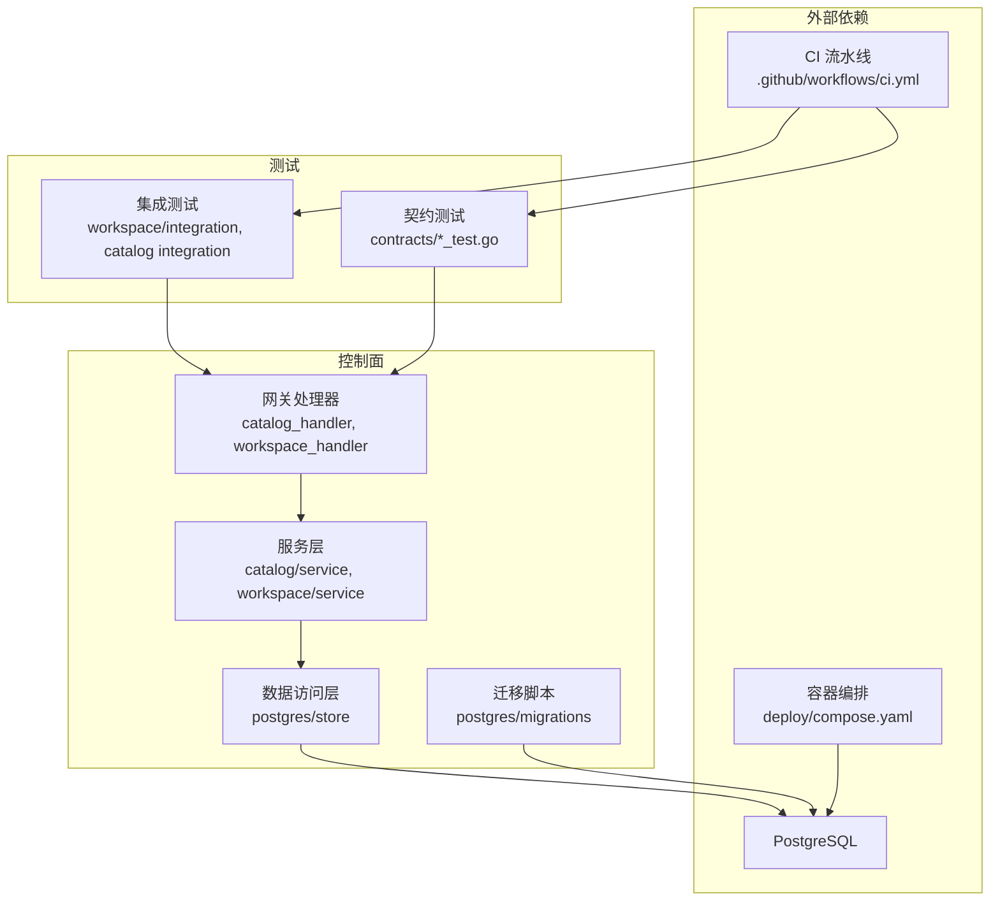
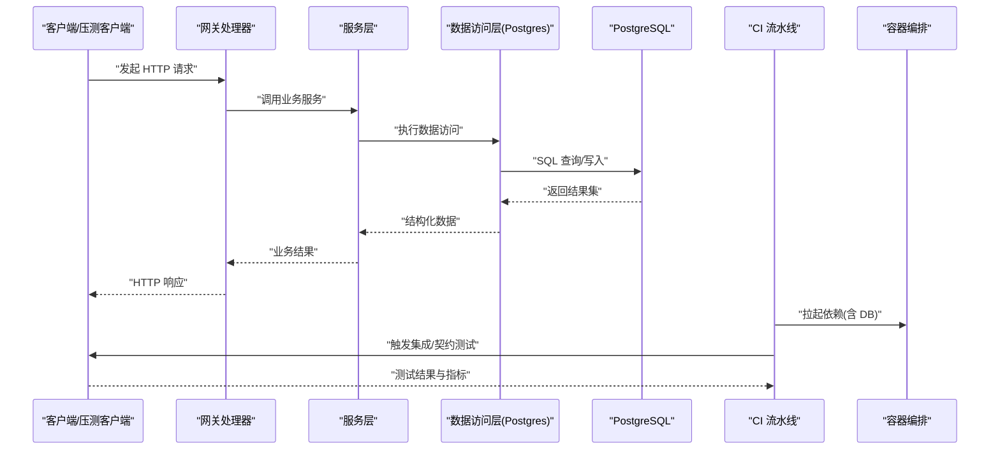
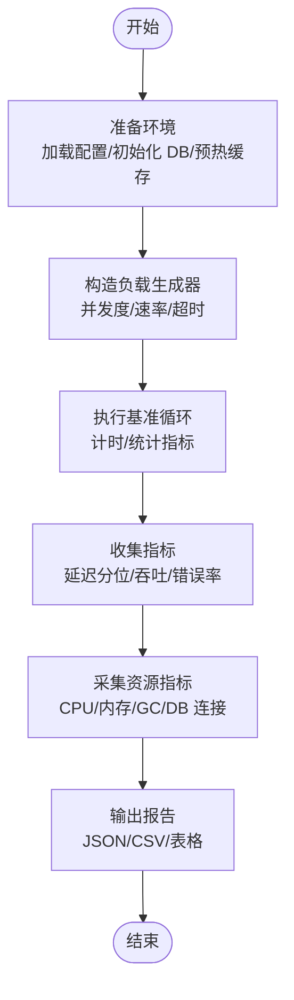
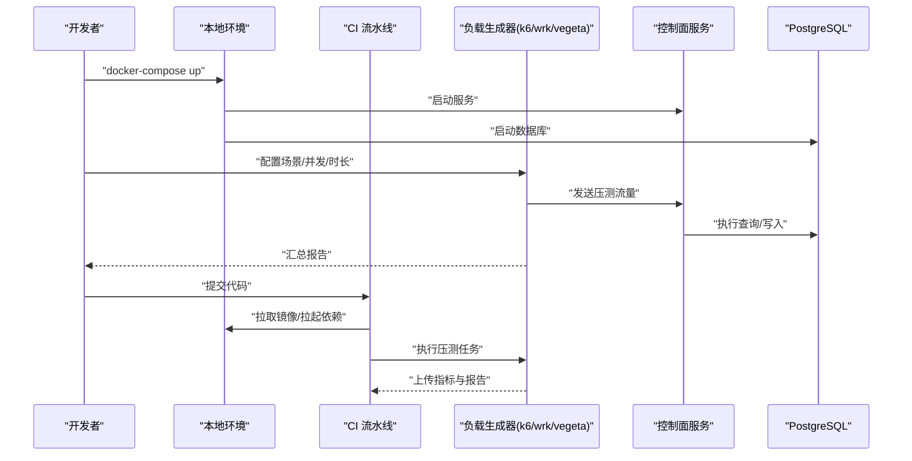
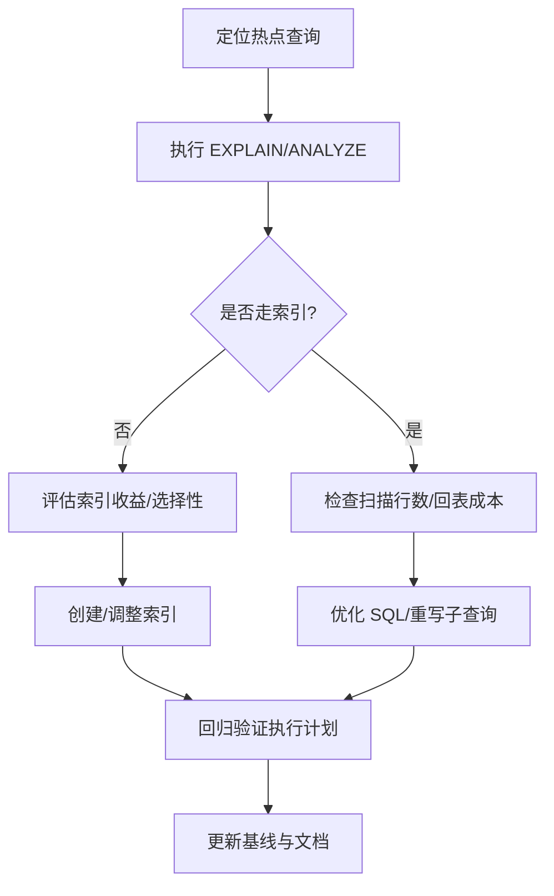
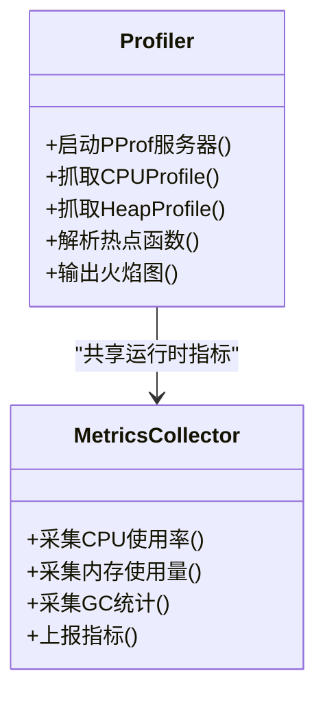
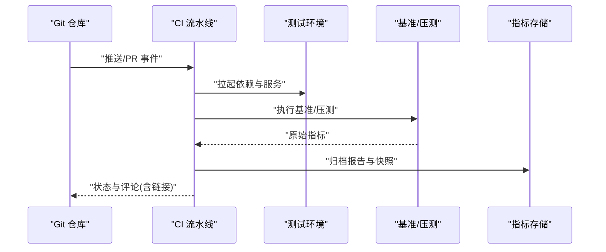
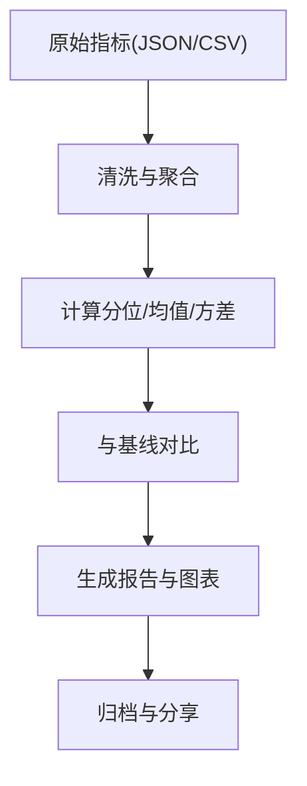
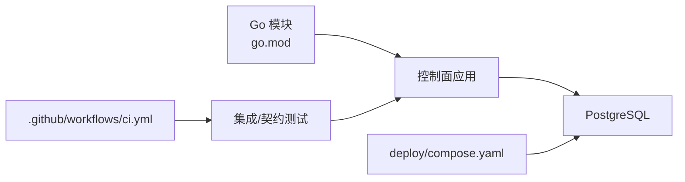

# 性能测试

<cite>
**本文引用的文件**   
- [README.md](file://README.md)
- [go.mod](file://go.mod)
- [ci.yml](file://.github/workflows/ci.yml)
- [compose.yaml](file://deploy/compose.yaml)
- [main.go](file://apps/control-plane/cmd/control-plane/main.go)
- [config.go](file://apps/control-plane/internal/config/config.go)
- [store.go](file://apps/control-plane/internal/catalog/postgres/store.go)
- [migrations.go](file://apps/control-plane/internal/catalog/postgres/migrations.go)
- [store_test.go](file://apps/control-plane/internal/workspace/postgres/store_test.go)
- [migrations_integration_test.go](file://apps/control-plane/internal/catalog/postgres/migrations_integration_test.go)
- [catalog_handler_test.go](file://apps/control-plane/internal/gateway/catalog_handler_test.go)
- [workspace_handler_test.go](file://apps/control-plane/internal/gateway/workspace_handler_test.go)
- [acceptance_http_test.go](file://apps/control-plane/internal/workspace/integration/acceptance_http_test.go)
- [inspection_integration_test.go](file://apps/control-plane/internal/workspace/postgres/inspection_integration_test.go)
- [catalog_test.go](file://tests/integration/catalog/catalog_test.go)
</cite>

## 目录
1. [简介](#简介)
2. [项目结构](#项目结构)
3. [核心组件](#核心组件)
4. [架构总览](#架构总览)
5. [详细组件分析](#详细组件分析)
6. [依赖分析](#依赖分析)
7. [性能考虑](#性能考虑)
8. [故障排查指南](#故障排查指南)
9. [结论](#结论)
10. [附录](#附录) 

## 简介
本文件为 NeKiro 平台建立性能与压力测试框架的权威指南，覆盖以下目标：
- 性能基准测试编写方法：并发请求模拟、响应时间测量、资源使用监控
- 压力测试配置与执行：负载生成器设置、测试场景设计、指标收集
- 数据库性能测试：查询优化验证、连接池调优、索引效果评估
- 内存泄漏检测与 CPU 性能分析工具使用
- 性能回归自动化流程：确保代码变更不影响系统性能
- 报告生成与趋势分析：识别瓶颈与优化机会

## 项目结构
NeKiro 采用多应用与契约驱动的结构。控制面位于 apps/control-plane，包含网关、编目与工作区等模块；数据库层基于 Postgres；集成与契约测试分布于 tests 与 contracts 目录；CI 流水线在 .github/workflows 中定义；部署编排通过 deploy/compose.yaml 管理。

图表来源
- [main.go:1-200](file://apps/control-plane/cmd/control-plane/main.go#L1-L200)
- [catalog_handler_test.go:1-200](file://apps/control-plane/internal/gateway/catalog_handler_test.go#L1-L200)
- [workspace_handler_test.go:1-200](file://apps/control-plane/internal/gateway/workspace_handler_test.go#L1-L200)
- [store.go:1-200](file://apps/control-plane/internal/catalog/postgres/store.go#L1-L200)
- [migrations.go:1-200](file://apps/control-plane/internal/catalog/postgres/migrations.go#L1-L200)
- [ci.yml:1-200](file://.github/workflows/ci.yml#L1-L200)
- [compose.yaml:1-200](file://deploy/compose.yaml#L1-L200)

章节来源
- [README.md:1-200](file://README.md#L1-L200)
- [go.mod:1-200](file://go.mod#L1-L200)
- [ci.yml:1-200](file://.github/workflows/ci.yml#L1-L200)
- [compose.yaml:1-200](file://deploy/compose.yaml#L1-L200)

## 核心组件
- 控制面入口与配置
  - 入口程序负责启动 HTTP 服务、加载配置、初始化中间件与路由
  - 配置项涵盖监听端口、日志级别、数据库连接参数等
- 网关层
  - 编目与工作区处理器暴露 REST API，承载鉴权、追踪与错误处理
- 服务层
  - 业务编排与领域逻辑，调用数据访问层完成持久化
- 数据访问层（Postgres）
  - 封装 SQL 操作、事务与游标分页；提供迁移能力
- 测试套件
  - 集成测试覆盖 HTTP 端到端路径与数据库交互
  - 契约测试校验接口一致性

章节来源
- [main.go:1-200](file://apps/control-plane/cmd/control-plane/main.go#L1-L200)
- [config.go:1-200](file://apps/control-plane/internal/config/config.go#L1-L200)
- [catalog_handler_test.go:1-200](file://apps/control-plane/internal/gateway/catalog_handler_test.go#L1-L200)
- [workspace_handler_test.go:1-200](file://apps/control-plane/internal/gateway/workspace_handler_test.go#L1-L200)
- [store.go:1-200](file://apps/control-plane/internal/catalog/postgres/store.go#L1-L200)
- [migrations.go:1-200](file://apps/control-plane/internal/catalog/postgres/migrations.go#L1-L200)

## 架构总览
下图展示从客户端到数据库的关键路径，以及测试与 CI 如何介入该路径进行性能与稳定性验证。

图表来源
- [catalog_handler_test.go:1-200](file://apps/control-plane/internal/gateway/catalog_handler_test.go#L1-L200)
- [workspace_handler_test.go:1-200](file://apps/control-plane/internal/gateway/workspace_handler_test.go#L1-L200)
- [store.go:1-200](file://apps/control-plane/internal/catalog/postgres/store.go#L1-L200)
- [ci.yml:1-200](file://.github/workflows/ci.yml#L1-L200)
- [compose.yaml:1-200](file://deploy/compose.yaml#L1-L200)

## 详细组件分析

### 性能基准测试框架设计
- 目标
  - 以 Go 标准库 testing 为基础，构建可复用的基准测试模板，覆盖关键 API 与数据访问路径
  - 支持并发度、迭代次数、超时与采样策略的可配置化
- 关键要素
  - 并发请求模拟：使用并行基准或自定义 goroutine 并发模型
  - 响应时间测量：记录 P50/P90/P99 延迟、吞吐（QPS）、错误率
  - 资源使用监控：采集 CPU、内存、GC、goroutine 数量、DB 连接数
- 建议实现位置
  - 在现有 *_test.go 文件中新增基准测试用例，遵循命名约定 BenchmarkXxx
  - 将通用基准辅助函数抽取至内部包以便复用

[此图为概念性流程图，无需图表来源]

章节来源
- [catalog_handler_test.go:1-200](file://apps/control-plane/internal/gateway/catalog_handler_test.go#L1-L200)
- [workspace_handler_test.go:1-200](file://apps/control-plane/internal/gateway/workspace_handler_test.go#L1-L200)
- [store_test.go:1-200](file://apps/control-plane/internal/workspace/postgres/store_test.go#L1-L200)

### 压力测试配置与执行
- 负载生成器
  - 可选用 k6、wrk、vegeta 等工具；推荐在 CI 中以容器方式运行，便于隔离与度量
- 测试场景设计
  - 典型场景：编目查询、工作区创建/读取、批量导入、流式任务获取
  - 场景参数：并发用户数、持续时间、Ramp-up 曲线、失败重试策略
- 指标收集
  - 网络层：请求/秒、错误率、TLS 握手耗时
  - 应用层：P95/P99 延迟、队列积压、线程/协程占用
  - 数据库层：QPS、慢查询、锁等待、连接池命中率
- 执行流程
  - 本地：通过 compose 拉起依赖，启动应用，运行压测脚本
  - CI：在流水线中按阶段拉起依赖、执行压测、归档报告

图表来源
- [ci.yml:1-200](file://.github/workflows/ci.yml#L1-L200)
- [compose.yaml:1-200](file://deploy/compose.yaml#L1-L200)

章节来源
- [ci.yml:1-200](file://.github/workflows/ci.yml#L1-L200)
- [compose.yaml:1-200](file://deploy/compose.yaml#L1-L200)

### 数据库性能测试方法
- 查询优化验证
  - 针对热点查询添加 EXPLAIN/EXPLAIN ANALYZE 基线，纳入回归检查
  - 对复杂 JOIN 与子查询进行改写对比，记录执行计划差异
- 连接池调优
  - 调整最大连接数、空闲连接回收、连接超时与重连策略
  - 在高并发下观察连接耗尽与排队现象
- 索引效果评估
  - 通过覆盖率与选择性指标选择合适索引
  - 定期重建/重组索引，避免碎片影响性能

[此图为概念性流程图，无需图表来源]

章节来源
- [store.go:1-200](file://apps/control-plane/internal/catalog/postgres/store.go#L1-L200)
- [migrations.go:1-200](file://apps/control-plane/internal/catalog/postgres/migrations.go#L1-L200)
- [migrations_integration_test.go:1-200](file://apps/control-plane/internal/catalog/postgres/migrations_integration_test.go#L1-L200)
- [inspection_integration_test.go:1-200](file://apps/control-plane/internal/workspace/postgres/inspection_integration_test.go#L1-L200)

### 内存泄漏检测与 CPU 性能分析
- 内存泄漏检测
  - 使用 pprof 的 heap profile 对比不同版本间对象增长
  - 结合 go test -memprofile 与长时间压测观察 GC 行为
- CPU 性能分析
  - 使用 pprof 的 cpu profile 定位热点函数
  - 结合火焰图分析热路径，减少锁竞争与频繁分配
- 实践建议
  - 在压测过程中开启 pprof 端点，周期性抓取快照
  - 将关键指标纳入报告，作为回归阈值

[此图为概念性类图，无需图表来源]

章节来源
- [catalog_handler_test.go:1-200](file://apps/control-plane/internal/gateway/catalog_handler_test.go#L1-L200)
- [workspace_handler_test.go:1-200](file://apps/control-plane/internal/gateway/workspace_handler_test.go#L1-L200)

### 性能回归测试自动化流程
- 触发条件
  - 代码提交、合并到主干、发布候选版本
- 执行步骤
  - 拉起依赖（数据库、缓存等）
  - 运行单元测试与契约测试
  - 执行基准与压力测试，收集指标
  - 与历史基线对比，超过阈值则失败并告警
- 产物归档
  - 保存 JSON/CSV 报告、pprof 快照、数据库执行计划
  - 生成可视化图表与趋势分析

图表来源
- [ci.yml:1-200](file://.github/workflows/ci.yml#L1-L200)

章节来源
- [ci.yml:1-200](file://.github/workflows/ci.yml#L1-L200)

### 报告生成与趋势分析
- 报告内容
  - 延迟分位、吞吐、错误率、资源使用、数据库执行计划
- 趋势分析
  - 按提交/分支/版本维度聚合指标，绘制趋势图
  - 设定阈值与告警规则，自动标记回归
- 工具建议
  - 使用统一格式导出（JSON/CSV），配合可视化工具（Grafana/自研看板）

[此图为概念性流程图，无需图表来源]

## 依赖分析
- 语言与依赖
  - Go 模块与依赖声明位于 go.mod
- 外部依赖
  - PostgreSQL 由 compose 编排拉起
- 测试与契约
  - 集成测试与契约测试分别覆盖功能正确性与接口一致性

图表来源
- [go.mod:1-200](file://go.mod#L1-L200)
- [ci.yml:1-200](file://.github/workflows/ci.yml#L1-L200)
- [compose.yaml:1-200](file://deploy/compose.yaml#L1-L200)

章节来源
- [go.mod:1-200](file://go.mod#L1-L200)
- [ci.yml:1-200](file://.github/workflows/ci.yml#L1-L200)
- [compose.yaml:1-200](file://deploy/compose.yaml#L1-L200)

## 性能考虑
- 应用层
  - 减少不必要的序列化/反序列化，复用缓冲与对象
  - 合理设置超时与重试，避免雪崩
- 数据库层
  - 优先使用索引覆盖查询，避免全表扫描
  - 控制事务粒度，降低锁竞争
- 资源利用
  - 监控 goroutine 与内存分配，避免长尾 GC
  - 限制并发度与背压，保护下游依赖

[本节为通用指导，不直接分析具体文件]

## 故障排查指南
- 常见问题
  - 连接池耗尽：检查最大连接数与空闲回收策略
  - 慢查询：查看执行计划与索引选择性
  - 高延迟：分析热点函数与锁竞争
- 诊断手段
  - 启用 pprof 端点，抓取 CPU/Heap Profile
  - 收集数据库慢查询日志与执行计划
  - 在压测期间持续采集系统资源指标

章节来源
- [store.go:1-200](file://apps/control-plane/internal/catalog/postgres/store.go#L1-L200)
- [migrations.go:1-200](file://apps/control-plane/internal/catalog/postgres/migrations.go#L1-L200)
- [catalog_handler_test.go:1-200](file://apps/control-plane/internal/gateway/catalog_handler_test.go#L1-L200)
- [workspace_handler_test.go:1-200](file://apps/control-plane/internal/gateway/workspace_handler_test.go#L1-L200)

## 结论
通过在本项目中引入标准化的基准与压力测试、完善的数据库性能验证、内存与 CPU 分析工具链，以及自动化的回归流程与报告体系，NeKiro 平台能够在持续演进中保持高性能与稳定性。建议团队将上述流程固化为日常开发规范，并在 CI 中强制执行。

## 附录
- 快速上手
  - 本地：使用 compose 拉起依赖，运行集成测试与基准测试
  - CI：在流水线中增加压测阶段，归档报告与快照
- 参考文件
  - 入口与配置：[main.go](file://apps/control-plane/cmd/control-plane/main.go), [config.go](file://apps/control-plane/internal/config/config.go)
  - 数据访问与迁移：[store.go](file://apps/control-plane/internal/catalog/postgres/store.go), [migrations.go](file://apps/control-plane/internal/catalog/postgres/migrations.go)
  - 集成与契约测试：[acceptance_http_test.go](file://apps/control-plane/internal/workspace/integration/acceptance_http_test.go), [catalog_test.go](file://tests/integration/catalog/catalog_test.go)
  - 流水线与编排：[ci.yml](file://.github/workflows/ci.yml), [compose.yaml](file://deploy/compose.yaml)