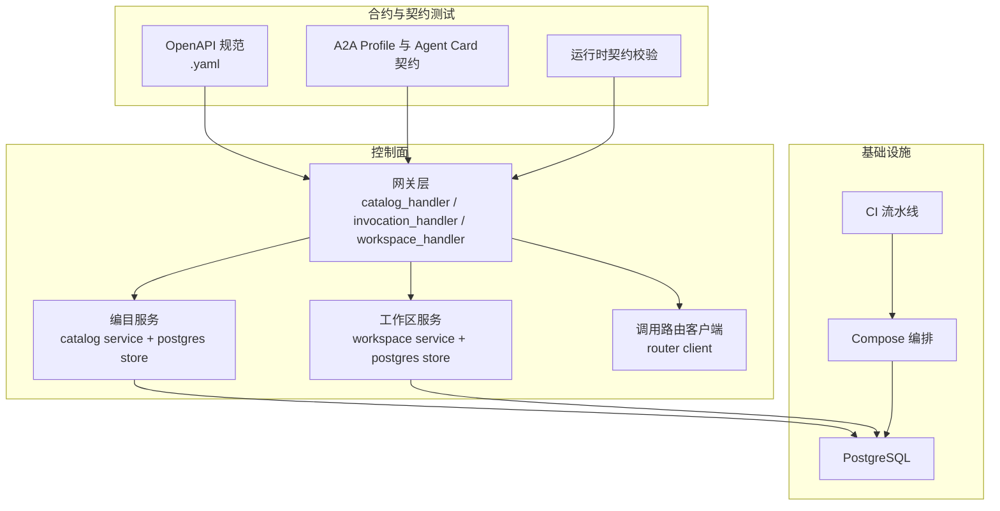
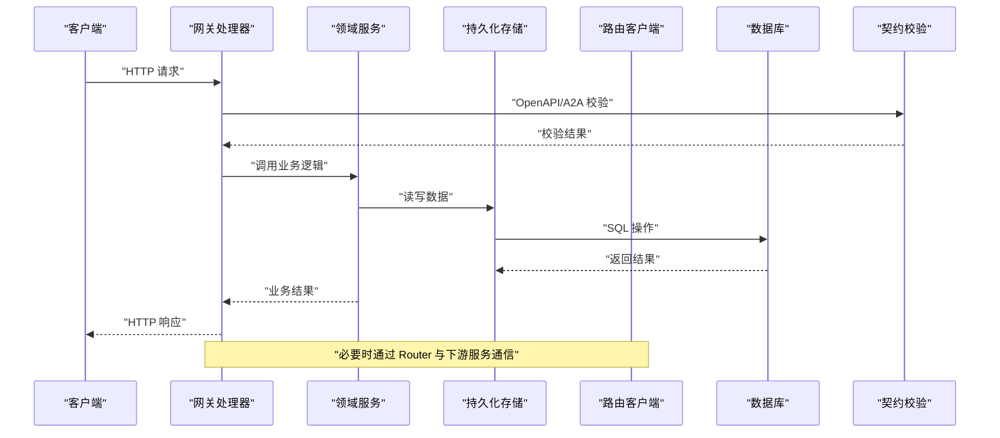
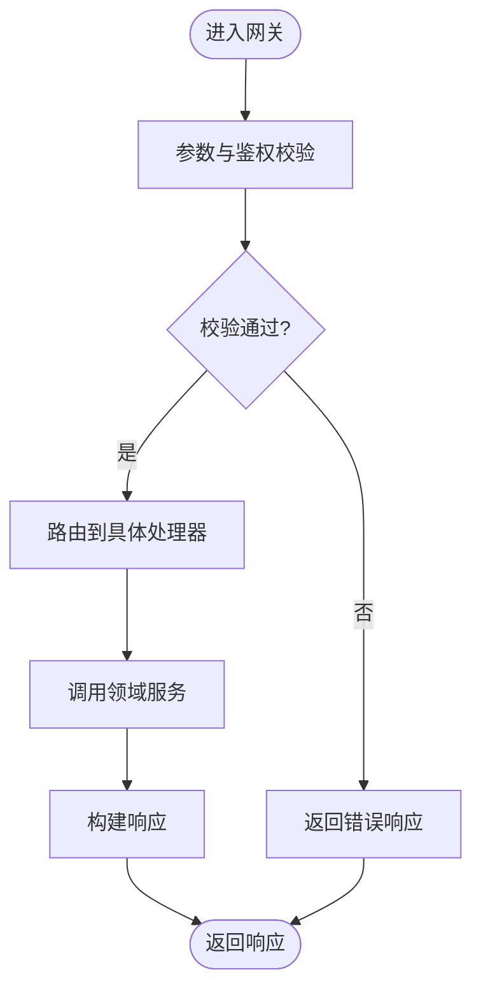
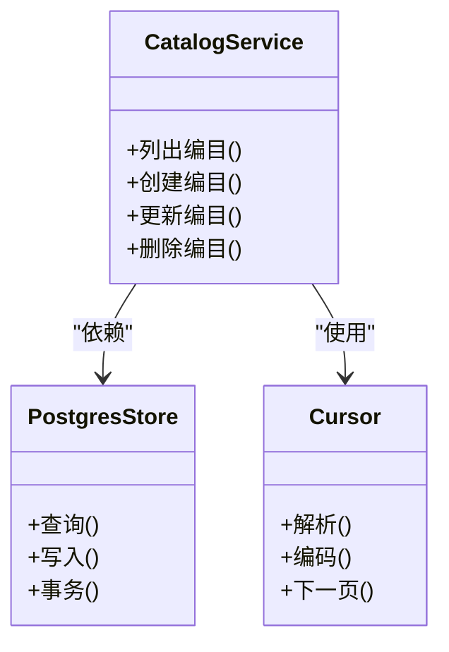
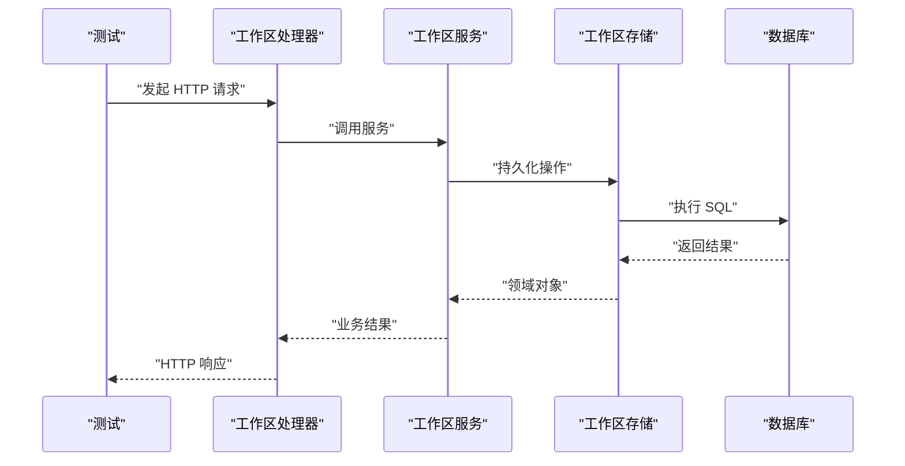
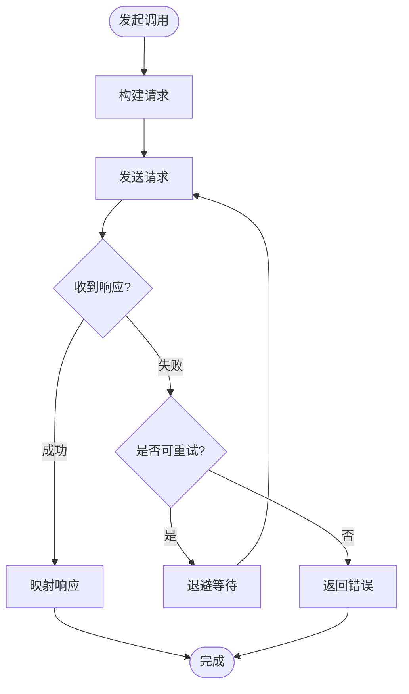
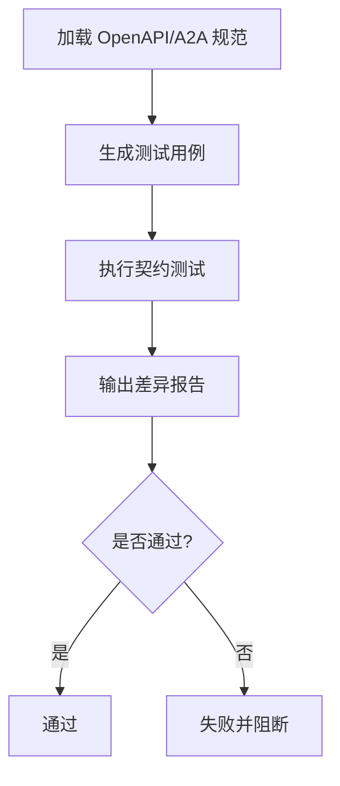
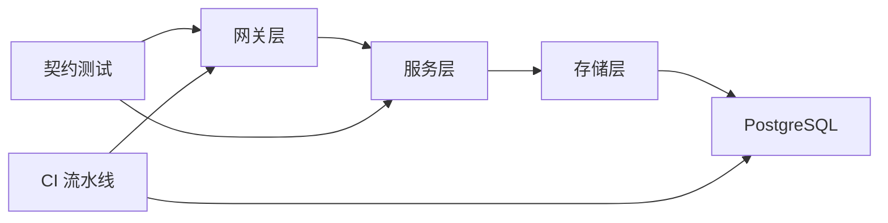

# 测试策略

<cite>
**本文引用的文件**   
- [ci.yml](file://.github/workflows/ci.yml)
- [main_test.go](file://apps/control-plane/cmd/control-plane/main_test.go)
- [migrations_integration_test.go](file://apps/control-plane/internal/catalog/postgres/migrations_integration_test.go)
- [store_test.go](file://apps/control-plane/internal/workspace/postgres/store_test.go)
- [acceptance_http_test.go](file://apps/control-plane/internal/workspace/integration/acceptance_http_test.go)
- [workspace_test.go](file://apps/control-plane/internal/workspace/integration/workspace_test.go)
- [catalog_handler_test.go](file://apps/control-plane/internal/gateway/catalog_handler_test.go)
- [invocation_handler_test.go](file://apps/control-plane/internal/gateway/invocation_handler_test.go)
- [workspace_handler_test.go](file://apps/control-plane/internal/gateway/workspace_handler_test.go)
- [router_client_test.go](file://apps/control-plane/internal/invocation/router_client_test.go)
- [service_test.go](file://apps/control-plane/internal/catalog/service_test.go)
- [config_test.go](file://apps/control-plane/internal/config/config_test.go)
- [cursor_test.go](file://apps/control-plane/internal/catalog/cursor_test.go)
- [a2a_profile_conformance_test.go](file://contracts/a2a_profile_conformance_test.go)
- [agent_card_conformance_test.go](file://contracts/agent_card_conformance_test.go)
- [active_contracts_integration_test.go](file://contracts/active_contracts_integration_test.go)
- [catalog_api_contracts_test.go](file://contracts/catalog_api_contracts_test.go)
- [result_api_contracts_test.go](file://contracts/result_api_contracts_test.go)
- [workspace_api_contracts_test.go](file://contracts/workspace_api_contracts_test.go)
- [runtime_contracts_validation.go](file://contracts/runtime_contracts_validation.go)
- [control-plane.v1.yaml](file://contracts/openapi/control-plane.v1.yaml)
- [control-plane.v2.yaml](file://contracts/openapi/control-plane.v2.yaml)
- [control-plane.v3.yaml](file://contracts/openapi/control-plane.v3.yaml)
- [control-plane-invocation.v4.yaml](file://contracts/openapi/control-plane-invocation.v4.yaml)
- [router-agent.v1.yaml](file://contracts/openapi/router-agent.v1.yaml)
- [router-internal.v1.yaml](file://contracts/openapi/router-internal.v1.yaml)
- [router-internal.v2.yaml](file://contracts/openapi/router-internal.v2.yaml)
- [router-internal.v3.yaml](file://contracts/openapi/router-internal.v3.yaml)
- [compose.yaml](file://deploy/compose.yaml)
- [vitest.config.ts](file://vitest.config.ts)
</cite>

## 目录
1. [简介](#简介)
2. [项目结构](#项目结构)
3. [核心组件](#核心组件)
4. [架构总览](#架构总览)
5. [详细组件分析](#详细组件分析)
6. [依赖分析](#依赖分析)
7. [性能考虑](#性能考虑)
8. [故障排查指南](#故障排查指南)
9. [结论](#结论)
10. [附录](#附录)

## 简介
本文件为 NeKiro 平台提供完整的测试策略与实现指南，覆盖单元测试、集成测试、契约测试（OpenAPI 与 A2A 协议一致性）、性能与压力测试、覆盖率要求以及持续集成自动化流程。目标是帮助开发者快速理解并落地可维护、可验证、可演进的测试体系。

## 项目结构
仓库采用多应用与合约分离的组织方式：
- 控制面服务位于 apps/control-plane，包含网关、编目、工作区、调用路由等子系统，配套大量 Go 测试。
- 合约定义集中于 contracts，包含 OpenAPI 规范、A2A Profile、Agent Card、运行时契约及对应的契约测试。
- 部署编排通过 deploy/compose.yaml 管理数据库等外部依赖。
- CI 流水线在 .github/workflows/ci.yml 中定义。
- 前端或工具链的测试配置位于 vitest.config.ts。

图表来源
- [ci.yml](file://.github/workflows/ci.yml)
- [compose.yaml](file://deploy/compose.yaml)
- [catalog_handler_test.go](file://apps/control-plane/internal/gateway/catalog_handler_test.go)
- [invocation_handler_test.go](file://apps/control-plane/internal/gateway/invocation_handler_test.go)
- [workspace_handler_test.go](file://apps/control-plane/internal/gateway/workspace_handler_test.go)
- [service_test.go](file://apps/control-plane/internal/catalog/service_test.go)
- [store_test.go](file://apps/control-plane/internal/workspace/postgres/store_test.go)
- [a2a_profile_conformance_test.go](file://contracts/a2a_profile_conformance_test.go)
- [agent_card_conformance_test.go](file://contracts/agent_card_conformance_test.go)
- [runtime_contracts_validation.go](file://contracts/runtime_contracts_validation.go)
- [control-plane.v1.yaml](file://contracts/openapi/control-plane.v1.yaml)

章节来源
- [ci.yml](file://.github/workflows/ci.yml)
- [compose.yaml](file://deploy/compose.yaml)
- [vitest.config.ts](file://vitest.config.ts)

## 核心组件
本节聚焦关键测试类型与落地要点，结合仓库现有测试文件给出实践建议。

- 单元测试
  - 目标：以最小依赖验证业务逻辑正确性，优先对纯函数、领域模型、序列化/反序列化、游标处理等进行断言。
  - Mock 数据准备：使用 fixtures 与构造器生成边界值；对时间、随机数、外部依赖进行隔离。
  - 断言方法：统一封装断言库，强调可读性与失败信息明确。
  - 参考路径：[service_test.go](file://apps/control-plane/internal/catalog/service_test.go)、[cursor_test.go](file://apps/control-plane/internal/catalog/cursor_test.go)、[config_test.go](file://apps/control-plane/internal/config/config_test.go)。

- 集成测试
  - 数据库测试：基于真实 PostgreSQL，使用迁移脚本初始化 schema，测试前后清理数据。
    - 参考路径：[migrations_integration_test.go](file://apps/control-plane/internal/catalog/postgres/migrations_integration_test.go)、[store_test.go](file://apps/control-plane/internal/workspace/postgres/store_test.go)。
  - API 接口测试：启动 HTTP 服务器，发送请求并断言响应结构与状态码。
    - 参考路径：[acceptance_http_test.go](file://apps/control-plane/internal/workspace/integration/acceptance_http_test.go)、[workspace_test.go](file://apps/control-plane/internal/workspace/integration/workspace_test.go)。
  - 服务间通信测试：模拟下游路由服务，验证调用路由客户端的请求构建、重试与错误处理。
    - 参考路径：[router_client_test.go](file://apps/control-plane/internal/invocation/router_client_test.go)。

- 契约测试
  - OpenAPI 规范验证：将控制器行为与 contracts/openapi/*.yaml 对齐，确保端点、参数、响应一致。
    - 参考路径：[catalog_api_contracts_test.go](file://contracts/catalog_api_contracts_test.go)、[result_api_contracts_test.go](file://contracts/result_api_contracts_test.go)、[workspace_api_contracts_test.go](file://contracts/workspace_api_contracts_test.go)。
  - A2A 协议一致性：依据 A2A Profile 与 Agent Card 的 conformance 用例，验证消息格式、流式事件、任务生命周期。
    - 参考路径：[a2a_profile_conformance_test.go](file://contracts/a2a_profile_conformance_test.go)、[agent_card_conformance_test.go](file://contracts/agent_card_conformance_test.go)。
  - 运行时契约校验：对运行时交互语义进行约束检查。
    - 参考路径：[runtime_contracts_validation.go](file://contracts/runtime_contracts_validation.go)。

- 性能与压力测试
  - 指标：P95/P99 延迟、吞吐、错误率、资源占用。
  - 工具：Go 基准测试、HTTP 压测工具（如 k6、wrk）。
  - 环境：使用 compose 拉起数据库与必要依赖，避免冷启动干扰。
  - 基线：建立回归基线，变更需对比报告。

- 覆盖率要求
  - 建议阈值：行覆盖率≥80%，分支覆盖率≥70%。
  - 统计：Go test -cover，按包聚合；CI 中设置最低阈值门禁。

- 持续集成中的测试自动化
  - 阶段划分：单元→契约→集成→性能。
  - 并行执行：按包或子模块并行，缩短反馈周期。
  - 缓存：依赖与镜像缓存，加速构建。
  - 参考路径：[ci.yml](file://.github/workflows/ci.yml)。

章节来源
- [service_test.go](file://apps/control-plane/internal/catalog/service_test.go)
- [cursor_test.go](file://apps/control-plane/internal/catalog/cursor_test.go)
- [config_test.go](file://apps/control-plane/internal/config/config_test.go)
- [migrations_integration_test.go](file://apps/control-plane/internal/catalog/postgres/migrations_integration_test.go)
- [store_test.go](file://apps/control-plane/internal/workspace/postgres/store_test.go)
- [acceptance_http_test.go](file://apps/control-plane/internal/workspace/integration/acceptance_http_test.go)
- [workspace_test.go](file://apps/control-plane/internal/workspace/integration/workspace_test.go)
- [router_client_test.go](file://apps/control-plane/internal/invocation/router_client_test.go)
- [catalog_api_contracts_test.go](file://contracts/catalog_api_contracts_test.go)
- [result_api_contracts_test.go](file://contracts/result_api_contracts_test.go)
- [workspace_api_contracts_test.go](file://contracts/workspace_api_contracts_test.go)
- [a2a_profile_conformance_test.go](file://contracts/a2a_profile_conformance_test.go)
- [agent_card_conformance_test.go](file://contracts/agent_card_conformance_test.go)
- [runtime_contracts_validation.go](file://contracts/runtime_contracts_validation.go)
- [ci.yml](file://.github/workflows/ci.yml)

## 架构总览
下图展示从入口到存储与契约校验的整体链路，便于理解测试分层与关注点。

图表来源
- [catalog_handler_test.go](file://apps/control-plane/internal/gateway/catalog_handler_test.go)
- [invocation_handler_test.go](file://apps/control-plane/internal/gateway/invocation_handler_test.go)
- [workspace_handler_test.go](file://apps/control-plane/internal/gateway/workspace_handler_test.go)
- [service_test.go](file://apps/control-plane/internal/catalog/service_test.go)
- [store_test.go](file://apps/control-plane/internal/workspace/postgres/store_test.go)
- [router_client_test.go](file://apps/control-plane/internal/invocation/router_client_test.go)
- [catalog_api_contracts_test.go](file://contracts/catalog_api_contracts_test.go)
- [a2a_profile_conformance_test.go](file://contracts/a2a_profile_conformance_test.go)

## 详细组件分析

### 网关层测试（Catalog/Invocation/Workspace）
- 职责：接收 HTTP 请求，进行鉴权、参数校验、路由分发，调用对应服务。
- 测试重点：
  - 请求/响应结构与状态码符合 OpenAPI。
  - 鉴权与权限策略生效。
  - 错误路径与异常恢复。
- 参考路径：
  - [catalog_handler_test.go](file://apps/control-plane/internal/gateway/catalog_handler_test.go)
  - [invocation_handler_test.go](file://apps/control-plane/internal/gateway/invocation_handler_test.go)
  - [workspace_handler_test.go](file://apps/control-plane/internal/gateway/workspace_handler_test.go)

图表来源
- [catalog_handler_test.go](file://apps/control-plane/internal/gateway/catalog_handler_test.go)
- [invocation_handler_test.go](file://apps/control-plane/internal/gateway/invocation_handler_test.go)
- [workspace_handler_test.go](file://apps/control-plane/internal/gateway/workspace_handler_test.go)

章节来源
- [catalog_handler_test.go](file://apps/control-plane/internal/gateway/catalog_handler_test.go)
- [invocation_handler_test.go](file://apps/control-plane/internal/gateway/invocation_handler_test.go)
- [workspace_handler_test.go](file://apps/control-plane/internal/gateway/workspace_handler_test.go)

### 编目服务与持久化（Catalog Service & Postgres Store）
- 职责：管理编目数据，提供查询、更新能力；Postgres Store 负责 SQL 映射与事务。
- 测试重点：
  - 领域规则与边界条件。
  - 游标分页与排序稳定性。
  - 迁移脚本幂等性与回滚兼容。
- 参考路径：
  - [service_test.go](file://apps/control-plane/internal/catalog/service_test.go)
  - [cursor_test.go](file://apps/control-plane/internal/catalog/cursor_test.go)
  - [migrations_integration_test.go](file://apps/control-plane/internal/catalog/postgres/migrations_integration_test.go)

图表来源
- [service_test.go](file://apps/control-plane/internal/catalog/service_test.go)
- [cursor_test.go](file://apps/control-plane/internal/catalog/cursor_test.go)
- [migrations_integration_test.go](file://apps/control-plane/internal/catalog/postgres/migrations_integration_test.go)

章节来源
- [service_test.go](file://apps/control-plane/internal/catalog/service_test.go)
- [cursor_test.go](file://apps/control-plane/internal/catalog/cursor_test.go)
- [migrations_integration_test.go](file://apps/control-plane/internal/catalog/postgres/migrations_integration_test.go)

### 工作区服务与持久化（Workspace Service & Postgres Store）
- 职责：管理工作区生命周期、策略与元数据；Postgres Store 负责数据存取。
- 测试重点：
  - 工作区创建/读取/更新的完整性与一致性。
  - 策略校验与权限控制。
  - 迁移与数据兼容性。
- 参考路径：
  - [store_test.go](file://apps/control-plane/internal/workspace/postgres/store_test.go)
  - [acceptance_http_test.go](file://apps/control-plane/internal/workspace/integration/acceptance_http_test.go)
  - [workspace_test.go](file://apps/control-plane/internal/workspace/integration/workspace_test.go)

图表来源
- [acceptance_http_test.go](file://apps/control-plane/internal/workspace/integration/acceptance_http_test.go)
- [workspace_test.go](file://apps/control-plane/internal/workspace/integration/workspace_test.go)
- [store_test.go](file://apps/control-plane/internal/workspace/postgres/store_test.go)

章节来源
- [store_test.go](file://apps/control-plane/internal/workspace/postgres/store_test.go)
- [acceptance_http_test.go](file://apps/control-plane/internal/workspace/integration/acceptance_http_test.go)
- [workspace_test.go](file://apps/control-plane/internal/workspace/integration/workspace_test.go)

### 调用路由客户端（Invocation Router Client）
- 职责：向下游路由服务发起调用，处理超时、重试、错误码映射。
- 测试重点：
  - 请求构建与上下文传递。
  - 重试策略与退避。
  - 错误分类与上报。
- 参考路径：
  - [router_client_test.go](file://apps/control-plane/internal/invocation/router_client_test.go)

图表来源
- [router_client_test.go](file://apps/control-plane/internal/invocation/router_client_test.go)

章节来源
- [router_client_test.go](file://apps/control-plane/internal/invocation/router_client_test.go)

### 配置与环境（Config）
- 职责：加载与校验运行配置，提供默认值与敏感信息注入。
- 测试重点：
  - 必填字段校验与非法值拒绝。
  - 环境变量与配置文件优先级。
- 参考路径：
  - [config_test.go](file://apps/control-plane/internal/config/config_test.go)

章节来源
- [config_test.go](file://apps/control-plane/internal/config/config_test.go)

### 契约测试（OpenAPI 与 A2A 协议）
- OpenAPI 规范验证：
  - 将控制器行为与 contracts/openapi/*.yaml 对齐，确保端点、参数、响应一致。
  - 参考路径：
    - [catalog_api_contracts_test.go](file://contracts/catalog_api_contracts_test.go)
    - [result_api_contracts_test.go](file://contracts/result_api_contracts_test.go)
    - [workspace_api_contracts_test.go](file://contracts/workspace_api_contracts_test.go)
    - [control-plane.v1.yaml](file://contracts/openapi/control-plane.v1.yaml)
    - [control-plane.v2.yaml](file://contracts/openapi/control-plane.v2.yaml)
    - [control-plane.v3.yaml](file://contracts/openapi/control-plane.v3.yaml)
    - [control-plane-invocation.v4.yaml](file://contracts/openapi/control-plane-invocation.v4.yaml)
    - [router-agent.v1.yaml](file://contracts/openapi/router-agent.v1.yaml)
    - [router-internal.v1.yaml](file://contracts/openapi/router-internal.v1.yaml)
    - [router-internal.v2.yaml](file://contracts/openapi/router-internal.v2.yaml)
    - [router-internal.v3.yaml](file://contracts/openapi/router-internal.v3.yaml)

- A2A 协议一致性：
  - 依据 A2A Profile 与 Agent Card 的 conformance 用例，验证消息格式、流式事件、任务生命周期。
  - 参考路径：
    - [a2a_profile_conformance_test.go](file://contracts/a2a_profile_conformance_test.go)
    - [agent_card_conformance_test.go](file://contracts/agent_card_conformance_test.go)

- 运行时契约校验：
  - 对运行时交互语义进行约束检查。
  - 参考路径：
    - [runtime_contracts_validation.go](file://contracts/runtime_contracts_validation.go)

图表来源
- [catalog_api_contracts_test.go](file://contracts/catalog_api_contracts_test.go)
- [result_api_contracts_test.go](file://contracts/result_api_contracts_test.go)
- [workspace_api_contracts_test.go](file://contracts/workspace_api_contracts_test.go)
- [a2a_profile_conformance_test.go](file://contracts/a2a_profile_conformance_test.go)
- [agent_card_conformance_test.go](file://contracts/agent_card_conformance_test.go)
- [runtime_contracts_validation.go](file://contracts/runtime_contracts_validation.go)

章节来源
- [catalog_api_contracts_test.go](file://contracts/catalog_api_contracts_test.go)
- [result_api_contracts_test.go](file://contracts/result_api_contracts_test.go)
- [workspace_api_contracts_test.go](file://contracts/workspace_api_contracts_test.go)
- [a2a_profile_conformance_test.go](file://contracts/a2a_profile_conformance_test.go)
- [agent_card_conformance_test.go](file://contracts/agent_card_conformance_test.go)
- [runtime_contracts_validation.go](file://contracts/runtime_contracts_validation.go)
- [control-plane.v1.yaml](file://contracts/openapi/control-plane.v1.yaml)
- [control-plane.v2.yaml](file://contracts/openapi/control-plane.v2.yaml)
- [control-plane.v3.yaml](file://contracts/openapi/control-plane.v3.yaml)
- [control-plane-invocation.v4.yaml](file://contracts/openapi/control-plane-invocation.v4.yaml)
- [router-agent.v1.yaml](file://contracts/openapi/router-agent.v1.yaml)
- [router-internal.v1.yaml](file://contracts/openapi/router-internal.v1.yaml)
- [router-internal.v2.yaml](file://contracts/openapi/router-internal.v2.yaml)
- [router-internal.v3.yaml](file://contracts/openapi/router-internal.v3.yaml)

### 主程序入口测试（Main）
- 职责：验证应用启动、健康检查、基本生命周期。
- 参考路径：
  - [main_test.go](file://apps/control-plane/cmd/control-plane/main_test.go)

章节来源
- [main_test.go](file://apps/control-plane/cmd/control-plane/main_test.go)

## 依赖分析
- 组件耦合与内聚：
  - 网关层仅依赖服务接口，保持高内聚低耦合。
  - 服务层依赖存储抽象，便于替换实现与 Mock。
  - 契约测试独立于实现，保证跨版本兼容。
- 外部依赖：
  - PostgreSQL 通过 compose 管理，测试前拉取镜像并执行迁移。
  - CI 依赖 Docker 与 Go 工具链。
- 潜在循环依赖：
  - 网关与服务之间单向依赖，无循环。
  - 存储与服务之间通过接口解耦，避免直接导入实现。

图表来源
- [ci.yml](file://.github/workflows/ci.yml)
- [compose.yaml](file://deploy/compose.yaml)
- [catalog_handler_test.go](file://apps/control-plane/internal/gateway/catalog_handler_test.go)
- [service_test.go](file://apps/control-plane/internal/catalog/service_test.go)
- [store_test.go](file://apps/control-plane/internal/workspace/postgres/store_test.go)

章节来源
- [ci.yml](file://.github/workflows/ci.yml)
- [compose.yaml](file://deploy/compose.yaml)

## 性能考虑
- 基准测试：
  - 针对热点路径编写基准，记录 P95/P99 延迟与吞吐。
  - 使用固定数据集与预热，减少噪声。
- 压测场景：
  - 并发读多写少、长连接流式事件、批量写入。
  - 观察 GC、锁竞争、IO 瓶颈。
- 环境与基线：
  - 使用 compose 拉起稳定环境，避免冷启动影响。
  - 建立回归基线，变更需对比报告并通过门禁。
- 监控与告警：
  - 采集关键指标，设置阈值告警。

## 故障排查指南
- 常见失败原因：
  - 数据库未就绪或迁移失败：检查 compose 与迁移脚本。
  - 端口冲突或服务未启动：确认本地环境与 CI 变量。
  - 契约不一致：对照 OpenAPI/A2A 规范定位差异。
- 调试技巧：
  - 启用详细日志与追踪 ID。
  - 缩小测试范围，复现最小用例。
  - 使用快照或 diff 工具比对响应。
- 参考路径：
  - [active_contracts_integration_test.go](file://contracts/active_contracts_integration_test.go)

章节来源
- [active_contracts_integration_test.go](file://contracts/active_contracts_integration_test.go)

## 结论
通过分层测试策略（单元、集成、契约、性能），NeKiro 平台能够在保证功能正确性的同时，维持良好的演进能力与稳定性。配合 CI 自动化与覆盖率门禁，可有效降低回归风险，提升交付质量。

## 附录
- 覆盖率统计命令示例：
  - Go test -cover -coverprofile=coverage.out
- 压测工具建议：
  - k6、wrk、vegeta
- 前端/工具链测试配置：
  - [vitest.config.ts](file://vitest.config.ts)