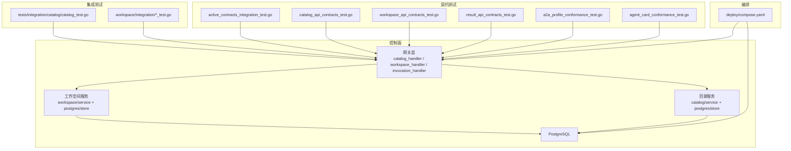
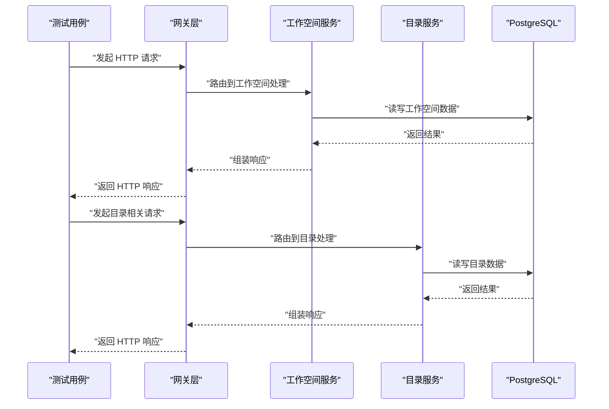
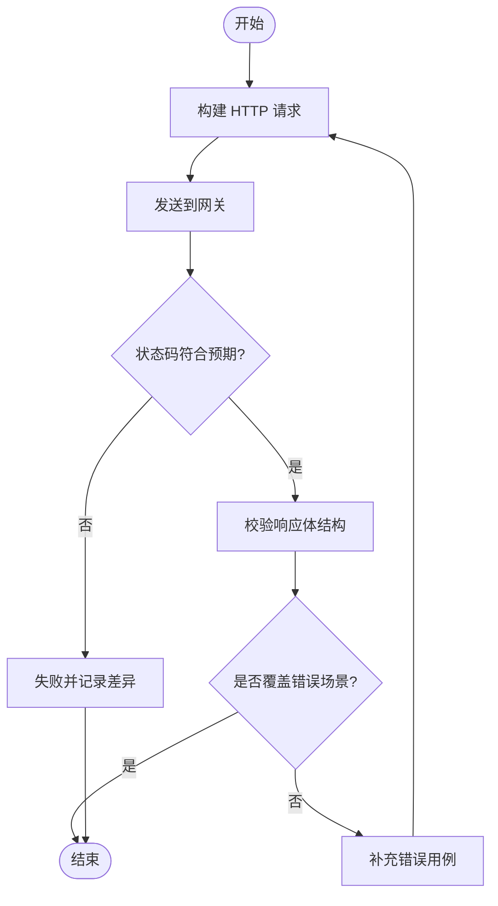
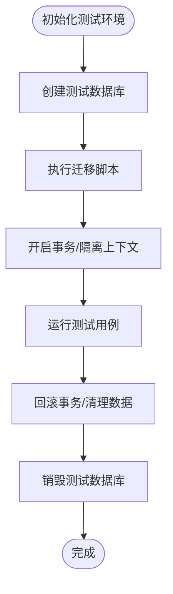
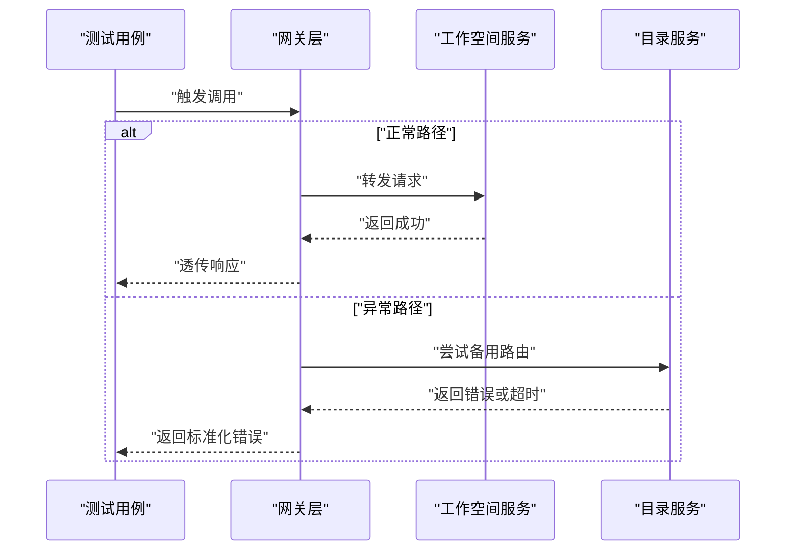
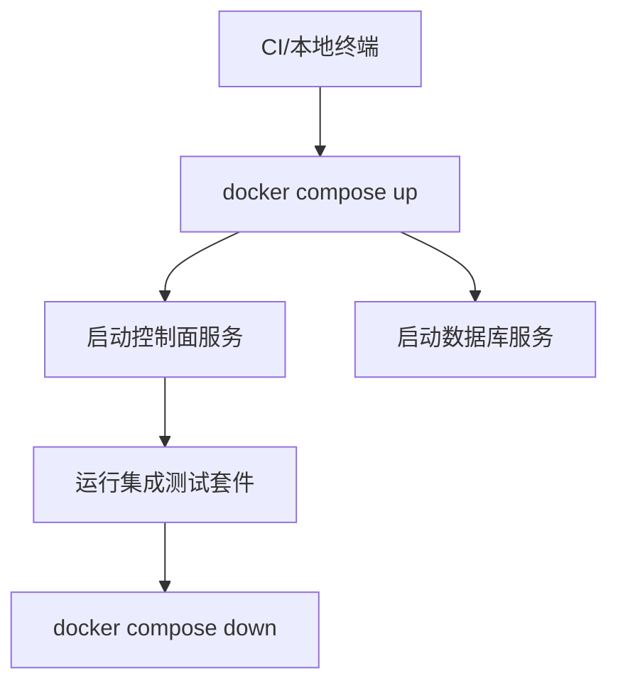
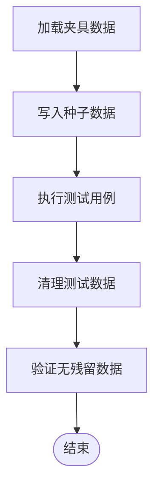
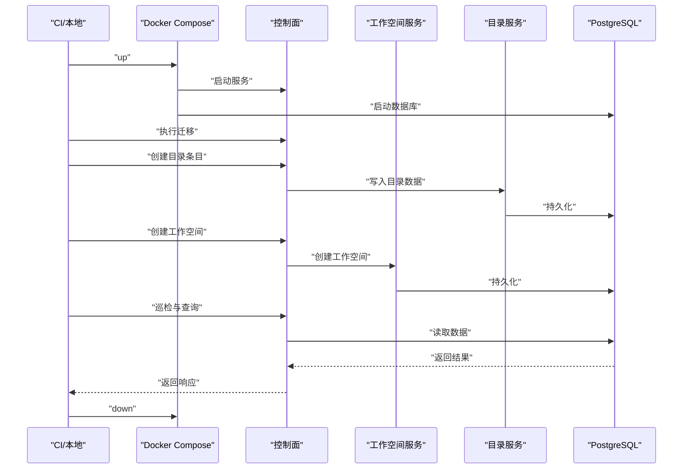
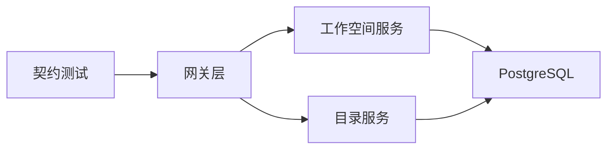

# 集成测试

<cite>
**本文引用的文件**   
- [README.md](file://README.md)
- [go.mod](file://go.mod)
- [deploy/compose.yaml](file://deploy/compose.yaml)
- [apps/control-plane/cmd/control-plane/main.go](file://apps/control-plane/cmd/control-plane/main.go)
- [apps/control-plane/internal/gateway/catalog_handler_test.go](file://apps/control-plane/internal/gateway/catalog_handler_test.go)
- [apps/control-plane/internal/gateway/workspace_handler_test.go](file://apps/control-plane/internal/gateway/workspace_handler_test.go)
- [apps/control-plane/internal/gateway/invocation_handler_test.go](file://apps/control-plane/internal/gateway/invocation_handler_test.go)
- [apps/control-plane/internal/workspace/integration/acceptance_http_test.go](file://apps/control-plane/internal/workspace/integration/acceptance_http_test.go)
- [apps/control-plane/internal/workspace/integration/workspace_test.go](file://apps/control-plane/internal/workspace/integration/workspace_test.go)
- [apps/control-plane/internal/workspace/postgres/migrations_integration_test.go](file://apps/control-plane/internal/workspace/postgres/migrations_integration_test.go)
- [apps/control-plane/internal/workspace/postgres/inspection_integration_test.go](file://apps/control-plane/internal/workspace/postgres/inspection_integration_test.go)
- [apps/control-plane/internal/catalog/postgres/migrations_integration_test.go](file://apps/control-plane/internal/catalog/postgres/migrations_integration_test.go)
- [tests/integration/catalog/catalog_test.go](file://tests/integration/catalog/catalog_test.go)
- [contracts/active_contracts_integration_test.go](file://contracts/active_contracts_integration_test.go)
- [contracts/a2a_profile_conformance_test.go](file://contracts/a2a_profile_conformance_test.go)
- [contracts/agent_card_conformance_test.go](file://contracts/agent_card_conformance_test.go)
- [contracts/catalog_api_contracts_test.go](file://contracts/catalog_api_contracts_test.go)
- [contracts/result_api_contracts_test.go](file://contracts/result_api_contracts_test.go)
- [contracts/workspace_api_contracts_test.go](file://contracts/workspace_api_contracts_test.go)
</cite>

## 目录
1. [简介](#简介)
2. [项目结构](#项目结构)
3. [核心组件](#核心组件)
4. [架构总览](#架构总览)
5. [详细组件分析](#详细组件分析)
6. [依赖分析](#依赖分析)
7. [性能考虑](#性能考虑)
8. [故障排查指南](#故障排查指南)
9. [结论](#结论)
10. [附录](#附录)

## 简介
本文件为 NeKiro 平台制定完整的集成测试策略，覆盖以下关键目标：
- API 接口测试：HTTP 请求模拟、响应验证与错误场景。
- 数据库集成测试：测试数据库设置、迁移执行与事务回滚。
- 服务间通信测试：服务发现、负载均衡与故障转移验证。
- 容器化测试环境：基于 Docker Compose 的多服务集成测试。
- 测试数据管理：夹具、种子数据与清理机制。
- 端到端示例：目录服务、工作空间服务与数据库操作的完整流程。

## 项目结构
仓库采用多应用与契约驱动的组织方式：
- apps/control-plane：控制面主服务，包含网关路由、目录与工作空间等内部模块。
- contracts：契约定义与一致性校验测试，确保各版本 API 行为稳定。
- tests/integration：跨服务的集成测试入口。
- deploy/compose.yaml：本地与 CI 的容器编排配置。

图表来源
- [apps/control-plane/internal/gateway/catalog_handler_test.go](file://apps/control-plane/internal/gateway/catalog_handler_test.go)
- [apps/control-plane/internal/gateway/workspace_handler_test.go](file://apps/control-plane/internal/gateway/workspace_handler_test.go)
- [apps/control-plane/internal/gateway/invocation_handler_test.go](file://apps/control-plane/internal/gateway/invocation_handler_test.go)
- [apps/control-plane/internal/workspace/integration/acceptance_http_test.go](file://apps/control-plane/internal/workspace/integration/acceptance_http_test.go)
- [apps/control-plane/internal/workspace/integration/workspace_test.go](file://apps/control-plane/internal/workspace/integration/workspace_test.go)
- [apps/control-plane/internal/catalog/postgres/migrations_integration_test.go](file://apps/control-plane/internal/catalog/postgres/migrations_integration_test.go)
- [apps/control-plane/internal/workspace/postgres/migrations_integration_test.go](file://apps/control-plane/internal/workspace/postgres/migrations_integration_test.go)
- [tests/integration/catalog/catalog_test.go](file://tests/integration/catalog/catalog_test.go)
- [contracts/active_contracts_integration_test.go](file://contracts/active_contracts_integration_test.go)
- [contracts/catalog_api_contracts_test.go](file://contracts/catalog_api_contracts_test.go)
- [contracts/workspace_api_contracts_test.go](file://contracts/workspace_api_contracts_test.go)
- [contracts/result_api_contracts_test.go](file://contracts/result_api_contracts_test.go)
- [contracts/a2a_profile_conformance_test.go](file://contracts/a2a_profile_conformance_test.go)
- [contracts/agent_card_conformance_test.go](file://contracts/agent_card_conformance_test.go)
- [deploy/compose.yaml](file://deploy/compose.yaml)

章节来源
- [README.md](file://README.md)
- [go.mod](file://go.mod)
- [deploy/compose.yaml](file://deploy/compose.yaml)

## 核心组件
- 网关层（Gateway）
  - 负责将外部请求分发至目录与服务工作空间处理逻辑，提供统一的 HTTP 边界。
  - 测试覆盖包括目录、工作空间与调用处理的请求/响应路径与错误分支。
- 工作空间服务（Workspace）
  - 提供工作空间生命周期与安装检查能力，持久化到 PostgreSQL。
  - 集成测试涵盖 HTTP 验收与数据库迁移、巡检等。
- 目录服务（Catalog）
  - 维护运行时卡片与注册信息，持久化到 PostgreSQL。
  - 集成测试覆盖迁移与基本 CRUD 路径。
- 契约测试（Contracts）
  - 针对 v1/v2/v3/v4 等多版本 API 进行一致性校验，保障向后兼容。
- 编排与运行（Compose）
  - 通过 compose.yaml 拉起控制面与数据库，支撑本地与 CI 的集成测试。

章节来源
- [apps/control-plane/internal/gateway/catalog_handler_test.go](file://apps/control-plane/internal/gateway/catalog_handler_test.go)
- [apps/control-plane/internal/gateway/workspace_handler_test.go](file://apps/control-plane/internal/gateway/workspace_handler_test.go)
- [apps/control-plane/internal/gateway/invocation_handler_test.go](file://apps/control-plane/internal/gateway/invocation_handler_test.go)
- [apps/control-plane/internal/workspace/integration/acceptance_http_test.go](file://apps/control-plane/internal/workspace/integration/acceptance_http_test.go)
- [apps/control-plane/internal/workspace/integration/workspace_test.go](file://apps/control-plane/internal/workspace/integration/workspace_test.go)
- [apps/control-plane/internal/catalog/postgres/migrations_integration_test.go](file://apps/control-plane/internal/catalog/postgres/migrations_integration_test.go)
- [apps/control-plane/internal/workspace/postgres/migrations_integration_test.go](file://apps/control-plane/internal/workspace/postgres/migrations_integration_test.go)
- [contracts/active_contracts_integration_test.go](file://contracts/active_contracts_integration_test.go)
- [contracts/catalog_api_contracts_test.go](file://contracts/catalog_api_contracts_test.go)
- [contracts/workspace_api_contracts_test.go](file://contracts/workspace_api_contracts_test.go)
- [contracts/result_api_contracts_test.go](file://contracts/result_api_contracts_test.go)
- [contracts/a2a_profile_conformance_test.go](file://contracts/a2a_profile_conformance_test.go)
- [contracts/agent_card_conformance_test.go](file://contracts/agent_card_conformance_test.go)

## 架构总览
下图展示集成测试在控制面中的调用链路与数据流向，以及契约测试对 API 版本的约束。

图表来源
- [apps/control-plane/internal/gateway/workspace_handler_test.go](file://apps/control-plane/internal/gateway/workspace_handler_test.go)
- [apps/control-plane/internal/gateway/catalog_handler_test.go](file://apps/control-plane/internal/gateway/catalog_handler_test.go)
- [apps/control-plane/internal/workspace/integration/acceptance_http_test.go](file://apps/control-plane/internal/workspace/integration/acceptance_http_test.go)
- [apps/control-plane/internal/workspace/postgres/migrations_integration_test.go](file://apps/control-plane/internal/workspace/postgres/migrations_integration_test.go)
- [apps/control-plane/internal/catalog/postgres/migrations_integration_test.go](file://apps/control-plane/internal/catalog/postgres/migrations_integration_test.go)

## 详细组件分析

### API 接口测试策略
- 目标
  - 验证网关层对外暴露的 HTTP 接口的正确性、健壮性与兼容性。
- 方法
  - 使用 Go 标准库或测试框架构造 HTTP 客户端，向网关发送请求。
  - 断言状态码、响应体结构与关键字段。
  - 覆盖成功、参数缺失、权限不足、资源不存在等错误分支。
- 覆盖范围
  - 目录接口：创建、查询、更新、删除与分页游标。
  - 工作空间接口：创建、读取、安装检查与生命周期操作。
  - 调用接口：路由与转发行为的契约校验。
- 参考实现位置
  - 网关层测试：[catalog_handler_test.go](file://apps/control-plane/internal/gateway/catalog_handler_test.go)、[workspace_handler_test.go](file://apps/control-plane/internal/gateway/workspace_handler_test.go)、[invocation_handler_test.go](file://apps/control-plane/internal/gateway/invocation_handler_test.go)。
  - 工作空间 HTTP 验收测试：[acceptance_http_test.go](file://apps/control-plane/internal/workspace/integration/acceptance_http_test.go)。

图表来源
- [apps/control-plane/internal/gateway/catalog_handler_test.go](file://apps/control-plane/internal/gateway/catalog_handler_test.go)
- [apps/control-plane/internal/gateway/workspace_handler_test.go](file://apps/control-plane/internal/gateway/workspace_handler_test.go)
- [apps/control-plane/internal/gateway/invocation_handler_test.go](file://apps/control-plane/internal/gateway/invocation_handler_test.go)
- [apps/control-plane/internal/workspace/integration/acceptance_http_test.go](file://apps/control-plane/internal/workspace/integration/acceptance_http_test.go)

章节来源
- [apps/control-plane/internal/gateway/catalog_handler_test.go](file://apps/control-plane/internal/gateway/catalog_handler_test.go)
- [apps/control-plane/internal/gateway/workspace_handler_test.go](file://apps/control-plane/internal/gateway/workspace_handler_test.go)
- [apps/control-plane/internal/gateway/invocation_handler_test.go](file://apps/control-plane/internal/gateway/invocation_handler_test.go)
- [apps/control-plane/internal/workspace/integration/acceptance_http_test.go](file://apps/control-plane/internal/workspace/integration/acceptance_http_test.go)

### 数据库集成测试策略
- 目标
  - 验证工作空间与目录模块对 PostgreSQL 的读写、迁移与巡检能力。
- 配置要点
  - 使用独立测试数据库实例，避免污染开发数据。
  - 在测试前执行迁移脚本，确保 schema 一致。
  - 每个测试用例前后开启/提交事务或使用隔离策略，保证可重复性。
- 覆盖范围
  - 迁移执行：正向与回滚路径。
  - 数据一致性：插入、更新、删除后的查询结果。
  - 巡检能力：健康检查与元数据验证。
- 参考实现位置
  - 工作空间迁移集成测试：[migrations_integration_test.go](file://apps/control-plane/internal/workspace/postgres/migrations_integration_test.go)
  - 工作空间巡检集成测试：[inspection_integration_test.go](file://apps/control-plane/internal/workspace/postgres/inspection_integration_test.go)
  - 目录迁移集成测试：[migrations_integration_test.go](file://apps/control-plane/internal/catalog/postgres/migrations_integration_test.go)

图表来源
- [apps/control-plane/internal/workspace/postgres/migrations_integration_test.go](file://apps/control-plane/internal/workspace/postgres/migrations_integration_test.go)
- [apps/control-plane/internal/workspace/postgres/inspection_integration_test.go](file://apps/control-plane/internal/workspace/postgres/inspection_integration_test.go)
- [apps/control-plane/internal/catalog/postgres/migrations_integration_test.go](file://apps/control-plane/internal/catalog/postgres/migrations_integration_test.go)

章节来源
- [apps/control-plane/internal/workspace/postgres/migrations_integration_test.go](file://apps/control-plane/internal/workspace/postgres/migrations_integration_test.go)
- [apps/control-plane/internal/workspace/postgres/inspection_integration_test.go](file://apps/control-plane/internal/workspace/postgres/inspection_integration_test.go)
- [apps/control-plane/internal/catalog/postgres/migrations_integration_test.go](file://apps/control-plane/internal/catalog/postgres/migrations_integration_test.go)

### 服务间通信测试策略
- 目标
  - 验证网关到工作空间与目录的路由、重试与错误传播。
- 方法
  - 通过网关统一入口发起请求，断言下游服务调用链路。
  - 注入下游不可用或延迟场景，验证超时、熔断与降级行为。
  - 若存在多副本，验证负载均衡与故障转移。
- 参考实现位置
  - 网关层测试：[invocation_handler_test.go](file://apps/control-plane/internal/gateway/invocation_handler_test.go)
  - 工作空间与目录处理测试：[workspace_handler_test.go](file://apps/control-plane/internal/gateway/workspace_handler_test.go)、[catalog_handler_test.go](file://apps/control-plane/internal/gateway/catalog_handler_test.go)

图表来源
- [apps/control-plane/internal/gateway/invocation_handler_test.go](file://apps/control-plane/internal/gateway/invocation_handler_test.go)
- [apps/control-plane/internal/gateway/workspace_handler_test.go](file://apps/control-plane/internal/gateway/workspace_handler_test.go)
- [apps/control-plane/internal/gateway/catalog_handler_test.go](file://apps/control-plane/internal/gateway/catalog_handler_test.go)

章节来源
- [apps/control-plane/internal/gateway/invocation_handler_test.go](file://apps/control-plane/internal/gateway/invocation_handler_test.go)
- [apps/control-plane/internal/gateway/workspace_handler_test.go](file://apps/control-plane/internal/gateway/workspace_handler_test.go)
- [apps/control-plane/internal/gateway/catalog_handler_test.go](file://apps/control-plane/internal/gateway/catalog_handler_test.go)

### 容器化测试环境搭建
- 目标
  - 使用 Docker Compose 拉起控制面与数据库，形成可复用的集成测试环境。
- 步骤
  - 准备 compose.yaml，定义控制面服务与数据库服务。
  - 在 CI 中执行 compose up，等待就绪后运行集成测试。
  - 测试结束后执行 compose down 清理资源。
- 参考实现位置
  - 编排配置：[compose.yaml](file://deploy/compose.yaml)
  - 控制面入口：[main.go](file://apps/control-plane/cmd/control-plane/main.go)

图表来源
- [deploy/compose.yaml](file://deploy/compose.yaml)
- [apps/control-plane/cmd/control-plane/main.go](file://apps/control-plane/cmd/control-plane/main.go)

章节来源
- [deploy/compose.yaml](file://deploy/compose.yaml)
- [apps/control-plane/cmd/control-plane/main.go](file://apps/control-plane/cmd/control-plane/main.go)

### 测试数据管理策略
- 目标
  - 保证测试数据的确定性、可重复性与隔离性。
- 方法
  - 使用 JSON 夹具作为种子数据，在测试前加载到目录存储。
  - 每个测试用例完成后自动清理已写入的数据。
  - 通过事务或临时数据库隔离不同用例的数据影响。
- 参考实现位置
  - 目录集成测试：[catalog_test.go](file://tests/integration/catalog/catalog_test.go)

图表来源
- [tests/integration/catalog/catalog_test.go](file://tests/integration/catalog/catalog_test.go)

章节来源
- [tests/integration/catalog/catalog_test.go](file://tests/integration/catalog/catalog_test.go)

### 端到端示例：目录服务、工作空间服务与数据库操作
- 目标
  - 演示从 HTTP 入口到数据库落盘的完整集成测试流程。
- 步骤
  - 启动容器环境，执行迁移。
  - 通过网关创建工作空间与目录条目。
  - 校验数据库记录与巡检结果。
  - 清理数据并关闭环境。
- 参考实现位置
  - 工作空间 HTTP 验收与测试：[acceptance_http_test.go](file://apps/control-plane/internal/workspace/integration/acceptance_http_test.go)、[workspace_test.go](file://apps/control-plane/internal/workspace/integration/workspace_test.go)
  - 工作空间迁移与巡检：[migrations_integration_test.go](file://apps/control-plane/internal/workspace/postgres/migrations_integration_test.go)、[inspection_integration_test.go](file://apps/control-plane/internal/workspace/postgres/inspection_integration_test.go)
  - 目录迁移：[migrations_integration_test.go](file://apps/control-plane/internal/catalog/postgres/migrations_integration_test.go)
  - 目录集成测试：[catalog_test.go](file://tests/integration/catalog/catalog_test.go)

图表来源
- [apps/control-plane/internal/workspace/integration/acceptance_http_test.go](file://apps/control-plane/internal/workspace/integration/acceptance_http_test.go)
- [apps/control-plane/internal/workspace/integration/workspace_test.go](file://apps/control-plane/internal/workspace/integration/workspace_test.go)
- [apps/control-plane/internal/workspace/postgres/migrations_integration_test.go](file://apps/control-plane/internal/workspace/postgres/migrations_integration_test.go)
- [apps/control-plane/internal/workspace/postgres/inspection_integration_test.go](file://apps/control-plane/internal/workspace/postgres/inspection_integration_test.go)
- [apps/control-plane/internal/catalog/postgres/migrations_integration_test.go](file://apps/control-plane/internal/catalog/postgres/migrations_integration_test.go)
- [tests/integration/catalog/catalog_test.go](file://tests/integration/catalog/catalog_test.go)
- [deploy/compose.yaml](file://deploy/compose.yaml)

章节来源
- [apps/control-plane/internal/workspace/integration/acceptance_http_test.go](file://apps/control-plane/internal/workspace/integration/acceptance_http_test.go)
- [apps/control-plane/internal/workspace/integration/workspace_test.go](file://apps/control-plane/internal/workspace/integration/workspace_test.go)
- [apps/control-plane/internal/workspace/postgres/migrations_integration_test.go](file://apps/control-plane/internal/workspace/postgres/migrations_integration_test.go)
- [apps/control-plane/internal/workspace/postgres/inspection_integration_test.go](file://apps/control-plane/internal/workspace/postgres/inspection_integration_test.go)
- [apps/control-plane/internal/catalog/postgres/migrations_integration_test.go](file://apps/control-plane/internal/catalog/postgres/migrations_integration_test.go)
- [tests/integration/catalog/catalog_test.go](file://tests/integration/catalog/catalog_test.go)
- [deploy/compose.yaml](file://deploy/compose.yaml)

## 依赖分析
- 组件耦合
  - 网关层对下游服务（工作空间、目录）存在直接依赖；通过测试替换或注入可解耦。
  - 工作空间与目录均依赖 PostgreSQL，迁移与巡检逻辑集中在对应模块。
- 外部依赖
  - 容器编排依赖 Docker Compose。
  - 契约测试依赖 OpenAPI 与 JSON Schema 定义。
- 潜在循环依赖
  - 当前结构以网关为入口，向下分层，未见明显循环依赖。

图表来源
- [apps/control-plane/internal/gateway/catalog_handler_test.go](file://apps/control-plane/internal/gateway/catalog_handler_test.go)
- [apps/control-plane/internal/gateway/workspace_handler_test.go](file://apps/control-plane/internal/gateway/workspace_handler_test.go)
- [apps/control-plane/internal/gateway/invocation_handler_test.go](file://apps/control-plane/internal/gateway/invocation_handler_test.go)
- [contracts/active_contracts_integration_test.go](file://contracts/active_contracts_integration_test.go)
- [contracts/catalog_api_contracts_test.go](file://contracts/catalog_api_contracts_test.go)
- [contracts/workspace_api_contracts_test.go](file://contracts/workspace_api_contracts_test.go)
- [contracts/result_api_contracts_test.go](file://contracts/result_api_contracts_test.go)
- [contracts/a2a_profile_conformance_test.go](file://contracts/a2a_profile_conformance_test.go)
- [contracts/agent_card_conformance_test.go](file://contracts/agent_card_conformance_test.go)

章节来源
- [apps/control-plane/internal/gateway/catalog_handler_test.go](file://apps/control-plane/internal/gateway/catalog_handler_test.go)
- [apps/control-plane/internal/gateway/workspace_handler_test.go](file://apps/control-plane/internal/gateway/workspace_handler_test.go)
- [apps/control-plane/internal/gateway/invocation_handler_test.go](file://apps/control-plane/internal/gateway/invocation_handler_test.go)
- [contracts/active_contracts_integration_test.go](file://contracts/active_contracts_integration_test.go)
- [contracts/catalog_api_contracts_test.go](file://contracts/catalog_api_contracts_test.go)
- [contracts/workspace_api_contracts_test.go](file://contracts/workspace_api_contracts_test.go)
- [contracts/result_api_contracts_test.go](file://contracts/result_api_contracts_test.go)
- [contracts/a2a_profile_conformance_test.go](file://contracts/a2a_profile_conformance_test.go)
- [contracts/agent_card_conformance_test.go](file://contracts/agent_card_conformance_test.go)

## 性能考虑
- 并发与并行
  - 使用测试框架的并行执行能力，缩短整体耗时。
- 数据库连接池
  - 合理配置连接数与超时，避免测试期间资源争用。
- 网络与序列化
  - 减少不必要的日志与序列化开销，聚焦关键断言。
- 资源回收
  - 确保每次测试后释放连接、关闭监听端口与清理临时文件。

## 故障排查指南
- 常见问题
  - 端口冲突：确认 compose 与本地服务未占用相同端口。
  - 迁移失败：检查迁移脚本顺序与幂等性。
  - 数据残留：确认事务回滚或清理逻辑生效。
  - 契约不一致：对照 OpenAPI 与 Schema 变更，更新契约测试。
- 定位手段
  - 查看网关与下游服务的日志输出。
  - 使用数据库巡检工具验证表结构与索引。
  - 逐步缩小测试范围，定位具体失败用例。

## 结论
本策略围绕网关、工作空间、目录与数据库四大维度，结合契约测试与容器编排，构建了可复用、可扩展的集成测试体系。通过明确的测试数据管理与错误场景覆盖，可有效提升平台的稳定性与兼容性。

## 附录
- 快速开始
  - 使用 compose 拉起环境，执行迁移，运行集成测试套件。
- 扩展建议
  - 引入更丰富的故障注入与混沌工程用例。
  - 增加性能基准测试与回归对比。