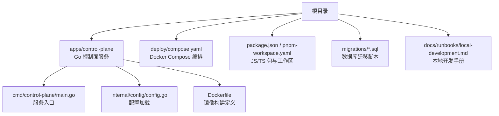
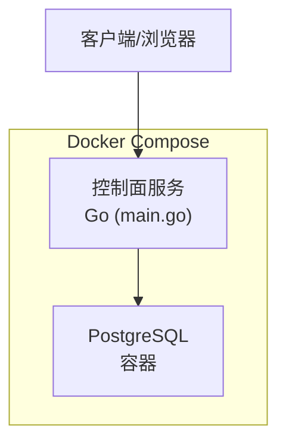
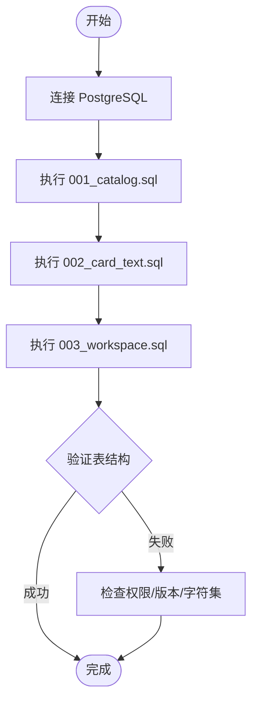
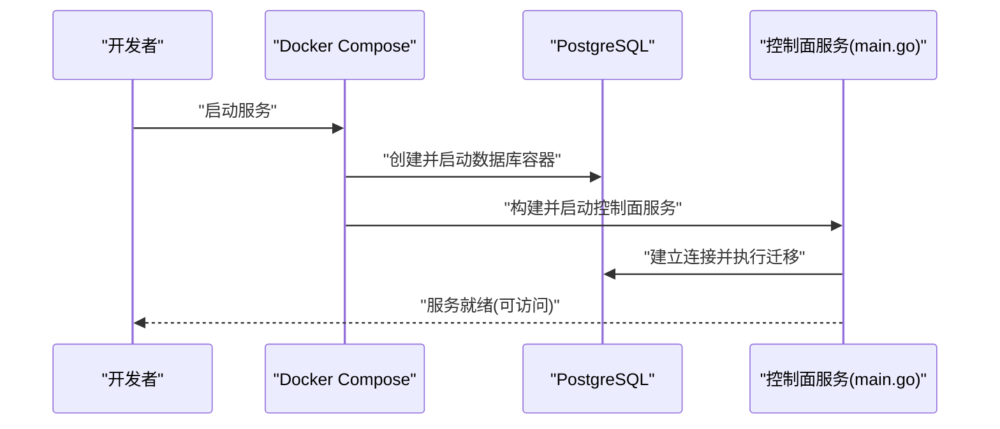
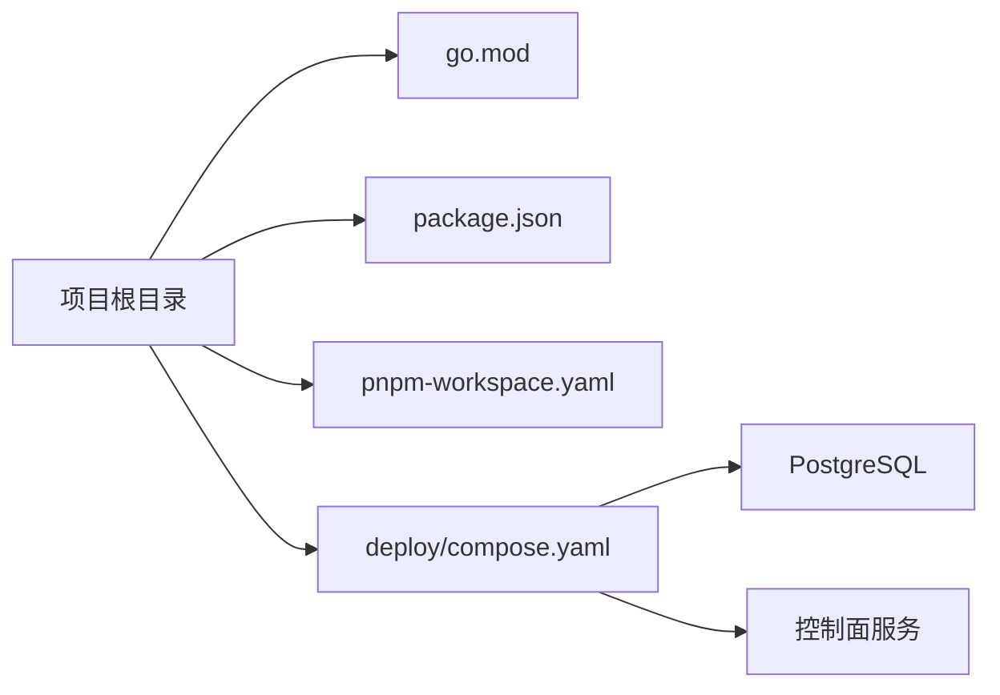

# 环境搭建

<cite>
**本文引用的文件**   
- [README.md](file://README.md)
- [go.mod](file://go.mod)
- [package.json](file://package.json)
- [pnpm-workspace.yaml](file://pnpm-workspace.yaml)
- [deploy/compose.yaml](file://deploy/compose.yaml)
- [apps/control-plane/cmd/control-plane/main.go](file://apps/control-plane/cmd/control-plane/main.go)
- [apps/control-plane/internal/config/config.go](file://apps/control-plane/internal/config/config.go)
- [apps/control-plane/migrations/001_catalog.sql](file://apps/control-plane/migrations/001_catalog.sql)
- [apps/control-plane/migrations/002_card_text.sql](file://apps/control-plane/migrations/002_card_text.sql)
- [apps/control-plane/migrations/003_workspace.sql](file://apps/control-plane/migrations/003_workspace.sql)
- [apps/control-plane/Dockerfile](file://apps/control-plane/Dockerfile)
- [.dockerignore](file://.dockerignore)
- [docs/runbooks/local-development.md](file://docs/runbooks/local-development.md)
</cite>

## 目录
1. [简介](#简介)
2. [项目结构](#项目结构)
3. [核心组件](#核心组件)
4. [架构总览](#架构总览)
5. [详细组件分析](#详细组件分析)
6. [依赖分析](#依赖分析)
7. [性能考虑](#性能考虑)
8. [故障排查指南](#故障排查指南)
9. [结论](#结论)
10. [附录](#附录)

## 简介
本指南面向首次接触 NeKiro 平台的开发者，提供从零开始的本地开发环境搭建说明。内容涵盖系统要求（Go、Node.js、PostgreSQL）、依赖安装（Go 模块、npm/pnpm、Docker）、环境变量配置、数据库初始化与迁移、服务启动流程，以及常见问题排查建议。

## 项目结构
NeKiro 采用多应用仓库组织方式：
- Go 后端服务位于 apps/control-plane，包含入口程序、配置加载、数据库迁移脚本等。
- 前端或工具链通过 package.json 和 pnpm workspace 管理。
- 容器编排使用 deploy/compose.yaml。
- 文档与运行手册位于 docs/runbooks。

图表来源
- [apps/control-plane/cmd/control-plane/main.go:1-200](file://apps/control-plane/cmd/control-plane/main.go#L1-L200)
- [apps/control-plane/internal/config/config.go:1-200](file://apps/control-plane/internal/config/config.go#L1-L200)
- [deploy/compose.yaml:1-200](file://deploy/compose.yaml#L1-L200)
- [package.json:1-200](file://package.json#L1-L200)
- [pnpm-workspace.yaml:1-200](file://pnpm-workspace.yaml#L1-L200)
- [apps/control-plane/migrations/001_catalog.sql:1-200](file://apps/control-plane/migrations/001_catalog.sql#L1-L200)
- [apps/control-plane/migrations/002_card_text.sql:1-200](file://apps/control-plane/migrations/002_card_text.sql#L1-L200)
- [apps/control-plane/migrations/003_workspace.sql:1-200](file://apps/control-plane/migrations/003_workspace.sql#L1-L200)
- [apps/control-plane/Dockerfile:1-200](file://apps/control-plane/Dockerfile#L1-L200)
- [docs/runbooks/local-development.md:1-200](file://docs/runbooks/local-development.md#L1-L200)

章节来源
- [README.md:1-200](file://README.md#L1-L200)
- [package.json:1-200](file://package.json#L1-L200)
- [pnpm-workspace.yaml:1-200](file://pnpm-workspace.yaml#L1-L200)
- [deploy/compose.yaml:1-200](file://deploy/compose.yaml#L1-L200)

## 核心组件
- 控制面服务（Go）
  - 入口程序负责解析配置、初始化日志与中间件、连接数据库并启动 HTTP 服务。
  - 配置加载支持从环境变量读取关键参数（如数据库连接串、监听端口等）。
- 数据库迁移
  - 提供 SQL 迁移脚本用于创建 catalog、card text、workspace 等表结构。
- 容器化
  - Dockerfile 定义 Go 服务的镜像构建过程；compose.yaml 编排 PostgreSQL 与控制面服务。
- JS/TS 工作区
  - 通过 package.json 与 pnpm workspace 管理前端或工具依赖。

章节来源
- [apps/control-plane/cmd/control-plane/main.go:1-200](file://apps/control-plane/cmd/control-plane/main.go#L1-L200)
- [apps/control-plane/internal/config/config.go:1-200](file://apps/control-plane/internal/config/config.go#L1-L200)
- [apps/control-plane/migrations/001_catalog.sql:1-200](file://apps/control-plane/migrations/001_catalog.sql#L1-L200)
- [apps/control-plane/migrations/002_card_text.sql:1-200](file://apps/control-plane/migrations/002_card_text.sql#L1-L200)
- [apps/control-plane/migrations/003_workspace.sql:1-200](file://apps/control-plane/migrations/003_workspace.sql#L1-L200)
- [apps/control-plane/Dockerfile:1-200](file://apps/control-plane/Dockerfile#L1-L200)
- [deploy/compose.yaml:1-200](file://deploy/compose.yaml#L1-L200)
- [package.json:1-200](file://package.json#L1-L200)
- [pnpm-workspace.yaml:1-200](file://pnpm-workspace.yaml#L1-L200)

## 架构总览
下图展示了本地开发时各组件的交互关系：客户端访问控制面服务，控制面服务连接 PostgreSQL 进行数据持久化；Docker Compose 统一编排数据库与服务。

图表来源
- [apps/control-plane/cmd/control-plane/main.go:1-200](file://apps/control-plane/cmd/control-plane/main.go#L1-L200)
- [deploy/compose.yaml:1-200](file://deploy/compose.yaml#L1-L200)

## 详细组件分析

### 系统与环境要求
- Go 版本
  - 由 go.mod 指定最小版本，请确保本地安装的 Go 版本满足或高于该要求。
- Node.js 与 pnpm
  - 通过 package.json 与 pnpm-workspace.yaml 管理 JS/TS 依赖与工作区，建议使用较新的 LTS 版 Node.js 与 pnpm。
- PostgreSQL
  - 本地开发推荐使用 Docker 运行 Postgres，或使用宿主机已安装的 PG 实例。需准备数据库名称、用户、密码及连接地址。

章节来源
- [go.mod:1-200](file://go.mod#L1-L200)
- [package.json:1-200](file://package.json#L1-L200)
- [pnpm-workspace.yaml:1-200](file://pnpm-workspace.yaml#L1-L200)

### 依赖安装步骤
- Go 模块依赖
  - 在项目根目录执行 Go 模块下载命令以拉取所有依赖。
- JS/TS 依赖
  - 使用 pnpm 在工作区中安装依赖。
- Docker 环境
  - 安装 Docker Desktop 或等效容器运行时，并确保 compose 可用。

章节来源
- [go.mod:1-200](file://go.mod#L1-L200)
- [package.json:1-200](file://package.json#L1-L200)
- [pnpm-workspace.yaml:1-200](file://pnpm-workspace.yaml#L1-L200)
- [deploy/compose.yaml:1-200](file://deploy/compose.yaml#L1-L200)

### 环境变量配置
控制面服务通过配置文件加载环境变量，常见变量包括：
- 数据库连接相关：数据库地址、用户名、密码、库名、SSL 模式等。
- 服务监听：HTTP 监听端口、日志级别等。
- 其他业务开关：调试开关、超时时间等。

建议将环境变量写入 .env 文件或 shell 环境中，并在启动前确认生效。

章节来源
- [apps/control-plane/internal/config/config.go:1-200](file://apps/control-plane/internal/config/config.go#L1-L200)

### 数据库初始化与迁移
- 使用 SQL 迁移脚本初始化数据库结构，依次执行以下脚本：
  - 001_catalog.sql
  - 002_card_text.sql
  - 003_workspace.sql
- 可通过 psql 命令行或图形化工具连接到目标数据库后执行。

图表来源
- [apps/control-plane/migrations/001_catalog.sql:1-200](file://apps/control-plane/migrations/001_catalog.sql#L1-L200)
- [apps/control-plane/migrations/002_card_text.sql:1-200](file://apps/control-plane/migrations/002_card_text.sql#L1-L200)
- [apps/control-plane/migrations/003_workspace.sql:1-200](file://apps/control-plane/migrations/003_workspace.sql#L1-L200)

章节来源
- [apps/control-plane/migrations/001_catalog.sql:1-200](file://apps/control-plane/migrations/001_catalog.sql#L1-L200)
- [apps/control-plane/migrations/002_card_text.sql:1-200](file://apps/control-plane/migrations/002_card_text.sql#L1-L200)
- [apps/control-plane/migrations/003_workspace.sql:1-200](file://apps/control-plane/migrations/003_workspace.sql#L1-L200)

### 本地运行服务
- 使用 Docker Compose 一键拉起数据库与服务：
  - 在 deploy 目录下执行 compose up，等待服务就绪。
- 手动启动控制面服务：
  - 设置必要的环境变量（数据库连接、端口等）。
  - 进入 apps/control-plane 目录，编译并运行 main.go。
- 验证服务：
  - 访问默认监听端口，或通过健康检查接口确认服务状态。

图表来源
- [deploy/compose.yaml:1-200](file://deploy/compose.yaml#L1-L200)
- [apps/control-plane/cmd/control-plane/main.go:1-200](file://apps/control-plane/cmd/control-plane/main.go#L1-L200)
- [apps/control-plane/migrations/001_catalog.sql:1-200](file://apps/control-plane/migrations/001_catalog.sql#L1-L200)
- [apps/control-plane/migrations/002_card_text.sql:1-200](file://apps/control-plane/migrations/002_card_text.sql#L1-L200)
- [apps/control-plane/migrations/003_workspace.sql:1-200](file://apps/control-plane/migrations/003_workspace.sql#L1-L200)

章节来源
- [deploy/compose.yaml:1-200](file://deploy/compose.yaml#L1-L200)
- [apps/control-plane/cmd/control-plane/main.go:1-200](file://apps/control-plane/cmd/control-plane/main.go#L1-L200)

### 容器化与镜像构建
- Dockerfile 定义了 Go 服务的构建阶段与运行阶段，通常包含：
  - 基础镜像选择
  - 依赖安装与代码拷贝
  - 构建产物生成
  - 运行入口设置
- .dockerignore 用于排除不必要的文件，减小镜像体积。

章节来源
- [apps/control-plane/Dockerfile:1-200](file://apps/control-plane/Dockerfile#L1-L200)
- [.dockerignore:1-200](file://.dockerignore#L1-L200)

## 依赖分析
- Go 依赖
  - 由 go.mod 声明，包含标准库与第三方库。
- JS/TS 依赖
  - 由 package.json 与 pnpm-workspace.yaml 管理，支持多包工作区。
- 外部依赖
  - PostgreSQL 作为唯一持久化存储。
  - Docker 与 Compose 用于容器化与编排。

图表来源
- [go.mod:1-200](file://go.mod#L1-L200)
- [package.json:1-200](file://package.json#L1-L200)
- [pnpm-workspace.yaml:1-200](file://pnpm-workspace.yaml#L1-L200)
- [deploy/compose.yaml:1-200](file://deploy/compose.yaml#L1-L200)

章节来源
- [go.mod:1-200](file://go.mod#L1-L200)
- [package.json:1-200](file://package.json#L1-L200)
- [pnpm-workspace.yaml:1-200](file://pnpm-workspace.yaml#L1-L200)
- [deploy/compose.yaml:1-200](file://deploy/compose.yaml#L1-L200)

## 性能考虑
- 数据库连接池
  - 合理设置最大连接数与空闲连接数，避免连接耗尽。
- 迁移策略
  - 大表变更建议在低峰期执行，必要时分批迁移。
- 资源限制
  - 为容器设置 CPU/内存上限，防止单点占用过多资源。
- 日志与监控
  - 调整日志级别，生产环境建议关闭调试日志；接入指标采集。

[本节为通用指导，不直接分析具体文件]

## 故障排查指南
- 无法连接数据库
  - 检查环境变量中的数据库地址、用户名、密码是否正确。
  - 确认 PostgreSQL 容器是否启动且端口映射正常。
  - 查看控制面服务日志，定位连接错误信息。
- 端口冲突
  - 修改服务监听端口或释放被占用的端口。
- 迁移失败
  - 检查数据库版本与迁移脚本兼容性。
  - 确认当前用户对目标库具有足够权限。
- 依赖安装失败
  - Go 模块：检查网络代理与 GOPROXY 设置。
  - pnpm：清理缓存并重试安装。

章节来源
- [apps/control-plane/internal/config/config.go:1-200](file://apps/control-plane/internal/config/config.go#L1-L200)
- [deploy/compose.yaml:1-200](file://deploy/compose.yaml#L1-L200)
- [apps/control-plane/migrations/001_catalog.sql:1-200](file://apps/control-plane/migrations/001_catalog.sql#L1-L200)
- [apps/control-plane/migrations/002_card_text.sql:1-200](file://apps/control-plane/migrations/002_card_text.sql#L1-L200)
- [apps/control-plane/migrations/003_workspace.sql:1-200](file://apps/control-plane/migrations/003_workspace.sql#L1-L200)

## 结论
按照本指南完成系统要求检查、依赖安装、环境变量配置、数据库迁移与服务启动后，即可在本地运行 NeKiro 控制面服务。建议结合 docs/runbooks/local-development.md 进一步熟悉本地开发流程与最佳实践。

## 附录
- 参考手册
  - 本地开发手册：docs/runbooks/local-development.md
- 快速命令清单
  - 安装 Go 依赖：go mod download
  - 安装 JS/TS 依赖：pnpm install
  - 启动容器：docker compose up
  - 执行迁移：psql -U <user> -d <db> -f migrations/001_catalog.sql

章节来源
- [docs/runbooks/local-development.md:1-200](file://docs/runbooks/local-development.md#L1-L200)
- [go.mod:1-200](file://go.mod#L1-L200)
- [package.json:1-200](file://package.json#L1-L200)
- [pnpm-workspace.yaml:1-200](file://pnpm-workspace.yaml#L1-L200)
- [deploy/compose.yaml:1-200](file://deploy/compose.yaml#L1-L200)
- [apps/control-plane/migrations/001_catalog.sql:1-200](file://apps/control-plane/migrations/001_catalog.sql#L1-L200)
- [apps/control-plane/migrations/002_card_text.sql:1-200](file://apps/control-plane/migrations/002_card_text.sql#L1-L200)
- [apps/control-plane/migrations/003_workspace.sql:1-200](file://apps/control-plane/migrations/003_workspace.sql#L1-L200)