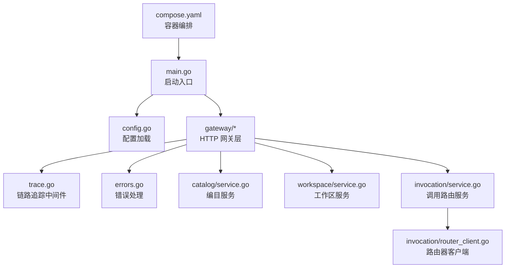
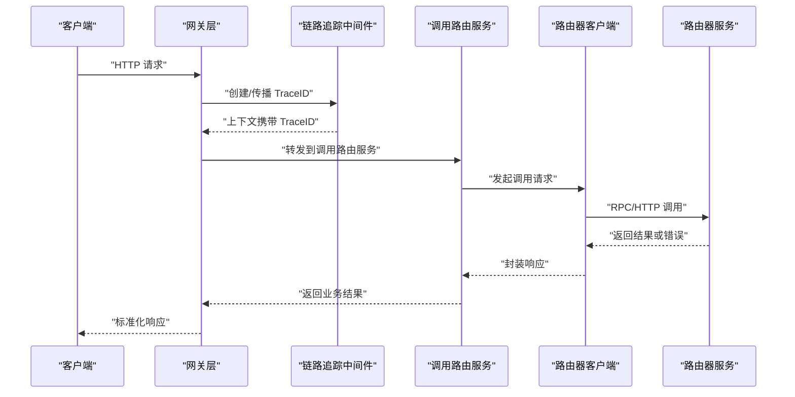
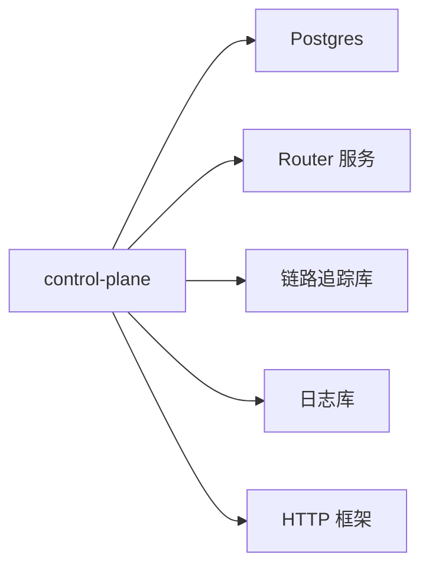

# 调试指南

<cite>
**本文引用的文件**   
- [apps/control-plane/cmd/control-plane/main.go](file://apps/control-plane/cmd/control-plane/main.go)
- [apps/control-plane/internal/config/config.go](file://apps/control-plane/internal/config/config.go)
- [apps/control-plane/internal/gateway/trace.go](file://apps/control-plane/internal/gateway/trace.go)
- [apps/control-plane/internal/gateway/errors.go](file://apps/control-plane/internal/gateway/errors.go)
- [apps/control-plane/internal/catalog/service.go](file://apps/control-plane/internal/catalog/service.go)
- [apps/control-plane/internal/workspace/service.go](file://apps/control-plane/internal/workspace/service.go)
- [apps/control-plane/internal/invocation/service.go](file://apps/control-plane/internal/invocation/service.go)
- [apps/control-plane/internal/invocation/router_client.go](file://apps/control-plane/internal/invocation/router_client.go)
- [deploy/compose.yaml](file://deploy/compose.yaml)
- [go.mod](file://go.mod)
</cite>

## 目录
1. [简介](#简介)
2. [项目结构](#项目结构)
3. [核心组件](#核心组件)
4. [架构总览](#架构总览)
5. [详细组件分析](#详细组件分析)
6. [依赖分析](#依赖分析)
7. [性能考虑](#性能考虑)
8. [故障排查指南](#故障排查指南)
9. [结论](#结论)
10. [附录](#附录)

## 简介
本指南面向 NeKiro 平台控制面（Control Plane）的开发者与运维人员，提供从本地到生产环境的系统化调试方法。内容覆盖：
- Go 应用调试技巧：Delve 断点、pprof 剖析、结构化日志
- 分布式系统调试：链路追踪、服务间调用监控、异步任务
- 常见问题诊断：连接超时、内存泄漏、并发问题
- 生产策略：日志收集、指标监控、告警配置

目标是帮助团队快速定位问题、降低 MTTR，并建立可观测性闭环。

## 项目结构
NeKiro 控制面采用模块化分层组织，关键入口位于 apps/control-plane/cmd/control-plane/main.go，内部按功能域划分：config、gateway、catalog、workspace、invocation 等。部署编排使用 deploy/compose.yaml。

图示来源
- [apps/control-plane/cmd/control-plane/main.go](file://apps/control-plane/cmd/control-plane/main.go)
- [apps/control-plane/internal/config/config.go](file://apps/control-plane/internal/config/config.go)
- [apps/control-plane/internal/gateway/trace.go](file://apps/control-plane/internal/gateway/trace.go)
- [apps/control-plane/internal/gateway/errors.go](file://apps/control-plane/internal/gateway/errors.go)
- [apps/control-plane/internal/catalog/service.go](file://apps/control-plane/internal/catalog/service.go)
- [apps/control-plane/internal/workspace/service.go](file://apps/control-plane/internal/workspace/service.go)
- [apps/control-plane/internal/invocation/service.go](file://apps/control-plane/internal/invocation/service.go)
- [apps/control-plane/internal/invocation/router_client.go](file://apps/control-plane/internal/invocation/router_client.go)
- [deploy/compose.yaml](file://deploy/compose.yaml)

章节来源
- [apps/control-plane/cmd/control-plane/main.go](file://apps/control-plane/cmd/control-plane/main.go)
- [deploy/compose.yaml](file://deploy/compose.yaml)

## 核心组件
- 启动与生命周期管理：负责初始化配置、注册路由、启动 HTTP 服务器、优雅关闭。
- 配置中心：集中读取环境变量与配置文件，提供运行时配置访问。
- 网关层：统一鉴权、错误映射、请求校验、链路追踪注入。
- 业务服务：catalog、workspace、invocation 分别实现领域逻辑。
- 外部依赖：Postgres（编目与工作区存储）、Router（调用分发）。

章节来源
- [apps/control-plane/cmd/control-plane/main.go](file://apps/control-plane/cmd/control-plane/main.go)
- [apps/control-plane/internal/config/config.go](file://apps/control-plane/internal/config/config.go)
- [apps/control-plane/internal/gateway/trace.go](file://apps/control-plane/internal/gateway/trace.go)
- [apps/control-plane/internal/gateway/errors.go](file://apps/control-plane/internal/gateway/errors.go)
- [apps/control-plane/internal/catalog/service.go](file://apps/control-plane/internal/catalog/service.go)
- [apps/control-plane/internal/workspace/service.go](file://apps/control-plane/internal/workspace/service.go)
- [apps/control-plane/internal/invocation/service.go](file://apps/control-plane/internal/invocation/service.go)
- [apps/control-plane/internal/invocation/router_client.go](file://apps/control-plane/internal/invocation/router_client.go)

## 架构总览
控制面作为中枢，接收上层请求，经网关处理后委派至各业务服务；调用路由服务通过路由器客户端将任务下发给下游执行器。

图示来源
- [apps/control-plane/internal/gateway/trace.go](file://apps/control-plane/internal/gateway/trace.go)
- [apps/control-plane/internal/invocation/service.go](file://apps/control-plane/internal/invocation/service.go)
- [apps/control-plane/internal/invocation/router_client.go](file://apps/control-plane/internal/invocation/router_client.go)

## 详细组件分析

### 启动与配置
- main.go 负责初始化配置、构建服务实例、注册路由、启动监听与信号处理。
- config.go 提供统一的配置读取接口，支持环境变量覆盖与默认值。

建议调试要点
- 在 main 初始化阶段设置断点，观察配置解析与依赖注入顺序。
- 打印关键配置项（如端口、数据库连接、外部服务地址），确认环境差异。

章节来源
- [apps/control-plane/cmd/control-plane/main.go](file://apps/control-plane/cmd/control-plane/main.go)
- [apps/control-plane/internal/config/config.go](file://apps/control-plane/internal/config/config.go)

### 网关与链路追踪
- trace.go 为每个请求生成/传播 TraceID，并将上下文透传到下游服务。
- errors.go 定义统一错误类型与响应格式，便于前端与上游消费。

建议调试要点
- 在网关入口处打点，记录请求 ID、耗时、状态码。
- 检查下游调用是否携带正确的 TraceID，确保链路完整。

章节来源
- [apps/control-plane/internal/gateway/trace.go](file://apps/control-plane/internal/gateway/trace.go)
- [apps/control-plane/internal/gateway/errors.go](file://apps/control-plane/internal/gateway/errors.go)

### 调用路由服务与路由器客户端
- invocation/service.go 编排调用流程，包括参数校验、上下文传递、重试与超时控制。
- router_client.go 封装对路由器服务的调用细节，包含连接池、重试、熔断等策略。

建议调试要点
- 针对长尾请求，结合 pprof 查看 goroutine 与 CPU 热点。
- 关注路由器客户端的错误分类（网络、超时、业务错误），并记录到日志。

章节来源
- [apps/control-plane/internal/invocation/service.go](file://apps/control-plane/internal/invocation/service.go)
- [apps/control-plane/internal/invocation/router_client.go](file://apps/control-plane/internal/invocation/router_client.go)

### 编目与服务发现
- catalog/service.go 提供编目查询与缓存策略，用于服务发现与能力匹配。

建议调试要点
- 验证缓存命中与失效策略，避免脏读导致路由错误。
- 对比数据库与缓存数据一致性。

章节来源
- [apps/control-plane/internal/catalog/service.go](file://apps/control-plane/internal/catalog/service.go)

### 工作区与持久化
- workspace/service.go 管理工作区生命周期与权限策略，底层依赖 Postgres。

建议调试要点
- 慢查询定位与索引优化，关注事务边界与锁竞争。
- 迁移脚本执行前后数据一致性检查。

章节来源
- [apps/control-plane/internal/workspace/service.go](file://apps/control-plane/internal/workspace/service.go)

## 依赖分析
- 直接依赖：Postgres（编目与工作区）、路由器服务（调用分发）、HTTP 框架、链路追踪库。
- 间接依赖：Go 标准库、第三方库由 go.mod 声明。

图示来源
- [go.mod](file://go.mod)
- [apps/control-plane/cmd/control-plane/main.go](file://apps/control-plane/cmd/control-plane/main.go)

章节来源
- [go.mod](file://go.mod)

## 性能考虑
- 启用 pprof 端点，采集 CPU、内存、阻塞、互斥锁等指标。
- 合理设置连接池大小与超时，避免资源耗尽。
- 对热点路径进行采样与火焰图分析，定位瓶颈。
- 使用结构化日志减少 IO 开销，避免在热路径中做重型操作。

[本节为通用指导，不直接分析具体文件]

## 故障排查指南

### 连接超时
现象
- 调用路由器或数据库出现超时错误，请求堆积。

排查步骤
- 检查路由器与数据库可达性与延迟。
- 查看路由器客户端的重试与熔断配置，确认退避策略是否合理。
- 使用 pprof 查看是否存在大量等待 I/O 的 goroutine。
- 核对网关与业务层的超时设置是否一致。

章节来源
- [apps/control-plane/internal/invocation/router_client.go](file://apps/control-plane/internal/invocation/router_client.go)
- [apps/control-plane/internal/invocation/service.go](file://apps/control-plane/internal/invocation/service.go)

### 内存泄漏
现象
- 进程 RSS 持续增长，GC 频繁但回收效果不佳。

排查步骤
- 采集 heap profile，比较不同时间点的对象分布。
- 检查是否有未释放的连接、定时器或闭包引用。
- 审查缓存策略，避免无限增长。
- 在关键路径添加分配计数日志，定位异常增长点。

章节来源
- [apps/control-plane/cmd/control-plane/main.go](file://apps/control-plane/cmd/control-plane/main.go)
- [apps/control-plane/internal/catalog/service.go](file://apps/control-plane/internal/catalog/service.go)

### 并发问题
现象
- 偶发死锁、竞态条件、数据不一致。

排查步骤
- 启用 race detector 在测试与预发环境运行。
- 分析 mutex 与 channel 的使用模式，避免持有锁时进行阻塞 I/O。
- 使用 pprof block 与 mutex profiles 定位热点。
- 增加并发度压测，复现问题并缩小范围。

章节来源
- [apps/control-plane/internal/workspace/service.go](file://apps/control-plane/internal/workspace/service.go)
- [apps/control-plane/internal/invocation/service.go](file://apps/control-plane/internal/invocation/service.go)

### 链路追踪不完整
现象
- 跨服务调用无法串联，缺少 TraceID。

排查步骤
- 确认网关中间件是否正确注入 TraceID 到上下文。
- 检查下游服务是否读取并回传 TraceID。
- 在关键分支与重试处追加日志，关联同一 TraceID。

章节来源
- [apps/control-plane/internal/gateway/trace.go](file://apps/control-plane/internal/gateway/trace.go)
- [apps/control-plane/internal/invocation/router_client.go](file://apps/control-plane/internal/invocation/router_client.go)

### 错误响应不规范
现象
- 前端无法正确解析错误信息，或缺少必要字段。

排查步骤
- 统一错误类型与响应结构，确保包含错误码、消息与上下文。
- 在网关层拦截并转换异常，避免泄露内部堆栈。

章节来源
- [apps/control-plane/internal/gateway/errors.go](file://apps/control-plane/internal/gateway/errors.go)

## 结论
通过标准化的调试流程与可观测性建设，NeKiro 控制面能够在复杂分布式场景下快速定位问题。建议持续完善链路追踪、指标与日志体系，并结合压测与混沌工程提升韧性。

[本节为总结性内容，不直接分析具体文件]

## 附录

### Delve 调试入门
- 本地运行并附加调试器，在 main 初始化与关键函数处设置断点。
- 使用变量查看、单步执行、goroutine 列表与堆栈跟踪。
- 在生产镜像中保留符号表，便于远程调试。

[本节为通用指导，不直接分析具体文件]

### 日志与指标
- 使用结构化日志，包含请求 ID、TraceID、用户与租户标识。
- 暴露 Prometheus 指标：QPS、P99/P95 延迟、错误率、连接池使用率。
- 配置告警阈值与通知渠道，形成闭环。

[本节为通用指导，不直接分析具体文件]

### 容器与编排
- compose.yaml 中配置环境变量、健康检查与资源限制。
- 将 pprof 与日志输出挂载到宿主以便采集。

章节来源
- [deploy/compose.yaml](file://deploy/compose.yaml)