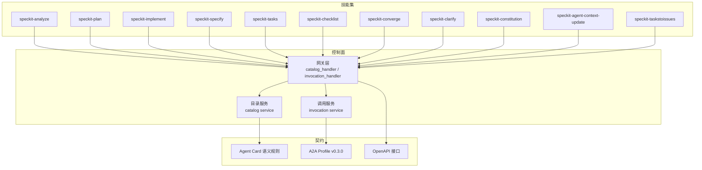
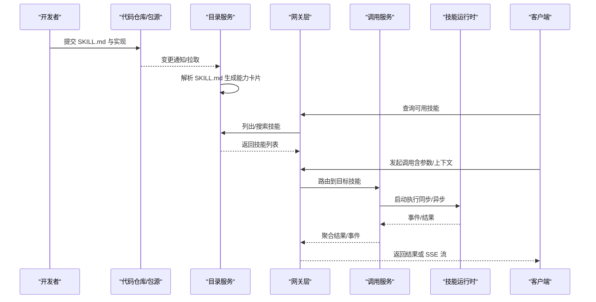
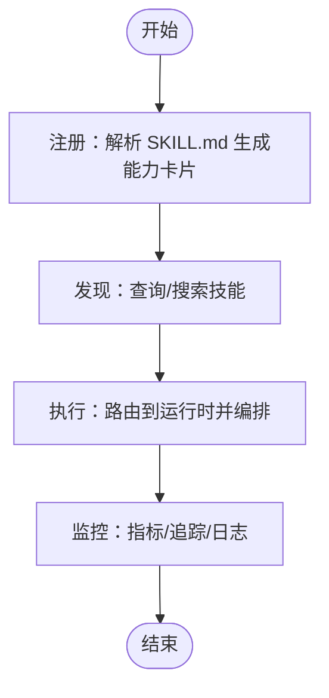
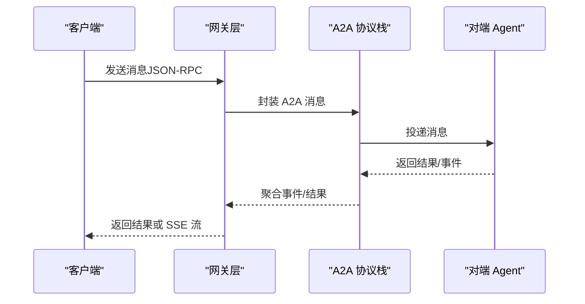
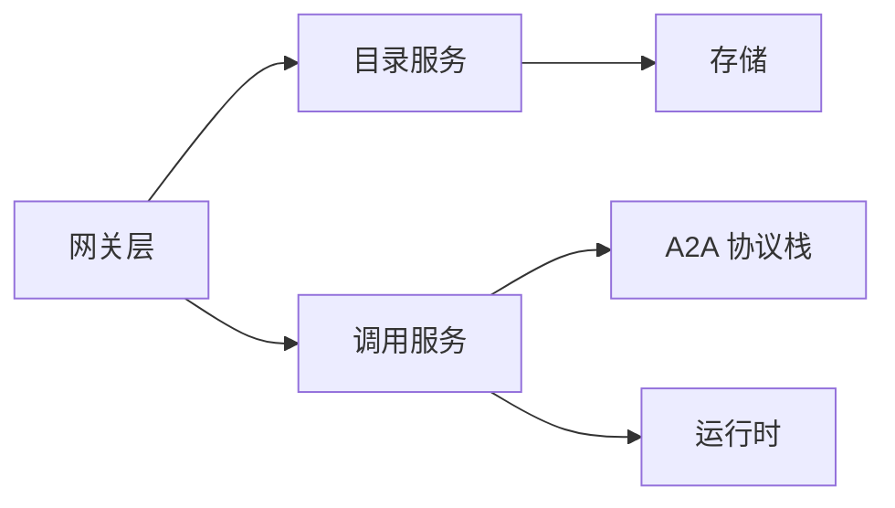

# Agent 技能开发

<cite>
**本文引用的文件**   
- [README.md](file://README.md)
- [.agents/skills/speckit-analyze/SKILL.md](file://.agents/skills/speckit-analyze/SKILL.md)
- [.agents/skills/speckit-plan/SKILL.md](file://.agents/skills/speckit-plan/SKILL.md)
- [.agents/skills/speckit-implement/SKILL.md](file://.agents/skills/speckit-implement/SKILL.md)
- [.agents/skills/speckit-specify/SKILL.md](file://.agents/skills/speckit-specify/SKILL.md)
- [.agents/skills/speckit-tasks/SKILL.md](file://.agents/skills/speckit-tasks/SKILL.md)
- [.agents/skills/speckit-checklist/SKILL.md](file://.agents/skills/speckit-checklist/SKILL.md)
- [.agents/skills/speckit-converge/SKILL.md](file://.agents/skills/speckit-converge/SKILL.md)
- [.agents/skills/speckit-clarify/SKILL.md](file://.agents/skills/speckit-clarify/SKILL.md)
- [.agents/skills/speckit-constitution/SKILL.md](file://.agents/skills/speckit-constitution/SKILL.md)
- [.agents/skills/speckit-agent-context-update/SKILL.md](file://.agents/skills/speckit-agent-context-update/SKILL.md)
- [.agents/skills/speckit-taskstoissues/SKILL.md](file://.agents/skills/speckit-taskstoissues/SKILL.md)
- [contracts/agent-card/v0.2/semantic-rules.md](file://contracts/agent-card/v0.2/semantic-rules.md)
- [contracts/a2a-profile/v0.3.0.json](file://contracts/a2a-profile/v0.3.0.json)
- [contracts/openapi/control-plane.v1.yaml](file://contracts/openapi/control-plane.v1.yaml)
- [contracts/openapi/router-agent.v1.yaml](file://contracts/openapi/router-agent.v1.yaml)
- [apps/control-plane/internal/gateway/catalog_handler.go](file://apps/control-plane/internal/gateway/catalog_handler.go)
- [apps/control-plane/internal/gateway/invocation_handler.go](file://apps/control-plane/internal/gateway/invocation_handler.go)
- [apps/control-plane/internal/catalog/service.go](file://apps/control-plane/internal/catalog/service.go)
- [apps/control-plane/internal/invocation/service.go](file://apps/control-plane/internal/invocation/service.go)
- [specs/002-catalog-registry-discovery/contracts/catalog-api.md](file://specs/002-catalog-registry-discovery/contracts/catalog-api.md)
- [specs/012-control-plane-invocation-dispatch/spec.md](file://specs/012-control-plane-invocation-dispatch/spec.md)
</cite>

## 目录
1. [简介](#简介)
2. [项目结构](#项目结构)
3. [核心组件](#核心组件)
4. [架构总览](#架构总览)
5. [详细组件分析](#详细组件分析)
6. [依赖关系分析](#依赖关系分析)
7. [性能考虑](#性能考虑)
8. [故障排查指南](#故障排查指南)
9. [结论](#结论)
10. [附录](#附录)

## 简介
本指南面向在 NeKiro 平台上开发 Agent 技能的工程师与产品人员，目标是帮助你从零到一完成一个高质量、可组合、可观测、可治理的技能。文档覆盖：
- SKILL.md 文件格式规范与元数据定义
- 技能生命周期管理（注册、发现、执行、监控）
- 常见场景的开发示例（分析、实现、规划等）
- 技能间依赖关系与组合模式
- 权限控制与资源访问机制
- 测试框架与调试工具使用方法
- 版本管理与发布流程
- 性能优化与安全考虑
- 与 A2A 协议的集成方式与消息格式

## 项目结构
NeKiro 仓库采用“契约优先 + 多应用”的组织方式：
- .agents/skills：内置示例技能集合，每个技能以独立目录组织，包含 SKILL.md 描述文件
- contracts：平台对外/对内契约（OpenAPI、A2A Profile、Agent Card 语义规则等）
- apps/control-plane：控制面服务，提供目录注册、能力发现、调用编排等能力
- specs：需求与规格说明，涵盖目录、工作空间、安装、调度、运行时契约等
- tests：集成与一致性测试用例

图表来源
- [apps/control-plane/internal/gateway/catalog_handler.go](file://apps/control-plane/internal/gateway/catalog_handler.go)
- [apps/control-plane/internal/gateway/invocation_handler.go](file://apps/control-plane/internal/gateway/invocation_handler.go)
- [contracts/agent-card/v0.2/semantic-rules.md](file://contracts/agent-card/v0.2/semantic-rules.md)
- [contracts/a2a-profile/v0.3.0.json](file://contracts/a2a-profile/v0.3.0.json)
- [contracts/openapi/control-plane.v1.yaml](file://contracts/openapi/control-plane.v1.yaml)
- [contracts/openapi/router-agent.v1.yaml](file://contracts/openapi/router-agent.v1.yaml)

章节来源
- [README.md](file://README.md)

## 核心组件
- 技能清单（SKILL.md）：描述技能的能力、输入输出、依赖、权限、版本、作者等信息，是技能注册与发现的依据
- 目录服务（Catalog Service）：负责技能的注册、索引、查询与版本管理
- 网关层（Gateway）：暴露 REST API，处理技能发现与调用路由
- 调用服务（Invocation Service）：负责任务编排、状态跟踪、结果投递与流式事件
- 契约层（Contracts）：包括 OpenAPI、A2A Profile、Agent Card 语义规则等，确保跨组件一致性与互操作

章节来源
- [apps/control-plane/internal/catalog/service.go](file://apps/control-plane/internal/catalog/service.go)
- [apps/control-plane/internal/invocation/service.go](file://apps/control-plane/internal/invocation/service.go)
- [apps/control-plane/internal/gateway/catalog_handler.go](file://apps/control-plane/internal/gateway/catalog_handler.go)
- [apps/control-plane/internal/gateway/invocation_handler.go](file://apps/control-plane/internal/gateway/invocation_handler.go)
- [contracts/openapi/control-plane.v1.yaml](file://contracts/openapi/control-plane.v1.yaml)
- [contracts/a2a-profile/v0.3.0.json](file://contracts/a2a-profile/v0.3.0.json)
- [contracts/agent-card/v0.2/semantic-rules.md](file://contracts/agent-card/v0.2/semantic-rules.md)

## 架构总览
NeKiro 的 Agent 技能生态围绕“目录 + 网关 + 调用”展开：
- 开发者将技能以 SKILL.md 形式提交至仓库或包管理器
- 控制面扫描并解析 SKILL.md，生成能力卡片（Agent Card），写入目录存储
- 客户端通过网关查询可用技能，按能力匹配选择目标技能
- 网关将调用请求转发至具体运行时（本地/远程），由调用服务编排执行
- 执行过程中产生事件与结果，支持同步返回与 SSE 流式推送
- 所有交互遵循 A2A Profile 与 OpenAPI 契约

图表来源
- [apps/control-plane/internal/catalog/service.go](file://apps/control-plane/internal/catalog/service.go)
- [apps/control-plane/internal/gateway/catalog_handler.go](file://apps/control-plane/internal/gateway/catalog_handler.go)
- [apps/control-plane/internal/invocation/service.go](file://apps/control-plane/internal/invocation/service.go)
- [apps/control-plane/internal/gateway/invocation_handler.go](file://apps/control-plane/internal/gateway/invocation_handler.go)
- [contracts/a2a-profile/v0.3.0.json](file://contracts/a2a-profile/v0.3.0.json)
- [contracts/openapi/control-plane.v1.yaml](file://contracts/openapi/control-plane.v1.yaml)

## 详细组件分析

### SKILL.md 文件格式与元数据定义
SKILL.md 是技能的“能力声明”，用于注册与发现。建议包含以下元数据字段（名称为建议键名，实际以平台解析器为准）：
- 基本信息
  - id：技能唯一标识（建议语义化命名，如 speckit-analyze）
  - name：人类可读名称
  - version：语义化版本号（遵循 SemVer）
  - description：功能描述
  - author：作者/团队信息
  - license：许可证
- 能力与接口
  - inputs：输入参数定义（类型、必填、默认值、约束）
  - outputs：输出结果定义（结构、枚举、媒体类型）
  - errors：错误码与含义
- 依赖与组合
  - requires：外部依赖（其他技能、系统资源、环境变量、密钥）
  - composes：组合模式（前置/后置/并行/串行）
- 权限与安全
  - permissions：所需权限（文件系统、网络、数据库、第三方 API）
  - secrets：敏感配置注入点
- 运行环境
  - runtime：运行时要求（语言、版本、容器镜像、沙箱）
  - resources：CPU/内存/超时限制
- 可观测性
  - metrics：指标上报项
  - tracing：追踪标签与采样策略
- 文档与示例
  - examples：使用示例（输入/期望输出）
  - docs：相关文档链接

最佳实践
- 保持幂等与可重试：避免副作用或明确标注幂等键
- 最小权限原则：仅声明必要权限
- 明确错误语义：区分业务错误与系统错误
- 版本兼容：向后兼容变更需提升次版本，破坏性变更提升主版本

章节来源
- [.agents/skills/speckit-analyze/SKILL.md](file://.agents/skills/speckit-analyze/SKILL.md)
- [.agents/skills/speckit-plan/SKILL.md](file://.agents/skills/speckit-plan/SKILL.md)
- [.agents/skills/speckit-implement/SKILL.md](file://.agents/skills/speckit-implement/SKILL.md)
- [.agents/skills/speckit-specify/SKILL.md](file://.agents/skills/speckit-specify/SKILL.md)
- [.agents/skills/speckit-tasks/SKILL.md](file://.agents/skills/speckit-tasks/SKILL.md)
- [.agents/skills/speckit-checklist/SKILL.md](file://.agents/skills/speckit-checklist/SKILL.md)
- [.agents/skills/speckit-converge/SKILL.md](file://.agents/skills/speckit-converge/SKILL.md)
- [.agents/skills/speckit-clarify/SKILL.md](file://.agents/skills/speckit-clarify/SKILL.md)
- [.agents/skills/speckit-constitution/SKILL.md](file://.agents/skills/speckit-constitution/SKILL.md)
- [.agents/skills/speckit-agent-context-update/SKILL.md](file://.agents/skills/speckit-agent-context-update/SKILL.md)
- [.agents/skills/speckit-taskstoissues/SKILL.md](file://.agents/skills/speckit-taskstoissues/SKILL.md)

### 技能生命周期管理（注册、发现、执行、监控）
- 注册
  - 将 SKILL.md 与实现提交至仓库/包源
  - 控制面扫描变更，解析 SKILL.md，生成能力卡片并持久化
- 发现
  - 客户端通过目录 API 查询/搜索技能
  - 网关根据能力匹配返回候选技能
- 执行
  - 客户端发起调用，网关路由至对应运行时
  - 调用服务创建任务实例，编排执行，记录状态与事件
- 监控
  - 指标上报（耗时、成功率、错误分布）
  - 追踪贯穿（trace_id、span、关联上下文）
  - 日志结构化输出（统一字段、分级、脱敏）

章节来源
- [apps/control-plane/internal/catalog/service.go](file://apps/control-plane/internal/catalog/service.go)
- [apps/control-plane/internal/gateway/catalog_handler.go](file://apps/control-plane/internal/gateway/catalog_handler.go)
- [apps/control-plane/internal/invocation/service.go](file://apps/control-plane/internal/invocation/service.go)
- [apps/control-plane/internal/gateway/invocation_handler.go](file://apps/control-plane/internal/gateway/invocation_handler.go)
- [specs/002-catalog-registry-discovery/contracts/catalog-api.md](file://specs/002-catalog-registry-discovery/contracts/catalog-api.md)
- [specs/012-control-plane-invocation-dispatch/spec.md](file://specs/012-control-plane-invocation-dispatch/spec.md)

### 常见场景开发示例
- 分析类技能（如 speckit-analyze）
  - 输入：代码片段/问题描述/上下文
  - 输出：分析报告/建议/风险点
  - 依赖：静态分析库、知识库
  - 权限：只读文件访问、网络（可选）
- 规划类技能（如 speckit-plan）
  - 输入：需求/约束/目标
  - 输出：计划/里程碑/任务分解
  - 依赖：历史数据、模板
  - 权限：读写工作区、外部 API（可选）
- 实现类技能（如 speckit-implement）
  - 输入：设计/规范/依赖
  - 输出：代码变更/补丁/构建产物
  - 权限：写文件、执行命令（受限）、CI 集成
- 指定类技能（如 speckit-specify）
  - 输入：原始需求/用户故事
  - 输出：规格说明/验收标准
  - 权限：读工作区、模板渲染
- 任务类技能（如 speckit-tasks）
  - 输入：目标/范围/约束
  - 输出：任务清单/优先级/依赖图
  - 权限：读写任务存储
- 检查清单类技能（如 speckit-checklist）
  - 输入：领域/阶段/合规要求
  - 输出：检查项/证据收集指引
  - 权限：只读为主
- 收敛类技能（如 speckit-converge）
  - 输入：多方案/分歧点
  - 输出：收敛决策/权衡报告
  - 权限：读工作区、外部参考
- 澄清类技能（如 speckit-clarify）
  - 输入：模糊需求/歧义点
  - 输出：澄清问题/确认要点
  - 权限：只读
- 宪法类技能（如 speckit-constitution）
  - 输入：组织原则/价值观
  - 输出：行为准则/决策框架
  - 权限：只读
- 上下文更新类技能（如 speckit-agent-context-update）
  - 输入：新事实/变更
  - 输出：上下文增量/冲突解决
  - 权限：写上下文存储
- 任务转 Issue 类技能（如 speckit-taskstoissues）
  - 输入：任务清单
  - 输出：Issue 列表/映射关系
  - 权限：写 Issue 系统（受控）

章节来源
- [.agents/skills/speckit-analyze/SKILL.md](file://.agents/skills/speckit-analyze/SKILL.md)
- [.agents/skills/speckit-plan/SKILL.md](file://.agents/skills/speckit-plan/SKILL.md)
- [.agents/skills/speckit-implement/SKILL.md](file://.agents/skills/speckit-implement/SKILL.md)
- [.agents/skills/speckit-specify/SKILL.md](file://.agents/skills/speckit-specify/SKILL.md)
- [.agents/skills/speckit-tasks/SKILL.md](file://.agents/skills/speckit-tasks/SKILL.md)
- [.agents/skills/speckit-checklist/SKILL.md](file://.agents/skills/speckit-checklist/SKILL.md)
- [.agents/skills/speckit-converge/SKILL.md](file://.agents/skills/speckit-converge/SKILL.md)
- [.agents/skills/speckit-clarify/SKILL.md](file://.agents/skills/speckit-clarify/SKILL.md)
- [.agents/skills/speckit-constitution/SKILL.md](file://.agents/skills/speckit-constitution/SKILL.md)
- [.agents/skills/speckit-agent-context-update/SKILL.md](file://.agents/skills/speckit-agent-context-update/SKILL.md)
- [.agents/skills/speckit-taskstoissues/SKILL.md](file://.agents/skills/speckit-taskstoissues/SKILL.md)

### 技能间的依赖关系与组合模式
- 依赖声明
  - requires：显式声明对其他技能/资源的依赖
  - 版本约束：允许范围（>=, <, ^, ~）
- 组合模式
  - 串行：前一个输出作为下一个输入
  - 并行：多个子技能并发执行，结果合并
  - 条件分支：基于输入动态选择路径
  - 循环与重试：带退避与熔断
- 编排建议
  - 将通用能力下沉为原子技能
  - 复杂流程拆分为可复用子流程
  - 使用幂等键与去重策略避免重复执行

章节来源
- [.agents/skills/speckit-tasks/SKILL.md](file://.agents/skills/speckit-tasks/SKILL.md)
- [.agents/skills/speckit-converge/SKILL.md](file://.agents/skills/speckit-converge/SKILL.md)
- [.agents/skills/speckit-taskstoissues/SKILL.md](file://.agents/skills/speckit-taskstoissues/SKILL.md)

### 权限控制与资源访问机制
- 权限模型
  - 基于能力的授权（Capability-based）
  - 最小权限原则：仅授予必要权限
  - 作用域隔离：按工作区/租户隔离
- 资源访问
  - 文件系统：白名单路径、只读/读写标记
  - 网络：出站域名白名单、代理与证书管理
  - 密钥：通过 Secrets 注入，禁止硬编码
- 审计与合规
  - 访问日志、操作留痕
  - 敏感数据脱敏与加密传输

章节来源
- [contracts/agent-card/v0.2/semantic-rules.md](file://contracts/agent-card/v0.2/semantic-rules.md)
- [.agents/skills/speckit-implement/SKILL.md](file://.agents/skills/speckit-implement/SKILL.md)
- [.agents/skills/speckit-agent-context-update/SKILL.md](file://.agents/skills/speckit-agent-context-update/SKILL.md)

### 测试框架与调试工具使用方法
- 单元测试
  - 针对输入/输出校验、边界条件、错误路径
- 集成测试
  - 模拟目录与调用服务，端到端验证流程
- 契约测试
  - 基于 OpenAPI/A2A Profile 的一致性校验
- 调试工具
  - 启用追踪（trace_id/span）
  - 结构化日志（级别、字段、脱敏）
  - 指标采集（Prometheus/Grafana）

章节来源
- [contracts/openapi/control-plane.v1.yaml](file://contracts/openapi/control-plane.v1.yaml)
- [contracts/a2a-profile/v0.3.0.json](file://contracts/a2a-profile/v0.3.0.json)
- [apps/control-plane/internal/invocation/service.go](file://apps/control-plane/internal/invocation/service.go)

### 版本管理与发布流程
- 版本策略
  - 语义化版本（SemVer）：主版本=破坏性变更，次版本=新增能力，修订=修复
- 发布流程
  - 提交流程：PR 审查 + 自动化测试 + 契约校验
  - 制品打包：SKILL.md + 实现 + 依赖清单
  - 登记目录：自动注册/手动登记
  - 灰度与回滚：按版本路由与快速回滚
- 兼容性
  - 向后兼容承诺
  - 弃用策略与迁移指引

章节来源
- [.agents/skills/speckit-analyze/SKILL.md](file://.agents/skills/speckit-analyze/SKILL.md)
- [.agents/skills/speckit-plan/SKILL.md](file://.agents/skills/speckit-plan/SKILL.md)
- [specs/002-catalog-registry-discovery/contracts/catalog-api.md](file://specs/002-catalog-registry-discovery/contracts/catalog-api.md)

### 性能优化与安全考虑
- 性能优化
  - 缓存热点数据（结果/模板/知识）
  - 批处理与分页
  - 连接池与限流
  - 异步与流式处理（SSE）
- 安全考虑
  - 输入校验与白名单
  - 资源配额与超时
  - 防注入与反序列化保护
  - 密钥管理与最小暴露

章节来源
- [apps/control-plane/internal/invocation/service.go](file://apps/control-plane/internal/invocation/service.go)
- [contracts/a2a-profile/v0.3.0.json](file://contracts/a2a-profile/v0.3.0.json)

### 与 A2A 协议的集成方式与消息格式
- 协议概览
  - A2A Profile 定义了 Agent 之间的通信契约，包括消息发送、任务获取、取消、流式事件等
- 消息格式
  - 请求/响应遵循 JSON-RPC 风格
  - 事件流采用 SSE（Server-Sent Events）
  - 上下文头携带认证与追踪信息
- 集成步骤
  - 在 SKILL.md 中声明 A2A 能力与端点
  - 实现网关适配层，将内部调用转换为 A2A 消息
  - 订阅事件流，聚合结果并返回给客户端

图表来源
- [contracts/a2a-profile/v0.3.0.json](file://contracts/a2a-profile/v0.3.0.json)
- [contracts/openapi/router-agent.v1.yaml](file://contracts/openapi/router-agent.v1.yaml)
- [apps/control-plane/internal/gateway/invocation_handler.go](file://apps/control-plane/internal/gateway/invocation_handler.go)

## 依赖关系分析
- 组件耦合
  - 网关层依赖目录服务与调用服务
  - 调用服务依赖运行时与 A2A 协议栈
  - 目录服务依赖存储与解析器（SKILL.md）
- 外部依赖
  - OpenAPI 契约
  - A2A Profile
  - 存储（Postgres/对象存储）
  - 消息总线（可选）

图表来源
- [apps/control-plane/internal/gateway/catalog_handler.go](file://apps/control-plane/internal/gateway/catalog_handler.go)
- [apps/control-plane/internal/gateway/invocation_handler.go](file://apps/control-plane/internal/gateway/invocation_handler.go)
- [apps/control-plane/internal/catalog/service.go](file://apps/control-plane/internal/catalog/service.go)
- [apps/control-plane/internal/invocation/service.go](file://apps/control-plane/internal/invocation/service.go)
- [contracts/a2a-profile/v0.3.0.json](file://contracts/a2a-profile/v0.3.0.json)

章节来源
- [apps/control-plane/internal/gateway/catalog_handler.go](file://apps/control-plane/internal/gateway/catalog_handler.go)
- [apps/control-plane/internal/gateway/invocation_handler.go](file://apps/control-plane/internal/gateway/invocation_handler.go)
- [apps/control-plane/internal/catalog/service.go](file://apps/control-plane/internal/catalog/service.go)
- [apps/control-plane/internal/invocation/service.go](file://apps/control-plane/internal/invocation/service.go)

## 性能考虑
- 高并发
  - 水平扩展网关与调用服务
  - 使用连接池与缓冲队列
- 低延迟
  - 就近路由与缓存命中
  - 减少序列化/反序列化开销
- 稳定性
  - 熔断与降级
  - 重试与退避策略
- 可观测性
  - 全链路追踪
  - 关键指标看板

[本节为通用指导，不直接分析具体文件]

## 故障排查指南
- 常见问题
  - 技能未注册：检查 SKILL.md 是否被正确解析与登记
  - 调用失败：核对权限、依赖、网络连通性
  - 超时/阻塞：检查资源配额与下游依赖
- 定位方法
  - 查看追踪 ID 与 Span
  - 检索结构化日志（过滤 trace_id）
  - 检查指标异常（错误率、P99 延迟）
- 恢复策略
  - 快速回滚到上一稳定版本
  - 临时降级或关闭非关键能力

章节来源
- [apps/control-plane/internal/invocation/service.go](file://apps/control-plane/internal/invocation/service.go)
- [apps/control-plane/internal/gateway/invocation_handler.go](file://apps/control-plane/internal/gateway/invocation_handler.go)

## 结论
通过规范的 SKILL.md 元数据、清晰的目录与调用架构、严格的契约与权限控制、完善的测试与可观测性体系，NeKiro 平台能够支撑大规模、可组合、可治理的 Agent 技能生态。建议在开发中坚持最小权限、幂等设计、版本兼容与性能优化，确保技能在生产环境的稳定与高效。

[本节为总结性内容，不直接分析具体文件]

## 附录
- 术语表
  - 技能（Skill）：具备特定能力的可复用单元
  - 能力卡片（Agent Card）：技能注册后的标准化描述
  - 调用（Invocation）：一次具体的技能执行实例
  - 事件流（Event Stream）：SSE 形式的实时事件推送
- 参考链接
  - 目录与发现契约
  - 调用与分发契约
  - A2A Profile 与 OpenAPI 接口

章节来源
- [specs/002-catalog-registry-discovery/contracts/catalog-api.md](file://specs/002-catalog-registry-discovery/contracts/catalog-api.md)
- [specs/012-control-plane-invocation-dispatch/spec.md](file://specs/012-control-plane-invocation-dispatch/spec.md)
- [contracts/openapi/control-plane.v1.yaml](file://contracts/openapi/control-plane.v1.yaml)
- [contracts/a2a-profile/v0.3.0.json](file://contracts/a2a-profile/v0.3.0.json)