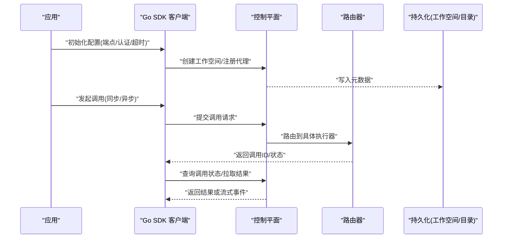
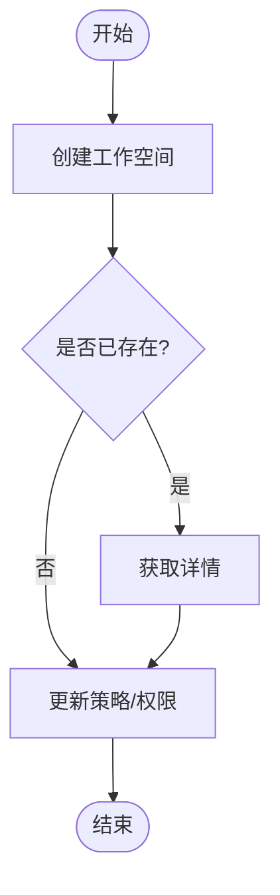
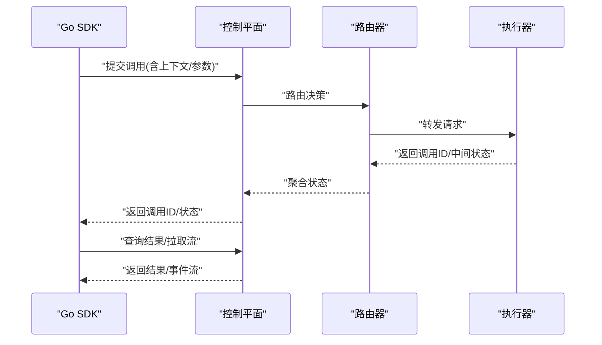
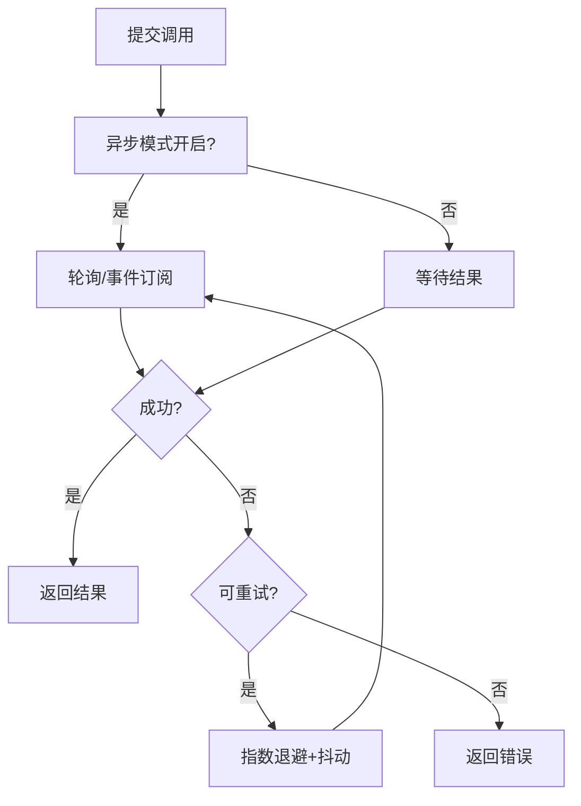
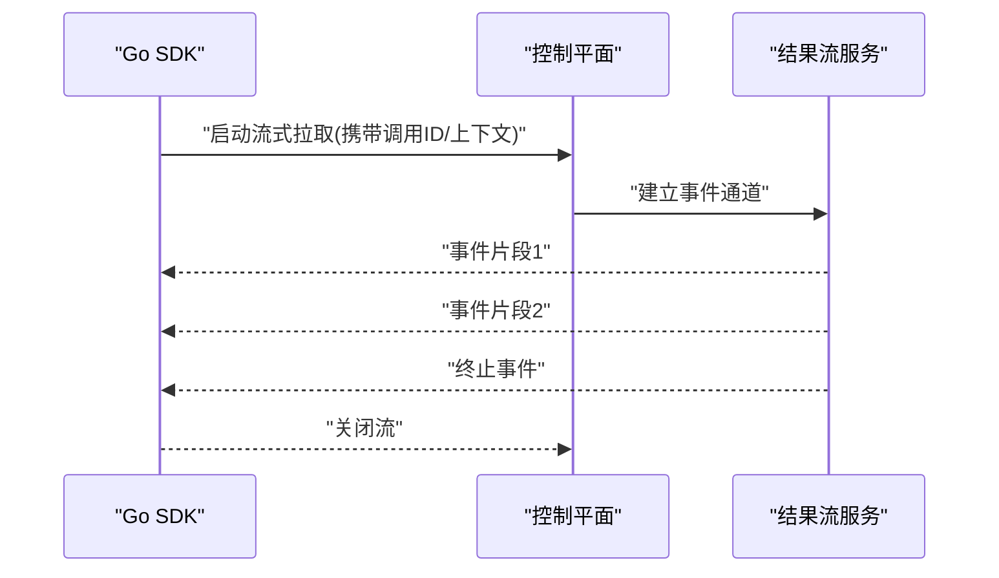
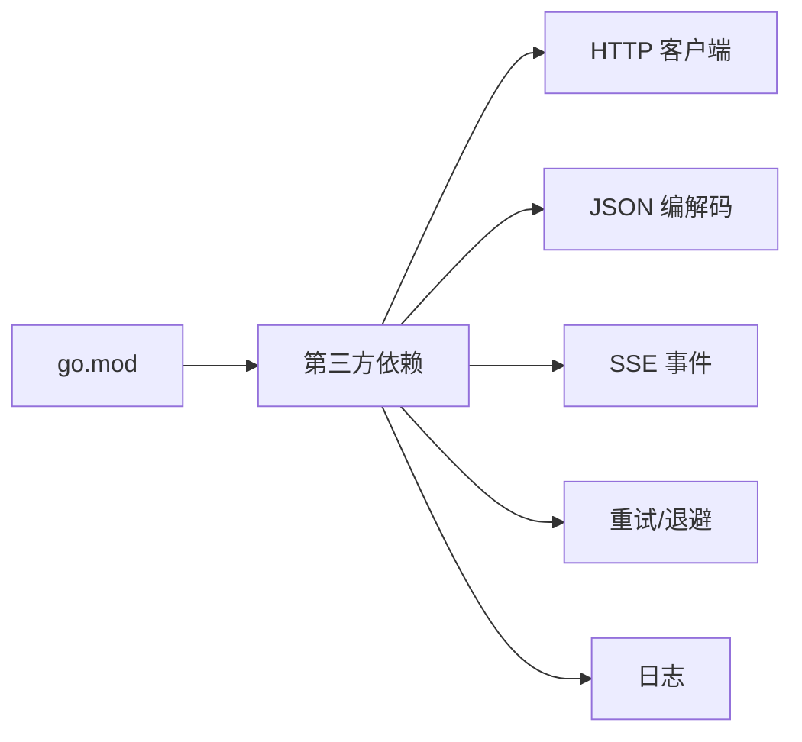

# Go SDK

<cite>
**本文引用的文件**   
- [go.mod](file://go.mod)
- [README.md](file://README.md)
- [control-plane.v1.yaml](file://contracts/openapi/control-plane.v1.yaml)
- [control-plane.v2.yaml](file://contracts/openapi/control-plane.v2.yaml)
- [control-plane.v3.yaml](file://contracts/openapi/control-plane.v3.yaml)
- [control-plane-invocation.v4.yaml](file://contracts/openapi/control-plane-invocation.v4.yaml)
- [router-agent.v1.yaml](file://contracts/openapi/router-agent.v1.yaml)
- [router-internal.v1.yaml](file://contracts/openapi/router-internal.v1.yaml)
- [router-internal.v2.yaml](file://contracts/openapi/router-internal.v2.yaml)
- [router-internal.v3.yaml](file://contracts/openapi/router-internal.v3.yaml)
- [workspace.v1.schema.json](file://contracts/schemas/workspace.v1.schema.json)
- [platform-error.v1.schema.json](file://contracts/schemas/platform-error.v1.schema.json)
- [platform-error.v2.schema.json](file://contracts/schemas/platform-error.v2.schema.json)
- [platform-error.v3.schema.json](file://contracts/schemas/platform-error.v3.schema.json)
- [platform-error.v4.schema.json](file://contracts/schemas/platform-error.v4.schema.json)
- [invocation-result-stream-event.v1.schema.json](file://contracts/schemas/invocation-result-stream-event.v1.schema.json)
- [invocation-result-stream-event.v2.schema.json](file://contracts/schemas/invocation-result-stream-event.v2.schema.json)
- [a2a-profile.v0.3.0.json](file://contracts/a2a-profile/v0.3.0.json)
- [agent-card.v0.2/schema](file://contracts/agent-card/v0.2/semantic-rules.md)
- [runtime-contracts.md](file://specs/011-invocation-runtime-contracts/contracts/runtime-contract.md)
- [compatibility.md](file://docs/contracts/compatibility.md)
</cite>

## 目录
1. [简介](#简介)
2. [项目结构](#项目结构)
3. [核心组件](#核心组件)
4. [架构总览](#架构总览)
5. [详细组件分析](#详细组件分析)
6. [依赖分析](#依赖分析)
7. [性能考虑](#性能考虑)
8. [故障排查指南](#故障排查指南)
9. [结论](#结论)
10. [附录](#附录)

## 简介
本文件为 NeKiro Go SDK 的开发文档，聚焦于：
- 安装与模块管理（go get、版本选择）
- 客户端初始化配置（连接参数、认证机制、超时设置）
- 核心 API 使用（代理注册、工作空间管理、调用路由）
- 异步调用模式、错误处理与重试策略
- 流式响应与事件订阅
- 配置项与环境变量
- 调试技巧、日志与性能优化
- 与控制平面 API 的兼容性说明

注意：当前仓库未包含 Go SDK 源码实现。本文档基于 OpenAPI 契约、Schema 与规范文档进行抽象化说明，并提供可落地的集成建议与示例路径指引。

## 项目结构
仓库采用多合约驱动设计，Go SDK 应围绕以下契约与规范进行实现或对接：
- 控制平面 OpenAPI：v1/v2/v3 以及调用相关 v4
- 路由器内部/外部接口：v1/v2/v3
- 工作空间与平台错误 Schema
- A2A Profile 与 Agent Card 语义规则
- 运行时契约与兼容性说明

```mermaid
graph TB
subgraph "SDK 层"
Client["Go SDK 客户端"]
Config["配置与认证"]
Retry["重试与退避"]
Stream["流式与事件"]
end
subgraph "控制平面"
CP_v1["Control Plane v1"]
CP_v2["Control Plane v2"]
CP_v3["Control Plane v3"]
CP_Inv["Invocation v4"]
end
subgraph "路由器"
Router_Agent["Router Agent v1"]
Router_Internal_v1["Router Internal v1"]
Router_Internal_v2["Router Internal v2"]
Router_Internal_v3["Router Internal v3"]
end
subgraph "数据模型"
WS["Workspace Schema v1"]
Err1["Platform Error v1"]
Err2["Platform Error v2"]
Err3["Platform Error v3"]
Err4["Platform Error v4"]
ResStream1["Result Stream v1"]
ResStream2["Result Stream v2"]
end
Client --> Config
Client --> Retry
Client --> Stream
Client --> CP_v1
Client --> CP_v2
Client --> CP_v3
Client --> CP_Inv
Client --> Router_Agent
Client --> Router_Internal_v1
Client --> Router_Internal_v2
Client --> Router_Internal_v3
Client --> WS
Client --> Err1
Client --> Err2
Client --> Err3
Client --> Err4
Client --> ResStream1
Client --> ResStream2
```

图表来源
- [control-plane.v1.yaml](file://contracts/openapi/control-plane.v1.yaml)
- [control-plane.v2.yaml](file://contracts/openapi/control-plane.v2.yaml)
- [control-plane.v3.yaml](file://contracts/openapi/control-plane.v3.yaml)
- [control-plane-invocation.v4.yaml](file://contracts/openapi/control-plane-invocation.v4.yaml)
- [router-agent.v1.yaml](file://contracts/openapi/router-agent.v1.yaml)
- [router-internal.v1.yaml](file://contracts/openapi/router-internal.v1.yaml)
- [router-internal.v2.yaml](file://contracts/openapi/router-internal.v2.yaml)
- [router-internal.v3.yaml](file://contracts/openapi/router-internal.v3.yaml)
- [workspace.v1.schema.json](file://contracts/schemas/workspace.v1.schema.json)
- [platform-error.v1.schema.json](file://contracts/schemas/platform-error.v1.schema.json)
- [platform-error.v2.schema.json](file://contracts/schemas/platform-error.v2.schema.json)
- [platform-error.v3.schema.json](file://contracts/schemas/platform-error.v3.schema.json)
- [platform-error.v4.schema.json](file://contracts/schemas/platform-error.v4.schema.json)
- [invocation-result-stream-event.v1.schema.json](file://contracts/schemas/invocation-result-stream-event.v1.schema.json)
- [invocation-result-stream-event.v2.schema.json](file://contracts/schemas/invocation-result-stream-event.v2.schema.json)

章节来源
- [README.md](file://README.md)
- [go.mod](file://go.mod)

## 核心组件
本节从 SDK 视角抽象出关键能力与职责边界，便于后续深入分析与集成实践。

- 客户端与配置
  - 负责建立与控制平面/路由器的连接，管理认证、超时、重试等横切关注点
  - 提供统一的上下文与选项注入（如租户/工作空间标识、追踪 ID）
- 工作空间管理
  - 基于 Workspace Schema 完成工作空间的创建、读取、更新、删除等操作
- 调用路由与编排
  - 通过 Control Plane Invocation 与 Router 接口完成任务分发、状态查询与结果拉取
- 流式与事件
  - 支持结果流式事件（Result Stream）与 SSE 事件订阅
- 错误与重试
  - 统一解析 Platform Error 并实施指数退避与幂等重试策略

章节来源
- [workspace.v1.schema.json](file://contracts/schemas/workspace.v1.schema.json)
- [platform-error.v1.schema.json](file://contracts/schemas/platform-error.v1.schema.json)
- [platform-error.v2.schema.json](file://contracts/schemas/platform-error.v2.schema.json)
- [platform-error.v3.schema.json](file://contracts/schemas/platform-error.v3.schema.json)
- [platform-error.v4.schema.json](file://contracts/schemas/platform-error.v4.schema.json)
- [invocation-result-stream-event.v1.schema.json](file://contracts/schemas/invocation-result-stream-event.v1.schema.json)
- [invocation-result-stream-event.v2.schema.json](file://contracts/schemas/invocation-result-stream-event.v2.schema.json)

## 架构总览
下图展示 Go SDK 在整体系统中的位置与交互关系。SDK 作为客户端，面向控制平面与路由器发起请求，遵循 OpenAPI 契约与 Schema 约束。

图表来源
- [control-plane.v1.yaml](file://contracts/openapi/control-plane.v1.yaml)
- [control-plane.v2.yaml](file://contracts/openapi/control-plane.v2.yaml)
- [control-plane.v3.yaml](file://contracts/openapi/control-plane.v3.yaml)
- [control-plane-invocation.v4.yaml](file://contracts/openapi/control-plane-invocation.v4.yaml)
- [router-agent.v1.yaml](file://contracts/openapi/router-agent.v1.yaml)
- [router-internal.v1.yaml](file://contracts/openapi/router-internal.v1.yaml)
- [router-internal.v2.yaml](file://contracts/openapi/router-internal.v2.yaml)
- [router-internal.v3.yaml](file://contracts/openapi/router-internal.v3.yaml)

## 详细组件分析

### 客户端初始化与配置
- 连接参数
  - 控制平面基础 URL、路由器地址、协议（HTTP/HTTPS）、TLS 证书与跳过校验开关
- 认证机制
  - 支持 Token/Bearer、API Key、mTLS 等；建议在环境变量中注入密钥，避免硬编码
- 超时设置
  - 连接超时、请求超时、读写超时、空闲连接保持时间
- 重试与退避
  - 针对幂等读操作启用自动重试；写操作仅在明确幂等时重试
  - 指数退避 + 抖动，最大重试次数与退避上限
- 上下文与追踪
  - 注入 TraceId、SpanId、工作空间标识、租户标识等

章节来源
- [control-plane.v1.yaml](file://contracts/openapi/control-plane.v1.yaml)
- [control-plane.v2.yaml](file://contracts/openapi/control-plane.v2.yaml)
- [control-plane.v3.yaml](file://contracts/openapi/control-plane.v3.yaml)
- [router-internal.v1.yaml](file://contracts/openapi/router-internal.v1.yaml)
- [router-internal.v2.yaml](file://contracts/openapi/router-internal.v2.yaml)
- [router-internal.v3.yaml](file://contracts/openapi/router-internal.v3.yaml)

### 工作空间管理
- 能力范围
  - 基于 Workspace Schema 定义的数据模型，完成工作空间的增删改查与策略配置
- 典型流程
  - 创建工作空间 -> 获取详情 -> 更新策略 -> 删除工作空间
- 注意事项
  - 幂等性：创建接口需支持幂等键
  - 一致性：强一致或最终一致取决于后端实现，SDK 应暴露相应选项

图表来源
- [workspace.v1.schema.json](file://contracts/schemas/workspace.v1.schema.json)

章节来源
- [workspace.v1.schema.json](file://contracts/schemas/workspace.v1.schema.json)

### 调用路由与编排
- 能力范围
  - 通过 Control Plane Invocation 与 Router 接口完成调用提交、状态查询、结果拉取
- 同步与异步
  - 同步：等待结果返回
  - 异步：提交后轮询或长轮询，结合事件通知
- 路由策略
  - 根据能力/标签/权重选择执行器，失败回退与熔断

图表来源
- [control-plane-invocation.v4.yaml](file://contracts/openapi/control-plane-invocation.v4.yaml)
- [router-agent.v1.yaml](file://contracts/openapi/router-agent.v1.yaml)
- [router-internal.v1.yaml](file://contracts/openapi/router-internal.v1.yaml)
- [router-internal.v2.yaml](file://contracts/openapi/router-internal.v2.yaml)
- [router-internal.v3.yaml](file://contracts/openapi/router-internal.v3.yaml)

章节来源
- [control-plane-invocation.v4.yaml](file://contracts/openapi/control-plane-invocation.v4.yaml)
- [router-agent.v1.yaml](file://contracts/openapi/router-agent.v1.yaml)
- [router-internal.v1.yaml](file://contracts/openapi/router-internal.v1.yaml)
- [router-internal.v2.yaml](file://contracts/openapi/router-internal.v2.yaml)
- [router-internal.v3.yaml](file://contracts/openapi/router-internal.v3.yaml)

### 异步调用模式与重试机制
- 异步模式
  - 提交后立即返回调用ID，后续通过状态查询或事件回调获取进度
- 重试策略
  - 仅对幂等读操作启用自动重试；写操作需业务侧保证幂等
  - 指数退避 + 随机抖动，限制最大重试次数与单次退避时长
- 取消与超时
  - 支持调用级取消与全局超时，避免资源泄漏

章节来源
- [platform-error.v1.schema.json](file://contracts/schemas/platform-error.v1.schema.json)
- [platform-error.v2.schema.json](file://contracts/schemas/platform-error.v2.schema.json)
- [platform-error.v3.schema.json](file://contracts/schemas/platform-error.v3.schema.json)
- [platform-error.v4.schema.json](file://contracts/schemas/platform-error.v4.schema.json)

### 流式响应与事件订阅
- 结果流式事件
  - 基于 Result Stream Schema 的事件序列，支持增量推送与终止标记
- SSE 事件订阅
  - 通过 SSE 通道接收实时事件，包括上下文变更、任务状态推进、错误告警等
- 背压与缓冲
  - 合理设置缓冲区大小，避免内存膨胀；消费者侧按需消费

图表来源
- [invocation-result-stream-event.v1.schema.json](file://contracts/schemas/invocation-result-stream-event.v1.schema.json)
- [invocation-result-stream-event.v2.schema.json](file://contracts/schemas/invocation-result-stream-event.v2.schema.json)

章节来源
- [invocation-result-stream-event.v1.schema.json](file://contracts/schemas/invocation-result-stream-event.v1.schema.json)
- [invocation-result-stream-event.v2.schema.json](file://contracts/schemas/invocation-result-stream-event.v2.schema.json)

### 错误处理策略
- 统一错误模型
  - 使用 Platform Error Schema 解析错误码、消息、关联 ID 等
- 分类处理
  - 网络错误：重试
  - 鉴权失败：刷新令牌或提示用户
  - 业务错误：按错误码分支处理
- 可观测性
  - 记录错误上下文（TraceId、调用ID、工作空间），便于定位

章节来源
- [platform-error.v1.schema.json](file://contracts/schemas/platform-error.v1.schema.json)
- [platform-error.v2.schema.json](file://contracts/schemas/platform-error.v2.schema.json)
- [platform-error.v3.schema.json](file://contracts/schemas/platform-error.v3.schema.json)
- [platform-error.v4.schema.json](file://contracts/schemas/platform-error.v4.schema.json)

### 配置选项与环境变量
- 推荐环境变量
  - NEKIRO_ENDPOINT：控制平面基础 URL
  - NEKIRO_ROUTER_ENDPOINT：路由器地址
  - NEKIRO_TOKEN / NEKIRO_API_KEY：认证凭据
  - NEKIRO_WORKSPACE_ID：默认工作空间
  - NEKIRO_TIMEOUT_CONNECT / NEKIRO_TIMEOUT_REQUEST：超时配置
  - NEKIRO_RETRY_MAX / NEKIRO_RETRY_BACKOFF：重试策略
- 配置优先级
  - 显式传入 > 配置文件 > 环境变量 > 默认值

章节来源
- [control-plane.v1.yaml](file://contracts/openapi/control-plane.v1.yaml)
- [control-plane.v2.yaml](file://contracts/openapi/control-plane.v2.yaml)
- [control-plane.v3.yaml](file://contracts/openapi/control-plane.v3.yaml)
- [router-internal.v1.yaml](file://contracts/openapi/router-internal.v1.yaml)
- [router-internal.v2.yaml](file://contracts/openapi/router-internal.v2.yaml)
- [router-internal.v3.yaml](file://contracts/openapi/router-internal.v3.yaml)

### 调试技巧、日志与性能优化
- 调试技巧
  - 开启 HTTP 请求/响应日志（脱敏敏感字段）
  - 打印 TraceId、调用ID、工作空间标识
  - 使用本地 Mock 或回放工具验证契约
- 日志配置
  - 结构化日志（JSON），分级输出（DEBUG/INFO/WARN/ERROR）
- 性能优化
  - 复用 HTTP 连接池，合理设置最大空闲连接数
  - 批量操作合并请求，减少往返
  - 流式消费侧增加缓冲与背压控制

[本节为通用指导，不直接分析具体文件]

### 与不同版本控制平面 API 的兼容性
- 版本矩阵
  - Control Plane：v1/v2/v3
  - Invocation：v4
  - Router：Agent v1，Internal v1/v2/v3
- 兼容策略
  - 向后兼容：新增字段可选，旧字段保留
  - 向前兼容：客户端忽略未知字段
  - 版本协商：通过 Header 或路径前缀指定版本
- 迁移建议
  - 逐步升级客户端版本，先灰度再全量
  - 使用契约测试保障兼容性

章节来源
- [control-plane.v1.yaml](file://contracts/openapi/control-plane.v1.yaml)
- [control-plane.v2.yaml](file://contracts/openapi/control-plane.v2.yaml)
- [control-plane.v3.yaml](file://contracts/openapi/control-plane.v3.yaml)
- [control-plane-invocation.v4.yaml](file://contracts/openapi/control-plane-invocation.v4.yaml)
- [router-agent.v1.yaml](file://contracts/openapi/router-agent.v1.yaml)
- [router-internal.v1.yaml](file://contracts/openapi/router-internal.v1.yaml)
- [router-internal.v2.yaml](file://contracts/openapi/router-internal.v2.yaml)
- [router-internal.v3.yaml](file://contracts/openapi/router-internal.v3.yaml)
- [compatibility.md](file://docs/contracts/compatibility.md)

## 依赖分析
- 模块与版本
  - 使用 go.mod 管理依赖与版本锁定
  - 建议使用固定版本或最小版本约束，配合 go.sum 确保可重现构建
- 外部依赖
  - HTTP 客户端、JSON 编解码、SSE 库、重试与退避库、日志库等
- 契约依赖
  - 严格遵循 OpenAPI 与 Schema 定义，避免漂移

图表来源
- [go.mod](file://go.mod)

章节来源
- [go.mod](file://go.mod)

## 性能考虑
- 连接复用与池化
  - 合理设置最大空闲连接、连接存活时间
- 超时与限流
  - 区分连接/请求/读写超时；必要时引入令牌桶限流
- 批处理与并发
  - 批量 API 优先；并发度受限于服务端配额
- 流式处理
  - 边收边处理，避免一次性加载大对象
- 监控与指标
  - 暴露 QPS、延迟分位、错误率、重试次数等指标

[本节为通用指导，不直接分析具体文件]

## 故障排查指南
- 常见问题
  - 认证失败：检查 Token/API Key 有效期与作用域
  - 超时：检查网络链路与服务端负载
  - 流中断：检查 SSE 心跳与重连逻辑
- 定位方法
  - 收集 TraceId、调用ID、工作空间标识
  - 抓取 HTTP 请求/响应（脱敏）
  - 对比 Platform Error 错误码与消息
- 恢复策略
  - 自动重试（幂等读）
  - 降级与熔断
  - 人工介入与补偿

章节来源
- [platform-error.v1.schema.json](file://contracts/schemas/platform-error.v1.schema.json)
- [platform-error.v2.schema.json](file://contracts/schemas/platform-error.v2.schema.json)
- [platform-error.v3.schema.json](file://contracts/schemas/platform-error.v3.schema.json)
- [platform-error.v4.schema.json](file://contracts/schemas/platform-error.v4.schema.json)

## 结论
本文档基于仓库中的 OpenAPI 契约与 Schema，系统性地梳理了 Go SDK 的安装、配置、核心 API、异步与流式处理、错误与重试、配置与环境变量、调试与性能优化，以及与不同版本控制平面 API 的兼容性策略。由于当前仓库未包含 Go SDK 源码，实际开发时应以契约为准，确保客户端行为与后端一致。

[本节为总结，不直接分析具体文件]

## 附录
- 快速上手清单
  - 安装：go get 指定版本
  - 初始化：设置端点、认证、超时
  - 工作空间：创建/读取/更新/删除
  - 调用：同步/异步/流式
  - 错误：统一解析与重试
  - 监控：日志与指标
- 参考契约
  - Control Plane：v1/v2/v3
  - Invocation：v4
  - Router：Agent v1，Internal v1/v2/v3
  - Schemas：Workspace、Platform Error、Result Stream
  - A2A Profile 与 Agent Card 语义规则

章节来源
- [a2a-profile.v0.3.0.json](file://contracts/a2a-profile/v0.3.0.json)
- [agent-card.v0.2/schema](file://contracts/agent-card/v0.2/semantic-rules.md)
- [runtime-contracts.md](file://specs/011-invocation-runtime-contracts/contracts/runtime-contract.md)