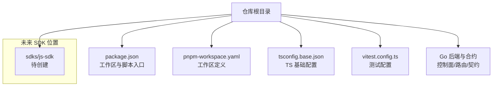
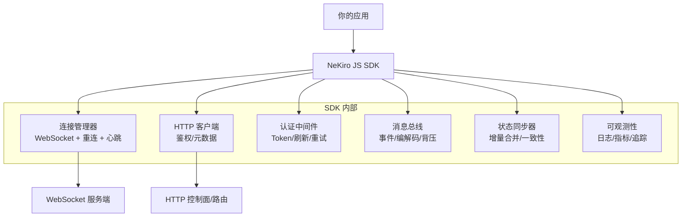
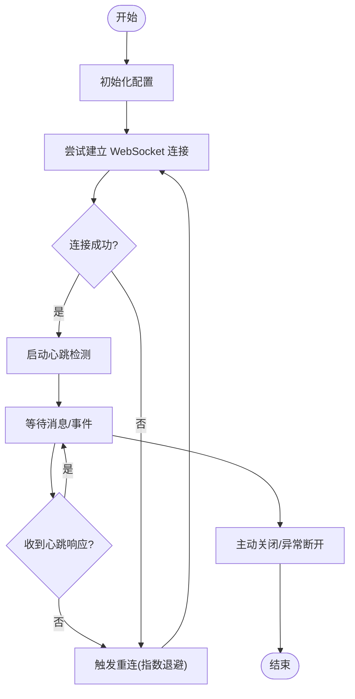
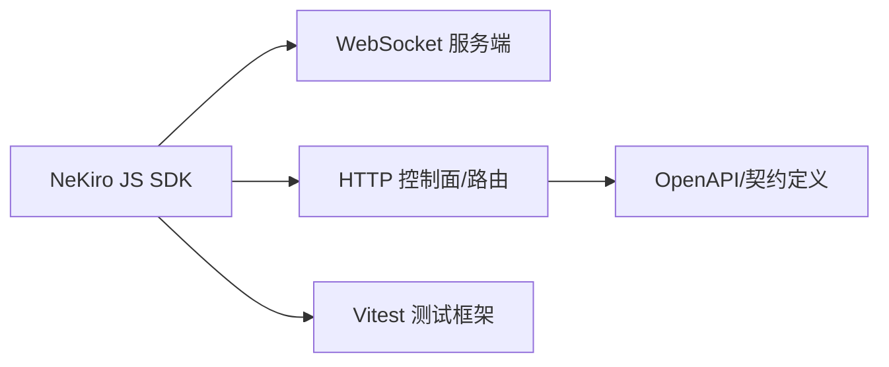

# JavaScript SDK

<cite>
**本文引用的文件**   
- [README.md](file://README.md)
- [package.json](file://package.json)
- [pnpm-workspace.yaml](file://pnpm-workspace.yaml)
- [tsconfig.base.json](file://tsconfig.base.json)
- [vitest.config.ts](file://vitest.config.ts)
- [go.mod](file://go.mod)
</cite>

## 目录
1. [简介](#简介)
2. [项目结构](#项目结构)
3. [核心组件](#核心组件)
4. [架构总览](#架构总览)
5. [详细组件分析](#详细组件分析)
6. [依赖分析](#依赖分析)
7. [性能考虑](#性能考虑)
8. [故障排查指南](#故障排查指南)
9. [结论](#结论)
10. [附录](#附录)

## 简介
本文件为 NeKiro JavaScript SDK 的开发文档，面向在浏览器与 Node.js 环境中集成和使用的开发者。文档涵盖安装方式、包管理器配置、模块导入、环境差异、客户端初始化（WebSocket/HTTP/认证）、核心 API 使用范式（实时通信、消息传递、状态同步）、异步模式与错误处理、连接管理与重连/心跳、跨域与安全限制、调试与性能监控、以及 TypeScript 类型支持等主题。

说明：当前仓库未包含已发布的 JavaScript SDK 源码或 npm 包清单，因此本文档以“待实现”的视角提供完整的开发规范与最佳实践建议，便于后续落地实施与验收。

## 项目结构
仓库采用多语言多应用组织方式，JavaScript SDK 尚未出现在现有目录结构中。建议在顶层新增独立子包以承载 SDK 源码与测试，例如 sdks/js-sdk。当前仓库中与前端/JS 生态相关的配置文件包括 package.json、pnpm-workspace.yaml、tsconfig.base.json 与 vitest.config.ts，可用于统一工作区与构建/测试配置。

图表来源
- [package.json:1-200](file://package.json#L1-L200)
- [pnpm-workspace.yaml:1-200](file://pnpm-workspace.yaml#L1-L200)
- [tsconfig.base.json:1-200](file://tsconfig.base.json#L1-L200)
- [vitest.config.ts:1-200](file://vitest.config.ts#L1-L200)

章节来源
- [README.md:1-200](file://README.md#L1-L200)
- [package.json:1-200](file://package.json#L1-L200)
- [pnpm-workspace.yaml:1-200](file://pnpm-workspace.yaml#L1-L200)
- [tsconfig.base.json:1-200](file://tsconfig.base.json#L1-L200)
- [vitest.config.ts:1-200](file://vitest.config.ts#L1-L200)

## 核心组件
以下为 JavaScript SDK 应提供的核心能力与职责划分（待实现）：
- 连接管理：封装 WebSocket 生命周期、自动重连、心跳检测、断线恢复。
- HTTP 客户端：用于鉴权、元数据拉取、任务查询等非实时接口。
- 认证中间件：注入 Token、刷新令牌、重试策略。
- 消息总线：事件订阅/发布、消息编解码、去抖/节流、背压控制。
- 状态同步：基于增量更新的状态机，保证最终一致性。
- 类型系统：TypeScript 声明文件与运行时校验。
- 可观测性：日志、指标、追踪 ID 透传。

章节来源
- [README.md:1-200](file://README.md#L1-L200)

## 架构总览
SDK 作为客户端侧库，向上暴露简洁 API，向下适配不同运行时的网络栈与认证机制。

图表来源
- [README.md:1-200](file://README.md#L1-L200)

## 详细组件分析

### 安装与导入
- 包管理器
  - npm: 通过 npm install 安装 SDK 包。
  - yarn: 通过 yarn add 安装 SDK 包。
  - pnpm: 通过 pnpm add 安装 SDK 包。
- 工作区配置
  - 若使用 pnpm workspace，可在 pnpm-workspace.yaml 中声明本地 SDK 路径以便联调。
- 模块导入
  - ES Module 风格：import { ... } from "@nekiro/sdk"
  - CommonJS 风格：const { ... } = require("@nekiro/sdk")
- 版本与兼容性
  - 建议锁定主版本号，配合语义化版本管理；在 CI 中验证最小支持的 Node.js 与浏览器版本。

章节来源
- [package.json:1-200](file://package.json#L1-L200)
- [pnpm-workspace.yaml:1-200](file://pnpm-workspace.yaml#L1-L200)

### 环境差异（浏览器 vs Node.js）
- 浏览器
  - 原生 WebSocket 可用；注意同源策略与 CORS。
  - 资源体积敏感，需按需引入与 Tree-shaking。
  - 避免使用 Node-only API（如 fs、net）。
- Node.js
  - 可使用 Node WebSocket 实现或第三方库。
  - 支持更多系统级能力（进程、文件系统），但应避免在 SDK 内直接耦合。
- 运行时检测
  - SDK 应在启动时检测运行环境并选择对应实现，对外保持统一 API。

章节来源
- [README.md:1-200](file://README.md#L1-L200)

### 客户端初始化配置
- 必要参数
  - 服务端地址（ws/wss 与 http/https）
  - 工作空间/租户标识
  - 认证凭据（Token/密钥）
  - 超时与重试策略
- 可选参数
  - 心跳间隔、最大重连次数、指数退避策略
  - 日志级别、采样率
  - 自定义 HTTP 代理/UA
- 初始化流程
  - 创建实例 -> 加载配置 -> 建立 HTTP 鉴权 -> 建立 WebSocket -> 订阅默认通道 -> 就绪回调

章节来源
- [README.md:1-200](file://README.md#L1-L200)

### 核心 API 使用范式
- 实时通信
  - 建立连接后，订阅频道/房间，接收服务端推送事件。
- 消息传递
  - 发送结构化消息，携带上下文与追踪 ID；支持确认回执与幂等键。
- 状态同步
  - 基于增量补丁的状态合并；冲突解决策略可配置；支持快照拉取与断点续传。
- 示例参考
  - 请参见各 API 的单元测试与集成测试用例，以了解典型用法与边界条件。

章节来源
- [README.md:1-200](file://README.md#L1-L200)

### 异步模式与错误处理
- Promise 与 async/await
  - 所有 I/O 操作返回 Promise；推荐在业务层使用 async/await 提升可读性。
- 错误边界
  - 区分网络错误、认证失败、协议错误、业务错误；提供统一错误对象与分类码。
- 资源清理
  - 显式关闭连接、释放监听器、取消定时器；在页面卸载或服务退出时执行。

章节来源
- [README.md:1-200](file://README.md#L1-L200)

### WebSockets 连接管理、重连与心跳
- 连接管理
  - 单例连接池，按目标地址复用；支持多路复用与优先级队列。
- 重连机制
  - 指数退避 + 抖动；最大重试上限；可配置快速失败开关。
- 心跳检测
  - 双向心跳（ping/pong）；超时判定与自动重连；心跳失败计数阈值。
- 流程图

图表来源
- [README.md:1-200](file://README.md#L1-L200)

章节来源
- [README.md:1-200](file://README.md#L1-L200)

### 安全与跨域（CORS）
- 浏览器限制
  - 跨站请求限制、Cookie/SameSite 策略、混合内容（http vs https）。
- CORS 配置
  - 服务端需允许 SDK 域名、方法与头；必要时启用凭证模式。
- 认证传输
  - 优先使用 HTTPS/WSS；Token 置于安全头部或握手参数；避免 URL 明文泄露。
- 防重放与签名
  - 对关键请求增加时间戳与签名；服务端校验有效期与签名。

章节来源
- [README.md:1-200](file://README.md#L1-L200)

### 开发工具、调试与性能监控
- 调试技巧
  - 开启详细日志；记录追踪 ID；捕获异常堆栈；模拟弱网与延迟。
- 性能监控
  - 上报连接耗时、首帧时间、消息吞吐、丢包率、重连次数。
- 工具链
  - 使用 Vitest 进行单元/集成测试；结合覆盖率报告定位热点。

章节来源
- [vitest.config.ts:1-200](file://vitest.config.ts#L1-L200)
- [README.md:1-200](file://README.md#L1-L200)

### TypeScript 支持与类型定义
- 类型声明
  - 提供 .d.ts 或内置 TS 源；确保导出类型完整且与运行时一致。
- 配置建议
  - 继承 tsconfig.base.json 的基础选项；严格模式开启；路径映射与工作区引用。
- 类型校验
  - 在边界处进行运行时校验（Zod/自定义校验器），保障向后兼容。

章节来源
- [tsconfig.base.json:1-200](file://tsconfig.base.json#L1-L200)
- [README.md:1-200](file://README.md#L1-L200)

## 依赖分析
- 外部依赖
  - 运行时：Node.js 与主流浏览器。
  - 网络：WebSocket、Fetch/XMLHttpRequest。
  - 测试：Vitest。
- 内部依赖
  - 与 Go 后端服务（控制面/路由）通过 HTTP/WebSocket 交互，遵循 OpenAPI/契约定义。
- 依赖图

图表来源
- [go.mod:1-200](file://go.mod#L1-L200)
- [vitest.config.ts:1-200](file://vitest.config.ts#L1-L200)

章节来源
- [go.mod:1-200](file://go.mod#L1-L200)
- [vitest.config.ts:1-200](file://vitest.config.ts#L1-L200)

## 性能考虑
- 连接复用与池化：减少握手开销，降低 CPU/内存占用。
- 消息批处理与压缩：批量发送、二进制编码、按需解压。
- 背压与限流：消费者端限速，防止 UI 卡顿。
- 增量同步：仅传输变更，减少带宽与解析成本。
- 资源回收：及时移除监听器与定时器，避免内存泄漏。

[本节为通用指导，不直接分析具体文件]

## 故障排查指南
- 常见问题
  - 连接频繁断开：检查心跳超时、服务器负载、网络抖动。
  - 认证失败：核对 Token 有效期、刷新逻辑、CORS 设置。
  - 消息乱序/丢失：检查幂等键、ACK 机制、重放保护。
- 诊断步骤
  - 打开详细日志，收集追踪 ID。
  - 复现弱网场景，观察重连与退避行为。
  - 对比服务端日志与客户端指标，定位瓶颈。
- 回滚与降级
  - 提供只读模式与缓存兜底；在不可用时优雅降级。

章节来源
- [README.md:1-200](file://README.md#L1-L200)

## 结论
本文提供了 NeKiro JavaScript SDK 的端到端开发规范与实践建议，覆盖从安装、初始化、核心 API、异步与错误处理、连接管理、安全与跨域、到调试与性能优化等关键环节。建议在 SDK 落地时，结合本仓库的测试与契约体系，完善自动化验证与回归测试，确保质量与稳定性。

[本节为总结性内容，不直接分析具体文件]

## 附录
- 术语
  - 工作空间：多租户隔离的业务单元。
  - 追踪 ID：贯穿请求链路的全局唯一标识。
  - 幂等键：用于避免重复处理的请求标识。
- 参考
  - 工作区与测试配置见 pnpm-workspace.yaml 与 vitest.config.ts。
  - 后端服务与契约定义见 go.mod 与相关合约文件。

章节来源
- [pnpm-workspace.yaml:1-200](file://pnpm-workspace.yaml#L1-L200)
- [vitest.config.ts:1-200](file://vitest.config.ts#L1-L200)
- [go.mod:1-200](file://go.mod#L1-L200)