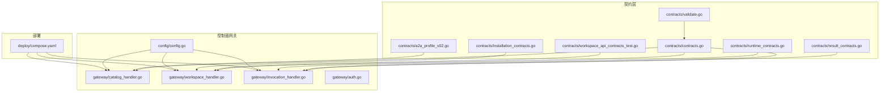
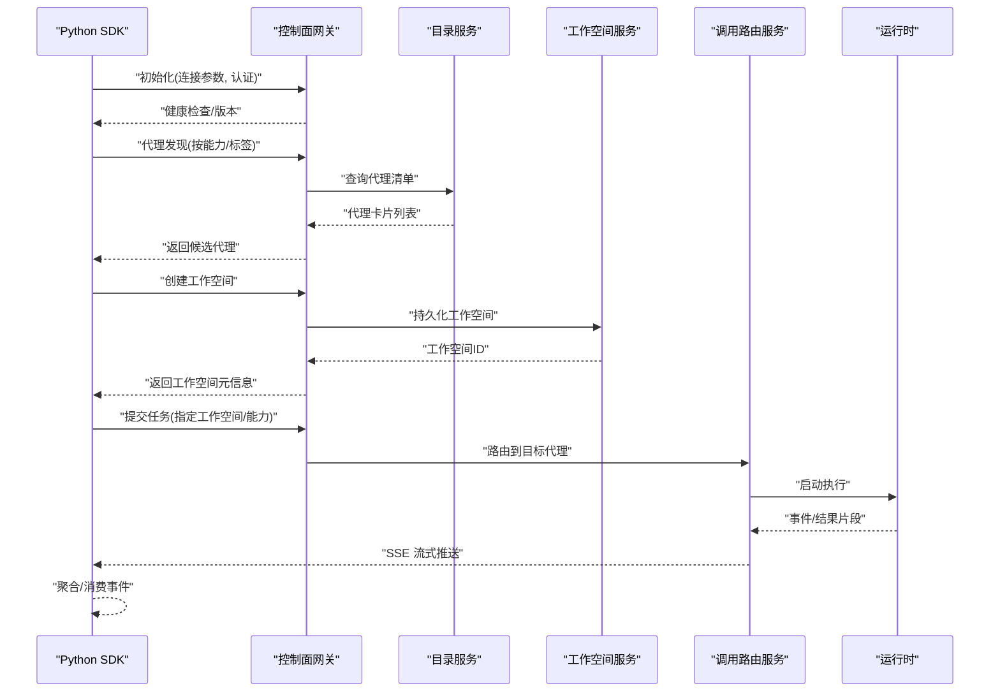
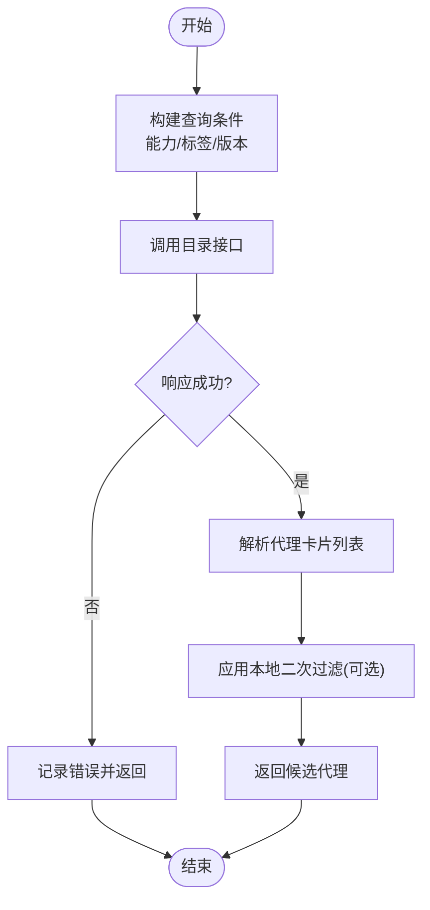
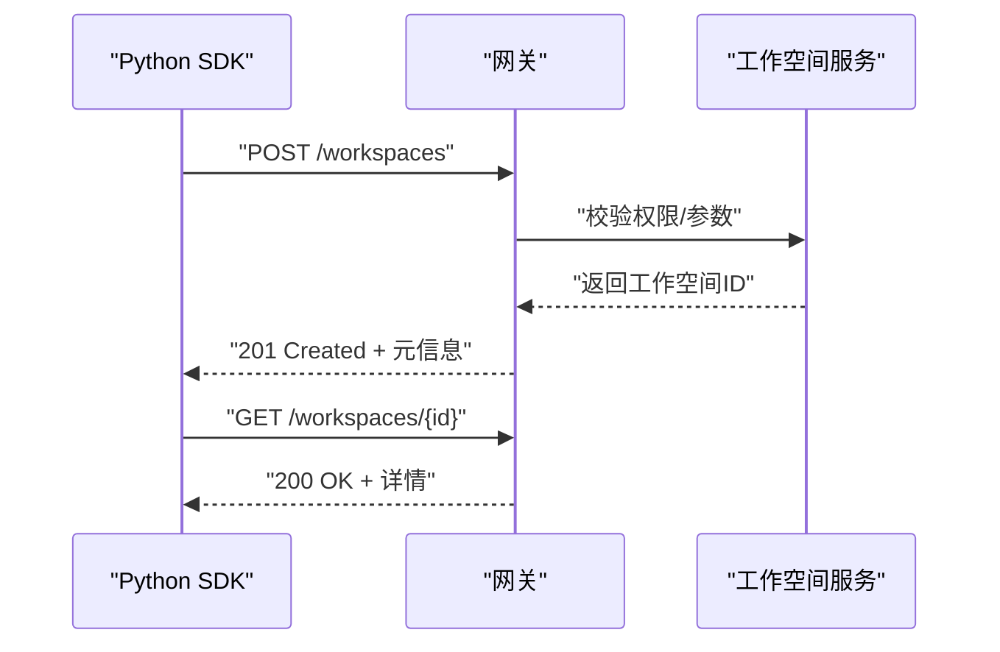
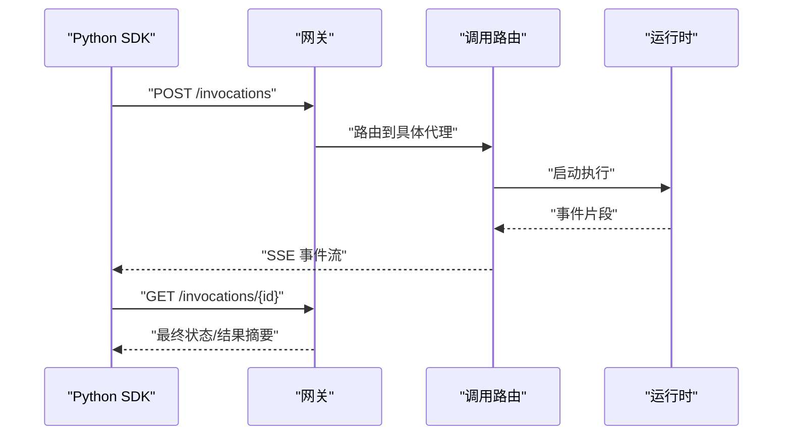
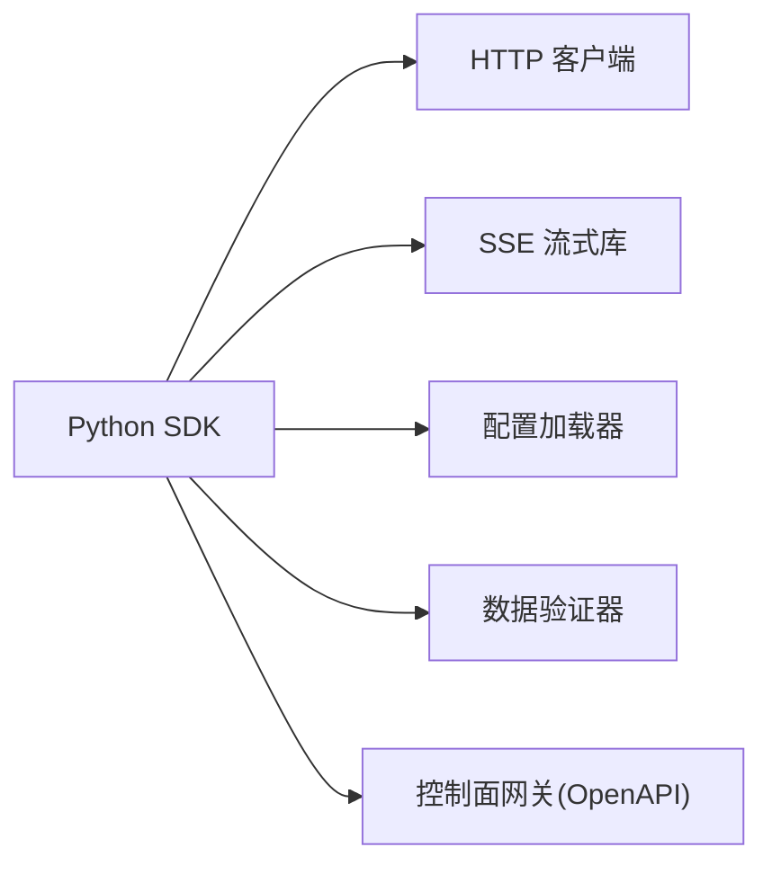

# Python SDK

<cite>
**本文引用的文件**   
- [README.md](file://README.md)
- [go.mod](file://go.mod)
- [contracts/contracts.go](file://contracts/contracts.go)
- [contracts/workspace_api_contracts_test.go](file://contracts/workspace_api_contracts_test.go)
- [contracts/result_contracts.go](file://contracts/result_contracts.go)
- [contracts/runtime_contracts.go](file://contracts/runtime_contracts.go)
- [contracts/a2a_profile_v02.go](file://contracts/a2a_profile_v02.go)
- [contracts/installation_contracts.go](file://contracts/installation_contracts.go)
- [contracts/validate.go](file://contracts/validate.go)
- [apps/control-plane/internal/gateway/catalog_handler.go](file://apps/control-plane/internal/gateway/catalog_handler.go)
- [apps/control-plane/internal/gateway/workspace_handler.go](file://apps/control-plane/internal/gateway/workspace_handler.go)
- [apps/control-plane/internal/gateway/invocation_handler.go](file://apps/control-plane/internal/gateway/invocation_handler.go)
- [apps/control-plane/internal/gateway/auth.go](file://apps/control-plane/internal/gateway/auth.go)
- [apps/control-plane/internal/config/config.go](file://apps/control-plane/internal/config/config.go)
- [deploy/compose.yaml](file://deploy/compose.yaml)
</cite>

## 目录
1. [简介](#简介)
2. [项目结构](#项目结构)
3. [核心组件](#核心组件)
4. [架构总览](#架构总览)
5. [详细组件分析](#详细组件分析)
6. [依赖分析](#依赖分析)
7. [性能考虑](#性能考虑)
8. [故障排查指南](#故障排查指南)
9. [结论](#结论)
10. [附录](#附录)

## 简介
本文件为 NeKiro Python SDK 的开发文档，面向希望在 Python 中集成 NeKiro 平台的开发者。内容涵盖安装与虚拟环境、客户端初始化（连接参数、认证与会话）、核心 API（代理发现、工作空间操作、任务调度）、异步与并发、流式数据与事件驱动、配置与环境变量、调试与日志、异常处理最佳实践、类型提示与数据验证序列化等主题。

说明：当前仓库以 Go 后端与契约定义为主，未包含 Python SDK 源码。本文基于仓库中的 OpenAPI 契约、控制面网关处理器与配置进行推导，给出 Python SDK 的推荐设计与使用方式，并在需要处引用实际契约与实现文件作为依据。

## 项目结构
仓库采用多模块组织，关键与 SDK 相关的部分包括：
- contracts：平台契约（OpenAPI、JSON Schema、语义规则），定义了代理卡、A2A Profile、工作空间、调用结果、运行时契约等。
- apps/control-plane：控制面服务，提供网关层（catalog、workspace、invocation）与配置管理。
- deploy：部署编排（Compose）。
- docs/specs：规范与数据模型说明。

图表来源
- [contracts/contracts.go](file://contracts/contracts.go)
- [contracts/workspace_api_contracts_test.go](file://contracts/workspace_api_contracts_test.go)
- [contracts/result_contracts.go](file://contracts/result_contracts.go)
- [contracts/runtime_contracts.go](file://contracts/runtime_contracts.go)
- [contracts/a2a_profile_v02.go](file://contracts/a2a_profile_v02.go)
- [contracts/installation_contracts.go](file://contracts/installation_contracts.go)
- [contracts/validate.go](file://contracts/validate.go)
- [apps/control-plane/internal/gateway/catalog_handler.go](file://apps/control-plane/internal/gateway/catalog_handler.go)
- [apps/control-plane/internal/gateway/workspace_handler.go](file://apps/control-plane/internal/gateway/workspace_handler.go)
- [apps/control-plane/internal/gateway/invocation_handler.go](file://apps/control-plane/internal/gateway/invocation_handler.go)
- [apps/control-plane/internal/gateway/auth.go](file://apps/control-plane/internal/gateway/auth.go)
- [apps/control-plane/internal/config/config.go](file://apps/control-plane/internal/config/config.go)
- [deploy/compose.yaml](file://deploy/compose.yaml)

章节来源
- [README.md](file://README.md)
- [go.mod](file://go.mod)

## 核心组件
- 代理发现（Catalog）：通过网关暴露的目录接口查询可用代理能力与端点信息，供 SDK 路由选择。
- 工作空间（Workspace）：创建、读取、列举工作空间，用于隔离资源与权限边界。
- 任务调度（Invocation）：提交调用请求、获取状态、取消任务、订阅结果流。
- 认证与会话：网关层鉴权中间件，支持令牌或会话上下文传递。
- 配置与环境：集中化配置加载，环境变量注入，便于本地与生产环境切换。

章节来源
- [apps/control-plane/internal/gateway/catalog_handler.go](file://apps/control-plane/internal/gateway/catalog_handler.go)
- [apps/control-plane/internal/gateway/workspace_handler.go](file://apps/control-plane/internal/gateway/workspace_handler.go)
- [apps/control-plane/internal/gateway/invocation_handler.go](file://apps/control-plane/internal/gateway/invocation_handler.go)
- [apps/control-plane/internal/gateway/auth.go](file://apps/control-plane/internal/gateway/auth.go)
- [apps/control-plane/internal/config/config.go](file://apps/control-plane/internal/config/config.go)

## 架构总览
Python SDK 作为客户端，通过 HTTP/JSON 与控制面网关交互；在长时任务场景下，SDK 可订阅 SSE 流式结果。

图表来源
- [apps/control-plane/internal/gateway/catalog_handler.go](file://apps/control-plane/internal/gateway/catalog_handler.go)
- [apps/control-plane/internal/gateway/workspace_handler.go](file://apps/control-plane/internal/gateway/workspace_handler.go)
- [apps/control-plane/internal/gateway/invocation_handler.go](file://apps/control-plane/internal/gateway/invocation_handler.go)
- [contracts/contracts.go](file://contracts/contracts.go)
- [contracts/result_contracts.go](file://contracts/result_contracts.go)
- [contracts/runtime_contracts.go](file://contracts/runtime_contracts.go)

## 详细组件分析

### 安装与虚拟环境
- 推荐使用 pip 安装 SDK 包（待发布后）。
- 使用 venv 或 conda 创建隔离环境，避免依赖冲突。
- 建议固定依赖版本，结合 requirements.txt 或 pyproject.toml 管理。

章节来源
- [README.md](file://README.md)

### 客户端初始化与配置
- 连接参数：基础 URL、超时、重试策略、TLS 证书路径。
- 认证配置：Bearer Token、API Key 或会话 Cookie；建议在环境变量中注入。
- 会话管理：自动刷新令牌、失败重试、指数退避。
- 配置优先级：代码默认 < 配置文件 < 环境变量 < 运行时注入。

章节来源
- [apps/control-plane/internal/config/config.go](file://apps/control-plane/internal/config/config.go)
- [apps/control-plane/internal/gateway/auth.go](file://apps/control-plane/internal/gateway/auth.go)

### 代理发现（Catalog）
- 目的：根据能力、标签、版本筛选可用代理。
- 输入：过滤条件（能力名、标签键值对、版本范围）。
- 输出：代理卡片集合（含端点、协议、能力描述）。
- 错误：无匹配、网络错误、权限不足。

图表来源
- [apps/control-plane/internal/gateway/catalog_handler.go](file://apps/control-plane/internal/gateway/catalog_handler.go)
- [contracts/a2a_profile_v02.go](file://contracts/a2a_profile_v02.go)

章节来源
- [apps/control-plane/internal/gateway/catalog_handler.go](file://apps/control-plane/internal/gateway/catalog_handler.go)
- [contracts/a2a_profile_v02.go](file://contracts/a2a_profile_v02.go)

### 工作空间操作（Workspace）
- 典型操作：创建、读取、列举、删除（若开放）。
- 作用域：所有后续任务与工作区绑定，实现资源隔离与权限控制。
- 幂等性：创建接口建议支持幂等键。

图表来源
- [apps/control-plane/internal/gateway/workspace_handler.go](file://apps/control-plane/internal/gateway/workspace_handler.go)
- [contracts/workspace_api_contracts_test.go](file://contracts/workspace_api_contracts_test.go)

章节来源
- [apps/control-plane/internal/gateway/workspace_handler.go](file://apps/control-plane/internal/gateway/workspace_handler.go)
- [contracts/workspace_api_contracts_test.go](file://contracts/workspace_api_contracts_test.go)

### 任务调度（Invocation）
- 提交流程：指定工作空间、目标代理、输入参数、回调或订阅端点。
- 状态查询：轮询或事件通知。
- 取消任务：支持可取消的任务。
- 结果流：SSE 推送分片结果，SDK 负责合并与去重。

图表来源
- [apps/control-plane/internal/gateway/invocation_handler.go](file://apps/control-plane/internal/gateway/invocation_handler.go)
- [contracts/result_contracts.go](file://contracts/result_contracts.go)
- [contracts/runtime_contracts.go](file://contracts/runtime_contracts.go)

章节来源
- [apps/control-plane/internal/gateway/invocation_handler.go](file://apps/control-plane/internal/gateway/invocation_handler.go)
- [contracts/result_contracts.go](file://contracts/result_contracts.go)
- [contracts/runtime_contracts.go](file://contracts/runtime_contracts.go)

### 认证与会话
- 认证方式：网关鉴权中间件统一拦截，支持多种凭据来源。
- 会话管理：SDK 侧维护令牌缓存、自动续期、失败重试。
- 安全建议：最小权限原则、令牌短期有效、敏感信息不进日志。

章节来源
- [apps/control-plane/internal/gateway/auth.go](file://apps/control-plane/internal/gateway/auth.go)

### 配置管理与环境变量
- 配置项：服务端地址、超时、重试、TLS、日志级别、代理白名单等。
- 环境变量：优先于配置文件，便于容器化部署。
- 配置文件：YAML/JSON，支持多环境覆盖。

章节来源
- [apps/control-plane/internal/config/config.go](file://apps/control-plane/internal/config/config.go)
- [deploy/compose.yaml](file://deploy/compose.yaml)

### 异步编程与并发
- asyncio 支持：SDK 应提供协程版 API，避免阻塞事件循环。
- 并发策略：限制并发度、背压、队列缓冲。
- 资源清理：确保连接池关闭、流式订阅取消。

[本节为通用指导，不直接分析具体文件]

### 流式数据处理与事件驱动
- 事件模型：标准化事件结构，包含关联 ID、追踪 ID、时间戳。
- 流式消费：逐条处理、批处理、断线重连、幂等合并。
- 错误恢复：部分失败重试、死信队列（可选）。

章节来源
- [contracts/runtime_contracts.go](file://contracts/runtime_contracts.go)
- [contracts/result_contracts.go](file://contracts/result_contracts.go)

### 类型提示、数据验证与序列化
- 类型提示：为请求/响应模型提供完整类型注解。
- 数据验证：入参校验（必填、格式、范围），出参规范化。
- 序列化：兼容 JSON，必要时扩展二进制附件。

章节来源
- [contracts/validate.go](file://contracts/validate.go)
- [contracts/contracts.go](file://contracts/contracts.go)

## 依赖分析
- 外部依赖：HTTP 客户端、SSE 库、加密库（签名/校验）、配置加载器。
- 内部耦合：SDK 仅依赖网关公开契约，避免与内部实现强耦合。
- 兼容性：遵循 OpenAPI 契约版本，提供降级策略。

图表来源
- [contracts/contracts.go](file://contracts/contracts.go)
- [apps/control-plane/internal/gateway/catalog_handler.go](file://apps/control-plane/internal/gateway/catalog_handler.go)
- [apps/control-plane/internal/gateway/workspace_handler.go](file://apps/control-plane/internal/gateway/workspace_handler.go)
- [apps/control-plane/internal/gateway/invocation_handler.go](file://apps/control-plane/internal/gateway/invocation_handler.go)

章节来源
- [contracts/contracts.go](file://contracts/contracts.go)

## 性能考虑
- 连接复用：启用连接池与 Keep-Alive。
- 超时与重试：合理设置超时、最大重试次数与退避策略。
- 流式优化：增量处理、内存水位控制、背压机制。
- 并发控制：限制并发度，避免雪崩。

[本节为通用指导，不直接分析具体文件]

## 故障排查指南
- 常见问题：
  - 连接失败：检查基础 URL、网络连通性与 TLS 配置。
  - 认证失败：确认令牌有效性与作用域。
  - 代理不可用：重新发现代理、检查能力匹配。
  - 任务失败：查看事件流与错误码，定位运行时问题。
- 日志与调试：
  - 开启 SDK 调试日志，记录请求/响应摘要与耗时。
  - 使用追踪 ID 串联跨服务链路。
- 错误分类：
  - 客户端错误（参数/权限）与服务端错误（内部异常）分别处理。
  - 可重试与不可重试错误区分。

章节来源
- [apps/control-plane/internal/gateway/auth.go](file://apps/control-plane/internal/gateway/auth.go)
- [contracts/contracts.go](file://contracts/contracts.go)

## 结论
本文基于仓库中的契约与网关实现，给出了 Python SDK 的设计要点与使用建议。建议在实际开发中严格遵循 OpenAPI 契约，完善类型提示与数据验证，提供异步与流式能力，并通过配置与环境变量实现灵活部署。

[本节为总结性内容，不直接分析具体文件]

## 附录
- 快速开始（概念流程）：
  - 初始化客户端（连接参数、认证）
  - 发现代理
  - 创建工作空间
  - 提交任务并订阅结果流
  - 查询任务状态与最终结果
- 参考文件：
  - 契约入口与校验：[contracts/contracts.go](file://contracts/contracts.go)、[contracts/validate.go](file://contracts/validate.go)
  - 工作空间契约测试：[contracts/workspace_api_contracts_test.go](file://contracts/workspace_api_contracts_test.go)
  - 结果与运行时契约：[contracts/result_contracts.go](file://contracts/result_contracts.go)、[contracts/runtime_contracts.go](file://contracts/runtime_contracts.go)
  - A2A Profile：[contracts/a2a_profile_v02.go](file://contracts/a2a_profile_v02.go)
  - 安装相关契约：[contracts/installation_contracts.go](file://contracts/installation_contracts.go)
  - 网关实现：[apps/control-plane/internal/gateway/catalog_handler.go](file://apps/control-plane/internal/gateway/catalog_handler.go)、[apps/control-plane/internal/gateway/workspace_handler.go](file://apps/control-plane/internal/gateway/workspace_handler.go)、[apps/control-plane/internal/gateway/invocation_handler.go](file://apps/control-plane/internal/gateway/invocation_handler.go)、[apps/control-plane/internal/gateway/auth.go](file://apps/control-plane/internal/gateway/auth.go)
  - 配置与部署：[apps/control-plane/internal/config/config.go](file://apps/control-plane/internal/config/config.go)、[deploy/compose.yaml](file://deploy/compose.yaml)