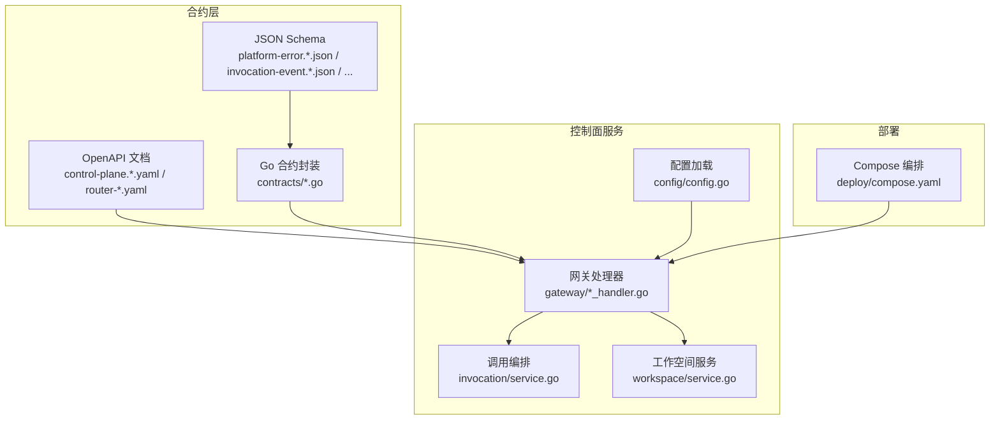
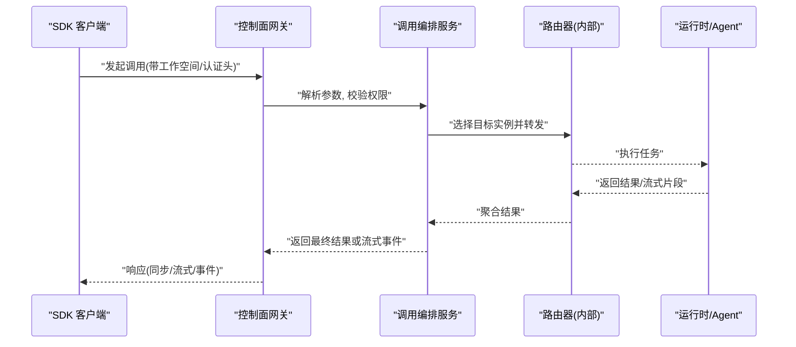
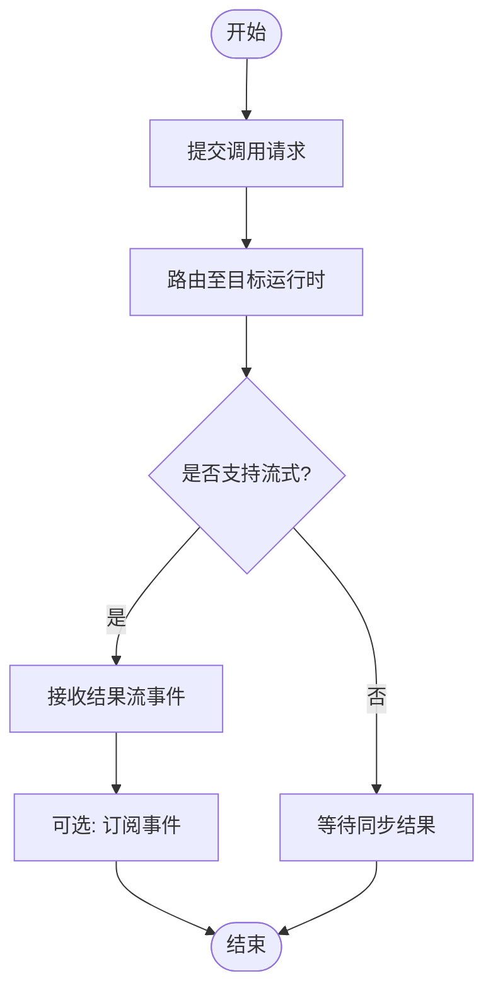
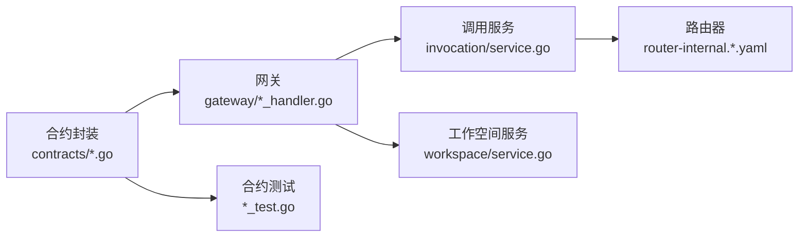

# SDK 开发

<cite>
**本文引用的文件**   
- [README.md](file://README.md)
- [go.mod](file://go.mod)
- [package.json](file://package.json)
- [pnpm-workspace.yaml](file://pnpm-workspace.yaml)
- [tsconfig.base.json](file://tsconfig.base.json)
- [vitest.config.ts](file://vitest.config.ts)
- [contracts/contracts.go](file://contracts/contracts.go)
- [contracts/runtime_contracts.go](file://contracts/runtime_contracts.go)
- [contracts/result_contracts.go](file://contracts/result_contracts.go)
- [contracts/workspace_api_contracts_test.go](file://contracts/workspace_api_contracts_test.go)
- [contracts/catalo g_api_contracts_test.go](file://contracts/catalog_api_contracts_test.go)
- [contracts/a2a_profile_v02.go](file://contracts/a2a_profile_v02.go)
- [contracts/a2a_profile_conformance_test.go](file://contracts/a2a_profile_conformance_test.go)
- [contracts/installation_contracts.go](file://contracts/installation_contracts.go)
- [contracts/runtime_contracts_validation.go](file://contracts/runtime_contracts_validation.go)
- [contracts/active_contracts_integration_test.go](file://contracts/active_contracts_integration_test.go)
- [contracts/validate.go](file://contracts/validate.go)
- [openapi/control-plane.v1.yaml](file://contracts/openapi/control-plane.v1.yaml)
- [openapi/control-plane.v2.yaml](file://contracts/openapi/control-plane.v2.yaml)
- [openapi/control-plane.v3.yaml](file://contracts/openapi/control-plane.v3.yaml)
- [openapi/control-plane-invocation.v4.yaml](file://contracts/openapi/control-plane-invocation.v4.yaml)
- [openapi/router-agent.v1.yaml](file://contracts/openapi/router-agent.v1.yaml)
- [openapi/router-internal.v1.yaml](file://contracts/openapi/router-internal.v1.yaml)
- [openapi/router-internal.v2.yaml](file://contracts/openapi/router-internal.v2.yaml)
- [openapi/router-internal.v3.yaml](file://contracts/openapi/router-internal.v3.yaml)
- [schemas/platform-error.v1.schema.json](file://contracts/schemas/platform-error.v1.schema.json)
- [schemas/platform-error.v2.schema.json](file://contracts/schemas/platform-error.v2.schema.json)
- [schemas/platform-error.v3.schema.json](file://contracts/schemas/platform-error.v3.schema.json)
- [schemas/platform-error.v4.schema.json](file://contracts/schemas/platform-error.v4.schema.json)
- [schemas/common.v1.schema.json](file://contracts/schemas/common.v1.schema.json)
- [schemas/workspace.v1.schema.json](file://contracts/schemas/workspace.v1.schema.json)
- [schemas/invocation-event.v0.1.schema.json](file://contracts/schemas/invocation-event.v0.1.schema.json)
- [schemas/invocation-event.v0.2.schema.json](file://contracts/schemas/invocation-event.v0.2.schema.json)
- [schemas/invocation-event.v0.3.schema.json](file://contracts/schemas/invocation-event.v0.3.schema.json)
- [schemas/invocation-result-stream-event.v1.schema.json](file://contracts/schemas/invocation-result-stream-event.v1.schema.json)
- [schemas/invocation-result-stream-event.v2.schema.json](file://contracts/schemas/invocation-result-stream-event.v2.schema.json)
- [schemas/a2a-profile.v0.2.schema.json](file://contracts/schemas/a2a-profile.v0.2.schema.json)
- [schemas/a2a-profile.v0.3.0.schema.json](file://contracts/schemas/a2a-profile.v0.3.0.schema.json)
- [schemas/agent-card.v0.1.schema.json](file://contracts/schemas/agent-card.v0.1.schema.json)
- [schemas/agent-card.v0.2.schema.json](file://contracts/schemas/agent-card.v0.2.schema.json)
- [schemas/installation.v1.schema.json](file://contracts/schemas/installation.v1.schema.json)
- [schemas/installation.v2.schema.json](file://contracts/schemas/installation.v2.schema.json)
- [apps/control-plane/internal/gateway/auth.go](file://apps/control-plane/internal/gateway/auth.go)
- [apps/control-plane/internal/gateway/errors.go](file://apps/control-plane/internal/gateway/errors.go)
- [apps/control-plane/internal/gateway/invocation_handler.go](file://apps/control-plane/internal/gateway/invocation_handler.go)
- [apps/control-plane/internal/gateway/workspace_handler.go](file://apps/control-plane/internal/gateway/workspace_handler.go)
- [apps/control-plane/internal/gateway/catalog_handler.go](file://apps/control-plane/internal/gateway/catalog_handler.go)
- [apps/control-plane/internal/invocation/service.go](file://apps/control-plane/internal/invocation/service.go)
- [apps/control-plane/internal/invocation/router_client.go](file://apps/control-plane/internal/invocation/router_client.go)
- [apps/control-plane/internal/workspace/service.go](file://apps/control-plane/internal/workspace/service.go)
- [apps/control-plane/internal/config/config.go](file://apps/control-plane/internal/config/config.go)
- [deploy/compose.yaml](file://deploy/compose.yaml)
</cite>

## 目录
1. [简介](#简介)
2. [项目结构](#项目结构)
3. [核心组件](#核心组件)
4. [架构总览](#架构总览)
5. [详细组件分析](#详细组件分析)
6. [依赖分析](#依赖分析)
7. [性能考虑](#性能考虑)
8. [故障排查指南](#故障排查指南)
9. [结论](#结论)
10. [附录](#附录)

## 简介
本指南面向在 NeKiro 平台上进行客户端集成的开发者，覆盖 Go、Python、JavaScript 三类 SDK 的安装与配置、连接建立、认证、错误处理、API 调用示例（代理注册、工作空间管理、调用路由）、异步调用、流式响应、事件订阅、配置项与环境变量、调试与日志、性能优化与最佳实践、版本兼容性与升级路径。

NeKiro 平台通过控制面网关暴露 REST/JSON-RPC 接口，提供能力目录发现、工作空间生命周期管理、调用路由与结果投递等能力；同时定义 A2A Profile、Agent Card、Invocation Event、Result Stream 等契约，确保多语言 SDK 的一致行为。

## 项目结构
仓库采用“合约优先”的组织方式：OpenAPI/Swagger 与 JSON Schema 位于 contracts 目录，后端服务位于 apps/control-plane，部署编排位于 deploy，前端与工具链配置位于根目录的 package.json、pnpm-workspace.yaml、tsconfig.base.json、vitest.config.ts 等。SDK 代码尚未在本仓库中实现，但可通过 OpenAPI 与 Schema 生成对应语言的客户端。

图表来源
- [openapi/control-plane.v1.yaml](file://contracts/openapi/control-plane.v1.yaml)
- [openapi/control-plane.v2.yaml](file://contracts/openapi/control-plane.v2.yaml)
- [openapi/control-plane.v3.yaml](file://contracts/openapi/control-plane.v3.yaml)
- [openapi/control-plane-invocation.v4.yaml](file://contracts/openapi/control-plane-invocation.v4.yaml)
- [openapi/router-agent.v1.yaml](file://contracts/openapi/router-agent.v1.yaml)
- [openapi/router-internal.v1.yaml](file://contracts/openapi/router-internal.v1.yaml)
- [openapi/router-internal.v2.yaml](file://contracts/openapi/router-internal.v2.yaml)
- [openapi/router-internal.v3.yaml](file://contracts/openapi/router-internal.v3.yaml)
- [schemas/platform-error.v1.schema.json](file://contracts/schemas/platform-error.v1.schema.json)
- [schemas/platform-error.v2.schema.json](file://contracts/schemas/platform-error.v2.schema.json)
- [schemas/platform-error.v3.schema.json](file://contracts/schemas/platform-error.v3.schema.json)
- [schemas/platform-error.v4.schema.json](file://contracts/schemas/platform-error.v4.schema.json)
- [schemas/invocation-event.v0.1.schema.json](file://contracts/schemas/invocation-event.v0.1.schema.json)
- [schemas/invocation-event.v0.2.schema.json](file://contracts/schemas/invocation-event.v0.2.schema.json)
- [schemas/invocation-event.v0.3.schema.json](file://contracts/schemas/invocation-event.v0.3.schema.json)
- [schemas/invocation-result-stream-event.v1.schema.json](file://contracts/schemas/invocation-result-stream-event.v1.schema.json)
- [schemas/invocation-result-stream-event.v2.schema.json](file://contracts/schemas/invocation-result-stream-event.v2.schema.json)
- [apps/control-plane/internal/gateway/invocation_handler.go](file://apps/control-plane/internal/gateway/invocation_handler.go)
- [apps/control-plane/internal/gateway/workspace_handler.go](file://apps/control-plane/internal/gateway/workspace_handler.go)
- [apps/control-plane/internal/invocation/service.go](file://apps/control-plane/internal/invocation/service.go)
- [apps/control-plane/internal/workspace/service.go](file://apps/control-plane/internal/workspace/service.go)
- [apps/control-plane/internal/config/config.go](file://apps/control-plane/internal/config/config.go)
- [deploy/compose.yaml](file://deploy/compose.yaml)

章节来源
- [README.md](file://README.md)
- [go.mod](file://go.mod)
- [package.json](file://package.json)
- [pnpm-workspace.yaml](file://pnpm-workspace.yaml)
- [tsconfig.base.json](file://tsconfig.base.json)
- [vitest.config.ts](file://vitest.config.ts)

## 核心组件
- 合约与校验
  - OpenAPI 描述控制面与路由器内部 API，用于跨语言 SDK 的代码生成与契约测试。
  - JSON Schema 定义平台错误、工作空间、调用事件、结果流、A2A Profile、Agent Card 等数据结构。
  - Go 侧对合约进行了封装与验证逻辑，便于服务端与测试使用。
- 控制面网关
  - 认证中间件负责鉴权上下文注入。
  - 工作空间处理器提供工作空间的创建、读取等能力。
  - 调用处理器负责将调用请求路由到具体运行时并返回同步或流式结果。
  - 目录处理器提供能力目录查询与发现。
- 调用编排
  - 根据工作空间策略与路由表选择目标 Agent 实例，发起调用并聚合结果。
- 配置
  - 集中加载环境变量与配置文件，驱动网关、数据库、路由器等组件。

章节来源
- [contracts/contracts.go](file://contracts/contracts.go)
- [contracts/runtime_contracts.go](file://contracts/runtime_contracts.go)
- [contracts/result_contracts.go](file://contracts/result_contracts.go)
- [contracts/workspace_api_contracts_test.go](file://contracts/workspace_api_contracts_test.go)
- [contracts/catalog_api_contracts_test.go](file://contracts/catalog_api_contracts_test.go)
- [contracts/a2a_profile_v02.go](file://contracts/a2a_profile_v02.go)
- [contracts/a2a_profile_conformance_test.go](file://contracts/a2a_profile_conformance_test.go)
- [contracts/installation_contracts.go](file://contracts/installation_contracts.go)
- [contracts/runtime_contracts_validation.go](file://contracts/runtime_contracts_validation.go)
- [contracts/active_contracts_integration_test.go](file://contracts/active_contracts_integration_test.go)
- [contracts/validate.go](file://contracts/validate.go)
- [apps/control-plane/internal/gateway/auth.go](file://apps/control-plane/internal/gateway/auth.go)
- [apps/control-plane/internal/gateway/workspace_handler.go](file://apps/control-plane/internal/gateway/workspace_handler.go)
- [apps/control-plane/internal/gateway/invocation_handler.go](file://apps/control-plane/internal/gateway/invocation_handler.go)
- [apps/control-plane/internal/gateway/catalog_handler.go](file://apps/control-plane/internal/gateway/catalog_handler.go)
- [apps/control-plane/internal/invocation/service.go](file://apps/control-plane/internal/invocation/service.go)
- [apps/control-plane/internal/workspace/service.go](file://apps/control-plane/internal/workspace/service.go)
- [apps/control-plane/internal/config/config.go](file://apps/control-plane/internal/config/config.go)

## 架构总览
下图展示了从客户端 SDK 到控制面网关、调用编排与路由器的整体交互流程，包括同步调用、流式结果与事件订阅。

图表来源
- [apps/control-plane/internal/gateway/invocation_handler.go](file://apps/control-plane/internal/gateway/invocation_handler.go)
- [apps/control-plane/internal/invocation/service.go](file://apps/control-plane/internal/invocation/service.go)
- [openapi/control-plane-invocation.v4.yaml](file://contracts/openapi/control-plane-invocation.v4.yaml)
- [openapi/router-internal.v1.yaml](file://contracts/openapi/router-internal.v1.yaml)
- [openapi/router-internal.v2.yaml](file://contracts/openapi/router-internal.v2.yaml)
- [openapi/router-internal.v3.yaml](file://contracts/openapi/router-internal.v3.yaml)

## 详细组件分析

### 安装与初始化（Go/Python/JS）
- 通用步骤
  - 准备运行环境：Go 工具链、Node.js 与 pnpm、Python 3.x。
  - 克隆仓库并进入工程根目录。
  - 使用包管理器安装依赖：
    - Go：通过 go.mod 管理依赖。
    - JS：通过 package.json 与 pnpm-workspace.yaml 管理。
  - 本地启动控制面服务以便联调（见部署部分）。
- 生成客户端代码
  - 基于 OpenAPI 与 JSON Schema 为各语言生成类型化客户端，确保字段一致与校验规则生效。
- 基本初始化
  - 设置基础 URL（控制面地址）、工作空间标识、认证凭据（如 Token/密钥）。
  - 启用重试与超时策略，配置日志级别。

章节来源
- [go.mod](file://go.mod)
- [package.json](file://package.json)
- [pnpm-workspace.yaml](file://pnpm-workspace.yaml)
- [tsconfig.base.json](file://tsconfig.base.json)
- [vitest.config.ts](file://vitest.config.ts)

### 连接建立与认证配置
- 连接建立
  - 客户端与服务端建立 HTTPS 连接，设置 TLS 证书与域名校验。
  - 配置连接池大小、最大空闲连接数、连接超时与读写超时。
- 认证配置
  - 网关认证中间件会校验请求中的认证信息（例如 Authorization 头），并在上下文中注入用户/租户信息。
  - 建议为每个工作空间分配独立凭据，避免跨工作空间越权访问。
- 会话与会话续期
  - 若使用令牌机制，需实现自动刷新与失败重试逻辑。

章节来源
- [apps/control-plane/internal/gateway/auth.go](file://apps/control-plane/internal/gateway/auth.go)

### 错误处理机制
- 统一错误模型
  - 平台错误通过 platform-error.*.schema.json 定义，包含错误码、消息、关联 ID 等字段，便于客户端统一处理。
- 网关错误
  - 网关层将业务异常转换为标准错误响应，包含 trace_id 便于追踪。
- 客户端策略
  - 区分可重试错误（网络抖动、限流）与不可重试错误（参数非法、权限不足）。
  - 指数退避与熔断策略，结合幂等键避免重复提交。

章节来源
- [schemas/platform-error.v1.schema.json](file://contracts/schemas/platform-error.v1.schema.json)
- [schemas/platform-error.v2.schema.json](file://contracts/schemas/platform-error.v2.schema.json)
- [schemas/platform-error.v3.schema.json](file://contracts/schemas/platform-error.v3.schema.json)
- [schemas/platform-error.v4.schema.json](file://contracts/schemas/platform-error.v4.schema.json)
- [apps/control-plane/internal/gateway/errors.go](file://apps/control-plane/internal/gateway/errors.go)

### API 调用示例（代理注册、工作空间管理、调用路由）
- 代理注册
  - 通过目录相关接口注册/更新 Agent 能力卡片，供路由发现。
  - 参考目录 API 契约与测试用例以了解请求/响应结构与约束。
- 工作空间管理
  - 创建工作空间、查询工作空间详情、列出已安装能力等。
  - 工作空间 API 契约与测试用例定义了资源命名、权限策略与状态机。
- 调用路由
  - 向控制面发起调用，指定工作空间、能力标识与输入参数。
  - 支持同步返回与流式结果，详见调用契约与事件/结果流 Schema。

章节来源
- [contracts/catalog_api_contracts_test.go](file://contracts/catalog_api_contracts_test.go)
- [contracts/workspace_api_contracts_test.go](file://contracts/workspace_api_contracts_test.go)
- [openapi/control-plane.v1.yaml](file://contracts/openapi/control-plane.v1.yaml)
- [openapi/control-plane.v2.yaml](file://contracts/openapi/control-plane.v2.yaml)
- [openapi/control-plane.v3.yaml](file://contracts/openapi/control-plane.v3.yaml)
- [openapi/control-plane-invocation.v4.yaml](file://contracts/openapi/control-plane-invocation.v4.yaml)
- [openapi/router-agent.v1.yaml](file://contracts/openapi/router-agent.v1.yaml)

### 异步调用、流式响应与事件订阅
- 异步调用
  - 通过调用接口提交任务，返回任务 ID，后续通过任务查询接口获取状态。
- 流式响应
  - 使用结果流事件 Schema 定义分片数据与元数据，客户端按序消费。
- 事件订阅
  - 基于 Invocation Event Schema 的事件模型，客户端可订阅任务生命周期事件（开始、进度、完成、失败）。

图表来源
- [schemas/invocation-event.v0.1.schema.json](file://contracts/schemas/invocation-event.v0.1.schema.json)
- [schemas/invocation-event.v0.2.schema.json](file://contracts/schemas/invocation-event.v0.2.schema.json)
- [schemas/invocation-event.v0.3.schema.json](file://contracts/schemas/invocation-event.v0.3.schema.json)
- [schemas/invocation-result-stream-event.v1.schema.json](file://contracts/schemas/invocation-result-stream-event.v1.schema.json)
- [schemas/invocation-result-stream-event.v2.schema.json](file://contracts/schemas/invocation-result-stream-event.v2.schema.json)
- [openapi/control-plane-invocation.v4.yaml](file://contracts/openapi/control-plane-invocation.v4.yaml)

### 配置选项与环境变量
- 关键配置项
  - 控制面地址、端口、TLS 开关、证书路径。
  - 工作空间默认值、重试次数、超时时间、并发度。
  - 日志级别、输出格式、采样率。
- 环境变量
  - 通过 config/config.go 加载环境变量，覆盖默认配置。
  - 建议在部署时通过 compose 或容器编排注入敏感信息。

章节来源
- [apps/control-plane/internal/config/config.go](file://apps/control-plane/internal/config/config.go)
- [deploy/compose.yaml](file://deploy/compose.yaml)

### 调试工具与日志配置
- 日志
  - 在服务端开启结构化日志，记录 trace_id、工作空间、调用 ID、耗时与错误堆栈。
  - 客户端打印请求/响应摘要与错误上下文，避免泄露敏感数据。
- 调试
  - 使用 OpenAPI 文档与本地 Mock 服务进行联调。
  - 利用合约测试与一致性检查快速定位问题。

章节来源
- [apps/control-plane/internal/gateway/trace.go](file://apps/control-plane/internal/gateway/trace.go)
- [contracts/active_contracts_integration_test.go](file://contracts/active_contracts_integration_test.go)

### 性能优化与最佳实践
- 连接复用
  - 启用 HTTP 连接池，合理设置最大空闲连接与存活时间。
- 超时与重试
  - 为不同操作设置差异化超时；对幂等操作启用指数退避重试。
- 批处理与分页
  - 批量注册/更新能力卡片，减少往返开销；列表接口使用游标分页。
- 流式优先
  - 长任务优先使用流式结果，降低内存占用与首字节延迟。
- 缓存
  - 对只读能力目录与工作空间元数据进行短期缓存，注意失效策略。

[本节为通用指导，不直接分析具体文件]

### 版本兼容性与升级指南
- 合约演进
  - OpenAPI 与 Schema 采用版本号管理，新增字段应向后兼容，删除字段需废弃周期。
- 客户端升级
  - 优先升级至最新稳定版 SDK，关注 breaking changes 与弃用警告。
  - 在灰度环境中验证兼容性后再全量发布。
- 服务端升级
  - 保持旧版本 API 并行可用，逐步迁移客户端。

章节来源
- [openapi/control-plane.v1.yaml](file://contracts/openapi/control-plane.v1.yaml)
- [openapi/control-plane.v2.yaml](file://contracts/openapi/control-plane.v2.yaml)
- [openapi/control-plane.v3.yaml](file://contracts/openapi/control-plane.v3.yaml)
- [openapi/control-plane-invocation.v4.yaml](file://contracts/openapi/control-plane-invocation.v4.yaml)
- [schemas/platform-error.v1.schema.json](file://contracts/schemas/platform-error.v1.schema.json)
- [schemas/platform-error.v2.schema.json](file://contracts/schemas/platform-error.v2.schema.json)
- [schemas/platform-error.v3.schema.json](file://contracts/schemas/platform-error.v3.schema.json)
- [schemas/platform-error.v4.schema.json](file://contracts/schemas/platform-error.v4.schema.json)

## 依赖分析
- 模块耦合
  - 网关层依赖认证、工作空间与调用服务；调用服务依赖路由器与运行时。
  - 合约层被服务端与测试共同引用，保证契约一致性。
- 外部依赖
  - 数据库持久化（工作空间与目录存储）、消息通道（事件与流）。
- 潜在循环依赖
  - 通过分层与接口抽象避免循环导入，确保可测试性。

图表来源
- [contracts/contracts.go](file://contracts/contracts.go)
- [contracts/runtime_contracts.go](file://contracts/runtime_contracts.go)
- [contracts/result_contracts.go](file://contracts/result_contracts.go)
- [apps/control-plane/internal/gateway/invocation_handler.go](file://apps/control-plane/internal/gateway/invocation_handler.go)
- [apps/control-plane/internal/gateway/workspace_handler.go](file://apps/control-plane/internal/gateway/workspace_handler.go)
- [apps/control-plane/internal/invocation/service.go](file://apps/control-plane/internal/invocation/service.go)
- [openapi/router-internal.v1.yaml](file://contracts/openapi/router-internal.v1.yaml)
- [openapi/router-internal.v2.yaml](file://contracts/openapi/router-internal.v2.yaml)
- [openapi/router-internal.v3.yaml](file://contracts/openapi/router-internal.v3.yaml)

章节来源
- [contracts/contracts.go](file://contracts/contracts.go)
- [contracts/runtime_contracts.go](file://contracts/runtime_contracts.go)
- [contracts/result_contracts.go](file://contracts/result_contracts.go)
- [apps/control-plane/internal/gateway/invocation_handler.go](file://apps/control-plane/internal/gateway/invocation_handler.go)
- [apps/control-plane/internal/gateway/workspace_handler.go](file://apps/control-plane/internal/gateway/workspace_handler.go)
- [apps/control-plane/internal/invocation/service.go](file://apps/control-plane/internal/invocation/service.go)

## 性能考虑
- 客户端侧
  - 合理设置并发度与队列长度，避免背压导致内存膨胀。
  - 使用流式接口处理大数据集，减少一次性加载。
- 服务端侧
  - 网关层增加限流与熔断保护，防止雪崩。
  - 调用编排层引入缓存与预取策略，缩短冷启动延迟。
- 网络与序列化
  - 启用压缩与高效序列化协议（如 Protobuf）以降低带宽占用。

[本节为通用指导，不直接分析具体文件]

## 故障排查指南
- 常见问题
  - 认证失败：检查授权头格式与有效期，确认工作空间权限。
  - 路由失败：核对能力卡片与路由策略，确认运行时健康状态。
  - 流式中断：检查网络稳定性与心跳保活配置。
- 诊断手段
  - 查看服务端日志中的 trace_id 与错误堆栈。
  - 使用合约测试与 OpenAPI 文档复现问题。
  - 抓取请求/响应报文，比对 Schema 校验结果。

章节来源
- [apps/control-plane/internal/gateway/errors.go](file://apps/control-plane/internal/gateway/errors.go)
- [apps/control-plane/internal/gateway/auth.go](file://apps/control-plane/internal/gateway/auth.go)
- [contracts/active_contracts_integration_test.go](file://contracts/active_contracts_integration_test.go)

## 结论
NeKiro 平台通过严格的合约与清晰的架构，为多语言 SDK 提供了稳定的集成基础。遵循本指南的配置与最佳实践，可实现高可靠、高性能的客户端集成，并平滑应对版本演进与生产运维挑战。

## 附录
- 快速启动
  - 使用 Compose 启动控制面服务，打开 OpenAPI 文档进行本地联调。
- 参考契约
  - 工作空间、调用、事件、结果流、A2A Profile、Agent Card 等 Schema 与 OpenAPI 文档。

章节来源
- [deploy/compose.yaml](file://deploy/compose.yaml)
- [openapi/control-plane.v1.yaml](file://contracts/openapi/control-plane.v1.yaml)
- [openapi/control-plane.v2.yaml](file://contracts/openapi/control-plane.v2.yaml)
- [openapi/control-plane.v3.yaml](file://contracts/openapi/control-plane.v3.yaml)
- [openapi/control-plane-invocation.v4.yaml](file://contracts/openapi/control-plane-invocation.v4.yaml)
- [openapi/router-agent.v1.yaml](file://contracts/openapi/router-agent.v1.yaml)
- [openapi/router-internal.v1.yaml](file://contracts/openapi/router-internal.v1.yaml)
- [openapi/router-internal.v2.yaml](file://contracts/openapi/router-internal.v2.yaml)
- [openapi/router-internal.v3.yaml](file://contracts/openapi/router-internal.v3.yaml)
- [schemas/workspace.v1.schema.json](file://contracts/schemas/workspace.v1.schema.json)
- [schemas/invocation-event.v0.1.schema.json](file://contracts/schemas/invocation-event.v0.1.schema.json)
- [schemas/invocation-event.v0.2.schema.json](file://contracts/schemas/invocation-event.v0.2.schema.json)
- [schemas/invocation-event.v0.3.schema.json](file://contracts/schemas/invocation-event.v0.3.schema.json)
- [schemas/invocation-result-stream-event.v1.schema.json](file://contracts/schemas/invocation-result-stream-event.v1.schema.json)
- [schemas/invocation-result-stream-event.v2.schema.json](file://contracts/schemas/invocation-result-stream-event.v2.schema.json)
- [schemas/a2a-profile.v0.2.schema.json](file://contracts/schemas/a2a-profile.v0.2.schema.json)
- [schemas/a2a-profile.v0.3.0.schema.json](file://contracts/schemas/a2a-profile.v0.3.0.schema.json)
- [schemas/agent-card.v0.1.schema.json](file://contracts/schemas/agent-card.v0.1.schema.json)
- [schemas/agent-card.v0.2.schema.json](file://contracts/schemas/agent-card.v0.2.schema.json)
- [schemas/installation.v1.schema.json](file://contracts/schemas/installation.v1.schema.json)
- [schemas/installation.v2.schema.json](file://contracts/schemas/installation.v2.schema.json)