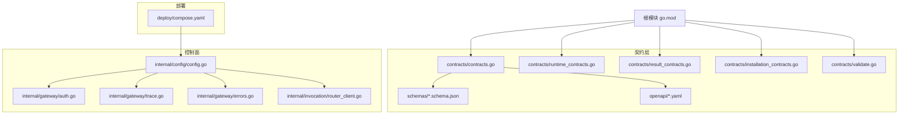
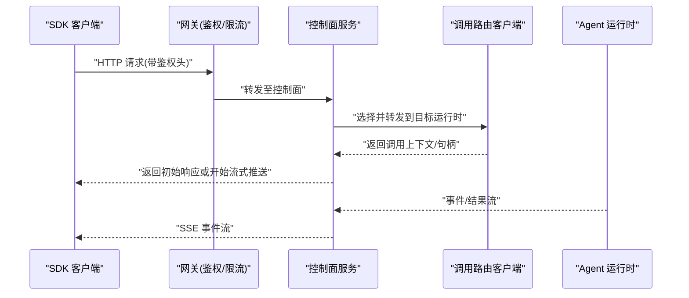
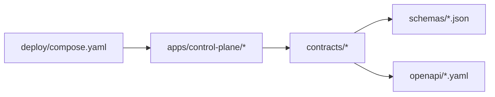

# SDK 通用概念

<cite>
**本文引用的文件**   
- [README.md](file://README.md)
- [go.mod](file://go.mod)
- [contracts/contracts.go](file://contracts/contracts.go)
- [contracts/runtime_contracts.go](file://contracts/runtime_contracts.go)
- [contracts/result_contracts.go](file://contracts/result_contracts.go)
- [contracts/installation_contracts.go](file://contracts/installation_contracts.go)
- [contracts/a2a_profile_v02.go](file://contracts/a2a_profile_v02.go)
- [contracts/active_contracts_integration_test.go](file://contracts/active_contracts_integration_test.go)
- [contracts/validate.go](file://contracts/validate.go)
- [contracts/openapi/control-plane.v1.yaml](file://contracts/openapi/control-plane.v1.yaml)
- [contracts/openapi/control-plane.v2.yaml](file://contracts/openapi/control-plane.v2.yaml)
- [contracts/openapi/control-plane.v3.yaml](file://contracts/openapi/control-plane.v4.yaml)
- [contracts/schemas/platform-error.v1.schema.json](file://contracts/schemas/platform-error.v1.schema.json)
- [contracts/schemas/platform-error.v2.schema.json](file://contracts/schemas/platform-error.v2.schema.json)
- [contracts/schemas/platform-error.v3.schema.json](file://contracts/schemas/platform-error.v3.schema.json)
- [contracts/schemas/platform-error.v4.schema.json](file://contracts/schemas/platform-error.v4.schema.json)
- [contracts/schemas/common.v1.schema.json](file://contracts/schemas/common.v1.schema.json)
- [contracts/schemas/invocation-result.v1.schema.json](file://contracts/schemas/invocation-result.v1.schema.json)
- [contracts/schemas/invocation-event.v0.1.schema.json](file://contracts/schemas/invocation-event.v0.1.schema.json)
- [contracts/schemas/invocation-event.v0.2.schema.json](file://contracts/schemas/invocation-event.v0.2.schema.json)
- [contracts/schemas/invocation-event.v0.3.schema.json](file://contracts/schemas/invocation-event.v0.3.schema.json)
- [contracts/schemas/invocation-result-stream-event.v1.schema.json](file://contracts/schemas/invocation-result-stream-event.v1.schema.json)
- [contracts/schemas/invocation-result-stream-event.v2.schema.json](file://contracts/schemas/invocation-result-stream-event.v2.schema.json)
- [contracts/schemas/workspace.v1.schema.json](file://contracts/schemas/workspace.v1.schema.json)
- [contracts/schemas/a2a-profile.v0.2.schema.json](file://contracts/schemas/a2a-profile.v0.2.schema.json)
- [contracts/schemas/a2a-profile.v0.3.0.schema.json](file://contracts/schemas/a2a-profile.v0.3.0.schema.json)
- [contracts/schemas/agent-card.v0.1.schema.json](file://contracts/schemas/agent-card.v0.1.schema.json)
- [contracts/schemas/agent-card.v0.2.schema.json](file://contracts/schemas/agent-card.v0.2.schema.json)
- [contracts/schemas/installation.v1.schema.json](file://contracts/schemas/installation.v1.schema.json)
- [contracts/schemas/installation.v2.schema.json](file://contracts/schemas/installation.v2.schema.json)
- [contracts/invocation-runtime/v1/conformance/errors.json](file://contracts/invocation-runtime/v1/conformance/errors.json)
- [contracts/invocation-runtime/v1/conformance/lifecycle.json](file://contracts/invocation-runtime/v1/conformance/lifecycle.json)
- [contracts/invocation-runtime/v1/conformance/media.json](file://contracts/invocation-runtime/v1/conformance/media.json)
- [contracts/invocation-runtime/v1/conformance/nested.json](file://contracts/invocation-runtime/v1/conformance/nested.json)
- [contracts/invocation-runtime/v1/conformance/projection.json](file://contracts/invocation-runtime/v1/conformance/projection.json)
- [contracts/invocation-runtime/v1/conformance/result-stream.json](file://contracts/invocation-runtime/v1/conformance/result-stream.json)
- [contracts/invocation/v1/conformance/event-matching-correlation.json](file://contracts/invocation/v1/conformance/event-matching-correlation.json)
- [contracts/invocation/v1/conformance/stream-matching-correlation.json](file://contracts/invocation/v1/conformance/stream-matching-correlation.json)
- [contracts/invocation/v1/conformance/event-mismatched-trace-id.json](file://contracts/invocation/v1/conformance/event-mismatched-trace-id.json)
- [contracts/invocation/v1/conformance/stream-mismatched-trace-id.json](file://contracts/invocation/v1/conformance/stream-mismatched-trace-id.json)
- [contracts/a2a-profile/v0.3.0/conformance/message-send-request.json](file://contracts/a2a-profile/v0.3.0/conformance/message-send-request.json)
- [contracts/a2a-profile/v0.3.0/conformance/message-stream-request.json](file://contracts/a2a-profile/v0.3.0/conformance/message-stream-request.json)
- [contracts/a2a-profile/v0.3.0/conformance/tasks-get-request.json](file://contracts/a2a-profile/v0.3.0/conformance/tasks-get-request.json)
- [contracts/a2a-profile/v0.3.0/conformance/tasks-cancel-request.json](file://contracts/a2a-profile/v0.3.0/conformance/tasks-cancel-request.json)
- [contracts/a2a-profile/v0.3.0/conformance/context-headers.json](file://contracts/a2a-profile/v0.3.0/conformance/context-headers.json)
- [apps/control-plane/internal/config/config.go](file://apps/control-plane/internal/config/config.go)
- [apps/control-plane/internal/gateway/auth.go](file://apps/control-plane/internal/gateway/auth.go)
- [apps/control-plane/internal/gateway/trace.go](file://apps/control-plane/internal/gateway/trace.go)
- [apps/control-plane/internal/gateway/errors.go](file://apps/control-plane/internal/gateway/errors.go)
- [apps/control-plane/internal/invocation/router_client.go](file://apps/control-plane/internal/invocation/router_client.go)
- [deploy/compose.yaml](file://deploy/compose.yaml)
</cite>

## 目录
1. [简介](#简介)
2. [项目结构](#项目结构)
3. [核心概念](#核心概念)
4. [架构总览](#架构总览)
5. [详细组件分析](#详细组件分析)
6. [依赖关系分析](#依赖关系分析)
7. [性能与资源优化](#性能与资源优化)
8. [可观测性与日志规范](#可观测性与日志规范)
9. [配置与环境变量](#配置与环境变量)
10. [版本兼容与 API 管理](#版本兼容与-api-管理)
11. [错误处理规范](#错误处理规范)
12. [调试、测试与故障排查](#调试测试与故障排查)
13. [迁移与升级指南](#迁移与升级指南)
14. [结论](#结论)

## 简介
本文件为 NeKiro 平台 SDK 的“通用概念”文档，聚焦所有语言 SDK 共享的核心设计：客户端连接模型、认证授权机制、请求响应格式、错误处理规范、统一配置项、环境变量与配置文件格式、版本兼容策略、API 版本管理与向后兼容保证、跨语言通用设计模式与最佳实践、日志标准与追踪 ID 传播、可观测性集成、缓存策略、连接池管理与资源优化技术，以及通用的调试方法、测试工具与故障排查指南。

## 项目结构
仓库采用多模块组织方式，SDK 相关契约与运行时语义集中在 contracts 目录；控制面服务位于 apps/control-plane；部署编排使用 deploy/compose.yaml；根级 go.mod 定义整体 Go 模块信息。

图表来源
- [contracts/contracts.go:1-200](file://contracts/contracts.go#L1-L200)
- [contracts/runtime_contracts.go:1-200](file://contracts/runtime_contracts.go#L1-L200)
- [contracts/result_contracts.go:1-200](file://contracts/result_contracts.go#L1-L200)
- [contracts/installation_contracts.go:1-200](file://contracts/installation_contracts.go#L1-L200)
- [contracts/validate.go:1-200](file://contracts/validate.go#L1-L200)
- [contracts/schemas/common.v1.schema.json](file://contracts/schemas/common.v1.schema.json)
- [contracts/openapi/control-plane.v1.yaml](file://contracts/openapi/control-plane.v1.yaml)
- [apps/control-plane/internal/config/config.go:1-200](file://apps/control-plane/internal/config/config.go#L1-L200)
- [apps/control-plane/internal/gateway/auth.go:1-200](file://apps/control-plane/internal/gateway/auth.go#L1-L200)
- [apps/control-plane/internal/gateway/trace.go:1-200](file://apps/control-plane/internal/gateway/trace.go#L1-L200)
- [apps/control-plane/internal/gateway/errors.go:1-200](file://apps/control-plane/internal/gateway/errors.go#L1-L200)
- [apps/control-plane/internal/invocation/router_client.go:1-200](file://apps/control-plane/internal/invocation/router_client.go#L1-L200)
- [deploy/compose.yaml:1-200](file://deploy/compose.yaml#L1-L200)

章节来源
- [README.md:1-200](file://README.md#L1-L200)
- [go.mod:1-200](file://go.mod#L1-L200)

## 核心概念
本节概述所有 SDK 共享的基础概念，包括连接模型、认证授权、请求响应格式、错误处理、配置与环境变量、版本兼容策略、可观测性与日志、缓存与连接池等。

- 客户端连接模型
  - 面向控制面的 HTTP/JSON 客户端，支持同步调用与流式结果（SSE）。
  - 通过网关路由到具体 Agent 运行时，内部由路由器客户端转发。
- 认证与授权
  - 基于网关鉴权中间件，结合工作区与能力解析进行访问控制。
- 请求与响应格式
  - 遵循 OpenAPI 与 JSON Schema 约束，包含通用字段、错误对象、事件与结果流。
- 错误处理规范
  - 统一的平台错误模型，区分业务错误与系统错误，提供标准化错误码与消息。
- 配置与环境变量
  - 控制面通过集中配置加载，支持环境变量覆盖；SDK 侧应遵循相同键名约定。
- 版本兼容与 API 管理
  - 以版本号前缀与 schema 校验保障向后兼容；新增字段需保持可选。
- 可观测性与日志
  - 全局追踪 ID 注入与透传，事件携带关联上下文，便于端到端链路追踪。
- 缓存与连接池
  - 建议对只读元数据（如 Agent 卡片）做短期缓存；HTTP 客户端复用连接池。
- 调试与测试
  - 提供一致性测试套件与契约验证，便于跨语言 SDK 对齐行为。

章节来源
- [contracts/contracts.go:1-200](file://contracts/contracts.go#L1-L200)
- [contracts/runtime_contracts.go:1-200](file://contracts/runtime_contracts.go#L1-L200)
- [contracts/result_contracts.go:1-200](file://contracts/result_contracts.go#L1-L200)
- [contracts/installation_contracts.go:1-200](file://contracts/installation_contracts.go#L1-L200)
- [contracts/validate.go:1-200](file://contracts/validate.go#L1-L200)
- [contracts/openapi/control-plane.v1.yaml](file://contracts/openapi/control-plane.v1.yaml)
- [contracts/schemas/common.v1.schema.json](file://contracts/schemas/common.v1.schema.json)
- [apps/control-plane/internal/config/config.go:1-200](file://apps/control-plane/internal/config/config.go#L1-L200)
- [apps/control-plane/internal/gateway/auth.go:1-200](file://apps/control-plane/internal/gateway/auth.go#L1-L200)
- [apps/control-plane/internal/gateway/trace.go:1-200](file://apps/control-plane/internal/gateway/trace.go#L1-L200)
- [apps/control-plane/internal/gateway/errors.go:1-200](file://apps/control-plane/internal/gateway/errors.go#L1-L200)
- [apps/control-plane/internal/invocation/router_client.go:1-200](file://apps/control-plane/internal/invocation/router_client.go#L1-L200)

## 架构总览
NeKiro 平台 SDK 主要与控制面交互，控制面负责路由、鉴权、编排与持久化。SDK 通过统一接口发起任务调用、查询工作区与安装信息等。

图表来源
- [apps/control-plane/internal/gateway/auth.go:1-200](file://apps/control-plane/internal/gateway/auth.go#L1-L200)
- [apps/control-plane/internal/invocation/router_client.go:1-200](file://apps/control-plane/internal/invocation/router_client.go#L1-L200)
- [contracts/openapi/control-plane.v1.yaml](file://contracts/openapi/control-plane.v1.yaml)

## 详细组件分析

### 客户端连接与路由
- 职责
  - 建立与控制面的稳定连接，复用底层 HTTP 连接池。
  - 在调用阶段根据能力与路由策略选择合适运行时。
- 关键流程
  - 初始化时加载配置与凭据。
  - 发起调用后获取调用上下文，后续事件通过 SSE 接收。
- 注意事项
  - 重试策略需考虑幂等性与去抖。
  - 超时与熔断参数应与后端一致。

章节来源
- [apps/control-plane/internal/invocation/router_client.go:1-200](file://apps/control-plane/internal/invocation/router_client.go#L1-L200)
- [contracts/openapi/control-plane.v1.yaml](file://contracts/openapi/control-plane.v1.yaml)

### 认证与授权
- 职责
  - 校验请求身份与权限，确保仅允许访问已授权的工作区与能力。
- 关键点
  - 鉴权头在网关层注入与校验。
  - 授权决策与工作区策略绑定。
- 建议
  - SDK 应在本地缓存最小必要令牌，避免频繁刷新。

章节来源
- [apps/control-plane/internal/gateway/auth.go:1-200](file://apps/control-plane/internal/gateway/auth.go#L1-L200)

### 追踪与上下文传播
- 职责
  - 生成并注入全局追踪 ID，贯穿请求、事件与结果流。
- 关键点
  - 事件携带 trace_id、root_task_id、correlation_id 等字段。
  - 不匹配将触发一致性校验失败。
- 建议
  - SDK 在构造请求时自动注入追踪上下文，并在日志中输出。

章节来源
- [apps/control-plane/internal/gateway/trace.go:1-200](file://apps/control-plane/internal/gateway/trace.go#L1-L200)
- [contracts/invocation/v1/conformance/event-matching-correlation.json](file://contracts/invocation/v1/conformance/event-matching-correlation.json)
- [contracts/invocation/v1/conformance/stream-matching-correlation.json](file://contracts/invocation/v1/conformance/stream-matching-correlation.json)
- [contracts/invocation/v1/conformance/event-mismatched-trace-id.json](file://contracts/invocation/v1/conformance/event-mismatched-trace-id.json)
- [contracts/invocation/v1/conformance/stream-mismatched-trace-id.json](file://contracts/invocation/v1/conformance/stream-mismatched-trace-id.json)

### 错误处理
- 职责
  - 统一错误模型，区分业务错误与系统错误，提供稳定错误码。
- 关键点
  - 平台错误对象包含 code、message、details 等字段。
  - 运行时契约定义了常见错误场景。
- 建议
  - SDK 应将平台错误映射为领域异常，保留原始错误码以便诊断。

章节来源
- [apps/control-plane/internal/gateway/errors.go:1-200](file://apps/control-plane/internal/gateway/errors.go#L1-L200)
- [contracts/schemas/platform-error.v1.schema.json](file://contracts/schemas/platform-error.v1.schema.json)
- [contracts/schemas/platform-error.v2.schema.json](file://contracts/schemas/platform-error.v2.schema.json)
- [contracts/schemas/platform-error.v3.schema.json](file://contracts/schemas/platform-error.v3.schema.json)
- [contracts/schemas/platform-error.v4.schema.json](file://contracts/schemas/platform-error.v4.schema.json)
- [contracts/invocation-runtime/v1/conformance/errors.json](file://contracts/invocation-runtime/v1/conformance/errors.json)

### 结果与事件模型
- 职责
  - 定义任务执行的结果结构与事件流格式。
- 关键点
  - 结果对象与事件对象分别有独立 schema。
  - 流式结果事件用于增量推进进度与产出。
- 建议
  - SDK 实现结果聚合器，按序合并分片结果，保证最终一致性。

章节来源
- [contracts/schemas/invocation-result.v1.schema.json](file://contracts/schemas/invocation-result.v1.schema.json)
- [contracts/schemas/invocation-event.v0.1.schema.json](file://contracts/schemas/invocation-event.v0.1.schema.json)
- [contracts/schemas/invocation-event.v0.2.schema.json](file://contracts/schemas/invocation-event.v0.2.schema.json)
- [contracts/schemas/invocation-event.v0.3.schema.json](file://contracts/schemas/invocation-event.v0.3.schema.json)
- [contracts/schemas/invocation-result-stream-event.v1.schema.json](file://contracts/schemas/invocation-result-stream-event.v1.schema.json)
- [contracts/schemas/invocation-result-stream-event.v2.schema.json](file://contracts/schemas/invocation-result-stream-event.v2.schema.json)
- [contracts/invocation-runtime/v1/conformance/result-stream.json](file://contracts/invocation-runtime/v1/conformance/result-stream.json)

### A2A 协议与 Agent 卡片
- 职责
  - 描述 Agent 能力、端点与权限，作为发现与调用的依据。
- 关键点
  - 提供 v0.2 与 v0.3.0 两个版本的 Profile 与一致性用例。
  - 支持消息发送、任务查询与取消等操作。
- 建议
  - SDK 在启动时拉取并缓存 Agent 卡片，减少重复网络开销。

章节来源
- [contracts/a2a_profile_v02.go:1-200](file://contracts/a2a_profile_v02.go#L1-L200)
- [contracts/schemas/a2a-profile.v0.2.schema.json](file://contracts/schemas/a2a-profile.v0.2.schema.json)
- [contracts/schemas/a2a-profile.v0.3.0.schema.json](file://contracts/schemas/a2a-profile.v0.3.0.schema.json)
- [contracts/a2a-profile/v0.3.0/conformance/message-send-request.json](file://contracts/a2a-profile/v0.3.0/conformance/message-send-request.json)
- [contracts/a2a-profile/v0.3.0/conformance/message-stream-request.json](file://contracts/a2a-profile/v0.3.0/conformance/message-stream-request.json)
- [contracts/a2a-profile/v0.3.0/conformance/tasks-get-request.json](file://contracts/a2a-profile/v0.3.0/conformance/tasks-get-request.json)
- [contracts/a2a-profile/v0.3.0/conformance/tasks-cancel-request.json](file://contracts/a2a-profile/v0.3.0/conformance/tasks-cancel-request.json)
- [contracts/a2a-profile/v0.3.0/conformance/context-headers.json](file://contracts/a2a-profile/v0.3.0/conformance/context-headers.json)

### 工作区与安装
- 职责
  - 管理工作区生命周期与安装状态，提供安装检查与操作接口。
- 关键点
  - 工作区与安装对象均有对应 schema 约束。
- 建议
  - SDK 提供幂等的安装与检查方法，支持断点续装。

章节来源
- [contracts/schemas/workspace.v1.schema.json](file://contracts/schemas/workspace.v1.schema.json)
- [contracts/schemas/installation.v1.schema.json](file://contracts/schemas/installation.v1.schema.json)
- [contracts/schemas/installation.v2.schema.json](file://contracts/schemas/installation.v2.schema.json)
- [contracts/installation_contracts.go:1-200](file://contracts/installation_contracts.go#L1-L200)

### 运行时契约与一致性
- 职责
  - 定义运行时与平台之间的契约，包括错误、生命周期、媒体、嵌套调用、投影与结果流。
- 关键点
  - 一致性测试用例覆盖边界条件与异常路径。
- 建议
  - SDK 在单元测试中引入一致性测试集，确保行为对齐。

章节来源
- [contracts/runtime_contracts.go:1-200](file://contracts/runtime_contracts.go#L1-L200)
- [contracts/invocation-runtime/v1/conformance/lifecycle.json](file://contracts/invocation-runtime/v1/conformance/lifecycle.json)
- [contracts/invocation-runtime/v1/conformance/media.json](file://contracts/invocation-runtime/v1/conformance/media.json)
- [contracts/invocation-runtime/v1/conformance/nested.json](file://contracts/invocation-runtime/v1/conformance/nested.json)
- [contracts/invocation-runtime/v1/conformance/projection.json](file://contracts/invocation-runtime/v1/conformance/projection.json)
- [contracts/invocation-runtime/v1/conformance/result-stream.json](file://contracts/invocation-runtime/v1/conformance/result-stream.json)

## 依赖关系分析
- 模块耦合
  - contracts 层被各语言 SDK 共同引用，是跨语言契约的唯一事实来源。
  - 控制面内部模块之间通过清晰接口解耦，网关、配置、路由与错误处理分层明确。
- 外部依赖
  - OpenAPI 与 JSON Schema 驱动代码生成与校验，降低契约漂移风险。
- 潜在循环
  - 当前结构无直接循环依赖；若扩展新模块，应保持单向依赖。

图表来源
- [contracts/contracts.go:1-200](file://contracts/contracts.go#L1-L200)
- [contracts/validate.go:1-200](file://contracts/validate.go#L1-L200)
- [contracts/openapi/control-plane.v1.yaml](file://contracts/openapi/control-plane.v1.yaml)
- [apps/control-plane/internal/config/config.go:1-200](file://apps/control-plane/internal/config/config.go#L1-L200)
- [deploy/compose.yaml:1-200](file://deploy/compose.yaml#L1-L200)

章节来源
- [go.mod:1-200](file://go.mod#L1-L200)

## 性能与资源优化
- 连接池
  - 复用 HTTP 连接，合理设置最大空闲连接与连接存活时间。
- 缓存策略
  - 对只读元数据（Agent 卡片、工作区信息）实施短 TTL 缓存。
- 流式处理
  - 优先使用 SSE 流式结果，降低大对象传输延迟。
- 重试与退避
  - 针对瞬时错误采用指数退避与抖动，避免雪崩。
- 背压与限流
  - 客户端侧限制并发度，服务端侧配合网关限流保护。

[本节为通用指导，无需特定文件来源]

## 可观测性与日志规范
- 日志级别
  - 建议采用标准级别：DEBUG、INFO、WARN、ERROR。
- 结构化日志
  - 每条日志包含 request_id、trace_id、workspace_id、task_id 等关键字段。
- 追踪 ID 传播
  - 请求进入网关时生成 trace_id，随事件与结果流传递。
- 指标上报
  - 暴露关键指标：QPS、延迟分布、错误率、连接池利用率。

章节来源
- [apps/control-plane/internal/gateway/trace.go:1-200](file://apps/control-plane/internal/gateway/trace.go#L1-L200)
- [contracts/invocation/v1/conformance/event-matching-correlation.json](file://contracts/invocation/v1/conformance/event-matching-correlation.json)
- [contracts/invocation/v1/conformance/stream-matching-correlation.json](file://contracts/invocation/v1/conformance/stream-matching-correlation.json)

## 配置与环境变量
- 配置加载
  - 控制面从集中配置源加载，支持环境变量覆盖。
- SDK 配置项
  - 基础地址、超时、重试次数、连接池大小、缓存 TTL、鉴权凭据等。
- 环境变量命名
  - 建议采用大写加下划线风格，如 NEKIRO_BASE_URL、NEKIRO_TIMEOUT_MS。
- 配置文件格式
  - 推荐 YAML/JSON，与 OpenAPI/Schemas 保持一致的键名。

章节来源
- [apps/control-plane/internal/config/config.go:1-200](file://apps/control-plane/internal/config/config.go#L1-L200)
- [deploy/compose.yaml:1-200](file://deploy/compose.yaml#L1-L200)

## 版本兼容与 API 管理
- 版本策略
  - 主版本变更可能破坏兼容；次版本增加向后兼容特性；补丁版本修复缺陷。
- API 版本化
  - URL 前缀或 Header 指定版本，OpenAPI 文件按版本维护。
- Schema 演进
  - 新增字段必须可选，默认值需明确；删除字段需废弃周期。
- 一致性测试
  - 通过 conformance 用例验证行为一致性。

章节来源
- [contracts/openapi/control-plane.v1.yaml](file://contracts/openapi/control-plane.v1.yaml)
- [contracts/openapi/control-plane.v2.yaml](file://contracts/openapi/control-plane.v2.yaml)
- [contracts/openapi/control-plane.v3.yaml](file://contracts/openapi/control-plane.v3.yaml)
- [contracts/openapi/control-plane.v4.yaml](file://contracts/openapi/control-plane.v4.yaml)
- [contracts/active_contracts_integration_test.go:1-200](file://contracts/active_contracts_integration_test.go#L1-L200)

## 错误处理规范
- 错误模型
  - 平台错误对象包含 code、message、details 等字段，便于客户端分类处理。
- 错误分类
  - 客户端错误（4xx）、服务端错误（5xx）、业务错误（自定义码）。
- 重试策略
  - 仅对幂等且瞬时错误的请求进行重试。
- 诊断信息
  - 错误详情中包含 trace_id、request_id 等定位信息。

章节来源
- [apps/control-plane/internal/gateway/errors.go:1-200](file://apps/control-plane/internal/gateway/errors.go#L1-L200)
- [contracts/schemas/platform-error.v1.schema.json](file://contracts/schemas/platform-error.v1.schema.json)
- [contracts/schemas/platform-error.v2.schema.json](file://contracts/schemas/platform-error.v2.schema.json)
- [contracts/schemas/platform-error.v3.schema.json](file://contracts/schemas/platform-error.v3.schema.json)
- [contracts/schemas/platform-error.v4.schema.json](file://contracts/schemas/platform-error.v4.schema.json)
- [contracts/invocation-runtime/v1/conformance/errors.json](file://contracts/invocation-runtime/v1/conformance/errors.json)

## 调试、测试与故障排查
- 调试方法
  - 启用 DEBUG 日志，记录完整请求/响应与追踪上下文。
  - 使用本地 compose 环境快速复现问题。
- 测试工具
  - 运行一致性测试套件，覆盖事件匹配、流式结果、错误场景。
- 常见问题
  - 鉴权失败：检查鉴权头与工作区权限。
  - 追踪 ID 不匹配：确认事件与请求上下文是否一致。
  - 流式中断：检查网络稳定性与超时配置。

章节来源
- [contracts/active_contracts_integration_test.go:1-200](file://contracts/active_contracts_integration_test.go#L1-L200)
- [contracts/invocation/v1/conformance/event-mismatched-trace-id.json](file://contracts/invocation/v1/conformance/event-mismatched-trace-id.json)
- [contracts/invocation/v1/conformance/stream-mismatched-trace-id.json](file://contracts/invocation/v1/conformance/stream-mismatched-trace-id.json)
- [deploy/compose.yaml:1-200](file://deploy/compose.yaml#L1-L200)

## 迁移与升级指南
- 升级步骤
  - 先升级 SDK，再升级服务端；逐步切换 API 版本。
- 兼容性检查
  - 运行一致性测试，确保行为未退化。
- 回滚策略
  - 保留旧版本 SDK 与服务端并行运行，灰度切换。
- 注意事项
  - 关注弃用字段与行为变更，更新配置与错误处理逻辑。

章节来源
- [contracts/active_contracts_integration_test.go:1-200](file://contracts/active_contracts_integration_test.go#L1-L200)
- [contracts/openapi/control-plane.v1.yaml](file://contracts/openapi/control-plane.v1.yaml)
- [contracts/openapi/control-plane.v2.yaml](file://contracts/openapi/control-plane.v2.yaml)
- [contracts/openapi/control-plane.v3.yaml](file://contracts/openapi/control-plane.v3.yaml)
- [contracts/openapi/control-plane.v4.yaml](file://contracts/openapi/control-plane.v4.yaml)

## 结论
本通用概念文档总结了 NeKiro 平台 SDK 在所有语言中的共享设计与实践。通过统一的连接模型、认证授权、请求响应格式、错误处理、配置与环境变量、版本兼容策略、可观测性与日志规范、缓存与连接池优化，以及完善的调试与测试方法，SDK 能够在多语言环境中保持一致的行为与体验。建议在实现中严格遵循契约与一致性测试，确保长期稳定与可演进。