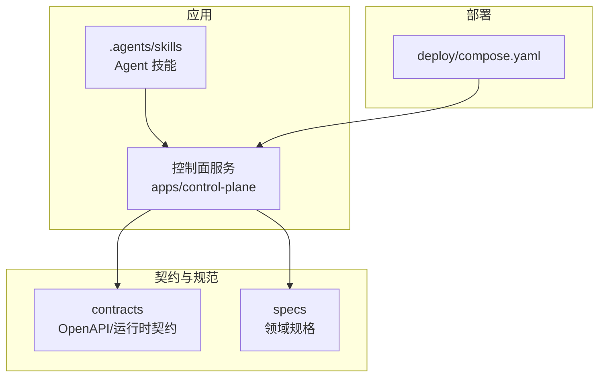
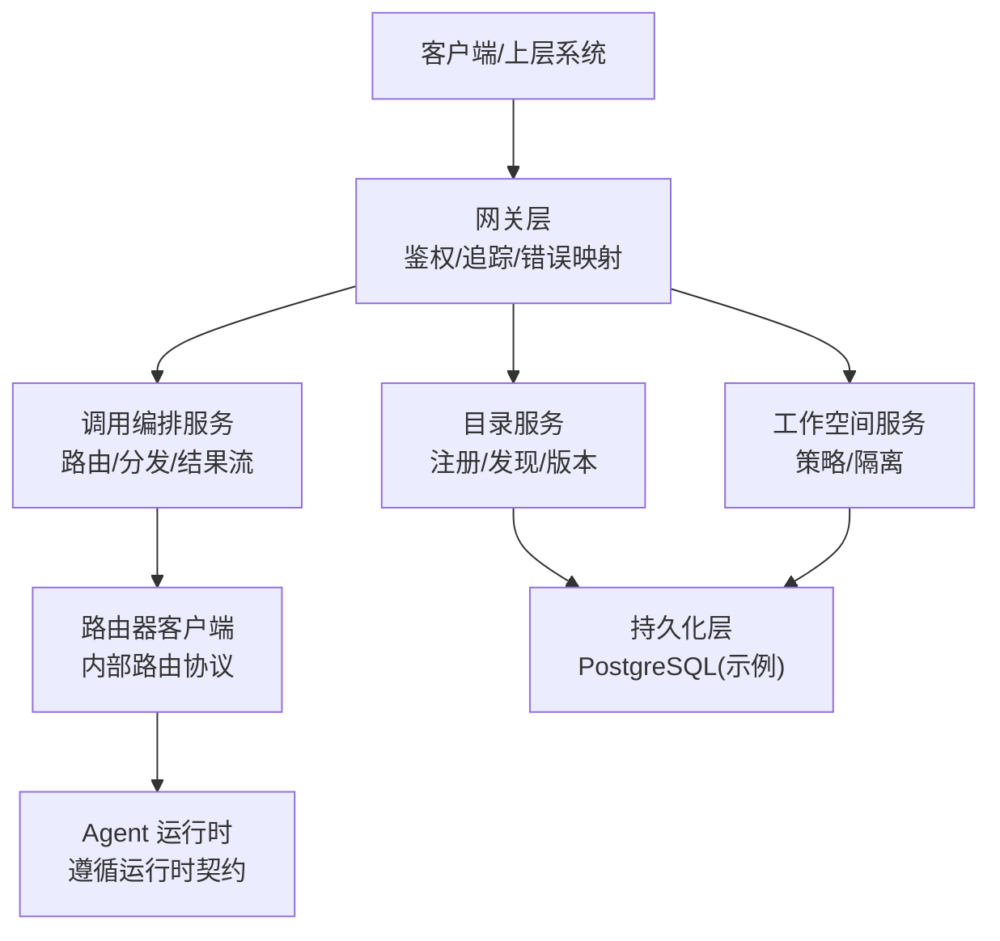
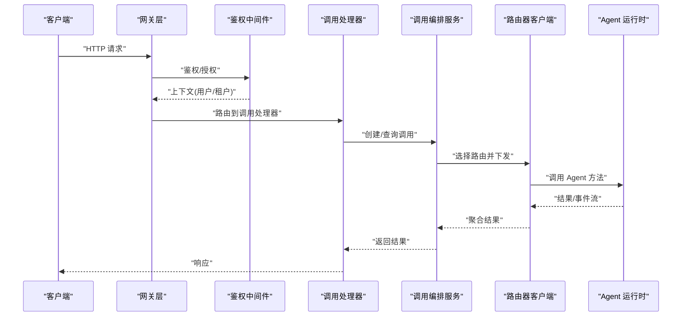
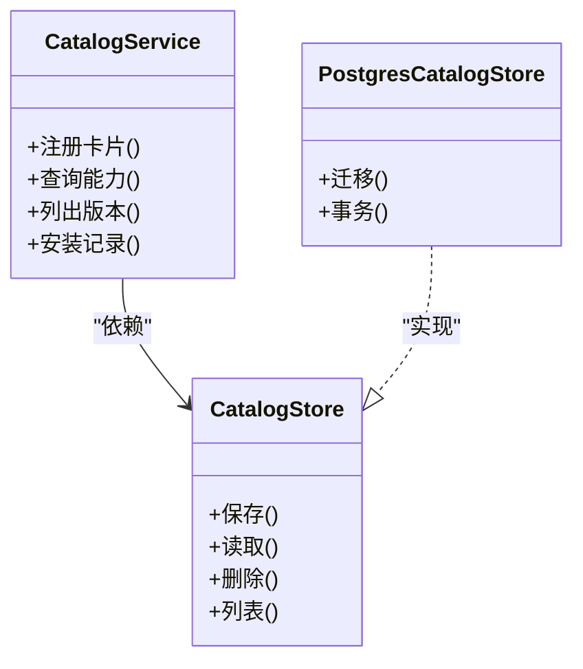
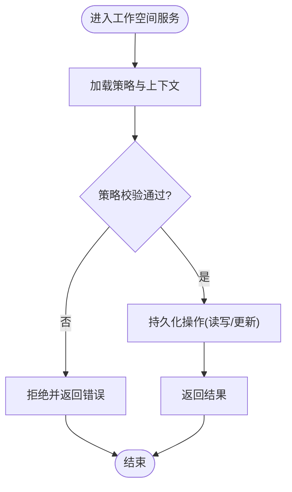
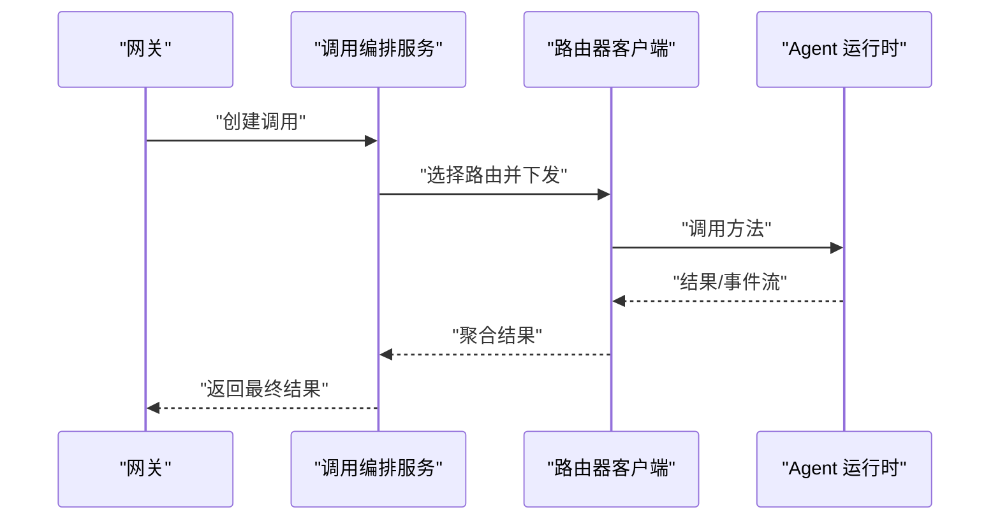
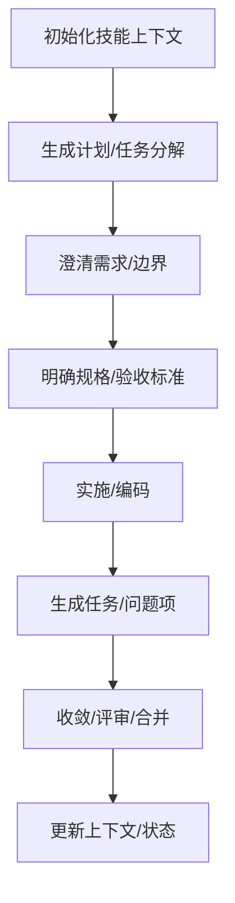
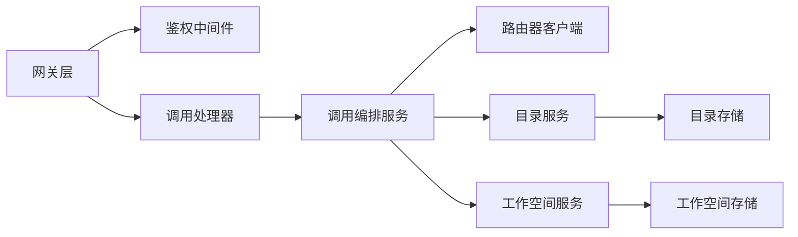

# 扩展开发

<cite>
**本文引用的文件**   
- [README.md](file://README.md)
- [go.mod](file://go.mod)
- [package.json](file://package.json)
- [pnpm-workspace.yaml](file://pnpm-workspace.yaml)
- [tsconfig.base.json](file://tsconfig.base.json)
- [.agents/skills/speckit-agent-context-update/SKILL.md](file://.agents/skills/speckit-agent-context-update/SKILL.md)
- [.agents/skills/speckit-analyze/SKILL.md](file://.agents/skills/speckit-analyze/SKILL.md)
- [.agents/skills/speckit-checklist/SKILL.md](file://.agents/skills/speckit-checklist/SKILL.md)
- [.agents/skills/speckit-clarify/SKILL.md](file://.agents/skills/speckit-clarify/SKILL.md)
- [.agents/skills/speckit-converge/SKILL.md](file://.agents/skills/speckit-converge/SKILL.md)
- [.agents/skills/speckit-implement/SKILL.md](file://.agents/skills/speckit-implement/SKILL.md)
- [.agents/skills/speckit-plan/SKILL.md](file://.agents/skills/speckit-plan/SKILL.md)
- [.agents/skills/speckit-specify/SKILL.md](file://.agents/skills/speckit-specify/SKILL.md)
- [.agents/skills/speckit-tasks/SKILL.md](file://.agents/skills/speckit-tasks/SKILL.md)
- [.agents/skills/speckit-taskstoissues/SKILL.md](file://.agents/skills/speckit-taskstoissues/SKILL.md)
- [apps/control-plane/cmd/control-plane/main.go](file://apps/control-plane/cmd/control-plane/main.go)
- [apps/control-plane/internal/config/config.go](file://apps/control-plane/internal/config/config.go)
- [apps/control-plane/internal/gateway/auth.go](file://apps/control-plane/internal/gateway/auth.go)
- [apps/control-plane/internal/gateway/catalog_handler.go](file://apps/control-plane/internal/gateway/catalog_handler.go)
- [apps/control-plane/internal/gateway/invocation_handler.go](file://apps/control-plane/internal/gateway/invocation_handler.go)
- [apps/control-plane/internal/gateway/workspace_handler.go](file://apps/control-plane/internal/gateway/workspace_handler.go)
- [apps/control-plane/internal/invocation/service.go](file://apps/control-plane/internal/invocation/service.go)
- [apps/control-plane/internal/invocation/router_client.go](file://apps/control-plane/internal/invocation/router_client.go)
- [apps/control-plane/internal/catalog/service.go](file://apps/control-plane/internal/catalog/service.go)
- [apps/control-plane/internal/catalog/store.go](file://apps/control-plane/internal/catalog/store.go)
- [apps/control-plane/internal/catalog/postgres/store.go](file://apps/control-plane/internal/catalog/postgres/store.go)
- [apps/control-plane/internal/workspace/service.go](file://apps/control-plane/internal/workspace/service.go)
- [apps/control-plane/internal/workspace/store.go](file://apps/control-plane/internal/workspace/store.go)
- [apps/control-plane/internal/workspace/postgres/store.go](file://apps/control-plane/internal/workspace/postgres/store.go)
- [contracts/openapi/control-plane.v2.yaml](file://contracts/openapi/control-plane.v2.yaml)
- [contracts/openapi/router-agent.v1.yaml](file://contracts/openapi/router-agent.v1.yaml)
- [contracts/openapi/router-internal.v3.yaml](file://contracts/openapi/router-internal.v3.yaml)
- [contracts/runtime_contracts.go](file://contracts/runtime_contracts.go)
- [contracts/installation_contracts.go](file://contracts/installation_contracts.go)
- [contracts/result_contracts.go](file://contracts/result_contracts.go)
- [specs/001-complete-invocation-contracts/spec.md](file://specs/001-complete-invocation-contracts/spec.md)
- [specs/002-catalog-registry-discovery/spec.md](file://specs/002-catalog-registry-discovery/spec.md)
- [specs/003-workspace-installation-contracts/spec.md](file://specs/003-workspace-installation-contracts/spec.md)
- [specs/011-invocation-runtime-contracts/spec.md](file://specs/011-invocation-runtime-contracts/spec.md)
- [specs/019-agent-sdk-nested-invocation/spec.md](file://specs/019-agent-sdk-nested-invocation/spec.md)
- [deploy/compose.yaml](file://deploy/compose.yaml)
</cite>

## 目录
1. [简介](#简介)
2. [项目结构](#项目结构)
3. [核心组件](#核心组件)
4. [架构总览](#架构总览)
5. [详细组件分析](#详细组件分析)
6. [依赖分析](#依赖分析)
7. [性能考虑](#性能考虑)
8. [故障排查指南](#故障排查指南)
9. [结论](#结论)
10. [附录](#附录)

## 简介
本文件面向希望在 NeKiro 平台进行扩展开发的工程师，覆盖插件接口、SDK 使用（Go/Python/JavaScript）、自定义路由算法、存储后端与认证机制的实现方式、Agent 技能开发指南、扩展点识别与集成模式、生命周期管理与版本兼容性等主题。文档以仓库现有代码与契约为依据，提供可操作的扩展路径与最佳实践。

## 项目结构
NeKiro 采用多包工作区组织，包含控制面服务、OpenAPI 契约、规范文档、部署配置以及 Agent 技能定义等。关键目录说明：
- apps/control-plane：控制面主程序与内部模块（网关、编排、目录注册、工作空间等）
- contracts：对外与内部 API 的 OpenAPI 契约及运行时契约校验
- specs：各能力域的需求与契约规格
- .agents/skills：Agent 技能清单与行为描述
- deploy：本地与容器化部署配置
- sdks/agent-sdk：Agent SDK 源码位置（当前为空，预留）

图表来源
- [apps/control-plane/cmd/control-plane/main.go:1-200](file://apps/control-plane/cmd/control-plane/main.go#L1-L200)
- [contracts/openapi/control-plane.v2.yaml:1-200](file://contracts/openapi/control-plane.v2.yaml#L1-L200)
- [specs/001-complete-invocation-contracts/spec.md:1-200](file://specs/001-complete-invocation-contracts/spec.md#L1-L200)

章节来源
- [README.md:1-200](file://README.md#L1-L200)
- [go.mod:1-200](file://go.mod#L1-L200)
- [package.json:1-200](file://package.json#L1-L200)
- [pnpm-workspace.yaml:1-200](file://pnpm-workspace.yaml#L1-L200)
- [tsconfig.base.json:1-200](file://tsconfig.base.json#L1-L200)

## 核心组件
- 控制面入口与初始化：负责加载配置、启动 HTTP 网关、注册路由与中间件、连接持久化层。
- 网关层：暴露控制面 API，处理鉴权、追踪、错误映射，并转发到内部服务。
- 目录注册与发现：管理 Agent 卡片、能力声明、版本与安装信息。
- 工作空间：隔离租户上下文、策略与资源边界。
- 调用编排：根据路由策略将调用分发至目标 Agent 运行时，并处理结果流与事件。
- 运行时契约：定义 Agent 运行时的能力、错误模型、结果流与生命周期语义。

章节来源
- [apps/control-plane/cmd/control-plane/main.go:1-200](file://apps/control-plane/cmd/control-plane/main.go#L1-L200)
- [apps/control-plane/internal/config/config.go:1-200](file://apps/control-plane/internal/config/config.go#L1-L200)
- [apps/control-plane/internal/gateway/auth.go:1-200](file://apps/control-plane/internal/gateway/auth.go#L1-L200)
- [apps/control-plane/internal/catalog/service.go:1-200](file://apps/control-plane/internal/catalog/service.go#L1-L200)
- [apps/control-plane/internal/workspace/service.go:1-200](file://apps/control-plane/internal/workspace/service.go#L1-L200)
- [apps/control-plane/internal/invocation/service.go:1-200](file://apps/control-plane/internal/invocation/service.go#L1-L200)
- [contracts/runtime_contracts.go:1-200](file://contracts/runtime_contracts.go#L1-L200)

## 架构总览
控制面通过网关暴露 REST/JSON-RPC 接口，内部由目录、工作空间与调用编排等服务协作完成能力解析、鉴权、路由与结果投递。Agent 运行时遵循运行时契约，支持流式结果与事件。

图表来源
- [apps/control-plane/internal/gateway/catalog_handler.go:1-200](file://apps/control-plane/internal/gateway/catalog_handler.go#L1-L200)
- [apps/control-plane/internal/gateway/workspace_handler.go:1-200](file://apps/control-plane/internal/gateway/workspace_handler.go#L1-L200)
- [apps/control-plane/internal/gateway/invocation_handler.go:1-200](file://apps/control-plane/internal/gateway/invocation_handler.go#L1-L200)
- [apps/control-plane/internal/invocation/router_client.go:1-200](file://apps/control-plane/internal/invocation/router_client.go#L1-L200)
- [apps/control-plane/internal/catalog/postgres/store.go:1-200](file://apps/control-plane/internal/catalog/postgres/store.go#L1-L200)
- [apps/control-plane/internal/workspace/postgres/store.go:1-200](file://apps/control-plane/internal/workspace/postgres/store.go#L1-L200)

## 详细组件分析

### 网关与鉴权扩展点
- 鉴权中间件：在请求进入网关时执行身份验证与权限检查，支持可扩展的认证提供者。
- 错误映射与追踪：统一错误码与结构化错误响应，注入追踪 ID 便于链路诊断。
- 路由处理器：按功能域拆分处理器，分别处理目录、工作空间与调用相关请求。

图表来源
- [apps/control-plane/internal/gateway/auth.go:1-200](file://apps/control-plane/internal/gateway/auth.go#L1-L200)
- [apps/control-plane/internal/gateway/invocation_handler.go:1-200](file://apps/control-plane/internal/gateway/invocation_handler.go#L1-L200)
- [apps/control-plane/internal/invocation/service.go:1-200](file://apps/control-plane/internal/invocation/service.go#L1-L200)
- [apps/control-plane/internal/invocation/router_client.go:1-200](file://apps/control-plane/internal/invocation/router_client.go#L1-L200)

章节来源
- [apps/control-plane/internal/gateway/auth.go:1-200](file://apps/control-plane/internal/gateway/auth.go#L1-L200)
- [apps/control-plane/internal/gateway/invocation_handler.go:1-200](file://apps/control-plane/internal/gateway/invocation_handler.go#L1-L200)
- [apps/control-plane/internal/gateway/errors.go:1-200](file://apps/control-plane/internal/gateway/errors.go#L1-L200)
- [apps/control-plane/internal/gateway/trace.go:1-200](file://apps/control-plane/internal/gateway/trace.go#L1-L200)

### 目录注册与发现扩展点
- 目录服务：维护 Agent 卡片、能力声明、版本与安装信息，提供查询与变更接口。
- 存储抽象：通过 store 接口解耦具体实现，默认提供 PostgreSQL 实现，便于替换为其他后端。
- 迁移脚本：数据库结构演进通过迁移脚本管理，确保升级一致性。

图表来源
- [apps/control-plane/internal/catalog/service.go:1-200](file://apps/control-plane/internal/catalog/service.go#L1-L200)
- [apps/control-plane/internal/catalog/store.go:1-200](file://apps/control-plane/internal/catalog/store.go#L1-L200)
- [apps/control-plane/internal/catalog/postgres/store.go:1-200](file://apps/control-plane/internal/catalog/postgres/store.go#L1-L200)

章节来源
- [apps/control-plane/internal/catalog/service.go:1-200](file://apps/control-plane/internal/catalog/service.go#L1-L200)
- [apps/control-plane/internal/catalog/store.go:1-200](file://apps/control-plane/internal/catalog/store.go#L1-L200)
- [apps/control-plane/internal/catalog/postgres/store.go:1-200](file://apps/control-plane/internal/catalog/postgres/store.go#L1-L200)

### 工作空间与策略扩展点
- 工作空间服务：提供租户隔离、策略与元数据管理能力。
- 存储抽象：同样通过 store 接口与迁移脚本支持可插拔持久化。
- 策略模型：用于控制访问、能力启用与资源配额。

图表来源
- [apps/control-plane/internal/workspace/service.go:1-200](file://apps/control-plane/internal/workspace/service.go#L1-L200)
- [apps/control-plane/internal/workspace/store.go:1-200](file://apps/control-plane/internal/workspace/store.go#L1-L200)
- [apps/control-plane/internal/workspace/policy.go:1-200](file://apps/control-plane/internal/workspace/policy.go#L1-L200)
- [apps/control-plane/internal/workspace/postgres/store.go:1-200](file://apps/control-plane/internal/workspace/postgres/store.go#L1-L200)

章节来源
- [apps/control-plane/internal/workspace/service.go:1-200](file://apps/control-plane/internal/workspace/service.go#L1-L200)
- [apps/control-plane/internal/workspace/store.go:1-200](file://apps/control-plane/internal/workspace/store.go#L1-L200)
- [apps/control-plane/internal/workspace/policy.go:1-200](file://apps/control-plane/internal/workspace/policy.go#L1-L200)

### 调用编排与路由扩展点
- 调用编排服务：根据能力与策略选择路由，发起对 Agent 运行时的调用，并处理结果流与事件。
- 路由器客户端：封装内部路由协议，支持负载均衡、重试与超时控制。
- 路由策略：可通过外部配置或策略引擎动态调整路由决策。

图表来源
- [apps/control-plane/internal/invocation/service.go:1-200](file://apps/control-plane/internal/invocation/service.go#L1-L200)
- [apps/control-plane/internal/invocation/router_client.go:1-200](file://apps/control-plane/internal/invocation/router_client.go#L1-L200)
- [contracts/openapi/router-internal.v3.yaml:1-200](file://contracts/openapi/router-internal.v3.yaml#L1-L200)

章节来源
- [apps/control-plane/internal/invocation/service.go:1-200](file://apps/control-plane/internal/invocation/service.go#L1-L200)
- [apps/control-plane/internal/invocation/router_client.go:1-200](file://apps/control-plane/internal/invocation/router_client.go#L1-L200)
- [contracts/openapi/router-internal.v3.yaml:1-200](file://contracts/openapi/router-internal.v3.yaml#L1-L200)

### 运行时契约与 Agent 能力
- 运行时契约：定义 Agent 运行时的能力、错误模型、结果流与生命周期语义，确保跨语言与跨实现的互操作性。
- 结果流：支持分块结果与事件推送，便于长任务与实时交互。
- 错误模型：统一的平台错误类型，便于客户端一致处理。

章节来源
- [contracts/runtime_contracts.go:1-200](file://contracts/runtime_contracts.go#L1-L200)
- [contracts/result_contracts.go:1-200](file://contracts/result_contracts.go#L1-L200)
- [specs/011-invocation-runtime-contracts/spec.md:1-200](file://specs/011-invocation-runtime-contracts/spec.md#L1-L200)

### Agent 技能开发指南
- 技能定义：每个技能位于 .agents/skills/<skill-id>/SKILL.md，描述技能用途、输入输出、触发条件与行为约束。
- 技能组合：通过多个技能协同完成复杂任务，如规划、澄清、实施、收敛等。
- 技能发布：将 SKILL.md 纳入仓库并提交，供平台索引与调度。

图表来源
- [.agents/skills/speckit-plan/SKILL.md:1-200](file://.agents/skills/speckit-plan/SKILL.md#L1-L200)
- [.agents/skills/speckit-clarify/SKILL.md:1-200](file://.agents/skills/speckit-clarify/SKILL.md#L1-L200)
- [.agents/skills/speckit-specify/SKILL.md:1-200](file://.agents/skills/speckit-specify/SKILL.md#L1-L200)
- [.agents/skills/speckit-implement/SKILL.md:1-200](file://.agents/skills/speckit-implement/SKILL.md#L1-L200)
- [.agents/skills/speckit-tasks/SKILL.md:1-200](file://.agents/skills/speckit-tasks/SKILL.md#L1-L200)
- [.agents/skills/speckit-converge/SKILL.md:1-200](file://.agents/skills/speckit-converge/SKILL.md#L1-L200)
- [.agents/skills/speckit-agent-context-update/SKILL.md:1-200](file://.agents/skills/speckit-agent-context-update/SKILL.md#L1-L200)

章节来源
- [.agents/skills/speckit-analyze/SKILL.md:1-200](file://.agents/skills/speckit-analyze/SKILL.md#L1-L200)
- [.agents/skills/speckit-checklist/SKILL.md:1-200](file://.agents/skills/speckit-checklist/SKILL.md#L1-L200)
- [.agents/skills/speckit-taskstoissues/SKILL.md:1-200](file://.agents/skills/speckit-taskstoissues/SKILL.md#L1-L200)

### SDK 使用方法
- Go SDK：位于 sdks/agent-sdk，提供与运行时契约一致的调用封装、错误处理与结果流消费。
- Python SDK：预留位置，建议基于运行时契约与 OpenAPI 契约生成客户端。
- JavaScript SDK：预留位置，建议基于 OpenAPI 契约生成 TypeScript/JavaScript 客户端。
- 生成与测试：结合 OpenAPI 契约与 conformance 用例，确保跨语言一致性。

章节来源
- [contracts/openapi/control-plane.v2.yaml:1-200](file://contracts/openapi/control-plane.v2.yaml#L1-L200)
- [contracts/openapi/router-agent.v1.yaml:1-200](file://contracts/openapi/router-agent.v1.yaml#L1-L200)
- [specs/019-agent-sdk-nested-invocation/spec.md:1-200](file://specs/019-agent-sdk-nested-invocation/spec.md#L1-L200)

### 自定义路由算法
- 扩展点：在调用编排服务中注入路由策略，依据能力、负载、延迟、成本等维度选择目标 Agent。
- 策略配置：通过配置中心或策略文件动态加载，支持灰度与回滚。
- 评估指标：结合追踪与度量，持续优化路由决策。

章节来源
- [apps/control-plane/internal/invocation/service.go:1-200](file://apps/control-plane/internal/invocation/service.go#L1-L200)
- [apps/control-plane/internal/invocation/router_client.go:1-200](file://apps/control-plane/internal/invocation/router_client.go#L1-L200)
- [specs/001-complete-invocation-contracts/spec.md:1-200](file://specs/001-complete-invocation-contracts/spec.md#L1-L200)

### 自定义存储后端
- 扩展点：目录与工作空间的 store 接口，允许替换为 Redis、MongoDB 或其他关系型数据库。
- 迁移管理：通过迁移脚本保证数据结构演进的一致性。
- 事务与并发：在实现中注意事务边界与并发安全。

章节来源
- [apps/control-plane/internal/catalog/store.go:1-200](file://apps/control-plane/internal/catalog/store.go#L1-L200)
- [apps/control-plane/internal/workspace/store.go:1-200](file://apps/control-plane/internal/workspace/store.go#L1-L200)
- [apps/control-plane/internal/catalog/postgres/store.go:1-200](file://apps/control-plane/internal/catalog/postgres/store.go#L1-L200)
- [apps/control-plane/internal/workspace/postgres/store.go:1-200](file://apps/control-plane/internal/workspace/postgres/store.go#L1-L200)

### 自定义认证机制
- 扩展点：网关鉴权中间件，支持 JWT、OAuth2、mTLS 等多种认证方案。
- 上下文传递：将用户与租户信息注入后续服务调用。
- 策略联动：与策略引擎配合，实现细粒度授权。

章节来源
- [apps/control-plane/internal/gateway/auth.go:1-200](file://apps/control-plane/internal/gateway/auth.go#L1-L200)
- [apps/control-plane/internal/workspace/policy.go:1-200](file://apps/control-plane/internal/workspace/policy.go#L1-L200)

## 依赖分析
- 模块耦合：网关层依赖鉴权、追踪与错误映射；调用编排依赖目录与工作空间服务；目录与工作空间依赖各自存储实现。
- 外部依赖：PostgreSQL 作为默认持久化后端；OpenAPI 契约驱动客户端生成与一致性测试。
- 潜在循环：避免在存储服务中反向依赖服务层，保持单向依赖。

图表来源
- [apps/control-plane/internal/gateway/invocation_handler.go:1-200](file://apps/control-plane/internal/gateway/invocation_handler.go#L1-L200)
- [apps/control-plane/internal/invocation/service.go:1-200](file://apps/control-plane/internal/invocation/service.go#L1-L200)
- [apps/control-plane/internal/catalog/service.go:1-200](file://apps/control-plane/internal/catalog/service.go#L1-L200)
- [apps/control-plane/internal/workspace/service.go:1-200](file://apps/control-plane/internal/workspace/service.go#L1-L200)

章节来源
- [go.mod:1-200](file://go.mod#L1-L200)
- [package.json:1-200](file://package.json#L1-L200)
- [pnpm-workspace.yaml:1-200](file://pnpm-workspace.yaml#L1-L200)

## 性能考虑
- 路由与分发：合理设置超时、重试与熔断，避免级联失败。
- 结果流：使用背压与分页，防止内存溢出。
- 存储层：利用索引与连接池，减少锁竞争与网络开销。
- 监控与追踪：结合追踪 ID 与指标采集，定位瓶颈。

## 故障排查指南
- 统一错误模型：参考平台错误类型，确保客户端一致处理。
- 追踪与日志：在网关与服务层注入追踪 ID，关联端到端调用链。
- 契约校验：使用 conformance 用例验证实现是否符合运行时与 OpenAPI 契约。

章节来源
- [contracts/runtime_contracts.go:1-200](file://contracts/runtime_contracts.go#L1-L200)
- [contracts/result_contracts.go:1-200](file://contracts/result_contracts.go#L1-L200)
- [apps/control-plane/internal/gateway/errors.go:1-200](file://apps/control-plane/internal/gateway/errors.go#L1-L200)
- [apps/control-plane/internal/gateway/trace.go:1-200](file://apps/control-plane/internal/gateway/trace.go#L1-L200)

## 结论
NeKiro 提供了清晰的扩展点与契约边界，开发者可通过网关鉴权、目录与工作空间存储、调用路由与运行时契约等扩展点进行定制与二次开发。结合 Agent 技能与 SDK，能够快速构建可观测、可治理的智能体生态。

## 附录
- 快速开始：参考本地开发与部署配置，快速搭建环境。
- 版本兼容：遵循 OpenAPI 与运行时契约的版本策略，确保向后兼容。

章节来源
- [deploy/compose.yaml:1-200](file://deploy/compose.yaml#L1-L200)
- [specs/002-catalog-registry-discovery/spec.md:1-200](file://specs/002-catalog-registry-discovery/spec.md#L1-L200)
- [specs/003-workspace-installation-contracts/spec.md:1-200](file://specs/003-workspace-installation-contracts/spec.md#L1-L200)
- [contracts/installation_contracts.go:1-200](file://contracts/installation_contracts.go#L1-L200)