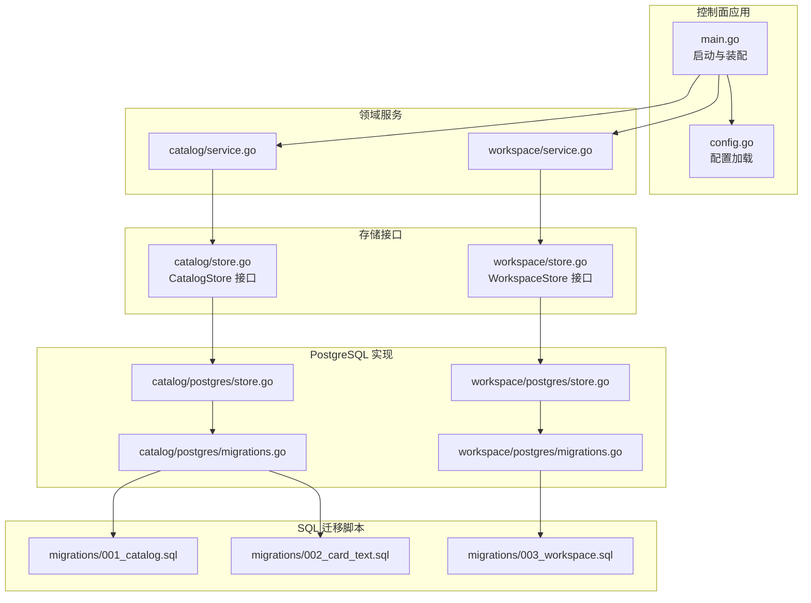
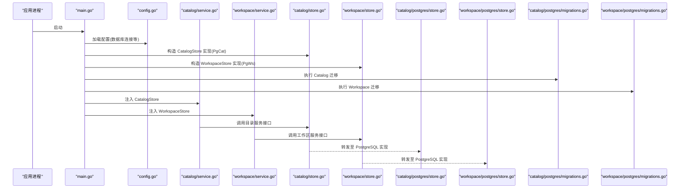
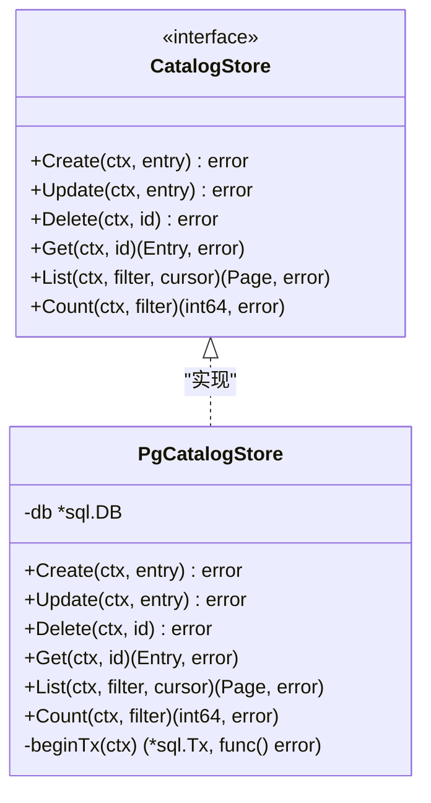
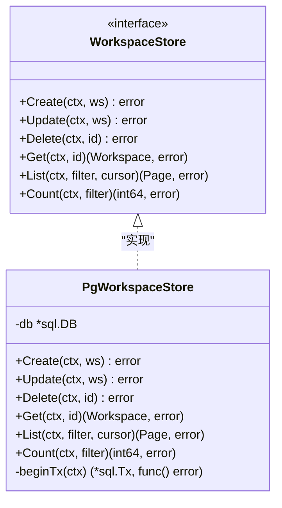
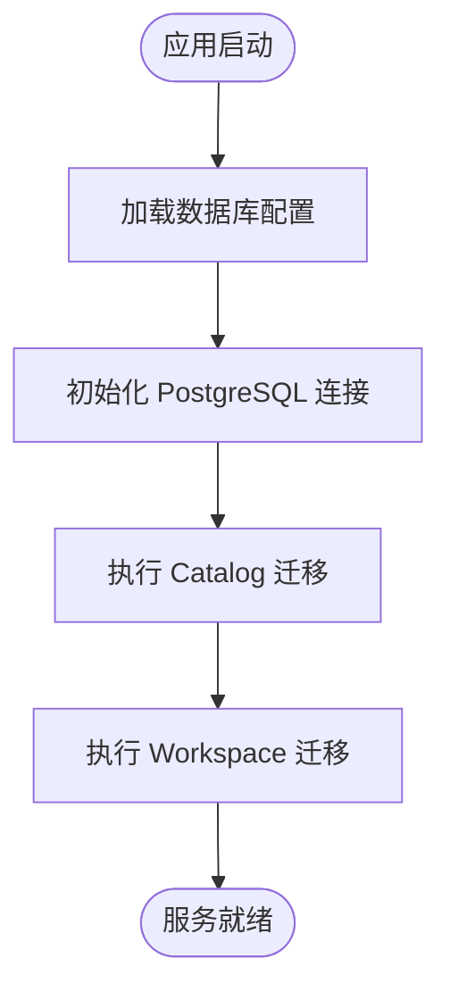
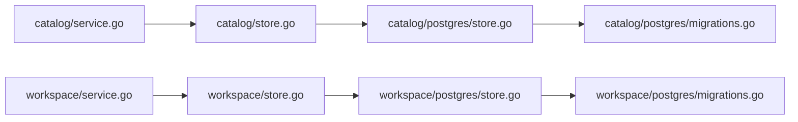

# 存储插件

<cite>
**本文引用的文件**   
- [apps/control-plane/internal/catalog/store.go](file://apps/control-plane/internal/catalog/store.go)
- [apps/control-plane/internal/catalog/postgres/store.go](file://apps/control-plane/internal/catalog/postgres/store.go)
- [apps/control-plane/internal/catalog/postgres/migrations.go](file://apps/control-plane/internal/catalog/postgres/migrations.go)
- [apps/control-plane/internal/workspace/store.go](file://apps/control-plane/internal/workspace/store.go)
- [apps/control-plane/internal/workspace/postgres/store.go](file://apps/control-plane/internal/workspace/postgres/store.go)
- [apps/control-plane/internal/workspace/postgres/migrations.go](file://apps/control-plane/internal/workspace/postgres/migrations.go)
- [apps/control-plane/cmd/control-plane/main.go](file://apps/control-plane/cmd/control-plane/main.go)
- [apps/control-plane/internal/config/config.go](file://apps/control-plane/internal/config/config.go)
- [apps/control-plane/migrations/001_catalog.sql](file://apps/control-plane/migrations/001_catalog.sql)
- [apps/control-plane/migrations/002_card_text.sql](file://apps/control-plane/migrations/002_card_text.sql)
- [apps/control-plane/migrations/003_workspace.sql](file://apps/control-plane/migrations/003_workspace.sql)
</cite>

## 目录
1. [简介](#简介)
2. [项目结构](#项目结构)
3. [核心组件](#核心组件)
4. [架构总览](#架构总览)
5. [详细组件分析](#详细组件分析)
6. [依赖关系分析](#依赖关系分析)
7. [性能考虑](#性能考虑)
8. [故障排查指南](#故障排查指南)
9. [结论](#结论)
10. [附录](#附录)

## 简介
本文件面向 NeKiro 平台的“存储插件”开发，聚焦于存储后端的接口设计与实现规范。文档围绕以下目标展开：
- 明确 CatalogStore 与 WorkspaceStore 两个核心存储接口的定义、职责边界与使用方式
- 说明存储插件的生命周期管理（初始化、连接池、资源清理）
- 提供自定义存储后端的完整实现示例与最佳实践
- 以 PostgreSQL 存储为具体实现进行深度解析
- 解释数据迁移机制与版本兼容性处理
- 给出事务管理、错误处理与性能优化建议
- 提供 Redis、MongoDB 等其他存储方案的实现指导
- 记录配置选项与环境变量设置

## 项目结构
NeKiro 控制面将“领域服务”与“持久化实现”解耦，通过接口抽象出存储层，便于替换不同后端。当前仓库中已包含 PostgreSQL 的两种存储实现：
- 目录注册表（Catalog）存储
- 工作区（Workspace）存储

图表来源
- [apps/control-plane/cmd/control-plane/main.go](file://apps/control-plane/cmd/control-plane/main.go)
- [apps/control-plane/internal/config/config.go](file://apps/control-plane/internal/config/config.go)
- [apps/control-plane/internal/catalog/store.go](file://apps/control-plane/internal/catalog/store.go)
- [apps/control-plane/internal/workspace/store.go](file://apps/control-plane/internal/workspace/store.go)
- [apps/control-plane/internal/catalog/postgres/store.go](file://apps/control-plane/internal/catalog/postgres/store.go)
- [apps/control-plane/internal/workspace/postgres/store.go](file://apps/control-plane/internal/workspace/postgres/store.go)
- [apps/control-plane/internal/catalog/postgres/migrations.go](file://apps/control-plane/internal/catalog/postgres/migrations.go)
- [apps/control-plane/internal/workspace/postgres/migrations.go](file://apps/control-plane/internal/workspace/postgres/migrations.go)
- [apps/control-plane/migrations/001_catalog.sql](file://apps/control-plane/migrations/001_catalog.sql)
- [apps/control-plane/migrations/002_card_text.sql](file://apps/control-plane/migrations/002_card_text.sql)
- [apps/control-plane/migrations/003_workspace.sql](file://apps/control-plane/migrations/003_workspace.sql)

章节来源
- [apps/control-plane/cmd/control-plane/main.go](file://apps/control-plane/cmd/control-plane/main.go)
- [apps/control-plane/internal/config/config.go](file://apps/control-plane/internal/config/config.go)
- [apps/control-plane/internal/catalog/store.go](file://apps/control-plane/internal/catalog/store.go)
- [apps/control-plane/internal/workspace/store.go](file://apps/control-plane/internal/workspace/store.go)
- [apps/control-plane/internal/catalog/postgres/store.go](file://apps/control-plane/internal/catalog/postgres/store.go)
- [apps/control-plane/internal/workspace/postgres/store.go](file://apps/control-plane/internal/workspace/postgres/store.go)
- [apps/control-plane/internal/catalog/postgres/migrations.go](file://apps/control-plane/internal/catalog/postgres/migrations.go)
- [apps/control-plane/internal/workspace/postgres/migrations.go](file://apps/control-plane/internal/workspace/postgres/migrations.go)
- [apps/control-plane/migrations/001_catalog.sql](file://apps/control-plane/migrations/001_catalog.sql)
- [apps/control-plane/migrations/002_card_text.sql](file://apps/control-plane/migrations/002_card_text.sql)
- [apps/control-plane/migrations/003_workspace.sql](file://apps/control-plane/migrations/003_workspace.sql)

## 核心组件
本节聚焦存储层接口设计，明确 CatalogStore 与 WorkspaceStore 的职责与方法约定，以及调用方如何依赖接口而非具体实现。

- CatalogStore 接口
  - 职责：封装目录注册表相关的数据访问操作，如条目增删改查、分页与游标查询等
  - 典型方法：创建/更新/删除条目；按条件查询；基于游标的分页查询；计数与存在性检查
  - 返回约定：统一错误类型；成功时返回实体或分页结果；失败时返回可诊断的错误信息
  - 事务支持：若涉及多写操作，应暴露事务上下文参数或在内部开启事务

- WorkspaceStore 接口
  - 职责：封装工作区安装、状态与元数据的持久化能力
  - 典型方法：创建工作区实例；读取/更新/删除工作区；查询列表与过滤；统计与审计字段维护
  - 并发安全：接口需保证线程安全，避免共享状态竞争
  - 幂等性：对写入操作尽量保证幂等，便于重试与恢复

- 接口与实现的解耦
  - 领域服务仅依赖接口，不感知具体存储实现
  - 在应用启动阶段注入具体实现（如 PostgreSQL）
  - 测试可通过内存或 Mock 实现快速验证业务逻辑

章节来源
- [apps/control-plane/internal/catalog/store.go](file://apps/control-plane/internal/catalog/store.go)
- [apps/control-plane/internal/workspace/store.go](file://apps/control-plane/internal/workspace/store.go)

## 架构总览
下图展示了从应用入口到存储层的整体流程，包括配置加载、服务装配、存储实现与迁移执行。

图表来源
- [apps/control-plane/cmd/control-plane/main.go](file://apps/control-plane/cmd/control-plane/main.go)
- [apps/control-plane/internal/config/config.go](file://apps/control-plane/internal/config/config.go)
- [apps/control-plane/internal/catalog/store.go](file://apps/control-plane/internal/catalog/store.go)
- [apps/control-plane/internal/workspace/store.go](file://apps/control-plane/internal/workspace/store.go)
- [apps/control-plane/internal/catalog/postgres/store.go](file://apps/control-plane/internal/catalog/postgres/store.go)
- [apps/control-plane/internal/workspace/postgres/store.go](file://apps/control-plane/internal/workspace/postgres/store.go)
- [apps/control-plane/internal/catalog/postgres/migrations.go](file://apps/control-plane/internal/catalog/postgres/migrations.go)
- [apps/control-plane/internal/workspace/postgres/migrations.go](file://apps/control-plane/internal/workspace/postgres/migrations.go)

## 详细组件分析

### CatalogStore 接口与 PostgreSQL 实现
- 接口要点
  - 提供目录条目的 CRUD、分页与游标查询
  - 支持按名称、标签、版本等维度筛选
  - 返回结构化错误，便于上层统一处理
- PostgreSQL 实现要点
  - 连接池：复用 DB 连接，合理设置最大空闲数与最大连接数
  - 事务：批量写入或跨表一致性操作使用事务包裹
  - 索引：针对高频查询字段建立索引，提升扫描性能
  - 迁移：通过 migrations.go 驱动 SQL 脚本执行，确保版本一致

图表来源
- [apps/control-plane/internal/catalog/store.go](file://apps/control-plane/internal/catalog/store.go)
- [apps/control-plane/internal/catalog/postgres/store.go](file://apps/control-plane/internal/catalog/postgres/store.go)

章节来源
- [apps/control-plane/internal/catalog/store.go](file://apps/control-plane/internal/catalog/store.go)
- [apps/control-plane/internal/catalog/postgres/store.go](file://apps/control-plane/internal/catalog/postgres/store.go)

### WorkspaceStore 接口与 PostgreSQL 实现
- 接口要点
  - 提供工作区的创建、读取、更新、删除与查询
  - 支持状态机式更新（如 pending -> installed -> running）
  - 提供审计字段（创建时间、更新时间）自动维护
- PostgreSQL 实现要点
  - 使用行级锁或乐观锁策略避免并发覆盖
  - 大字段（如 JSON/YAML）采用合适的数据类型与压缩策略
  - 迁移脚本与工作区模型变更同步演进

图表来源
- [apps/control-plane/internal/workspace/store.go](file://apps/control-plane/internal/workspace/store.go)
- [apps/control-plane/internal/workspace/postgres/store.go](file://apps/control-plane/internal/workspace/postgres/store.go)

章节来源
- [apps/control-plane/internal/workspace/store.go](file://apps/control-plane/internal/workspace/store.go)
- [apps/control-plane/internal/workspace/postgres/store.go](file://apps/control-plane/internal/workspace/postgres/store.go)

### 数据迁移机制与版本兼容
- 迁移驱动
  - 每个存储域（catalog、workspace）均提供独立的迁移模块，负责执行对应 SQL 脚本
  - 迁移脚本位于 migrations 目录，按版本号命名，确保顺序执行
- 版本管理
  - 启动时执行未应用的迁移，保证数据库结构与代码一致
  - 回滚策略：新增字段默认允许为空并提供默认值，避免破坏性变更
- 兼容性
  - 向后兼容：新字段可选，旧客户端仍可正常工作
  - 向前兼容：服务端逐步启用新功能，客户端无需立即升级

图表来源
- [apps/control-plane/internal/catalog/postgres/migrations.go](file://apps/control-plane/internal/catalog/postgres/migrations.go)
- [apps/control-plane/internal/workspace/postgres/migrations.go](file://apps/control-plane/internal/workspace/postgres/migrations.go)
- [apps/control-plane/migrations/001_catalog.sql](file://apps/control-plane/migrations/001_catalog.sql)
- [apps/control-plane/migrations/002_card_text.sql](file://apps/control-plane/migrations/002_card_text.sql)
- [apps/control-plane/migrations/003_workspace.sql](file://apps/control-plane/migrations/003_workspace.sql)

章节来源
- [apps/control-plane/internal/catalog/postgres/migrations.go](file://apps/control-plane/internal/catalog/postgres/migrations.go)
- [apps/control-plane/internal/workspace/postgres/migrations.go](file://apps/control-plane/internal/workspace/postgres/migrations.go)
- [apps/control-plane/migrations/001_catalog.sql](file://apps/control-plane/migrations/001_catalog.sql)
- [apps/control-plane/migrations/002_card_text.sql](file://apps/control-plane/migrations/002_card_text.sql)
- [apps/control-plane/migrations/003_workspace.sql](file://apps/control-plane/migrations/003_workspace.sql)

### 生命周期管理与资源清理
- 初始化
  - 在应用启动阶段完成配置加载、连接池构建与迁移执行
  - 存储实现持有 DB 连接句柄，避免每次请求新建连接
- 连接池管理
  - 根据 QPS 与并发度调整最大连接数与空闲连接数
  - 设置连接超时与语句超时，防止慢查询阻塞
- 资源清理
  - 应用退出时关闭连接池，释放底层资源
  - 监控连接泄漏与长时间未归还的连接

章节来源
- [apps/control-plane/cmd/control-plane/main.go](file://apps/control-plane/cmd/control-plane/main.go)
- [apps/control-plane/internal/config/config.go](file://apps/control-plane/internal/config/config.go)
- [apps/control-plane/internal/catalog/postgres/store.go](file://apps/control-plane/internal/catalog/postgres/store.go)
- [apps/control-plane/internal/workspace/postgres/store.go](file://apps/control-plane/internal/workspace/postgres/store.go)

### 事务管理、错误处理与性能优化
- 事务管理
  - 跨表或多写操作使用事务包裹，保证原子性与一致性
  - 提供 beginTx 辅助函数简化事务生命周期管理
- 错误处理
  - 统一错误类型，区分业务错误与系统错误
  - 记录关键路径日志与指标，便于定位问题
- 性能优化
  - 合理使用索引与覆盖索引，减少回表
  - 分页查询使用游标替代偏移量，避免深分页性能问题
  - 批量写入合并多次小写，降低网络往返

章节来源
- [apps/control-plane/internal/catalog/postgres/store.go](file://apps/control-plane/internal/catalog/postgres/store.go)
- [apps/control-plane/internal/workspace/postgres/store.go](file://apps/control-plane/internal/workspace/postgres/store.go)

### 自定义存储后端实现示例（通用模板）
- 步骤概览
  - 定义接口方法与错误类型
  - 实现具体存储后端（如 PostgreSQL、Redis、MongoDB）
  - 在应用启动时注入实现并执行迁移（如适用）
- 关键注意事项
  - 接口稳定性：避免频繁变更方法签名
  - 幂等与重试：写入操作具备幂等性，便于重试
  - 可观测性：埋点与日志输出，便于运维排障

章节来源
- [apps/control-plane/internal/catalog/store.go](file://apps/control-plane/internal/catalog/store.go)
- [apps/control-plane/internal/workspace/store.go](file://apps/control-plane/internal/workspace/store.go)

### 其他存储方案实现指导
- Redis
  - 适合缓存热点数据与轻量键值存储
  - 注意序列化格式与过期策略
  - 复杂查询与事务能力有限，需谨慎设计
- MongoDB
  - 适合文档型数据与灵活模式
  - 利用聚合管道实现复杂查询
  - 关注副本集与分片策略，保障高可用

[本节为概念性指导，不直接分析具体源码文件]

## 依赖关系分析
存储层依赖关系清晰，领域服务通过接口依赖存储实现，具体实现由应用启动阶段装配。

图表来源
- [apps/control-plane/internal/catalog/store.go](file://apps/control-plane/internal/catalog/store.go)
- [apps/control-plane/internal/workspace/store.go](file://apps/control-plane/internal/workspace/store.go)
- [apps/control-plane/internal/catalog/postgres/store.go](file://apps/control-plane/internal/catalog/postgres/store.go)
- [apps/control-plane/internal/workspace/postgres/store.go](file://apps/control-plane/internal/workspace/postgres/store.go)
- [apps/control-plane/internal/catalog/postgres/migrations.go](file://apps/control-plane/internal/catalog/postgres/migrations.go)
- [apps/control-plane/internal/workspace/postgres/migrations.go](file://apps/control-plane/internal/workspace/postgres/migrations.go)

章节来源
- [apps/control-plane/internal/catalog/store.go](file://apps/control-plane/internal/catalog/store.go)
- [apps/control-plane/internal/workspace/store.go](file://apps/control-plane/internal/workspace/store.go)
- [apps/control-plane/internal/catalog/postgres/store.go](file://apps/control-plane/internal/catalog/postgres/store.go)
- [apps/control-plane/internal/workspace/postgres/store.go](file://apps/control-plane/internal/workspace/postgres/store.go)
- [apps/control-plane/internal/catalog/postgres/migrations.go](file://apps/control-plane/internal/catalog/postgres/migrations.go)
- [apps/control-plane/internal/workspace/postgres/migrations.go](file://apps/control-plane/internal/workspace/postgres/migrations.go)

## 性能考虑
- 连接池调优
  - 根据并发与延迟目标设置最大连接数与空闲连接数
  - 启用连接健康检查，避免使用失效连接
- 查询优化
  - 为高频过滤字段建立索引
  - 使用覆盖索引减少回表
  - 避免 SELECT *，只选择必要字段
- 分页与游标
  - 使用游标分页替代 OFFSET/LIMIT 深分页
- 批量操作
  - 合并多次写入为批量操作，降低网络开销
- 监控与告警
  - 监控慢查询、连接池饱和、错误率等关键指标

[本节提供通用性能建议，不直接分析具体源码文件]

## 故障排查指南
- 常见问题
  - 连接失败：检查数据库地址、端口、认证信息与防火墙规则
  - 迁移失败：确认迁移脚本顺序与版本标记，查看迁移日志
  - 慢查询：分析执行计划，补充缺失索引或改写查询
- 定位手段
  - 启用详细日志与追踪 ID，关联请求链路
  - 采集数据库层面指标（QPS、延迟、锁等待）
  - 使用集成测试复现问题，缩小范围

章节来源
- [apps/control-plane/internal/catalog/postgres/migrations.go](file://apps/control-plane/internal/catalog/postgres/migrations.go)
- [apps/control-plane/internal/workspace/postgres/migrations.go](file://apps/control-plane/internal/workspace/postgres/migrations.go)

## 结论
通过将存储层抽象为接口并由具体实现提供，NeKiro 实现了良好的可扩展性与可测试性。PostgreSQL 作为默认后端提供了稳定可靠的持久化能力，配合完善的迁移机制与连接池管理，能够满足生产环境的可靠性与性能要求。对于特定场景，可参考本文档的指导实现 Redis 或 MongoDB 等替代后端。

[本节为总结性内容，不直接分析具体源码文件]

## 附录

### 配置选项与环境变量
- 数据库连接
  - 主机、端口、用户名、密码、数据库名
  - 最大连接数、空闲连接数、连接超时、语句超时
- 迁移开关
  - 是否自动执行迁移
  - 迁移脚本目录与版本前缀
- 日志与监控
  - 日志级别
  - 指标上报端点

章节来源
- [apps/control-plane/internal/config/config.go](file://apps/control-plane/internal/config/config.go)
- [apps/control-plane/cmd/control-plane/main.go](file://apps/control-plane/cmd/control-plane/main.go)