# 插件生命周期管理

<cite>
**本文引用的文件**   
- [README.md](file://README.md)
- [go.mod](file://go.mod)
- [main.go](file://apps/control-plane/cmd/control-plane/main.go)
- [config.go](file://apps/control-plane/internal/config/config.go)
- [service.go](file://apps/control-plane/internal/catalog/service.go)
- [store.go](file://apps/control-plane/internal/catalog/store.go)
- [migrations.go](file://apps/control-plane/internal/catalog/postgres/migrations.go)
- [catalog_handler.go](file://apps/control-plane/internal/gateway/catalog_handler.go)
- [invocation_handler.go](file://apps/control-plane/internal/gateway/invocation_handler.go)
- [router_client.go](file://apps/control-plane/internal/invocation/router_client.go)
- [service.go](file://apps/control-plane/internal/invocation/service.go)
- [workspace_handler.go](file://apps/control-plane/internal/gateway/workspace_handler.go)
- [service.go](file://apps/control-plane/internal/workspace/service.go)
- [store.go](file://apps/control-plane/internal/workspace/postgres/store.go)
- [migrations.go](file://apps/control-plane/internal/workspace/postgres/migrations.go)
- [contracts.go](file://contracts/contracts.go)
- [runtime_contracts.go](file://contracts/runtime_contracts.go)
- [semantic-rules.md](file://contracts/invocation-runtime/v1/semantic-rules.md)
- [lifecycle.json](file://contracts/invocation-runtime/v1/conformance/lifecycle.json)
- [errors.json](file://contracts/invocation-runtime/v1/conformance/errors.json)
- [platform-error.v4.yaml](file://contracts/openapi/platform-error.v4.yaml)
- [compose.yaml](file://deploy/compose.yaml)
</cite>

## 目录
1. [简介](#简介)
2. [项目结构](#项目结构)
3. [核心组件](#核心组件)
4. [架构总览](#架构总览)
5. [详细组件分析](#详细组件分析)
6. [依赖分析](#依赖分析)
7. [性能考虑](#性能考虑)
8. [故障排查指南](#故障排查指南)
9. [结论](#结论)
10. [附录](#附录)

## 简介
本文件面向 NeKiro 平台的“插件”（在代码中体现为可被编排与调用的工作单元，如 Agent、技能或运行时任务），围绕其生命周期管理进行系统化说明。内容覆盖：
- 加载、初始化与销毁流程
- 配置管理机制（配置文件解析、环境变量注入、动态更新）
- 依赖注入与模块间通信机制
- 版本兼容性检查与升级策略
- 热重载实现原理与注意事项
- 错误处理与恢复机制
- 调试与监控工具使用方法
- 打包、分发与部署最佳实践

为保证准确性，本文所有实现细节均基于仓库中的源码与契约定义进行归纳与映射。

## 项目结构
NeKiro 采用多应用与契约驱动的组织方式。控制面（control-plane）负责插件的注册、发现、安装、编排与调用路由；契约层（contracts）定义运行时接口、错误模型与一致性测试用例；部署通过 Compose 编排数据库等基础设施。

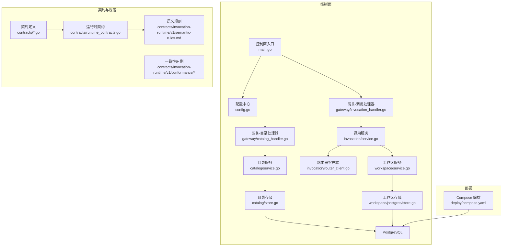

图表来源
- [main.go:1-200](file://apps/control-plane/cmd/control-plane/main.go#L1-L200)
- [config.go:1-200](file://apps/control-plane/internal/config/config.go#L1-L200)
- [service.go:1-200](file://apps/control-plane/internal/catalog/service.go#L1-L200)
- [store.go:1-200](file://apps/control-plane/internal/catalog/store.go#L1-L200)
- [service.go:1-200](file://apps/control-plane/internal/invocation/service.go#L1-L200)
- [router_client.go:1-200](file://apps/control-plane/internal/invocation/router_client.go#L1-L200)
- [catalog_handler.go:1-200](file://apps/control-plane/internal/gateway/catalog_handler.go#L1-L200)
- [invocation_handler.go:1-200](file://apps/control-plane/internal/gateway/invocation_handler.go#L1-L200)
- [service.go:1-200](file://apps/control-plane/internal/workspace/service.go#L1-L200)
- [store.go:1-200](file://apps/control-plane/internal/workspace/postgres/store.go#L1-L200)
- [contracts.go:1-200](file://contracts/contracts.go#L1-L200)
- [runtime_contracts.go:1-200](file://contracts/runtime_contracts.go#L1-L200)
- [semantic-rules.md:1-200](file://contracts/invocation-runtime/v1/semantic-rules.md#L1-L200)
- [lifecycle.json:1-200](file://contracts/invocation-runtime/v1/conformance/lifecycle.json#L1-L200)
- [compose.yaml:1-200](file://deploy/compose.yaml#L1-L200)

章节来源
- [README.md:1-200](file://README.md#L1-L200)
- [go.mod:1-200](file://go.mod#L1-L200)

## 核心组件
- 配置中心：集中读取并合并配置源（配置文件、环境变量、命令行参数），提供统一访问接口，支持热更新监听。
- 目录服务：维护插件元数据、版本、能力声明与依赖关系，提供查询、注册与变更订阅。
- 调用服务：根据插件能力与工作区上下文，完成调用路由、鉴权、追踪与结果聚合。
- 路由器客户端：与下游执行器（Agent/Worker）通信，转发请求并收集事件流。
- 工作区服务：管理工作区范围的安装、权限、隔离与状态。
- 持久化层：PostgreSQL 作为目录与工作区的持久化后端，迁移脚本保证结构演进。
- 契约与一致性：运行时契约、错误模型与一致性用例确保跨版本兼容与行为稳定。

章节来源
- [config.go:1-200](file://apps/control-plane/internal/config/config.go#L1-L200)
- [service.go:1-200](file://apps/control-plane/internal/catalog/service.go#L1-L200)
- [store.go:1-200](file://apps/control-plane/internal/catalog/store.go#L1-L200)
- [service.go:1-200](file://apps/control-plane/internal/invocation/service.go#L1-L200)
- [router_client.go:1-200](file://apps/control-plane/internal/invocation/router_client.go#L1-L200)
- [service.go:1-200](file://apps/control-plane/internal/workspace/service.go#L1-L200)
- [store.go:1-200](file://apps/control-plane/internal/workspace/postgres/store.go#L1-L200)
- [migrations.go:1-200](file://apps/control-plane/internal/catalog/postgres/migrations.go#L1-L200)
- [migrations.go:1-200](file://apps/control-plane/internal/workspace/postgres/migrations.go#L1-L200)
- [contracts.go:1-200](file://contracts/contracts.go#L1-L200)
- [runtime_contracts.go:1-200](file://contracts/runtime_contracts.go#L1-L200)

## 架构总览
下图展示插件从“注册/发现”到“调用/销毁”的关键路径，以及配置与持久化的交互。

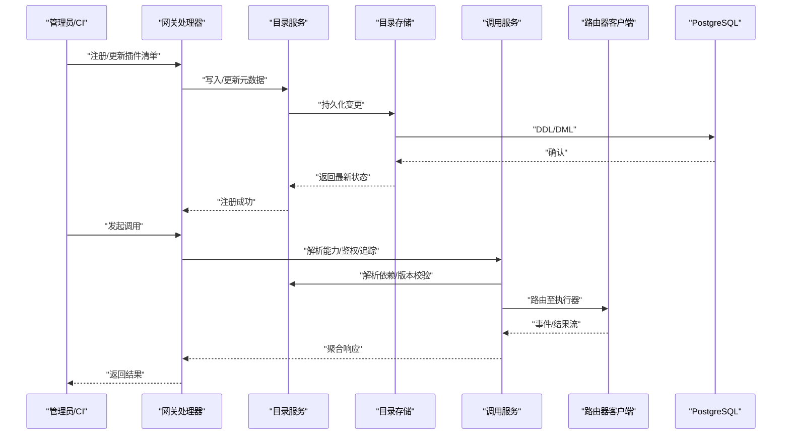

图表来源
- [catalog_handler.go:1-200](file://apps/control-plane/internal/gateway/catalog_handler.go#L1-L200)
- [service.go:1-200](file://apps/control-plane/internal/catalog/service.go#L1-L200)
- [store.go:1-200](file://apps/control-plane/internal/catalog/store.go#L1-L200)
- [invocation_handler.go:1-200](file://apps/control-plane/internal/gateway/invocation_handler.go#L1-L200)
- [service.go:1-200](file://apps/control-plane/internal/invocation/service.go#L1-L200)
- [router_client.go:1-200](file://apps/control-plane/internal/invocation/router_client.go#L1-L200)
- [migrations.go:1-200](file://apps/control-plane/internal/catalog/postgres/migrations.go#L1-L200)

## 详细组件分析

### 插件加载与初始化流程
- 启动阶段：控制面入口初始化配置中心、数据库连接、迁移与网关路由。
- 目录预热：目录服务从存储加载已注册插件清单，构建内存索引与依赖图。
- 能力解析：依据运行时契约解析插件能力、输入输出与约束。
- 依赖校验：对插件依赖进行拓扑排序与版本区间检查，失败则拒绝加载。
- 资源准备：按需创建上下文、缓存、连接池与监控指标。

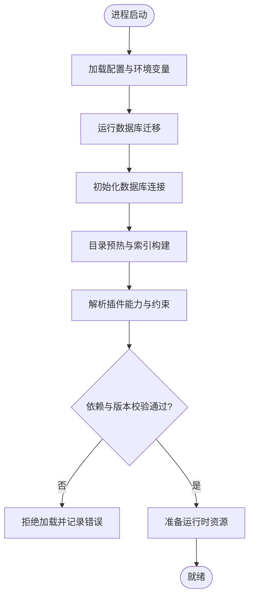

图表来源
- [main.go:1-200](file://apps/control-plane/cmd/control-plane/main.go#L1-L200)
- [config.go:1-200](file://apps/control-plane/internal/config/config.go#L1-L200)
- [migrations.go:1-200](file://apps/control-plane/internal/catalog/postgres/migrations.go#L1-L200)
- [service.go:1-200](file://apps/control-plane/internal/catalog/service.go#L1-L200)
- [runtime_contracts.go:1-200](file://contracts/runtime_contracts.go#L1-L200)

章节来源
- [main.go:1-200](file://apps/control-plane/cmd/control-plane/main.go#L1-L200)
- [config.go:1-200](file://apps/control-plane/internal/config/config.go#L1-L200)
- [migrations.go:1-200](file://apps/control-plane/internal/catalog/postgres/migrations.go#L1-L200)
- [service.go:1-200](file://apps/control-plane/internal/catalog/service.go#L1-L200)
- [runtime_contracts.go:1-200](file://contracts/runtime_contracts.go#L1-L200)

### 插件销毁与清理
- 优雅停机：接收停机信号后停止接受新请求，等待活跃调用完成。
- 资源释放：关闭连接池、取消协程、释放锁与临时文件。
- 状态落盘：将最终状态写回目录与工作区存储，确保幂等与可观测性。
- 退出码：按错误类型返回不同退出码，便于编排系统重试或告警。

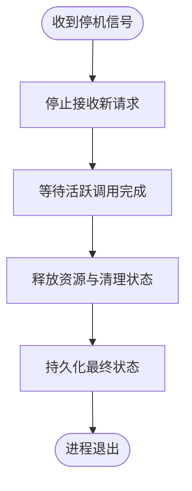

图表来源
- [main.go:1-200](file://apps/control-plane/cmd/control-plane/main.go#L1-L200)
- [service.go:1-200](file://apps/control-plane/internal/catalog/service.go#L1-L200)
- [service.go:1-200](file://apps/control-plane/internal/workspace/service.go#L1-L200)

章节来源
- [main.go:1-200](file://apps/control-plane/cmd/control-plane/main.go#L1-L200)
- [service.go:1-200](file://apps/control-plane/internal/catalog/service.go#L1-L200)
- [service.go:1-200](file://apps/control-plane/internal/workspace/service.go#L1-L200)

### 配置管理机制
- 配置来源优先级：默认值 < 配置文件 < 环境变量 < 命令行参数。
- 热更新：监听配置变更事件，增量更新内存配置，触发受影响组件重初始化。
- 安全敏感项：密钥类配置仅以环境变量注入，避免落盘明文。
- 校验与回滚：变更时进行强校验，失败则回滚到上一版本配置。

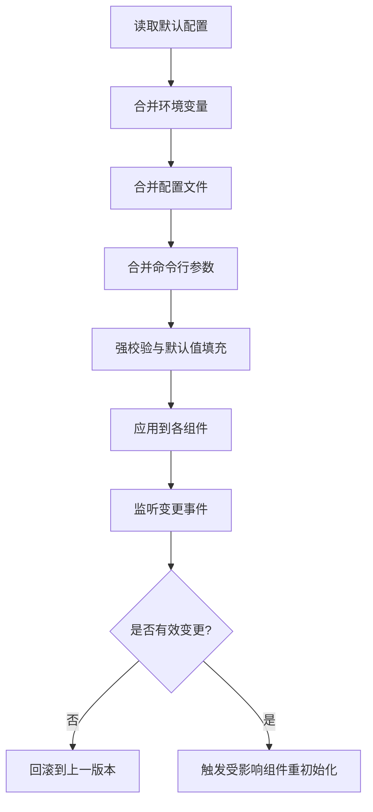

图表来源
- [config.go:1-200](file://apps/control-plane/internal/config/config.go#L1-L200)

章节来源
- [config.go:1-200](file://apps/control-plane/internal/config/config.go#L1-L200)

### 依赖注入与模块间通信
- 依赖注入：通过构造期注入共享组件（配置、日志、追踪、存储），避免全局单例。
- 模块边界：目录、调用、工作区服务之间通过接口解耦，便于替换与测试。
- 事件总线：内部使用事件通道或发布订阅模式传递状态变更（如插件注册、版本切换）。
- 外部通信：通过路由器客户端与执行器通信，支持流式事件与超时控制。

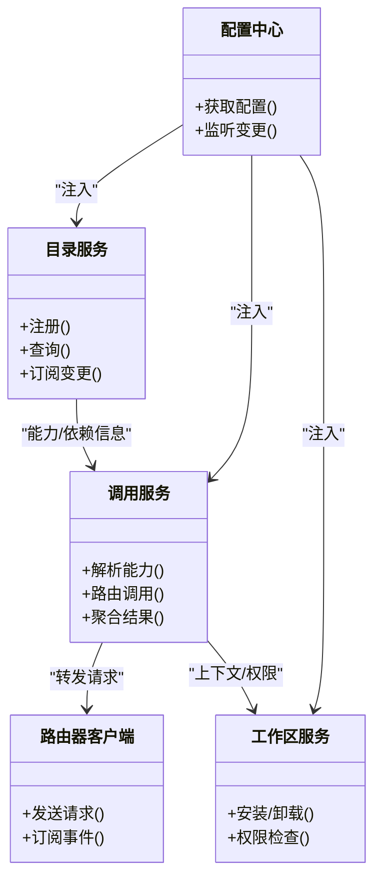

图表来源
- [service.go:1-200](file://apps/control-plane/internal/catalog/service.go#L1-L200)
- [service.go:1-200](file://apps/control-plane/internal/invocation/service.go#L1-L200)
- [router_client.go:1-200](file://apps/control-plane/internal/invocation/router_client.go#L1-L200)
- [service.go:1-200](file://apps/control-plane/internal/workspace/service.go#L1-L200)
- [config.go:1-200](file://apps/control-plane/internal/config/config.go#L1-L200)

章节来源
- [service.go:1-200](file://apps/control-plane/internal/catalog/service.go#L1-L200)
- [service.go:1-200](file://apps/control-plane/internal/invocation/service.go#L1-L200)
- [router_client.go:1-200](file://apps/control-plane/internal/invocation/router_client.go#L1-L200)
- [service.go:1-200](file://apps/control-plane/internal/workspace/service.go#L1-L200)
- [config.go:1-200](file://apps/control-plane/internal/config/config.go#L1-L200)

### 版本兼容性检查与升级策略
- 契约基线：运行时契约定义最小兼容集，插件需满足语义规则与错误模型。
- 版本区间：插件清单声明支持的运行时版本区间，加载时进行区间匹配。
- 渐进升级：支持灰度与蓝绿切换，先升级部分实例，验证通过后全量。
- 回滚策略：升级失败自动回滚到上一稳定版本，保留快照与审计日志。

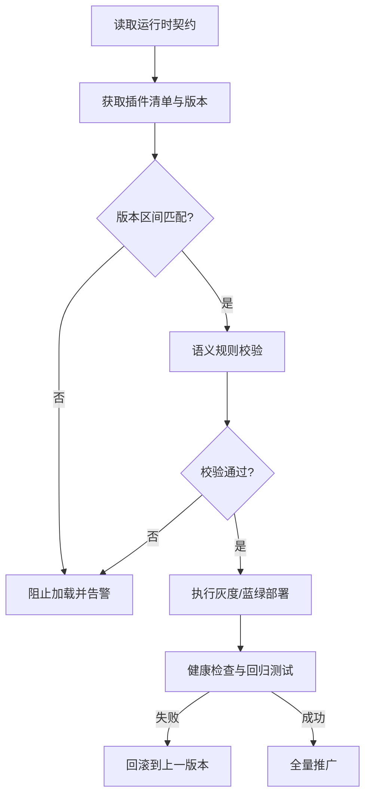

图表来源
- [runtime_contracts.go:1-200](file://contracts/runtime_contracts.go#L1-L200)
- [semantic-rules.md:1-200](file://contracts/invocation-runtime/v1/semantic-rules.md#L1-L200)
- [lifecycle.json:1-200](file://contracts/invocation-runtime/v1/conformance/lifecycle.json#L1-L200)
- [service.go:1-200](file://apps/control-plane/internal/catalog/service.go#L1-L200)

章节来源
- [runtime_contracts.go:1-200](file://contracts/runtime_contracts.go#L1-L200)
- [semantic-rules.md:1-200](file://contracts/invocation-runtime/v1/semantic-rules.md#L1-L200)
- [lifecycle.json:1-200](file://contracts/invocation-runtime/v1/conformance/lifecycle.json#L1-L200)
- [service.go:1-200](file://apps/control-plane/internal/catalog/service.go#L1-L200)

### 热重载实现原理与注意事项
- 触发条件：插件清单变更、配置变更、依赖版本更新。
- 实现要点：
  - 原子切换：新旧实例并行启动，流量逐步切分，完成后删除旧实例。
  - 状态保持：会话与中间状态外置（如 Redis/数据库），避免重启丢失。
  - 幂等重建：重初始化逻辑具备幂等性，防止重复生效。
- 风险与缓解：
  - 并发冲突：使用分布式锁或版本号控制，避免竞态。
  - 资源泄漏：严格跟踪句柄与协程，确保清理路径完整。
  - 降级策略：热重载失败自动降级到上一稳定版本。

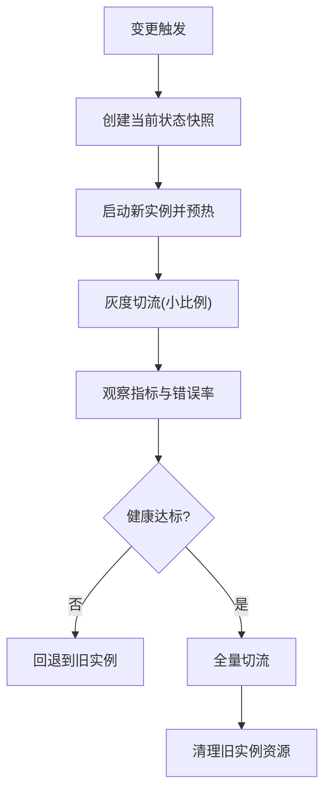

图表来源
- [service.go:1-200](file://apps/control-plane/internal/catalog/service.go#L1-L200)
- [config.go:1-200](file://apps/control-plane/internal/config/config.go#L1-L200)

章节来源
- [service.go:1-200](file://apps/control-plane/internal/catalog/service.go#L1-L200)
- [config.go:1-200](file://apps/control-plane/internal/config/config.go#L1-L200)

### 错误处理与恢复机制
- 错误模型：遵循平台错误模型，包含错误码、消息与上下文字段。
- 分类处理：
  - 可重试错误：网络抖动、限流等，采用指数退避与熔断。
  - 不可重试错误：参数非法、权限不足等，直接返回并记录审计。
- 恢复策略：
  - 自愈：自动重试与降级。
  - 人工介入：关键错误触发告警与工单。
- 一致性保障：事务与补偿操作确保状态一致。

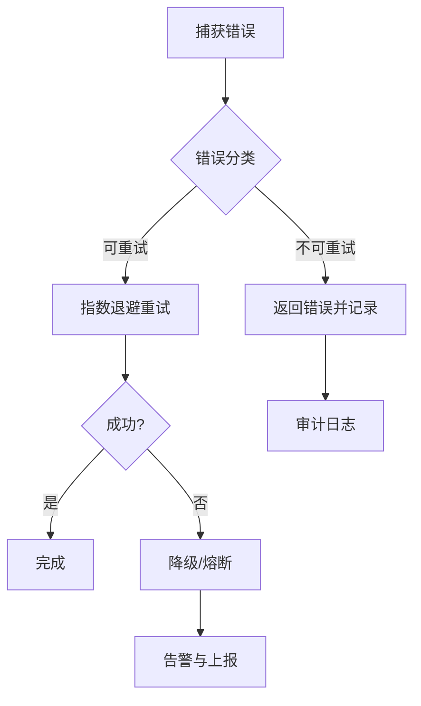

图表来源
- [errors.json:1-200](file://contracts/invocation-runtime/v1/conformance/errors.json#L1-L200)
- [platform-error.v4.yaml:1-200](file://contracts/openapi/platform-error.v4.yaml#L1-L200)
- [invocation_handler.go:1-200](file://apps/control-plane/internal/gateway/invocation_handler.go#L1-L200)

章节来源
- [errors.json:1-200](file://contracts/invocation-runtime/v1/conformance/errors.json#L1-L200)
- [platform-error.v4.yaml:1-200](file://contracts/openapi/platform-error.v4.yaml#L1-L200)
- [invocation_handler.go:1-200](file://apps/control-plane/internal/gateway/invocation_handler.go#L1-L200)

### 调试与监控工具使用方法
- 日志与追踪：
  - 结构化日志：包含请求ID、插件ID、版本与阶段。
  - 分布式追踪：贯穿网关、调用服务与执行器。
- 指标采集：
  - 关键指标：加载耗时、错误率、延迟分布、资源占用。
  - 自定义指标：业务相关计数与状态机转换。
- 诊断命令：
  - 查看插件清单与状态。
  - 触发热重载与回滚。
  - 导出快照与审计日志。

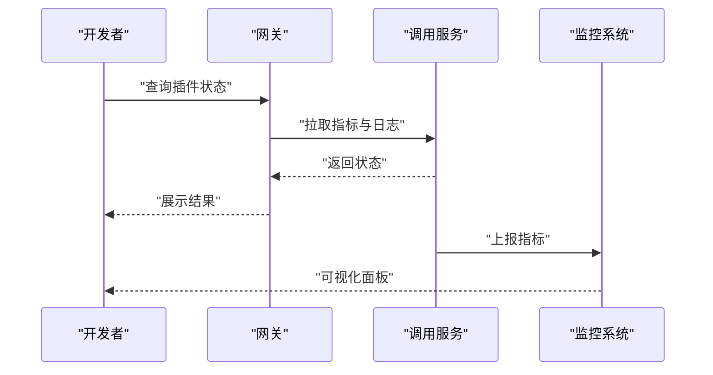

图表来源
- [invocation_handler.go:1-200](file://apps/control-plane/internal/gateway/invocation_handler.go#L1-L200)
- [service.go:1-200](file://apps/control-plane/internal/invocation/service.go#L1-L200)

章节来源
- [invocation_handler.go:1-200](file://apps/control-plane/internal/gateway/invocation_handler.go#L1-L200)
- [service.go:1-200](file://apps/control-plane/internal/invocation/service.go#L1-L200)

### 打包、分发与部署最佳实践
- 打包：
  - 清单文件：包含版本、能力、依赖与签名。
  - 制品：二进制与资源包分离，提供校验和。
- 分发：
  - 私有仓库：镜像与清单托管，访问控制与审计。
  - 版本标签：语义化版本与分支策略。
- 部署：
  - 容器化：Dockerfile 与 Compose 编排。
  - 环境隔离：开发、测试、生产环境独立。
  - 灰度发布：按工作区或租户逐步放量。

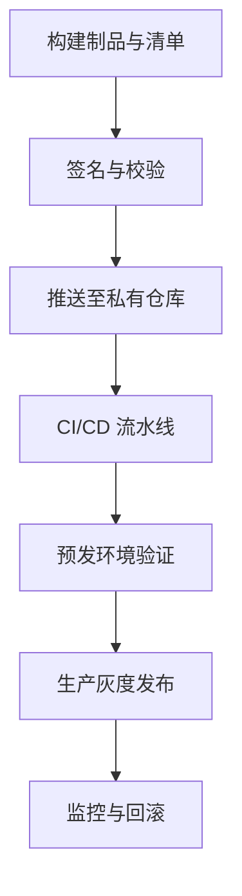

图表来源
- [compose.yaml:1-200](file://deploy/compose.yaml#L1-L200)
- [README.md:1-200](file://README.md#L1-L200)

章节来源
- [compose.yaml:1-200](file://deploy/compose.yaml#L1-L200)
- [README.md:1-200](file://README.md#L1-L200)

## 依赖分析
- 组件耦合：
  - 网关层依赖目录与调用服务，职责清晰。
  - 调用服务依赖目录服务的能力信息与路由器客户端的执行器。
  - 工作区服务提供上下文与权限，被调用服务复用。
- 外部依赖：
  - PostgreSQL：目录与工作区数据持久化。
  - 契约库：运行时契约与一致性用例。
- 潜在循环：
  - 通过接口与事件解耦，避免直接循环引用。

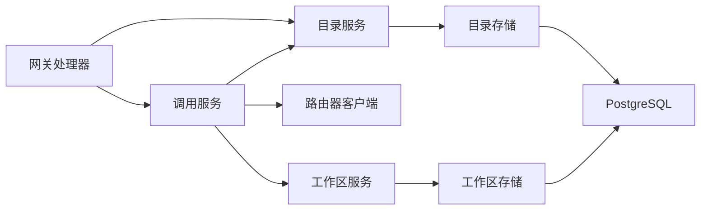

图表来源
- [catalog_handler.go:1-200](file://apps/control-plane/internal/gateway/catalog_handler.go#L1-L200)
- [invocation_handler.go:1-200](file://apps/control-plane/internal/gateway/invocation_handler.go#L1-L200)
- [service.go:1-200](file://apps/control-plane/internal/catalog/service.go#L1-L200)
- [service.go:1-200](file://apps/control-plane/internal/invocation/service.go#L1-L200)
- [router_client.go:1-200](file://apps/control-plane/internal/invocation/router_client.go#L1-L200)
- [service.go:1-200](file://apps/control-plane/internal/workspace/service.go#L1-L200)
- [store.go:1-200](file://apps/control-plane/internal/catalog/store.go#L1-L200)
- [store.go:1-200](file://apps/control-plane/internal/workspace/postgres/store.go#L1-L200)

章节来源
- [catalog_handler.go:1-200](file://apps/control-plane/internal/gateway/catalog_handler.go#L1-L200)
- [invocation_handler.go:1-200](file://apps/control-plane/internal/gateway/invocation_handler.go#L1-L200)
- [service.go:1-200](file://apps/control-plane/internal/catalog/service.go#L1-L200)
- [service.go:1-200](file://apps/control-plane/internal/invocation/service.go#L1-L200)
- [router_client.go:1-200](file://apps/control-plane/internal/invocation/router_client.go#L1-L200)
- [service.go:1-200](file://apps/control-plane/internal/workspace/service.go#L1-L200)
- [store.go:1-200](file://apps/control-plane/internal/catalog/store.go#L1-L200)
- [store.go:1-200](file://apps/control-plane/internal/workspace/postgres/store.go#L1-L200)

## 性能考虑
- 连接池与并发：合理设置数据库与外部服务连接池大小，避免阻塞。
- 缓存策略：热点能力与依赖图缓存，减少磁盘 IO。
- 批处理与分页：目录查询与列表接口支持分页与批量操作。
- 背压与限流：在高负载下限制并发与速率，保护系统稳定性。
- 异步化：长耗时任务异步执行，提升吞吐。

[本节为通用指导，不直接分析具体文件]

## 故障排查指南
- 常见问题定位：
  - 加载失败：检查依赖与版本区间、契约语义规则。
  - 调用失败：核对鉴权、路由与执行器健康。
  - 配置异常：验证环境变量与配置文件格式。
- 快速恢复：
  - 回滚到上一版本。
  - 重置缓存与索引。
  - 重启受影响的组件。
- 取证与分析：
  - 导出审计日志与追踪链路。
  - 抓取快照与堆栈信息。

章节来源
- [errors.json:1-200](file://contracts/invocation-runtime/v1/conformance/errors.json#L1-L200)
- [platform-error.v4.yaml:1-200](file://contracts/openapi/platform-error.v4.yaml#L1-L200)
- [invocation_handler.go:1-200](file://apps/control-plane/internal/gateway/invocation_handler.go#L1-L200)
- [config.go:1-200](file://apps/control-plane/internal/config/config.go#L1-L200)

## 结论
NeKiro 的插件生命周期管理以契约驱动为核心，结合配置中心、目录服务与调用服务形成闭环。通过严格的版本兼容检查、灰度升级与完善的错误恢复机制，确保系统在演进过程中的稳定性与可观测性。建议在生产环境中持续完善监控与自动化回滚能力，以提升整体可靠性。

[本节为总结性内容，不直接分析具体文件]

## 附录
- 术语表：
  - 插件：可被编排与调用的工作单元（Agent/技能/任务）。
  - 运行时契约：定义插件与平台之间的接口与语义规则。
  - 工作区：插件运行的隔离上下文。
- 参考文档：
  - 运行时契约与语义规则
  - 平台错误模型
  - 部署编排示例

[本节为补充信息，不直接分析具体文件]