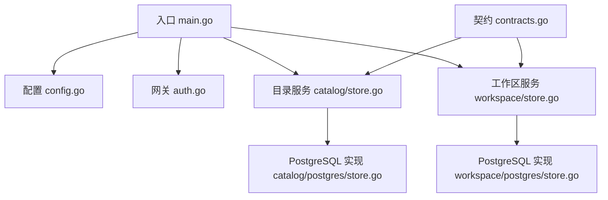
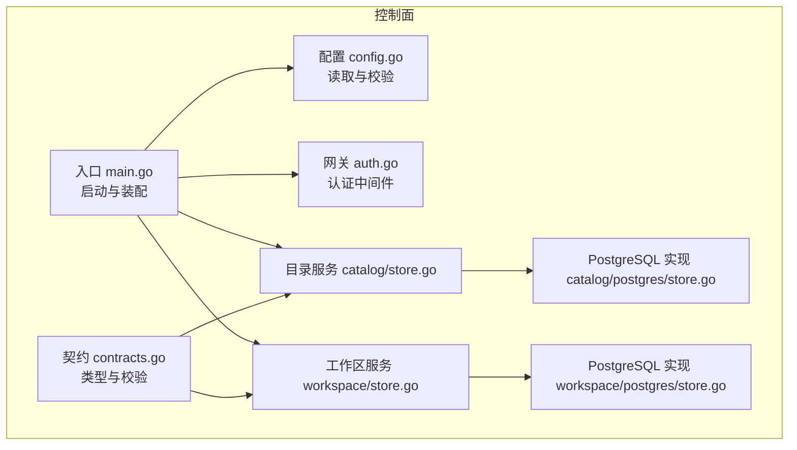
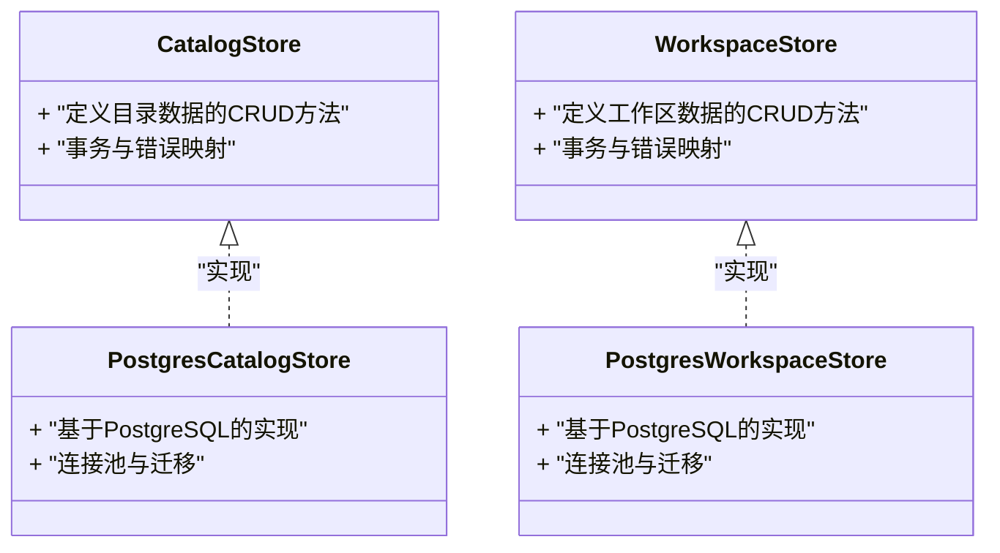
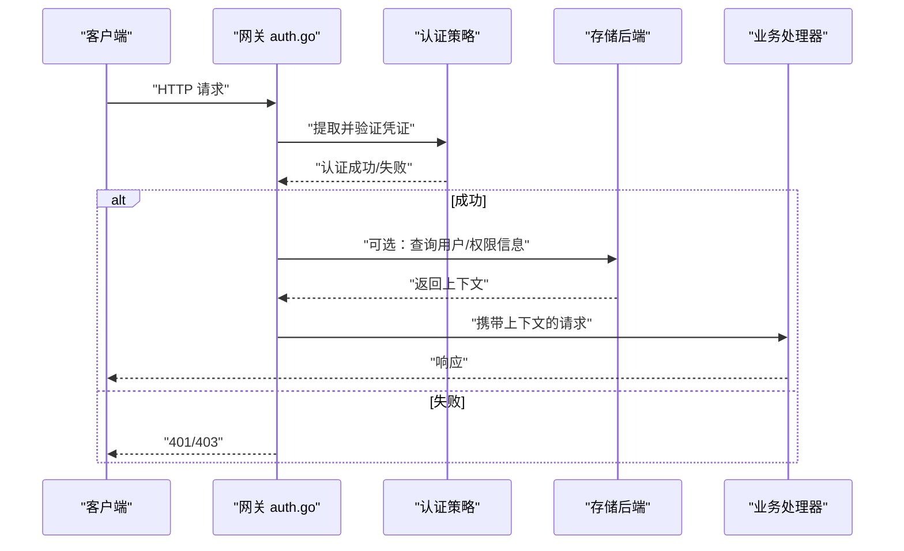
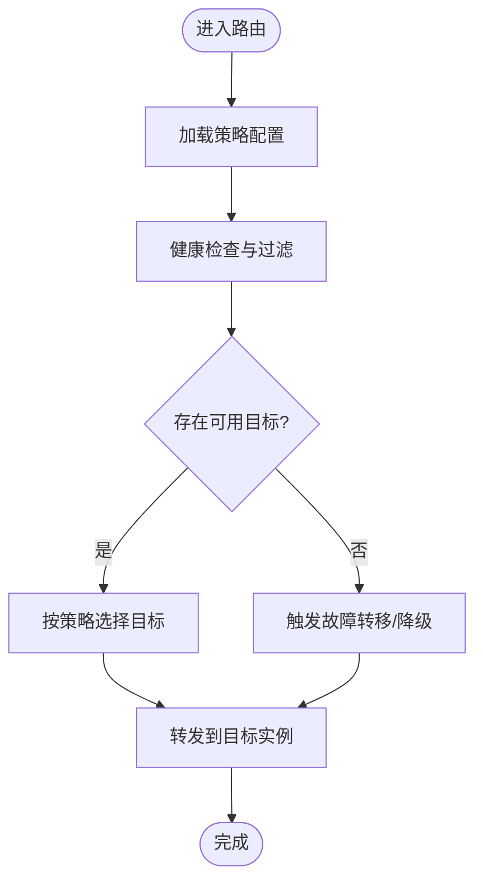
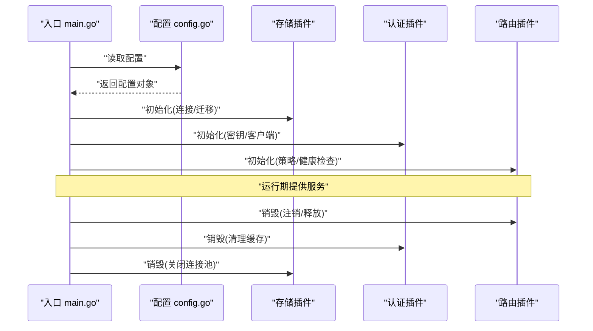
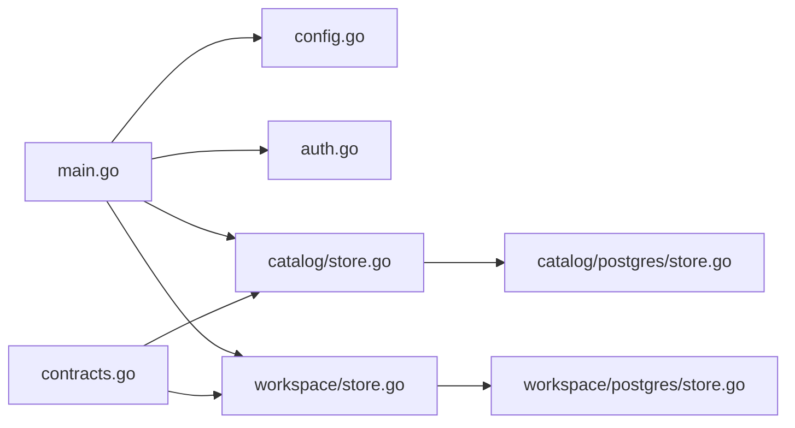

# 插件系统

<cite>
**本文引用的文件**   
- [apps/control-plane/cmd/control-plane/main.go](file://apps/control-plane/cmd/control-plane/main.go)
- [apps/control-plane/internal/config/config.go](file://apps/control-plane/internal/config/config.go)
- [apps/control-plane/internal/gateway/auth.go](file://apps/control-plane/internal/gateway/auth.go)
- [apps/control-plane/internal/catalog/store.go](file://apps/control-plane/internal/catalog/store.go)
- [apps/control-plane/internal/catalog/postgres/store.go](file://apps/control-plane/internal/catalog/postgres/store.go)
- [apps/control-plane/internal/workspace/store.go](file://apps/control-plane/internal/workspace/store.go)
- [apps/control-plane/internal/workspace/postgres/store.go](file://apps/control-plane/internal/workspace/postgres/store.go)
- [contracts/contracts.go](file://contracts/contracts.go)
</cite>

## 目录
1. [简介](#简介)
2. [项目结构](#项目结构)
3. [核心组件](#核心组件)
4. [架构总览](#架构总览)
5. [详细组件分析](#详细组件分析)
6. [依赖分析](#依赖分析)
7. [性能考虑](#性能考虑)
8. [故障排查指南](#故障排查指南)
9. [结论](#结论)
10. [附录](#附录)

## 简介
本文件为 NeKiro 平台的“插件系统”开发文档，聚焦以下三类可插拔能力：
- 存储后端插件：以统一接口抽象持久化层，支持 PostgreSQL、Redis 等实现。
- 认证机制插件：通过中间件扩展点接入 OAuth2、JWT 等多种协议。
- 路由策略插件：在调用分发阶段按策略选择目标实例，支持负载均衡与故障转移。

同时覆盖插件生命周期（初始化、配置加载、销毁）、版本兼容性管理、热重载机制，以及打包、分发与部署的最佳实践。

## 项目结构
NeKiro 控制面采用分层与领域内聚的组织方式。与插件系统直接相关的代码主要位于 control-plane 内部模块：
- 入口与装配：main.go 负责启动、配置解析与组件组装。
- 配置中心：config.go 提供配置模型与读取逻辑。
- 网关与认证：gateway/auth.go 定义认证中间件扩展点。
- 存储抽象与实现：catalog 与 workspace 领域分别定义 store 接口及 postgres 实现。
- 契约与校验：contracts 包定义跨模块的契约与验证规则。

图示来源
- [apps/control-plane/cmd/control-plane/main.go](file://apps/control-plane/cmd/control-plane/main.go)
- [apps/control-plane/internal/config/config.go](file://apps/control-plane/internal/config/config.go)
- [apps/control-plane/internal/gateway/auth.go](file://apps/control-plane/internal/gateway/auth.go)
- [apps/control-plane/internal/catalog/store.go](file://apps/control-plane/internal/catalog/store.go)
- [apps/control-plane/internal/catalog/postgres/store.go](file://apps/control-plane/internal/catalog/postgres/store.go)
- [apps/control-plane/internal/workspace/store.go](file://apps/control-plane/internal/workspace/store.go)
- [apps/control-plane/internal/workspace/postgres/store.go](file://apps/control-plane/internal/workspace/postgres/store.go)
- [contracts/contracts.go](file://contracts/contracts.go)

章节来源
- [apps/control-plane/cmd/control-plane/main.go](file://apps/control-plane/cmd/control-plane/main.go)
- [apps/control-plane/internal/config/config.go](file://apps/control-plane/internal/config/config.go)
- [apps/control-plane/internal/gateway/auth.go](file://apps/control-plane/internal/gateway/auth.go)
- [apps/control-plane/internal/catalog/store.go](file://apps/control-plane/internal/catalog/store.go)
- [apps/control-plane/internal/workspace/store.go](file://apps/control-plane/internal/workspace/store.go)
- [contracts/contracts.go](file://contracts/contracts.go)

## 核心组件
- 存储后端插件
  - 通过领域 store 接口抽象数据访问，具体实现以包形式注册（如 postgres）。
  - 典型职责：连接管理、事务边界、错误映射、迁移执行。
- 认证机制插件
  - 在网关层以中间件形式注入，对请求进行鉴权与上下文增强。
  - 支持多协议适配（OAuth2、JWT），通过策略对象或工厂模式切换。
- 路由策略插件
  - 在调用分发阶段根据策略选择目标实例，内置负载均衡与故障转移策略。
  - 可扩展自定义策略，遵循统一的策略接口与元数据约定。

章节来源
- [apps/control-plane/internal/catalog/store.go](file://apps/control-plane/internal/catalog/store.go)
- [apps/control-plane/internal/workspace/store.go](file://apps/control-plane/internal/workspace/store.go)
- [apps/control-plane/internal/gateway/auth.go](file://apps/control-plane/internal/gateway/auth.go)

## 架构总览
下图展示插件系统在控制面的集成位置与交互关系。

图示来源
- [apps/control-plane/cmd/control-plane/main.go](file://apps/control-plane/cmd/control-plane/main.go)
- [apps/control-plane/internal/config/config.go](file://apps/control-plane/internal/config/config.go)
- [apps/control-plane/internal/gateway/auth.go](file://apps/control-plane/internal/gateway/auth.go)
- [apps/control-plane/internal/catalog/store.go](file://apps/control-plane/internal/catalog/store.go)
- [apps/control-plane/internal/catalog/postgres/store.go](file://apps/control-plane/internal/catalog/postgres/store.go)
- [apps/control-plane/internal/workspace/store.go](file://apps/control-plane/internal/workspace/store.go)
- [apps/control-plane/internal/workspace/postgres/store.go](file://apps/control-plane/internal/workspace/postgres/store.go)
- [contracts/contracts.go](file://contracts/contracts.go)

## 详细组件分析

### 存储后端插件
- 接口设计要点
  - 每个领域（catalog、workspace）定义独立的 store 接口，明确读写方法签名、错误语义与事务边界。
  - 实现以包形式提供（如 postgres），并在入口处按配置选择并注入。
- 生命周期
  - 初始化：建立连接池、预热必要资源、执行迁移。
  - 配置加载：从配置中心读取连接参数、超时、重试策略等。
  - 销毁：关闭连接池、释放资源、记录清理日志。
- 示例实现路径
  - 目录服务存储接口与实现：[apps/control-plane/internal/catalog/store.go](file://apps/control-plane/internal/catalog/store.go)、[apps/control-plane/internal/catalog/postgres/store.go](file://apps/control-plane/internal/catalog/postgres/store.go)
  - 工作区服务存储接口与实现：[apps/control-plane/internal/workspace/store.go](file://apps/control-plane/internal/workspace/store.go)、[apps/control-plane/internal/workspace/postgres/store.go](file://apps/control-plane/internal/workspace/postgres/store.go)

图示来源
- [apps/control-plane/internal/catalog/store.go](file://apps/control-plane/internal/catalog/store.go)
- [apps/control-plane/internal/catalog/postgres/store.go](file://apps/control-plane/internal/catalog/postgres/store.go)
- [apps/control-plane/internal/workspace/store.go](file://apps/control-plane/internal/workspace/store.go)
- [apps/control-plane/internal/workspace/postgres/store.go](file://apps/control-plane/internal/workspace/postgres/store.go)

章节来源
- [apps/control-plane/internal/catalog/store.go](file://apps/control-plane/internal/catalog/store.go)
- [apps/control-plane/internal/catalog/postgres/store.go](file://apps/control-plane/internal/catalog/postgres/store.go)
- [apps/control-plane/internal/workspace/store.go](file://apps/control-plane/internal/workspace/store.go)
- [apps/control-plane/internal/workspace/postgres/store.go](file://apps/control-plane/internal/workspace/postgres/store.go)

### 认证机制插件
- 扩展点设计
  - 在网关层提供认证中间件扩展点，允许按需启用多种认证协议。
  - 通过策略对象或工厂模式动态装配，支持运行时切换。
- 生命周期
  - 初始化：加载协议配置、预取密钥或客户端凭据。
  - 运行期：校验令牌、签发上下文、失败回退策略。
  - 销毁：清理缓存、关闭外部客户端连接。
- 参考实现路径
  - 网关认证中间件：[apps/control-plane/internal/gateway/auth.go](file://apps/control-plane/internal/gateway/auth.go)

图示来源
- [apps/control-plane/internal/gateway/auth.go](file://apps/control-plane/internal/gateway/auth.go)
- [apps/control-plane/internal/catalog/store.go](file://apps/control-plane/internal/catalog/store.go)
- [apps/control-plane/internal/workspace/store.go](file://apps/control-plane/internal/workspace/store.go)

章节来源
- [apps/control-plane/internal/gateway/auth.go](file://apps/control-plane/internal/gateway/auth.go)

### 路由策略插件
- 设计要点
  - 在调用分发阶段，依据策略选择目标实例；内置负载均衡与故障转移策略。
  - 策略需暴露统一接口，包含健康检查、权重计算与降级行为。
- 生命周期
  - 初始化：加载策略配置、注册健康检查器。
  - 运行期：按策略计算目标、处理异常与重试。
  - 销毁：注销健康检查、释放统计与缓存。
- 参考实现路径
  - 入口装配与调度：[apps/control-plane/cmd/control-plane/main.go](file://apps/control-plane/cmd/control-plane/main.go)
  - 契约与约束：[contracts/contracts.go](file://contracts/contracts.go)

图示来源
- [apps/control-plane/cmd/control-plane/main.go](file://apps/control-plane/cmd/control-plane/main.go)
- [contracts/contracts.go](file://contracts/contracts.go)

章节来源
- [apps/control-plane/cmd/control-plane/main.go](file://apps/control-plane/cmd/control-plane/main.go)
- [contracts/contracts.go](file://contracts/contracts.go)

### 插件生命周期管理
- 初始化
  - 入口 main.go 负责解析配置、创建各插件实例并注入依赖。
  - 存储插件执行迁移与连接池预热；认证插件加载密钥与客户端配置。
- 配置加载
  - 通过 config.go 集中读取与校验配置项，确保插件所需参数完整。
- 销毁
  - 优雅关闭：停止监听、刷新缓冲、关闭连接池、输出审计日志。
- 参考实现路径
  - 入口与装配：[apps/control-plane/cmd/control-plane/main.go](file://apps/control-plane/cmd/control-plane/main.go)
  - 配置中心：[apps/control-plane/internal/config/config.go](file://apps/control-plane/internal/config/config.go)

图示来源
- [apps/control-plane/cmd/control-plane/main.go](file://apps/control-plane/cmd/control-plane/main.go)
- [apps/control-plane/internal/config/config.go](file://apps/control-plane/internal/config/config.go)

章节来源
- [apps/control-plane/cmd/control-plane/main.go](file://apps/control-plane/cmd/control-plane/main.go)
- [apps/control-plane/internal/config/config.go](file://apps/control-plane/internal/config/config.go)

## 依赖分析
- 组件耦合
  - 入口 main.go 作为装配中心，依赖配置、网关、存储与路由。
  - 存储实现依赖各自数据库驱动与迁移脚本。
  - 契约 contracts.go 对类型与校验形成稳定边界，降低耦合。
- 外部依赖
  - PostgreSQL 驱动与迁移工具（由 postgres 实现引入）。
  - 认证协议库（由 auth 中间件引入）。
  - 路由与健康检查库（由路由策略引入）。

图示来源
- [apps/control-plane/cmd/control-plane/main.go](file://apps/control-plane/cmd/control-plane/main.go)
- [apps/control-plane/internal/config/config.go](file://apps/control-plane/internal/config/config.go)
- [apps/control-plane/internal/gateway/auth.go](file://apps/control-plane/internal/gateway/auth.go)
- [apps/control-plane/internal/catalog/store.go](file://apps/control-plane/internal/catalog/store.go)
- [apps/control-plane/internal/catalog/postgres/store.go](file://apps/control-plane/internal/catalog/postgres/store.go)
- [apps/control-plane/internal/workspace/store.go](file://apps/control-plane/internal/workspace/store.go)
- [apps/control-plane/internal/workspace/postgres/store.go](file://apps/control-plane/internal/workspace/postgres/store.go)
- [contracts/contracts.go](file://contracts/contracts.go)

章节来源
- [apps/control-plane/cmd/control-plane/main.go](file://apps/control-plane/cmd/control-plane/main.go)
- [contracts/contracts.go](file://contracts/contracts.go)

## 性能考虑
- 存储层
  - 使用连接池与批量操作，减少往返开销。
  - 合理设置超时与重试，避免雪崩。
- 认证层
  - 缓存令牌校验结果与用户信息，降低外部依赖压力。
  - 异步刷新密钥与客户端凭据。
- 路由层
  - 本地缓存实例健康状态，减少远程探测。
  - 策略计算尽量无锁与低分配，避免热点路径阻塞。

## 故障排查指南
- 常见问题定位
  - 存储连接失败：检查连接参数、网络可达性与迁移状态。
  - 认证失败：核对密钥、客户端ID/Secret、回调地址与时间同步。
  - 路由不可用：查看健康检查日志、实例存活与权重配置。
- 建议手段
  - 开启结构化日志与追踪ID，便于链路定位。
  - 增加指标上报（QPS、延迟、错误率、重试次数）。
  - 提供诊断端点用于查看插件状态与配置快照。

## 结论
通过统一的接口抽象与装配机制，NeKiro 控制面实现了存储、认证与路由的可插拔化。配合完善的生命周期管理与契约约束，平台具备良好的扩展性与可维护性。后续可在 Redis 等内存存储、更多认证协议与高级路由策略上持续演进。

## 附录

### 插件版本兼容性与热重载
- 版本兼容
  - 在入口装配时声明插件版本范围，拒绝不兼容版本。
  - 通过契约 contracts.go 的类型与校验保证向后兼容。
- 热重载
  - 监听配置变更事件，增量更新插件配置。
  - 对无状态插件（如认证策略、路由策略）支持在线切换；有状态插件（如存储）需谨慎滚动升级。

### 打包、分发与部署最佳实践
- 打包
  - 将插件编译为独立二进制或共享库，附带清单与版本信息。
- 分发
  - 使用制品仓库管理插件包，提供签名与校验。
- 部署
  - 在编排系统中声明插件依赖与资源限制。
  - 灰度发布与回滚策略，结合健康检查与熔断保护。