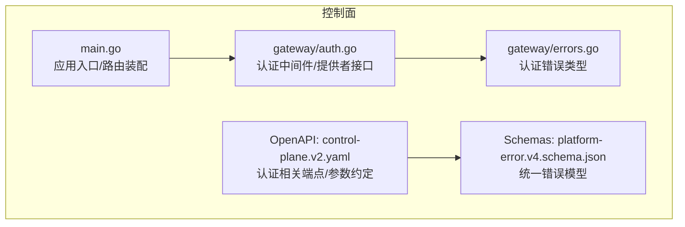
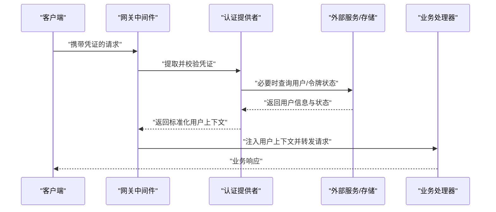
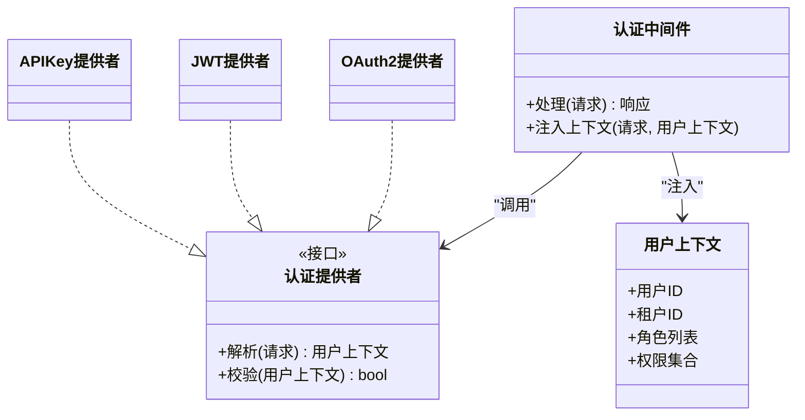
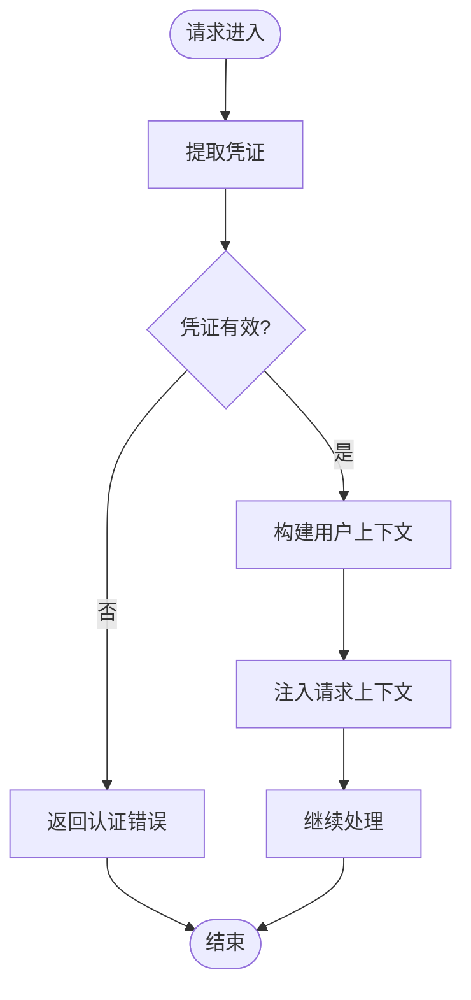
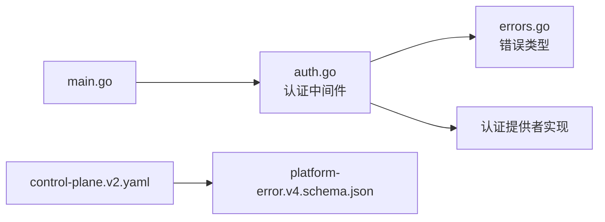

# 认证插件

<cite>
**本文引用的文件**   
- [apps/control-plane/internal/gateway/auth.go](file://apps/control-plane/internal/gateway/auth.go)
- [apps/control-plane/internal/gateway/errors.go](file://apps/control-plane/internal/gateway/errors.go)
- [contracts/openapi/control-plane.v2.yaml](file://contracts/openapi/control-plane.v2.yaml)
- [contracts/schemas/platform-error.v4.schema.json](file://contracts/schemas/platform-error.v4.schema.json)
- [apps/control-plane/cmd/control-plane/main.go](file://apps/control-plane/cmd/control-plane/main.go)
</cite>

## 目录
1. [简介](#简介)
2. [项目结构](#项目结构)
3. [核心组件](#核心组件)
4. [架构总览](#架构总览)
5. [详细组件分析](#详细组件分析)
6. [依赖关系分析](#依赖关系分析)
7. [性能考虑](#性能考虑)
8. [故障排查指南](#故障排查指南)
9. [结论](#结论)
10. [附录](#附录)

## 简介
本文件面向 NeKiro 平台的“认证插件”开发，聚焦控制面网关层的认证中间件接口设计与扩展机制。文档覆盖：
- 支持的认证协议与实现原理（OAuth2、JWT、API Key）
- 自定义认证提供者的开发指南（用户信息获取、权限验证、会话管理）
- 认证流程集成方式（请求拦截、令牌验证、用户上下文传递）
- 多租户隔离与安全最佳实践
- 常见认证场景的实现示例与配置方法
- 认证失败处理与错误响应格式

## 项目结构
NeKiro 控制面在网关层集中实现认证与鉴权相关逻辑，并通过 OpenAPI 契约定义对外接口与错误模型。关键位置如下：
- 网关认证中间件与错误定义位于控制面内部网关模块
- 平台错误模型通过 JSON Schema 统一约束
- 控制面入口负责组装路由与中间件链

图表来源
- [apps/control-plane/cmd/control-plane/main.go](file://apps/control-plane/cmd/control-plane/main.go)
- [apps/control-plane/internal/gateway/auth.go](file://apps/control-plane/internal/gateway/auth.go)
- [apps/control-plane/internal/gateway/errors.go](file://apps/control-plane/internal/gateway/errors.go)
- [contracts/openapi/control-plane.v2.yaml](file://contracts/openapi/control-plane.v2.yaml)
- [contracts/schemas/platform-error.v4.schema.json](file://contracts/schemas/platform-error.v4.schema.json)

章节来源
- [apps/control-plane/cmd/control-plane/main.go](file://apps/control-plane/cmd/control-plane/main.go)
- [apps/control-plane/internal/gateway/auth.go](file://apps/control-plane/internal/gateway/auth.go)
- [apps/control-plane/internal/gateway/errors.go](file://apps/control-plane/internal/gateway/errors.go)
- [contracts/openapi/control-plane.v2.yaml](file://contracts/openapi/control-plane.v2.yaml)
- [contracts/schemas/platform-error.v4.schema.json](file://contracts/schemas/platform-error.v4.schema.json)

## 核心组件
- 认证提供者接口
  - 用于抽象不同认证协议的解析与校验逻辑，包括 OAuth2、JWT、API Key 等
  - 典型职责：从请求中提取凭证、校验签名/有效性、返回标准化用户上下文
- 认证中间件
  - 在请求进入业务处理器前执行，调用认证提供者完成身份识别
  - 将解析后的用户上下文注入到请求上下文，供后续鉴权与业务使用
- 错误模型
  - 统一的平台错误响应结构，由 JSON Schema 约束，确保客户端可一致消费
- 配置与装配
  - 通过配置选择启用的认证提供者，并在入口中注册中间件链

章节来源
- [apps/control-plane/internal/gateway/auth.go](file://apps/control-plane/internal/gateway/auth.go)
- [apps/control-plane/internal/gateway/errors.go](file://apps/control-plane/internal/gateway/errors.go)
- [contracts/schemas/platform-error.v4.schema.json](file://contracts/schemas/platform-error.v4.schema.json)

## 架构总览
下图展示一次受保护 API 请求的认证流程，从请求进入网关到用户上下文注入的全过程。

图表来源
- [apps/control-plane/internal/gateway/auth.go](file://apps/control-plane/internal/gateway/auth.go)
- [apps/control-plane/cmd/control-plane/main.go](file://apps/control-plane/cmd/control-plane/main.go)

## 详细组件分析

### 认证提供者接口设计
- 目标
  - 以统一接口封装多种认证协议（OAuth2、JWT、API Key），便于按需启用与替换
- 主要职责
  - 凭证提取：从请求头、查询参数或主体中定位凭证
  - 凭证校验：校验签名、有效期、吊销状态等
  - 用户上下文构建：输出包含用户标识、租户标识、角色/权限集合的结构化上下文
- 扩展点
  - 新增认证协议时，仅需实现该接口并注册到中间件链
  - 支持按路径或策略选择不同提供者（例如 /admin 强制 JWT，公开接口允许 API Key）

图表来源
- [apps/control-plane/internal/gateway/auth.go](file://apps/control-plane/internal/gateway/auth.go)

章节来源
- [apps/control-plane/internal/gateway/auth.go](file://apps/control-plane/internal/gateway/auth.go)

### 支持的认证协议与实现原理
- OAuth2
  - 适用场景：第三方授权码/客户端凭据模式
  - 关键点：访问令牌校验、可选的用户信息端点拉取、刷新令牌管理
- JWT
  - 适用场景：无状态令牌、跨服务传播
  - 关键点：公钥校验、过期时间、签发者白名单、载荷字段映射为用户上下文
- API Key
  - 适用场景：服务端对服务端、简单密钥校验
  - 关键点：密钥哈希比对、速率限制、租户绑定

章节来源
- [apps/control-plane/internal/gateway/auth.go](file://apps/control-plane/internal/gateway/auth.go)

### 自定义认证提供者开发指南
- 步骤概览
  1. 实现认证提供者接口（解析、校验、构造用户上下文）
  2. 注册到认证中间件链（可通过配置开关）
  3. 在需要的位置指定使用策略（全局或按路由）
- 用户信息获取
  - 优先本地缓存/快速校验；必要时异步拉取远端用户信息
- 权限验证
  - 建议将角色/权限放入用户上下文，由后续鉴权中间件或业务层判断
- 会话管理
  - 若需会话，建议在网关层生成短期会话令牌并安全存储，避免在每次请求中重复复杂校验

章节来源
- [apps/control-plane/internal/gateway/auth.go](file://apps/control-plane/internal/gateway/auth.go)

### 认证流程集成方式
- 请求拦截
  - 在路由装配阶段插入认证中间件，统一拦截受保护路径
- 令牌验证
  - 中间件委托给具体认证提供者完成校验
- 用户上下文传递
  - 将用户上下文注入请求上下文，供下游处理器读取

图表来源
- [apps/control-plane/internal/gateway/auth.go](file://apps/control-plane/internal/gateway/auth.go)

章节来源
- [apps/control-plane/internal/gateway/auth.go](file://apps/control-plane/internal/gateway/auth.go)

### 多租户认证隔离
- 租户标识来源
  - 可从 JWT 载荷、API Key 元数据或 OAuth2 用户信息中获取
- 隔离策略
  - 在用户上下文中携带租户 ID，所有资源访问均基于租户进行二次校验
  - 数据库与缓存键空间按租户隔离，防止越权访问
- 审计与追踪
  - 记录租户 ID 与用户 ID，便于问题定位与合规审计

章节来源
- [apps/control-plane/internal/gateway/auth.go](file://apps/control-plane/internal/gateway/auth.go)

### 安全最佳实践
- 传输安全
  - 全链路 HTTPS，禁止明文传输敏感凭证
- 令牌安全
  - 严格校验签发者、算法白名单、过期时间与签名
- 最小权限
  - 仅授予必要权限，结合 RBAC/ABAC 做细粒度控制
- 速率限制与防重放
  - 针对 API Key 与登录接口实施限流与重试防护
- 日志脱敏
  - 不记录完整令牌或密钥，仅记录必要标识与结果

[本节为通用指导，无需代码来源]

### 常见认证场景与配置方法
- 场景一：管理员控制台使用 JWT
  - 配置启用 JWT 提供者，设置公钥与签发者白名单
  - 对 /admin 路径强制要求 JWT
- 场景二：开放 API 使用 API Key
  - 配置 API Key 提供者，维护密钥白名单与租户映射
  - 对公开接口路径启用 API Key 校验
- 场景三：第三方集成使用 OAuth2
  - 配置 OAuth2 提供者，设置客户端凭据与用户信息端点
  - 对特定业务域启用 OAuth2 校验

章节来源
- [apps/control-plane/internal/gateway/auth.go](file://apps/control-plane/internal/gateway/auth.go)

### 认证失败处理与错误响应格式
- 失败分类
  - 未携带凭证、凭证无效、令牌过期、权限不足等
- 错误响应
  - 采用平台统一错误模型，遵循 JSON Schema 约束
- 客户端处理建议
  - 根据错误码与消息提示用户或触发刷新/重新登录流程

章节来源
- [apps/control-plane/internal/gateway/errors.go](file://apps/control-plane/internal/gateway/errors.go)
- [contracts/schemas/platform-error.v4.schema.json](file://contracts/schemas/platform-error.v4.schema.json)

## 依赖关系分析
- 组件耦合
  - 认证中间件依赖认证提供者接口，低耦合、高内聚
  - 错误模型独立于业务，便于统一消费
- 外部依赖
  - 可能依赖外部用户服务、密钥库、公钥分发端点等
- 循环依赖
  - 通过接口解耦，避免中间件与提供者之间的直接循环引用

图表来源
- [apps/control-plane/cmd/control-plane/main.go](file://apps/control-plane/cmd/control-plane/main.go)
- [apps/control-plane/internal/gateway/auth.go](file://apps/control-plane/internal/gateway/auth.go)
- [apps/control-plane/internal/gateway/errors.go](file://apps/control-plane/internal/gateway/errors.go)
- [contracts/openapi/control-plane.v2.yaml](file://contracts/openapi/control-plane.v2.yaml)
- [contracts/schemas/platform-error.v4.schema.json](file://contracts/schemas/platform-error.v4.schema.json)

章节来源
- [apps/control-plane/cmd/control-plane/main.go](file://apps/control-plane/cmd/control-plane/main.go)
- [apps/control-plane/internal/gateway/auth.go](file://apps/control-plane/internal/gateway/auth.go)
- [apps/control-plane/internal/gateway/errors.go](file://apps/control-plane/internal/gateway/errors.go)
- [contracts/openapi/control-plane.v2.yaml](file://contracts/openapi/control-plane.v2.yaml)
- [contracts/schemas/platform-error.v4.schema.json](file://contracts/schemas/platform-error.v4.schema.json)

## 性能考虑
- 减少远程调用
  - 对 JWT 等无状态令牌尽量本地校验；对 API Key 使用内存缓存
- 并发与锁
  - 高频校验路径避免全局锁，使用局部缓存与原子操作
- 超时与熔断
  - 对远端用户信息拉取设置合理超时与降级策略
- 连接池
  - 复用 HTTP 客户端与数据库连接，降低握手开销

[本节为通用指导，无需代码来源]

## 故障排查指南
- 常见问题
  - 证书/公钥配置错误导致 JWT 校验失败
  - API Key 未正确绑定租户导致鉴权失败
  - OAuth2 用户信息端点不可用导致上下文缺失
- 定位手段
  - 检查认证中间件日志与错误码
  - 核对 OpenAPI 契约中的认证参数与错误模型
  - 使用测试用例复现并逐步缩小范围

章节来源
- [apps/control-plane/internal/gateway/errors.go](file://apps/control-plane/internal/gateway/errors.go)
- [contracts/openapi/control-plane.v2.yaml](file://contracts/openapi/control-plane.v2.yaml)
- [contracts/schemas/platform-error.v4.schema.json](file://contracts/schemas/platform-error.v4.schema.json)

## 结论
通过统一的认证提供者接口与中间件机制，NeKiro 控制面能够灵活接入多种认证协议，并以一致的上下文形式传递给下游。配合统一错误模型与多租户隔离策略，可在保证安全性的同时提升可扩展性与可维护性。

[本节为总结性内容，无需代码来源]

## 附录
- 术语
  - 认证：确认用户或系统身份
  - 鉴权：基于身份决定访问权限
  - 用户上下文：包含用户标识、租户、角色与权限的结构化信息
- 参考契约
  - 控制面 OpenAPI 契约与平台错误模型定义

[本节为补充说明，无需代码来源]