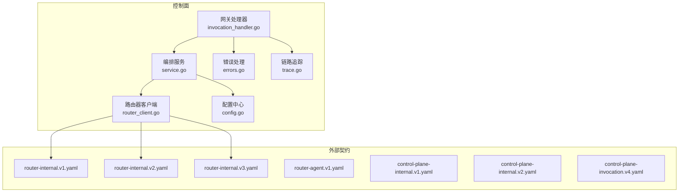
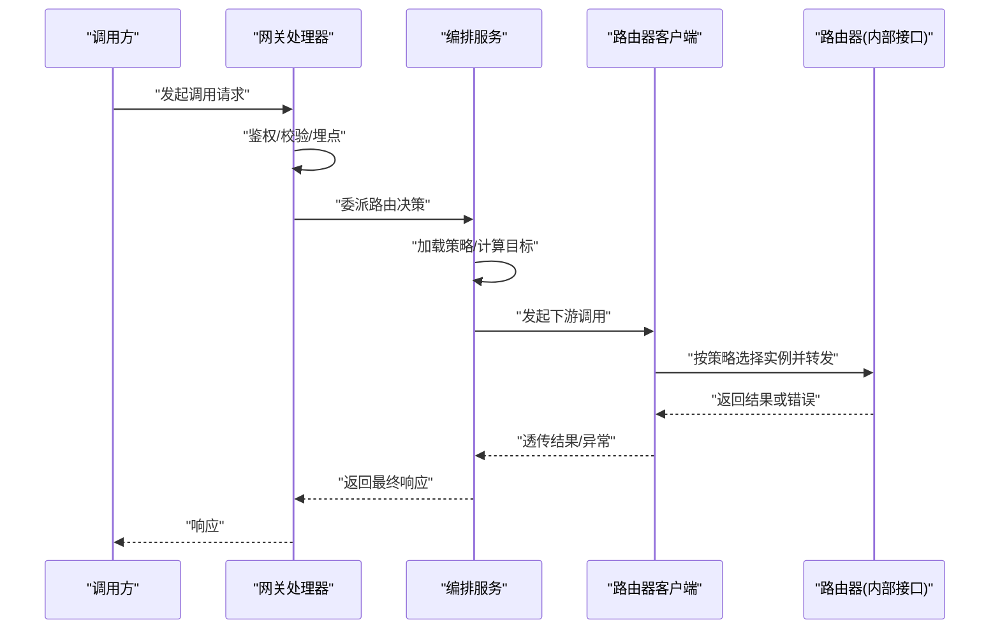
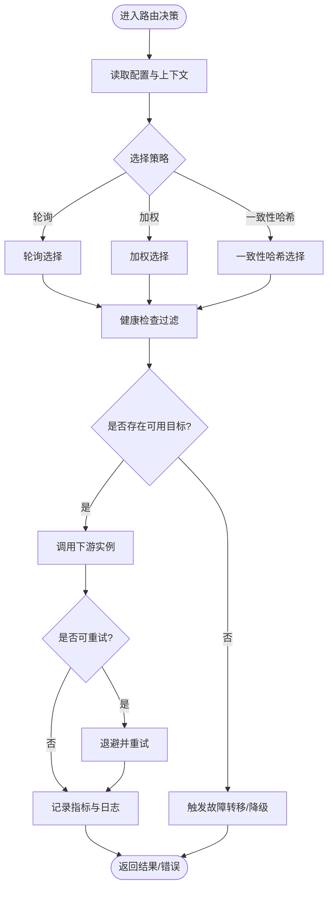
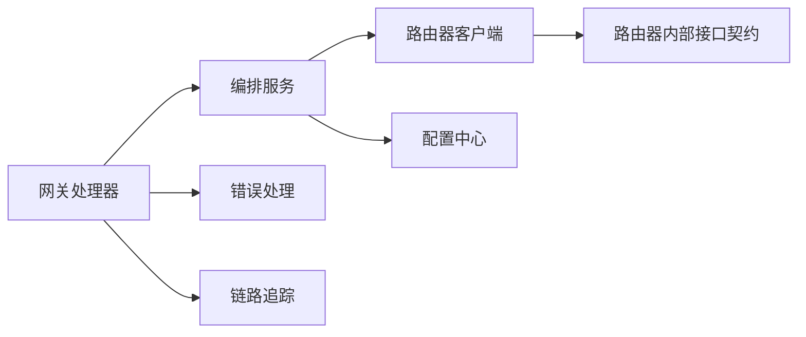

# 路由插件

<cite>
**本文引用的文件**   
- [router-internal.v1.yaml](file://contracts/openapi/router-internal.v1.yaml)
- [router-internal.v2.yaml](file://contracts/openapi/router-internal.v2.yaml)
- [router-internal.v3.yaml](file://contracts/openapi/router-internal.v3.yaml)
- [router-agent.v1.yaml](file://contracts/openapi/router-agent.v1.yaml)
- [control-plane-internal.v1.yaml](file://contracts/openapi/control-plane-internal.v1.yaml)
- [control-plane-internal.v2.yaml](file://contracts/openapi/control-plane-internal.v2.yaml)
- [control-plane-invocation.v4.yaml](file://contracts/openapi/control-plane-invocation.v4.yaml)
- [invocation_handler.go](file://apps/control-plane/internal/gateway/invocation_handler.go)
- [router_client.go](file://apps/control-plane/internal/invocation/router_client.go)
- [service.go](file://apps/control-plane/internal/invocation/service.go)
- [config.go](file://apps/control-plane/internal/config/config.go)
- [errors.go](file://apps/control-plane/internal/gateway/errors.go)
- [trace.go](file://apps/control-plane/internal/gateway/trace.go)
</cite>

## 目录
1. [简介](#简介)
2. [项目结构](#项目结构)
3. [核心组件](#核心组件)
4. [架构总览](#架构总览)
5. [详细组件分析](#详细组件分析)
6. [依赖分析](#依赖分析)
7. [性能考虑](#性能考虑)
8. [故障排查指南](#故障排查指南)
9. [结论](#结论)
10. [附录](#附录)

## 简介
本文件面向 NeKiro 平台的路由插件开发者，聚焦“调用路由器”的接口设计与扩展点，说明负载均衡算法、故障转移与重试机制的插件化实现方式，并提供自定义路由策略（含健康检查、流量控制、熔断降级）的开发示例。文档同时覆盖路由决策执行流程、动态配置与热重载、监控指标与日志记录的最佳实践。

## 项目结构
NeKiro 的控制面包含网关层、编排层与内部客户端，用于发起对“路由器”的内部调用；OpenAPI 契约定义了路由器与控制面之间的内部接口版本演进。

图表来源
- [invocation_handler.go](file://apps/control-plane/internal/gateway/invocation_handler.go)
- [service.go](file://apps/control-plane/internal/invocation/service.go)
- [router_client.go](file://apps/control-plane/internal/invocation/router_client.go)
- [config.go](file://apps/control-plane/internal/config/config.go)
- [errors.go](file://apps/control-plane/internal/gateway/errors.go)
- [trace.go](file://apps/control-plane/internal/gateway/trace.go)
- [router-internal.v1.yaml](file://contracts/openapi/router-internal.v1.yaml)
- [router-internal.v2.yaml](file://contracts/openapi/router-internal.v2.yaml)
- [router-internal.v3.yaml](file://contracts/openapi/router-internal.v3.yaml)
- [router-agent.v1.yaml](file://contracts/openapi/router-agent.v1.yaml)
- [control-plane-internal.v1.yaml](file://contracts/openapi/control-plane-internal.v1.yaml)
- [control-plane-internal.v2.yaml](file://contracts/openapi/control-plane-internal.v2.yaml)
- [control-plane-invocation.v4.yaml](file://contracts/openapi/control-plane-invocation.v4.yaml)

章节来源
- [invocation_handler.go](file://apps/control-plane/internal/gateway/invocation_handler.go)
- [service.go](file://apps/control-plane/internal/invocation/service.go)
- [router_client.go](file://apps/control-plane/internal/invocation/router_client.go)
- [config.go](file://apps/control-plane/internal/config/config.go)
- [errors.go](file://apps/control-plane/internal/gateway/errors.go)
- [trace.go](file://apps/control-plane/internal/gateway/trace.go)
- [router-internal.v1.yaml](file://contracts/openapi/router-internal.v1.yaml)
- [router-internal.v2.yaml](file://contracts/openapi/router-internal.v2.yaml)
- [router-internal.v3.yaml](file://contracts/openapi/router-internal.v3.yaml)
- [router-agent.v1.yaml](file://contracts/openapi/router-agent.v1.yaml)
- [control-plane-internal.v1.yaml](file://contracts/openapi/control-plane-internal.v1.yaml)
- [control-plane-internal.v2.yaml](file://contracts/openapi/control-plane-internal.v2.yaml)
- [control-plane-invocation.v4.yaml](file://contracts/openapi/control-plane-invocation.v4.yaml)

## 核心组件
- 网关处理器：接收上层请求，完成鉴权、参数校验、链路追踪与错误归一化，随后委托编排服务进行路由决策。
- 编排服务：聚合上下文、选择并加载路由策略、协调重试与故障转移、收集指标与埋点。
- 路由器客户端：封装对路由器内部接口的调用，负责协议适配、超时控制、重试与熔断边界。
- 配置中心：提供运行时可观测的配置项（如策略开关、阈值、权重等），支持热更新。
- 错误处理：统一错误码与语义，便于上游消费与告警。
- 链路追踪：注入 trace/span 信息，贯穿路由决策与下游调用。

章节来源
- [invocation_handler.go](file://apps/control-plane/internal/gateway/invocation_handler.go)
- [service.go](file://apps/control-plane/internal/invocation/service.go)
- [router_client.go](file://apps/control-plane/internal/invocation/router_client.go)
- [config.go](file://apps/control-plane/internal/config/config.go)
- [errors.go](file://apps/control-plane/internal/gateway/errors.go)
- [trace.go](file://apps/control-plane/internal/gateway/trace.go)

## 架构总览
下图展示了从网关到路由器的关键调用链路与扩展点位置。

图表来源
- [invocation_handler.go](file://apps/control-plane/internal/gateway/invocation_handler.go)
- [service.go](file://apps/control-plane/internal/invocation/service.go)
- [router_client.go](file://apps/control-plane/internal/invocation/router_client.go)
- [router-internal.v3.yaml](file://contracts/openapi/router-internal.v3.yaml)

## 详细组件分析

### 路由器内部接口与版本演进
- 内部接口契约定义在 OpenAPI 中，控制面通过路由器客户端调用。建议优先使用最新稳定版本，并在兼容期内保留旧版本适配。
- 典型能力包括：路由发现、策略下发、实例健康状态上报、元数据查询、限流/熔断状态同步等。

章节来源
- [router-internal.v1.yaml](file://contracts/openapi/router-internal.v1.yaml)
- [router-internal.v2.yaml](file://contracts/openapi/router-internal.v2.yaml)
- [router-internal.v3.yaml](file://contracts/openapi/router-internal.v3.yaml)
- [router-agent.v1.yaml](file://contracts/openapi/router-agent.v1.yaml)

### 网关处理器（入口与横切关注点）
职责
- 解析请求、鉴权、参数校验
- 注入链路追踪上下文
- 错误归一化与响应包装
- 将业务路由逻辑委派给编排服务

扩展点
- 新增鉴权策略、审计日志、请求/响应脱敏、速率限制前置拦截器等

章节来源
- [invocation_handler.go](file://apps/control-plane/internal/gateway/invocation_handler.go)
- [errors.go](file://apps/control-plane/internal/gateway/errors.go)
- [trace.go](file://apps/control-plane/internal/gateway/trace.go)

### 编排服务（路由决策中枢）
职责
- 聚合上下文（租户、工作区、能力、负载信息等）
- 选择并加载路由策略（轮询、加权、一致性哈希等）
- 协调重试与故障转移
- 采集指标与埋点（耗时、成功率、失败原因分布等）

扩展点
- 策略注册表：以键值形式注册新策略
- 策略工厂：根据配置动态创建策略实例
- 生命周期钩子：策略初始化、预热、优雅关闭

章节来源
- [service.go](file://apps/control-plane/internal/invocation/service.go)
- [config.go](file://apps/control-plane/internal/config/config.go)

### 路由器客户端（下游调用封装）
职责
- 基于策略选择具体实例
- 设置超时、重试、熔断、退避
- 序列化/反序列化、错误映射
- 暴露可观测性（指标、日志、追踪）

扩展点
- 传输层抽象：HTTP/gRPC/自定义协议
- 重试与熔断策略注入
- 健康检查探针集成

章节来源
- [router_client.go](file://apps/control-plane/internal/invocation/router_client.go)
- [router-internal.v3.yaml](file://contracts/openapi/router-internal.v3.yaml)

### 负载均衡算法插件
设计要点
- 策略接口：提供“选择下一个实例”的方法，输入为候选集合与上下文，输出为目标实例。
- 内置策略
  - 轮询：按顺序循环选择，适合无差异实例集。
  - 加权：依据权重分配流量，支持动态权重调整。
  - 一致性哈希：基于请求特征（如用户 ID、会话 ID）做稳定映射，利于缓存命中与会话保持。
- 扩展方式
  - 在策略注册表中登记新策略键名与构造器
  - 通过配置中心下发策略名称与参数（如权重表、哈希桶数）
  - 支持运行时切换策略（需保证幂等与原子切换）

章节来源
- [service.go](file://apps/control-plane/internal/invocation/service.go)
- [config.go](file://apps/control-plane/internal/config/config.go)

### 故障转移与重试机制（插件化）
设计要点
- 重试策略：固定间隔、指数退避、抖动、最大次数、可重试错误类型白名单。
- 故障转移：当主实例不可用或错误率超阈时，自动切换到备用实例或降级路径。
- 熔断器：基于滑动窗口统计错误率/延迟，达到阈值后快速失败，周期性探测恢复。
- 组合模式：重试→故障转移→熔断，形成弹性调用链。

章节来源
- [router_client.go](file://apps/control-plane/internal/invocation/router_client.go)
- [service.go](file://apps/control-plane/internal/invocation/service.go)

### 自定义路由策略开发示例（健康检查、流量控制、熔断降级）
步骤
- 定义策略元数据：名称、版本、参数 schema、默认值。
- 实现策略接口：提供选择实例、预热、刷新、关闭等方法。
- 接入健康检查：定期探测实例存活与延迟，剔除不健康节点。
- 接入流量控制：令牌桶/漏桶/滑动窗口限流，结合策略权重进行分流。
- 接入熔断降级：错误率/慢调用比例触发熔断，降级返回兜底结果或走备用策略。
- 注册与热更新：在策略注册表中登记，监听配置变更事件，原子替换策略实例。

章节来源
- [service.go](file://apps/control-plane/internal/invocation/service.go)
- [config.go](file://apps/control-plane/internal/config/config.go)

### 路由决策执行流程

[此图为概念流程图，无需图表来源]

## 依赖分析
- 控制面内部依赖关系
  - 网关处理器依赖编排服务与错误/追踪模块
  - 编排服务依赖配置中心与路由器客户端
  - 路由器客户端依赖路由器内部接口契约
- 外部契约依赖
  - router-internal.* 系列定义路由器内部 API
  - control-plane-* 系列定义控制面对外/对内接口
  - router-agent.v1 定义路由器侧 Agent 能力

图表来源
- [invocation_handler.go](file://apps/control-plane/internal/gateway/invocation_handler.go)
- [service.go](file://apps/control-plane/internal/invocation/service.go)
- [router_client.go](file://apps/control-plane/internal/invocation/router_client.go)
- [config.go](file://apps/control-plane/internal/config/config.go)
- [errors.go](file://apps/control-plane/internal/gateway/errors.go)
- [trace.go](file://apps/control-plane/internal/gateway/trace.go)
- [router-internal.v1.yaml](file://contracts/openapi/router-internal.v1.yaml)
- [router-internal.v2.yaml](file://contracts/openapi/router-internal.v2.yaml)
- [router-internal.v3.yaml](file://contracts/openapi/router-internal.v3.yaml)
- [control-plane-internal.v1.yaml](file://contracts/openapi/control-plane-internal.v1.yaml)
- [control-plane-internal.v2.yaml](file://contracts/openapi/control-plane-internal.v2.yaml)
- [control-plane-invocation.v4.yaml](file://contracts/openapi/control-plane-invocation.v4.yaml)

章节来源
- [invocation_handler.go](file://apps/control-plane/internal/gateway/invocation_handler.go)
- [service.go](file://apps/control-plane/internal/invocation/service.go)
- [router_client.go](file://apps/control-plane/internal/invocation/router_client.go)
- [config.go](file://apps/control-plane/internal/config/config.go)
- [errors.go](file://apps/control-plane/internal/gateway/errors.go)
- [trace.go](file://apps/control-plane/internal/gateway/trace.go)
- [router-internal.v1.yaml](file://contracts/openapi/router-internal.v1.yaml)
- [router-internal.v2.yaml](file://contracts/openapi/router-internal.v2.yaml)
- [router-internal.v3.yaml](file://contracts/openapi/router-internal.v3.yaml)
- [control-plane-internal.v1.yaml](file://contracts/openapi/control-plane-internal.v1.yaml)
- [control-plane-internal.v2.yaml](file://contracts/openapi/control-plane-internal.v2.yaml)
- [control-plane-invocation.v4.yaml](file://contracts/openapi/control-plane-invocation.v4.yaml)

## 性能考虑
- 策略选择复杂度
  - 轮询：O(1)
  - 加权：O(n) 或 O(log n)（使用堆/树优化）
  - 一致性哈希：O(log n)（环形结构+二分查找）
- 并发与锁
  - 策略实例应线程安全，避免全局锁；必要时采用分片或无锁数据结构
- 连接复用与超时
  - 复用底层连接池，合理设置读写超时与空闲回收
- 指标采样
  - 高吞吐场景下采用概率采样或自适应采样，降低开销
- 内存与对象复用
  - 重用上下文与缓冲区，减少 GC 压力

[本节为通用指导，无需章节来源]

## 故障排查指南
- 常见问题定位
  - 路由未生效：检查策略注册与配置热更新是否成功
  - 实例不可用：查看健康检查探针与剔除规则
  - 重试风暴：确认退避与抖动参数，避免雪崩
  - 熔断误触发：核对错误率/慢调用阈值与时间窗口
- 可观测性建议
  - 指标：QPS、P99/P95 延迟、错误率、重试次数、熔断状态、策略命中率
  - 日志：结构化字段包含 trace_id、strategy、target、error_code、latency_ms
  - 追踪：跨网关、编排、客户端、下游的全链路 span
- 快速恢复
  - 临时回滚策略或权重
  - 开启降级路径或只读副本
  - 隔离故障实例，逐步放量恢复

章节来源
- [errors.go](file://apps/control-plane/internal/gateway/errors.go)
- [trace.go](file://apps/control-plane/internal/gateway/trace.go)
- [router_client.go](file://apps/control-plane/internal/invocation/router_client.go)
- [service.go](file://apps/control-plane/internal/invocation/service.go)

## 结论
通过统一的策略注册与工厂机制，NeKiro 路由插件体系实现了负载均衡、故障转移、重试与熔断的可插拔化。配合健康检查、流量控制与熔断降级的组合，可在复杂生产环境中获得高可用与高性能。建议在上线前完善指标与日志规范，并通过灰度与压测验证策略效果。

[本节为总结，无需章节来源]

## 附录

### 动态路由配置与热重载
- 配置项建议
  - 策略名称与版本
  - 权重表/哈希键映射
  - 重试次数、退避策略、熔断阈值
  - 健康检查周期与阈值
- 热重载流程
  - 监听配置变更事件
  - 构建新策略实例并原子替换
  - 平滑过渡：旧实例继续服务直至无活跃请求
  - 失败回滚：新实例初始化失败则回退至旧实例

章节来源
- [config.go](file://apps/control-plane/internal/config/config.go)
- [service.go](file://apps/control-plane/internal/invocation/service.go)

### 监控指标与日志最佳实践
- 指标维度
  - 路由维度：策略名、目标实例、租户/工作区
  - 质量维度：延迟分位、错误分类、重试/熔断计数
  - 容量维度：并发、队列长度、资源占用
- 日志规范
  - 必含字段：trace_id、span_id、strategy、target、error_code、latency_ms
  - 敏感信息脱敏，避免泄露密钥与个人信息
  - 分级输出：DEBUG/INFO/WARN/ERROR，控制不同环境级别

章节来源
- [trace.go](file://apps/control-plane/internal/gateway/trace.go)
- [errors.go](file://apps/control-plane/internal/gateway/errors.go)
- [router_client.go](file://apps/control-plane/internal/invocation/router_client.go)