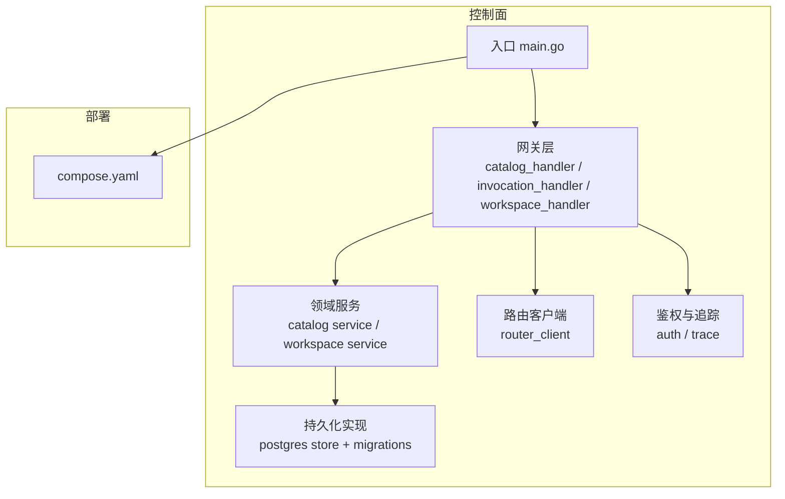
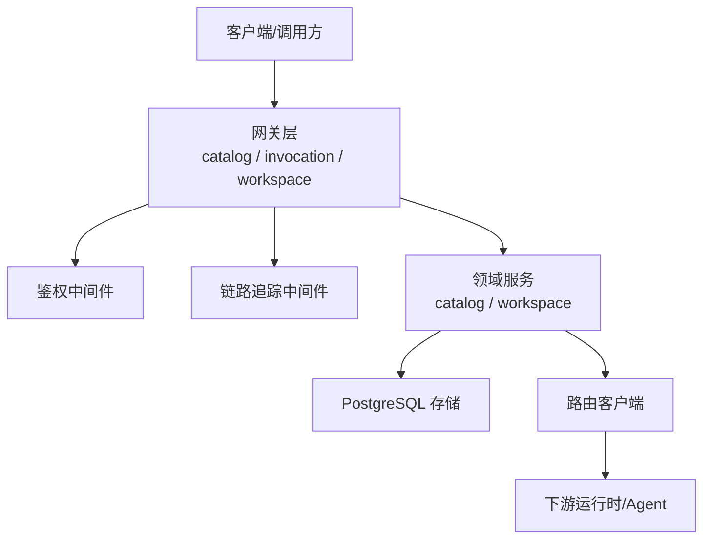
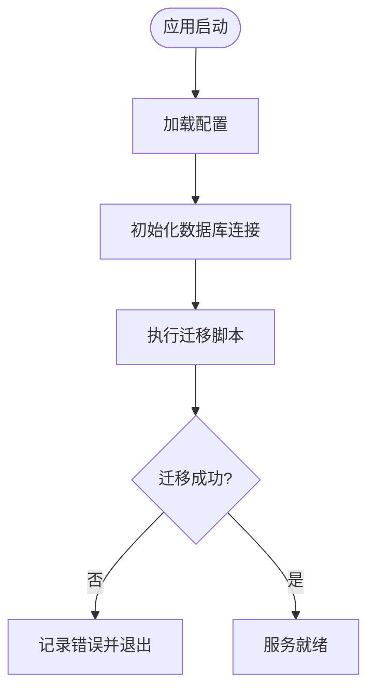
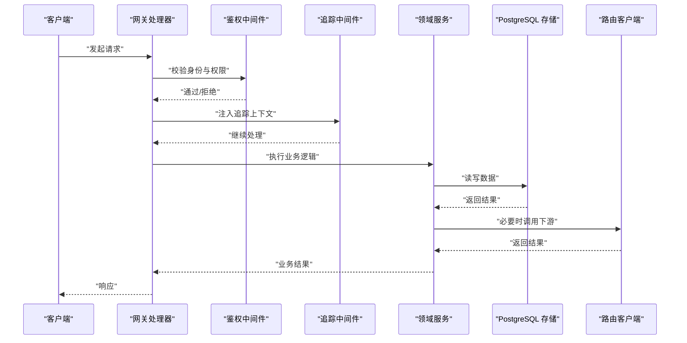
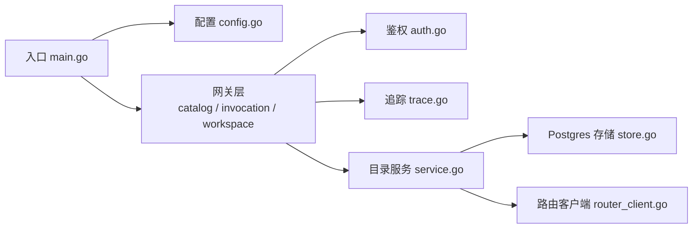

# 自定义实现

<cite>
**本文引用的文件**   
- [README.md](file://README.md)
- [main.go](file://apps/control-plane/cmd/control-plane/main.go)
- [config.go](file://apps/control-plane/internal/config/config.go)
- [store.go](file://apps/control-plane/internal/catalog/postgres/store.go)
- [migrations.go](file://apps/control-plane/internal/catalog/postgres/migrations.go)
- [001_catalog.sql](file://apps/control-plane/migrations/001_catalog.sql)
- [002_card_text.sql](file://apps/control-plane/migrations/002_card_text.sql)
- [003_workspace.sql](file://apps/control-plane/migrations/003_workspace.sql)
- [service.go](file://apps/control-plane/internal/catalog/service.go)
- [catalog_handler.go](file://apps/control-plane/internal/gateway/catalog_handler.go)
- [invocation_handler.go](file://apps/control-plane/internal/gateway/invocation_handler.go)
- [workspace_handler.go](file://apps/control-plane/internal/gateway/workspace_handler.go)
- [auth.go](file://apps/control-plane/internal/gateway/auth.go)
- [trace.go](file://apps/control-plane/internal/gateway/trace.go)
- [router_client.go](file://apps/control-plane/internal/invocation/router_client.go)
- [compose.yaml](file://deploy/compose.yaml)
</cite>

## 目录
1. [简介](#简介)
2. [项目结构](#项目结构)
3. [核心组件](#核心组件)
4. [架构总览](#架构总览)
5. [详细组件分析](#详细组件分析)
6. [依赖分析](#依赖分析)
7. [性能考虑](#性能考虑)
8. [故障排查指南](#故障排查指南)
9. [结论](#结论)
10. [附录](#附录)

## 简介
本指南面向需要在 NeKiro 平台上进行二次开发与扩展的工程师，围绕以下目标提供可操作的实践与最佳实践：
- 扩展平台功能：自定义业务逻辑、数据处理管道与外部系统集成
- 配置系统扩展：支持动态配置与配置中心集成
- 数据库扩展点：自定义表结构、查询优化与数据迁移
- 消息队列与事件驱动：基于现有网关与服务编排扩展异步处理
- 监控与日志：定制采集、追踪与告警策略
- 性能调优与资源管理：并发、连接池、缓存与限流
- 安全策略：认证、鉴权与访问控制扩展
- 容器化部署：Compose 与镜像构建的定制配置

## 项目结构
NeKiro 采用多应用分层组织方式。控制面服务位于 apps/control-plane，包含入口程序、网关层、领域服务与持久化实现；迁移脚本集中存放于 migrations；部署清单位于 deploy。

图表来源
- [main.go:1-200](file://apps/control-plane/cmd/control-plane/main.go#L1-L200)
- [catalog_handler.go:1-200](file://apps/control-plane/internal/gateway/catalog_handler.go#L1-L200)
- [invocation_handler.go:1-200](file://apps/control-plane/internal/gateway/invocation_handler.go#L1-L200)
- [workspace_handler.go:1-200](file://apps/control-plane/internal/gateway/workspace_handler.go#L1-L200)
- [service.go:1-200](file://apps/control-plane/internal/catalog/service.go#L1-L200)
- [store.go:1-200](file://apps/control-plane/internal/catalog/postgres/store.go#L1-L200)
- [migrations.go:1-200](file://apps/control-plane/internal/catalog/postgres/migrations.go#L1-L200)
- [compose.yaml:1-200](file://deploy/compose.yaml#L1-L200)

章节来源
- [README.md:1-200](file://README.md#L1-L200)
- [main.go:1-200](file://apps/control-plane/cmd/control-plane/main.go#L1-L200)

## 核心组件
- 入口与生命周期管理：负责加载配置、初始化存储与迁移、启动 HTTP 网关与内部服务
- 网关层：暴露 REST/JSON-RPC 接口，承载鉴权、追踪、错误处理等横切关注点
- 领域服务：封装业务规则与编排逻辑，协调存储与外部调用
- 持久化层：PostgreSQL 存储实现与版本化迁移
- 路由客户端：与路由器或下游运行时通信，完成任务分发与结果收集
- 鉴权与追踪：统一认证校验与链路追踪注入

章节来源
- [main.go:1-200](file://apps/control-plane/cmd/control-plane/main.go#L1-L200)
- [catalog_handler.go:1-200](file://apps/control-plane/internal/gateway/catalog_handler.go#L1-L200)
- [invocation_handler.go:1-200](file://apps/control-plane/internal/gateway/invocation_handler.go#L1-L200)
- [workspace_handler.go:1-200](file://apps/control-plane/internal/gateway/workspace_handler.go#L1-L200)
- [auth.go:1-200](file://apps/control-plane/internal/gateway/auth.go#L1-L200)
- [trace.go:1-200](file://apps/control-plane/internal/gateway/trace.go#L1-L200)
- [service.go:1-200](file://apps/control-plane/internal/catalog/service.go#L1-L200)
- [store.go:1-200](file://apps/control-plane/internal/catalog/postgres/store.go#L1-L200)
- [migrations.go:1-200](file://apps/control-plane/internal/catalog/postgres/migrations.go#L1-L200)
- [router_client.go:1-200](file://apps/control-plane/internal/invocation/router_client.go#L1-L200)

## 架构总览
控制面作为中枢，对外提供能力注册、工作区管理与任务编排接口，对内通过存储抽象访问 PostgreSQL，并通过路由客户端与执行侧交互。

图表来源
- [catalog_handler.go:1-200](file://apps/control-plane/internal/gateway/catalog_handler.go#L1-L200)
- [invocation_handler.go:1-200](file://apps/control-plane/internal/gateway/invocation_handler.go#L1-L200)
- [workspace_handler.go:1-200](file://apps/control-plane/internal/gateway/workspace_handler.go#L1-L200)
- [auth.go:1-200](file://apps/control-plane/internal/gateway/auth.go#L1-L200)
- [trace.go:1-200](file://apps/control-plane/internal/gateway/trace.go#L1-L200)
- [service.go:1-200](file://apps/control-plane/internal/catalog/service.go#L1-L200)
- [store.go:1-200](file://apps/control-plane/internal/catalog/postgres/store.go#L1-L200)
- [router_client.go:1-200](file://apps/control-plane/internal/invocation/router_client.go#L1-L200)

## 详细组件分析

### 配置系统扩展（动态配置与配置中心）
- 现状与扩展点
  - 配置加载入口位于配置模块，建议在此处增加环境变量覆盖、配置文件热更新与远程配置源拉取
  - 在入口程序中，将配置对象注入到网关、服务与存储初始化流程中
- 推荐做法
  - 使用结构化配置对象，按环境区分默认值与覆盖项
  - 引入配置变更监听器，触发服务级重连或缓存刷新
  - 对敏感信息采用密钥管理服务注入
- 关键位置参考
  - 配置定义与测试：[config.go](file://apps/control-plane/internal/config/config.go)
  - 入口装配：[main.go](file://apps/control-plane/cmd/control-plane/main.go)

章节来源
- [config.go:1-200](file://apps/control-plane/internal/config/config.go#L1-L200)
- [main.go:1-200](file://apps/control-plane/cmd/control-plane/main.go#L1-L200)

### 数据库扩展点（自定义表结构、查询优化与迁移）
- 现状与扩展点
  - 存储实现位于 Postgres 包，提供 CRUD 与游标分页能力
  - 迁移脚本集中管理，遵循版本号顺序执行
- 新增表与索引
  - 在 migrations 下新增 SQL 迁移文件，确保幂等与回滚策略
  - 为高频查询字段建立合适索引，避免全表扫描
- 查询优化
  - 在服务层组合必要字段，减少 N+1 查询
  - 使用游标分页替代偏移分页，提升大数据集遍历性能
- 关键位置参考
  - 迁移入口与执行：[migrations.go](file://apps/control-plane/internal/catalog/postgres/migrations.go)
  - 迁移脚本示例：[001_catalog.sql](file://apps/control-plane/migrations/001_catalog.sql)、[002_card_text.sql](file://apps/control-plane/migrations/002_card_text.sql)、[003_workspace.sql](file://apps/control-plane/migrations/003_workspace.sql)
  - 存储实现与游标：[store.go](file://apps/control-plane/internal/catalog/postgres/store.go)

图表来源
- [migrations.go:1-200](file://apps/control-plane/internal/catalog/postgres/migrations.go#L1-L200)
- [001_catalog.sql:1-200](file://apps/control-plane/migrations/001_catalog.sql#L1-L200)
- [002_card_text.sql:1-200](file://apps/control-plane/migrations/002_card_text.sql#L1-L200)
- [003_workspace.sql:1-200](file://apps/control-plane/migrations/003_workspace.sql#L1-L200)

章节来源
- [migrations.go:1-200](file://apps/control-plane/internal/catalog/postgres/migrations.go#L1-L200)
- [store.go:1-200](file://apps/control-plane/internal/catalog/postgres/store.go#L1-L200)
- [001_catalog.sql:1-200](file://apps/control-plane/migrations/001_catalog.sql#L1-L200)
- [002_card_text.sql:1-200](file://apps/control-plane/migrations/002_card_text.sql#L1-L200)
- [003_workspace.sql:1-200](file://apps/control-plane/migrations/003_workspace.sql#L1-L200)

### 网关与业务编排（自定义业务逻辑与数据处理管道）
- 现状与扩展点
  - 网关层按能力划分处理器：目录、调用、工作区
  - 领域服务封装业务规则，调用存储与路由客户端
- 扩展建议
  - 新增处理器时，复用鉴权与追踪中间件，保持横切一致性
  - 在领域服务中实现数据处理管道，如校验、转换、聚合、重试与降级
- 关键位置参考
  - 目录处理器：[catalog_handler.go](file://apps/control-plane/internal/gateway/catalog_handler.go)
  - 调用处理器：[invocation_handler.go](file://apps/control-plane/internal/gateway/invocation_handler.go)
  - 工作区处理器：[workspace_handler.go](file://apps/control-plane/internal/gateway/workspace_handler.go)
  - 目录服务：[service.go](file://apps/control-plane/internal/catalog/service.go)

图表来源
- [catalog_handler.go:1-200](file://apps/control-plane/internal/gateway/catalog_handler.go#L1-L200)
- [invocation_handler.go:1-200](file://apps/control-plane/internal/gateway/invocation_handler.go#L1-L200)
- [workspace_handler.go:1-200](file://apps/control-plane/internal/gateway/workspace_handler.go#L1-L200)
- [auth.go:1-200](file://apps/control-plane/internal/gateway/auth.go#L1-L200)
- [trace.go:1-200](file://apps/control-plane/internal/gateway/trace.go#L1-L200)
- [service.go:1-200](file://apps/control-plane/internal/catalog/service.go#L1-L200)
- [store.go:1-200](file://apps/control-plane/internal/catalog/postgres/store.go#L1-L200)
- [router_client.go:1-200](file://apps/control-plane/internal/invocation/router_client.go#L1-L200)

章节来源
- [catalog_handler.go:1-200](file://apps/control-plane/internal/gateway/catalog_handler.go#L1-L200)
- [invocation_handler.go:1-200](file://apps/control-plane/internal/gateway/invocation_handler.go#L1-L200)
- [workspace_handler.go:1-200](file://apps/control-plane/internal/gateway/workspace_handler.go#L1-L200)
- [auth.go:1-200](file://apps/control-plane/internal/gateway/auth.go#L1-L200)
- [trace.go:1-200](file://apps/control-plane/internal/gateway/trace.go#L1-L200)
- [service.go:1-200](file://apps/control-plane/internal/catalog/service.go#L1-L200)
- [store.go:1-200](file://apps/control-plane/internal/catalog/postgres/store.go#L1-L200)
- [router_client.go:1-200](file://apps/control-plane/internal/invocation/router_client.go#L1-L200)

### 消息队列与事件驱动扩展模式
- 现状与扩展点
  - 当前代码未直接集成消息队列，建议在领域服务中引入事件发布接口，由适配器对接具体 MQ 实现
  - 通过事件解耦耗时操作，结合重试与死信队列保障可靠性
- 推荐模式
  - 在关键业务流程完成后发布领域事件
  - 消费者独立部署，具备幂等处理与补偿机制
  - 使用事务消息或出队后延迟确认保证最终一致

章节来源
- [service.go:1-200](file://apps/control-plane/internal/catalog/service.go#L1-L200)
- [invocation_handler.go:1-200](file://apps/control-plane/internal/gateway/invocation_handler.go#L1-L200)

### 监控与日志定制
- 现状与扩展点
  - 网关层已集成追踪中间件，可在其中注入指标上报与结构化日志
  - 建议在入口处统一设置日志级别与采样率
- 推荐做法
  - 为每个处理器与方法添加标准化日志字段（请求ID、用户ID、耗时）
  - 使用分布式追踪关联上下游调用链
  - 暴露健康检查与指标端点供监控系统抓取

章节来源
- [trace.go:1-200](file://apps/control-plane/internal/gateway/trace.go#L1-L200)
- [catalog_handler.go:1-200](file://apps/control-plane/internal/gateway/catalog_handler.go#L1-L200)
- [invocation_handler.go:1-200](file://apps/control-plane/internal/gateway/invocation_handler.go#L1-L200)
- [workspace_handler.go:1-200](file://apps/control-plane/internal/gateway/workspace_handler.go#L1-L200)

### 安全策略自定义实现
- 现状与扩展点
  - 网关层提供鉴权中间件，可扩展为基于令牌、证书或外部授权服务的策略
- 推荐做法
  - 统一鉴权入口，支持多策略并行校验与快速失败
  - 细粒度权限模型，结合工作区与资源维度控制
  - 对敏感输入输出进行脱敏与审计

章节来源
- [auth.go:1-200](file://apps/control-plane/internal/gateway/auth.go#L1-L200)
- [workspace_handler.go:1-200](file://apps/control-plane/internal/gateway/workspace_handler.go#L1-L200)

### 容器化部署定制
- 现状与扩展点
  - 使用 Compose 编排服务，便于本地与开发环境运行
- 推荐做法
  - 将配置以环境变量注入，支持不同环境覆盖
  - 为数据库与应用分别声明卷挂载与网络隔离
  - 增加健康检查与重启策略，提升可用性

章节来源
- [compose.yaml:1-200](file://deploy/compose.yaml#L1-L200)

## 依赖分析
控制面内部依赖关系如下：网关层依赖鉴权与追踪中间件，领域服务依赖存储与路由客户端，入口负责装配所有组件。

图表来源
- [main.go:1-200](file://apps/control-plane/cmd/control-plane/main.go#L1-L200)
- [config.go:1-200](file://apps/control-plane/internal/config/config.go#L1-L200)
- [catalog_handler.go:1-200](file://apps/control-plane/internal/gateway/catalog_handler.go#L1-L200)
- [invocation_handler.go:1-200](file://apps/control-plane/internal/gateway/invocation_handler.go#L1-L200)
- [workspace_handler.go:1-200](file://apps/control-plane/internal/gateway/workspace_handler.go#L1-L200)
- [auth.go:1-200](file://apps/control-plane/internal/gateway/auth.go#L1-L200)
- [trace.go:1-200](file://apps/control-plane/internal/gateway/trace.go#L1-L200)
- [service.go:1-200](file://apps/control-plane/internal/catalog/service.go#L1-L200)
- [store.go:1-200](file://apps/control-plane/internal/catalog/postgres/store.go#L1-L200)
- [router_client.go:1-200](file://apps/control-plane/internal/invocation/router_client.go#L1-L200)

章节来源
- [main.go:1-200](file://apps/control-plane/cmd/control-plane/main.go#L1-L200)
- [config.go:1-200](file://apps/control-plane/internal/config/config.go#L1-L200)
- [catalog_handler.go:1-200](file://apps/control-plane/internal/gateway/catalog_handler.go#L1-L200)
- [invocation_handler.go:1-200](file://apps/control-plane/internal/gateway/invocation_handler.go#L1-L200)
- [workspace_handler.go:1-200](file://apps/control-plane/internal/gateway/workspace_handler.go#L1-L200)
- [auth.go:1-200](file://apps/control-plane/internal/gateway/auth.go#L1-L200)
- [trace.go:1-200](file://apps/control-plane/internal/gateway/trace.go#L1-L200)
- [service.go:1-200](file://apps/control-plane/internal/catalog/service.go#L1-L200)
- [store.go:1-200](file://apps/control-plane/internal/catalog/postgres/store.go#L1-L200)
- [router_client.go:1-200](file://apps/control-plane/internal/invocation/router_client.go#L1-L200)

## 性能考虑
- 连接池与超时
  - 合理设置数据库连接池大小与空闲回收时间，避免连接泄漏
  - 为外部调用设置超时与重试上限，防止雪崩
- 查询与索引
  - 针对热点查询建立复合索引，避免排序与临时表
  - 使用游标分页替代大偏移量分页
- 缓存与去重
  - 对只读或低频变更数据引入缓存层，注意失效策略
  - 幂等键与去重表避免重复处理
- 并发与背压
  - 限制并发度与队列长度，保护下游系统
  - 使用批量写入与合并提交降低 I/O 压力

## 故障排查指南
- 常见问题定位
  - 启动失败：检查配置加载、数据库连通性与迁移执行状态
  - 鉴权失败：核对令牌格式、权限策略与中间件顺序
  - 调用超时：查看路由客户端超时设置与下游健康状态
- 诊断手段
  - 启用详细日志与追踪，定位慢请求与异常路径
  - 使用健康检查端点验证服务可用性与依赖状态
- 关键位置参考
  - 鉴权与错误处理：[auth.go](file://apps/control-plane/internal/gateway/auth.go)
  - 追踪与上下文传播：[trace.go](file://apps/control-plane/internal/gateway/trace.go)
  - 路由客户端：[router_client.go](file://apps/control-plane/internal/invocation/router_client.go)

章节来源
- [auth.go:1-200](file://apps/control-plane/internal/gateway/auth.go#L1-L200)
- [trace.go:1-200](file://apps/control-plane/internal/gateway/trace.go#L1-L200)
- [router_client.go:1-200](file://apps/control-plane/internal/invocation/router_client.go#L1-L200)

## 结论
通过在配置、存储、网关与路由客户端四个层面进行扩展，NeKiro 平台能够灵活支撑自定义业务逻辑、数据处理管道与外部系统集成。配合完善的迁移、鉴权、追踪与部署配置，可实现高可用、可观测与易运维的企业级扩展方案。

## 附录
- 快速开始
  - 本地运行：参考部署清单与环境变量说明
  - 新增能力：新增处理器与服务，编写迁移脚本，更新入口装配
- 参考文件
  - 入口与装配：[main.go](file://apps/control-plane/cmd/control-plane/main.go)
  - 配置与测试：[config.go](file://apps/control-plane/internal/config/config.go)
  - 网关处理器：[catalog_handler.go](file://apps/control-plane/internal/gateway/catalog_handler.go)、[invocation_handler.go](file://apps/control-plane/internal/gateway/invocation_handler.go)、[workspace_handler.go](file://apps/control-plane/internal/gateway/workspace_handler.go)
  - 鉴权与追踪：[auth.go](file://apps/control-plane/internal/gateway/auth.go)、[trace.go](file://apps/control-plane/internal/gateway/trace.go)
  - 领域服务：[service.go](file://apps/control-plane/internal/catalog/service.go)
  - 存储与迁移：[store.go](file://apps/control-plane/internal/catalog/postgres/store.go)、[migrations.go](file://apps/control-plane/internal/catalog/postgres/migrations.go)
  - 迁移脚本：[001_catalog.sql](file://apps/control-plane/migrations/001_catalog.sql)、[002_card_text.sql](file://apps/control-plane/migrations/002_card_text.sql)、[003_workspace.sql](file://apps/control-plane/migrations/003_workspace.sql)
  - 路由客户端：[router_client.go](file://apps/control-plane/internal/invocation/router_client.go)
  - 部署清单：[compose.yaml](file://deploy/compose.yaml)