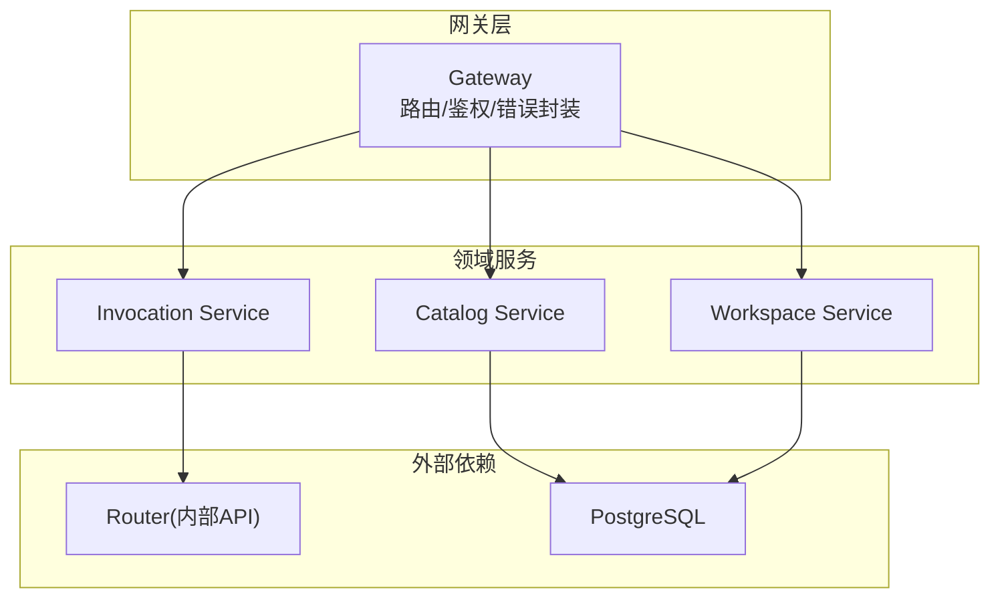
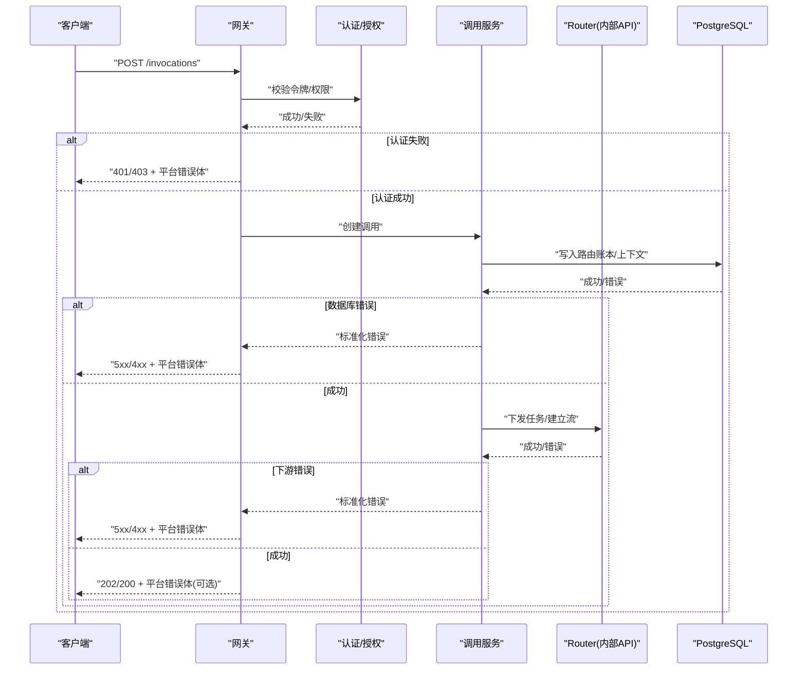
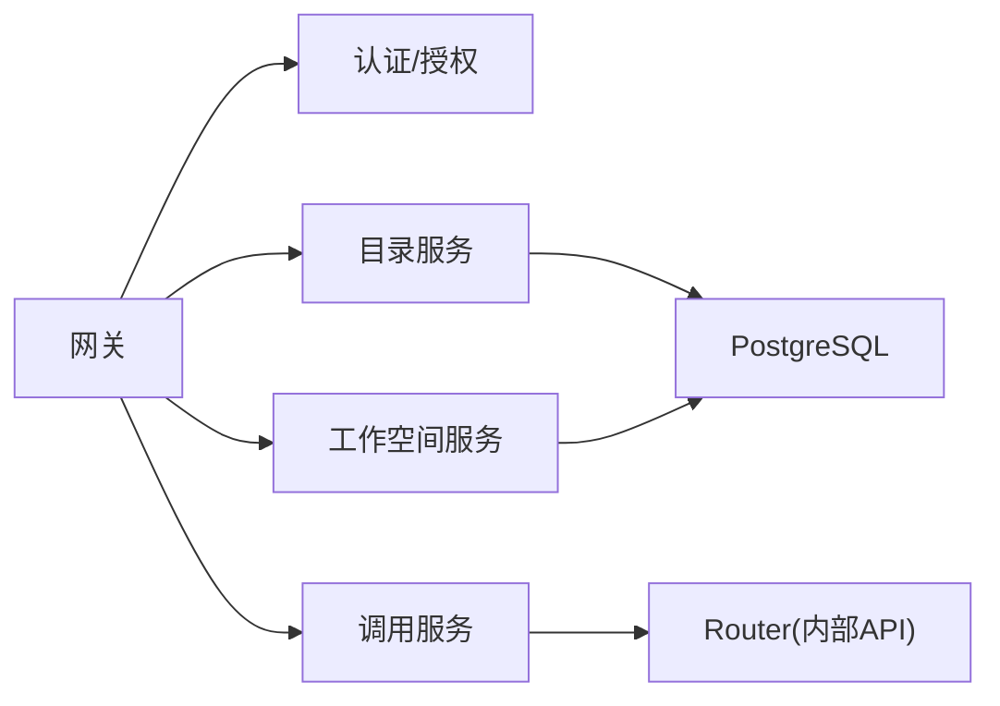
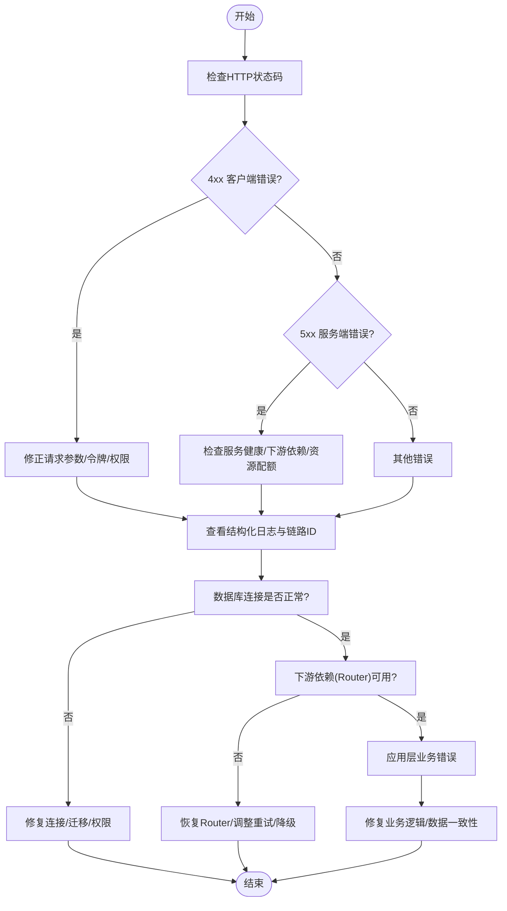

# 常见错误和解决方案

<cite>
**本文引用的文件**   
- [apps/control-plane/internal/gateway/errors.go](file://apps/control-plane/internal/gateway/errors.go)
- [apps/control-plane/internal/gateway/auth.go](file://apps/control-plane/internal/gateway/auth.go)
- [apps/control-plane/internal/gateway/invocation_handler.go](file://apps/control-plane/internal/gateway/invocation_handler.go)
- [apps/control-plane/internal/gateway/catalog_handler.go](file://apps/control-plane/internal/gateway/catalog_handler.go)
- [apps/control-plane/internal/gateway/workspace_handler.go](file://apps/control-plane/internal/gateway/workspace_handler.go)
- [apps/control-plane/internal/invocation/service.go](file://apps/control-plane/internal/invocation/service.go)
- [apps/control-plane/internal/invocation/router_client.go](file://apps/control-plane/internal/invocation/router_client.go)
- [apps/control-plane/internal/catalog/store.go](file://apps/control-plane/internal/catalog/store.go)
- [apps/control-plane/internal/catalog/postgres/store.go](file://apps/control-plane/internal/catalog/postgres/store.go)
- [apps/control-plane/internal/workspace/store.go](file://apps/control-plane/internal/workspace/store.go)
- [apps/control-plane/internal/workspace/postgres/store.go](file://apps/control-plane/internal/workspace/postgres/store.go)
- [contracts/schemas/platform-error.v4.schema.json](file://contracts/schemas/platform-error.v4.schema.json)
- [contracts/openapi/control-plane.v2.yaml](file://contracts/openapi/control-plane.v2.yaml)
- [contracts/openapi/control-plane-invocation.v4.yaml](file://contracts/openapi/control-plane-invocation.v4.yaml)
- [contracts/openapi/router-internal.v3.yaml](file://contracts/openapi/router-internal.v3.yaml)
- [deploy/compose.yaml](file://deploy/compose.yaml)
</cite>

## 目录
1. [简介](#简介)
2. [项目结构](#项目结构)
3. [核心组件](#核心组件)
4. [架构总览](#架构总览)
5. [详细组件分析](#详细组件分析)
6. [依赖分析](#依赖分析)
7. [性能考虑](#性能考虑)
8. [故障排查指南](#故障排查指南)
9. [结论](#结论)
10. [附录](#附录) 

## 简介
本文件面向 NeKiro 平台开发者与运维人员，系统化梳理系统运行中常见的错误类型与解决方案，覆盖 HTTP 状态码、业务错误码、数据库连接错误、认证授权失败等。每个错误均包含错误描述、可能原因、解决步骤与预防措施，并附带日志示例与调试方法，配合流程图与决策树帮助快速定位问题。

## 项目结构
NeKiro 控制面（control-plane）采用 Go 实现，HTTP 网关位于 gateway 层，内部服务包括 catalog、workspace、invocation 等；数据持久化使用 Postgres；对外契约通过 OpenAPI 与 JSON Schema 定义。

图表来源
- [apps/control-plane/internal/gateway/invocation_handler.go](file://apps/control-plane/internal/gateway/invocation_handler.go)
- [apps/control-plane/internal/gateway/catalog_handler.go](file://apps/control-plane/internal/gateway/catalog_handler.go)
- [apps/control-plane/internal/gateway/workspace_handler.go](file://apps/control-plane/internal/gateway/workspace_handler.go)
- [apps/control-plane/internal/invocation/service.go](file://apps/control-plane/internal/invocation/service.go)
- [apps/control-plane/internal/invocation/router_client.go](file://apps/control-plane/internal/invocation/router_client.go)
- [apps/control-plane/internal/catalog/store.go](file://apps/control-plane/internal/catalog/store.go)
- [apps/control-plane/internal/workspace/store.go](file://apps/control-plane/internal/workspace/store.go)
- [contracts/openapi/router-internal.v3.yaml](file://contracts/openapi/router-internal.v3.yaml)

章节来源
- [apps/control-plane/internal/gateway/errors.go](file://apps/control-plane/internal/gateway/errors.go)
- [contracts/openapi/control-plane.v2.yaml](file://contracts/openapi/control-plane.v2.yaml)
- [contracts/openapi/control-plane-invocation.v4.yaml](file://contracts/openapi/control-plane-invocation.v4.yaml)

## 核心组件
- 网关错误封装：统一将领域错误转换为标准 HTTP 响应与平台错误体，确保客户端可解析。
- 认证授权：基于请求头或令牌进行身份校验与权限判定，失败时返回明确的 HTTP 状态码与错误体。
- 领域服务：catalog、workspace、invocation 分别负责资源管理、工作空间生命周期与调用编排。
- 存储层：Postgres 存储，提供事务与一致性保障，错误向上抛出以便网关统一处理。
- 外部集成：通过内部 API 与 Router 通信，用于任务分发与结果投递。

章节来源
- [apps/control-plane/internal/gateway/errors.go](file://apps/control-plane/internal/gateway/errors.go)
- [apps/control-plane/internal/gateway/auth.go](file://apps/control-plane/internal/gateway/auth.go)
- [apps/control-plane/internal/catalog/store.go](file://apps/control-plane/internal/catalog/store.go)
- [apps/control-plane/internal/workspace/store.go](file://apps/control-plane/internal/workspace/store.go)
- [apps/control-plane/internal/invocation/service.go](file://apps/control-plane/internal/invocation/service.go)
- [apps/control-plane/internal/invocation/router_client.go](file://apps/control-plane/internal/invocation/router_client.go)

## 架构总览
下图展示一次“创建调用”的端到端流程及关键错误点：

图表来源
- [apps/control-plane/internal/gateway/invocation_handler.go](file://apps/control-plane/internal/gateway/invocation_handler.go)
- [apps/control-plane/internal/invocation/service.go](file://apps/control-plane/internal/invocation/service.go)
- [apps/control-plane/internal/invocation/router_client.go](file://apps/control-plane/internal/invocation/router_client.go)
- [contracts/openapi/control-plane-invocation.v4.yaml](file://contracts/openapi/control-plane-invocation.v4.yaml)
- [contracts/openapi/router-internal.v3.yaml](file://contracts/openapi/router-internal.v3.yaml)

## 详细组件分析

### 网关错误与统一错误体
- 职责：将各层错误映射为统一的 HTTP 状态码与平台错误体，便于客户端一致处理。
- 关键点：
  - 未认证/未授权：返回 401/403，并携带平台错误体。
  - 参数校验失败：返回 400，错误体中包含字段级错误信息。
  - 资源不存在：返回 404。
  - 并发冲突：返回 409。
  - 上游不可用/超时：返回 502/504，并记录链路追踪 ID。
  - 内部错误：返回 500，附带错误码与简要消息，避免泄露敏感细节。
- 建议：所有错误路径均应输出结构化日志，包含请求 ID、用户标识、资源标识与错误码。

章节来源
- [apps/control-plane/internal/gateway/errors.go](file://apps/control-plane/internal/gateway/errors.go)
- [contracts/schemas/platform-error.v4.schema.json](file://contracts/schemas/platform-error.v4.schema.json)
- [contracts/openapi/control-plane.v2.yaml](file://contracts/openapi/control-plane.v2.yaml)

### 认证与授权
- 典型错误：
  - 令牌缺失或过期：401。
  - 权限不足：403。
  - 令牌签名无效：401。
  - 多租户隔离失败：403。
- 排查要点：
  - 检查请求头是否携带正确的认证信息。
  - 确认服务端密钥/证书配置正确。
  - 核对用户角色与工作空间/资源的访问策略。
- 预防：
  - 在网关层集中校验，避免重复逻辑。
  - 对敏感错误仅返回必要信息，详细原因落盘审计。

章节来源
- [apps/control-plane/internal/gateway/auth.go](file://apps/control-plane/internal/gateway/auth.go)

### 调用编排（Invocation）
- 典型错误：
  - 下游 Router 不可达/超时：502/504。
  - 任务状态不一致：409。
  - 事件流中断：500/503。
- 排查要点：
  - 查看链路追踪 ID，定位具体阶段失败。
  - 检查 Router 健康检查与重试策略。
  - 验证幂等键与去重逻辑。
- 预防：
  - 设置合理的超时与退避重试。
  - 引入断路器与熔断保护。

章节来源
- [apps/control-plane/internal/invocation/service.go](file://apps/control-plane/internal/invocation/service.go)
- [apps/control-plane/internal/invocation/router_client.go](file://apps/control-plane/internal/invocation/router_client.go)
- [contracts/openapi/control-plane-invocation.v4.yaml](file://contracts/openapi/control-plane-invocation.v4.yaml)
- [contracts/openapi/router-internal.v3.yaml](file://contracts/openapi/router-internal.v3.yaml)

### 目录服务（Catalog）
- 典型错误：
  - 资源已存在：409。
  - 资源不存在：404。
  - 版本不兼容：422。
- 排查要点：
  - 校验输入模型是否符合 OpenAPI/Schema。
  - 检查迁移脚本与数据库版本一致性。
- 预防：
  - 在写入前进行唯一性约束与版本校验。
  - 使用迁移工具保证 schema 演进安全。

章节来源
- [apps/control-plane/internal/catalog/store.go](file://apps/control-plane/internal/catalog/store.go)
- [apps/control-plane/internal/catalog/postgres/store.go](file://apps/control-plane/internal/catalog/postgres/store.go)
- [contracts/openapi/control-plane.v2.yaml](file://contracts/openapi/control-plane.v2.yaml)

### 工作空间（Workspace）
- 典型错误：
  - 命名冲突：409。
  - 删除依赖未清理：400/403。
  - 配额超限：429。
- 排查要点：
  - 检查关联资源清理策略与外键约束。
  - 监控配额计数器与阈值告警。
- 预防：
  - 在删除入口增加前置校验与级联清理。
  - 引入软删除与回收站机制。

章节来源
- [apps/control-plane/internal/workspace/store.go](file://apps/control-plane/internal/workspace/store.go)
- [apps/control-plane/internal/workspace/postgres/store.go](file://apps/control-plane/internal/workspace/postgres/store.go)

## 依赖分析
- 组件耦合：
  - 网关依赖认证模块与各领域服务。
  - Invocation 服务依赖 Router 内部 API 与数据库。
  - Catalog/Workspace 服务强依赖 Postgres。
- 外部依赖：
  - Router 内部 API 的可用性直接影响调用编排成功率。
  - PostgreSQL 的连接池、锁竞争与慢查询影响整体吞吐。

图表来源
- [apps/control-plane/internal/gateway/errors.go](file://apps/control-plane/internal/gateway/errors.go)
- [apps/control-plane/internal/invocation/router_client.go](file://apps/control-plane/internal/invocation/router_client.go)
- [apps/control-plane/internal/catalog/postgres/store.go](file://apps/control-plane/internal/catalog/postgres/store.go)
- [apps/control-plane/internal/workspace/postgres/store.go](file://apps/control-plane/internal/workspace/postgres/store.go)

章节来源
- [contracts/openapi/router-internal.v3.yaml](file://contracts/openapi/router-internal.v3.yaml)
- [contracts/openapi/control-plane.v2.yaml](file://contracts/openapi/control-plane.v2.yaml)

## 性能考虑
- 连接池：合理设置数据库最大连接数与空闲超时，避免连接耗尽。
- 超时与重试：为下游调用设置短超时与指数退避，防止雪崩。
- 限流与熔断：在网关与下游之间部署限流器与熔断器，保护系统稳定性。
- 索引优化：针对高频查询字段建立合适索引，减少锁等待与全表扫描。
- 批量操作：合并小事务为大事务，降低提交开销。

[本节为通用指导，无需源码引用]

## 故障排查指南

### 错误分类与处理流程

[本图为概念流程，无需源码引用]

### 常见错误清单与解决方案

- HTTP 401 未认证
  - 描述：缺少或无效的认证令牌。
  - 可能原因：令牌缺失、过期、签名无效、环境密钥不一致。
  - 解决步骤：
    - 确认请求头携带有效令牌。
    - 校验服务端密钥/证书配置。
    - 刷新令牌并重试。
  - 预防：在网关集中校验，统一返回平台错误体。
  - 日志示例：包含请求 ID、用户标识、错误码与时间戳。
  - 参考：
    - [apps/control-plane/internal/gateway/auth.go](file://apps/control-plane/internal/gateway/auth.go)
    - [apps/control-plane/internal/gateway/errors.go](file://apps/control-plane/internal/gateway/errors.go)

- HTTP 403 未授权
  - 描述：认证通过但无权限访问目标资源。
  - 可能原因：角色/策略不匹配、多租户隔离失败。
  - 解决步骤：
    - 检查用户角色与工作空间策略。
    - 确认资源归属与访问控制列表。
  - 预防：在入口处进行最小权限校验。
  - 参考：
    - [apps/control-plane/internal/gateway/auth.go](file://apps/control-plane/internal/gateway/auth.go)

- HTTP 400 参数校验失败
  - 描述：请求体或路径参数不符合契约。
  - 可能原因：字段缺失、类型不符、枚举值非法。
  - 解决步骤：
    - 对照 OpenAPI/Schema 修正请求。
    - 启用请求体校验中间件。
  - 预防：在网关层统一校验并返回字段级错误。
  - 参考：
    - [contracts/openapi/control-plane.v2.yaml](file://contracts/openapi/control-plane.v2.yaml)
    - [contracts/schemas/platform-error.v4.schema.json](file://contracts/schemas/platform-error.v4.schema.json)

- HTTP 404 资源不存在
  - 描述：请求的资源不存在。
  - 可能原因：ID 错误或资源已被删除。
  - 解决步骤：
    - 校验资源 ID 与生命周期状态。
    - 检查级联删除策略。
  - 预防：在写入时生成稳定 ID，避免硬编码。
  - 参考：
    - [apps/control-plane/internal/catalog/store.go](file://apps/control-plane/internal/catalog/store.go)
    - [apps/control-plane/internal/workspace/store.go](file://apps/control-plane/internal/workspace/store.go)

- HTTP 409 冲突
  - 描述：资源冲突（如重复创建）。
  - 可能原因：唯一性约束被违反、并发写入。
  - 解决步骤：
    - 使用幂等键或乐观锁。
    - 重试并读取最新状态。
  - 预防：在数据库层添加唯一索引与约束。
  - 参考：
    - [apps/control-plane/internal/catalog/postgres/store.go](file://apps/control-plane/internal/catalog/postgres/store.go)

- HTTP 422 语义错误/版本不兼容
  - 描述：请求语义不正确或版本不兼容。
  - 可能原因：模型变更未同步、迁移未完成。
  - 解决步骤：
    - 升级客户端与服务端至兼容版本。
    - 执行数据库迁移。
  - 预防：在发布流程中强制契约校验。
  - 参考：
    - [contracts/openapi/control-plane.v2.yaml](file://contracts/openapi/control-plane.v2.yaml)

- HTTP 429 速率限制
  - 描述：触发限流策略。
  - 可能原因：超过 QPS/并发阈值。
  - 解决步骤：
    - 实施客户端退避与重试。
    - 申请更高配额或扩容。
  - 预防：在网关层暴露限流指标与告警。
  - 参考：
    - [apps/control-plane/internal/gateway/errors.go](file://apps/control-plane/internal/gateway/errors.go)

- HTTP 502/504 下游不可用/超时
  - 描述：调用 Router 失败或超时。
  - 可能原因：Router 宕机、网络抖动、超时配置过小。
  - 解决步骤：
    - 检查 Router 健康检查与实例状态。
    - 调整超时与重试策略。
  - 预防：部署多副本与健康探针。
  - 参考：
    - [apps/control-plane/internal/invocation/router_client.go](file://apps/control-plane/internal/invocation/router_client.go)
    - [contracts/openapi/router-internal.v3.yaml](file://contracts/openapi/router-internal.v3.yaml)

- HTTP 500 内部错误
  - 描述：服务端异常。
  - 可能原因：空指针、未捕获异常、资源泄漏。
  - 解决步骤：
    - 根据链路 ID 检索结构化日志。
    - 复现并修复根因。
  - 预防：完善单元测试与集成测试，增加断言与覆盖率。
  - 参考：
    - [apps/control-plane/internal/gateway/errors.go](file://apps/control-plane/internal/gateway/errors.go)

- 数据库连接错误
  - 描述：无法连接或查询失败。
  - 可能原因：连接池耗尽、密码错误、迁移未执行、网络不通。
  - 解决步骤：
    - 检查 compose 配置与网络连通性。
    - 验证用户名/密码与权限。
    - 执行迁移并重启服务。
  - 预防：启动前进行健康检查与预检。
  - 参考：
    - [deploy/compose.yaml](file://deploy/compose.yaml)
    - [apps/control-plane/internal/catalog/postgres/store.go](file://apps/control-plane/internal/catalog/postgres/store.go)
    - [apps/control-plane/internal/workspace/postgres/store.go](file://apps/control-plane/internal/workspace/postgres/store.go)

- 认证授权失败（令牌/策略）
  - 描述：令牌无效或策略拒绝访问。
  - 可能原因：密钥不一致、策略配置错误、租户隔离失败。
  - 解决步骤：
    - 核对密钥与证书。
    - 检查策略与角色绑定。
  - 预防：在 CI 中加入策略校验用例。
  - 参考：
    - [apps/control-plane/internal/gateway/auth.go](file://apps/control-plane/internal/gateway/auth.go)

- 调用编排失败（任务/流）
  - 描述：任务下发失败或流中断。
  - 可能原因：Router 不可用、事件丢失、幂等键冲突。
  - 解决步骤：
    - 检查 Router 状态与重试队列。
    - 校验幂等键与去重逻辑。
  - 预防：引入补偿任务与死信队列。
  - 参考：
    - [apps/control-plane/internal/invocation/service.go](file://apps/control-plane/internal/invocation/service.go)
    - [contracts/openapi/control-plane-invocation.v4.yaml](file://contracts/openapi/control-plane-invocation.v4.yaml)

### 调试方法与最佳实践
- 开启结构化日志：包含请求 ID、用户 ID、资源 ID、错误码、耗时与堆栈摘要。
- 启用链路追踪：跨服务传递 trace_id，便于端到端定位。
- 使用契约校验：在网关层对入参进行 OpenAPI/Schema 校验，尽早失败。
- 健康检查与就绪探针：在容器编排中配置 liveness/readiness。
- 压测与混沌工程：模拟下游故障与高负载，验证容错能力。

[本节为通用指导，无需源码引用]

## 结论
通过统一错误体、集中认证授权、完善的契约校验与健壮的重试/熔断策略，NeKiro 平台能够在复杂分布式环境下快速定位并解决常见问题。建议在日常开发中遵循本文的错误分类与排查流程，结合结构化日志与链路追踪，提升排障效率与系统稳定性。

## 附录
- 平台错误体 Schema 参考：
  - [contracts/schemas/platform-error.v4.schema.json](file://contracts/schemas/platform-error.v4.schema.json)
- 控制面 API 契约参考：
  - [contracts/openapi/control-plane.v2.yaml](file://contracts/openapi/control-plane.v2.yaml)
  - [contracts/openapi/control-plane-invocation.v4.yaml](file://contracts/openapi/control-plane-invocation.v4.yaml)
- Router 内部 API 契约参考：
  - [contracts/openapi/router-internal.v3.yaml](file://contracts/openapi/router-internal.v3.yaml)
- 本地编排与环境配置参考：
  - [deploy/compose.yaml](file://deploy/compose.yaml)