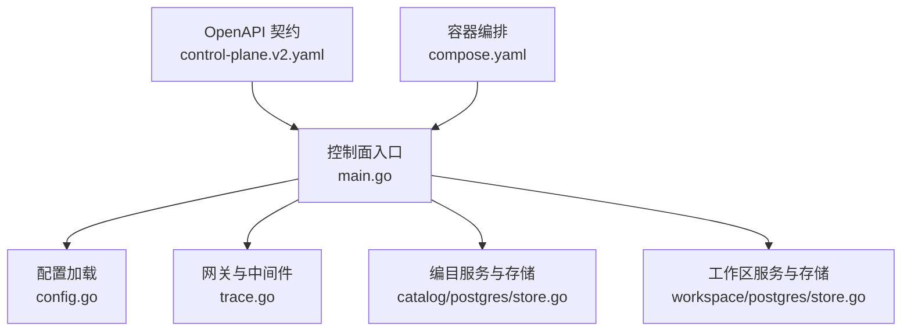
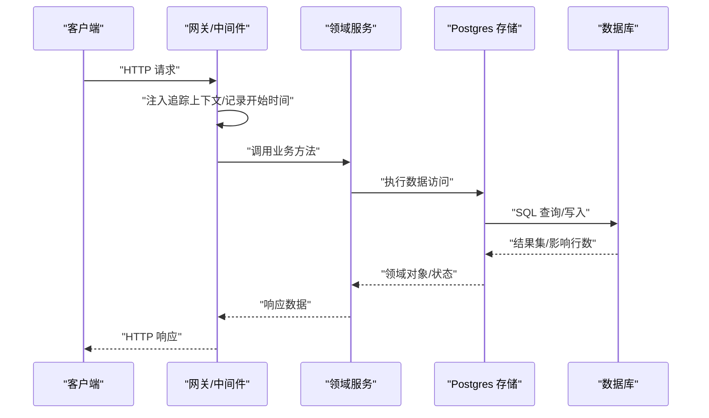
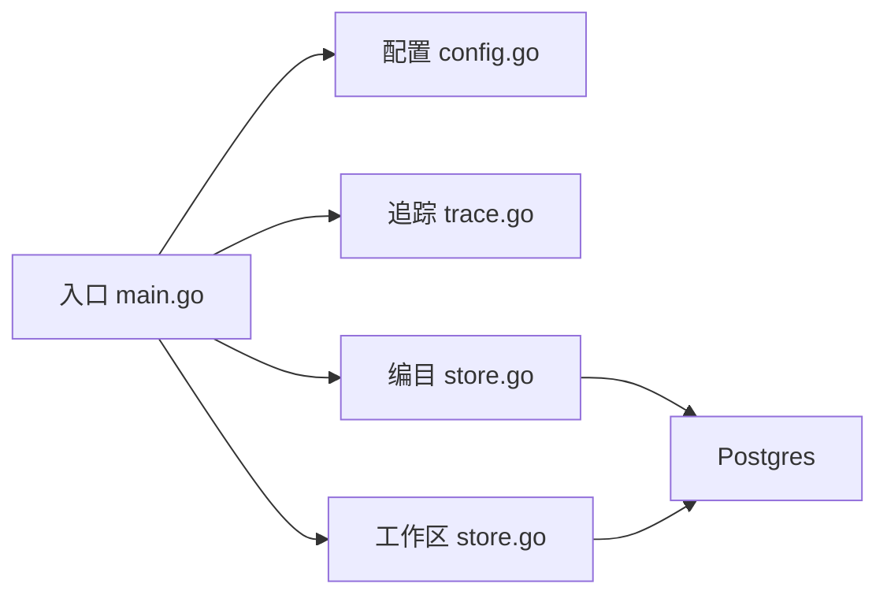

# 性能问题诊断和优化

<cite>
**本文引用的文件**   
- [README.md](file://README.md)
- [go.mod](file://go.mod)
- [deploy/compose.yaml](file://deploy/compose.yaml)
- [apps/control-plane/cmd/control-plane/main.go](file://apps/control-plane/cmd/control-plane/main.go)
- [apps/control-plane/internal/config/config.go](file://apps/control-plane/internal/config/config.go)
- [apps/control-plane/internal/gateway/trace.go](file://apps/control-plane/internal/gateway/trace.go)
- [apps/control-plane/internal/catalog/postgres/store.go](file://apps/control-plane/internal/catalog/postgres/store.go)
- [apps/control-plane/internal/workspace/postgres/store.go](file://apps/control-plane/internal/workspace/postgres/store.go)
- [contracts/openapi/control-plane.v2.yaml](file://contracts/openapi/control-plane.v2.yaml)
</cite>

## 目录
1. [简介](#简介)
2. [项目结构](#项目结构)
3. [核心组件](#核心组件)
4. [架构总览](#架构总览)
5. [详细组件分析](#详细组件分析)
6. [依赖分析](#依赖分析)
7. [性能考虑](#性能考虑)
8. [故障排查指南](#故障排查指南)
9. [结论](#结论)
10. [附录](#附录)

## 简介
本指南面向 NeKiro 平台的性能问题诊断与优化，聚焦于控制面服务（control-plane）及其数据库访问层。内容涵盖：
- 系统性能监控指标与采集点
- 瓶颈识别方法与定位流程
- 数据库查询优化、连接池配置与慢查询治理
- 内存使用分析与 CPU 使用率优化
- 性能测试工具与基准测试方法
- 常见性能问题场景与解决方案（慢查询、连接池、缓存策略）
- 资源使用最佳实践与容量规划建议
- 性能监控仪表板配置与告警规则设置

## 项目结构
NeKiro 采用多应用仓库组织，控制面位于 apps/control-plane，包含入口程序、网关路由、编目与工作区领域逻辑及 Postgres 存储实现；部署编排通过 compose 定义。

图表来源
- [apps/control-plane/cmd/control-plane/main.go:1-200](file://apps/control-plane/cmd/control-plane/main.go#L1-L200)
- [apps/control-plane/internal/config/config.go:1-200](file://apps/control-plane/internal/config/config.go#L1-L200)
- [apps/control-plane/internal/gateway/trace.go:1-200](file://apps/control-plane/internal/gateway/trace.go#L1-L200)
- [apps/control-plane/internal/catalog/postgres/store.go:1-200](file://apps/control-plane/internal/catalog/postgres/store.go#L1-L200)
- [apps/control-plane/internal/workspace/postgres/store.go:1-200](file://apps/control-plane/internal/workspace/postgres/store.go#L1-L200)
- [contracts/openapi/control-plane.v2.yaml:1-200](file://contracts/openapi/control-plane.v2.yaml#L1-L200)
- [deploy/compose.yaml:1-200](file://deploy/compose.yaml#L1-L200)

章节来源
- [README.md:1-200](file://README.md#L1-L200)
- [go.mod:1-200](file://go.mod#L1-L200)
- [deploy/compose.yaml:1-200](file://deploy/compose.yaml#L1-L200)

## 核心组件
- 控制面入口与启动流程：负责加载配置、初始化依赖、注册路由与中间件、启动 HTTP 服务器。
- 配置模块：集中管理运行时参数（如端口、日志级别、数据库连接参数等）。
- 网关与追踪：在请求进入时注入链路追踪上下文，记录关键耗时与错误。
- 数据访问层：编目与工作区的 Postgres 存储实现，封装 SQL 执行、事务与游标分页。
- OpenAPI 契约：定义对外接口，便于压测脚本生成与一致性校验。
- 容器编排：定义服务运行环境与依赖关系，影响资源限制与可观测性接入。

章节来源
- [apps/control-plane/cmd/control-plane/main.go:1-200](file://apps/control-plane/cmd/control-plane/main.go#L1-L200)
- [apps/control-plane/internal/config/config.go:1-200](file://apps/control-plane/internal/config/config.go#L1-L200)
- [apps/control-plane/internal/gateway/trace.go:1-200](file://apps/control-plane/internal/gateway/trace.go#L1-L200)
- [apps/control-plane/internal/catalog/postgres/store.go:1-200](file://apps/control-plane/internal/catalog/postgres/store.go#L1-L200)
- [apps/control-plane/internal/workspace/postgres/store.go:1-200](file://apps/control-plane/internal/workspace/postgres/store.go#L1-L200)
- [contracts/openapi/control-plane.v2.yaml:1-200](file://contracts/openapi/control-plane.v2.yaml#L1-L200)
- [deploy/compose.yaml:1-200](file://deploy/compose.yaml#L1-L200)

## 架构总览
控制面作为平台的核心协调者，接收外部 API 请求，经由网关中间件进行鉴权与追踪，再调用领域服务与持久化层完成业务处理。

图表来源
- [apps/control-plane/cmd/control-plane/main.go:1-200](file://apps/control-plane/cmd/control-plane/main.go#L1-L200)
- [apps/control-plane/internal/gateway/trace.go:1-200](file://apps/control-plane/internal/gateway/trace.go#L1-L200)
- [apps/control-plane/internal/catalog/postgres/store.go:1-200](file://apps/control-plane/internal/catalog/postgres/store.go#L1-L200)
- [apps/control-plane/internal/workspace/postgres/store.go:1-200](file://apps/control-plane/internal/workspace/postgres/store.go#L1-L200)

## 详细组件分析

### 入口与启动流程
- 职责：解析配置、初始化日志与追踪、构建依赖、注册路由、启动监听。
- 性能关注点：
  - 启动阶段依赖初始化耗时（数据库连接、迁移、索引检查）。
  - 并发度与线程模型（Go 默认调度器通常无需额外调优，但需关注 I/O 阻塞）。
  - 优雅关闭与资源释放（避免连接泄漏导致后续请求变慢）。

章节来源
- [apps/control-plane/cmd/control-plane/main.go:1-200](file://apps/control-plane/cmd/control-plane/main.go#L1-L200)

### 配置模块
- 职责：集中读取环境变量或配置文件，提供强类型配置项。
- 性能相关配置项（示例类别，具体键名以实际实现为准）：
  - 数据库连接池大小、最大空闲连接、连接超时、语句缓存开关。
  - HTTP 服务器并发读/写限制、请求体大小上限。
  - 日志采样率与追踪采样率。
- 建议：
  - 将连接池大小与数据库实例规格匹配，避免过小导致排队、过大导致上下文切换开销。
  - 开启语句缓存以减少重复 SQL 的解析成本。
  - 合理设置追踪采样率，生产环境建议按流量比例采样。

章节来源
- [apps/control-plane/internal/config/config.go:1-200](file://apps/control-plane/internal/config/config.go#L1-L200)

### 网关与追踪
- 职责：统一拦截请求，注入追踪 ID、记录起止时间与关键事件。
- 性能关注点：
  - 追踪开销应尽可能低，避免在热路径中进行昂贵操作。
  - 采样策略与标签维度需平衡可观测性与开销。
- 建议：
  - 对高频接口启用轻量级统计（计数、分位延迟），复杂聚合异步上报。
  - 为关键路径添加结构化日志，减少字符串拼接与反射。

章节来源
- [apps/control-plane/internal/gateway/trace.go:1-200](file://apps/control-plane/internal/gateway/trace.go#L1-L200)

### 编目存储（Postgres）
- 职责：编目数据的增删改查、分页游标、事务边界。
- 性能关注点：
  - 慢查询与全表扫描。
  - 连接池耗尽导致的等待。
  - 大结果集传输造成的内存峰值。
- 建议：
  - 针对热点查询建立合适索引，避免 SELECT *，仅返回必要字段。
  - 使用游标分页替代 OFFSET 深翻页。
  - 批量写入合并事务，降低提交次数。
  - 调整连接池参数与查询超时，防止雪崩。

章节来源
- [apps/control-plane/internal/catalog/postgres/store.go:1-200](file://apps/control-plane/internal/catalog/postgres/store.go#L1-L200)

### 工作区存储（Postgres）
- 职责：工作区元数据与关联实体的持久化。
- 性能关注点：
  - 跨表 JOIN 复杂度与锁竞争。
  - 长事务持有锁导致其他请求阻塞。
- 建议：
  - 拆分热点写入路径，缩短事务范围。
  - 读写分离或引入只读副本用于报表类查询。
  - 对高并发更新路径引入乐观锁或队列化落盘。

章节来源
- [apps/control-plane/internal/workspace/postgres/store.go:1-200](file://apps/control-plane/internal/workspace/postgres/store.go#L1-L200)

### OpenAPI 契约与压测
- 作用：定义接口规范，便于自动生成压测脚本与契约测试。
- 建议：
  - 基于 v2 契约生成负载模型，覆盖典型 CRUD 与流式场景。
  - 在 CI 中集成回归压测，对比 P95/P99 延迟阈值。

章节来源
- [contracts/openapi/control-plane.v2.yaml:1-200](file://contracts/openapi/control-plane.v2.yaml#L1-L200)

### 容器编排与资源限制
- 作用：定义服务镜像、端口映射、环境变量与资源限制。
- 建议：
  - 为 Go 进程设置合理的 CPU 与内存限制，避免 OOMKill。
  - 暴露健康检查端点，配合编排平台进行弹性伸缩。

章节来源
- [deploy/compose.yaml:1-200](file://deploy/compose.yaml#L1-L200)

## 依赖分析
控制面依赖外部数据库与可能的第三方库（由 go.mod 声明）。连接池与网络栈是主要外部耦合点。

图表来源
- [apps/control-plane/cmd/control-plane/main.go:1-200](file://apps/control-plane/cmd/control-plane/main.go#L1-L200)
- [apps/control-plane/internal/config/config.go:1-200](file://apps/control-plane/internal/config/config.go#L1-L200)
- [apps/control-plane/internal/gateway/trace.go:1-200](file://apps/control-plane/internal/gateway/trace.go#L1-L200)
- [apps/control-plane/internal/catalog/postgres/store.go:1-200](file://apps/control-plane/internal/catalog/postgres/store.go#L1-L200)
- [apps/control-plane/internal/workspace/postgres/store.go:1-200](file://apps/control-plane/internal/workspace/postgres/store.go#L1-L200)
- [go.mod:1-200](file://go.mod#L1-L200)

章节来源
- [go.mod:1-200](file://go.mod#L1-L200)

## 性能考虑

### 监控指标体系
- 应用层
  - QPS、P50/P95/P99 延迟、错误率、超时率
  - 活跃 goroutine 数、GC 暂停时间、堆内存使用
- 网关层
  - 请求入站速率、出站速率、上游调用失败率
  - 追踪跨度数量与平均跨度时长
- 数据库层
  - 连接池使用率、等待时间、慢查询数量
  - 锁等待、死锁、复制延迟（如有只读副本）

### 瓶颈识别方法
- 端到端追踪：利用网关追踪上下文串联各子系统，定位最慢环节。
- 火焰图与 CPU Profile：识别热点函数与系统调用。
- 内存 Profile：定位分配热点与潜在泄漏。
- 数据库 EXPLAIN/ANALYZE：分析执行计划与索引命中情况。
- 连接池与超时：观察等待队列长度与超时占比。

### 数据库查询优化
- 索引策略：为高频过滤与排序列建立复合索引，避免回表。
- 查询改写：减少子查询与不必要 JOIN，使用窗口函数替代自连接。
- 分页优化：使用游标或基于主键的范围分页。
- 批量操作：合并小事务为大事务，减少提交开销。
- 只读副本：将报表与导出类查询分流至只读节点。

### 连接池配置
- 最小/最大连接数：根据并发度与数据库承载能力设定。
- 空闲连接回收：避免长期占用连接。
- 语句缓存：开启以减少 SQL 解析成本。
- 超时与重试：为连接获取、查询执行设置合理超时，结合幂等性进行有限重试。

### 缓存策略调优
- 本地缓存：对热点只读数据进行短 TTL 缓存，注意一致性边界。
- 分布式缓存：对跨实例共享数据使用 Redis/Memcached，设计失效与降级策略。
- 缓存穿透/雪崩防护：空值缓存、随机过期、限流熔断。

### 内存使用分析
- 分配热点：减少临时对象创建，复用缓冲与对象池。
- 大对象传输：流式处理大响应体，避免一次性加载到内存。
- GC 压力：控制对象生命周期，避免频繁短命对象分配。

### CPU 使用率优化
- 算法复杂度：避免 O(n^2) 的嵌套循环，改用哈希或树结构。
- 序列化/反序列化：选择高效编码格式，减少 JSON 解析开销。
- 并行度：合理利用 goroutine 并发，避免过度并行导致上下文切换。

### 性能测试与基准
- 工具建议：wrk、k6、vegeta、JMeter。
- 场景设计：典型 CRUD、批量导入、分页列表、流式输出。
- 指标基线：定义 P95/P99 延迟与错误率阈值，纳入 CI 回归。
- 混沌与压力：模拟数据库抖动、连接池耗尽、CPU 饱和等异常场景。

### 容量规划建议
- 计算资源：根据 QPS 与单实例吞吐估算实例数，预留 30% 冗余。
- 数据库资源：依据连接数、IOPS、缓存命中率评估规格。
- 网络带宽：预估峰值流量与包大小，避免网络成为瓶颈。
- 弹性策略：基于 CPU/内存/延迟指标的自动扩缩容。

### 监控仪表板与告警
- 仪表板：汇总应用、网关、数据库关键指标，支持钻取到具体接口与租户。
- 告警规则：
  - 延迟超阈（P95/P99）、错误率突增、连接池耗尽、慢查询激增。
  - 资源使用告警（CPU、内存、磁盘 IO、网络 IO）。
- 通知渠道：企业微信/钉钉/邮件/短信，分级告警与降噪。

## 故障排查指南

### 慢查询定位与优化
- 现象：接口 P99 延迟升高，数据库慢查询增多。
- 步骤：
  - 从追踪跨度定位最慢 SQL。
  - 使用 EXPLAIN/ANALYZE 查看执行计划，确认是否走索引。
  - 调整索引或改写查询，必要时引入物化视图或预聚合。
- 预防：
  - 上线前强制慢查询审查与回归压测。
  - 定期巡检慢查询日志与索引使用率。

章节来源
- [apps/control-plane/internal/catalog/postgres/store.go:1-200](file://apps/control-plane/internal/catalog/postgres/store.go#L1-L200)
- [apps/control-plane/internal/workspace/postgres/store.go:1-200](file://apps/control-plane/internal/workspace/postgres/store.go#L1-L200)

### 连接池耗尽与超时
- 现象：大量“获取连接超时”错误，QPS 下降。
- 步骤：
  - 检查连接池最大连接数与当前使用率。
  - 排查长事务与未释放连接。
  - 调整连接池参数与查询超时，增加只读副本分担。
- 预防：
  - 设置连接池告警与自动扩容策略。
  - 代码层面避免在热路径执行阻塞 I/O。

章节来源
- [apps/control-plane/internal/config/config.go:1-200](file://apps/control-plane/internal/config/config.go#L1-L200)
- [apps/control-plane/internal/catalog/postgres/store.go:1-200](file://apps/control-plane/internal/catalog/postgres/store.go#L1-L200)

### 内存泄漏与高分配
- 现象：堆内存持续增长，GC 频繁且停顿时间长。
- 步骤：
  - 抓取 heap profile，定位分配热点。
  - 检查是否存在全局缓存未清理、闭包引用大对象。
  - 优化数据结构与序列化方式。
- 预防：
  - 引入内存使用基线与回归检测。
  - 对大对象采用流式处理与对象池。

章节来源
- [apps/control-plane/cmd/control-plane/main.go:1-200](file://apps/control-plane/cmd/control-plane/main.go#L1-L200)

### CPU 热点与序列化开销
- 现象：CPU 使用率高，热点集中在 JSON 编解码或复杂计算。
- 步骤：
  - 抓取 CPU profile，识别热点函数。
  - 替换低效库或算法，减少反射与字符串拼接。
- 预防：
  - 在 PR 中要求性能回归报告。
  - 对关键路径进行基准测试并纳入门禁。

章节来源
- [apps/control-plane/internal/gateway/trace.go:1-200](file://apps/control-plane/internal/gateway/trace.go#L1-L200)

## 结论
通过对控制面入口、配置、追踪、存储层的系统性分析与优化建议，结合完善的监控、压测与容量规划，可有效提升 NeKiro 平台的稳定性与性能表现。建议在研发流程中内嵌性能门禁与回归基线，持续迭代优化。

## 附录

### 常用命令与工具清单
- 压测：wrk、k6、vegeta
- 分析：pprof、expvar、Prometheus、Grafana、Jaeger/OpenTelemetry
- 数据库：pg_stat_statements、EXPLAIN/ANALYZE

### 参考契约与部署
- 接口契约：[contracts/openapi/control-plane.v2.yaml](file://contracts/openapi/control-plane.v2.yaml)
- 部署编排：[deploy/compose.yaml](file://deploy/compose.yaml)