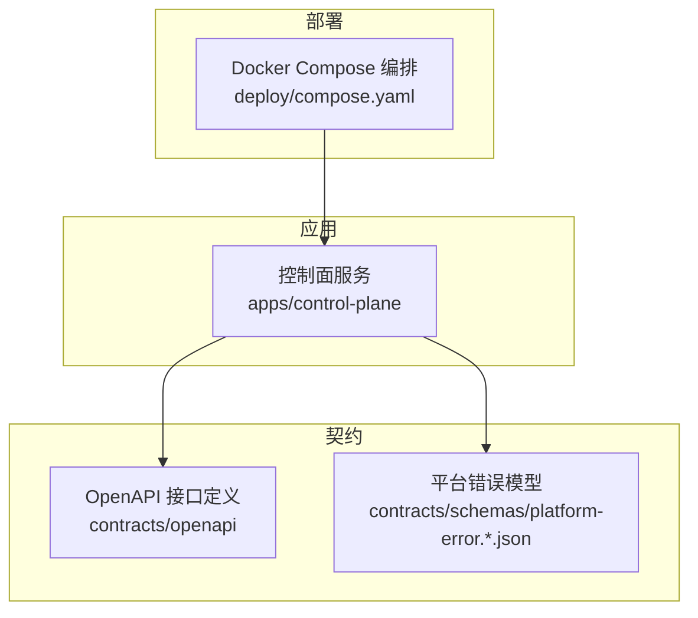
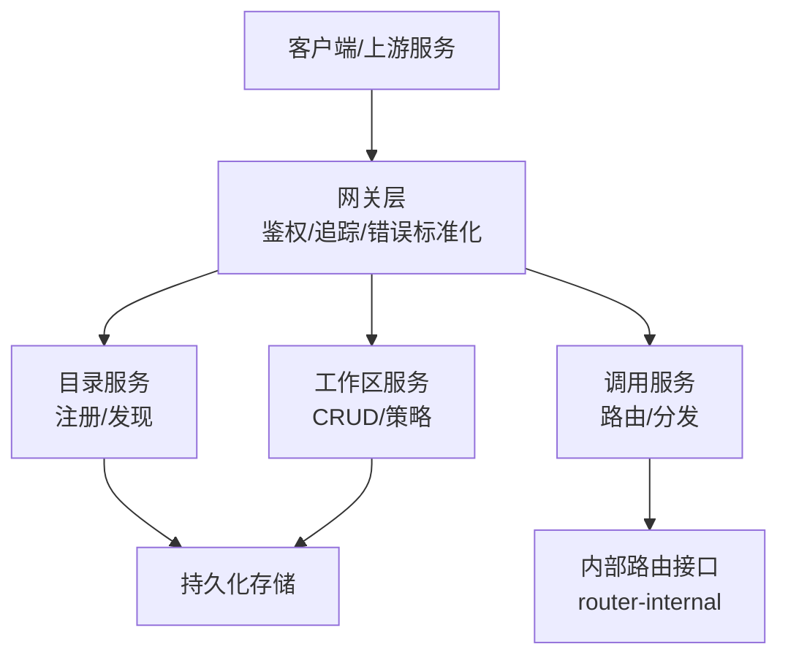
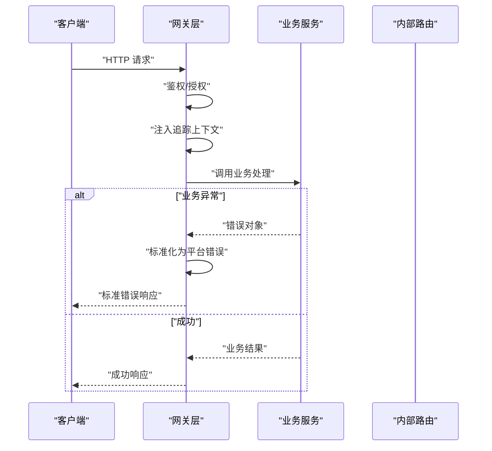
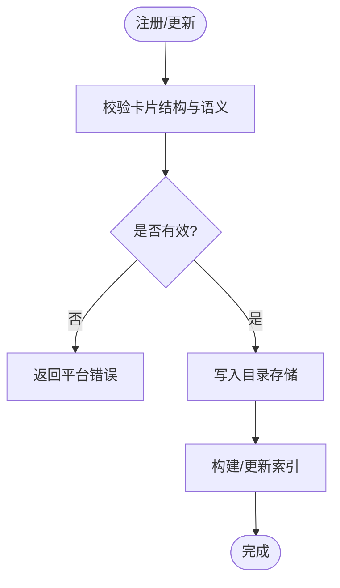
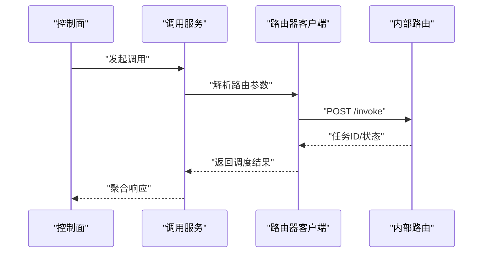
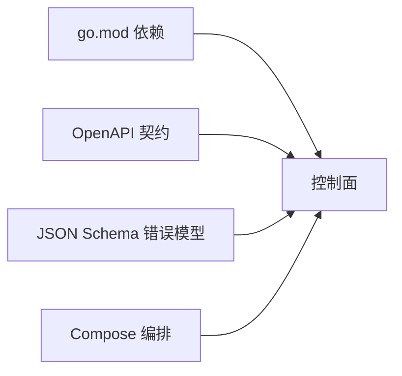

# 故障排查

<cite>
**本文引用的文件**   
- [README.md](file://README.md)
- [go.mod](file://go.mod)
- [deploy/compose.yaml](file://deploy/compose.yaml)
- [apps/control-plane/cmd/control-plane/main.go](file://apps/control-plane/cmd/control-plane/main.go)
- [apps/control-plane/internal/config/config.go](file://apps/control-plane/internal/config/config.go)
- [apps/control-plane/internal/gateway/errors.go](file://apps/control-plane/internal/gateway/errors.go)
- [apps/control-plane/internal/gateway/auth.go](file://apps/control-plane/internal/gateway/auth.go)
- [apps/control-plane/internal/gateway/trace.go](file://apps/control-plane/internal/gateway/trace.go)
- [apps/control-plane/internal/catalog/store.go](file://apps/control-plane/internal/catalog/store.go)
- [apps/control-plane/internal/catalog/service.go](file://apps/control-plane/internal/catalog/service.go)
- [apps/control-plane/internal/workspace/store.go](file://apps/control-plane/internal/workspace/store.go)
- [apps/control-plane/internal/workspace/service.go](file://apps/control-plane/internal/workspace/service.go)
- [apps/control-plane/internal/invocation/service.go](file://apps/control-plane/internal/invocation/service.go)
- [apps/control-plane/internal/invocation/router_client.go](file://apps/control-plane/internal/invocation/router_client.go)
- [contracts/schemas/platform-error.v4.schema.json](file://contracts/schemas/platform-error.v4.schema.json)
- [contracts/openapi/control-plane.v2.yaml](file://contracts/openapi/control-plane.v2.yaml)
- [contracts/openapi/router-internal.v3.yaml](file://contracts/openapi/router-internal.v3.yaml)
- [contracts/openapi/control-plane-invocation.v4.yaml](file://contracts/openapi/control-plane-invocation.v4.yaml)
</cite>

## 目录
1. [简介](#简介)
2. [项目结构](#项目结构)
3. [核心组件](#核心组件)
4. [架构总览](#架构总览)
5. [详细组件分析](#详细组件分析)
6. [依赖分析](#依赖分析)
7. [性能考虑](#性能考虑)
8. [故障排查指南](#故障排查指南)
9. [结论](#结论)
10. [附录](#附录)

## 简介
本文件面向 NeKiro 平台的运维与开发团队，提供系统运行中常见问题的快速定位与解决指引。内容覆盖错误码说明、诊断方法、性能分析与优化建议、调试技巧与工具使用、日志分析与监控指标解读，以及常见部署问题的排查步骤。文档以控制面（Control Plane）为核心，结合网关、目录服务、工作区、调用路由等关键模块进行系统性说明。

## 项目结构
NeKiro 采用多应用与契约分离的仓库组织方式：
- 应用层：control-plane 为主控制面服务，负责目录注册、工作区管理、调用编排与路由转发。
- 契约层：OpenAPI 与 JSON Schema 定义平台对外与内部接口规范，包含错误模型与兼容性规则。
- 部署层：compose 编排本地或测试环境的基础设施。
- 文档与决策：架构设计、运行手册与决策记录便于理解系统边界与约束。

图表来源
- [apps/control-plane/cmd/control-plane/main.go:1-200](file://apps/control-plane/cmd/control-plane/main.go#L1-L200)
- [contracts/openapi/control-plane.v2.yaml:1-200](file://contracts/openapi/control-plane.v2.yaml#L1-L200)
- [contracts/schemas/platform-error.v4.schema.json:1-200](file://contracts/schemas/platform-error.v4.schema.json#L1-L200)
- [deploy/compose.yaml:1-200](file://deploy/compose.yaml#L1-L200)

章节来源
- [README.md:1-200](file://README.md#L1-L200)
- [go.mod:1-200](file://go.mod#L1-L200)
- [deploy/compose.yaml:1-200](file://deploy/compose.yaml#L1-L200)

## 核心组件
- 控制面入口与生命周期管理：负责启动 HTTP 服务、加载配置、初始化中间件与路由、健康检查与优雅关闭。
- 网关层：统一鉴权、追踪上下文注入、错误标准化与响应封装。
- 目录服务：Agent 卡片的注册、发现与一致性存储。
- 工作区服务：工作区创建、读取与策略管理。
- 调用服务：根据目录信息选择目标 Agent，通过内部路由接口完成调用分发与结果回传。

章节来源
- [apps/control-plane/cmd/control-plane/main.go:1-200](file://apps/control-plane/cmd/control-plane/main.go#L1-L200)
- [apps/control-plane/internal/config/config.go:1-200](file://apps/control-plane/internal/config/config.go#L1-L200)
- [apps/control-plane/internal/gateway/errors.go:1-200](file://apps/control-plane/internal/gateway/errors.go#L1-L200)
- [apps/control-plane/internal/gateway/auth.go:1-200](file://apps/control-plane/internal/gateway/auth.go#L1-L200)
- [apps/control-plane/internal/gateway/trace.go:1-200](file://apps/control-plane/internal/gateway/trace.go#L1-L200)
- [apps/control-plane/internal/catalog/store.go:1-200](file://apps/control-plane/internal/catalog/store.go#L1-L200)
- [apps/control-plane/internal/catalog/service.go:1-200](file://apps/control-plane/internal/catalog/service.go#L1-L200)
- [apps/control-plane/internal/workspace/store.go:1-200](file://apps/control-plane/internal/workspace/store.go#L1-L200)
- [apps/control-plane/internal/workspace/service.go:1-200](file://apps/control-plane/internal/workspace/service.go#L1-L200)
- [apps/control-plane/internal/invocation/service.go:1-200](file://apps/control-plane/internal/invocation/service.go#L1-L200)
- [apps/control-plane/internal/invocation/router_client.go:1-200](file://apps/control-plane/internal/invocation/router_client.go#L1-L200)

## 架构总览
控制面作为中枢，向上暴露 OpenAPI 接口，向下通过内部路由协议与 Agent 运行时通信；同时维护目录与工作区数据，确保一致性与可观测性。

图表来源
- [apps/control-plane/cmd/control-plane/main.go:1-200](file://apps/control-plane/cmd/control-plane/main.go#L1-L200)
- [apps/control-plane/internal/gateway/auth.go:1-200](file://apps/control-plane/internal/gateway/auth.go#L1-L200)
- [apps/control-plane/internal/gateway/trace.go:1-200](file://apps/control-plane/internal/gateway/trace.go#L1-L200)
- [apps/control-plane/internal/catalog/service.go:1-200](file://apps/control-plane/internal/catalog/service.go#L1-L200)
- [apps/control-plane/internal/workspace/service.go:1-200](file://apps/control-plane/internal/workspace/service.go#L1-L200)
- [apps/control-plane/internal/invocation/service.go:1-200](file://apps/control-plane/internal/invocation/service.go#L1-L200)
- [contracts/openapi/router-internal.v3.yaml:1-200](file://contracts/openapi/router-internal.v3.yaml#L1-L200)

## 详细组件分析

### 网关层：鉴权、追踪与错误标准化
- 鉴权：校验请求头、令牌与权限范围，失败时返回标准错误。
- 追踪：注入 trace_id/correlation_id，贯穿后续服务调用，便于链路追踪。
- 错误标准化：将业务异常转换为平台错误模型，保证响应格式一致。

图表来源
- [apps/control-plane/internal/gateway/auth.go:1-200](file://apps/control-plane/internal/gateway/auth.go#L1-L200)
- [apps/control-plane/internal/gateway/trace.go:1-200](file://apps/control-plane/internal/gateway/trace.go#L1-L200)
- [apps/control-plane/internal/gateway/errors.go:1-200](file://apps/control-plane/internal/gateway/errors.go#L1-L200)

章节来源
- [apps/control-plane/internal/gateway/auth.go:1-200](file://apps/control-plane/internal/gateway/auth.go#L1-L200)
- [apps/control-plane/internal/gateway/trace.go:1-200](file://apps/control-plane/internal/gateway/trace.go#L1-L200)
- [apps/control-plane/internal/gateway/errors.go:1-200](file://apps/control-plane/internal/gateway/errors.go#L1-L200)

### 目录服务：注册与发现
- 职责：维护 Agent 卡片与能力元数据，支持版本与兼容性校验。
- 一致性：通过迁移脚本与事务保障数据一致性。
- 常见问题：重复注册、版本不兼容、索引缺失导致查询失败。

图表来源
- [apps/control-plane/internal/catalog/store.go:1-200](file://apps/control-plane/internal/catalog/store.go#L1-L200)
- [apps/control-plane/internal/catalog/service.go:1-200](file://apps/control-plane/internal/catalog/service.go#L1-L200)

章节来源
- [apps/control-plane/internal/catalog/store.go:1-200](file://apps/control-plane/internal/catalog/store.go#L1-L200)
- [apps/control-plane/internal/catalog/service.go:1-200](file://apps/control-plane/internal/catalog/service.go#L1-L200)

### 工作区服务：创建、读取与策略
- 职责：管理工作区生命周期、资源隔离与访问策略。
- 常见问题：权限不足、策略冲突、资源配额超限。
- 诊断要点：检查策略定义、用户角色与资源绑定关系。

章节来源
- [apps/control-plane/internal/workspace/store.go:1-200](file://apps/control-plane/internal/workspace/store.go#L1-L200)
- [apps/control-plane/internal/workspace/service.go:1-200](file://apps/control-plane/internal/workspace/service.go#L1-L200)

### 调用服务与内部路由：分发与回传
- 职责：依据目录信息选择目标 Agent，通过内部路由接口发起调用并聚合结果。
- 常见问题：路由不可达、超时、幂等与重试策略不当。
- 诊断要点：核对内部路由端点可达性、超时配置与重试退避策略。

图表来源
- [apps/control-plane/internal/invocation/service.go:1-200](file://apps/control-plane/internal/invocation/service.go#L1-L200)
- [apps/control-plane/internal/invocation/router_client.go:1-200](file://apps/control-plane/internal/invocation/router_client.go#L1-L200)
- [contracts/openapi/router-internal.v3.yaml:1-200](file://contracts/openapi/router-internal.v3.yaml#L1-L200)

章节来源
- [apps/control-plane/internal/invocation/service.go:1-200](file://apps/control-plane/internal/invocation/service.go#L1-L200)
- [apps/control-plane/internal/invocation/router_client.go:1-200](file://apps/control-plane/internal/invocation/router_client.go#L1-L200)
- [contracts/openapi/router-internal.v3.yaml:1-200](file://contracts/openapi/router-internal.v3.yaml#L1-L200)

## 依赖分析
- 外部依赖：Go 标准库与第三方包由 go.mod 管理，需关注版本升级带来的行为变更。
- 契约依赖：OpenAPI 与 JSON Schema 驱动前后端与上下游集成，任何变更需遵循兼容性规则。
- 部署依赖：Compose 编排数据库、缓存与代理，需确保网络连通与端口无冲突。

图表来源
- [go.mod:1-200](file://go.mod#L1-L200)
- [contracts/openapi/control-plane.v2.yaml:1-200](file://contracts/openapi/control-plane.v2.yaml#L1-L200)
- [contracts/schemas/platform-error.v4.schema.json:1-200](file://contracts/schemas/platform-error.v4.schema.json#L1-L200)
- [deploy/compose.yaml:1-200](file://deploy/compose.yaml#L1-L200)

章节来源
- [go.mod:1-200](file://go.mod#L1-L200)
- [contracts/openapi/control-plane.v2.yaml:1-200](file://contracts/openapi/control-plane.v2.yaml#L1-L200)
- [contracts/schemas/platform-error.v4.schema.json:1-200](file://contracts/schemas/platform-error.v4.schema.json#L1-L200)
- [deploy/compose.yaml:1-200](file://deploy/compose.yaml#L1-L200)

## 性能考虑
- 连接池与并发：合理设置数据库与外部服务连接池大小，避免线程阻塞与资源耗尽。
- 超时与重试：为内部路由调用设置合理的超时与指数退避重试，防止雪崩。
- 索引与查询：目录与服务查询应充分利用索引，避免全表扫描。
- 缓存策略：对热点元数据（如 Agent 卡片）引入缓存，降低存储压力。
- 监控指标：关注 QPS、P99 延迟、错误率、连接池利用率与 GC 停顿时间。

[本节为通用指导，无需列出具体文件来源]

## 故障排查指南

### 错误码与响应模型
- 平台错误模型：所有错误响应遵循 platform-error schema，包含错误类型、消息、代码与关联 ID。
- 常见错误分类：
  - 认证与授权失败：令牌无效、权限不足、范围不匹配。
  - 资源不存在：目录项、工作区或任务未找到。
  - 参数校验失败：字段缺失、类型错误或语义不合法。
  - 服务不可用：内部路由不可达、下游超时或拒绝。
  - 系统错误：数据库连接失败、存储写入失败、序列化异常。
- 诊断要点：
  - 在网关层捕获并打印 trace_id，用于跨服务链路追踪。
  - 对照 OpenAPI 与 Schema 验证请求与响应结构。
  - 检查鉴权头与权限范围是否与目标资源匹配。

章节来源
- [contracts/schemas/platform-error.v4.schema.json:1-200](file://contracts/schemas/platform-error.v4.schema.json#L1-L200)
- [contracts/openapi/control-plane.v2.yaml:1-200](file://contracts/openapi/control-plane.v2.yaml#L1-L200)
- [apps/control-plane/internal/gateway/errors.go:1-200](file://apps/control-plane/internal/gateway/errors.go#L1-L200)

### 鉴权与授权问题
- 症状：401/403 响应、权限不足提示。
- 排查步骤：
  - 确认请求头携带正确的令牌与作用域。
  - 检查用户角色与工作区策略绑定。
  - 查看鉴权中间件的日志输出与 trace_id。
- 修复建议：
  - 更新令牌签发策略与过期时间。
  - 修正策略定义与资源映射。

章节来源
- [apps/control-plane/internal/gateway/auth.go:1-200](file://apps/control-plane/internal/gateway/auth.go#L1-L200)

### 目录注册与发现异常
- 症状：无法发现 Agent、重复注册报错、版本不兼容。
- 排查步骤：
  - 校验 Agent 卡片结构与语义是否符合契约。
  - 检查迁移脚本执行状态与数据库一致性。
  - 查看目录服务的索引构建日志。
- 修复建议：
  - 修正卡片字段与版本号。
  - 清理重复条目并重建索引。

章节来源
- [apps/control-plane/internal/catalog/store.go:1-200](file://apps/control-plane/internal/catalog/store.go#L1-L200)
- [apps/control-plane/internal/catalog/service.go:1-200](file://apps/control-plane/internal/catalog/service.go#L1-L200)

### 工作区策略与资源隔离
- 症状：创建失败、读取受限、策略冲突。
- 排查步骤：
  - 检查工作区策略定义与用户角色。
  - 验证资源配额与限制。
  - 查看工作区服务的事务日志。
- 修复建议：
  - 调整策略优先级与继承关系。
  - 扩容资源配额或优化资源使用。

章节来源
- [apps/control-plane/internal/workspace/store.go:1-200](file://apps/control-plane/internal/workspace/store.go#L1-L200)
- [apps/control-plane/internal/workspace/service.go:1-200](file://apps/control-plane/internal/workspace/service.go#L1-L200)

### 调用路由与超时问题
- 症状：调用超时、路由不可达、结果丢失。
- 排查步骤：
  - 检查内部路由端点可达性与端口占用。
  - 核对调用服务与路由器客户端的超时配置。
  - 查看重试与退避策略日志。
- 修复建议：
  - 调整超时阈值与重试次数。
  - 增加路由实例或优化下游处理能力。

章节来源
- [apps/control-plane/internal/invocation/service.go:1-200](file://apps/control-plane/internal/invocation/service.go#L1-L200)
- [apps/control-plane/internal/invocation/router_client.go:1-200](file://apps/control-plane/internal/invocation/router_client.go#L1-L200)
- [contracts/openapi/router-internal.v3.yaml:1-200](file://contracts/openapi/router-internal.v3.yaml#L1-L200)

### 部署与环境问题
- 症状：容器启动失败、端口冲突、数据库连接失败。
- 排查步骤：
  - 检查 compose 配置文件中的端口映射与网络模式。
  - 验证环境变量与密钥挂载路径。
  - 查看容器日志与数据库迁移状态。
- 修复建议：
  - 修正端口冲突与网络策略。
  - 确保数据库可用并执行必要迁移。

章节来源
- [deploy/compose.yaml:1-200](file://deploy/compose.yaml#L1-L200)

### 日志分析与监控指标
- 日志关键字：trace_id、error_code、component、message。
- 监控指标：
  - 请求量与成功率：QPS、错误率、P95/P99 延迟。
  - 资源使用：CPU、内存、GC 停顿、连接池利用率。
  - 业务指标：目录注册数、工作区数量、调用成功率。
- 分析方法：
  - 基于 trace_id 串联网关、目录、工作区与调用服务日志。
  - 对比错误码分布与时间窗口，定位峰值与异常点。
  - 结合系统指标判断是否为资源瓶颈或下游抖动。

章节来源
- [apps/control-plane/internal/gateway/trace.go:1-200](file://apps/control-plane/internal/gateway/trace.go#L1-L200)
- [apps/control-plane/internal/gateway/errors.go:1-200](file://apps/control-plane/internal/gateway/errors.go#L1-L200)

### 调试技巧与工具
- 启用详细日志：在开发或测试环境提高日志级别，输出完整请求与响应摘要。
- 使用 curl 或 HTTP 客户端：构造最小复现用例，逐步缩小问题范围。
- 链路追踪：利用 trace_id 在多个服务间关联日志与指标。
- 契约校验：使用 OpenAPI 与 JSON Schema 工具验证请求与响应结构。

章节来源
- [contracts/openapi/control-plane.v2.yaml:1-200](file://contracts/openapi/control-plane.v2.yaml#L1-L200)
- [contracts/schemas/platform-error.v4.schema.json:1-200](file://contracts/schemas/platform-error.v4.schema.json#L1-L200)

## 结论
通过统一的错误模型、标准化的网关处理与清晰的契约定义，NeKiro 平台具备良好的可观测性与可维护性。针对常见问题，建议优先从鉴权与追踪入手，结合目录与工作区的数据一致性检查，最后聚焦调用路由的性能与稳定性。持续完善监控指标与日志规范，有助于快速定位与解决问题。

## 附录
- 参考文档：
  - 平台方向与架构决策：docs/architecture 与 docs/decisions
  - 运行手册：docs/runbooks/local-development.md
  - 契约兼容性：docs/contracts/compatibility.md

章节来源
- [README.md:1-200](file://README.md#L1-L200)
- [apps/control-plane/cmd/control-plane/main.go:1-200](file://apps/control-plane/cmd/control-plane/main.go#L1-L200)
- [apps/control-plane/internal/config/config.go:1-200](file://apps/control-plane/internal/config/config.go#L1-L200)