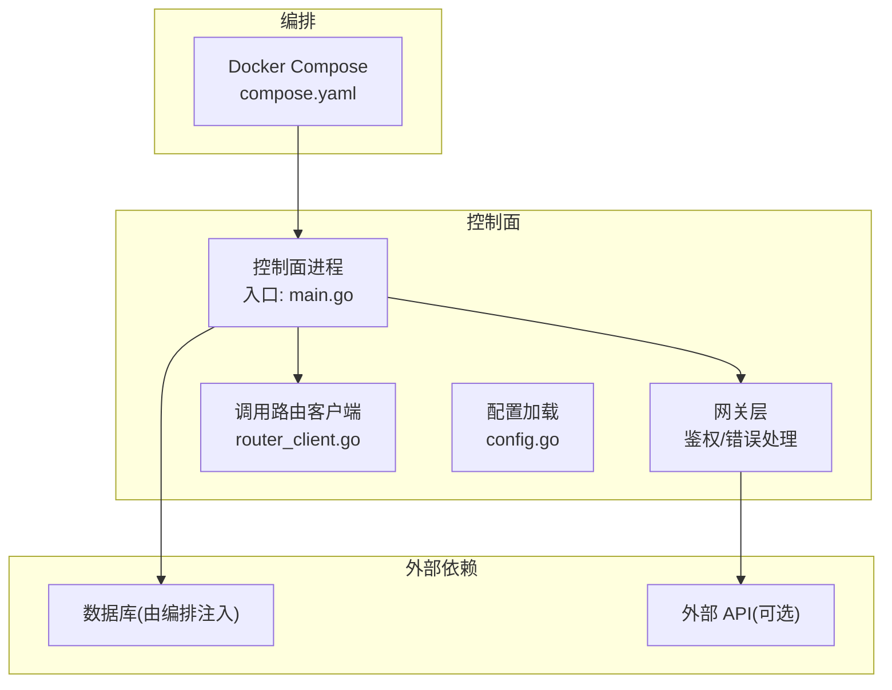
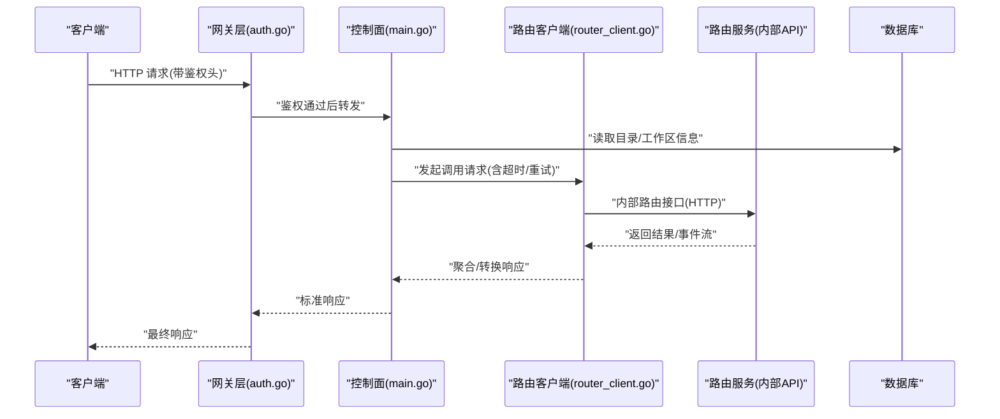
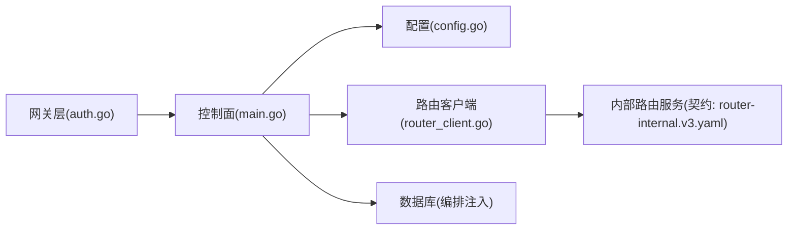
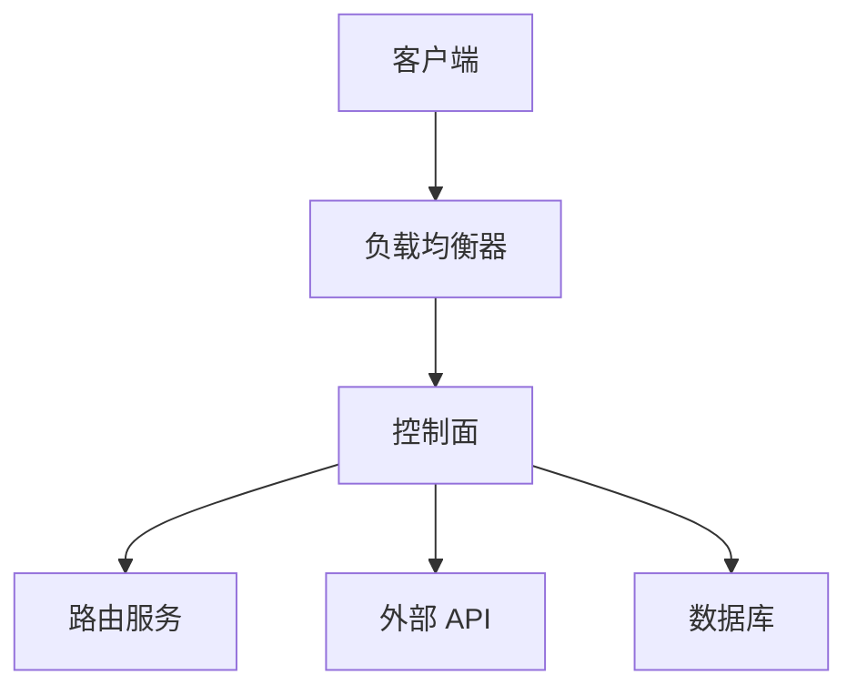

# 网络连通性问题

<cite>
**本文引用的文件**   
- [README.md](file://README.md)
- [compose.yaml](file://deploy/compose.yaml)
- [main.go](file://apps/control-plane/cmd/control-plane/main.go)
- [config.go](file://apps/control-plane/internal/config/config.go)
- [auth.go](file://apps/control-plane/internal/gateway/auth.go)
- [errors.go](file://apps/control-plane/internal/gateway/errors.go)
- [router_client.go](file://apps/control-plane/internal/invocation/router_client.go)
- [service.go](file://apps/control-plane/internal/invocation/service.go)
- [control-plane.v2.yaml](file://contracts/openapi/control-plane.v2.yaml)
- [router-internal.v3.yaml](file://contracts/openapi/router-internal.v3.yaml)
</cite>

## 目录
1. [简介](#简介)
2. [项目结构](#项目结构)
3. [核心组件](#核心组件)
4. [架构总览](#架构总览)
5. [详细组件分析](#详细组件分析)
6. [依赖关系分析](#依赖关系分析)
7. [性能与可靠性考虑](#性能与可靠性考虑)
8. [故障排查指南](#故障排查指南)
9. [结论](#结论)
10. [附录](#附录)

## 简介
本指南面向 NeKiro 平台运维与研发人员，聚焦网络连通性问题的系统化排查与治理。内容覆盖服务间通信、外部 API 调用、负载均衡、防火墙策略、DNS 解析、SSL/TLS 证书校验、超时与重试、连接池、监控与告警、以及微服务拓扑与通信模式。文档结合仓库中的控制面入口、网关鉴权、路由客户端、OpenAPI 契约与部署编排等关键实现，提供可操作的诊断步骤与最佳实践。

## 项目结构
NeKiro 采用多应用与合约分离的仓库组织方式：
- apps/control-plane：控制面主程序、配置、网关、工作区与目录管理、调用路由等模块
- contracts/openapi：对外与内部接口契约（OpenAPI）
- deploy/compose.yaml：本地/测试环境编排定义
- docs：架构与设计决策文档

图表来源
- [main.go](file://apps/control-plane/cmd/control-plane/main.go)
- [config.go](file://apps/control-plane/internal/config/config.go)
- [auth.go](file://apps/control-plane/internal/gateway/auth.go)
- [router_client.go](file://apps/control-plane/internal/invocation/router_client.go)
- [compose.yaml](file://deploy/compose.yaml)

章节来源
- [README.md](file://README.md)
- [compose.yaml](file://deploy/compose.yaml)
- [main.go](file://apps/control-plane/cmd/control-plane/main.go)

## 核心组件
- 控制面入口与生命周期：负责初始化配置、启动 HTTP 服务、注册路由、优雅关闭等
- 网关鉴权与错误处理：统一鉴权拦截、标准化错误响应、跨域与安全头设置
- 调用路由客户端：封装对下游路由服务的 HTTP 调用，包含超时、重试、熔断等策略
- 配置中心：集中化加载网络相关参数（端口、TLS、代理、超时、重试、健康检查等）
- OpenAPI 契约：明确控制面与内部路由接口的协议边界，便于联调与回归

章节来源
- [main.go](file://apps/control-plane/cmd/control-plane/main.go)
- [config.go](file://apps/control-plane/internal/config/config.go)
- [auth.go](file://apps/control-plane/internal/gateway/auth.go)
- [errors.go](file://apps/control-plane/internal/gateway/errors.go)
- [router_client.go](file://apps/control-plane/internal/invocation/router_client.go)
- [control-plane.v2.yaml](file://contracts/openapi/control-plane.v2.yaml)
- [router-internal.v3.yaml](file://contracts/openapi/router-internal.v3.yaml)

## 架构总览
下图展示控制面在典型请求路径中的网络交互：客户端通过网关进入控制面，控制面根据业务需要访问目录、工作区或转发到路由服务；所有出站调用均受配置与客户端策略约束。

图表来源
- [main.go](file://apps/control-plane/cmd/control-plane/main.go)
- [auth.go](file://apps/control-plane/internal/gateway/auth.go)
- [router_client.go](file://apps/control-plane/internal/invocation/router_client.go)
- [control-plane.v2.yaml](file://contracts/openapi/control-plane.v2.yaml)
- [router-internal.v3.yaml](file://contracts/openapi/router-internal.v3.yaml)

## 详细组件分析

### 控制面入口与生命周期
- 职责：加载配置、初始化日志与指标、创建 HTTP 服务器、注册路由、监听端口、优雅停机
- 网络关键点：监听地址与端口、TLS 终止、反向代理兼容、健康检查端点暴露
- 建议：将端口与 TLS 配置外置至环境变量或配置文件，避免硬编码；为健康检查提供独立端点并启用就绪探针

章节来源
- [main.go](file://apps/control-plane/cmd/control-plane/main.go)
- [config.go](file://apps/control-plane/internal/config/config.go)

### 网关鉴权与安全头
- 职责：统一鉴权拦截、提取上下文、设置安全响应头、标准化错误码
- 网络关键点：跨域策略、请求体大小限制、上游超时透传、代理头部保留
- 建议：严格校验鉴权头来源；对上游失败进行快速失败与降级；记录关键网络错误以便定位

章节来源
- [auth.go](file://apps/control-plane/internal/gateway/auth.go)
- [errors.go](file://apps/control-plane/internal/gateway/errors.go)

### 调用路由客户端
- 职责：封装对内部路由服务的 HTTP 调用，包括连接复用、超时、重试、退避、熔断、指标上报
- 网络关键点：目标地址解析、连接池大小、Keep-Alive、TLS 验证、代理支持、错误分类
- 建议：区分瞬态错误与非瞬态错误；为长耗时操作使用更长的超时；对下游不可用实施指数退避与熔断

章节来源
- [router_client.go](file://apps/control-plane/internal/invocation/router_client.go)
- [service.go](file://apps/control-plane/internal/invocation/service.go)

### 配置项（网络相关）
- 常见键位（示例）：服务监听端口、TLS 证书与密钥、上游代理、DNS 解析策略、连接超时、读写超时、最大空闲连接、重试次数、熔断阈值、健康检查路径
- 建议：按环境隔离配置；敏感信息通过密钥管理服务注入；变更需灰度发布并配合回滚预案

章节来源
- [config.go](file://apps/control-plane/internal/config/config.go)

### OpenAPI 契约与联调
- 控制面对外接口：用于编排、安装、工作区管理等
- 内部路由接口：控制面与路由服务之间的稳定契约
- 建议：以契约驱动开发；在 CI 中执行兼容性测试；对不兼容变更进行版本化管理

章节来源
- [control-plane.v2.yaml](file://contracts/openapi/control-plane.v2.yaml)
- [router-internal.v3.yaml](file://contracts/openapi/router-internal.v3.yaml)

## 依赖关系分析
- 组件耦合：网关层依赖鉴权与错误处理；控制面依赖配置与路由客户端；路由客户端依赖内部路由服务
- 外部依赖：数据库、外部 API（可选）、容器编排（Compose/Kubernetes）
- 风险点：单点依赖（如路由服务）、DNS 缓存导致的路径失效、证书过期、连接池耗尽

图表来源
- [auth.go](file://apps/control-plane/internal/gateway/auth.go)
- [main.go](file://apps/control-plane/cmd/control-plane/main.go)
- [config.go](file://apps/control-plane/internal/config/config.go)
- [router_client.go](file://apps/control-plane/internal/invocation/router_client.go)
- [router-internal.v3.yaml](file://contracts/openapi/router-internal.v3.yaml)

章节来源
- [auth.go](file://apps/control-plane/internal/gateway/auth.go)
- [main.go](file://apps/control-plane/cmd/control-plane/main.go)
- [config.go](file://apps/control-plane/internal/config/config.go)
- [router_client.go](file://apps/control-plane/internal/invocation/router_client.go)
- [router-internal.v3.yaml](file://contracts/openapi/router-internal.v3.yaml)

## 性能与可靠性考虑
- 连接复用与 Keep-Alive：合理设置最大空闲连接与空闲时间，减少握手开销
- 超时分层：读/写/连接/整体超时分级配置，避免级联雪崩
- 重试与退避：仅对幂等操作重试，使用指数退避与抖动，限制最大重试次数
- 熔断与舱壁：对不稳定下游实施熔断与隔离，保护主流程
- 健康检查：就绪/存活探针与慢依赖检测，提前剔除异常实例
- 指标与追踪：记录 QPS、延迟分布、错误率、连接池状态、TLS 握手耗时

[本节为通用指导，无需代码来源]

## 故障排查指南

### 常见问题与定位思路
- 连接拒绝
  - 现象：TCP 三次握手失败或立即被 RST
  - 排查：确认目标端口是否监听、防火墙/安全组规则、容器网络连通性、服务实例是否就绪
  - 工具：nc/telnet、ss/netstat、iptables/nftables、容器网络命令
- DNS 解析失败
  - 现象：域名无法解析或解析到旧 IP
  - 排查：检查系统/容器 DNS 配置、缓存、上游解析器可用性、TTL 影响
  - 工具：nslookup/dig/host、cat /etc/resolv.conf、容器内 resolv.conf
- SSL/TLS 证书问题
  - 现象：握手失败、证书不受信任、SNI 不匹配、证书过期
  - 排查：核对证书链、主机名匹配、时区与时钟同步、中间 CA 完整性
  - 工具：openssl s_client、curl -v、浏览器开发者工具
- 超时与半开连接
  - 现象：请求长时间挂起后失败
  - 排查：逐层测量端到端延迟，识别瓶颈（网关/代理/后端/数据库），调整超时与重试
  - 工具：curl/wget、tcpdump、Wireshark、APM 指标
- 负载均衡与健康检查
  - 现象：流量打向不健康实例
  - 排查：确认健康检查端点可达性与语义、探针间隔与阈值、实例资源水位
  - 工具：健康检查脚本、负载均衡器日志、实例资源监控

### 分场景排查清单
- 服务间通信（控制面 -> 路由服务）
  - 验证内部 API 契约与端口可达
  - 检查路由服务实例数与副本状态
  - 观察路由客户端的连接池与重试指标
- 外部 API 调用（控制面 -> 第三方）
  - 确认出口 IP 白名单、代理配置、证书信任链
  - 针对限流/配额/地域限制进行对比测试
- 负载均衡
  - 校验会话保持策略、权重与亲和性
  - 关注后端实例差异导致的响应不一致
- 防火墙与安全组
  - 核对入站/出站规则、NAT 映射、VPC 路由表
  - 验证云厂商控制台与实际生效规则一致性

### 常用诊断命令与方法
- 端口与连通性
  - nc -zv <host> <port>
  - curl -v --connect-timeout 5 --max-time 10 https://<host>/healthz
- 路由追踪
  - traceroute/mtr <host>
- DNS 解析
  - dig +short <domain> @<dns-server>
- TLS 验证
  - openssl s_client -connect <host>:443 -servername <sni>
- 抓包分析
  - tcpdump -i any host <ip> and port <port> -w capture.pcap

[本节为通用指导，无需代码来源]

## 结论
网络连通性是平台稳定性的基石。通过清晰的架构边界、严格的契约治理、完善的配置与策略、以及体系化的监控与排障手段，可以显著降低网络类故障的发生概率与恢复时间。建议在上线前完成全链路压测与混沌演练，持续优化超时、重试、熔断与健康检查策略。

[本节为总结性内容，无需代码来源]

## 附录

### 微服务网络拓扑与通信模式
- 拓扑要点
  - 控制面作为统一入口，承载鉴权、路由与编排能力
  - 内部路由服务负责任务分发与结果收集
  - 外部 API 按需接入，具备隔离与熔断
- 通信模式
  - 同步 HTTP 调用为主，必要时引入异步事件与消息队列
  - 对长耗时操作采用流式传输或轮询机制

[此图为概念性拓扑，无需代码来源]

### 监控与故障转移配置建议
- 监控指标
  - 连接建立耗时、TLS 握手耗时、QPS、P95/P99 延迟、错误率、重试率、熔断触发次数
- 告警策略
  - 基于阈值与趋势双维度告警；区分 P0/P1 级别
- 故障转移
  - 多可用区部署、自动切换健康实例、灰度发布与快速回滚
  - 对下游不可用启用降级路径与默认响应

[本节为通用指导，无需代码来源]