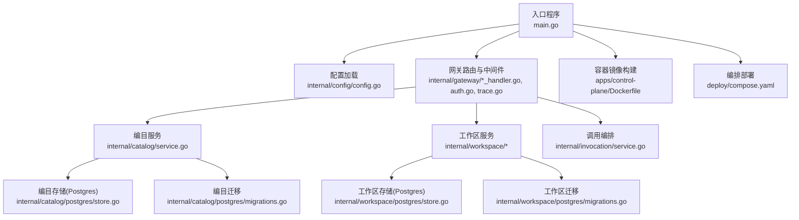
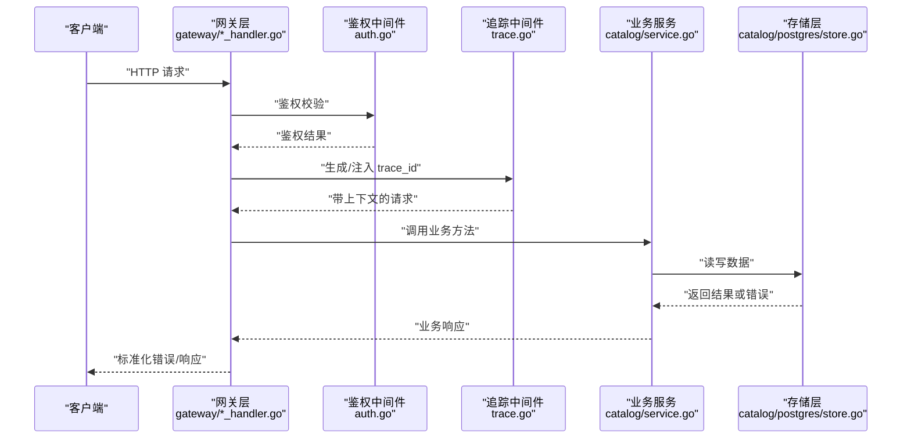
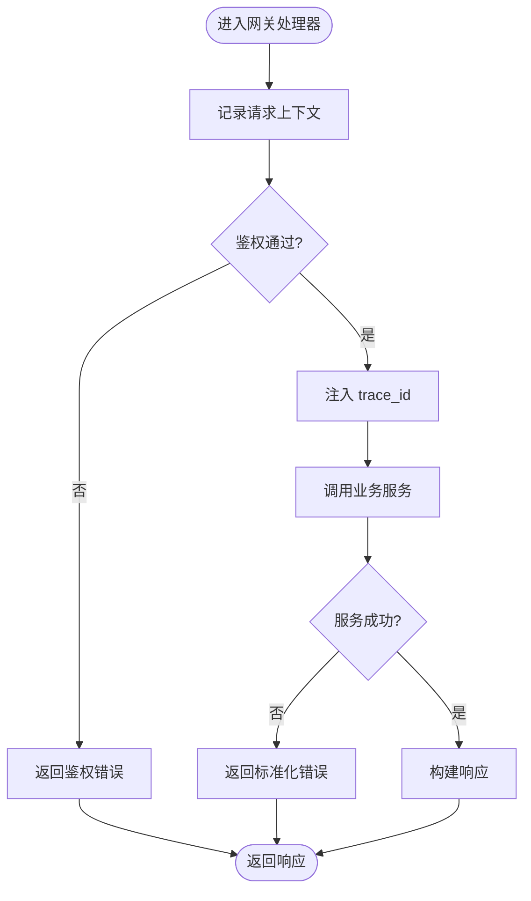
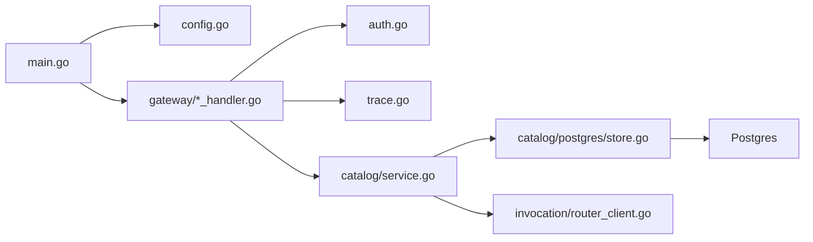

# 调试工具和技巧

<cite>
**本文引用的文件**   
- [README.md](file://README.md)
- [main.go](file://apps/control-plane/cmd/control-plane/main.go)
- [config.go](file://apps/control-plane/internal/config/config.go)
- [trace.go](file://apps/control-plane/internal/gateway/trace.go)
- [errors.go](file://apps/control-plane/internal/gateway/errors.go)
- [catalog_handler.go](file://apps/control-plane/internal/gateway/catalog_handler.go)
- [invocation_handler.go](file://apps/control-plane/internal/gateway/invocation_handler.go)
- [workspace_handler.go](file://apps/control-plane/internal/gateway/workspace_handler.go)
- [auth.go](file://apps/control-plane/internal/gateway/auth.go)
- [service.go](file://apps/control-plane/internal/catalog/service.go)
- [store.go](file://apps/control-plane/internal/catalog/store.go)
- [router_client.go](file://apps/control-plane/internal/invocation/router_client.go)
- [service.go](file://apps/control-plane/internal/invocation/service.go)
- [migrations.go](file://apps/control-plane/internal/catalog/postgres/migrations.go)
- [store.go](file://apps/control-plane/internal/workspace/postgres/store.go)
- [migrations.go](file://apps/control-plane/internal/workspace/postgres/migrations.go)
- [compose.yaml](file://deploy/compose.yaml)
- [Dockerfile](file://apps/control-plane/Dockerfile)
- [ci.yml](file://.github/workflows/ci.yml)
- [local-development.md](file://docs/runbooks/local-development.md)
- [go.mod](file://go.mod)
</cite>

## 目录
1. [简介](#简介)
2. [项目结构](#项目结构)
3. [核心组件](#核心组件)
4. [架构总览](#架构总览)
5. [详细组件分析](#详细组件分析)
6. [依赖分析](#依赖分析)
7. [性能考虑](#性能考虑)
8. [故障排查指南](#故障排查指南)
9. [结论](#结论)
10. [附录](#附录)

## 简介
本指南面向 NeKiro 平台的开发者与运维人员，系统化介绍调试工具与技巧。内容覆盖：
- 内置调试能力：结构化日志、请求追踪、错误码规范
- 第三方调试工具：Go 语言断点调试、HTTP 接口测试、数据库迁移验证
- 日志收集与分析：本地与容器化环境下的日志采集策略
- 断点调试配置：IDE 与远程调试
- 性能剖析：CPU/内存/Goroutine 剖析方法
- 单测与集成测试的调试方法
- 生产环境远程调试注意事项
- 常用调试命令与脚本示例
- 调试信息标准化格式与最佳实践

## 项目结构
NeKiro 控制面服务位于 apps/control-plane，采用 Go 模块化组织，入口为 main.go；网关层在 internal/gateway，业务逻辑在 catalog、workspace、invocation 等子包；数据访问通过 postgres 子包进行迁移与存储实现；部署使用 Docker 与 Compose；CI 流水线定义在 .github/workflows/ci.yml。

图表来源
- [main.go:1-200](file://apps/control-plane/cmd/control-plane/main.go#L1-L200)
- [config.go:1-200](file://apps/control-plane/internal/config/config.go#L1-L200)
- [catalog_handler.go:1-200](file://apps/control-plane/internal/gateway/catalog_handler.go#L1-L200)
- [invocation_handler.go:1-200](file://apps/control-plane/internal/gateway/invocation_handler.go#L1-L200)
- [workspace_handler.go:1-200](file://apps/control-plane/internal/gateway/workspace_handler.go#L1-L200)
- [auth.go:1-200](file://apps/control-plane/internal/gateway/auth.go#L1-L200)
- [trace.go:1-200](file://apps/control-plane/internal/gateway/trace.go#L1-L200)
- [service.go:1-200](file://apps/control-plane/internal/catalog/service.go#L1-L200)
- [store.go:1-200](file://apps/control-plane/internal/catalog/store.go#L1-L200)
- [migrations.go:1-200](file://apps/control-plane/internal/catalog/postgres/migrations.go#L1-L200)
- [store.go:1-200](file://apps/control-plane/internal/workspace/postgres/store.go#L1-L200)
- [migrations.go:1-200](file://apps/control-plane/internal/workspace/postgres/migrations.go#L1-L200)
- [Dockerfile:1-200](file://apps/control-plane/Dockerfile#L1-L200)
- [compose.yaml:1-200](file://deploy/compose.yaml#L1-L200)

章节来源
- [README.md:1-200](file://README.md#L1-L200)
- [main.go:1-200](file://apps/control-plane/cmd/control-plane/main.go#L1-L200)
- [config.go:1-200](file://apps/control-plane/internal/config/config.go#L1-L200)
- [compose.yaml:1-200](file://deploy/compose.yaml#L1-L200)
- [Dockerfile:1-200](file://apps/control-plane/Dockerfile#L1-L200)
- [ci.yml:1-200](file://.github/workflows/ci.yml#L1-L200)

## 核心组件
- 入口与启动流程：负责解析配置、初始化日志与追踪、注册路由、启动 HTTP 服务器与优雅关闭。
- 配置系统：集中管理环境变量、配置文件与默认值，便于在不同环境切换调试级别。
- 网关层：统一处理鉴权、追踪、错误格式化与路由分发，提供一致的调试上下文（如 trace_id）。
- 业务服务：编目、工作区、调用编排等服务封装领域逻辑，配合存储层完成数据持久化。
- 存储与迁移：基于 Postgres 的数据访问与迁移脚本，支持本地与 CI 环境的快速搭建。
- 容器与编排：Dockerfile 与 compose.yaml 提供可复现的运行环境与调试场景。

章节来源
- [main.go:1-200](file://apps/control-plane/cmd/control-plane/main.go#L1-L200)
- [config.go:1-200](file://apps/control-plane/internal/config/config.go#L1-L200)
- [catalog_handler.go:1-200](file://apps/control-plane/internal/gateway/catalog_handler.go#L1-L200)
- [invocation_handler.go:1-200](file://apps/control-plane/internal/gateway/invocation_handler.go#L1-L200)
- [workspace_handler.go:1-200](file://apps/control-plane/internal/gateway/workspace_handler.go#L1-L200)
- [auth.go:1-200](file://apps/control-plane/internal/gateway/auth.go#L1-L200)
- [trace.go:1-200](file://apps/control-plane/internal/gateway/trace.go#L1-L200)
- [service.go:1-200](file://apps/control-plane/internal/catalog/service.go#L1-L200)
- [store.go:1-200](file://apps/control-plane/internal/catalog/store.go#L1-L200)
- [migrations.go:1-200](file://apps/control-plane/internal/catalog/postgres/migrations.go#L1-L200)
- [store.go:1-200](file://apps/control-plane/internal/workspace/postgres/store.go#L1-L200)
- [migrations.go:1-200](file://apps/control-plane/internal/workspace/postgres/migrations.go#L1-L200)

## 架构总览
下图展示从客户端到网关、服务与存储的完整链路，并标注调试关键节点（日志、追踪、错误）。

图表来源
- [catalog_handler.go:1-200](file://apps/control-plane/internal/gateway/catalog_handler.go#L1-L200)
- [auth.go:1-200](file://apps/control-plane/internal/gateway/auth.go#L1-L200)
- [trace.go:1-200](file://apps/control-plane/internal/gateway/trace.go#L1-L200)
- [service.go:1-200](file://apps/control-plane/internal/catalog/service.go#L1-L200)
- [store.go:1-200](file://apps/control-plane/internal/catalog/store.go#L1-L200)

## 详细组件分析

### 网关层调试要点
- 结构化日志：在每个处理器入口处记录请求元数据（方法、路径、参数摘要、用户标识），并在出口记录耗时与状态码。
- 追踪上下文：通过中间件注入 trace_id，贯穿所有下游调用，便于跨服务关联日志。
- 错误规范化：统一错误类型与消息模板，避免泄露敏感信息，同时保留内部错误码用于排障。
- 鉴权失败定位：明确区分未认证与未授权，输出最小必要上下文以便快速定位问题。

图表来源
- [catalog_handler.go:1-200](file://apps/control-plane/internal/gateway/catalog_handler.go#L1-L200)
- [auth.go:1-200](file://apps/control-plane/internal/gateway/auth.go#L1-L200)
- [trace.go:1-200](file://apps/control-plane/internal/gateway/trace.go#L1-L200)
- [errors.go:1-200](file://apps/control-plane/internal/gateway/errors.go#L1-L200)

章节来源
- [catalog_handler.go:1-200](file://apps/control-plane/internal/gateway/catalog_handler.go#L1-L200)
- [invocation_handler.go:1-200](file://apps/control-plane/internal/gateway/invocation_handler.go#L1-L200)
- [workspace_handler.go:1-200](file://apps/control-plane/internal/gateway/workspace_handler.go#L1-L200)
- [auth.go:1-200](file://apps/control-plane/internal/gateway/auth.go#L1-L200)
- [trace.go:1-200](file://apps/control-plane/internal/gateway/trace.go#L1-L200)
- [errors.go:1-200](file://apps/control-plane/internal/gateway/errors.go#L1-L200)

### 配置与环境调试
- 环境变量优先：通过配置模块读取环境变量，便于在本地、容器与 CI 中差异化设置。
- 调试开关：提供日志级别、追踪开关、慢查询阈值等开关项，按需开启以缩小问题范围。
- 默认值与校验：对必填项进行校验并提供清晰的错误提示，避免运行期崩溃。

章节来源
- [config.go:1-200](file://apps/control-plane/internal/config/config.go#L1-L200)

### 存储与迁移调试
- 迁移顺序与幂等：确保迁移脚本按序执行且具备幂等性，避免重复应用导致异常。
- 连接与超时：合理设置连接池、超时与重试策略，结合日志定位数据库侧问题。
- 数据一致性：在事务边界内记录关键操作，便于回滚与审计。

章节来源
- [migrations.go:1-200](file://apps/control-plane/internal/catalog/postgres/migrations.go#L1-L200)
- [store.go:1-200](file://apps/control-plane/internal/catalog/store.go#L1-L200)
- [migrations.go:1-200](file://apps/control-plane/internal/workspace/postgres/migrations.go#L1-L200)
- [store.go:1-200](file://apps/control-plane/internal/workspace/postgres/store.go#L1-L200)

### 调用编排与外部依赖
- 路由客户端：封装对外部路由服务的调用，记录请求/响应摘要与错误码，便于端到端追踪。
- 重试与熔断：针对不稳定依赖实施重试与熔断策略，降低级联故障风险。
- 超时控制：为每个下游调用设置合理的超时时间，避免阻塞主流程。

章节来源
- [router_client.go:1-200](file://apps/control-plane/internal/invocation/router_client.go#L1-L200)
- [service.go:1-200](file://apps/control-plane/internal/invocation/service.go#L1-L200)

## 依赖分析
- 直接依赖：入口程序依赖配置、网关、服务与存储；网关依赖鉴权与追踪中间件。
- 间接依赖：服务依赖存储与外部路由客户端；存储依赖数据库驱动与迁移脚本。
- 潜在循环：应避免服务与存储之间的双向依赖，保持单向调用链。
- 外部集成：Postgres 数据库、可能的遥测/指标后端（由配置决定）。

图表来源
- [main.go:1-200](file://apps/control-plane/cmd/control-plane/main.go#L1-L200)
- [config.go:1-200](file://apps/control-plane/internal/config/config.go#L1-L200)
- [catalog_handler.go:1-200](file://apps/control-plane/internal/gateway/catalog_handler.go#L1-L200)
- [auth.go:1-200](file://apps/control-plane/internal/gateway/auth.go#L1-L200)
- [trace.go:1-200](file://apps/control-plane/internal/gateway/trace.go#L1-L200)
- [service.go:1-200](file://apps/control-plane/internal/catalog/service.go#L1-L200)
- [store.go:1-200](file://apps/control-plane/internal/catalog/store.go#L1-L200)
- [router_client.go:1-200](file://apps/control-plane/internal/invocation/router_client.go#L1-L200)

章节来源
- [go.mod:1-200](file://go.mod#L1-L200)

## 性能考虑
- 日志开销：在生产环境降低日志级别，仅保留关键事件；对高频路径使用采样日志。
- 追踪开销：对热点接口启用轻量级追踪，避免过度采样影响吞吐。
- 数据库性能：关注慢查询与锁竞争，结合索引与分页优化；监控连接池使用率。
- Goroutine 泄漏：定期抓取 goroutine 快照，检查未退出的协程与资源释放。
- 内存峰值：关注大对象分配与缓存策略，避免频繁 GC 抖动。

[本节为通用指导，不直接分析具体文件]

## 故障排查指南

### 日志收集与分析技巧
- 本地开发：将结构化日志输出至 stdout，便于 IDE 控制台查看与过滤。
- 容器化：使用 docker logs 或编排平台日志聚合器收集；建议开启 JSON 格式以便解析。
- 关键字检索：利用 trace_id 串联一次请求的全链路日志；结合错误码快速定位根因。
- 告警规则：对特定错误码与慢请求阈值建立告警，缩短 MTTR。

章节来源
- [compose.yaml:1-200](file://deploy/compose.yaml#L1-L200)
- [Dockerfile:1-200](file://apps/control-plane/Dockerfile#L1-L200)

### 断点调试配置
- 本地断点：在 IDE 中为网关处理器与服务方法设置断点，逐步执行观察上下文。
- 条件断点：根据 trace_id 或用户标识设置条件，减少无关中断。
- 远程调试：在容器镜像中暴露调试端口，并通过 IDE 远程附加进程进行断点调试。

章节来源
- [Dockerfile:1-200](file://apps/control-plane/Dockerfile#L1-L200)

### 性能剖析工具使用
- CPU 剖析：在服务运行时生成 CPU profile，分析热点函数与调用栈。
- 内存剖析：生成 heap profile，识别大对象与内存泄漏。
- Goroutine 剖析：导出 goroutine 快照，检查阻塞与泄漏。
- 基准测试：对关键路径编写基准用例，量化优化效果。

[本节为通用指导，不直接分析具体文件]

### 单元测试与集成测试调试
- 单测调试：在测试文件中设置断点，使用测试框架的调试模式逐步执行。
- 集成测试：使用本地数据库与 mock 外部依赖，构造稳定可复现的场景。
- 数据准备：通过 fixtures 与迁移脚本准备初始数据，确保测试一致性。
- 并行测试：注意并发冲突，必要时串行化关键测试用例。

章节来源
- [ci.yml:1-200](file://.github/workflows/ci.yml#L1-L200)
- [migrations.go:1-200](file://apps/control-plane/internal/catalog/postgres/migrations.go#L1-L200)
- [migrations.go:1-200](file://apps/control-plane/internal/workspace/postgres/migrations.go#L1-L200)

### 生产环境远程调试技巧与注意事项
- 安全加固：限制调试端口访问范围，使用 TLS 与强认证保护调试通道。
- 低影响：仅在必要时开启远程调试，避免对线上性能造成显著影响。
- 变更隔离：在灰度或金丝雀环境中先行验证，再逐步扩大范围。
- 审计留痕：记录调试会话的开始与结束，便于事后审计与回溯。

[本节为通用指导，不直接分析具体文件]

### 常用调试命令与脚本示例
- 本地启动：参考本地开发手册，使用 compose 拉起依赖并启动服务。
- 日志查看：使用 docker logs 或编排平台 UI 查看实时日志。
- 数据库连接：通过迁移脚本验证连通性与版本一致性。
- 接口测试：使用 curl 或 HTTP 客户端发送请求，附带 trace_id 进行追踪。

章节来源
- [local-development.md:1-200](file://docs/runbooks/local-development.md#L1-L200)
- [compose.yaml:1-200](file://deploy/compose.yaml#L1-L200)

### 调试信息标准化格式与最佳实践
- 字段规范：包含时间戳、级别、trace_id、请求 ID、用户标识、模块名、消息体。
- 敏感信息脱敏：避免记录密码、令牌、个人身份信息。
- 错误分层：区分业务错误与系统错误，提供可读消息与内部错误码。
- 一致性：全链路遵循同一日志与追踪格式，便于聚合与分析。

[本节为通用指导，不直接分析具体文件]

## 结论
通过统一的日志与追踪体系、规范的错误处理、完善的测试与性能剖析手段，NeKiro 平台能够在开发与生产环境中高效定位与解决问题。建议在团队内推广上述最佳实践，持续优化调试体验与稳定性。

[本节为总结性内容，不直接分析具体文件]

## 附录
- 术语表：trace_id、结构化日志、慢查询、goroutine 剖析等
- 参考链接：本地开发手册、CI 流水线说明、部署编排文档

[本节为补充信息，不直接分析具体文件]